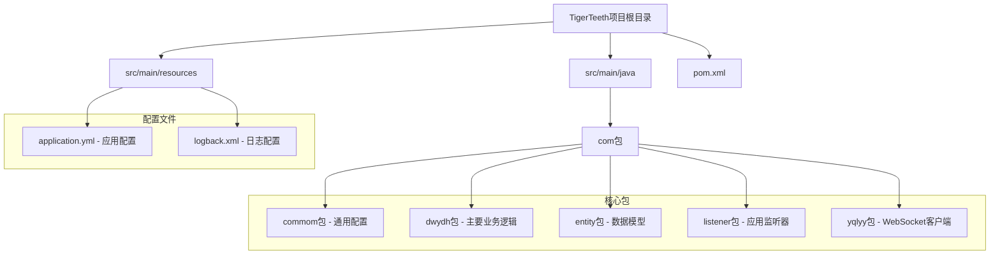
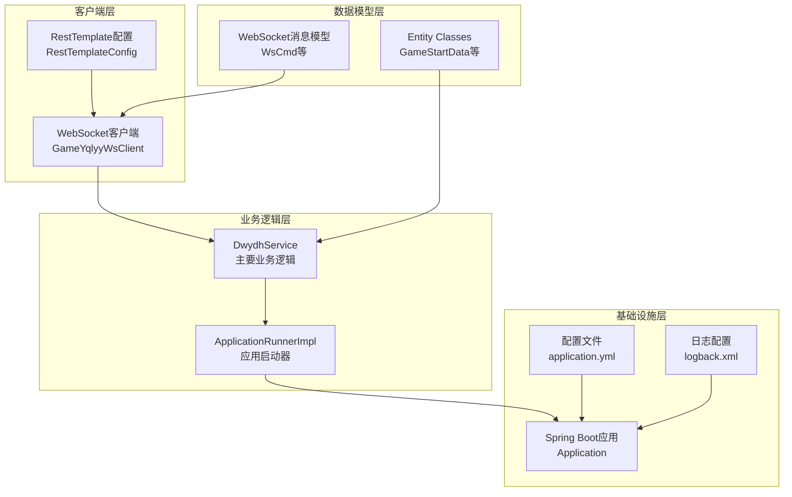
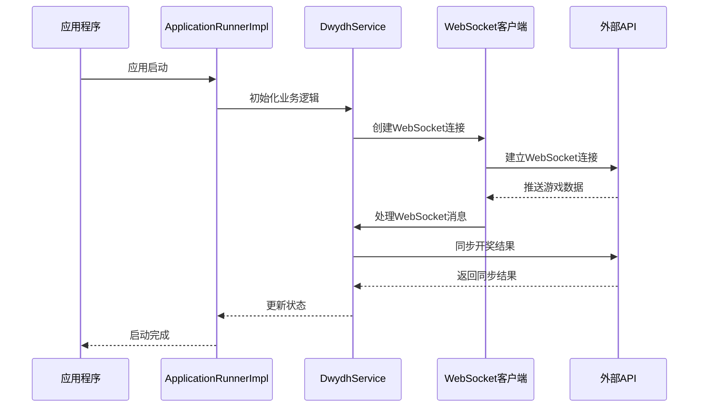
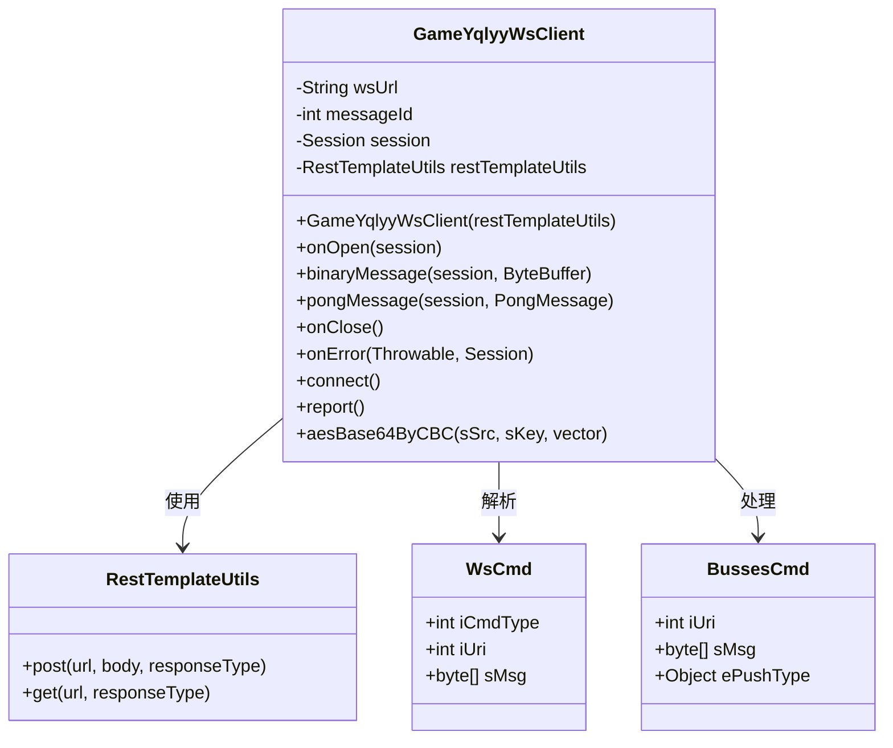
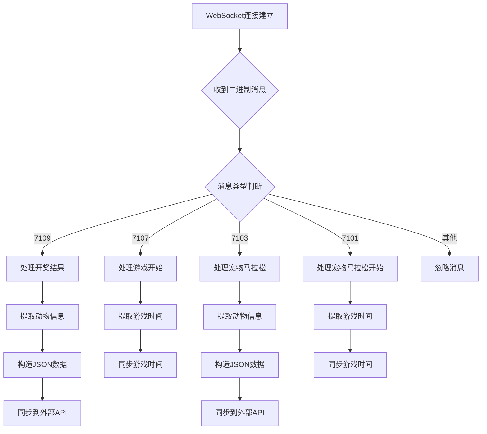
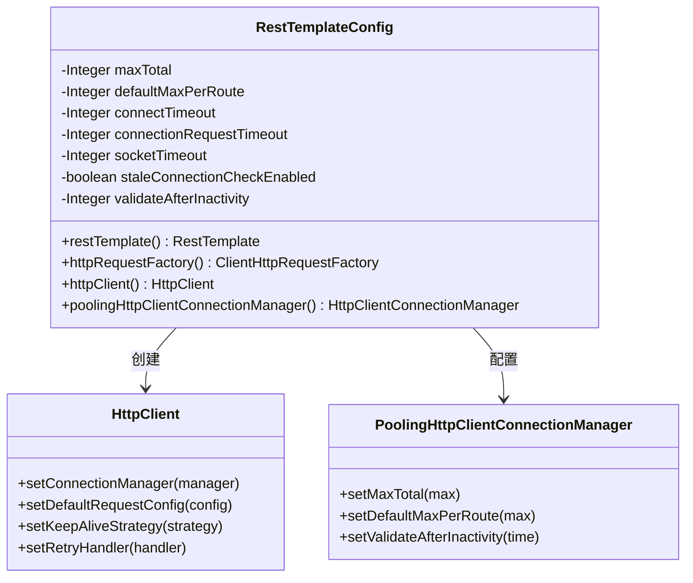
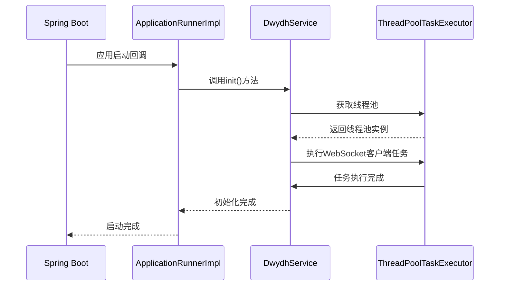
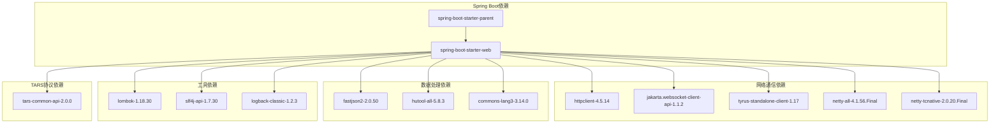

# 开发环境搭建

<cite>
**本文档引用的文件**
- [pom.xml](file://pom.xml)
- [application.yml](file://src/main/resources/application.yml)
- [Application.java](file://src/main/java/com/Application.java)
- [RestTemplateConfig.java](file://src/main/java/com/commom/RestTemplateConfig.java)
- [DwydhService.java](file://src/main/java/com/dwydh/DwydhService.java)
- [ApplicationRunnerImpl.java](file://src/main/java/com/listener/ApplicationRunnerImpl.java)
- [GameYqlyyWsClient.java](file://src/main/java/com/yqlyy/GameYqlyyWsClient.java)
- [logback.xml](file://src/main/resources/logback.xml)
</cite>

## 目录
1. [简介](#简介)
2. [项目结构](#项目结构)
3. [核心组件](#核心组件)
4. [架构概览](#架构概览)
5. [详细组件分析](#详细组件分析)
6. [依赖关系分析](#依赖关系分析)
7. [性能考虑](#性能考虑)
8. [故障排除指南](#故障排除指南)
9. [结论](#结论)

## 简介

本指南为TigerTeeth项目提供完整的开发环境搭建文档。该项目是一个基于Spring Boot的虎牙直播数据爬虫系统，主要功能包括WebSocket实时数据抓取、HTTP请求处理和数据同步。项目采用Java 8开发，使用Maven作为构建工具，集成了多种第三方库用于网络通信、数据处理和日志管理。

## 项目结构

TigerTeeth项目遵循标准的Maven项目结构，主要包含以下目录结构：

**图表来源**
- [pom.xml](file://pom.xml#L1-L160)
- [application.yml](file://src/main/resources/application.yml#L1-L31)

**章节来源**
- [pom.xml](file://pom.xml#L1-L160)
- [application.yml](file://src/main/resources/application.yml#L1-L31)

## 核心组件

### 技术栈概述

项目采用以下核心技术栈：

- **后端框架**: Spring Boot 2.2.13.RELEASE
- **编程语言**: Java 8 (JDK 1.8)
- **构建工具**: Maven
- **网络通信**: Apache HttpClient 4.5.14, Netty 4.1.56.Final
- **数据处理**: FastJSON2 2.0.50, Hutool 5.8.3
- **WebSocket**: Jakarta WebSocket API 1.1.2, Tyrus 1.17
- **日志管理**: SLF4J 1.7.30, Logback 1.2.3

### 核心依赖分析

项目的主要依赖包括：

1. **Spring Boot Starter Web**: 提供Web应用基础功能
2. **Apache HttpClient**: 高级HTTP客户端，支持连接池和重试机制
3. **Netty**: 异步事件驱动的网络应用框架
4. **FastJSON2**: 高性能JSON解析库
5. **Hutool**: Java工具包，提供常用工具方法
6. **WebSocket API**: 支持WebSocket协议通信

**章节来源**
- [pom.xml](file://pom.xml#L26-L111)

## 架构概览

### 整体架构设计

**图表来源**
- [Application.java](file://src/main/java/com/Application.java#L1-L14)
- [DwydhService.java](file://src/main/java/com/dwydh/DwydhService.java#L1-L39)
- [RestTemplateConfig.java](file://src/main/java/com/commom/RestTemplateConfig.java#L1-L132)
- [application.yml](file://src/main/resources/application.yml#L1-L31)

### 数据流架构

**图表来源**
- [ApplicationRunnerImpl.java](file://src/main/java/com/listener/ApplicationRunnerImpl.java#L25-L31)
- [DwydhService.java](file://src/main/java/com/dwydh/DwydhService.java#L21-L36)
- [GameYqlyyWsClient.java](file://src/main/java/com/yqlyy/GameYqlyyWsClient.java#L221-L272)

## 详细组件分析

### WebSocket客户端组件

WebSocket客户端是项目的核心组件，负责与虎牙直播平台建立实时连接并处理游戏数据推送。

**图表来源**
- [GameYqlyyWsClient.java](file://src/main/java/com/yqlyy/GameYqlyyWsClient.java#L29-L44)
- [RestTemplateConfig.java](file://src/main/java/com/commom/RestTemplateConfig.java#L34-L65)

#### WebSocket消息处理流程

**图表来源**
- [GameYqlyyWsClient.java](file://src/main/java/com/yqlyy/GameYqlyyWsClient.java#L76-L218)

**章节来源**
- [GameYqlyyWsClient.java](file://src/main/java/com/yqlyy/GameYqlyyWsClient.java#L1-L328)

### RestTemplate配置组件

RestTemplate配置提供了HTTP客户端的连接池管理和请求配置。

**图表来源**
- [RestTemplateConfig.java](file://src/main/java/com/commom/RestTemplateConfig.java#L84-L129)

#### HTTP连接池配置参数

| 参数名称 | 默认值 | 作用描述 |
|---------|--------|----------|
| maxTotal | 100 | 连接池最大连接数 |
| defaultMaxPerRoute | 20 | 每个路由的最大连接数 |
| connectTimeout | 10000ms | 连接超时时间 |
| connectionRequestTimeout | 500ms | 从连接池获取连接超时时间 |
| socketTimeout | 30000ms | Socket超时时间 |
| validateAfterInactivity | 3000000ms | 连接空闲验证时间 |

**章节来源**
- [RestTemplateConfig.java](file://src/main/java/com/commom/RestTemplateConfig.java#L35-L54)

### 应用启动组件

应用启动组件负责在应用程序启动时初始化主要业务逻辑。

**图表来源**
- [ApplicationRunnerImpl.java](file://src/main/java/com/listener/ApplicationRunnerImpl.java#L25-L31)
- [DwydhService.java](file://src/main/java/com/dwydh/DwydhService.java#L21-L36)

**章节来源**
- [ApplicationRunnerImpl.java](file://src/main/java/com/listener/ApplicationRunnerImpl.java#L1-L34)

## 依赖关系分析

### Maven依赖关系图

**图表来源**
- [pom.xml](file://pom.xml#L26-L111)

### 版本兼容性分析

项目使用的版本组合具有良好的兼容性：

- **Java版本**: JDK 1.8完全兼容Spring Boot 2.2.13.RELEASE
- **Spring Boot版本**: 2.2.13.RELEASE支持Java 8+，提供稳定的企业级特性
- **网络库版本**: Apache HttpClient 4.5.14与Spring Boot集成良好
- **WebSocket实现**: Jakarta WebSocket API 1.1.2与Tyrus客户端配合使用

**章节来源**
- [pom.xml](file://pom.xml#L11-L23)

## 性能考虑

### 连接池优化

项目通过连接池配置实现了高效的网络资源利用：

1. **连接池大小**: 最大100个连接，每路由20个连接
2. **超时配置**: 合理的超时设置避免资源浪费
3. **连接复用**: Keep-Alive策略减少连接建立开销
4. **重试机制**: 自动重试处理临时网络故障

### 内存管理

- **WebSocket缓冲区**: 默认65536字节，支持大数据传输
- **线程池管理**: 使用Spring的ThreadPoolTaskExecutor
- **日志轮转**: Logback配置支持按日期轮转，控制磁盘占用

### 网络优化

- **HTTP客户端**: 基于Apache HttpClient，支持连接池和Keep-Alive
- **WebSocket**: 异步非阻塞处理，支持高并发连接
- **数据压缩**: 支持GZIP压缩，减少带宽消耗

## 故障排除指南

### 常见环境问题及解决方案

#### 1. Java版本不兼容问题

**问题症状**:
- 编译错误，提示Java版本不支持
- 运行时类版本不匹配异常

**解决方案**:
- 确保安装JDK 8 (1.8.x版本)
- 验证JAVA_HOME环境变量指向正确路径
- 检查PATH中Java可执行文件的优先级

#### 2. Maven依赖下载失败

**问题症状**:
- 依赖下载超时或失败
- 无法解析某些依赖版本

**解决方案**:
- 配置Maven镜像源，使用阿里云或清华镜像
- 清理本地仓库缓存：`mvn clean install -U`
- 检查网络代理设置

#### 3. WebSocket连接失败

**问题症状**:
- WebSocket连接建立失败
- 连接频繁断开重连

**解决方案**:
- 检查网络防火墙设置
- 验证WebSocket URL的有效性
- 调整连接超时参数

#### 4. 日志文件权限问题

**问题症状**:
- 日志文件无法写入
- 权限不足异常

**解决方案**:
- 确保应用程序有写入当前目录的权限
- 修改日志文件路径配置
- 检查磁盘空间是否充足

#### 5. 端口冲突问题

**问题症状**:
- 应用启动时端口被占用
- Tomcat启动失败

**解决方案**:
- 修改application.yml中的server.port配置
- 查找并终止占用端口的进程
- 使用随机端口分配

**章节来源**
- [application.yml](file://src/main/resources/application.yml#L1-L31)
- [logback.xml](file://src/main/resources/logback.xml#L1-L75)

### 调试和监控

#### 日志配置优化

项目使用Logback进行日志管理，支持以下配置：

- **控制台输出**: 实时查看应用运行状态
- **文件轮转**: 按日期自动创建新日志文件
- **级别过滤**: 分别控制INFO和ERROR级别的日志输出
- **自定义格式**: 包含时间、线程、方法名等详细信息

#### 性能监控建议

- 监控WebSocket连接数量和状态
- 跟踪HTTP请求成功率和响应时间
- 关注内存使用情况和垃圾回收频率
- 监控线程池队列长度和任务执行时间

## 结论

TigerTeeth项目提供了一个完整的虎牙直播数据爬虫解决方案，具有以下特点：

1. **技术栈成熟**: 基于Spring Boot 2.2.13.RELEASE，使用Java 8，技术栈稳定可靠
2. **架构清晰**: 采用分层架构，职责分离明确
3. **性能优化**: 通过连接池、异步处理等技术实现高性能
4. **易于维护**: 清晰的代码结构和完善的日志系统

按照本指南搭建开发环境后，开发者可以顺利运行项目并进行功能扩展。建议在开发过程中重点关注WebSocket连接稳定性、HTTP请求性能和日志监控等方面，以确保系统的稳定运行。