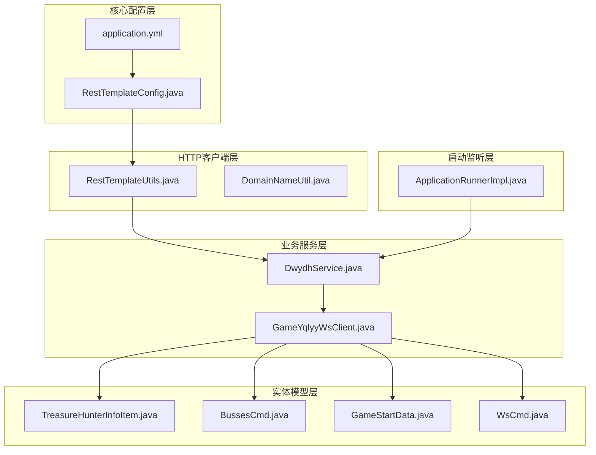
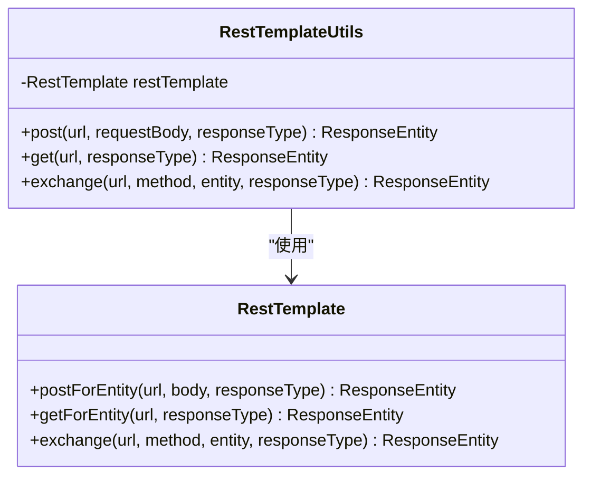
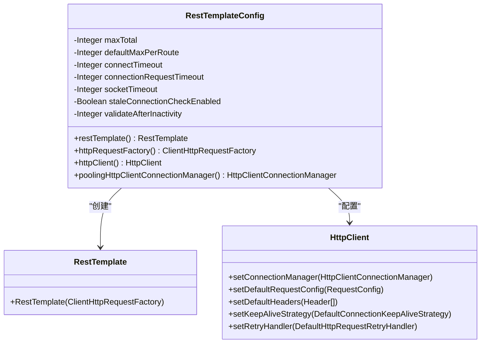
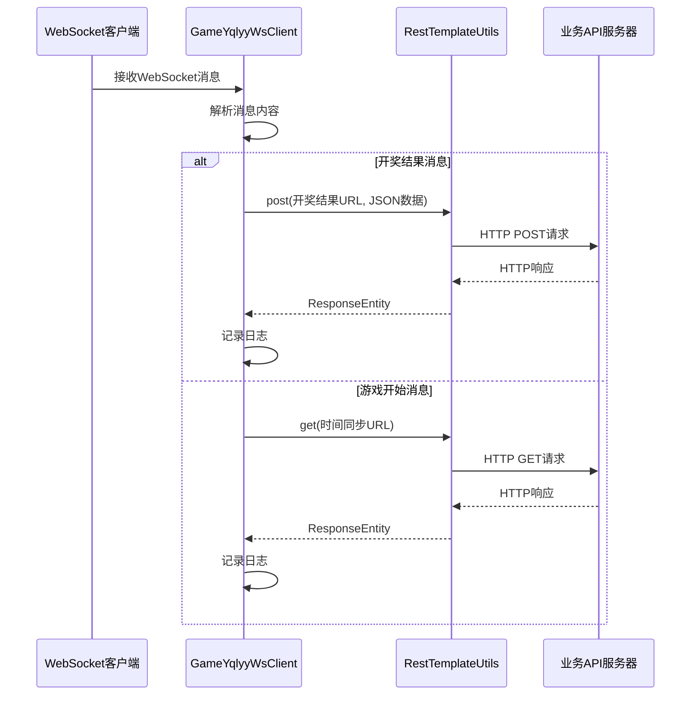
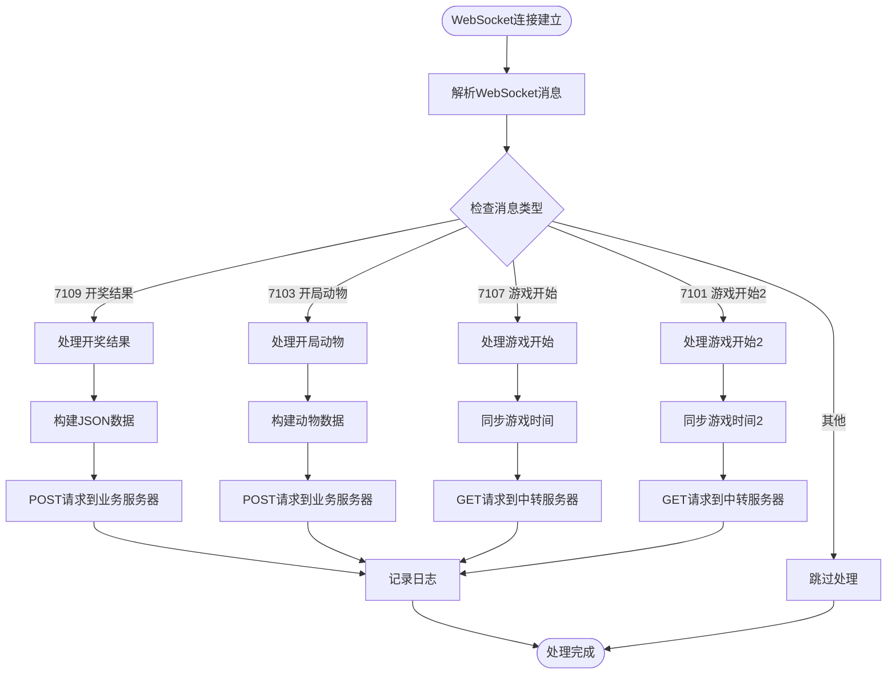
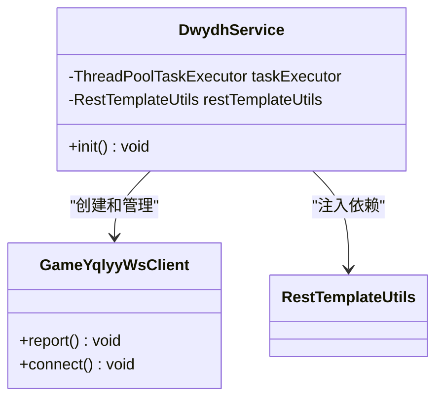
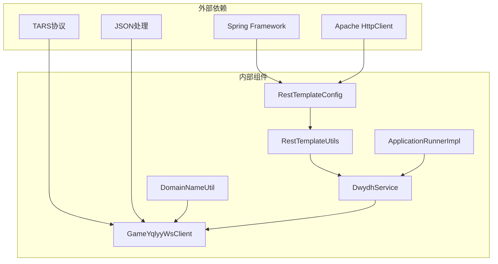

# HTTP接口扩展

<cite>
**本文档引用的文件**
- [RestTemplateUtils.java](file://src/main/java/com/commom/RestTemplateUtils.java)
- [RestTemplateConfig.java](file://src/main/java/com/commom/RestTemplateConfig.java)
- [DomainNameUtil.java](file://src/main/java/com/utils/DomainNameUtil.java)
- [GameYqlyyWsClient.java](file://src/main/java/com/yqlyy/GameYqlyyWsClient.java)
- [DwydhService.java](file://src/main/java/com/dwydh/DwydhService.java)
- [ApplicationRunnerImpl.java](file://src/main/java/com/listener/ApplicationRunnerImpl.java)
- [application.yml](file://src/main/resources/application.yml)
- [TreasureHunterInfoItem.java](file://src/main/java/com/entity/AccountedNotify/TreasureHunterInfoItem.java)
- [BussesCmd.java](file://src/main/java/com/entity/BussesCmd.java)
- [GameStartData.java](file://src/main/java/com/entity/GameStartData.java)
- [WsCmd.java](file://src/main/java/com/entity/WsCmd.java)
</cite>

## 目录
1. [简介](#简介)
2. [项目结构](#项目结构)
3. [核心组件](#核心组件)
4. [架构概览](#架构概览)
5. [详细组件分析](#详细组件分析)
6. [依赖关系分析](#依赖关系分析)
7. [性能考虑](#性能考虑)
8. [故障排除指南](#故障排除指南)
9. [结论](#结论)

## 简介

本指南详细说明了如何在现有的HTTP接口系统中进行扩展，包括在RestTemplateUtils中新增HTTP客户端扩展方法、扩展DomainNameUtil以支持新的服务器地址配置、实现HTTP接口的版本化管理策略、添加新的数据同步接口以及扩展HTTP请求的认证机制。该系统当前主要用于虎牙直播平台的数据同步，包括开奖结果和游戏时间同步功能。

## 项目结构

项目采用标准的Spring Boot Maven项目结构，主要分为以下几个模块：



**图表来源**
- [RestTemplateConfig.java](file://src/main/java/com/commom/RestTemplateConfig.java#L1-L132)
- [RestTemplateUtils.java](file://src/main/java/com/commom/RestTemplateUtils.java#L1-L31)
- [DomainNameUtil.java](file://src/main/java/com/utils/DomainNameUtil.java#L1-L16)

**章节来源**
- [RestTemplateConfig.java](file://src/main/java/com/commom/RestTemplateConfig.java#L1-L132)
- [application.yml](file://src/main/resources/application.yml#L1-L31)

## 核心组件

### RestTemplateUtils - HTTP客户端工具类

RestTemplateUtils是整个HTTP通信的核心工具类，提供了基础的HTTP请求封装：



**图表来源**
- [RestTemplateUtils.java](file://src/main/java/com/commom/RestTemplateUtils.java#L14-L30)

### RestTemplateConfig - HTTP客户端配置

RestTemplateConfig负责配置HTTP客户端的各种参数，包括连接池、超时设置、重试机制等：



**图表来源**
- [RestTemplateConfig.java](file://src/main/java/com/commom/RestTemplateConfig.java#L34-L131)

**章节来源**
- [RestTemplateUtils.java](file://src/main/java/com/commom/RestTemplateUtils.java#L1-L31)
- [RestTemplateConfig.java](file://src/main/java/com/commom/RestTemplateConfig.java#L1-L132)

## 架构概览

系统采用分层架构设计，通过WebSocket接收实时数据，然后通过HTTP接口同步到业务系统：



**图表来源**
- [GameYqlyyWsClient.java](file://src/main/java/com/yqlyy/GameYqlyyWsClient.java#L103-L117)
- [GameYqlyyWsClient.java](file://src/main/java/com/yqlyy/GameYqlyyWsClient.java#L136-L147)

## 详细组件分析

### DomainNameUtil - 服务器地址管理

DomainNameUtil目前包含两个地址数组：
- `urls`: 主要业务服务器地址列表
- `transitUrls`: 中转服务器地址列表

```mermaid
classDiagram
class DomainNameUtil {
+String[] urls
+String[] transitUrls
}
note for DomainNameUtil : "当前urls为空数组<br/>transitUrls包含本地开发地址"
```

**图表来源**
- [DomainNameUtil.java](file://src/main/java/com/utils/DomainNameUtil.java#L3-L15)

**章节来源**
- [DomainNameUtil.java](file://src/main/java/com/utils/DomainNameUtil.java#L1-L16)

### GameYqlyyWsClient - WebSocket客户端

GameYqlyyWsClient是核心的WebSocket客户端，负责与虎牙直播平台建立连接并处理各种消息类型：



**图表来源**
- [GameYqlyyWsClient.java](file://src/main/java/com/yqlyy/GameYqlyyWsClient.java#L76-L120)
- [GameYqlyyWsClient.java](file://src/main/java/com/yqlyy/GameYqlyyWsClient.java#L186-L218)

**章节来源**
- [GameYqlyyWsClient.java](file://src/main/java/com/yqlyy/GameYqlyyWsClient.java#L1-L328)

### DwydhService - 业务服务

DwydhService负责管理WebSocket客户端的生命周期，并通过线程池定期执行数据同步任务：



**图表来源**
- [DwydhService.java](file://src/main/java/com/dwydh/DwydhService.java#L14-L38)

**章节来源**
- [DwydhService.java](file://src/main/java/com/dwydh/DwydhService.java#L1-L39)

## 依赖关系分析

系统的关键依赖关系如下：



**图表来源**
- [RestTemplateConfig.java](file://src/main/java/com/commom/RestTemplateConfig.java#L1-L22)
- [GameYqlyyWsClient.java](file://src/main/java/com/yqlyy/GameYqlyyWsClient.java#L1-L27)

**章节来源**
- [ApplicationRunnerImpl.java](file://src/main/java/com/listener/ApplicationRunnerImpl.java#L1-L34)

## 性能考虑

### 连接池配置

系统通过RestTemplateConfig配置了高性能的HTTP客户端：

- **最大连接数**: 100个连接
- **路由并发限制**: 每路由20个连接
- **连接超时**: 10秒
- **请求超时**: 500毫秒
- **读取超时**: 30秒
- **连接保活**: 启用Keep-Alive策略
- **重试机制**: 自动重试2次

### WebSocket优化

- **消息缓冲区**: 文本和二进制消息缓冲区均为64KB
- **会话超时**: 30秒
- **异步发送超时**: 20秒

**章节来源**
- [RestTemplateConfig.java](file://src/main/java/com/commom/RestTemplateConfig.java#L17-L30)
- [RestTemplateConfig.java](file://src/main/java/com/commom/RestTemplateConfig.java#L117-L129)
- [GameYqlyyWsClient.java](file://src/main/java/com/yqlyy/GameYqlyyWsClient.java#L250-L272)

## 故障排除指南

### 常见问题及解决方案

#### 1. HTTP请求超时问题

**症状**: HTTP请求在指定时间内未完成响应
**原因**: 网络延迟或服务器负载过高
**解决方案**: 
- 调整application.yml中的超时参数
- 检查网络连接状态
- 实施指数退避重试策略

#### 2. WebSocket连接断开

**症状**: WebSocket连接意外断开
**原因**: 网络不稳定或服务器重启
**解决方案**:
- 实现自动重连机制
- 添加连接状态监控
- 记录断开原因和时间

#### 3. 数据解析错误

**症状**: WebSocket消息解析失败
**原因**: 协议版本不匹配或消息格式变化
**解决方案**:
- 更新TARS协议定义
- 实施向后兼容性检查
- 添加消息格式验证

**章节来源**
- [GameYqlyyWsClient.java](file://src/main/java/com/yqlyy/GameYqlyyWsClient.java#L240-L248)
- [GameYqlyyWsClient.java](file://src/main/java/com/yqlyy/GameYqlyyWsClient.java#L260-L272)

## 结论

本HTTP接口扩展指南为系统的进一步发展提供了完整的技术框架。通过合理的架构设计和配置管理，系统能够稳定地处理实时数据同步需求。建议在后续开发中重点关注以下方面：

1. **扩展性**: 为新的业务场景预留扩展点
2. **安全性**: 实施统一的认证和授权机制
3. **监控**: 增强系统监控和日志记录能力
4. **容错**: 提升系统的容错和恢复能力

该系统为类似的数据同步场景提供了良好的参考实现，通过本文档的指导可以安全地进行功能扩展和维护。