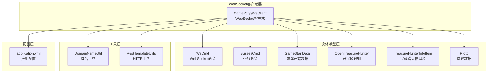
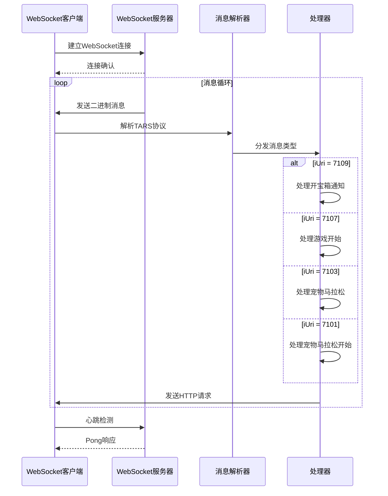
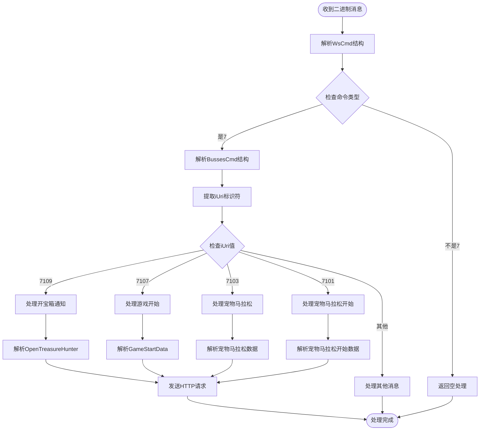
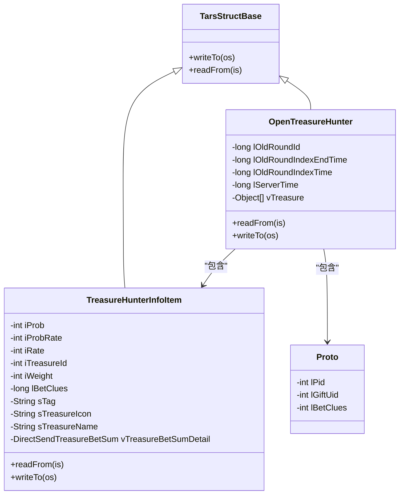
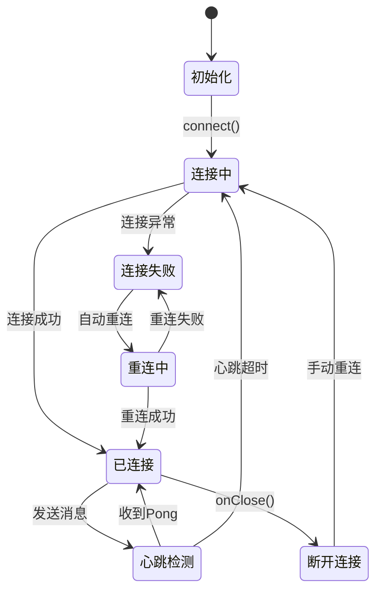
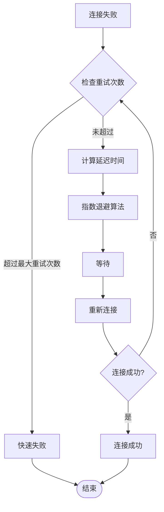
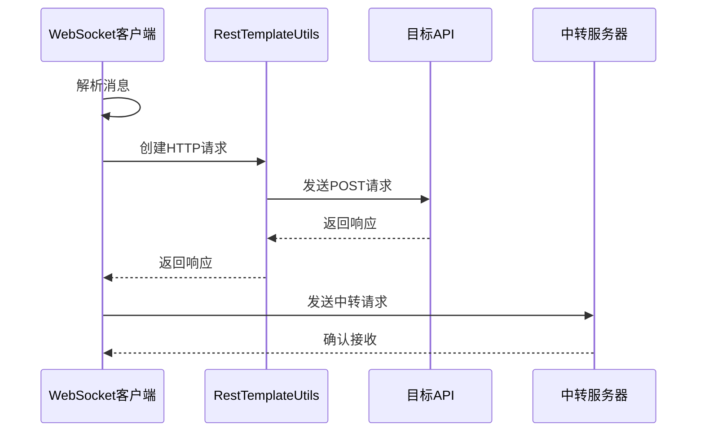
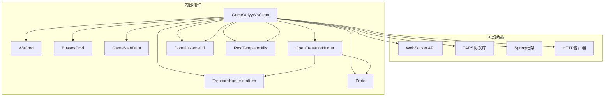
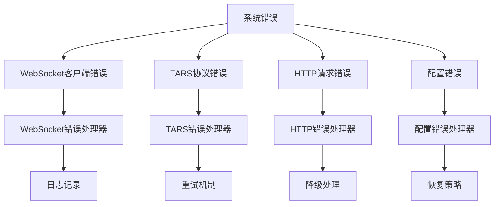
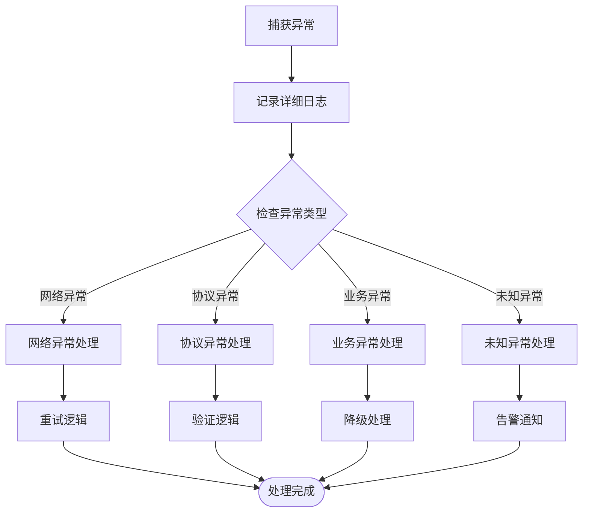

# WebSocket协议扩展

<cite>
**本文档引用的文件**
- [GameYqlyyWsClient.java](file://src/main/java/com/yqlyy/GameYqlyyWsClient.java)
- [WsCmd.java](file://src/main/java/com/entity/WsCmd.java)
- [BussesCmd.java](file://src/main/java/com/entity/BussesCmd.java)
- [GameStartData.java](file://src/main/java/com/entity/GameStartData.java)
- [OpenTreasureHunter.java](file://src/main/java/com/entity/AccountedNotify/OpenTreasureHunter.java)
- [TreasureHunterInfoItem.java](file://src/main/java/com/entity/AccountedNotify/TreasureHunterInfoItem.java)
- [Proto.java](file://src/main/java/com/entity/AccountedNotify/Proto.java)
- [DomainNameUtil.java](file://src/main/java/com/utils/DomainNameUtil.java)
- [RestTemplateUtils.java](file://src/main/java/com/commom/RestTemplateUtils.java)
- [application.yml](file://src/main/resources/application.yml)
</cite>

## 目录
1. [简介](#简介)
2. [项目结构](#项目结构)
3. [核心组件](#核心组件)
4. [架构概览](#架构概览)
5. [详细组件分析](#详细组件分析)
6. [依赖关系分析](#依赖关系分析)
7. [性能考虑](#性能考虑)
8. [故障排除指南](#故障排除指南)
9. [结论](#结论)

## 简介

本指南详细说明了如何在GameYqlyyWsClient中新增WebSocket消息类型的处理逻辑，包括新的iUri值的识别和处理流程。文档涵盖了TARS协议的扩展方法、WebSocket连接状态管理的扩展实践、心跳机制的自定义和连接重试策略，以及如何添加新的消息处理器来支持虎牙平台的新游戏或新功能。同时提供了二进制消息的解析技巧和错误处理机制的扩展方法。

## 项目结构

该项目采用分层架构设计，主要包含以下模块：



**图表来源**
- [GameYqlyyWsClient.java](file://src/main/java/com/yqlyy/GameYqlyyWsClient.java#L1-L328)
- [WsCmd.java](file://src/main/java/com/entity/WsCmd.java#L1-L69)
- [BussesCmd.java](file://src/main/java/com/entity/BussesCmd.java#L1-L10)

**章节来源**
- [GameYqlyyWsClient.java](file://src/main/java/com/yqlyy/GameYqlyyWsClient.java#L1-L328)
- [application.yml](file://src/main/resources/application.yml#L1-L31)

## 核心组件

### GameYqlyyWsClient - 主要WebSocket客户端

GameYqlyyWsClient是整个系统的核心组件，负责与虎牙WebSocket服务器建立连接并处理各种消息类型。

**主要特性：**
- 支持WebSocket二进制消息处理
- 实现TARS协议的消息解析
- 提供多种消息处理器
- 包含连接状态管理和重试机制

**关键属性：**
- `wsUrl`: WebSocket服务器地址
- `session`: 当前WebSocket会话
- `messageId`: 消息ID计数器
- `restTemplateUtils`: HTTP请求工具

**章节来源**
- [GameYqlyyWsClient.java](file://src/main/java/com/yqlyy/GameYqlyyWsClient.java#L30-L44)

### 数据模型组件

#### WsCmd - WebSocket命令模型
封装了WebSocket消息的基本结构，包括命令类型、数据内容等。

#### BussesCmd - 业务命令模型  
表示具体的业务消息，包含iUri标识符和消息体。

#### GameStartData - 游戏开始数据模型
存储游戏开始时的相关时间戳信息。

#### OpenTreasureHunter - 开宝箱通知模型
处理开宝箱相关的奖励信息。

**章节来源**
- [WsCmd.java](file://src/main/java/com/entity/WsCmd.java#L1-L69)
- [BussesCmd.java](file://src/main/java/com/entity/BussesCmd.java#L1-L10)
- [GameStartData.java](file://src/main/java/com/entity/GameStartData.java#L1-L79)

## 架构概览

系统采用事件驱动的WebSocket架构，通过注解方式处理不同类型的WebSocket事件：



**图表来源**
- [GameYqlyyWsClient.java](file://src/main/java/com/yqlyy/GameYqlyyWsClient.java#L52-L219)

## 详细组件分析

### WebSocket消息处理流程

#### 二进制消息解析流程



**图表来源**
- [GameYqlyyWsClient.java](file://src/main/java/com/yqlyy/GameYqlyyWsClient.java#L52-L219)

#### TARS协议扩展方法

TARS（Tencent Remote Procedure Call）协议的扩展遵循以下模式：



**图表来源**
- [OpenTreasureHunter.java](file://src/main/java/com/entity/AccountedNotify/OpenTreasureHunter.java#L10-L83)
- [TreasureHunterInfoItem.java](file://src/main/java/com/entity/AccountedNotify/TreasureHunterInfoItem.java#L8-L124)
- [Proto.java](file://src/main/java/com/entity/AccountedNotify/Proto.java#L1-L8)

**章节来源**
- [OpenTreasureHunter.java](file://src/main/java/com/entity/AccountedNotify/OpenTreasureHunter.java#L73-L81)
- [TreasureHunterInfoItem.java](file://src/main/java/com/entity/AccountedNotify/TreasureHunterInfoItem.java#L111-L122)

### 新消息类型处理扩展

#### 添加新的iUri值处理

要添加新的iUri值处理逻辑，需要按照以下步骤进行：

1. **定义新的数据模型**：
```java
// 在com.entity包下创建新的数据模型类
public class NewGameMessage extends TarsStructBase {
    // 定义新的字段
    private long newField1;
    private String newField2;
    
    @Override
    public void readFrom(TarsInputStream is) {
        this.newField1 = is.read(this.newField1, 0, false);
        this.newField2 = is.read(this.newField2, 1, false);
    }
}
```

2. **更新消息处理逻辑**：
```java
// 在binaryMessage方法中添加新的iUri分支
} else if (bussesCmd.iUri == NEW_URI_VALUE) {
    System.out.println(">>>>>>>处理新消息类型>>>>>>>");
    // 解析新消息
    NewGameMessage newMessage = new NewGameMessage();
    TarsInputStream inputStream = new TarsInputStream(bussesCmd.sMsg);
    newMessage.readFrom(inputStream);
    
    // 处理新消息逻辑
    handleNewGameMessage(newMessage);
}
```

3. **实现消息处理器**：
```java
private void handleNewGameMessage(NewGameMessage message) {
    // 实现新消息的处理逻辑
    // 发送HTTP请求或其他操作
}
```

**章节来源**
- [GameYqlyyWsClient.java](file://src/main/java/com/yqlyy/GameYqlyyWsClient.java#L120-L219)

### WebSocket连接状态管理

#### 连接生命周期管理



**图表来源**
- [GameYqlyyWsClient.java](file://src/main/java/com/yqlyy/GameYqlyyWsClient.java#L250-L272)

#### 心跳机制自定义

当前系统的心跳机制相对简单，可以通过以下方式进行增强：

1. **实现自定义心跳检测**：
```java
@OnMessage
public void pongMessage(Session session, PongMessage msg) {
    logger.info("[虎牙]收到Pong消息: {}", msg);
    // 更新心跳状态
    updateHeartbeatStatus(true);
}

// 添加心跳状态跟踪
private long lastHeartbeatTime = 0;
private boolean heartbeatActive = false;

private void updateHeartbeatStatus(boolean isActive) {
    this.heartbeatActive = isActive;
    this.lastHeartbeatTime = System.currentTimeMillis();
}
```

2. **实现心跳定时器**：
```java
private ScheduledExecutorService scheduler = Executors.newScheduledThreadPool(1);

// 启动心跳定时器
private void startHeartbeatTimer() {
    scheduler.scheduleAtFixedRate(() -> {
        if (session != null && session.isOpen()) {
            sendHeartbeat();
        }
    }, 0, 30, TimeUnit.SECONDS); // 每30秒发送一次心跳
}

private void sendHeartbeat() {
    try {
        // 发送心跳消息
        ByteBuffer heartbeat = createHeartbeatMessage();
        session.getBasicRemote().sendBinary(heartbeat);
    } catch (IOException e) {
        logger.warn("发送心跳失败: {}", e.getMessage());
        reconnect();
    }
}
```

**章节来源**
- [GameYqlyyWsClient.java](file://src/main/java/com/yqlyy/GameYqlyyWsClient.java#L46-L49)
- [GameYqlyyWsClient.java](file://src/main/java/com/yqlyy/GameYqlyyWsClient.java#L250-L272)

### 连接重试策略

#### 智能重连机制



**图表来源**
- [GameYqlyyWsClient.java](file://src/main/java/com/yqlyy/GameYqlyyWsClient.java#L250-L272)

#### 重连策略实现

```java
private int maxRetryAttempts = 5;
private int currentRetryAttempt = 0;
private long baseDelay = 1000; // 1秒
private long maxDelay = 60000; // 60秒

private synchronized void reconnect() {
    if (currentRetryAttempt >= maxRetryAttempts) {
        logger.error("达到最大重试次数，停止重连");
        return;
    }
    
    long delay = Math.min(baseDelay * Math.pow(2, currentRetryAttempt), maxDelay);
    logger.info("等待 {}ms 后重连，第 {} 次尝试", delay, currentRetryAttempt + 1);
    
    try {
        Thread.sleep(delay);
        connect();
        currentRetryAttempt = 0; // 重置重试次数
    } catch (InterruptedException e) {
        Thread.currentThread().interrupt();
        logger.warn("重连被中断");
    }
}

// 在onError中调用重连
@Override
public void onError(Throwable e, Session session) {
    logger.error("监听到异常", e);
    currentRetryAttempt++;
    reconnect();
}
```

**章节来源**
- [GameYqlyyWsClient.java](file://src/main/java/com/yqlyy/GameYqlyyWsClient.java#L245-L248)

### HTTP请求集成

#### REST API调用模式

系统使用RestTemplateUtils进行HTTP请求，支持GET和POST操作：



**图表来源**
- [RestTemplateUtils.java](file://src/main/java/com/commom/RestTemplateUtils.java#L19-L25)

**章节来源**
- [RestTemplateUtils.java](file://src/main/java/com/commom/RestTemplateUtils.java#L1-L31)

## 依赖关系分析

### 组件依赖图



**图表来源**
- [GameYqlyyWsClient.java](file://src/main/java/com/yqlyy/GameYqlyyWsClient.java#L1-L28)
- [OpenTreasureHunter.java](file://src/main/java/com/entity/AccountedNotify/OpenTreasureHunter.java#L1-L10)

### 错误处理依赖

系统采用分层错误处理机制：



**图表来源**
- [GameYqlyyWsClient.java](file://src/main/java/com/yqlyy/GameYqlyyWsClient.java#L245-L248)

**章节来源**
- [GameYqlyyWsClient.java](file://src/main/java/com/yqlyy/GameYqlyyWsClient.java#L109-L113)
- [GameYqlyyWsClient.java](file://src/main/java/com/yqlyy/GameYqlyyWsClient.java#L142-L146)

## 性能考虑

### WebSocket性能优化

1. **消息缓冲区优化**：
   - 设置合适的默认消息缓冲区大小
   - 避免内存溢出和性能下降

2. **连接池管理**：
   - 合理设置最大连接数
   - 控制并发连接数量

3. **心跳机制优化**：
   - 避免过于频繁的心跳导致网络拥塞
   - 实现智能的心跳检测

### HTTP请求性能

1. **连接池配置**：
   - 最大连接数：100
   - 默认每路由并发数：20
   - 连接超时：10秒
   - 套接字超时：30秒

2. **请求优化**：
   - 使用异步HTTP请求
   - 实现请求缓存机制
   - 优化JSON序列化

**章节来源**
- [application.yml](file://src/main/resources/application.yml#L16-L31)

## 故障排除指南

### 常见问题及解决方案

#### WebSocket连接问题

1. **连接失败**：
   - 检查wsUrl配置是否正确
   - 验证网络连接状态
   - 查看防火墙设置

2. **消息解析错误**：
   - 确认TARS协议版本兼容性
   - 检查消息格式是否符合预期
   - 验证字段索引映射

3. **心跳超时**：
   - 调整心跳间隔时间
   - 检查服务器负载情况
   - 实现心跳重连机制

#### HTTP请求问题

1. **请求超时**：
   - 增加socketTimeout配置
   - 检查目标服务器响应时间
   - 实现请求重试机制

2. **响应异常**：
   - 记录详细的错误日志
   - 实现降级处理策略
   - 验证API接口状态

#### 错误处理最佳实践



**图表来源**
- [GameYqlyyWsClient.java](file://src/main/java/com/yqlyy/GameYqlyyWsClient.java#L109-L113)

**章节来源**
- [GameYqlyyWsClient.java](file://src/main/java/com/yqlyy/GameYqlyyWsClient.java#L245-L248)

### 调试技巧

1. **启用详细日志**：
   - 在开发环境中启用DEBUG级别日志
   - 记录所有WebSocket消息的完整内容
   - 监控HTTP请求的详细信息

2. **性能监控**：
   - 监控WebSocket连接状态
   - 跟踪消息处理延迟
   - 分析内存使用情况

3. **错误追踪**：
   - 实现异常堆栈跟踪
   - 记录消息ID和时间戳
   - 建立错误报告机制

## 结论

本指南详细介绍了如何在GameYqlyyWsClient中扩展WebSocket协议处理能力。通过理解现有的消息处理流程、TARS协议解析机制和连接管理策略，开发者可以有效地添加新的消息类型支持和改进系统的稳定性。

关键要点包括：
- 正确解析TARS协议的二进制消息
- 实现灵活的消息路由机制
- 建立健壮的连接重试和心跳检测
- 设计可扩展的错误处理和监控机制
- 优化HTTP请求性能和可靠性

这些实践为支持虎牙平台的新游戏和新功能奠定了坚实的技术基础，同时也为系统的长期维护和发展提供了清晰的指导方向。