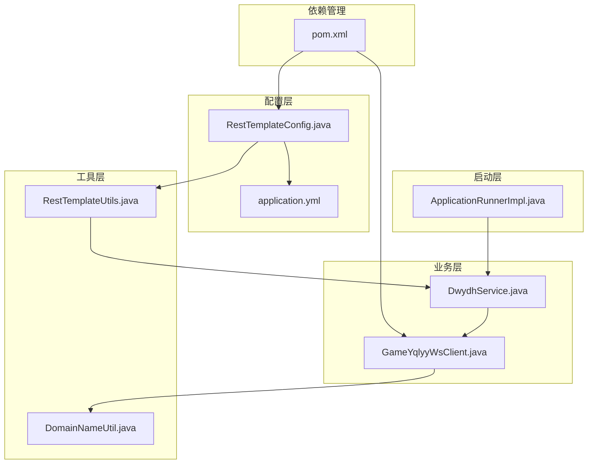
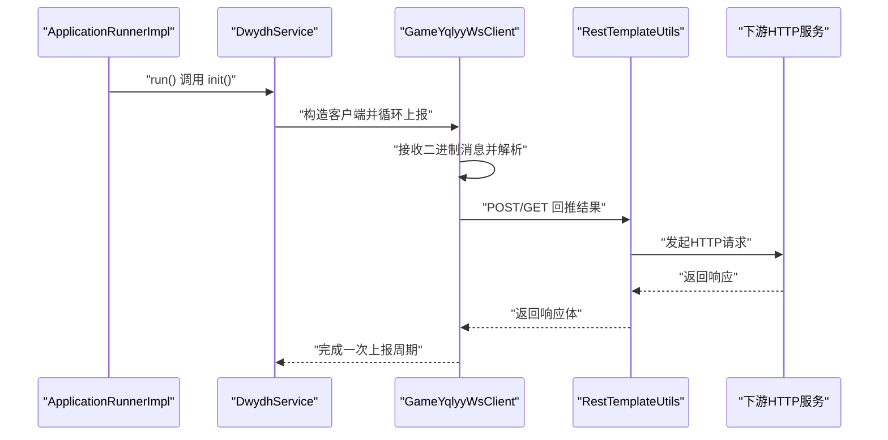
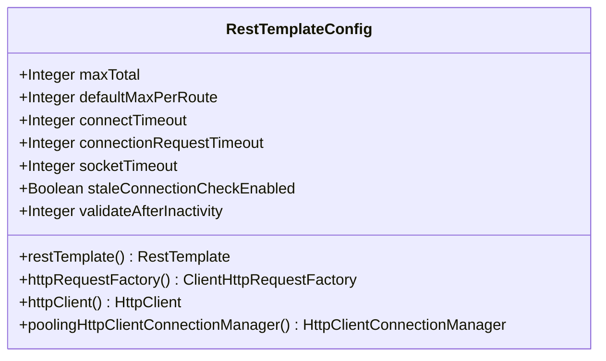
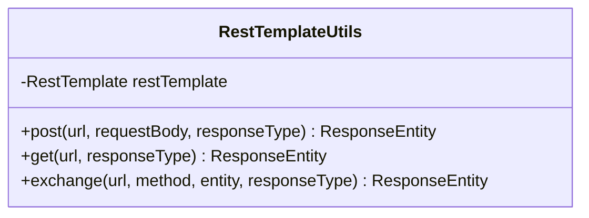
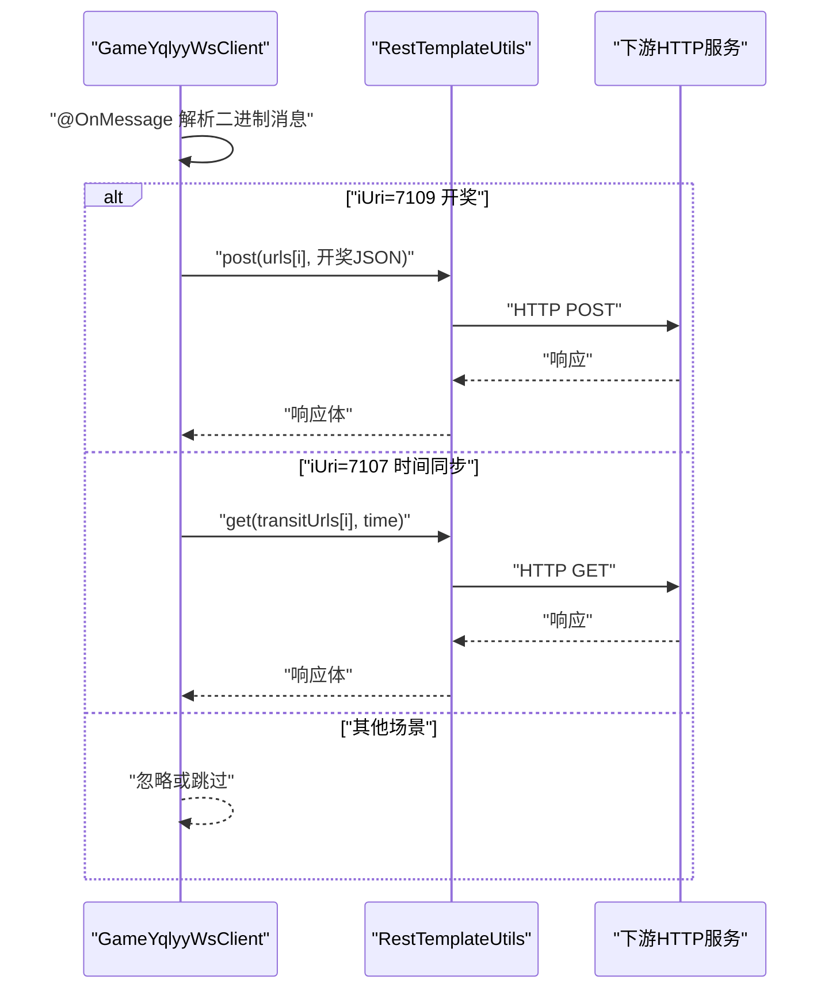
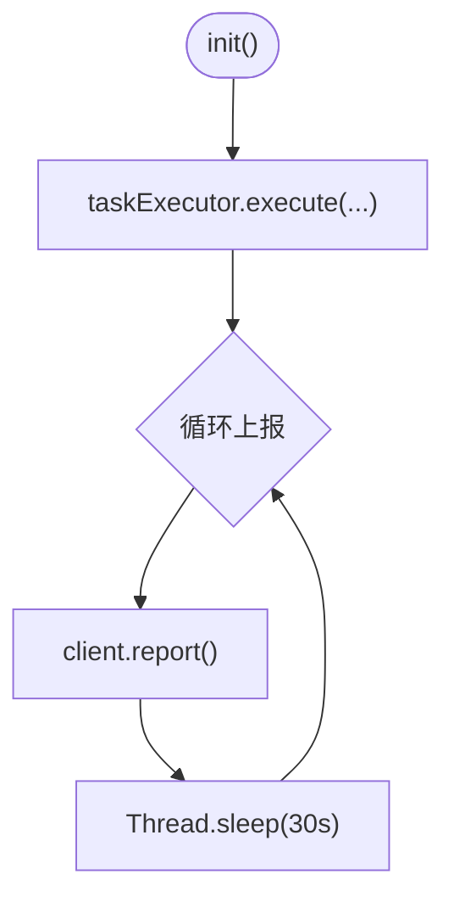
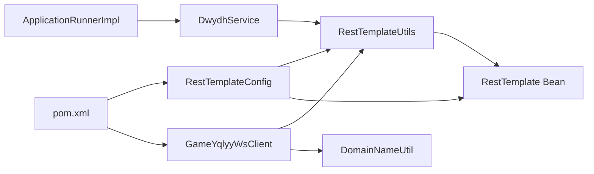

# 性能优化扩展

<cite>
**本文引用的文件列表**
- [RestTemplateConfig.java](file://src/main/java/com/commom/RestTemplateConfig.java)
- [RestTemplateUtils.java](file://src/main/java/com/commom/RestTemplateUtils.java)
- [GameYqlyyWsClient.java](file://src/main/java/com/yqlyy/GameYqlyyWsClient.java)
- [DwydhService.java](file://src/main/java/com/dwydh/DwydhService.java)
- [ApplicationRunnerImpl.java](file://src/main/java/com/listener/ApplicationRunnerImpl.java)
- [DomainNameUtil.java](file://src/main/java/com/utils/DomainNameUtil.java)
- [application.yml](file://src/main/resources/application.yml)
- [pom.xml](file://pom.xml)
</cite>

## 目录
1. [简介](#简介)
2. [项目结构](#项目结构)
3. [核心组件](#核心组件)
4. [架构总览](#架构总览)
5. [详细组件分析](#详细组件分析)
6. [依赖关系分析](#依赖关系分析)
7. [性能优化实践](#性能优化实践)
8. [性能监控与调优工具](#性能监控与调优工具)
9. [故障排查指南](#故障排查指南)
10. [结论](#结论)

## 简介
本指南围绕当前代码库中的 HTTP 连接池、WebSocket 连接、缓存与并发控制等关键性能点，提供系统化的优化建议与落地实践。重点包括：
- 在 RestTemplateConfig 中对 Apache HttpClient 的连接池参数进行调优（连接总数、每路由并发、超时、重试）。
- WebSocket 连接的复用、消息缓冲与内存管理策略。
- 缓存机制的扩展设计（数据缓存与连接缓存）。
- 异步处理与并发控制，提升吞吐与响应速度。
- 性能监控与调优工具的使用建议。

## 项目结构
项目采用 Spring Boot 结构，主要模块如下：
- 配置层：RestTemplateConfig、application.yml
- 工具层：RestTemplateUtils、DomainNameUtil
- 业务层：DwydhService、GameYqlyyWsClient
- 启动层：ApplicationRunnerImpl
- 依赖管理：pom.xml

图表来源
- [RestTemplateConfig.java](file://src/main/java/com/commom/RestTemplateConfig.java#L34-L131)
- [application.yml](file://src/main/resources/application.yml#L16-L30)
- [RestTemplateUtils.java](file://src/main/java/com/commom/RestTemplateUtils.java#L14-L30)
- [DwydhService.java](file://src/main/java/com/dwydh/DwydhService.java#L14-L38)
- [GameYqlyyWsClient.java](file://src/main/java/com/yqlyy/GameYqlyyWsClient.java#L29-L327)
- [ApplicationRunnerImpl.java](file://src/main/java/com/listener/ApplicationRunnerImpl.java#L21-L32)
- [pom.xml](file://pom.xml#L26-L111)

章节来源
- [RestTemplateConfig.java](file://src/main/java/com/commom/RestTemplateConfig.java#L34-L131)
- [application.yml](file://src/main/resources/application.yml#L16-L30)
- [RestTemplateUtils.java](file://src/main/java/com/commom/RestTemplateUtils.java#L14-L30)
- [DwydhService.java](file://src/main/java/com/dwydh/DwydhService.java#L14-L38)
- [GameYqlyyWsClient.java](file://src/main/java/com/yqlyy/GameYqlyyWsClient.java#L29-L327)
- [ApplicationRunnerImpl.java](file://src/main/java/com/listener/ApplicationRunnerImpl.java#L21-L32)
- [pom.xml](file://pom.xml#L26-L111)

## 核心组件
- RestTemplateConfig：定义 HTTP 连接池、超时、重试与默认请求头，统一对外提供 RestTemplate。
- RestTemplateUtils：封装 GET/POST/exchange 等常用 HTTP 操作，便于业务直接使用。
- GameYqlyyWsClient：WebSocket 客户端，负责接收二进制消息、解析协议、触发 HTTP 回推。
- DwydhService：业务初始化入口，使用线程池调度 WebSocket 客户端上报任务。
- ApplicationRunnerImpl：应用启动后执行初始化逻辑。
- DomainNameUtil：集中维护目标服务地址数组（urls/transitUrls），便于批量回推。

章节来源
- [RestTemplateConfig.java](file://src/main/java/com/commom/RestTemplateConfig.java#L34-L131)
- [RestTemplateUtils.java](file://src/main/java/com/commom/RestTemplateUtils.java#L14-L30)
- [GameYqlyyWsClient.java](file://src/main/java/com/yqlyy/GameYqlyyWsClient.java#L29-L327)
- [DwydhService.java](file://src/main/java/com/dwydh/DwydhService.java#L14-L38)
- [ApplicationRunnerImpl.java](file://src/main/java/com/listener/ApplicationRunnerImpl.java#L21-L32)
- [DomainNameUtil.java](file://src/main/java/com/utils/DomainNameUtil.java#L3-L15)

## 架构总览
整体流程：应用启动后，通过 ApplicationRunnerImpl 触发 DwydhService 初始化；DwydhService 使用线程池启动 GameYqlyyWsClient；WebSocket 接收消息后，GameYqlyyWsClient 解析并使用 RestTemplateUtils 对多个下游服务发起 HTTP 请求。

图表来源
- [ApplicationRunnerImpl.java](file://src/main/java/com/listener/ApplicationRunnerImpl.java#L25-L31)
- [DwydhService.java](file://src/main/java/com/dwydh/DwydhService.java#L21-L36)
- [GameYqlyyWsClient.java](file://src/main/java/com/yqlyy/GameYqlyyWsClient.java#L274-L290)
- [RestTemplateUtils.java](file://src/main/java/com/commom/RestTemplateUtils.java#L19-L29)

## 详细组件分析

### RestTemplateConfig 组件分析
- 连接池管理：PoolingHttpClientConnectionManager 设置最大连接数与每路由并发上限，并支持空闲校验。
- 请求配置：RequestConfig 设置连接超时、连接池获取超时、Socket 超时、连接有效性检查开关。
- 默认头部：设置通用请求头，如 Content-Type、Keep-Alive 等。
- 重试策略：DefaultHttpRequestRetryHandler 设置重试次数与幂等性策略。
- Keep-Alive：DefaultConnectionKeepAliveStrategy 控制长连接保活行为。

图表来源
- [RestTemplateConfig.java](file://src/main/java/com/commom/RestTemplateConfig.java#L34-L131)

章节来源
- [RestTemplateConfig.java](file://src/main/java/com/commom/RestTemplateConfig.java#L34-L131)
- [application.yml](file://src/main/resources/application.yml#L16-L30)

### RestTemplateUtils 组件分析
- 封装常用 HTTP 方法：post/get/exchange。
- 通过 @Resource 注入 RestTemplate，避免重复创建实例，降低资源开销。
- 作为业务侧与 HTTP 层的桥梁，便于后续扩展拦截器、日志与熔断。

图表来源
- [RestTemplateUtils.java](file://src/main/java/com/commom/RestTemplateUtils.java#L14-L30)

章节来源
- [RestTemplateUtils.java](file://src/main/java/com/commom/RestTemplateUtils.java#L14-L30)

### GameYqlyyWsClient 组件分析
- WebSocket 生命周期：@OnOpen/@OnMessage/@OnClose/@OnError。
- 消息处理：解析二进制消息，根据 iUri 分发不同业务场景（开奖、时间同步等）。
- HTTP 回推：使用 RestTemplateUtils 对 urls/transitUrls 批量回推，记录日志与异常。
- 连接管理：connect() 中设置消息缓冲大小、空闲超时、异步发送超时；report() 用于心跳/进入游戏消息上报；onError/onClose 中触发重连逻辑。

图表来源
- [GameYqlyyWsClient.java](file://src/main/java/com/yqlyy/GameYqlyyWsClient.java#L51-L218)
- [RestTemplateUtils.java](file://src/main/java/com/commom/RestTemplateUtils.java#L19-L29)

章节来源
- [GameYqlyyWsClient.java](file://src/main/java/com/yqlyy/GameYqlyyWsClient.java#L29-L327)
- [RestTemplateUtils.java](file://src/main/java/com/commom/RestTemplateUtils.java#L14-L30)
- [DomainNameUtil.java](file://src/main/java/com/utils/DomainNameUtil.java#L3-L15)

### DwydhService 组件分析
- 使用 ThreadPoolTaskExecutor 异步执行 WebSocket 客户端的上报任务，避免阻塞主线程。
- 循环调用 client.report() 并设置固定间隔，形成稳定的上报节奏。

图表来源
- [DwydhService.java](file://src/main/java/com/dwydh/DwydhService.java#L21-L36)

章节来源
- [DwydhService.java](file://src/main/java/com/dwydh/DwydhService.java#L14-L38)

### ApplicationRunnerImpl 组件分析
- 应用启动后执行初始化，调用 DwydhService.init()，确保 WebSocket 客户端在应用启动后即开始工作。

章节来源
- [ApplicationRunnerImpl.java](file://src/main/java/com/listener/ApplicationRunnerImpl.java#L21-L32)

## 依赖关系分析
- RestTemplateConfig 依赖 application.yml 的 HTTP 参数配置。
- RestTemplateUtils 依赖 RestTemplate Bean（由 RestTemplateConfig 提供）。
- GameYqlyyWsClient 依赖 RestTemplateUtils 与 DomainNameUtil。
- DwydhService 依赖 ThreadPoolTaskExecutor 与 RestTemplateUtils。
- pom.xml 提供 HTTP 客户端、WebSocket 客户端、日志与工具库等依赖。

图表来源
- [RestTemplateConfig.java](file://src/main/java/com/commom/RestTemplateConfig.java#L34-L131)
- [RestTemplateUtils.java](file://src/main/java/com/commom/RestTemplateUtils.java#L14-L30)
- [DwydhService.java](file://src/main/java/com/dwydh/DwydhService.java#L14-L38)
- [GameYqlyyWsClient.java](file://src/main/java/com/yqlyy/GameYqlyyWsClient.java#L29-L327)
- [ApplicationRunnerImpl.java](file://src/main/java/com/listener/ApplicationRunnerImpl.java#L21-L32)
- [pom.xml](file://pom.xml#L26-L111)

章节来源
- [pom.xml](file://pom.xml#L26-L111)

## 性能优化实践

### 一、HTTP 连接池优化（RestTemplateConfig）
- 连接总数与每路由并发
  - maxTotal：全局最大连接数，应结合下游服务并发能力与本机资源评估。建议按“下游并发 × 期望峰值并发系数”估算，预留 20%-30% 安全余量。
  - defaultMaxPerRoute：每路由最大并发，建议与业务接口类型分离配置，避免热点路由成为瓶颈。
- 超时参数
  - connectTimeout：建立 TCP 连接的超时，建议与网络质量匹配，避免过短导致频繁失败。
  - connectionRequestTimeout：从连接池获取连接的等待时间，建议与队列长度配合调整，避免排队过长。
  - socketTimeout：读写超时，建议根据下游接口平均耗时与 P99 延迟设定，避免过短导致误判。
- 连接有效性与空闲复用
  - staleConnectionCheckEnabled：启用后会在提交请求前检测连接可用性，适合高抖动网络。
  - validateAfterInactivity：空闲连接复用前校验的时间阈值，建议与业务空闲时长匹配，避免过期连接被复用。
- 重试策略
  - DefaultHttpRequestRetryHandler：建议仅对幂等 GET/HEAD 或可重试的写操作开启，避免重复副作用。
- 头部与 Keep-Alive
  - 保持 Keep-Alive 与合理的 Content-Type，减少握手成本。
- 连接池扩展建议
  - 使用自定义 Registry 注册 Socket 工厂，按需启用 TLS 优化与 ALPN。
  - 结合线程池与限流策略，避免突发流量压垮连接池。

章节来源
- [RestTemplateConfig.java](file://src/main/java/com/commom/RestTemplateConfig.java#L34-L131)
- [application.yml](file://src/main/resources/application.yml#L16-L30)

### 二、WebSocket 连接优化
- 连接复用
  - 在 GameYqlyyWsClient 中，connect() 设置消息缓冲大小与空闲超时，避免频繁重建连接。
  - onOpen/onClose/onError 中的重连逻辑应具备退避与节流，防止雪崩。
- 消息批处理
  - 当前对 urls/transitUrls 的回推为逐个 URL 发送，建议在业务允许的情况下合并请求或引入异步批量发送，降低 RTT。
- 内存管理
  - 二进制消息解析使用 ByteBuffer，注意及时释放与复用缓冲区，避免内存泄漏。
  - 日志输出建议按级别控制，避免高频打印影响 GC。
- 心跳与保活
  - 使用 PongMessage 与定时上报（report）维持连接活跃度，必要时增加心跳间隔动态调节。

章节来源
- [GameYqlyyWsClient.java](file://src/main/java/com/yqlyy/GameYqlyyWsClient.java#L250-L272)
- [GameYqlyyWsClient.java](file://src/main/java/com/yqlyy/GameYqlyyWsClient.java#L274-L290)

### 三、缓存机制扩展
- 数据缓存
  - 对于频繁访问且变化不频繁的数据（如配置、静态映射），可在 GameYqlyyWsClient 或 DwydhService 中引入本地缓存（如 Guava Cache/Caffeine），设置 TTL 与容量上限。
  - 缓存键建议包含业务维度（如 gameId、uri），避免误命中。
- 连接缓存
  - 对于下游 HTTP 服务，可考虑基于域名/路径的连接池缓存，结合连接池参数统一管理。
  - 对于 WebSocket，可按 wsUrl 维度维护连接对象，避免重复创建。
- 缓存更新策略
  - 支持主动刷新与被动失效（TTL/事件驱动），保证数据一致性与新鲜度。

[本节为概念性指导，无需列出具体文件来源]

### 四、异步处理与并发控制
- 线程池配置
  - DwydhService 使用 ThreadPoolTaskExecutor，建议根据 CPU 核数与 IO 密集程度设置核心/最大线程数与队列长度。
  - 对于高并发场景，可拆分不同优先级的任务队列，避免相互干扰。
- 并发控制
  - 对 HTTP 回推使用异步回调或 CompletableFuture，避免阻塞线程。
  - 对 WebSocket 消息处理采用单线程队列或轻量锁，保证顺序与一致性。
- 资源隔离
  - 不同业务域（开奖、时间同步）使用独立线程池，防止互相抢占。

章节来源
- [DwydhService.java](file://src/main/java/com/dwydh/DwydhService.java#L14-L38)

### 五、性能监控与调优工具
- JVM 监控
  - 使用 JMX/MBeans 暴露连接池指标（总连接、空闲连接、待获取连接数、重试次数等）。
  - 关注 GC 次数与停顿时间，定位内存压力与分配热点。
- 应用埋点
  - 在 RestTemplateUtils 中增加请求耗时、状态码分布、异常计数等埋点。
  - 在 GameYqlyyWsClient 中记录消息到达延迟、解析耗时、回推耗时。
- 日志与采样
  - 使用采样日志记录慢请求与异常，避免日志风暴。
  - 结合链路追踪（如 Zipkin/Sleuth）定位瓶颈环节。
- 动态调参
  - 将 HTTP 连接池参数暴露为配置项，支持热更新与灰度验证。
  - WebSocket 的消息缓冲与超时参数可按环境动态调整。

[本节为通用指导，无需列出具体文件来源]

## 性能监控与调优工具
- JVM 与线程分析
  - 使用 jstat/jstack/jmap 定位连接池与线程阻塞问题。
  - 使用 Arthas/Agent 进行在线诊断与参数观测。
- HTTP 指标采集
  - 通过 Micrometer 暴露 HTTP 客户端指标，结合 Prometheus/Grafana 可视化。
- WebSocket 指标
  - 记录连接数、消息速率、解析耗时、回推成功率与失败原因分类统计。
- 调优步骤
  - 以 QPS/延迟为目标，逐步调整连接池参数与线程池配置，观察指标变化并回滚至稳定配置。

[本节为通用指导，无需列出具体文件来源]

## 故障排查指南
- HTTP 请求失败
  - 检查 connectTimeout/connectionRequestTimeout/socketTimeout 是否过短。
  - 查看 staleConnectionCheckEnabled 与 validateAfterInactivity 是否导致连接频繁失效。
  - 关注 DefaultHttpRequestRetryHandler 的重试策略是否合适。
- WebSocket 断连
  - 检查 onOpen/onClose/onError 的重连逻辑与退避策略。
  - 关注消息缓冲大小与空闲超时设置是否合理。
- 回推异常
  - 在 RestTemplateUtils 中捕获 RestClientException 并记录详细上下文。
  - 对 urls/transitUrls 的批量回推，建议逐个重试并记录失败索引，便于定位。

章节来源
- [RestTemplateConfig.java](file://src/main/java/com/commom/RestTemplateConfig.java#L84-L107)
- [GameYqlyyWsClient.java](file://src/main/java/com/yqlyy/GameYqlyyWsClient.java#L240-L248)
- [GameYqlyyWsClient.java](file://src/main/java/com/yqlyy/GameYqlyyWsClient.java#L103-L114)
- [RestTemplateUtils.java](file://src/main/java/com/commom/RestTemplateUtils.java#L19-L29)

## 结论
通过对 RestTemplateConfig 的连接池参数、超时与重试策略进行精细化调优，结合 WebSocket 的连接复用与消息批处理，以及缓存与异步并发控制的扩展，可以显著提升系统的吞吐与稳定性。建议以监控指标为依据，持续迭代参数配置，确保在高并发场景下仍能保持低延迟与高可用。