# 扩展开发

<cite>
**本文档引用的文件**
- [Application.java](file://src/main/java/com/Application.java)
- [application.yml](file://src/main/resources/application.yml)
- [WsCmd.java](file://src/main/java/com/entity/WsCmd.java)
- [BussesCmd.java](file://src/main/java/com/entity/BussesCmd.java)
- [GameYqlyyWsClient.java](file://src/main/java/com/yqlyy/GameYqlyyWsClient.java)
- [GameStartData.java](file://src/main/java/com/entity/GameStartData.java)
- [OpenTreasureHunter.java](file://src/main/java/com/entity/AccountedNotify/OpenTreasureHunter.java)
- [TreasureHunterInfoItem.java](file://src/main/java/com/entity/AccountedNotify/TreasureHunterInfoItem.java)
- [RestTemplateUtils.java](file://src/main/java/com/commom/RestTemplateUtils.java)
- [DomainNameUtil.java](file://src/main/java/com/utils/DomainNameUtil.java)
- [DwydhService.java](file://src/main/java/com/dwydh/DwydhService.java)
- [ApplicationRunnerImpl.java](file://src/main/java/com/listener/ApplicationRunnerImpl.java)
- [pom.xml](file://pom.xml)
</cite>

## 目录
1. [简介](#简介)
2. [项目结构](#项目结构)
3. [核心组件](#核心组件)
4. [架构概览](#架构概览)
5. [详细组件分析](#详细组件分析)
6. [依赖关系分析](#依赖关系分析)
7. [扩展开发指南](#扩展开发指南)
8. [性能考虑](#性能考虑)
9. [故障排除指南](#故障排除指南)
10. [结论](#结论)

## 简介

本项目是一个基于Spring Boot的虎牙游戏爬虫系统，主要负责监控虎牙直播平台上的游戏数据，并将相关的开奖结果和游戏状态同步到内部系统。该系统采用WebSocket实时通信、TARS协议解析和HTTP同步接口相结合的方式，实现了对多个虎牙游戏的数据采集和处理。

系统的核心功能包括：
- WebSocket连接和消息接收
- TARS协议二进制消息解析
- 游戏数据模型映射
- HTTP同步接口调用
- 异常处理和自动重连机制

## 项目结构

该项目采用标准的Spring Boot项目结构，主要分为以下几个模块：

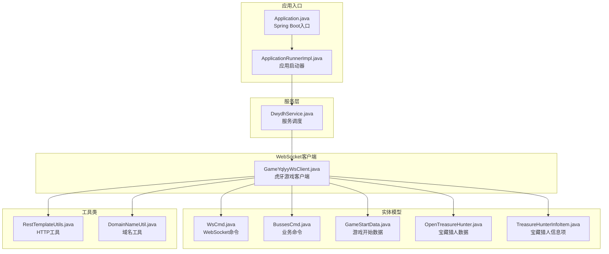

**图表来源**
- [Application.java](file://src/main/java/com/Application.java#L1-L14)
- [GameYqlyyWsClient.java](file://src/main/java/com/yqlyy/GameYqlyyWsClient.java#L1-L328)
- [DwydhService.java](file://src/main/java/com/dwydh/DwydhService.java#L1-L39)

**章节来源**
- [Application.java](file://src/main/java/com/Application.java#L1-L14)
- [pom.xml](file://pom.xml#L1-L160)

## 核心组件

### WebSocket客户端组件

系统的核心是`GameYqlyyWsClient`类，它负责与虎牙WebSocket服务器建立连接并处理消息：

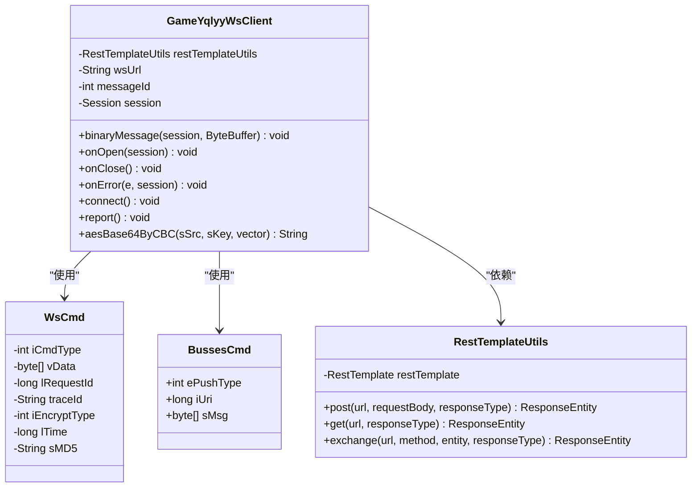

**图表来源**
- [GameYqlyyWsClient.java](file://src/main/java/com/yqlyy/GameYqlyyWsClient.java#L29-L328)
- [WsCmd.java](file://src/main/java/com/entity/WsCmd.java#L1-L69)
- [BussesCmd.java](file://src/main/java/com/entity/BussesCmd.java#L1-L10)
- [RestTemplateUtils.java](file://src/main/java/com/commom/RestTemplateUtils.java#L1-L31)

### 数据模型组件

系统定义了多种数据模型来处理不同的游戏数据：

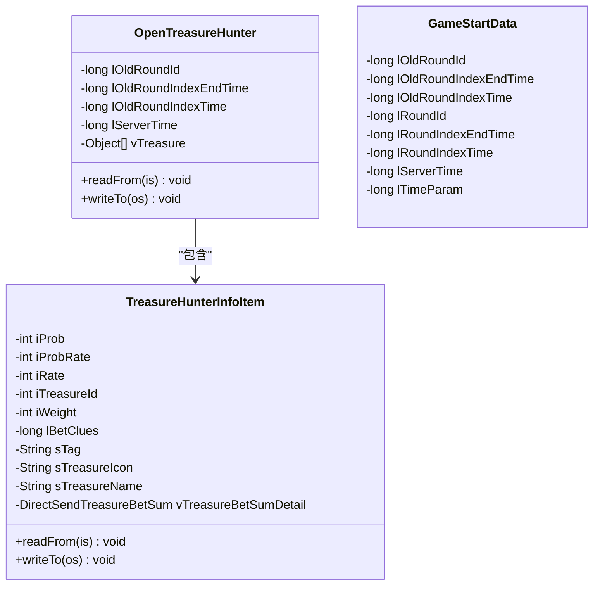

**图表来源**
- [OpenTreasureHunter.java](file://src/main/java/com/entity/AccountedNotify/OpenTreasureHunter.java#L1-L83)
- [TreasureHunterInfoItem.java](file://src/main/java/com/entity/AccountedNotify/TreasureHunterInfoItem.java#L1-L124)
- [GameStartData.java](file://src/main/java/com/entity/GameStartData.java#L1-L79)

**章节来源**
- [GameYqlyyWsClient.java](file://src/main/java/com/yqlyy/GameYqlyyWsClient.java#L51-L219)
- [WsCmd.java](file://src/main/java/com/entity/WsCmd.java#L1-L69)
- [BussesCmd.java](file://src/main/java/com/entity/BussesCmd.java#L1-L10)

## 架构概览

系统采用分层架构设计，各层职责明确：

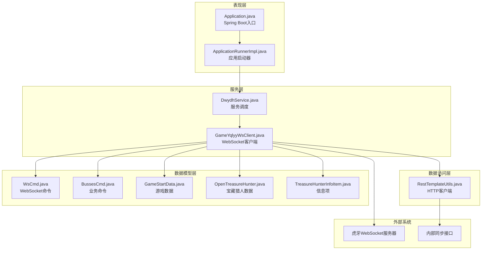

**图表来源**
- [Application.java](file://src/main/java/com/Application.java#L1-L14)
- [DwydhService.java](file://src/main/java/com/dwydh/DwydhService.java#L1-L39)
- [GameYqlyyWsClient.java](file://src/main/java/com/yqlyy/GameYqlyyWsClient.java#L1-L328)
- [RestTemplateUtils.java](file://src/main/java/com/commom/RestTemplateUtils.java#L1-L31)

## 详细组件分析

### WebSocket消息处理流程

系统通过WebSocket接收虎牙游戏的实时数据，处理流程如下：

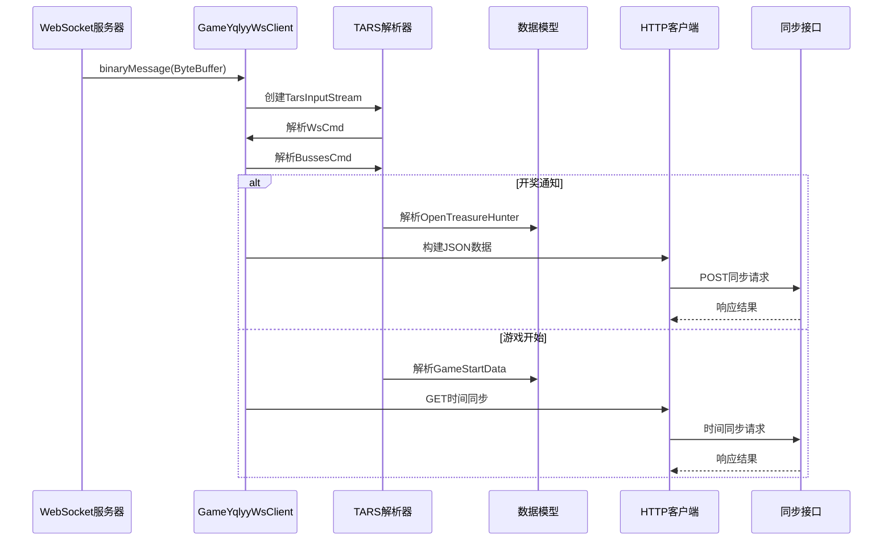

**图表来源**
- [GameYqlyyWsClient.java](file://src/main/java/com/yqlyy/GameYqlyyWsClient.java#L51-L219)
- [WsCmd.java](file://src/main/java/com/entity/WsCmd.java#L1-L69)
- [BussesCmd.java](file://src/main/java/com/entity/BussesCmd.java#L1-L10)

### TARS协议解析机制

系统使用TARS（Tencent Remote Procedure Call）协议处理二进制消息：

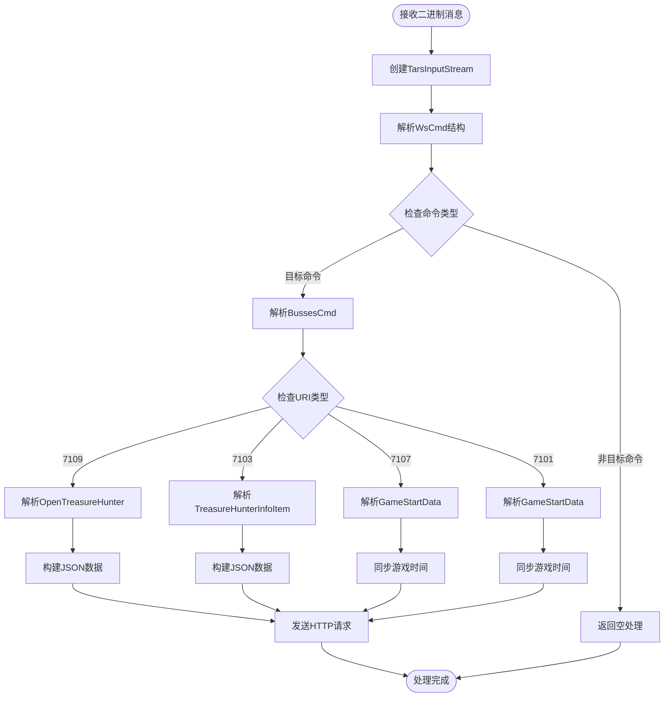

**图表来源**
- [GameYqlyyWsClient.java](file://src/main/java/com/yqlyy/GameYqlyyWsClient.java#L61-L218)

### 错误处理和异常恢复机制

系统实现了完善的错误处理和自动恢复机制：

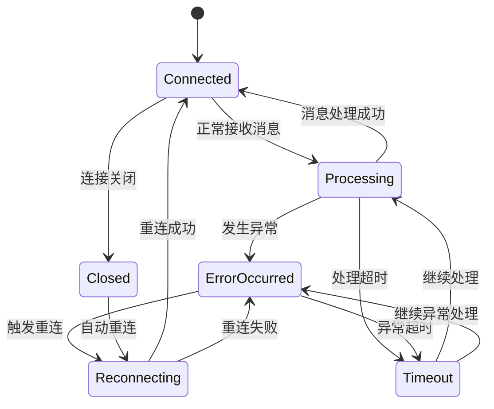

**图表来源**
- [GameYqlyyWsClient.java](file://src/main/java/com/yqlyy/GameYqlyyWsClient.java#L245-L248)
- [GameYqlyyWsClient.java](file://src/main/java/com/yqlyy/GameYqlyyWsClient.java#L250-L272)

**章节来源**
- [GameYqlyyWsClient.java](file://src/main/java/com/yqlyy/GameYqlyyWsClient.java#L46-L248)

## 依赖关系分析

系统的主要依赖关系如下：

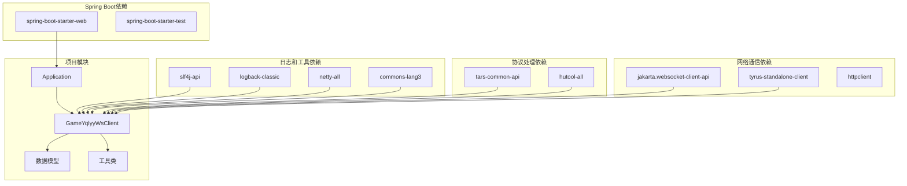

**图表来源**
- [pom.xml](file://pom.xml#L26-L111)

**章节来源**
- [pom.xml](file://pom.xml#L1-L160)

## 扩展开发指南

### 新增虎牙游戏支持的步骤

要为新的虎牙游戏添加支持，需要按照以下步骤进行扩展：

#### 1. 添加新的数据模型

首先，在`com.entity`包下创建对应的游戏数据模型类：

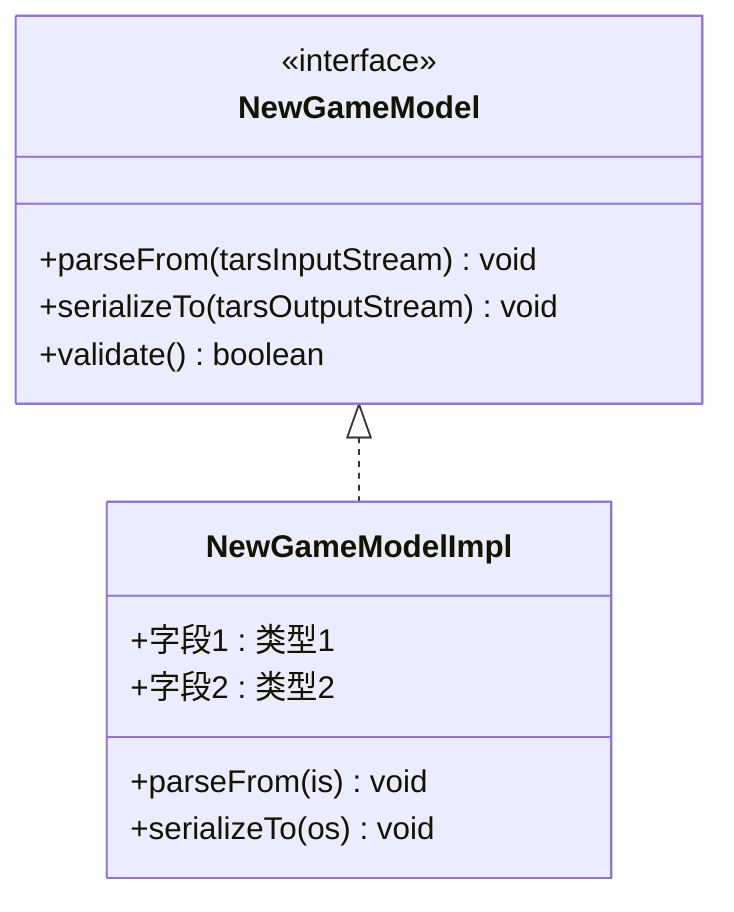

**图表来源**
- [OpenTreasureHunter.java](file://src/main/java/com/entity/AccountedNotify/OpenTreasureHunter.java#L10-L83)
- [TreasureHunterInfoItem.java](file://src/main/java/com/entity/AccountedNotify/TreasureHunterInfoItem.java#L8-L124)

#### 2. 扩展WebSocket消息处理

在`GameYqlyyWsClient`类中添加新的URI类型处理逻辑：

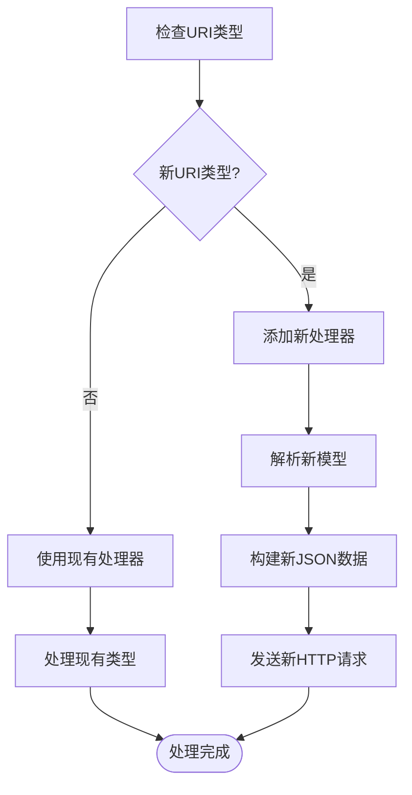

**图表来源**
- [GameYqlyyWsClient.java](file://src/main/java/com/yqlyy/GameYqlyyWsClient.java#L150-L218)

#### 3. 配置HTTP同步接口

在`DomainNameUtil.java`中添加新的同步接口地址：

```java
public final static String[] urls = new String[]{
    "http://127.0.0.1:8080",
    "http://127.0.0.1:8081"  // 新增的同步接口
};
```

#### 4. 实现数据验证和转换

确保新模型实现适当的验证和转换逻辑：

```java
public class NewGameModel extends TarsStructBase {
    @Override
    public void readFrom(TarsInputStream is) {
        // 实现字段解析逻辑
        validate(); // 添加数据验证
    }
    
    @Override
    public void writeTo(TarsOutputStream os) {
        // 实现序列化逻辑
    }
    
    private void validate() {
        // 添加数据完整性验证
    }
}
```

### TARS协议扩展方法

#### 1. 二进制消息解析技巧

使用`TarsInputStream`进行精确的字段解析：

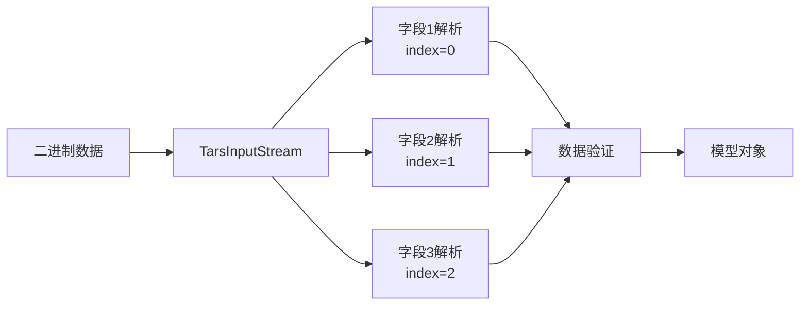

**图表来源**
- [GameYqlyyWsClient.java](file://src/main/java/com/yqlyy/GameYqlyyWsClient.java#L61-L75)

#### 2. 字段索引和类型映射

正确的字段索引映射对于TARS解析至关重要：

| 字段索引 | 字段名称 | 数据类型 | 示例值 |
|---------|---------|---------|--------|
| 0 | lOldRoundId | long | 123456789 |
| 1 | sTreasureName | String | "老虎" |
| 2 | iWeight | int | 100 |
| 3 | sTag | String | "tag1" |
| 4 | vTreasure | List | [item1, item2] |

### HTTP同步接口扩展

#### 1. 新数据格式定义

为新的游戏数据定义合适的JSON格式：

```json
{
  "gameId": 25,
  "gameName": "新游戏",
  "timestamp": 1670313762,
  "data": {
    "animalId": 1,
    "animalName": "狮子",
    "probability": 0.85,
    "betAmount": 1000
  },
  "metadata": {
    "roundId": 12345,
    "serverTime": 1670313762000
  }
}
```

#### 2. API端点扩展

在`RestTemplateUtils`中添加新的HTTP方法：

```java
public <T> ResponseEntity<T> postNewGame(String url, Object requestBody, Class<T> responseType) {
    HttpHeaders headers = new HttpHeaders();
    headers.setContentType(MediaType.APPLICATION_JSON);
    headers.set("Authorization", "Bearer " + getAuthToken());
    HttpEntity<Object> entity = new HttpEntity<>(requestBody, headers);
    return restTemplate.exchange(url, HttpMethod.POST, entity, responseType);
}
```

### 配置文件扩展

#### 1. 新游戏参数配置

在`application.yml`中添加新的配置项：

```yaml
game:
  hy:
    # 虎牙游戏配置
    wsUrl: "wss://new-game-ws.example.com"
    gameId: 25
    heartbeatInterval: 30000
    maxRetryCount: 5
    retryDelay: 1000
    timeout: 30000
```

#### 2. 连接参数调整

根据新游戏的特点调整连接参数：

```yaml
# WebSocket连接配置
websocket:
  maxBinaryMessageBufferSize: 131072
  maxTextMessageBufferSize: 65536
  defaultMaxSessionIdleTimeout: 60000
  asyncSendTimeout: 30000

# HTTP客户端配置
http:
  maxTotal: 200
  defaultMaxPerRoute: 50
  connectTimeout: 15000
  connectionRequestTimeout: 1000
  socketTimeout: 60000
```

### 错误处理和异常恢复

#### 1. 扩展异常处理机制

为新游戏添加专门的异常处理：

```java
try {
    // 游戏特定操作
} catch (GameSpecificException e) {
    logger.warn("游戏特定错误: {}", e.getMessage());
    handleGameSpecificError(e);
} catch (TarsProtocolException e) {
    logger.error("TARS协议错误: {}", e.getMessage());
    reinitializeTarsParser();
} catch (Exception e) {
    logger.error("未知错误: {}", e.getMessage());
    triggerGlobalRecovery();
}
```

#### 2. 异常恢复策略

实现多级恢复策略：

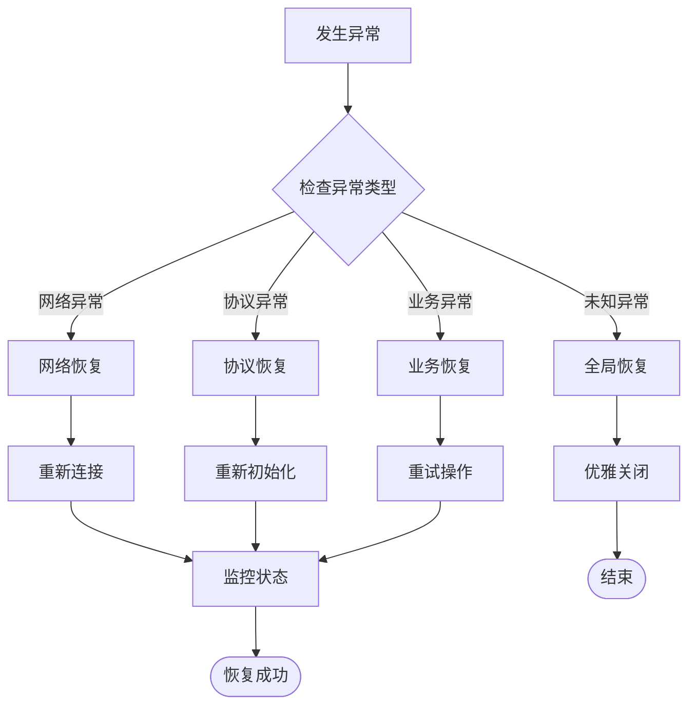

**图表来源**
- [GameYqlyyWsClient.java](file://src/main/java/com/yqlyy/GameYqlyyWsClient.java#L245-L272)

### 性能优化和内存管理

#### 1. 内存优化策略

```java
// 使用对象池减少GC压力
private static final ObjectPool<ByteBuffer> byteBufferPool = new GenericObjectPool<>();

// 复用TARS输入流
private static final ObjectPool<TarsInputStream> tarsStreamPool = new GenericObjectPool<>();

// 批量处理消息
public void processBatchMessages(List<ByteBuffer> messages) {
    for (ByteBuffer message : messages) {
        processSingleMessage(message);
    }
    // 手动清理临时对象
    System.gc();
}
```

#### 2. 线程池配置

为不同类型的处理任务配置专用线程池：

```java
@Configuration
public class ThreadPoolConfig {
    
    @Bean("wsThreadPool")
    public ExecutorService wsThreadPool() {
        return new ThreadPoolExecutor(
            2,  // 核心线程数
            4,  // 最大线程数
            60L, TimeUnit.SECONDS,  // 空闲时间
            new LinkedBlockingQueue<>(1000),  // 队列大小
            new NamedThreadFactory("ws-worker"),
            new ThreadPoolExecutor.CallerRunsPolicy()  // 拒绝策略
        );
    }
}
```

### 插件化架构设计

#### 1. 接口抽象

定义统一的游戏处理接口：

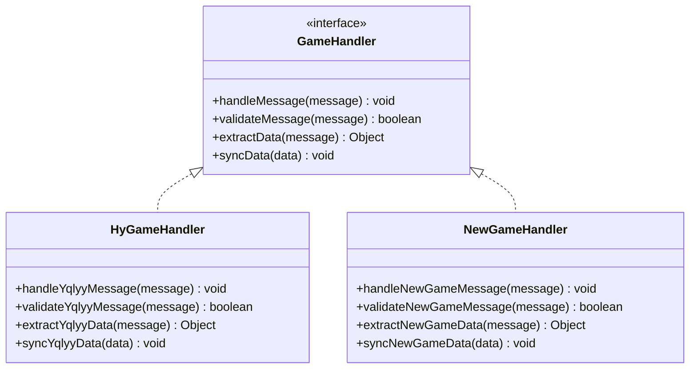

**图表来源**
- [GameYqlyyWsClient.java](file://src/main/java/com/yqlyy/GameYqlyyWsClient.java#L51-L219)

#### 2. 动态加载机制

实现基于SPI的服务发现：

```java
public class GameHandlerFactory {
    private static final Map<Integer, GameHandler> handlers = new ConcurrentHashMap<>();
    
    static {
        loadHandlers();
    }
    
    private static void loadHandlers() {
        ServiceLoader<GameHandler> loader = ServiceLoader.load(GameHandler.class);
        for (GameHandler handler : loader) {
            handlers.put(handler.getGameId(), handler);
        }
    }
    
    public static GameHandler getHandler(int gameId) {
        return handlers.get(gameId);
    }
}
```

**章节来源**
- [GameYqlyyWsClient.java](file://src/main/java/com/yqlyy/GameYqlyyWsClient.java#L1-L328)
- [application.yml](file://src/main/resources/application.yml#L1-L31)

## 性能考虑

### 内存管理最佳实践

1. **对象池化**: 对频繁创建的对象使用对象池，如`ByteBuffer`和`TarsInputStream`
2. **及时释放**: 在消息处理完成后及时释放临时对象
3. **批量处理**: 将多个小消息合并为批量处理以减少开销
4. **监控内存**: 使用JVM监控工具跟踪内存使用情况

### 网络性能优化

1. **连接复用**: 复用WebSocket连接，避免频繁重建
2. **异步处理**: 使用异步方式处理消息，提高吞吐量
3. **背压控制**: 实现合理的背压机制防止消息积压
4. **压缩传输**: 对大数据量的消息启用压缩

### 线程安全

1. **不可变对象**: 尽可能使用不可变数据模型
2. **线程本地存储**: 使用ThreadLocal存储线程特定的数据
3. **并发集合**: 使用并发安全的集合类
4. **锁粒度**: 最小化锁的范围和持有时间

## 故障排除指南

### 常见问题诊断

#### 1. WebSocket连接问题

**症状**: 连接频繁断开
**排查步骤**:
1. 检查网络连接稳定性
2. 验证WebSocket URL的有效性
3. 查看心跳机制是否正常工作
4. 检查防火墙设置

#### 2. TARS解析错误

**症状**: 消息解析失败
**排查步骤**:
1. 验证TARS协议版本兼容性
2. 检查字段索引映射是否正确
3. 确认数据类型匹配
4. 查看协议文档更新

#### 3. HTTP同步失败

**症状**: 数据同步接口调用失败
**排查步骤**:
1. 检查目标服务器可达性
2. 验证请求格式和参数
3. 查看服务器响应状态
4. 检查认证信息

### 日志分析

系统使用SLF4J记录详细的运行日志，重点关注以下日志级别：

- **ERROR**: 严重错误和异常
- **WARN**: 可能的问题和警告
- **INFO**: 重要事件和状态变化
- **DEBUG**: 详细的技术信息

**章节来源**
- [GameYqlyyWsClient.java](file://src/main/java/com/yqlyy/GameYqlyyWsClient.java#L245-L248)
- [application.yml](file://src/main/resources/application.yml#L1-L31)

## 结论

本扩展开发指南提供了在现有虎牙游戏爬虫系统基础上添加新游戏支持的完整方案。通过遵循本文档的步骤和最佳实践，开发者可以：

1. **快速集成新游戏**: 按照既定的架构模式快速添加新的虎牙游戏支持
2. **保持系统稳定性**: 通过完善的错误处理和异常恢复机制确保系统稳定运行
3. **优化性能表现**: 利用内存管理和性能优化技术提升系统处理能力
4. **便于维护扩展**: 通过插件化架构设计使系统更易于维护和扩展

关键要点包括：
- 严格遵循TARS协议规范进行二进制消息解析
- 实现完整的数据验证和转换逻辑
- 设计健壮的错误处理和恢复机制
- 优化内存使用和网络性能
- 采用插件化架构支持动态扩展

通过这些措施，系统能够可靠地支持多个虎牙游戏的数据采集和处理需求，为后续的功能扩展奠定坚实基础。