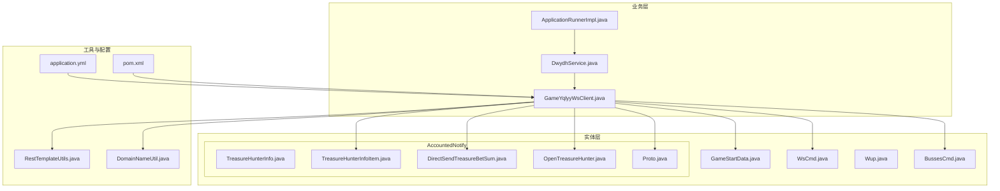
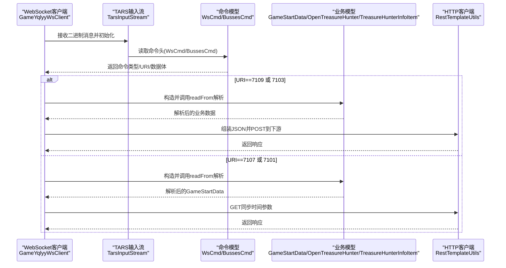
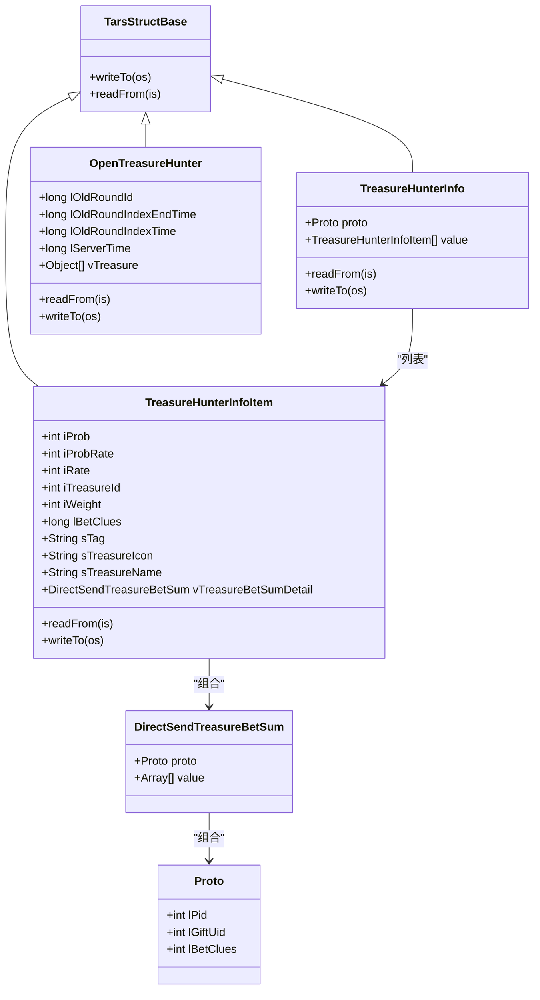
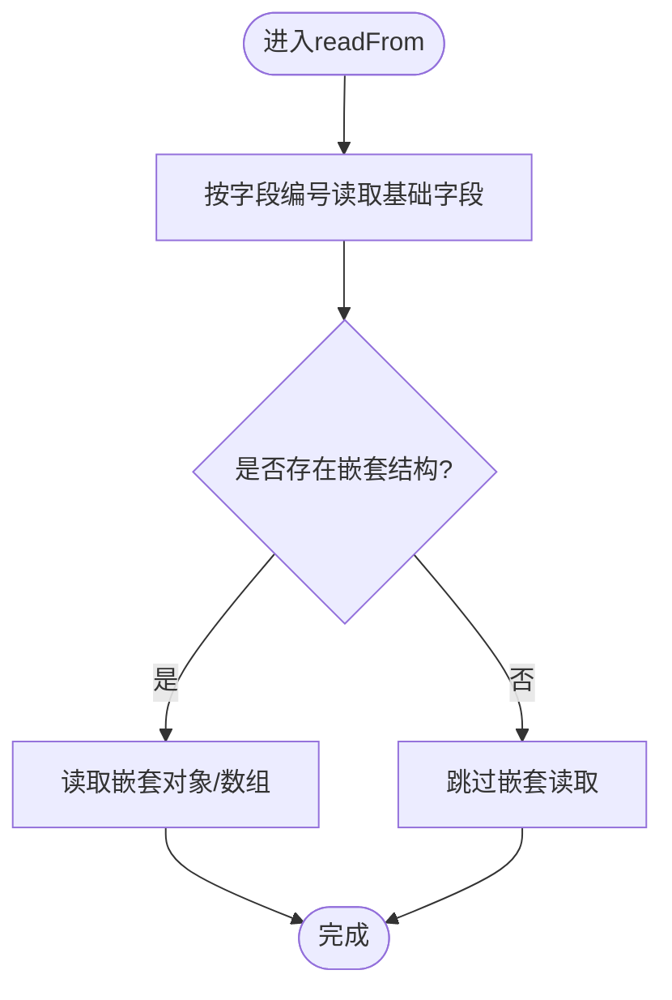
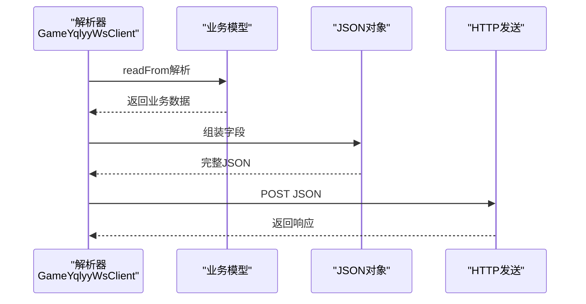
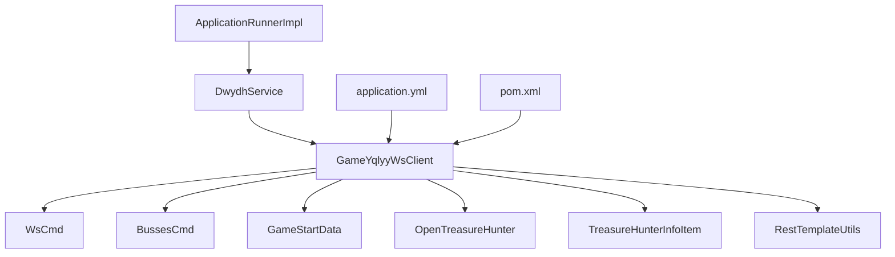

# 数据模型扩展

<cite>
**本文引用的文件**
- [GameStartData.java](file://src/main/java/com/entity/GameStartData.java)
- [WsCmd.java](file://src/main/java/com/entity/WsCmd.java)
- [Wup.java](file://src/main/java/com/entity/Wup.java)
- [BussesCmd.java](file://src/main/java/com/entity/BussesCmd.java)
- [TreasureHunterInfo.java](file://src/main/java/com/entity/AccountedNotify/TreasureHunterInfo.java)
- [TreasureHunterInfoItem.java](file://src/main/java/com/entity/AccountedNotify/TreasureHunterInfoItem.java)
- [DirectSendTreasureBetSum.java](file://src/main/java/com/entity/AccountedNotify/DirectSendTreasureBetSum.java)
- [OpenTreasureHunter.java](file://src/main/java/com/entity/AccountedNotify/OpenTreasureHunter.java)
- [Proto.java](file://src/main/java/com/entity/AccountedNotify/Proto.java)
- [GameYqlyyWsClient.java](file://src/main/java/com/yqlyy/GameYqlyyWsClient.java)
- [DwydhService.java](file://src/main/java/com/dwydh/DwydhService.java)
- [ApplicationRunnerImpl.java](file://src/main/java/com/listener/ApplicationRunnerImpl.java)
- [RestTemplateUtils.java](file://src/main/java/com/commom/RestTemplateUtils.java)
- [DomainNameUtil.java](file://src/main/java/com/utils/DomainNameUtil.java)
- [application.yml](file://src/main/resources/application.yml)
- [pom.xml](file://src/main/pom.xml)
</cite>

## 目录
1. [引言](#引言)
2. [项目结构](#项目结构)
3. [核心组件](#核心组件)
4. [架构总览](#架构总览)
5. [详细组件分析](#详细组件分析)
6. [依赖关系分析](#依赖关系分析)
7. [性能考虑](#性能考虑)
8. [故障排查指南](#故障排查指南)
9. [结论](#结论)
10. [附录](#附录)

## 引言
本指南面向在现有数据模型基础上新增字段与属性以支持新游戏数据的场景，系统性阐述以下主题：
- 在现有数据模型上扩展字段与属性的方法
- TARS 协议数据模型的扩展（结构体定义、字段映射规则）
- 数据模型的继承与组合设计模式（复用既有类）
- JSON 数据格式的扩展（新增字段与数据验证规则）
- 数据模型版本兼容性与迁移策略

本指南结合仓库中的实际数据模型与解析流程，提供可操作的扩展步骤与最佳实践。

## 项目结构
项目采用按功能域分层的组织方式：
- 实体层：存放各类数据模型，包括通用命令模型、TARS 协议相关模型以及账户通知相关模型
- 业务层：WebSocket 客户端负责接收与解析二进制消息，转换为实体模型，并通过 HTTP 将 JSON 数据转发给下游
- 工具与配置：日志、HTTP 客户端封装、域名与环境配置等

**图表来源**
- [GameYqlyyWsClient.java](file://src/main/java/com/yqlyy/GameYqlyyWsClient.java#L52-L219)
- [DwydhService.java](file://src/main/java/com/dwydh/DwydhService.java#L21-L36)
- [ApplicationRunnerImpl.java](file://src/main/java/com/listener/ApplicationRunnerImpl.java#L25-L31)
- [RestTemplateUtils.java](file://src/main/java/com/commom/RestTemplateUtils.java#L19-L29)
- [DomainNameUtil.java](file://src/main/java/com/utils/DomainNameUtil.java#L4-L13)
- [application.yml](file://src/main/resources/application.yml#L1-L31)
- [pom.xml](file://src/main/pom.xml#L26-L111)

**章节来源**
- [GameYqlyyWsClient.java](file://src/main/java/com/yqlyy/GameYqlyyWsClient.java#L52-L219)
- [DwydhService.java](file://src/main/java/com/dwydh/DwydhService.java#L21-L36)
- [ApplicationRunnerImpl.java](file://src/main/java/com/listener/ApplicationRunnerImpl.java#L25-L31)
- [application.yml](file://src/main/resources/application.yml#L1-L31)

## 核心组件
本节聚焦于数据模型的核心类及其职责：
- 通用命令模型：WsCmd、BussesCmd、GameStartData
- TARS 协议模型：Wup、AccountedNotify 下的各结构体
- 解析与转发：GameYqlyyWsClient 对二进制消息进行解析，并构造 JSON 发送

关键点：
- WsCmd 作为外层协议头，承载命令类型、请求 ID、时间戳、加密信息等
- BussesCmd 承载业务推送类型、URI 与消息体
- GameStartData 用于记录轮次时间与 ID 等状态
- AccountedNotify 下的结构体用于解析具体的业务数据（如开宝箱、幸运怪物等）

**章节来源**
- [WsCmd.java](file://src/main/java/com/entity/WsCmd.java#L3-L68)
- [BussesCmd.java](file://src/main/java/com/entity/BussesCmd.java#L3-L9)
- [GameStartData.java](file://src/main/java/com/entity/GameStartData.java#L3-L78)
- [Wup.java](file://src/main/java/com/entity/Wup.java#L6-L28)
- [TreasureHunterInfo.java](file://src/main/java/com/entity/AccountedNotify/TreasureHunterInfo.java#L10-L43)
- [TreasureHunterInfoItem.java](file://src/main/java/com/entity/AccountedNotify/TreasureHunterInfoItem.java#L8-L123)
- [DirectSendTreasureBetSum.java](file://src/main/java/com/entity/AccountedNotify/DirectSendTreasureBetSum.java#L5-L8)
- [OpenTreasureHunter.java](file://src/main/java/com/entity/AccountedNotify/OpenTreasureHunter.java#L10-L82)
- [Proto.java](file://src/main/java/com/entity/AccountedNotify/Proto.java#L3-L7)

## 架构总览
下图展示从 WebSocket 接收二进制消息到 JSON 转发的完整流程，以及数据模型之间的关系。

**图表来源**
- [GameYqlyyWsClient.java](file://src/main/java/com/yqlyy/GameYqlyyWsClient.java#L52-L219)
- [WsCmd.java](file://src/main/java/com/entity/WsCmd.java#L3-L68)
- [BussesCmd.java](file://src/main/java/com/entity/BussesCmd.java#L3-L9)
- [GameStartData.java](file://src/main/java/com/entity/GameStartData.java#L3-L78)
- [OpenTreasureHunter.java](file://src/main/java/com/entity/AccountedNotify/OpenTreasureHunter.java#L78-L81)
- [TreasureHunterInfoItem.java](file://src/main/java/com/entity/AccountedNotify/TreasureHunterInfoItem.java#L111-L122)
- [RestTemplateUtils.java](file://src/main/java/com/commom/RestTemplateUtils.java#L19-L29)

## 详细组件分析

### TARS 协议数据模型扩展
TARS 协议通过结构体基类与输入输出流实现序列化/反序列化。扩展时需遵循字段编号与读写顺序约定。

扩展建议：
- 新增字段时，选择未使用的字段编号并在 readFrom/writeTo 中成对添加
- 保持字段读写顺序与协议版本一致，避免错位
- 对复杂嵌套结构优先采用组合而非深层继承，便于维护

**图表来源**
- [TreasureHunterInfoItem.java](file://src/main/java/com/entity/AccountedNotify/TreasureHunterInfoItem.java#L8-L123)
- [DirectSendTreasureBetSum.java](file://src/main/java/com/entity/AccountedNotify/DirectSendTreasureBetSum.java#L5-L8)
- [Proto.java](file://src/main/java/com/entity/AccountedNotify/Proto.java#L3-L7)
- [TreasureHunterInfo.java](file://src/main/java/com/entity/AccountedNotify/TreasureHunterInfo.java#L10-L43)
- [OpenTreasureHunter.java](file://src/main/java/com/entity/AccountedNotify/OpenTreasureHunter.java#L10-L82)

**章节来源**
- [TreasureHunterInfoItem.java](file://src/main/java/com/entity/AccountedNotify/TreasureHunterInfoItem.java#L105-L122)
- [DirectSendTreasureBetSum.java](file://src/main/java/com/entity/AccountedNotify/DirectSendTreasureBetSum.java#L5-L8)
- [Proto.java](file://src/main/java/com/entity/AccountedNotify/Proto.java#L3-L7)
- [TreasureHunterInfo.java](file://src/main/java/com/entity/AccountedNotify/TreasureHunterInfo.java#L32-L42)
- [OpenTreasureHunter.java](file://src/main/java/com/entity/AccountedNotify/OpenTreasureHunter.java#L67-L81)

### 字段映射规则（TARS）
- 字段编号与读取顺序必须与协议定义一致
- 基类 readFrom/writeTo 仅作占位时，需在子类中显式覆盖
- 复杂对象（如数组、嵌套结构）需在 readFrom 中逐项读取

**图表来源**
- [TreasureHunterInfoItem.java](file://src/main/java/com/entity/AccountedNotify/TreasureHunterInfoItem.java#L111-L122)
- [OpenTreasureHunter.java](file://src/main/java/com/entity/AccountedNotify/OpenTreasureHunter.java#L73-L81)

**章节来源**
- [TreasureHunterInfoItem.java](file://src/main/java/com/entity/AccountedNotify/TreasureHunterInfoItem.java#L111-L122)
- [OpenTreasureHunter.java](file://src/main/java/com/entity/AccountedNotify/OpenTreasureHunter.java#L73-L81)

### 数据模型继承与组合设计模式
- 继承：所有 TARS 结构体继承自统一基类，统一读写接口
- 组合：复杂对象通过组合其他结构体实现复用，降低耦合度
- 列表聚合：使用泛型集合承载多个同构对象，便于扩展

最佳实践：
- 优先组合而非多层继承
- 明确边界：每个模型只负责自身字段与读写逻辑
- 对外暴露稳定接口，内部细节可演进

**章节来源**
- [TreasureHunterInfo.java](file://src/main/java/com/entity/AccountedNotify/TreasureHunterInfo.java#L10-L28)
- [OpenTreasureHunter.java](file://src/main/java/com/entity/AccountedNotify/OpenTreasureHunter.java#L16-L20)
- [DirectSendTreasureBetSum.java](file://src/main/java/com/entity/AccountedNotify/DirectSendTreasureBetSum.java#L5-L8)

### JSON 数据格式扩展
当前解析流程中，业务数据被转换为 JSON 并通过 HTTP POST 发送。扩展 JSON 字段时应：
- 在解析完成后构建 JSON 对象，设置必要字段
- 保持字段命名与下游系统约定一致
- 对必填字段进行校验，缺失时记录告警并跳过发送

**图表来源**
- [GameYqlyyWsClient.java](file://src/main/java/com/yqlyy/GameYqlyyWsClient.java#L89-L117)
- [GameYqlyyWsClient.java](file://src/main/java/com/yqlyy/GameYqlyyWsClient.java#L165-L182)

**章节来源**
- [GameYqlyyWsClient.java](file://src/main/java/com/yqlyy/GameYqlyyWsClient.java#L89-L117)
- [GameYqlyyWsClient.java](file://src/main/java/com/yqlyy/GameYqlyyWsClient.java#L165-L182)

### 数据模型版本兼容性与迁移策略
- 版本标识：在协议头或上下文中标注版本号，便于区分不同版本的消息
- 向后兼容：新增字段默认可选，旧解析器忽略未知字段；删除字段时保留编号并标记废弃
- 渐进迁移：先在客户端兼容新旧两种格式，再逐步切换；对下游系统提供双通道支持
- 回滚预案：保留历史解析逻辑与数据落盘，确保回滚时仍可读取历史数据

## 依赖关系分析
- WebSocket 客户端依赖 TARS 输入输出流与实体模型
- 业务服务通过线程池调度客户端，应用启动时自动初始化
- HTTP 客户端封装了 RestTemplate，统一对外部系统的访问

**图表来源**
- [GameYqlyyWsClient.java](file://src/main/java/com/yqlyy/GameYqlyyWsClient.java#L52-L219)
- [DwydhService.java](file://src/main/java/com/dwydh/DwydhService.java#L21-L36)
- [ApplicationRunnerImpl.java](file://src/main/java/com/listener/ApplicationRunnerImpl.java#L25-L31)
- [application.yml](file://src/main/resources/application.yml#L1-L31)
- [pom.xml](file://src/main/pom.xml#L26-L111)

**章节来源**
- [GameYqlyyWsClient.java](file://src/main/java/com/yqlyy/GameYqlyyWsClient.java#L52-L219)
- [DwydhService.java](file://src/main/java/com/dwydh/DwydhService.java#L21-L36)
- [ApplicationRunnerImpl.java](file://src/main/java/com/listener/ApplicationRunnerImpl.java#L25-L31)
- [application.yml](file://src/main/resources/application.yml#L1-L31)
- [pom.xml](file://src/main/pom.xml#L26-L111)

## 性能考虑
- 消息解析：尽量减少重复创建输入流与模型实例，复用对象池
- JSON 构建：批量组装后再发送，避免频繁字符串拼接
- 线程模型：业务线程池大小与消息吞吐匹配，防止阻塞
- 超时控制：HTTP 请求设置合理超时与重试策略，避免阻塞解析线程

## 故障排查指南
常见问题与定位思路：
- WebSocket 连接异常：检查 URL 与证书配置，确认网络连通性
- TARS 解析失败：核对字段编号与读取顺序，确保协议版本一致
- JSON 发送失败：检查下游地址与鉴权，查看返回状态码与错误日志
- 时间同步异常：确认上游时间戳与本地时间差，避免偏差过大

**章节来源**
- [GameYqlyyWsClient.java](file://src/main/java/com/yqlyy/GameYqlyyWsClient.java#L240-L272)
- [GameYqlyyWsClient.java](file://src/main/java/com/yqlyy/GameYqlyyWsClient.java#L103-L114)
- [GameYqlyyWsClient.java](file://src/main/java/com/yqlyy/GameYqlyyWsClient.java#L202-L213)

## 结论
通过对现有数据模型与解析流程的深入分析，可以安全地在不破坏兼容性的前提下扩展字段与属性。建议遵循以下原则：
- 明确字段编号与读写顺序，保证 TARS 协议一致性
- 优先采用组合模式复用既有模型，减少继承层级
- 在 JSON 层面保持字段稳定性，提供必要的校验与容错
- 建立完善的版本管理与迁移策略，确保平滑过渡

## 附录
- 配置参考：端口、HTTP 连接池参数、Spring Profile 等
- 依赖清单：Spring Boot、TARS、WebSocket、Hutool、Netty 等

**章节来源**
- [application.yml](file://src/main/resources/application.yml#L1-L31)
- [pom.xml](file://src/main/pom.xml#L26-L111)