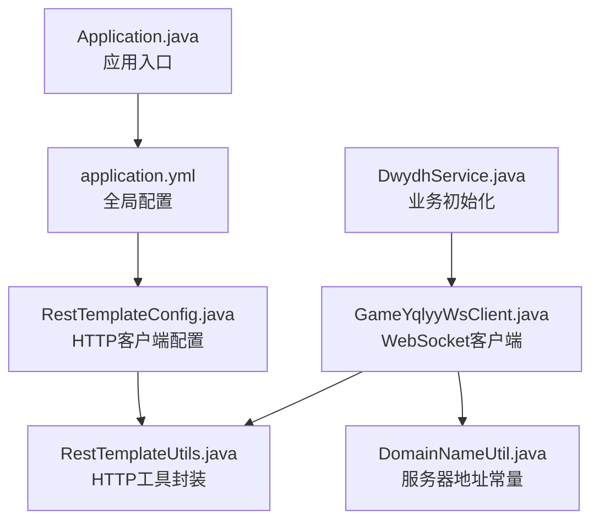
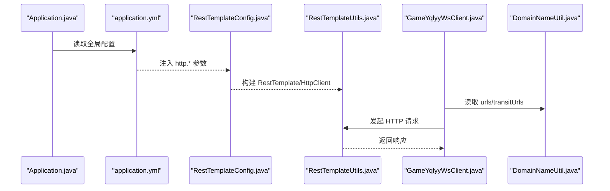
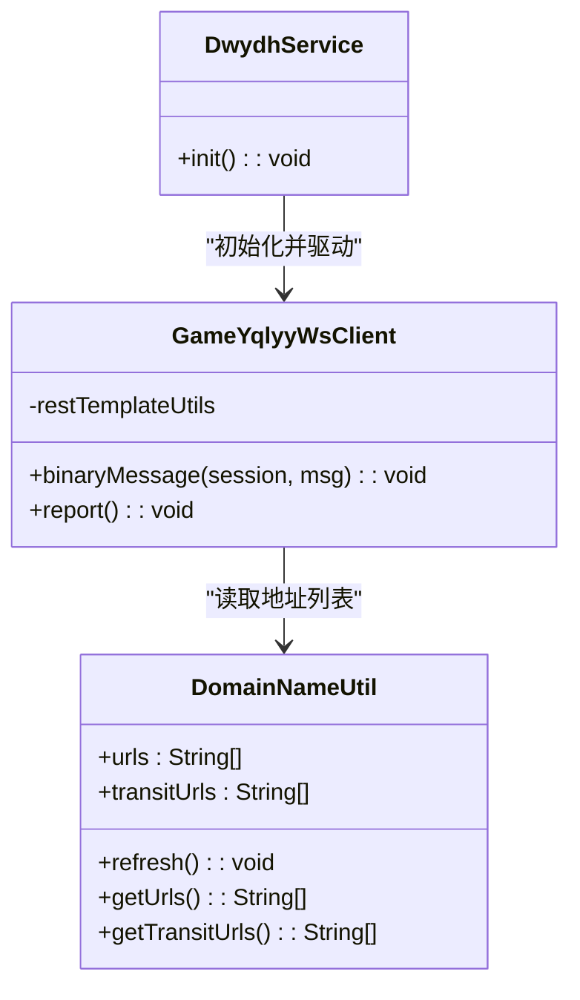
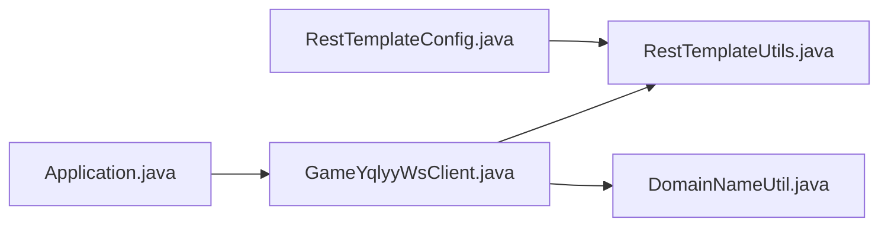

# 配置文件扩展

<cite>
**本文引用的文件列表**
- [application.yml](file://src/main/resources/application.yml)
- [RestTemplateConfig.java](file://src/main/java/com/commom/RestTemplateConfig.java)
- [RestTemplateUtils.java](file://src/main/java/com/commom/RestTemplateUtils.java)
- [DomainNameUtil.java](file://src/main/java/com/utils/DomainNameUtil.java)
- [GameYqlyyWsClient.java](file://src/main/java/com/yqlyy/GameYqlyyWsClient.java)
- [DwydhService.java](file://src/main/java/com/dwydh/DwydhService.java)
- [Application.java](file://src/main/java/com/Application.java)
- [pom.xml](file://pom.xml)
</cite>

## 目录
1. [简介](#简介)
2. [项目结构](#项目结构)
3. [核心组件](#核心组件)
4. [架构总览](#架构总览)
5. [详细组件分析](#详细组件分析)
6. [依赖关系分析](#依赖关系分析)
7. [性能考量](#性能考量)
8. [故障排查指南](#故障排查指南)
9. [结论](#结论)
10. [附录](#附录)

## 简介
本指南围绕“配置文件扩展”这一主题，系统阐述如何在现有工程基础上：
- 在 application.yml 中新增配置项以支持新的游戏参数与连接设置；
- 实施分环境管理策略（开发、测试、生产）；
- 扩展 DomainNameUtil 支持动态服务器地址与负载均衡策略；
- 探索动态配置更新的可行方案（热加载与变更监控）；
- 规范配置文件的安全管理与敏感信息保护。

本指南兼顾非技术读者的理解需求，通过图示与路径指引帮助快速定位实现位置与修改要点。

## 项目结构
项目采用 Spring Boot 标准目录组织，核心配置位于 resources 下的 application.yml；网络层通过 RestTemplateConfig 与 RestTemplateUtils 统一管理 HTTP 客户端连接池与请求封装；业务侧通过 GameYqlyyWsClient 与 DomainNameUtil 协作实现 WebSocket 数据采集与目标服务地址管理。

图表来源
- [Application.java](file://src/main/java/com/Application.java#L1-L14)
- [application.yml](file://src/main/resources/application.yml#L1-L31)
- [RestTemplateConfig.java](file://src/main/java/com/commom/RestTemplateConfig.java#L1-L131)
- [RestTemplateUtils.java](file://src/main/java/com/commom/RestTemplateUtils.java#L1-L31)
- [GameYqlyyWsClient.java](file://src/main/java/com/yqlyy/GameYqlyyWsClient.java#L1-L328)
- [DomainNameUtil.java](file://src/main/java/com/utils/DomainNameUtil.java#L1-L16)
- [DwydhService.java](file://src/main/java/com/dwydh/DwydhService.java#L1-L38)

章节来源
- [Application.java](file://src/main/java/com/Application.java#L1-L14)
- [application.yml](file://src/main/resources/application.yml#L1-L31)

## 核心组件
- 配置读取与注入
  - application.yml 中的 http.* 配置项通过 @Value 注入到 RestTemplateConfig 的字段中，用于构建 HttpClient 的连接池与超时策略。
- HTTP 客户端配置
  - RestTemplateConfig 基于 Apache HttpClient，统一管理连接池大小、并发限制、超时参数与 Keep-Alive 策略，并通过 RestTemplateUtils 暴露 get/post/exchange 等常用方法。
- 动态服务器地址与负载均衡
  - DomainNameUtil 当前为静态数组，分别维护 urls 与 transitUrls，供 GameYqlyyWsClient 在不同业务场景下进行广播式调用。
- 分环境管理
  - application.yml 中通过 spring.profiles.active 引入 Maven 属性占位符，结合 Maven 插件实现按环境切换。

章节来源
- [application.yml](file://src/main/resources/application.yml#L12-L14)
- [RestTemplateConfig.java](file://src/main/java/com/commom/RestTemplateConfig.java#L35-L54)
- [RestTemplateUtils.java](file://src/main/java/com/commom/RestTemplateUtils.java#L14-L30)
- [DomainNameUtil.java](file://src/main/java/com/utils/DomainNameUtil.java#L4-L13)
- [GameYqlyyWsClient.java](file://src/main/java/com/yqlyy/GameYqlyyWsClient.java#L103-L114)

## 架构总览
下图展示配置与组件之间的交互关系，以及配置如何影响 HTTP 客户端行为与业务调用路径。

图表来源
- [Application.java](file://src/main/java/com/Application.java#L1-L14)
- [application.yml](file://src/main/resources/application.yml#L12-L30)
- [RestTemplateConfig.java](file://src/main/java/com/commom/RestTemplateConfig.java#L35-L129)
- [RestTemplateUtils.java](file://src/main/java/com/commom/RestTemplateUtils.java#L14-L30)
- [GameYqlyyWsClient.java](file://src/main/java/com/yqlyy/GameYqlyyWsClient.java#L103-L114)
- [DomainNameUtil.java](file://src/main/java/com/utils/DomainNameUtil.java#L4-L13)

## 详细组件分析

### 在 application.yml 中新增配置项
- 新增游戏参数与连接设置
  - 建议在 http 节点下新增字段，如最大连接数、并发路由数、超时时间等，保持与现有键名一致的命名风格，便于 @Value 注入。
  - 示例新增键位（仅示意，不直接粘贴代码）：
    - http.retryCount
    - http.connectionTTL
    - http.proxyHost/http.proxyPort
    - game.tigerTeeth.timeout.multiplier
- 与 RestTemplateConfig 的映射
  - RestTemplateConfig 已通过 @Value 将 http.* 映射到字段，新增配置后只需在对应字段上添加 @Value 注解并使用即可生效。

章节来源
- [application.yml](file://src/main/resources/application.yml#L16-L30)
- [RestTemplateConfig.java](file://src/main/java/com/commom/RestTemplateConfig.java#L35-L54)

### 分环境管理策略（开发/测试/生产）
- 环境激活
  - application.yml 中通过 spring.profiles.active 引入 Maven 属性占位符，实际环境值由 Maven 插件在构建时注入。
- 推荐实践
  - 为每个环境创建独立的 profile 文件（例如 application-dev.yml、application-test.yml、application-prod.yml），并在主 application.yml 中仅保留激活标识。
  - 在 Maven 中通过属性控制 profiles.active，实现 CI/CD 自动化切换。
- 注意事项
  - 确保各环境的端口、上下文路径、数据库连接、第三方服务地址等差异化配置清晰分离，避免硬编码。

章节来源
- [application.yml](file://src/main/resources/application.yml#L12-L14)
- [pom.xml](file://pom.xml#L116-L121)

### 动态配置更新与热加载
- 现状分析
  - 当前工程未引入 Spring Cloud Config 或 Actuator 的动态刷新能力，配置变更需重启生效。
- 可行方案
  - 方案A：引入 Spring Cloud Config + Bus，结合 @RefreshScope 实现 Bean 级别的动态刷新。
  - 方案B：自定义配置中心 + 定时轮询，将配置写入本地缓存，业务层读取缓存而非直接读取 @Value。
  - 方案C：使用 Spring Boot Actuator 的 refresh 端点，结合 @RefreshScope 对关键 Bean 进行刷新。
- 建议
  - 对于 HTTP 连接池参数（如超时、并发），建议通过 @RefreshScope 包裹相关 Bean，避免频繁重启。
  - 对于域名列表（urls/transitUrls），建议通过外部配置中心下发，业务侧定时拉取并替换内存中的数组。

章节来源
- [RestTemplateConfig.java](file://src/main/java/com/commom/RestTemplateConfig.java#L35-L54)
- [pom.xml](file://pom.xml#L142-L153)

### 扩展 DomainNameUtil 支持动态服务器地址与负载均衡
- 现状
  - DomainNameUtil 为静态数组，urls 与 transitUrls 用于业务广播式调用。
- 扩展方向
  - 动态地址：从配置中心或外部服务拉取地址列表，支持健康检查与剔除失效节点。
  - 负载均衡：实现轮询、权重、一致性哈希等策略，提升容错与吞吐。
  - 缓存与刷新：将地址列表缓存在内存中，定期刷新，避免每次调用都进行 IO。
- 代码改造要点
  - 将静态数组改为可变集合，提供 add/remove/update 方法。
  - 在 GameYqlyyWsClient 中注入 DomainNameUtil，调用其动态接口获取当前可用地址。
  - 在 DwydhService 或 ApplicationRunnerImpl 中启动定时任务，周期性拉取并更新地址列表。

图表来源
- [DomainNameUtil.java](file://src/main/java/com/utils/DomainNameUtil.java#L4-L13)
- [GameYqlyyWsClient.java](file://src/main/java/com/yqlyy/GameYqlyyWsClient.java#L103-L114)
- [DwydhService.java](file://src/main/java/com/dwydh/DwydhService.java#L21-L36)

章节来源
- [DomainNameUtil.java](file://src/main/java/com/utils/DomainNameUtil.java#L4-L13)
- [GameYqlyyWsClient.java](file://src/main/java/com/yqlyy/GameYqlyyWsClient.java#L103-L114)
- [DwydhService.java](file://src/main/java/com/dwydh/DwydhService.java#L21-L36)

### 配置文件的安全管理与敏感信息保护
- 敏感信息识别
  - 密钥、密码、令牌、第三方服务密钥等应避免明文存储在 application.yml 中。
- 保护策略
  - 使用环境变量或密钥管理服务（如 Vault、KMS）注入敏感值，通过 @Value 或 Spring Cloud Config 的加密功能读取。
  - 对于必须写入配置文件的敏感值，采用对称加密存储，运行时解密。
  - 严格控制配置文件权限，仅允许运维人员访问。
- 配置扫描与审计
  - 在 CI/CD 流程中加入敏感信息扫描，防止误提交。
  - 定期审计配置文件变更记录，追踪责任人与变更原因。

[本节为通用指导，无需特定文件引用]

## 依赖关系分析
- 组件耦合
  - RestTemplateConfig 与 RestTemplateUtils 形成“配置-工具”链路，GameYqlyyWsClient 依赖两者进行 HTTP 通信。
  - DomainNameUtil 与 GameYqlyyWsClient 存在直接依赖，建议通过接口抽象降低耦合。
- 外部依赖
  - Apache HttpClient、Spring Web、WebSocket Tyrus 等依赖在 pom.xml 中声明，确保版本兼容。

图表来源
- [RestTemplateConfig.java](file://src/main/java/com/commom/RestTemplateConfig.java#L62-L129)
- [RestTemplateUtils.java](file://src/main/java/com/commom/RestTemplateUtils.java#L14-L30)
- [GameYqlyyWsClient.java](file://src/main/java/com/yqlyy/GameYqlyyWsClient.java#L103-L114)
- [DomainNameUtil.java](file://src/main/java/com/utils/DomainNameUtil.java#L4-L13)
- [Application.java](file://src/main/java/com/Application.java#L1-L14)

章节来源
- [pom.xml](file://pom.xml#L26-L111)

## 性能考量
- 连接池优化
  - 合理设置 http.maxTotal 与 http.defaultMaxPerRoute，避免过度占用资源或阻塞等待。
  - 通过 http.validateAfterInactivity 控制空闲连接回收，减少无效连接带来的开销。
- 超时策略
  - 根据业务延迟与下游服务性能调整 http.socketTimeout、http.connectTimeout、http.connectionRequestTimeout。
- 负载均衡
  - 对 urls/transitUrls 实施轮询或加权策略，避免单点过载；结合健康检查剔除不可用节点。

[本节为通用指导，无需特定文件引用]

## 故障排查指南
- HTTP 连接异常
  - 检查 http.* 配置是否合理，确认连接池大小与超时参数满足业务峰值。
  - 关注日志中 RestClientException 与连接超时信息，定位网络或下游服务问题。
- WebSocket 断连
  - 关注 GameYqlyyWsClient 的 onOpen/onClose/onError 回调日志，必要时重建连接。
- 地址列表问题
  - 若业务未收到回调或未触发上报，检查 DomainNameUtil 的 urls/transitUrls 是否为空或格式错误。

章节来源
- [RestTemplateConfig.java](file://src/main/java/com/commom/RestTemplateConfig.java#L84-L129)
- [GameYqlyyWsClient.java](file://src/main/java/com/yqlyy/GameYqlyyWsClient.java#L240-L248)

## 结论
- 通过在 application.yml 中新增 http.* 配置项，可灵活控制 HTTP 客户端行为；
- 借助 Spring Profiles 与 Maven 插件实现多环境隔离；
- 通过扩展 DomainNameUtil 支持动态地址与负载均衡，提升系统的弹性与可用性；
- 动态配置更新可通过 @RefreshScope 或配置中心落地，建议优先采用；
- 敏感信息应通过密钥管理与加密手段保护，配合 CI/CD 审计流程，确保配置安全。

[本节为总结，无需特定文件引用]

## 附录
- 新增配置项参考路径
  - [application.yml](file://src/main/resources/application.yml#L16-L30)
  - [RestTemplateConfig.java](file://src/main/java/com/commom/RestTemplateConfig.java#L35-L54)
- 动态配置与刷新参考路径
  - [RestTemplateConfig.java](file://src/main/java/com/commom/RestTemplateConfig.java#L35-L54)
  - [pom.xml](file://pom.xml#L142-L153)
- 动态服务器地址与负载均衡参考路径
  - [DomainNameUtil.java](file://src/main/java/com/utils/DomainNameUtil.java#L4-L13)
  - [GameYqlyyWsClient.java](file://src/main/java/com/yqlyy/GameYqlyyWsClient.java#L103-L114)
  - [DwydhService.java](file://src/main/java/com/dwydh/DwydhService.java#L21-L36)