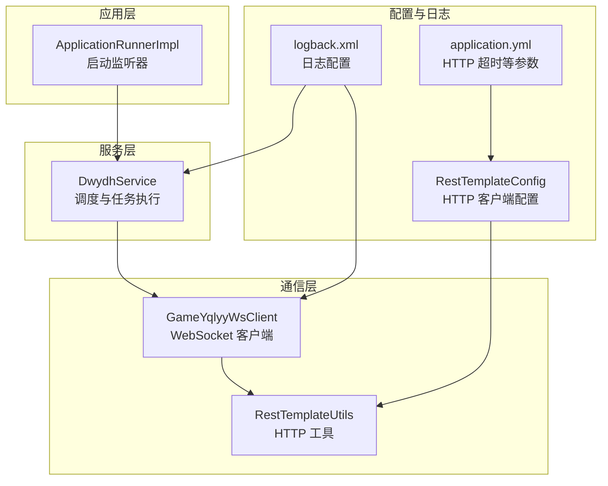
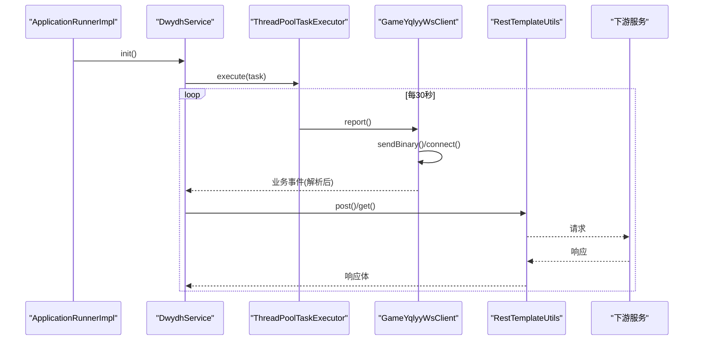
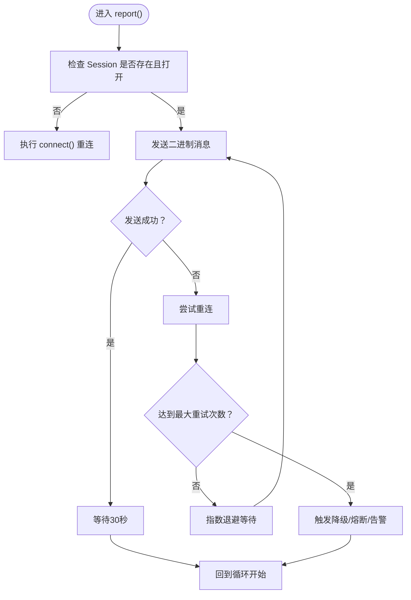
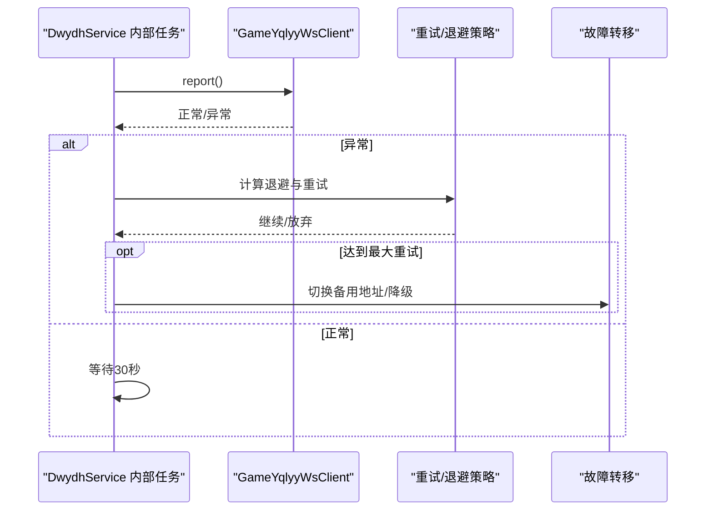
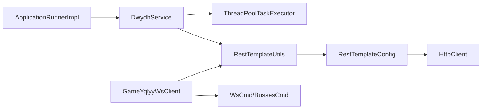

# 错误处理扩展

<cite>
**本文引用的文件**
- [DwydhService.java](file://src/main/java/com/dwydh/DwydhService.java)
- [GameYqlyyWsClient.java](file://src/main/java/com/yqlyy/GameYqlyyWsClient.java)
- [RestTemplateUtils.java](file://src/main/java/com/commom/RestTemplateUtils.java)
- [RestTemplateConfig.java](file://src/main/java/com/commom/RestTemplateConfig.java)
- [ApplicationRunnerImpl.java](file://src/main/java/com/listener/ApplicationRunnerImpl.java)
- [WsCmd.java](file://src/main/java/com/entity/WsCmd.java)
- [BussesCmd.java](file://src/main/java/com/entity/BussesCmd.java)
- [application.yml](file://src/main/resources/application.yml)
- [logback.xml](file://src/main/resources/logback.xml)
- [pom.xml](file://pom.xml)
</cite>

## 目录
1. [简介](#简介)
2. [项目结构](#项目结构)
3. [核心组件](#核心组件)
4. [架构总览](#架构总览)
5. [详细组件分析](#详细组件分析)
6. [依赖关系分析](#依赖关系分析)
7. [性能与稳定性考量](#性能与稳定性考量)
8. [故障排查指南](#故障排查指南)
9. [结论](#结论)
10. [附录](#附录)

## 简介
本指南围绕当前代码库中的错误处理现状，系统性地提出扩展方案，重点覆盖：
- WebSocket 客户端的异常捕获与错误恢复机制（网络异常、协议异常、业务异常）
- DwydhService 中服务调度的错误处理与故障转移策略
- 日志记录的扩展（格式化、关键信息提取）
- 优雅降级与熔断机制的实现建议
- 错误监控与告警系统的扩展实践

目标是在不破坏现有功能的前提下，提升系统的健壮性、可观测性与可维护性。

## 项目结构
项目采用分层与按功能域组织的结构：
- com.dwydh：服务调度入口，负责启动 WebSocket 客户端任务
- com.yqlyy：WebSocket 客户端实现，处理与虎牙 WebSocket 的连接、消息解析与业务上报
- com.commom：通用工具，包括 HTTP 客户端封装与配置
- com.entity：协议与业务数据模型
- com.listener：应用启动监听器，触发服务初始化
- resources：Spring 配置与日志配置

图表来源
- [ApplicationRunnerImpl.java](file://src/main/java/com/listener/ApplicationRunnerImpl.java#L21-L33)
- [DwydhService.java](file://src/main/java/com/dwydh/DwydhService.java#L14-L38)
- [GameYqlyyWsClient.java](file://src/main/java/com/yqlyy/GameYqlyyWsClient.java#L29-L327)
- [RestTemplateUtils.java](file://src/main/java/com/commom/RestTemplateUtils.java#L14-L30)
- [RestTemplateConfig.java](file://src/main/java/com/commom/RestTemplateConfig.java#L34-L131)
- [application.yml](file://src/main/resources/application.yml#L16-L30)
- [logback.xml](file://src/main/resources/logback.xml#L1-L75)

章节来源
- [ApplicationRunnerImpl.java](file://src/main/java/com/listener/ApplicationRunnerImpl.java#L21-L33)
- [DwydhService.java](file://src/main/java/com/dwydh/DwydhService.java#L14-L38)
- [GameYqlyyWsClient.java](file://src/main/java/com/yqlyy/GameYqlyyWsClient.java#L29-L327)
- [RestTemplateUtils.java](file://src/main/java/com/commom/RestTemplateUtils.java#L14-L30)
- [RestTemplateConfig.java](file://src/main/java/com/commom/RestTemplateConfig.java#L34-L131)
- [application.yml](file://src/main/resources/application.yml#L16-L30)
- [logback.xml](file://src/main/resources/logback.xml#L1-L75)

## 核心组件
- DwydhService：使用线程池执行 WebSocket 客户端任务，循环调用上报逻辑；当前未实现异常捕获与重试/恢复
- GameYqlyyWsClient：WebSocket 客户端，包含连接、消息处理、错误回调；部分异常处理较为简单
- RestTemplateUtils/RestTemplateConfig：HTTP 客户端封装与连接池配置，具备基础超时与重试能力
- ApplicationRunnerImpl：应用启动后触发 DwydhService 初始化
- 实体模型：WsCmd、BussesCmd 等用于协议解析

章节来源
- [DwydhService.java](file://src/main/java/com/dwydh/DwydhService.java#L14-L38)
- [GameYqlyyWsClient.java](file://src/main/java/com/yqlyy/GameYqlyyWsClient.java#L29-L327)
- [RestTemplateUtils.java](file://src/main/java/com/commom/RestTemplateUtils.java#L14-L30)
- [RestTemplateConfig.java](file://src/main/java/com/commom/RestTemplateConfig.java#L34-L131)
- [ApplicationRunnerImpl.java](file://src/main/java/com/listener/ApplicationRunnerImpl.java#L21-L33)
- [WsCmd.java](file://src/main/java/com/entity/WsCmd.java#L3-L68)
- [BussesCmd.java](file://src/main/java/com/entity/BussesCmd.java#L3-L9)

## 架构总览
WebSocket 客户端通过 DwydhService 的线程池定期上报，业务数据经由 HTTP 客户端同步至下游服务。日志通过 Logback 输出到控制台与滚动文件。

图表来源
- [ApplicationRunnerImpl.java](file://src/main/java/com/listener/ApplicationRunnerImpl.java#L25-L30)
- [DwydhService.java](file://src/main/java/com/dwydh/DwydhService.java#L21-L36)
- [GameYqlyyWsClient.java](file://src/main/java/com/yqlyy/GameYqlyyWsClient.java#L274-L290)
- [RestTemplateUtils.java](file://src/main/java/com/commom/RestTemplateUtils.java#L19-L29)

## 详细组件分析

### WebSocket 客户端错误处理扩展
当前实现的问题：
- 连接异常与消息异常处理较为简单，仅记录日志
- 发送二进制消息失败时尝试重建连接，但缺乏指数退避与最大重试次数限制
- 缺少对协议解析异常（如 TARS 解码失败）的保护

建议的改进方向：
- 分类处理三类异常
  - 网络异常：连接失败、心跳超时、底层 I/O 异常
  - 协议异常：消息格式不符、解码失败、字段缺失
  - 业务异常：业务校验失败、上游数据异常、下游服务不可用
- 引入指数退避与最大重试次数，避免“惊群效应”
- 在 onError 回调中区分异常类型并采取不同恢复策略
- 对关键业务流程（如开奖结果同步）增加幂等与去重

图表来源
- [GameYqlyyWsClient.java](file://src/main/java/com/yqlyy/GameYqlyyWsClient.java#L274-L290)
- [GameYqlyyWsClient.java](file://src/main/java/com/yqlyy/GameYqlyyWsClient.java#L250-L272)
- [GameYqlyyWsClient.java](file://src/main/java/com/yqlyy/GameYqlyyWsClient.java#L245-L248)

章节来源
- [GameYqlyyWsClient.java](file://src/main/java/com/yqlyy/GameYqlyyWsClient.java#L245-L290)

### DwydhService 服务调度错误处理与故障转移
现状：
- 使用线程池执行任务，循环调用客户端上报
- 未对异常进行捕获与恢复，中断后不会自动重启

建议：
- 在任务内部增加 try-catch 包裹，捕获 InterruptedException 外的所有异常
- 对网络/协议异常进行重试与退避，对业务异常进行隔离与降级
- 引入任务级别的健康检查与重启策略（如连续失败阈值）
- 支持故障转移：当主 WebSocket 地址不可用时切换备用地址

图表来源
- [DwydhService.java](file://src/main/java/com/dwydh/DwydhService.java#L21-L36)
- [GameYqlyyWsClient.java](file://src/main/java/com/yqlyy/GameYqlyyWsClient.java#L274-L290)

章节来源
- [DwydhService.java](file://src/main/java/com/dwydh/DwydhService.java#L21-L36)

### HTTP 客户端错误处理与重试
现状：
- RestTemplateConfig 已启用重试与连接池配置
- RestTemplateUtils 封装了 GET/POST/EXCHANGE 方法，但调用方在异常时仅记录日志

建议：
- 在调用方（如 WebSocket 客户端）对 HTTP 异常进行分类处理
- 对 RestClientException 进行区分（超时、连接失败、状态码异常）
- 对业务异常（如下游返回错误码）进行隔离与降级
- 引入超时与重试策略，结合指数退避

章节来源
- [RestTemplateConfig.java](file://src/main/java/com/commom/RestTemplateConfig.java#L84-L107)
- [RestTemplateUtils.java](file://src/main/java/com/commom/RestTemplateUtils.java#L19-L29)
- [application.yml](file://src/main/resources/application.yml#L16-L30)

### 日志记录扩展（格式化与关键信息提取）
现状：
- Logback 已配置控制台与滚动文件输出，过滤 INFO/ERROR 级别
- 当前日志包含方法名与行号，但缺少上下文键值对

建议：
- 统一日志格式：添加 traceId、requestId、服务名、模块名、时间戳
- 关键信息提取：从协议对象中抽取关键字段（如 iCmdType、iUri、lRequestId 等）
- 对异常日志补充堆栈摘要与上下文参数，便于检索与定位

章节来源
- [logback.xml](file://src/main/resources/logback.xml#L1-L75)
- [WsCmd.java](file://src/main/java/com/entity/WsCmd.java#L3-L68)
- [BussesCmd.java](file://src/main/java/com/entity/BussesCmd.java#L3-L9)

### 优雅降级与熔断机制
建议：
- 降级策略：当 WebSocket 或 HTTP 连续失败达到阈值时，停止上报并记录降级状态
- 熔断策略：引入熔断器（如基于时间窗口的失败率），在熔断期内直接返回降级结果
- 自动恢复：熔断期结束后进入半开状态，少量探测请求验证恢复情况

章节来源
- [GameYqlyyWsClient.java](file://src/main/java/com/yqlyy/GameYqlyyWsClient.java#L274-L290)
- [RestTemplateConfig.java](file://src/main/java/com/commom/RestTemplateConfig.java#L84-L107)

### 错误监控与告警扩展
建议：
- 指标采集：统计连接失败次数、消息解析失败次数、HTTP 调用失败次数、平均耗时
- 告警规则：连续失败阈值、错误率阈值、响应时间阈值
- 告警通道：邮件/IM/短信，支持分级告警（Warn/Error/Critical）

章节来源
- [logback.xml](file://src/main/resources/logback.xml#L1-L75)
- [application.yml](file://src/main/resources/application.yml#L16-L30)

## 依赖关系分析
- DwydhService 依赖 ThreadPoolTaskExecutor 与 RestTemplateUtils
- GameYqlyyWsClient 依赖 RestTemplateUtils 与实体模型
- RestTemplateConfig 为 RestTemplate 提供连接池与超时配置
- ApplicationRunnerImpl 触发 DwydhService 初始化

图表来源
- [ApplicationRunnerImpl.java](file://src/main/java/com/listener/ApplicationRunnerImpl.java#L21-L33)
- [DwydhService.java](file://src/main/java/com/dwydh/DwydhService.java#L16-L19)
- [RestTemplateUtils.java](file://src/main/java/com/commom/RestTemplateUtils.java#L14-L30)
- [RestTemplateConfig.java](file://src/main/java/com/commom/RestTemplateConfig.java#L34-L131)
- [GameYqlyyWsClient.java](file://src/main/java/com/yqlyy/GameYqlyyWsClient.java#L29-L327)
- [WsCmd.java](file://src/main/java/com/entity/WsCmd.java#L3-L68)
- [BussesCmd.java](file://src/main/java/com/entity/BussesCmd.java#L3-L9)

章节来源
- [pom.xml](file://pom.xml#L26-L111)

## 性能与稳定性考量
- 连接池与超时：通过 application.yml 与 RestTemplateConfig 设置合理的连接池大小、并发数与超时时间，避免资源耗尽
- 指数退避：在网络异常时采用指数退避，降低对上游的压力
- 日志级别：生产环境建议提升根日志级别，减少高频日志对 IO 的影响
- 熔断与降级：在高负载或不稳定环境下，优先保证核心链路可用

章节来源
- [application.yml](file://src/main/resources/application.yml#L16-L30)
- [RestTemplateConfig.java](file://src/main/java/com/commom/RestTemplateConfig.java#L84-L107)
- [logback.xml](file://src/main/resources/logback.xml#L65-L73)

## 故障排查指南
- WebSocket 连接失败
  - 检查 wsUrl 是否为空或不可达
  - 查看 onError 日志，确认异常类型（网络/协议/业务）
  - 观察连接池与超时配置是否合理
- 消息解析异常
  - 检查 TARS 解码流程与字段映射
  - 对异常输入进行兜底处理，避免崩溃
- HTTP 调用异常
  - 区分超时、连接失败、状态码异常
  - 查看连接池使用情况与重试策略
- 日志定位
  - 使用统一格式与 traceId 快速定位请求链路
  - 对关键业务事件（开奖、时间同步）增加关键字段输出

章节来源
- [GameYqlyyWsClient.java](file://src/main/java/com/yqlyy/GameYqlyyWsClient.java#L245-L290)
- [RestTemplateConfig.java](file://src/main/java/com/commom/RestTemplateConfig.java#L84-L107)
- [logback.xml](file://src/main/resources/logback.xml#L1-L75)

## 结论
通过对 WebSocket 客户端、服务调度、HTTP 客户端与日志系统的协同优化，可以显著提升系统的稳定性与可观测性。建议优先实现网络异常的指数退避与重试、协议异常的隔离与降级、业务异常的幂等与去重，并配套完善的监控与告警体系，确保系统在复杂环境下仍能保持高可用。

## 附录
- 依赖项清单（节选）
  - Spring Boot Web、Lombok、Apache HttpClient、Hutool、Netty、SLF4J、Logback
- 配置要点
  - HTTP 超时与连接池参数
  - Logback 滚动策略与级别过滤
  - WebSocket 客户端缓冲区与超时设置

章节来源
- [pom.xml](file://pom.xml#L26-L111)
- [application.yml](file://src/main/resources/application.yml#L16-L30)
- [logback.xml](file://src/main/resources/logback.xml#L1-L75)