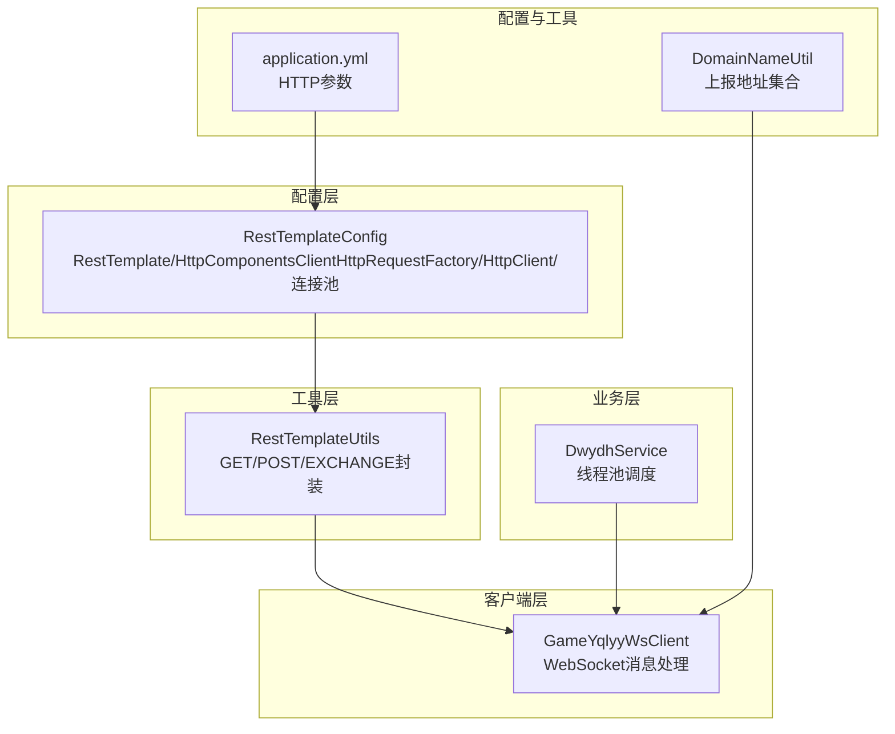
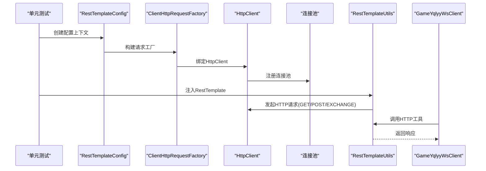
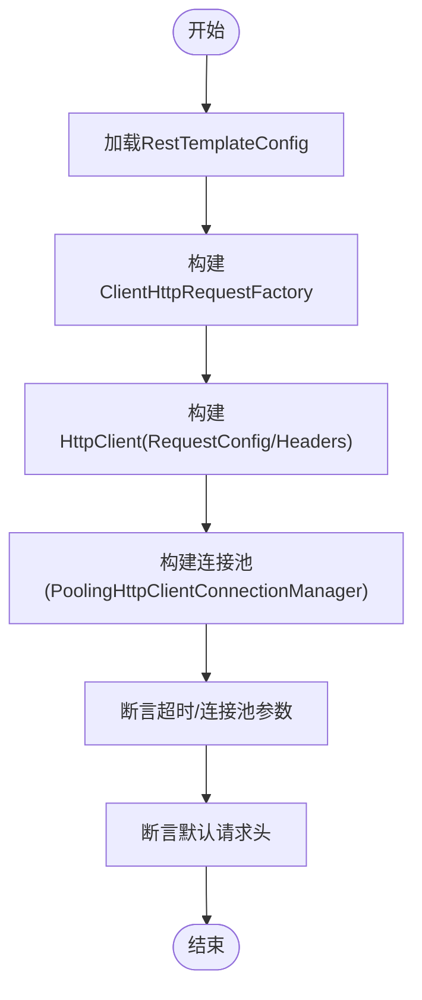
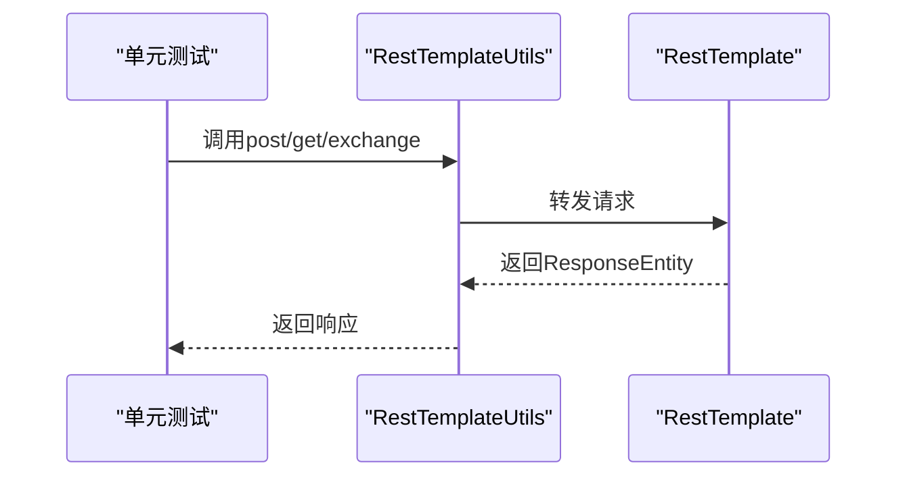
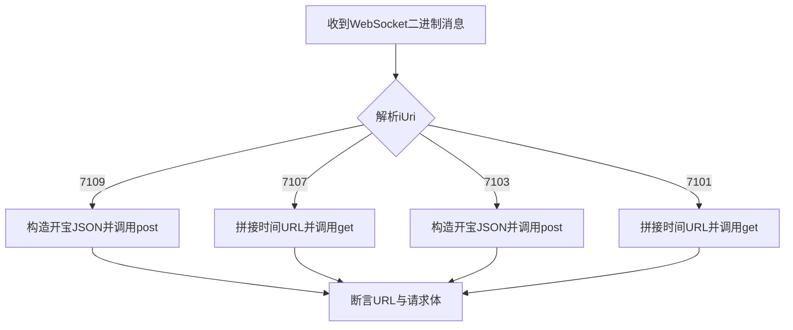
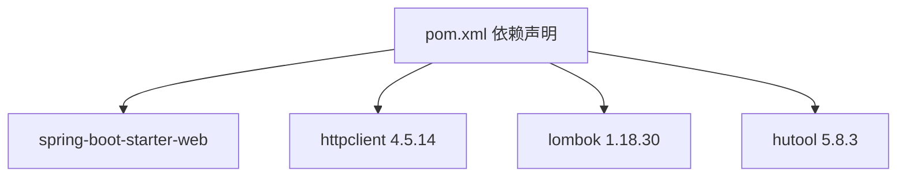

# 单元测试

<cite>
**本文引用的文件**
- [RestTemplateConfig.java](file://src/main/java/com/commom/RestTemplateConfig.java)
- [RestTemplateUtils.java](file://src/main/java/com/commom/RestTemplateUtils.java)
- [DwydhService.java](file://src/main/java/com/dwydh/DwydhService.java)
- [GameYqlyyWsClient.java](file://src/main/java/com/yqlyy/GameYqlyyWsClient.java)
- [DomainNameUtil.java](file://src/main/java/com/utils/DomainNameUtil.java)
- [ApplicationRunnerImpl.java](file://src/main/java/com/listener/ApplicationRunnerImpl.java)
- [application.yml](file://src/main/resources/application.yml)
- [pom.xml](file://pom.xml)
</cite>

## 目录
1. [引言](#引言)
2. [项目结构](#项目结构)
3. [核心组件](#核心组件)
4. [架构总览](#架构总览)
5. [详细组件分析](#详细组件分析)
6. [依赖分析](#依赖分析)
7. [性能考虑](#性能考虑)
8. [故障排查指南](#故障排查指南)
9. [结论](#结论)
10. [附录](#附录)

## 引言
本文件面向为Spring Boot应用编写单元测试的开发者，系统性说明如何使用JUnit 5与Mockito对HTTP客户端配置、连接池设置及请求参数处理进行测试。重点覆盖以下内容：
- 如何通过Spring Test与Mockito对RestTemplateConfig与RestTemplateUtils进行隔离测试
- 如何使用@Mock、@InjectMocks、@Spy等注解进行依赖注入与行为模拟
- 针对HTTP超时、连接池并发、默认请求头等关键配置的断言方法与验证策略
- 测试数据准备与清理的最佳实践，以及常见异常场景的断言示例

## 项目结构
本项目采用标准Spring Boot结构，核心业务围绕HTTP客户端配置与WebSocket客户端交互展开。与单元测试直接相关的关键模块如下：
- 配置层：RestTemplateConfig（定义RestTemplate、ClientHttpRequestFactory、HttpClient与连接池）
- 工具层：RestTemplateUtils（封装GET/POST/EXCHANGE等HTTP调用）
- 业务层：DwydhService（调度WebSocket客户端）
- 客户端层：GameYqlyyWsClient（接收WebSocket消息并调用RestTemplateUtils上报）
- 配置与工具：application.yml（HTTP参数）、DomainNameUtil（上报目标地址）

图表来源
- [RestTemplateConfig.java](file://src/main/java/com/commom/RestTemplateConfig.java#L34-L131)
- [RestTemplateUtils.java](file://src/main/java/com/commom/RestTemplateUtils.java#L14-L30)
- [DwydhService.java](file://src/main/java/com/dwydh/DwydhService.java#L14-L38)
- [GameYqlyyWsClient.java](file://src/main/java/com/yqlyy/GameYqlyyWsClient.java#L30-L327)
- [application.yml](file://src/main/resources/application.yml#L16-L30)
- [DomainNameUtil.java](file://src/main/java/com/utils/DomainNameUtil.java#L3-L15)

章节来源
- [RestTemplateConfig.java](file://src/main/java/com/commom/RestTemplateConfig.java#L34-L131)
- [RestTemplateUtils.java](file://src/main/java/com/commom/RestTemplateUtils.java#L14-L30)
- [DwydhService.java](file://src/main/java/com/dwydh/DwydhService.java#L14-L38)
- [GameYqlyyWsClient.java](file://src/main/java/com/yqlyy/GameYqlyyWsClient.java#L30-L327)
- [application.yml](file://src/main/resources/application.yml#L16-L30)
- [DomainNameUtil.java](file://src/main/java/com/utils/DomainNameUtil.java#L3-L15)

## 核心组件
- RestTemplateConfig：负责装配RestTemplate及其底层HttpClient、连接池与默认请求头；所有超时与连接池参数均来自application.yml。
- RestTemplateUtils：对RestTemplate进行轻量封装，提供GET/POST/EXCHANGE三类常用方法，便于上层业务调用。
- DwydhService：通过线程池调度WebSocket客户端，触发上报流程。
- GameYqlyyWsClient：解析WebSocket二进制消息，根据指令类型调用RestTemplateUtils进行上报或时间同步。
- DomainNameUtil：集中维护上报目标地址数组，便于批量上报。

章节来源
- [RestTemplateConfig.java](file://src/main/java/com/commom/RestTemplateConfig.java#L34-L131)
- [RestTemplateUtils.java](file://src/main/java/com/commom/RestTemplateUtils.java#L14-L30)
- [DwydhService.java](file://src/main/java/com/dwydh/DwydhService.java#L14-L38)
- [GameYqlyyWsClient.java](file://src/main/java/com/yqlyy/GameYqlyyWsClient.java#L30-L327)
- [DomainNameUtil.java](file://src/main/java/com/utils/DomainNameUtil.java#L3-L15)

## 架构总览
下图展示了单元测试关注的调用链路：测试从RestTemplateConfig开始，验证RestTemplate与连接池配置；随后通过RestTemplateUtils验证HTTP请求行为；最终在GameYqlyyWsClient中验证请求参数与上报逻辑。

图表来源
- [RestTemplateConfig.java](file://src/main/java/com/commom/RestTemplateConfig.java#L62-L129)
- [RestTemplateUtils.java](file://src/main/java/com/commom/RestTemplateUtils.java#L19-L29)
- [GameYqlyyWsClient.java](file://src/main/java/com/yqlyy/GameYqlyyWsClient.java#L103-L116)

## 详细组件分析

### RestTemplateConfig单元测试要点
- 目标：验证RestTemplate、ClientHttpRequestFactory、HttpClient与连接池的装配正确性；验证超时与连接池参数从配置文件读取并生效。
- 关键断言点：
  - RestTemplate实例存在且非空
  - ClientHttpRequestFactory为HttpComponentsClientHttpRequestFactory
  - HttpClient的RequestConfig包含connectTimeout、socketTimeout、connectionRequestTimeout、staleConnectionCheckEnabled
  - 连接池最大连接数、每路由最大连接数、空闲校验间隔按配置设置
  - 默认请求头包含User-Agent、Accept-Encoding、Accept-Language、Connection、Content-type
- 测试策略：
  - 使用@ExtendWith(MockitoExtension.class)启用Mockito
  - 使用@MockBean注入外部依赖（如配置属性），或使用@Value直接读取application.yml
  - 使用@Import(RestTemplateConfig.class)加载配置类
  - 使用Mockito.verify或自定义断言验证配置项被正确使用

图表来源
- [RestTemplateConfig.java](file://src/main/java/com/commom/RestTemplateConfig.java#L62-L129)
- [application.yml](file://src/main/resources/application.yml#L16-L30)

章节来源
- [RestTemplateConfig.java](file://src/main/java/com/commom/RestTemplateConfig.java#L34-L131)
- [application.yml](file://src/main/resources/application.yml#L16-L30)

### RestTemplateUtils单元测试要点
- 目标：验证GET/POST/EXCHANGE三个方法的行为与返回值。
- 关键断言点：
  - GET/POST/EXCHANGE调用次数与参数匹配
  - ResponseEntity的响应体类型与状态码符合预期
  - 对异常（如RestClientException）进行捕获并断言日志级别
- 测试策略：
  - 使用@Mock与@Spy模拟RestTemplate
  - 使用@Spy注解RestTemplateUtils，以便对内部方法进行验证
  - 使用Mockito.when(...).thenReturn(...)构造响应
  - 使用Mockito.verify确认方法调用链

图表来源
- [RestTemplateUtils.java](file://src/main/java/com/commom/RestTemplateUtils.java#L19-L29)

章节来源
- [RestTemplateUtils.java](file://src/main/java/com/commom/RestTemplateUtils.java#L14-L30)

### GameYqlyyWsClient单元测试要点
- 目标：验证WebSocket消息解析后对RestTemplateUtils的调用路径与参数。
- 关键断言点：
  - 根据不同iUri分支，调用RestTemplateUtils.post或get的次数与URL拼接正确
  - JSON请求体字段（monsterId、monsterName等）正确构造
  - 对异常（如RestClientException）进行捕获并断言日志级别
- 测试策略：
  - 使用@Mock注入RestTemplateUtils
  - 使用@Spy注入GameYqlyyWsClient，以便验证内部调用
  - 使用@Value注入DomainNameUtil中的urls/transitUrls
  - 使用Mockito.doThrow或when抛出异常，验证错误分支

图表来源
- [GameYqlyyWsClient.java](file://src/main/java/com/yqlyy/GameYqlyyWsClient.java#L76-L118)
- [GameYqlyyWsClient.java](file://src/main/java/com/yqlyy/GameYqlyyWsClient.java#L120-L147)
- [GameYqlyyWsClient.java](file://src/main/java/com/yqlyy/GameYqlyyWsClient.java#L150-L183)
- [GameYqlyyWsClient.java](file://src/main/java/com/yqlyy/GameYqlyyWsClient.java#L186-L214)

章节来源
- [GameYqlyyWsClient.java](file://src/main/java/com/yqlyy/GameYqlyyWsClient.java#L30-L327)
- [DomainNameUtil.java](file://src/main/java/com/utils/DomainNameUtil.java#L3-L15)

### DwydhService与ApplicationRunnerImpl单元测试要点
- 目标：验证服务初始化与线程池调度行为，确保WebSocket客户端被正确创建并启动。
- 关键断言点：
  - init方法触发线程池执行
  - 线程内创建GameYqlyyWsClient并循环调用report
  - 异常处理（如InterruptedException）不中断测试流程
- 测试策略：
  - 使用@Mock注入ThreadPoolTaskExecutor与RestTemplateUtils
  - 使用@Spy注入DwydhService，验证内部逻辑
  - 使用Mockito.verify确认线程池执行与客户端创建

章节来源
- [DwydhService.java](file://src/main/java/com/dwydh/DwydhService.java#L14-L38)
- [ApplicationRunnerImpl.java](file://src/main/java/com/listener/ApplicationRunnerImpl.java#L21-L33)

## 依赖分析
- 外部依赖与版本：
  - Spring Boot 2.2.13.RELEASE
  - Apache HttpClient 4.5.14
  - Lombok 1.18.30
  - Hutool 5.8.3
- 内部组件耦合关系：
  - RestTemplateConfig装配RestTemplateUtils所需的RestTemplate
  - RestTemplateUtils被GameYqlyyWsClient依赖
  - DwydhService通过线程池调度GameYqlyyWsClient
  - DomainNameUtil提供上报地址集合

图表来源
- [pom.xml](file://pom.xml#L26-L111)

章节来源
- [pom.xml](file://pom.xml#L11-L18)
- [pom.xml](file://pom.xml#L26-L111)

## 性能考虑
- 连接池参数建议：
  - maxTotal与defaultMaxPerRoute应结合并发与下游服务承载能力评估
  - staleConnectionCheckEnabled与validateAfterInactivity用于空闲连接复用与回收，需权衡CPU与内存
- 超时参数建议：
  - connectTimeout与connectionRequestTimeout用于控制连接建立与队列等待
  - socketTimeout用于控制读写超时，避免线程长时间阻塞
- 断言策略：
  - 在高并发场景下，优先断言关键路径的调用次数与参数一致性，而非逐条验证每个请求细节

## 故障排查指南
- 常见问题与定位：
  - RestTemplate未正确注入：检查RestTemplateConfig是否被Spring加载，确认@Bean方法可见性
  - 连接池参数无效：核对application.yml中http.*键值是否存在拼写错误
  - WebSocket上报失败：检查DomainNameUtil.urls与transitUrls是否为空或格式错误
  - 日志异常：确认GameYqlyyWsClient对RestClientException的捕获与日志记录
- 断言技巧：
  - 使用Mockito.verify验证方法调用链
  - 使用Mockito.when(...).thenThrow(...)模拟异常，验证错误分支
  - 使用@Rule或@ExtendWith(MockitoExtension.class)确保Mockito生命周期正确

章节来源
- [RestTemplateConfig.java](file://src/main/java/com/commom/RestTemplateConfig.java#L34-L131)
- [application.yml](file://src/main/resources/application.yml#L16-L30)
- [GameYqlyyWsClient.java](file://src/main/java/com/yqlyy/GameYqlyyWsClient.java#L103-L116)
- [DomainNameUtil.java](file://src/main/java/com/utils/DomainNameUtil.java#L3-L15)

## 结论
通过将RestTemplateConfig、RestTemplateUtils与GameYqlyyWsClient进行隔离测试，可以有效验证HTTP客户端配置、连接池设置与请求参数处理的正确性。结合Mockito的@Mock、@InjectMocks、@Spy等注解，能够在不启动完整Spring容器的情况下快速定位问题并提升测试效率。建议在持续集成中加入关键路径的回归测试，确保配置变更不会影响核心功能。

## 附录
- 测试环境准备建议：
  - 添加JUnit 5与Mockito依赖（若尚未引入）
  - 在测试类上使用@ExtendWith(MockitoExtension.class)
  - 使用@MockBean或@Spy替代真实Bean，减少外部依赖
- 测试数据准备与清理：
  - 使用@BeforeEach准备最小化测试数据，使用@AfterEach清理
  - 对于静态工具类（如DomainNameUtil），可在测试中临时修改其字段或使用替换策略
- 断言方法推荐：
  - 对方法调用次数与参数使用Mockito.verify
  - 对异常场景使用assertThrows或verify捕获日志级别