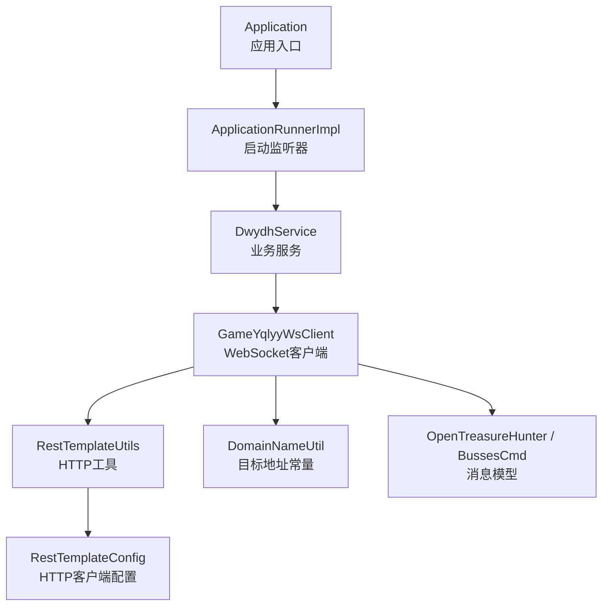
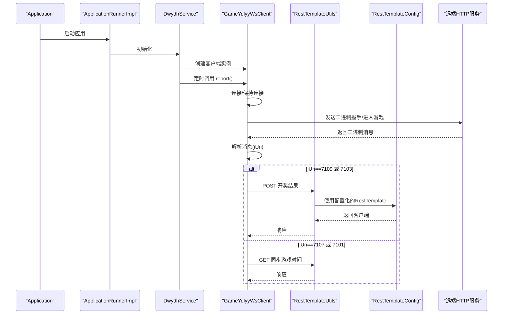
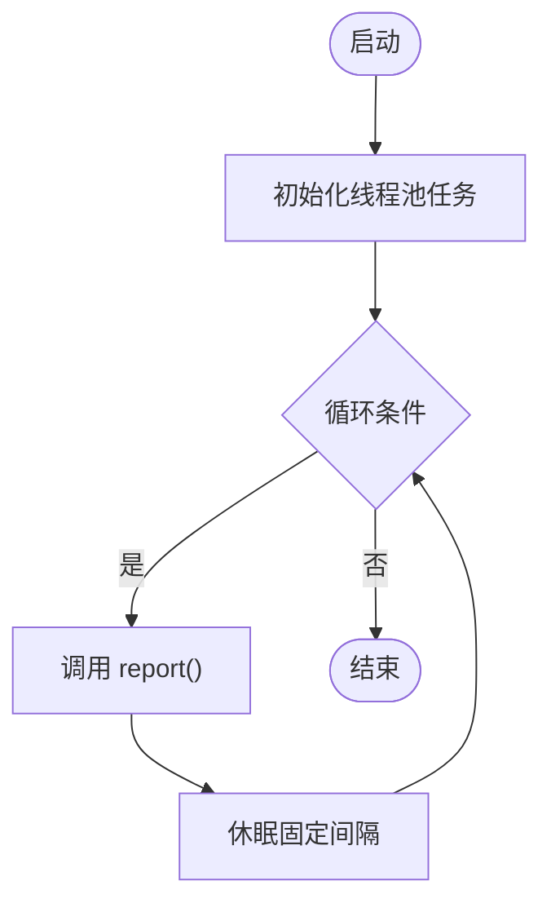
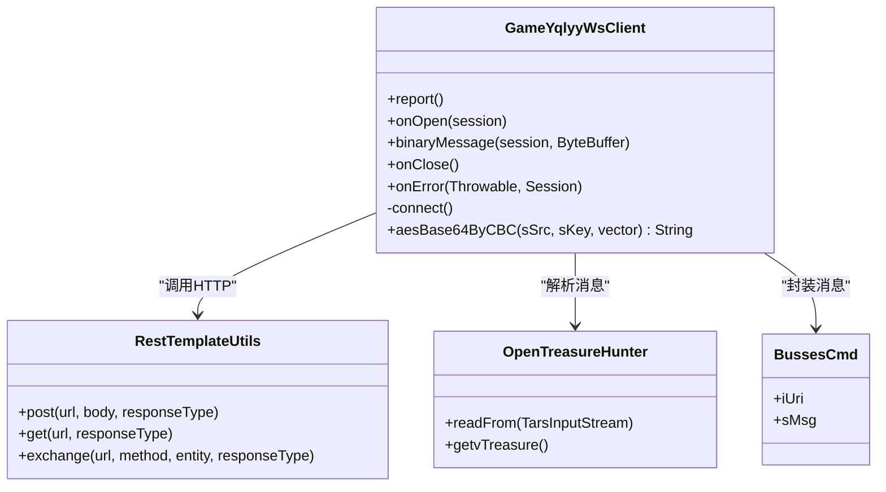
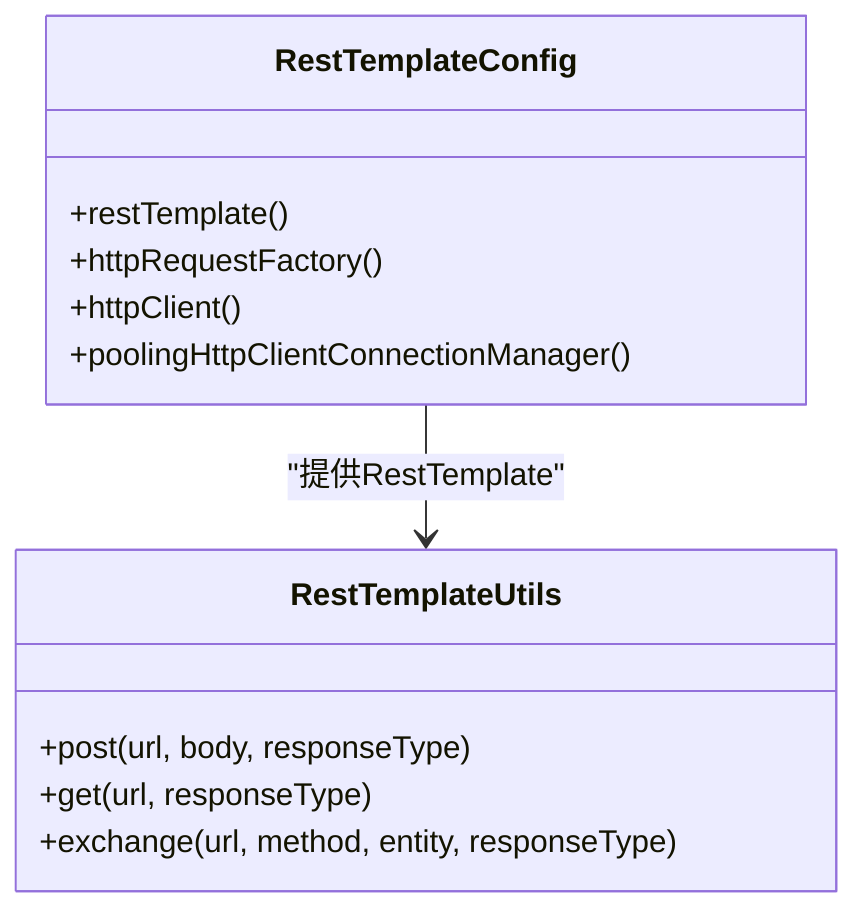
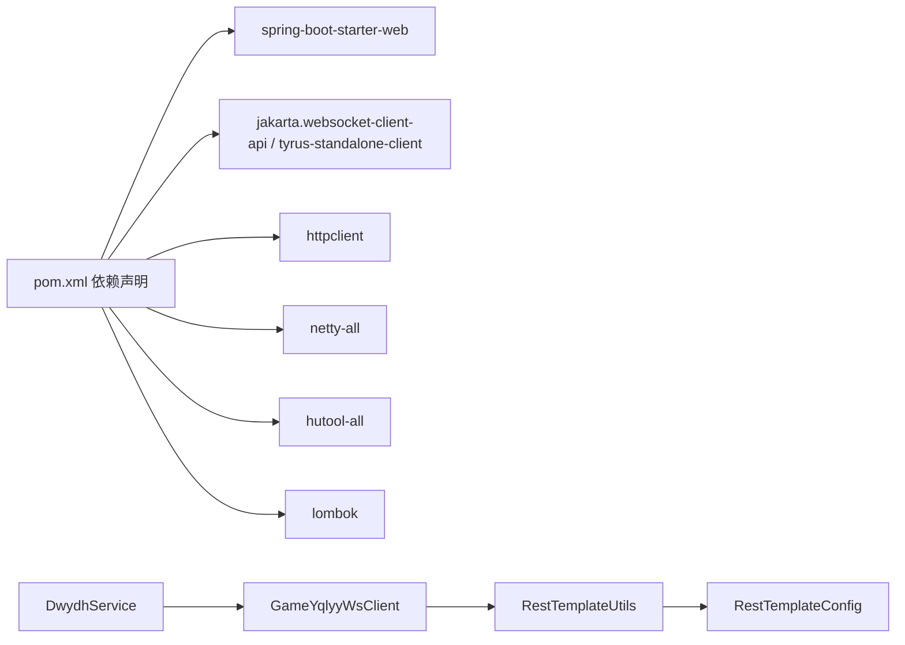

# 测试策略

<cite>
**本文引用的文件**
- [pom.xml](file://pom.xml)
- [Application.java](file://src/main/java/com/Application.java)
- [application.yml](file://src/main/resources/application.yml)
- [DwydhService.java](file://src/main/java/com/dwydh/DwydhService.java)
- [GameYqlyyWsClient.java](file://src/main/java/com/yqlyy/GameYqlyyWsClient.java)
- [RestTemplateConfig.java](file://src/main/java/com/commom/RestTemplateConfig.java)
- [RestTemplateUtils.java](file://src/main/java/com/commom/RestTemplateUtils.java)
- [OpenTreasureHunter.java](file://src/main/java/com/entity/AccountedNotify/OpenTreasureHunter.java)
- [BussesCmd.java](file://src/main/java/com/entity/BussesCmd.java)
- [DomainNameUtil.java](file://src/main/java/com/utils/DomainNameUtil.java)
- [ApplicationRunnerImpl.java](file://src/main/java/com/listener/ApplicationRunnerImpl.java)
</cite>

## 目录
1. [引言](#引言)
2. [项目结构](#项目结构)
3. [核心组件](#核心组件)
4. [架构总览](#架构总览)
5. [详细组件分析](#详细组件分析)
6. [依赖分析](#依赖分析)
7. [性能考量](#性能考量)
8. [故障排查指南](#故障排查指南)
9. [结论](#结论)
10. [附录](#附录)

## 引言
本测试策略文档面向该虎牙爬虫项目，聚焦于单元测试与集成测试的设计与实施，覆盖以下要点：
- 单元测试编写方法与最佳实践，含 JUnit 框架使用与 Mock 对象创建
- 集成测试设计思路，重点覆盖 WebSocket 连接与 HTTP 通信
- 测试用例设计原则：边界条件、异常场景、性能测试
- 测试覆盖率要求与测量方法
- 测试数据准备与管理策略
- 持续集成环境下的自动化测试配置建议
- 测试驱动开发（TDD）在项目中的应用方法

## 项目结构
该项目为基于 Spring Boot 的 Java 应用，主要模块与职责如下：
- 应用入口与启动：Application 类负责启动 Spring Boot 应用
- 启动监听器：ApplicationRunnerImpl 在应用启动后初始化 DwydhService
- 业务服务：DwydhService 使用线程池调度 GameYqlyyWsClient 定时上报与处理
- WebSocket 客户端：GameYqlyyWsClient 实现 WebSocket 客户端，解析二进制消息并调用 HTTP 接口
- HTTP 客户端：RestTemplateConfig 与 RestTemplateUtils 提供 HTTP 客户端能力
- 配置与常量：application.yml 提供 HTTP 连接池与超时参数；DomainNameUtil 提供目标地址列表

图表来源
- [Application.java](file://src/main/java/com/Application.java#L1-L14)
- [ApplicationRunnerImpl.java](file://src/main/java/com/listener/ApplicationRunnerImpl.java#L1-L34)
- [DwydhService.java](file://src/main/java/com/dwydh/DwydhService.java#L1-L39)
- [GameYqlyyWsClient.java](file://src/main/java/com/yqlyy/GameYqlyyWsClient.java#L1-L328)
- [RestTemplateConfig.java](file://src/main/java/com/commom/RestTemplateConfig.java#L1-L132)
- [RestTemplateUtils.java](file://src/main/java/com/commom/RestTemplateUtils.java#L1-L31)
- [OpenTreasureHunter.java](file://src/main/java/com/entity/AccountedNotify/OpenTreasureHunter.java#L1-L83)
- [BussesCmd.java](file://src/main/java/com/entity/BussesCmd.java#L1-L10)
- [DomainNameUtil.java](file://src/main/java/com/utils/DomainNameUtil.java#L1-L16)

章节来源
- [Application.java](file://src/main/java/com/Application.java#L1-L14)
- [application.yml](file://src/main/resources/application.yml#L1-L31)

## 核心组件
- 应用入口与启动
  - Application：Spring Boot 启动类
  - ApplicationRunnerImpl：应用启动后执行初始化逻辑，调用 DwydhService.init()
- 业务服务
  - DwydhService：通过线程池定时执行 GameYqlyyWsClient 的 report 与连接维护
- WebSocket 客户端
  - GameYqlyyWsClient：实现 WebSocket 生命周期回调，解析二进制消息，按不同 iUri 分发处理，并通过 HTTP 工具上报结果
- HTTP 客户端
  - RestTemplateConfig：配置连接池、超时、重试、Keep-Alive 等
  - RestTemplateUtils：封装 GET/POST/exchange 方法
- 消息模型
  - OpenTreasureHunter、BussesCmd：用于解析 WebSocket 二进制消息
- 常量与配置
  - DomainNameUtil：目标地址数组（urls/transitUrls）
  - application.yml：HTTP 连接池与超时参数

章节来源
- [DwydhService.java](file://src/main/java/com/dwydh/DwydhService.java#L1-L39)
- [GameYqlyyWsClient.java](file://src/main/java/com/yqlyy/GameYqlyyWsClient.java#L1-L328)
- [RestTemplateConfig.java](file://src/main/java/com/commom/RestTemplateConfig.java#L1-L132)
- [RestTemplateUtils.java](file://src/main/java/com/commom/RestTemplateUtils.java#L1-L31)
- [OpenTreasureHunter.java](file://src/main/java/com/entity/AccountedNotify/OpenTreasureHunter.java#L1-L83)
- [BussesCmd.java](file://src/main/java/com/entity/BussesCmd.java#L1-L10)
- [DomainNameUtil.java](file://src/main/java/com/utils/DomainNameUtil.java#L1-L16)
- [application.yml](file://src/main/resources/application.yml#L1-L31)

## 架构总览
下图展示 WebSocket 与 HTTP 的交互流程，以及与应用启动、线程池的关系。

图表来源
- [Application.java](file://src/main/java/com/Application.java#L1-L14)
- [ApplicationRunnerImpl.java](file://src/main/java/com/listener/ApplicationRunnerImpl.java#L1-L34)
- [DwydhService.java](file://src/main/java/com/dwydh/DwydhService.java#L1-L39)
- [GameYqlyyWsClient.java](file://src/main/java/com/yqlyy/GameYqlyyWsClient.java#L1-L328)
- [RestTemplateConfig.java](file://src/main/java/com/commom/RestTemplateConfig.java#L1-L132)
- [RestTemplateUtils.java](file://src/main/java/com/commom/RestTemplateUtils.java#L1-L31)

## 详细组件分析

### 组件一：DwydhService（线程池调度与生命周期）
- 角色：在独立线程中循环执行 WebSocket 客户端的上报与连接维护
- 关键点：
  - 使用线程池任务执行器，避免阻塞主线程
  - 循环内调用 report() 并按固定间隔休眠
  - 异常捕获与中断处理
- 测试关注点：
  - 线程池是否正确注入与使用
  - report() 是否被周期性调用
  - 异常路径（如 InterruptedException）是否被妥善处理

图表来源
- [DwydhService.java](file://src/main/java/com/dwydh/DwydhService.java#L1-L39)

章节来源
- [DwydhService.java](file://src/main/java/com/dwydh/DwydhService.java#L1-L39)

### 组件二：GameYqlyyWsClient（WebSocket 客户端）
- 角色：建立 WebSocket 连接，处理二进制消息，按 iUri 分发处理逻辑，并通过 HTTP 工具上报
- 关键点：
  - 生命周期回调：onOpen、onMessage、onClose、onError
  - 连接建立与维护：connect()、report()
  - 消息解析：TARS 协议解析，提取 iUri 与 sMsg
  - 分支处理：根据 iUri 调用不同 HTTP 接口（POST/GET）
  - 错误处理：日志记录与异常分支
- 测试关注点：
  - WebSocket 连接建立与断开流程
  - 不同 iUri 的消息解析与处理分支
  - HTTP 调用的响应与异常处理
  - AES/CBC 加密辅助方法的正确性

图表来源
- [GameYqlyyWsClient.java](file://src/main/java/com/yqlyy/GameYqlyyWsClient.java#L1-L328)
- [RestTemplateUtils.java](file://src/main/java/com/commom/RestTemplateUtils.java#L1-L31)
- [OpenTreasureHunter.java](file://src/main/java/com/entity/AccountedNotify/OpenTreasureHunter.java#L1-L83)
- [BussesCmd.java](file://src/main/java/com/entity/BussesCmd.java#L1-L10)

章节来源
- [GameYqlyyWsClient.java](file://src/main/java/com/yqlyy/GameYqlyyWsClient.java#L1-L328)

### 组件三：RestTemplateConfig 与 RestTemplateUtils（HTTP 客户端）
- 角色：提供配置化 HTTP 客户端与封装的 GET/POST/exchange 方法
- 关键点：
  - 连接池配置：最大连接数、每路由并发、空闲校验、超时等
  - 默认请求头：User-Agent、Accept-Encoding、Content-Type 等
  - 重试策略与 Keep-Alive 策略
- 测试关注点：
  - 连接池参数是否正确加载
  - 超时与重试行为是否符合预期
  - GET/POST/exchange 方法的返回值与异常传播

图表来源
- [RestTemplateConfig.java](file://src/main/java/com/commom/RestTemplateConfig.java#L1-L132)
- [RestTemplateUtils.java](file://src/main/java/com/commom/RestTemplateUtils.java#L1-L31)

章节来源
- [RestTemplateConfig.java](file://src/main/java/com/commom/RestTemplateConfig.java#L1-L132)
- [RestTemplateUtils.java](file://src/main/java/com/commom/RestTemplateUtils.java#L1-L31)

### 组件四：消息模型（OpenTreasureHunter、BussesCmd）
- 角色：承载 WebSocket 二进制消息的结构化表示
- 关键点：
  - OpenTreasureHunter：读取 TARS 输入流，填充字段与集合
  - BussesCmd：承载推送类型、URI 与消息体
- 测试关注点：
  - TARS 解析的正确性与边界条件
  - 字段读取顺序与默认值处理

章节来源
- [OpenTreasureHunter.java](file://src/main/java/com/entity/AccountedNotify/OpenTreasureHunter.java#L1-L83)
- [BussesCmd.java](file://src/main/java/com/entity/BussesCmd.java#L1-L10)

### 组件五：DomainNameUtil（目标地址常量）
- 角色：集中管理上报目标地址与中转地址
- 关键点：
  - urls 与 transitUrls 为空数组，需在运行时注入实际地址
- 测试关注点：
  - 地址数组为空时的行为与异常处理
  - 注入地址后的遍历与调用

章节来源
- [DomainNameUtil.java](file://src/main/java/com/utils/DomainNameUtil.java#L1-L16)

## 依赖分析
- 外部依赖概览（与测试相关的关键项）
  - Spring Web（Web 客户端与自动配置）
  - WebSocket 客户端 API 与 Tyrus 客户端实现
  - Apache HttpClient（连接池、超时、重试）
  - Netty（网络栈支持）
  - Hutool（JSON 工具）
  - Lombok（简化代码）
- 内部组件耦合
  - DwydhService 依赖 GameYqlyyWsClient 与线程池
  - GameYqlyyWsClient 依赖 RestTemplateUtils 与消息模型
  - RestTemplateUtils 依赖 RestTemplateConfig

图表来源
- [pom.xml](file://pom.xml#L1-L160)
- [DwydhService.java](file://src/main/java/com/dwydh/DwydhService.java#L1-L39)
- [GameYqlyyWsClient.java](file://src/main/java/com/yqlyy/GameYqlyyWsClient.java#L1-L328)
- [RestTemplateUtils.java](file://src/main/java/com/commom/RestTemplateUtils.java#L1-L31)
- [RestTemplateConfig.java](file://src/main/java/com/commom/RestTemplateConfig.java#L1-L132)

章节来源
- [pom.xml](file://pom.xml#L1-L160)

## 性能考量
- 连接池与超时
  - application.yml 中定义了最大连接数、每路由并发、连接超时、请求超时、套接字超时、空闲校验与空闲验证阈值
  - RestTemplateConfig 基于这些参数构建 HttpClient 与连接池
- 线程池与任务调度
  - DwydhService 使用线程池执行 WebSocket 客户端任务，避免阻塞主线程
- 性能测试建议
  - 压测 WebSocket 连接建立与消息吞吐，评估连接池上限与超时设置
  - 压测 HTTP POST/GET 的延迟与错误率，结合重试策略评估整体稳定性
  - 监控线程池饱和度与任务排队情况

章节来源
- [application.yml](file://src/main/resources/application.yml#L1-L31)
- [RestTemplateConfig.java](file://src/main/java/com/commom/RestTemplateConfig.java#L1-L132)
- [DwydhService.java](file://src/main/java/com/dwydh/DwydhService.java#L1-L39)

## 故障排查指南
- WebSocket 连接问题
  - 检查 onOpen/onClose/onError 回调日志，定位连接失败原因
  - 校验 wsUrl 与连接容器配置（缓冲区大小、空闲超时、异步发送超时）
- 消息解析问题
  - 根据 iUri 分支检查 TARS 解析逻辑，确认字段读取顺序与类型匹配
- HTTP 调用问题
  - 检查 RestTemplate 的超时、重试与 Keep-Alive 设置
  - 校验 urls/transitUrls 注入情况，确保目标地址有效
- 日志与异常
  - 关注 RestClientException 与通用异常的分类处理与日志输出

章节来源
- [GameYqlyyWsClient.java](file://src/main/java/com/yqlyy/GameYqlyyWsClient.java#L1-L328)
- [RestTemplateConfig.java](file://src/main/java/com/commom/RestTemplateConfig.java#L1-L132)
- [RestTemplateUtils.java](file://src/main/java/com/commom/RestTemplateUtils.java#L1-L31)
- [DomainNameUtil.java](file://src/main/java/com/utils/DomainNameUtil.java#L1-L16)

## 结论
本测试策略围绕 WebSocket 与 HTTP 两大核心链路，提出从单元到集成的测试方法论，并结合项目特性给出性能与故障排查建议。通过合理的 Mock 与桩、边界与异常用例设计、以及连接池与超时参数的压测，可系统提升系统的稳定性与可维护性。

## 附录

### 单元测试编写方法与最佳实践
- 使用 JUnit 与 Mockito
  - 对 GameYqlyyWsClient 的私有方法（如 aesBase64ByCBC）进行单元测试，必要时通过反射或重构暴露测试接口
  - 对 RestTemplateUtils 的 GET/POST/exchange 进行 Mock，模拟成功/失败响应，覆盖异常分支
  - 对 DwydhService 的线程池调度进行行为测试，验证 report() 调用频率与异常处理
- 最佳实践
  - 使用 @BeforeEach/@AfterEach 管理测试状态
  - 使用 @Mock/@InjectMocks 控制依赖注入与 Mock 行为
  - 将外部依赖（HTTP/WebSocket）替换为 Mock，隔离测试环境

### 集成测试设计思路
- WebSocket 集成测试
  - 使用嵌入式 WebSocket 服务器或本地回环服务，模拟不同 iUri 的二进制消息
  - 验证 onOpen、binaryMessage、onClose、onError 的完整流程
- HTTP 集成测试
  - 使用 WireMock 或内存 HTTP 服务器，模拟目标地址的 POST/GET 响应
  - 验证 urls/transitUrls 的遍历与调用顺序
- 端到端测试
  - 以 ApplicationRunnerImpl 为入口，验证从启动到 WebSocket 连接与消息处理的全链路

### 测试用例设计原则
- 边界条件
  - 空地址数组、单地址、多地址的处理
  - TARS 消息字段缺失或类型不匹配的容错
- 异常情况
  - 连接失败、消息解析异常、HTTP 调用异常、线程中断
- 性能测试
  - 连接池上限、超时阈值、重试次数对吞吐的影响
  - 线程池饱和与任务堆积的应对

### 测试覆盖率要求与测量方法
- 覆盖率目标
  - 业务核心路径（WebSocket 消息分发、HTTP 调用）行覆盖率≥80%
  - 分支覆盖率≥70%，关键异常路径覆盖
- 测量方法
  - 使用 JaCoCo 插件在 Maven 构建中生成覆盖率报告
  - 在 CI 中设置覆盖率阈值，未达标则阻断合并

### 测试数据准备与管理策略
- 数据准备
  - 使用真实但脱敏的 TARS 消息样本，构造不同 iUri 的二进制数据
  - 准备多种 HTTP 响应（2xx/4xx/5xx）与超时场景
- 数据管理
  - 将测试数据放入 resources/test 下，按功能模块组织
  - 使用工厂类生成测试数据，便于扩展与复用

### 持续集成环境下的自动化测试配置
- Maven 插件
  - maven-surefire-plugin：执行单元测试
  - maven-failsafe-plugin：执行集成测试
  - jacoco-maven-plugin：生成覆盖率报告
- CI 步骤建议
  - 编译与打包
  - 执行单元测试与覆盖率统计
  - 执行集成测试（可选）
  - 上传覆盖率报告至代码平台

### 测试驱动开发（TDD）在项目中的应用
- 从最小可行需求开始
  - 先编写 WebSocket 连接与基础消息解析的单元测试，再实现对应功能
  - 为 HTTP 工具方法编写测试，再实现具体调用逻辑
- 行为驱动
  - 以用户故事形式描述测试场景（如“当收到 iUri=7109 的消息时，应上报开奖结果”）
  - 先写失败用例，再写实现，最后重构优化