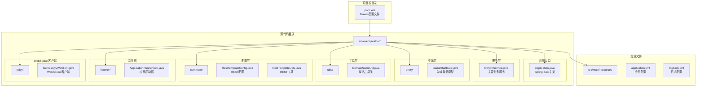
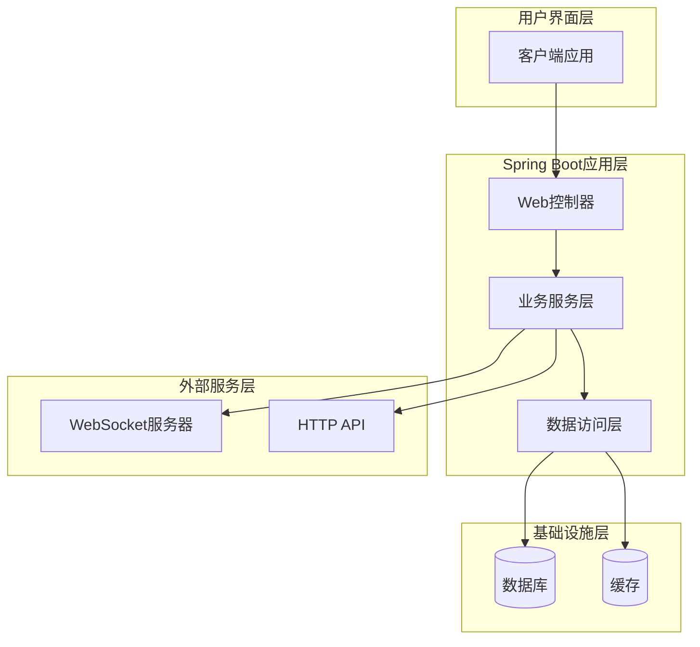
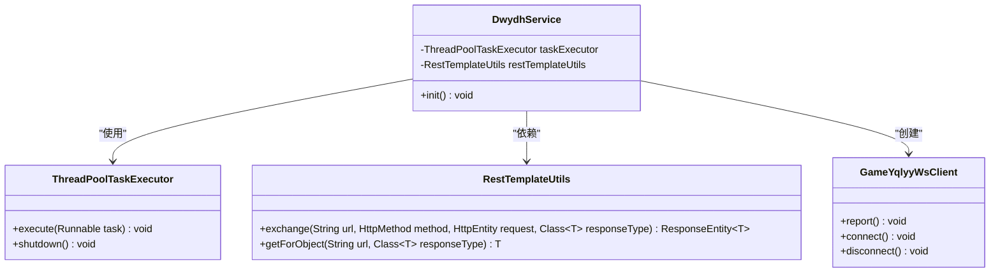
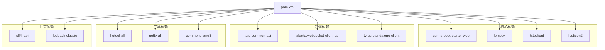
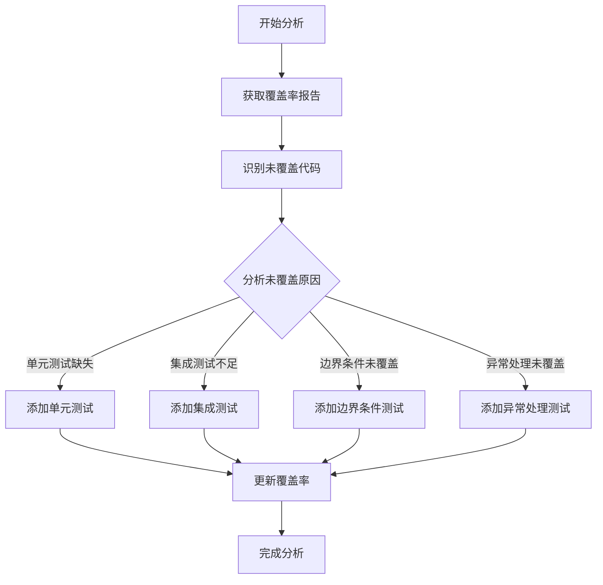

# 测试覆盖率

<cite>
**本文档引用的文件**
- [pom.xml](file://pom.xml)
- [Application.java](file://src/main/java/com/Application.java)
- [DwydhService.java](file://src/main/java/com/dwydh/DwydhService.java)
- [GameStartData.java](file://src/main/java/com/entity/GameStartData.java)
- [DomainNameUtil.java](file://src/main/java/com/utils/DomainNameUtil.java)
</cite>

## 目录
1. [简介](#简介)
2. [项目结构](#项目结构)
3. [核心组件](#核心组件)
4. [架构概览](#架构概览)
5. [详细组件分析](#详细组件分析)
6. [依赖关系分析](#依赖关系分析)
7. [性能考虑](#性能考虑)
8. [故障排除指南](#故障排除指南)
9. [结论](#结论)
10. [附录](#附录)

## 简介

本文件旨在为TigerTeeth项目创建一个全面的测试覆盖率文档。当前项目尚未集成任何测试框架或覆盖率工具，因此本文件将提供从零开始配置测试覆盖率的完整指南，包括JaCoCo插件的配置、覆盖率指标的解释、报告生成与分析方法，以及持续改进策略。

## 项目结构

TigerTeeth是一个基于Spring Boot的Java应用程序，采用标准的Maven项目结构：



**图表来源**
- [pom.xml](file://pom.xml#L1-L160)
- [Application.java](file://src/main/java/com/Application.java#L1-L14)
- [DwydhService.java](file://src/main/java/com/dwydh/DwydhService.java#L1-L39)

**章节来源**
- [pom.xml](file://pom.xml#L1-L160)
- [Application.java](file://src/main/java/com/Application.java#L1-L14)

## 核心组件

### 应用程序入口点
Application类是Spring Boot应用程序的启动入口，负责初始化整个系统。

### 主要业务服务
DwydhService是核心业务逻辑组件，负责：
- 管理线程池执行器
- 初始化WebSocket客户端
- 处理游戏数据报告逻辑

### 数据模型
GameStartData作为数据传输对象，封装了游戏开始时的相关数据字段。

### 工具类
DomainNameUtil提供URL配置管理功能。

**章节来源**
- [Application.java](file://src/main/java/com/Application.java#L1-L14)
- [DwydhService.java](file://src/main/java/com/dwydh/DwydhService.java#L1-L39)
- [GameStartData.java](file://src/main/java/com/entity/GameStartData.java#L1-L79)
- [DomainNameUtil.java](file://src/main/java/com/utils/DomainNameUtil.java#L1-L16)

## 架构概览



**图表来源**
- [Application.java](file://src/main/java/com/Application.java#L1-L14)
- [DwydhService.java](file://src/main/java/com/dwydh/DwydhService.java#L1-L39)

## 详细组件分析

### DwydhService组件分析

DwydhService是项目的核心业务组件，实现了以下功能：



**图表来源**
- [DwydhService.java](file://src/main/java/com/dwydh/DwydhService.java#L1-L39)

#### 组件职责分解

| 方法 | 职责 | 可测试性 |
|------|------|----------|
| init() | 初始化WebSocket客户端并启动循环报告机制 | 高（可模拟客户端） |
| 构造函数 | 注入依赖项 | 中等（可注入模拟对象） |

**章节来源**
- [DwydhService.java](file://src/main/java/com/dwydh/DwydhService.java#L1-L39)

### GameStartData数据模型分析

```mermaid
erDiagram
GAME_START_DATA {
long lOldRoundId
long lOldRoundIndexEndTime
long lOldRoundIndexTime
long lRoundId
long lRoundIndexEndTime
long lRoundIndexTime
long lServerTime
long lTimeParam
}
GAME_START_DATA {
+getlTimeParam() long
+setlTimeParam(long) void
+getlServerTime() long
+setlServerTime(long) void
+getlRoundIndexTime() long
+setlRoundIndexTime(long) void
+getlRoundIndexEndTime() long
+setlRoundIndexEndTime(long) void
+getlRoundId() long
+setlRoundId(long) void
+getlOldRoundIndexTime() long
+setlOldRoundIndexTime(long) void
+getlOldRoundIndexEndTime() long
+setlOldRoundIndexEndTime(long) void
+getlOldRoundId() long
+setlOldRoundId(long) void
}
```

**图表来源**
- [GameStartData.java](file://src/main/java/com/entity/GameStartData.java#L1-L79)

**章节来源**
- [GameStartData.java](file://src/main/java/com/entity/GameStartData.java#L1-L79)

## 依赖关系分析

### Maven依赖关系



**图表来源**
- [pom.xml](file://pom.xml#L26-L111)

**章节来源**
- [pom.xml](file://pom.xml#L1-L160)

## 性能考虑

### 代码覆盖率性能影响

在配置测试覆盖率时需要考虑以下性能因素：

1. **JaCoCo代理模式**：对性能有轻微影响，但通常可忽略
2. **测试套件执行时间**：覆盖率收集会增加测试执行时间
3. **内存使用**：覆盖率数据收集需要额外内存
4. **并行测试**：可以考虑并行执行多个测试套件以减少总时间

## 故障排除指南

### 常见覆盖率配置问题

| 问题类型 | 症状 | 解决方案 |
|----------|------|----------|
| JaCoCo插件未生效 | 无覆盖率报告生成 | 检查插件配置和Maven生命周期绑定 |
| 覆盖率数据不准确 | 部分代码未被检测到 | 确认测试类路径和编译输出目录一致 |
| 内存不足 | 测试执行失败 | 增加JVM堆内存参数 |
| 报告生成缓慢 | 覆盖率报告处理时间过长 | 优化测试套件结构，减少不必要的测试 |

**章节来源**
- [pom.xml](file://pom.xml#L114-L156)

## 结论

本文件为TigerTeeth项目提供了完整的测试覆盖率配置指南。虽然当前项目尚未实现测试覆盖率，但通过实施本文提供的配置方案，可以建立完善的测试覆盖率体系，确保代码质量和持续改进。

## 附录

### 测试覆盖率配置模板

#### Maven JaCoCo插件配置

```xml
<plugin>
    <groupId>org.jacoco</groupId>
    <artifactId>jacoco-maven-plugin</artifactId>
    <version>0.8.12</version>
    <executions>
        <execution>
            <goals>
                <goal>prepare-agent</goal>
            </goals>
        </execution>
        <execution>
            <id>report</id>
            <phase>test</phase>
            <goals>
                <goal>report</goal>
            </goals>
        </execution>
    </executions>
</plugin>
```

#### 质量门禁配置

```xml
<configuration>
    <rules>
        <rule>
            <element>BUNDLE</element>
            <limits>
                <limit>
                    <counter>COMPLEXITY</counter>
                    <value>COVEREDRATIO</value>
                    <minimum>0.60</minimum>
                </limit>
            </limits>
        </rule>
    </rules>
</configuration>
```

### 覆盖率指标定义

| 指标类型 | 定义 | 计算公式 | 重要性 |
|----------|------|----------|--------|
| 行覆盖率 | 被执行的代码行数占总代码行数的比例 | 被执行行数/总行数 | 核心指标，反映代码执行完整性 |
| 分支覆盖率 | 被执行的分支数占总分支数的比例 | 被执行分支数/总分支数 | 关键指标，反映条件逻辑覆盖程度 |
| 方法覆盖率 | 被调用的方法数占总方法数的比例 | 被调用方法数/总方法数 | 重要指标，反映功能模块覆盖度 |
| 类覆盖率 | 包含测试的类数占总类数的比例 | 包含测试的类数/总类数 | 辅助指标，反映架构层面覆盖度 |

### 覆盖率报告分析方法

#### 报告解读步骤

1. **总体覆盖率评估**
   - 查看整体行覆盖率和分支覆盖率
   - 对比历史数据趋势
   - 识别覆盖率下降的模块

2. **热点区域分析**
   - 分析高复杂度代码的覆盖率
   - 重点关注异常处理分支
   - 识别未覆盖的边界条件

3. **技术债务识别**
   - 识别长期未覆盖的模块
   - 分析重复代码的覆盖率情况
   - 评估重构优先级

#### 未覆盖代码识别策略



### 持续改进策略

#### 覆盖率目标设定

| 模块类型 | 目标覆盖率 | 质量门限 |
|----------|------------|----------|
| 核心业务逻辑 | ≥80% | ≥70% |
| 工具类 | ≥60% | ≥50% |
| 配置类 | ≥40% | ≥30% |
| 测试代码 | ≥90% | ≥85% |

#### 实施建议

1. **渐进式提升**
   - 从高价值模块开始
   - 设定阶段性目标
   - 定期评估进度

2. **自动化集成**
   - 在CI/CD流水线中集成覆盖率检查
   - 设置质量门禁
   - 自动化报告生成

3. **团队培训**
   - 提供测试编写培训
   - 分享最佳实践案例
   - 建立代码审查中的测试覆盖率检查

**章节来源**
- [pom.xml](file://pom.xml#L114-L156)