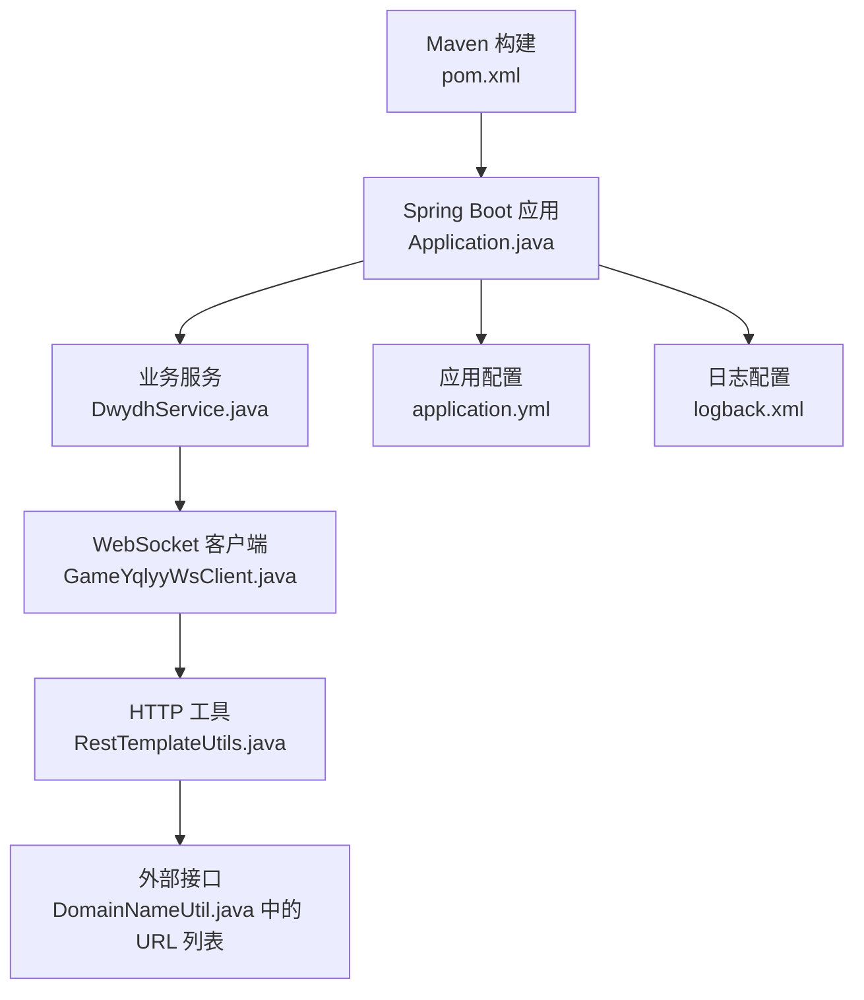
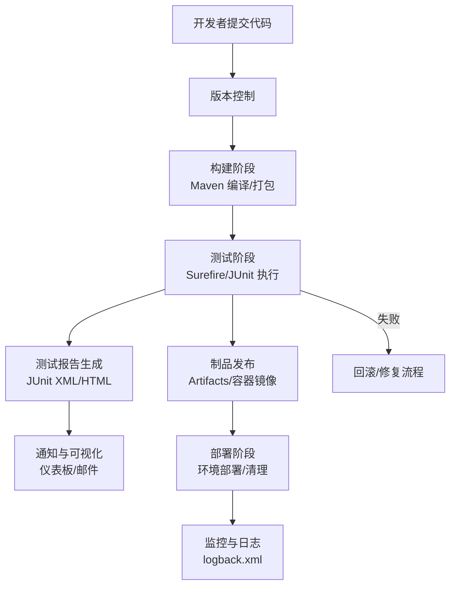
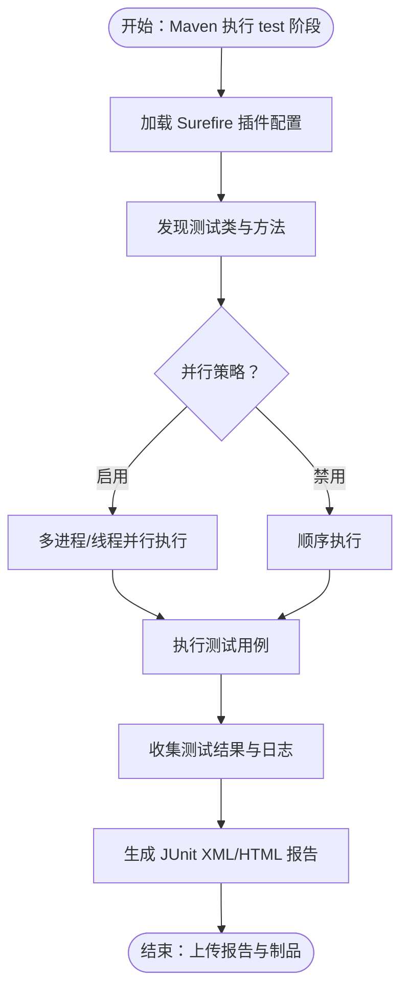
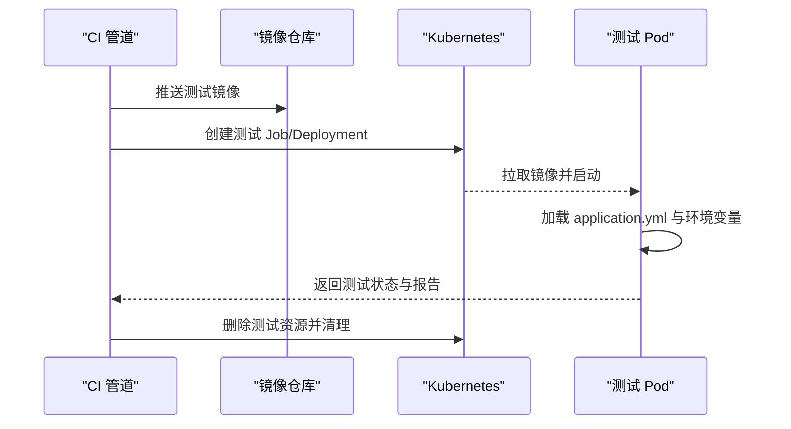
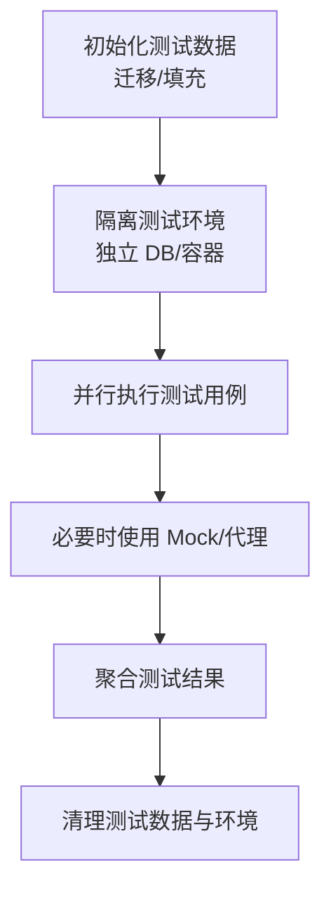
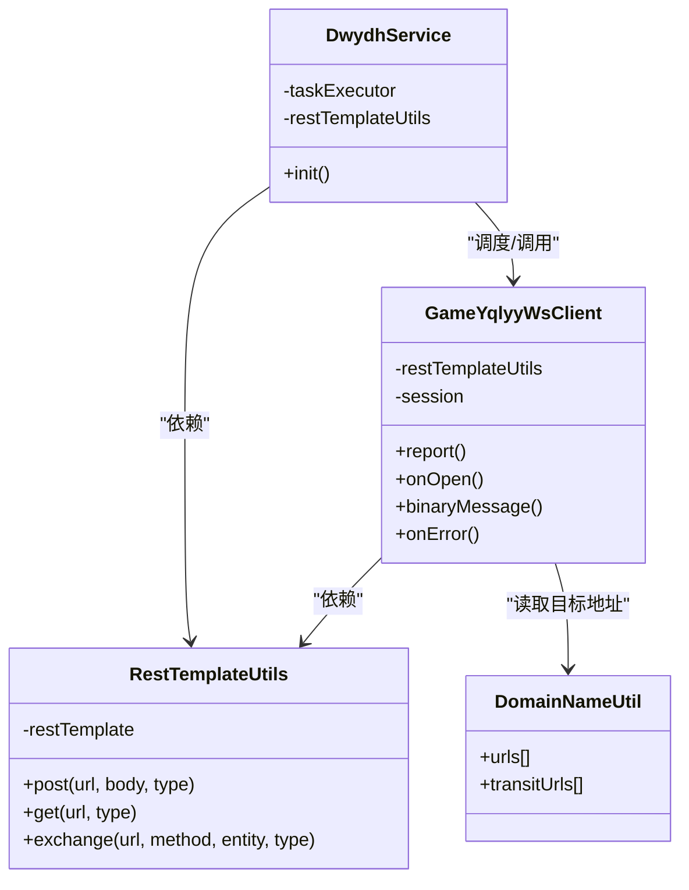
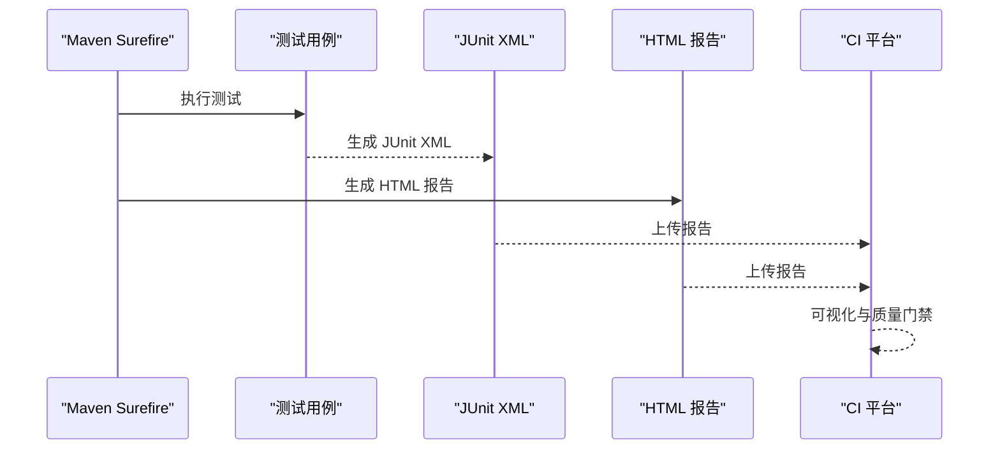
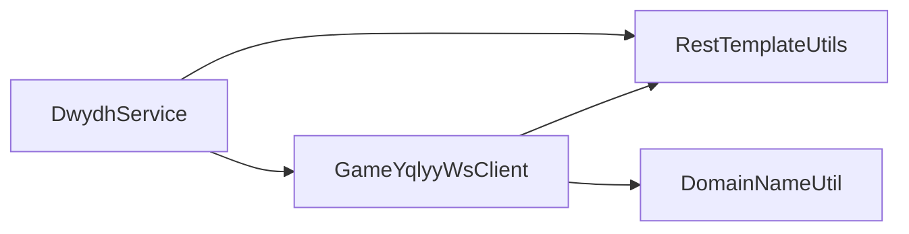

# 自动化测试

<cite>
**本文引用的文件**
- [pom.xml](file://pom.xml)
- [Application.java](file://src/main/java/com/Application.java)
- [DwydhService.java](file://src/main/java/com/dwydh/DwydhService.java)
- [GameYqlyyWsClient.java](file://src/main/java/com/yqlyy/GameYqlyyWsClient.java)
- [RestTemplateUtils.java](file://src/main/java/com/commom/RestTemplateUtils.java)
- [DomainNameUtil.java](file://src/main/java/com/utils/DomainNameUtil.java)
- [application.yml](file://src/main/resources/application.yml)
- [logback.xml](file://src/main/resources/logback.xml)
</cite>

## 目录
1. [简介](#简介)
2. [项目结构](#项目结构)
3. [核心组件](#核心组件)
4. [架构总览](#架构总览)
5. [详细组件分析](#详细组件分析)
6. [依赖关系分析](#依赖关系分析)
7. [性能考虑](#性能考虑)
8. [故障排查指南](#故障排查指南)
9. [结论](#结论)
10. [附录](#附录)

## 简介
本文件面向在 CI/CD 环境中落地自动化测试的工程实践，结合当前仓库的 Maven 构建与 Spring Boot 应用特性，给出测试配置、执行策略、报告生成、环境部署与清理、并行测试与测试数据管理等建议。由于当前仓库未包含测试模块与 Surefire 插件配置，本文将提供从零开始的完整落地方案，并通过图示帮助读者理解测试流水线与关键组件交互。

## 项目结构
该仓库为一个基于 Spring Boot 的 Java 应用，主要包含以下与测试相关的关键点：
- 构建与打包：使用 Maven，包含资源过滤、编译插件与 Spring Boot 打包插件。
- 应用入口：Spring Boot 启动类。
- 核心业务：WebSocket 客户端与定时上报逻辑，依赖 HTTP 客户端工具。
- 配置：应用端口、HTTP 连接池参数、日志配置等。

图表来源
- [pom.xml](file://pom.xml#L114-L156)
- [Application.java](file://src/main/java/com/Application.java#L1-L14)
- [DwydhService.java](file://src/main/java/com/dwydh/DwydhService.java#L1-L39)
- [GameYqlyyWsClient.java](file://src/main/java/com/yqlyy/GameYqlyyWsClient.java#L1-L328)
- [RestTemplateUtils.java](file://src/main/java/com/commom/RestTemplateUtils.java#L1-L31)
- [DomainNameUtil.java](file://src/main/java/com/utils/DomainNameUtil.java#L1-L16)
- [application.yml](file://src/main/resources/application.yml#L1-L31)
- [logback.xml](file://src/main/resources/logback.xml#L1-L75)

章节来源
- [pom.xml](file://pom.xml#L114-L156)
- [Application.java](file://src/main/java/com/Application.java#L1-L14)

## 核心组件
- Maven 构建与插件
  - 资源过滤、编码配置、编译器版本与编码统一。
  - Spring Boot 插件用于打包与运行。
- 应用入口与配置
  - Spring Boot 启动类负责应用生命周期。
  - application.yml 提供端口、HTTP 连接池与环境配置占位符。
- 业务组件
  - DwydhService：调度 WebSocket 客户端并定时上报。
  - GameYqlyyWsClient：WebSocket 客户端，处理二进制消息、心跳、错误与重连。
  - RestTemplateUtils：封装 HTTP GET/POST/exchange。
  - DomainNameUtil：集中管理目标服务地址（当前为空数组，需在 CI 环境注入）。

章节来源
- [pom.xml](file://pom.xml#L114-L156)
- [application.yml](file://src/main/resources/application.yml#L1-L31)
- [DwydhService.java](file://src/main/java/com/dwydh/DwydhService.java#L1-L39)
- [GameYqlyyWsClient.java](file://src/main/java/com/yqlyy/GameYqlyyWsClient.java#L1-L328)
- [RestTemplateUtils.java](file://src/main/java/com/commom/RestTemplateUtils.java#L1-L31)
- [DomainNameUtil.java](file://src/main/java/com/utils/DomainNameUtil.java#L1-L16)

## 架构总览
下图展示了测试在 CI/CD 管道中的典型位置与交互：构建阶段产出可执行包；测试阶段在隔离环境执行单元/集成测试；测试报告与制品归档；失败时触发回滚或告警。

（本图为概念性流程图，无需图表来源）

## 详细组件分析

### Maven Surefire 插件配置与测试执行策略
- 插件引入与基础配置
  - 在构建部分添加 Maven Surefire 插件，指定测试 JVM 参数、编码、并行度与 fork 行为。
  - 使用 JUnit 4/5 Runner，确保与 Spring Boot 测试兼容。
- 测试分类与执行策略
  - 单元测试：无外部依赖，快速执行，建议并行度较低。
  - 集成测试：依赖 HTTP 工具与外部服务，建议串行或分组执行，避免竞争。
  - 超时与失败策略：设置合理超时，失败时不阻塞后续阶段，允许汇总报告。
- 报告生成
  - 输出 JUnit XML 与 HTML 报告，便于 CI 平台解析与可视化。

（本图为概念性流程图，无需图表来源）

章节来源
- [pom.xml](file://pom.xml#L114-L156)

### 测试环境自动化部署与清理
- 部署策略
  - 使用 Docker 镜像承载应用，CI 中构建镜像并推送到镜像仓库。
  - 通过 K8s Job/Deployment 在测试命名空间中拉起一次性 Pod/实例，执行测试。
  - 注入环境变量与配置文件，覆盖 application.yml 中的占位符与域名列表。
- 清理策略
  - 测试结束后删除临时 Pod/命名空间，回收资源。
  - 清理日志目录与临时文件，避免磁盘占用。

（本图为概念性流程图，无需图表来源）

### 并行测试执行与测试数据管理
- 并行策略
  - 使用 Surefire 的并行执行能力，按类或方法粒度并行，注意线程安全与共享资源竞争。
  - 对依赖外部系统的测试进行分组，避免并发写入导致数据污染。
- 测试数据管理
  - 使用数据库迁移工具（如 Flyway/Liquibase）在测试前初始化种子数据。
  - 使用内存数据库（如 H2）或独立测试数据库实例，保证隔离性。
  - 对 WebSocket 场景，可通过 Mock 服务或本地代理模拟外部推送，减少真实依赖。

（本图为概念性流程图，无需图表来源）

### 关键组件交互与测试要点
- DwydhService 与 GameYqlyyWsClient
  - WebSocket 连接、心跳与重连逻辑是测试重点，建议通过桩对象替换真实连接，验证连接与消息处理分支。
  - 定时任务建议使用可控的调度器，便于测试控制节奏。
- RestTemplateUtils
  - 封装 HTTP 请求，测试时通过 Mock 框架替换 RestTemplate，验证请求构造、异常处理与重试策略。
- DomainNameUtil
  - 域名列表在 CI 中应由环境变量注入，避免硬编码，便于不同环境切换。

图表来源
- [DwydhService.java](file://src/main/java/com/dwydh/DwydhService.java#L1-L39)
- [GameYqlyyWsClient.java](file://src/main/java/com/yqlyy/GameYqlyyWsClient.java#L1-L328)
- [RestTemplateUtils.java](file://src/main/java/com/commom/RestTemplateUtils.java#L1-L31)
- [DomainNameUtil.java](file://src/main/java/com/utils/DomainNameUtil.java#L1-L16)

章节来源
- [DwydhService.java](file://src/main/java/com/dwydh/DwydhService.java#L1-L39)
- [GameYqlyyWsClient.java](file://src/main/java/com/yqlyy/GameYqlyyWsClient.java#L1-L328)
- [RestTemplateUtils.java](file://src/main/java/com/commom/RestTemplateUtils.java#L1-L31)
- [DomainNameUtil.java](file://src/main/java/com/utils/DomainNameUtil.java#L1-L16)

### 测试报告生成与可视化
- JUnit XML 报告
  - Surefire 默认输出 JUnit XML，可在 CI 平台解析并生成趋势图与缺陷跟踪。
- HTML 报告
  - 可选生成 HTML 报告，便于本地查看与分享。
- 可视化展示
  - 将报告上传至 CI 平台的测试报告页面或第三方看板，实现质量门禁与趋势分析。

（本图为概念性流程图，无需图表来源）

### 失败处理与回滚机制
- 失败策略
  - 测试失败不影响构建，但会阻止发布；CI 中设置“软失败”或“质量门禁”，根据阈值决定是否继续。
- 回滚机制
  - 若测试通过但部署后失败，采用蓝绿/金丝雀回滚策略，快速恢复。
- 日志与可观测性
  - 通过 logback.xml 输出结构化日志，便于问题定位与审计。

章节来源
- [logback.xml](file://src/main/resources/logback.xml#L1-L75)

## 依赖关系分析
- 组件耦合
  - DwydhService 依赖 GameYqlyyWsClient 与 RestTemplateUtils，属于高层调度与低层通信的分层。
  - GameYqlyyWsClient 依赖 RestTemplateUtils 与 DomainNameUtil，存在对外部系统的耦合。
- 外部依赖
  - HTTP 客户端、WebSocket 客户端、日志框架等均为外部库，需在 CI 中统一版本管理与缓存加速。

图表来源
- [DwydhService.java](file://src/main/java/com/dwydh/DwydhService.java#L1-L39)
- [GameYqlyyWsClient.java](file://src/main/java/com/yqlyy/GameYqlyyWsClient.java#L1-L328)
- [RestTemplateUtils.java](file://src/main/java/com/commom/RestTemplateUtils.java#L1-L31)
- [DomainNameUtil.java](file://src/main/java/com/utils/DomainNameUtil.java#L1-L16)

章节来源
- [DwydhService.java](file://src/main/java/com/dwydh/DwydhService.java#L1-L39)
- [GameYqlyyWsClient.java](file://src/main/java/com/yqlyy/GameYqlyyWsClient.java#L1-L328)
- [RestTemplateUtils.java](file://src/main/java/com/commom/RestTemplateUtils.java#L1-L31)
- [DomainNameUtil.java](file://src/main/java/com/utils/DomainNameUtil.java#L1-L16)

## 性能考虑
- 并行度与资源
  - 并行测试会增加 CPU/IO 压力，需结合机器资源与测试类型合理设置。
- 超时与重试
  - 对网络与外部系统调用设置合理超时与指数退避重试，避免雪崩效应。
- 日志与报告
  - 控制日志级别与输出频率，避免影响测试性能；报告生成在后台异步完成。

（本节为通用指导，无需章节来源）

## 故障排查指南
- WebSocket 连接失败
  - 检查 wsUrl 是否正确、网络连通性与代理设置；查看日志中连接与异常信息。
- HTTP 请求异常
  - 核对 DomainNameUtil 中的目标地址是否注入；检查超时与重试策略。
- 日志定位
  - 查看 logback.xml 中 info/error 文件滚动策略与输出路径，确认日志是否落盘。
- 常见问题
  - 端口冲突：检查 application.yml 中 server.port 与容器端口映射。
  - 编码问题：统一 UTF-8，确保资源过滤与编译编码一致。

章节来源
- [GameYqlyyWsClient.java](file://src/main/java/com/yqlyy/GameYqlyyWsClient.java#L250-L272)
- [RestTemplateUtils.java](file://src/main/java/com/commom/RestTemplateUtils.java#L19-L29)
- [logback.xml](file://src/main/resources/logback.xml#L16-L58)
- [application.yml](file://src/main/resources/application.yml#L1-L31)

## 结论
通过在现有 Maven 与 Spring Boot 基础上引入 Surefire 插件、完善测试环境与数据管理、规范报告与可视化流程，可形成稳定可靠的 CI/CD 自动化测试体系。建议优先补齐单元测试，再逐步扩展集成测试与端到端测试，配合并行执行与失败回滚策略，持续提升交付质量与效率。

## 附录
- 建议的 CI 阶段划分
  - 构建：编译、打包、镜像构建。
  - 测试：单元测试、集成测试、报告生成。
  - 发布：制品上传、报告归档、通知。
  - 回滚：失败时自动回滚或人工干预。
- 关键配置清单
  - Maven 插件：Surefire、Spring Boot。
  - 应用配置：端口、HTTP 连接池、环境占位符。
  - 日志配置：文件滚动、级别过滤、输出路径。

（本节为通用指导，无需章节来源）