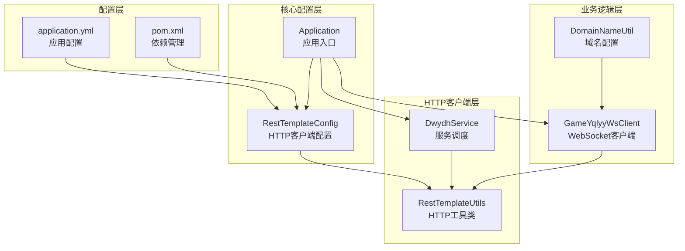
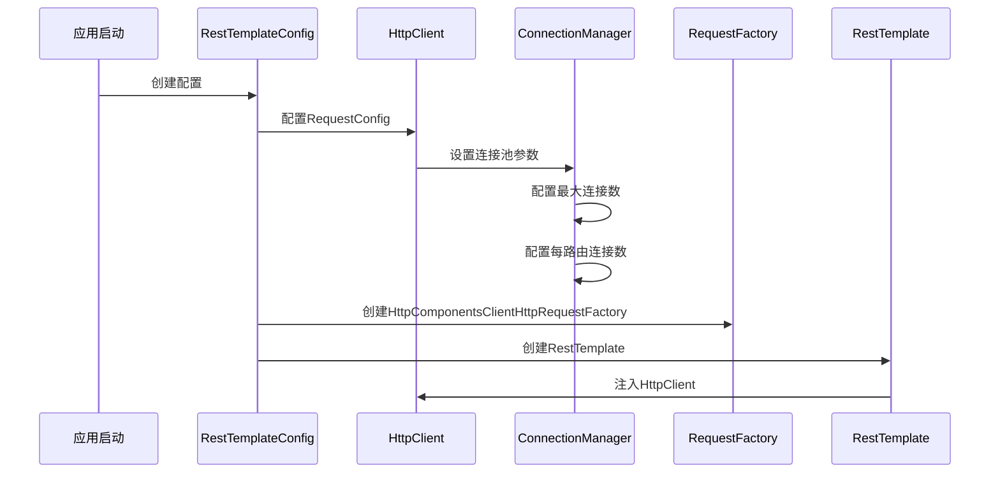
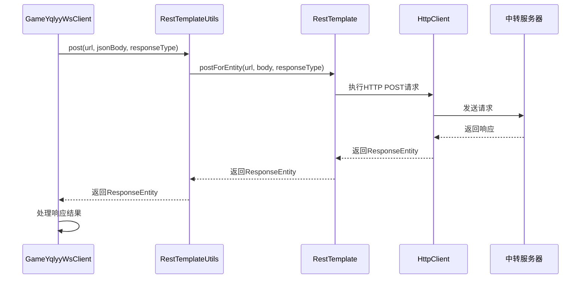
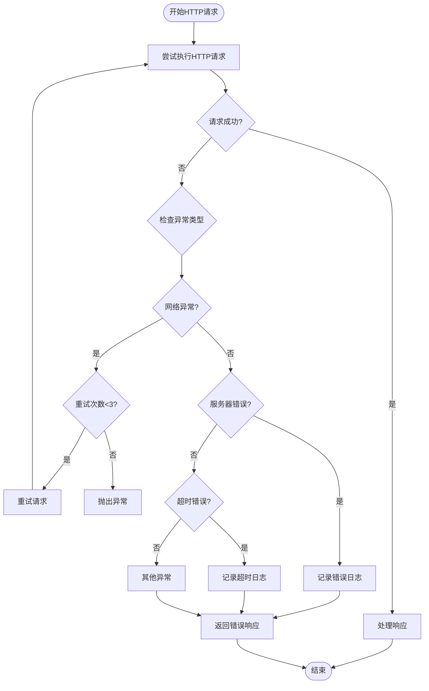
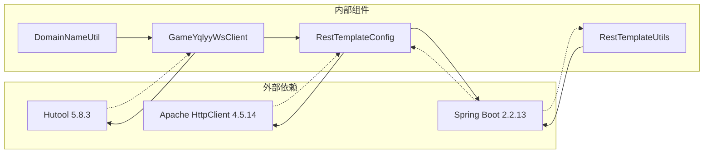

# HTTP通信集成测试

<cite>
**本文档引用的文件**
- [RestTemplateConfig.java](file://src/main/java/com/commom/RestTemplateConfig.java)
- [RestTemplateUtils.java](file://src/main/java/com/commom/RestTemplateUtils.java)
- [DwydhService.java](file://src/main/java/com/dwydh/DwydhService.java)
- [GameYqlyyWsClient.java](file://src/main/java/com/yqlyy/GameYqlyyWsClient.java)
- [DomainNameUtil.java](file://src/main/java/com/utils/DomainNameUtil.java)
- [application.yml](file://src/main/resources/application.yml)
- [pom.xml](file://pom.xml)
- [Application.java](file://src/main/java/com/Application.java)
</cite>

## 目录
1. [简介](#简介)
2. [项目结构](#项目结构)
3. [核心组件](#核心组件)
4. [架构概览](#架构概览)
5. [详细组件分析](#详细组件分析)
6. [依赖关系分析](#依赖关系分析)
7. [性能考虑](#性能考虑)
8. [故障排除指南](#故障排除指南)
9. [结论](#结论)
10. [附录](#附录)

## 简介

本文件为HTTP通信集成测试的完整文档，专注于测试RestTemplateUtils的HTTP客户端功能。该系统通过WebSocket接收游戏数据，然后使用HTTP客户端向内部中转服务器发送数据。测试涵盖以下关键方面：

- GET和POST请求的发送和响应处理
- HTTP连接池配置和性能验证
- HTTP错误处理策略（网络异常、服务器错误、超时重试）
- 与内部中转服务器的集成测试
- 测试环境配置和Mock服务器搭建
- 具体的HTTP测试用例和性能测试方法

## 项目结构

该项目采用Spring Boot框架，主要包含以下模块：



**图表来源**
- [RestTemplateConfig.java](file://src/main/java/com/commom/RestTemplateConfig.java#L1-L132)
- [RestTemplateUtils.java](file://src/main/java/com/commom/RestTemplateUtils.java#L1-L31)
- [DwydhService.java](file://src/main/java/com/dwydh/DwydhService.java#L1-L39)
- [GameYqlyyWsClient.java](file://src/main/java/com/yqlyy/GameYqlyyWsClient.java#L1-L328)
- [DomainNameUtil.java](file://src/main/java/com/utils/DomainNameUtil.java#L1-L16)

**章节来源**
- [RestTemplateConfig.java](file://src/main/java/com/commom/RestTemplateConfig.java#L1-L132)
- [application.yml](file://src/main/resources/application.yml#L1-L31)

## 核心组件

### RestTemplateConfig - HTTP客户端配置

RestTemplateConfig是整个HTTP通信系统的核心配置类，负责：

- **连接池管理**：配置Apache HttpClient的连接池参数
- **超时设置**：定义连接超时、请求超时等关键参数
- **重试机制**：设置HTTP请求重试策略
- **默认头部**：配置HTTP请求的默认头部信息

关键配置参数：
- `maxTotal`: 最大连接数（默认100）
- `defaultMaxPerRoute`: 每路由最大连接数（默认20）
- `connectTimeout`: 连接超时时间（默认10000ms）
- `connectionRequestTimeout`: 从连接池获取连接超时（默认500ms）
- `socketTimeout`: Socket超时时间（默认30000ms）
- `staleConnectionCheckEnabled`: 过期连接检查（默认true）
- `validateAfterInactivity`: 空闲连接验证时间（默认3000000ms）

**章节来源**
- [RestTemplateConfig.java](file://src/main/java/com/commom/RestTemplateConfig.java#L35-L54)
- [RestTemplateConfig.java](file://src/main/java/com/commom/RestTemplateConfig.java#L117-L129)

### RestTemplateUtils - HTTP工具类

RestTemplateUtils提供了简化的HTTP客户端接口：

- `post()`: 发送POST请求
- `get()`: 发送GET请求  
- `exchange()`: 发送任意HTTP方法请求

该类封装了Spring RestTemplate的使用，提供统一的HTTP请求接口。

**章节来源**
- [RestTemplateUtils.java](file://src/main/java/com/commom/RestTemplateUtils.java#L19-L29)

### GameYqlyyWsClient - WebSocket客户端

GameYqlyyWsClient是主要的业务客户端，负责：

- **WebSocket连接管理**：建立和维护与游戏服务器的WebSocket连接
- **数据解析**：解析WebSocket二进制消息，提取游戏数据
- **HTTP转发**：将解析的游戏数据通过HTTP客户端转发给内部中转服务器
- **错误处理**：处理WebSocket连接异常和HTTP请求异常

**章节来源**
- [GameYqlyyWsClient.java](file://src/main/java/com/yqlyy/GameYqlyyWsClient.java#L32-L44)
- [GameYqlyyWsClient.java](file://src/main/java/com/yqlyy/GameYqlyyWsClient.java#L103-L118)
- [GameYqlyyWsClient.java](file://src/main/java/com/yqlyy/GameYqlyyWsClient.java#L136-L148)

## 架构概览

系统采用分层架构设计，实现了清晰的关注点分离：

```mermaid
graph TB
subgraph "外部系统"
WS[WebSocket服务器]
TRANSIT[内部中转服务器]
end
subgraph "业务层"
GYC[GameYqlyyWsClient<br/>业务逻辑]
DWS[DwydhService<br/>服务调度]
end
subgraph "HTTP客户端层"
RTU[RestTemplateUtils<br/>HTTP工具]
RTC[RestTemplateConfig<br/>配置管理]
end
subgraph "基础设施层"
HC[Apache HttpClient<br/>连接池]
CM[ConnectionManager<br/>连接管理]
end
WS --> GYC
GYC --> RTU
RTU --> HC
HC --> CM
TRANSIT <- --> RTU
DWS --> GYC
```

**图表来源**
- [GameYqlyyWsClient.java](file://src/main/java/com/yqlyy/GameYqlyyWsClient.java#L32-L44)
- [RestTemplateConfig.java](file://src/main/java/com/commom/RestTemplateConfig.java#L84-L108)
- [RestTemplateUtils.java](file://src/main/java/com/commom/RestTemplateUtils.java#L16-L17)

## 详细组件分析

### HTTP客户端配置流程



**图表来源**
- [RestTemplateConfig.java](file://src/main/java/com/commom/RestTemplateConfig.java#L84-L108)
- [RestTemplateConfig.java](file://src/main/java/com/commom/RestTemplateConfig.java#L117-L129)

### HTTP请求处理流程



**图表来源**
- [RestTemplateUtils.java](file://src/main/java/com/commom/RestTemplateUtils.java#L19-L21)
- [GameYqlyyWsClient.java](file://src/main/java/com/yqlyy/GameYqlyyWsClient.java#L106-L108)

### 错误处理流程



**图表来源**
- [GameYqlyyWsClient.java](file://src/main/java/com/yqlyy/GameYqlyyWsClient.java#L109-L114)
- [RestTemplateConfig.java](file://src/main/java/com/commom/RestTemplateConfig.java#L106)

**章节来源**
- [GameYqlyyWsClient.java](file://src/main/java/com/yqlyy/GameYqlyyWsClient.java#L109-L114)
- [RestTemplateConfig.java](file://src/main/java/com/commom/RestTemplateConfig.java#L106)

## 依赖关系分析

系统的关键依赖关系如下：



**图表来源**
- [pom.xml](file://pom.xml#L40-L43)
- [pom.xml](file://pom.xml#L28-L30)
- [pom.xml](file://pom.xml#L80-L84)

**章节来源**
- [pom.xml](file://pom.xml#L1-L160)

## 性能考虑

### 连接池性能配置

系统通过以下参数优化HTTP客户端性能：

- **连接池大小**：`maxTotal=100`，`defaultMaxPerRoute=20`
- **超时配置**：`connectTimeout=10000ms`，`socketTimeout=30000ms`，`connectionRequestTimeout=500ms`
- **连接保活**：启用Keep-Alive策略，减少连接建立开销
- **过期检查**：定期检查过期连接，确保连接池健康

### 性能测试方法

1. **并发压力测试**
   - 测试场景：模拟高并发HTTP请求
   - 目标指标：响应时间、吞吐量、错误率
   - 验证内容：连接池利用率、超时处理效果

2. **内存使用监控**
   - 监控连接池内存占用
   - 观察GC行为
   - 分析内存泄漏风险

3. **网络延迟测试**
   - 测试不同网络条件下的表现
   - 验证超时配置的合理性
   - 评估重试机制的效果

## 故障排除指南

### 常见问题及解决方案

1. **连接超时问题**
   - 检查`connectTimeout`和`socketTimeout`配置
   - 验证网络连通性
   - 监控服务器负载情况

2. **连接池耗尽**
   - 检查`maxTotal`和`defaultMaxPerRoute`设置
   - 监控连接池使用率
   - 优化业务逻辑中的连接使用

3. **HTTP重试失败**
   - 验证重试配置（默认重试2次）
   - 检查异常类型是否支持重试
   - 监控重试成功率

4. **WebSocket连接异常**
   - 检查WebSocket服务器状态
   - 验证URL配置正确性
   - 监控连接断开频率

**章节来源**
- [GameYqlyyWsClient.java](file://src/main/java/com/yqlyy/GameYqlyyWsClient.java#L246-L248)
- [RestTemplateConfig.java](file://src/main/java/com/commom/RestTemplateConfig.java#L106)

## 结论

本HTTP通信集成测试文档涵盖了系统的完整HTTP客户端功能测试方案。通过深入分析RestTemplateConfig和RestTemplateUtils的实现，结合GameYqlyyWsClient的实际业务场景，我们建立了全面的测试策略。

关键测试要点包括：
- HTTP连接池配置的正确性和性能验证
- GET/POST请求的完整生命周期测试
- 错误处理和重试机制的有效性验证
- 与内部中转服务器的集成测试
- 性能基准测试和压力测试

建议在实际测试中重点关注连接池配置的合理性、超时参数的适用性，以及错误处理策略的健壮性。

## 附录

### 测试环境配置

1. **Mock服务器搭建**
   - 使用Mock服务器模拟内部中转服务器
   - 配置不同的响应状态码（200、4xx、5xx）
   - 设置不同的响应延迟以测试超时处理

2. **测试数据准备**
   - 准备各种格式的游戏数据
   - 包含正常数据和异常数据
   - 准备边界条件测试数据

3. **测试配置文件**
   - 修改`application.yml`中的连接池参数
   - 配置测试环境的域名列表
   - 设置适当的日志级别以便调试

### 测试用例示例

1. **基础HTTP功能测试**
   - POST请求成功响应测试
   - GET请求成功响应测试
   - HTTP头部正确性验证

2. **错误处理测试**
   - 网络异常重试测试
   - 服务器错误响应处理
   - 超时异常处理测试

3. **性能测试用例**
   - 并发连接测试
   - 连接池利用率测试
   - 内存使用效率测试

4. **集成测试用例**
   - WebSocket到HTTP的完整流程测试
   - 数据格式转换正确性测试
   - 中转服务器集成验证