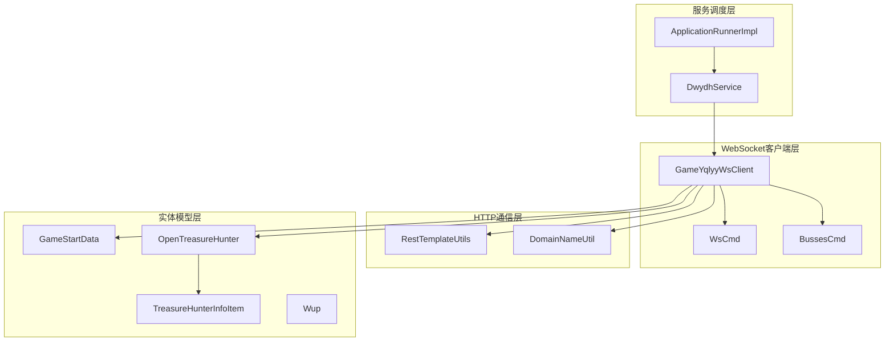
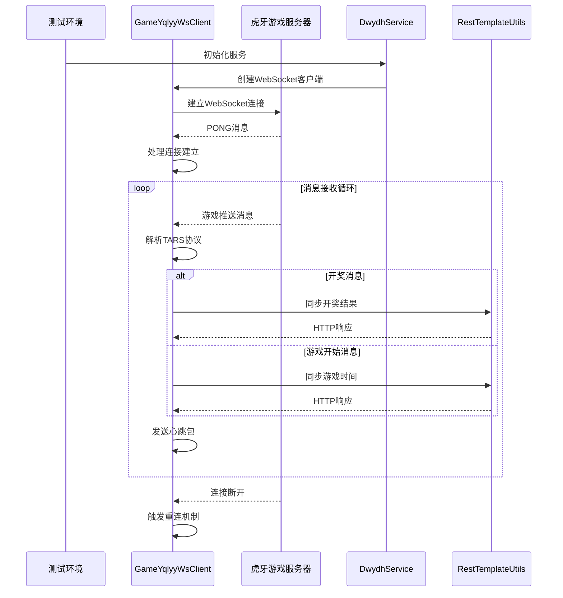
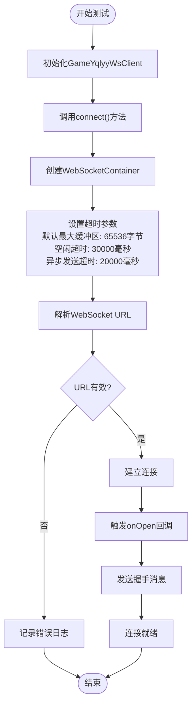
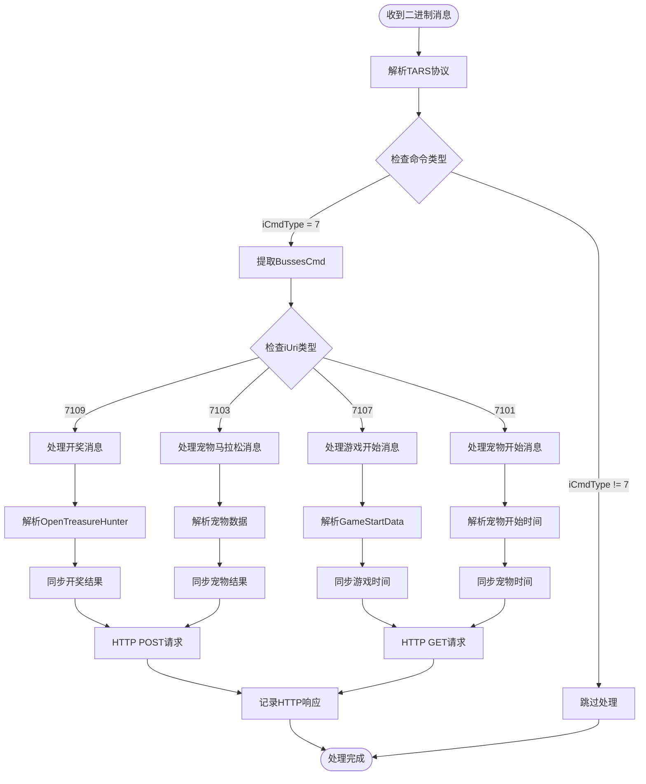
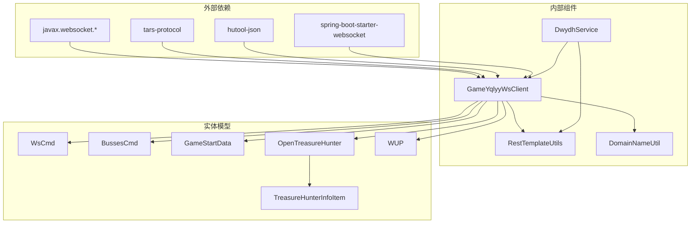
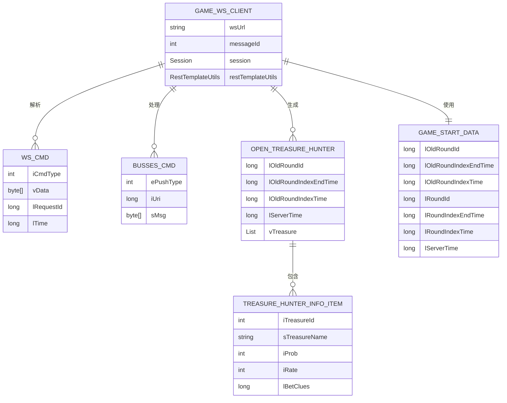

# WebSocket集成测试

<cite>
**本文档引用的文件**
- [GameYqlyyWsClient.java](file://src/main/java/com/yqlyy/GameYqlyyWsClient.java)
- [DwydhService.java](file://src/main/java/com/dwydh/DwydhService.java)
- [RestTemplateUtils.java](file://src/main/java/com/commom/RestTemplateUtils.java)
- [application.yml](file://src/main/resources/application.yml)
- [ApplicationRunnerImpl.java](file://src/main/java/com/listener/ApplicationRunnerImpl.java)
- [DomainNameUtil.java](file://src/main/java/com/utils/DomainNameUtil.java)
- [WsCmd.java](file://src/main/java/com/entity/WsCmd.java)
- [BussesCmd.java](file://src/main/java/com/entity/BussesCmd.java)
- [GameStartData.java](file://src/main/java/com/entity/GameStartData.java)
- [OpenTreasureHunter.java](file://src/main/java/com/entity/AccountedNotify/OpenTreasureHunter.java)
- [TreasureHunterInfoItem.java](file://src/main/java/com/entity/AccountedNotify/TreasureHunterInfoItem.java)
- [Wup.java](file://src/main/java/com/entity/Wup.java)
</cite>

## 目录
1. [简介](#简介)
2. [项目结构](#项目结构)
3. [核心组件](#核心组件)
4. [架构概览](#架构概览)
5. [详细组件分析](#详细组件分析)
6. [依赖关系分析](#依赖关系分析)
7. [性能考虑](#性能考虑)
8. [故障排除指南](#故障排除指南)
9. [结论](#结论)
10. [附录](#附录)

## 简介
本文件为WebSocket集成测试的详细文档，专注于测试GameYqlyyWsClient的WebSocket连接功能。该系统负责与虎牙游戏服务器建立WebSocket连接，接收游戏推送消息，并将开奖结果同步到内部服务。文档涵盖了连接建立、消息接收、连接断开的测试策略，以及如何模拟虎牙游戏服务器的WebSocket响应。

## 项目结构
该项目采用Spring Boot框架，主要包含以下模块：
- WebSocket客户端：GameYqlyyWsClient
- 服务调度：DwydhService
- HTTP客户端工具：RestTemplateUtils
- 实体模型：各种游戏数据结构
- 配置文件：application.yml



**图表来源**
- [GameYqlyyWsClient.java](file://src/main/java/com/yqlyy/GameYqlyyWsClient.java#L29-L328)
- [DwydhService.java](file://src/main/java/com/dwydh/DwydhService.java#L12-L38)
- [RestTemplateUtils.java](file://src/main/java/com/commom/RestTemplateUtils.java#L14-L31)

**章节来源**
- [GameYqlyyWsClient.java](file://src/main/java/com/yqlyy/GameYqlyyWsClient.java#L1-L328)
- [DwydhService.java](file://src/main/java/com/dwydh/DwydhService.java#L1-L39)
- [application.yml](file://src/main/resources/application.yml#L1-L31)

## 核心组件
本节详细介绍WebSocket集成测试涉及的核心组件及其职责。

### GameYqlyyWsClient组件
GameYqlyyWsClient是主要的WebSocket客户端，负责：
- 建立与虎牙游戏服务器的WebSocket连接
- 处理二进制消息（TARS协议）
- 解析不同类型的推送消息
- 发送心跳包维持连接
- 错误处理和重连机制

### DwydhService组件
DwydhService作为服务调度器：
- 初始化WebSocket客户端
- 管理客户端的生命周期
- 协调多个客户端的工作

### RestTemplateUtils组件
提供HTTP通信能力：
- 支持GET和POST请求
- 异常处理机制
- 响应式数据传输

**章节来源**
- [GameYqlyyWsClient.java](file://src/main/java/com/yqlyy/GameYqlyyWsClient.java#L29-L328)
- [DwydhService.java](file://src/main/java/com/dwydh/DwydhService.java#L14-L38)
- [RestTemplateUtils.java](file://src/main/java/com/commom/RestTemplateUtils.java#L14-L31)

## 架构概览
WebSocket集成测试的架构分为四个层次：



**图表来源**
- [GameYqlyyWsClient.java](file://src/main/java/com/yqlyy/GameYqlyyWsClient.java#L221-L290)
- [DwydhService.java](file://src/main/java/com/dwydh/DwydhService.java#L21-L36)

## 详细组件分析

### WebSocket连接建立流程
WebSocket连接建立涉及多个步骤和状态转换：



**图表来源**
- [GameYqlyyWsClient.java](file://src/main/java/com/yqlyy/GameYqlyyWsClient.java#L250-L272)
- [GameYqlyyWsClient.java](file://src/main/java/com/yqlyy/GameYqlyyWsClient.java#L221-L237)

### 消息接收和处理流程
系统支持多种类型的游戏推送消息：



**图表来源**
- [GameYqlyyWsClient.java](file://src/main/java/com/yqlyy/GameYqlyyWsClient.java#L51-L219)
- [OpenTreasureHunter.java](file://src/main/java/com/entity/AccountedNotify/OpenTreasureHunter.java#L72-L81)
- [GameStartData.java](file://src/main/java/com/entity/GameStartData.java#L4-L79)

### 心跳机制和重连策略
系统实现了基于PONG消息的心跳机制：

```mermaid
stateDiagram-v2
[*] --> Connected : 连接建立
Connected --> Heartbeat : 发送心跳包
Heartbeat --> WaitingPong : 等待PONG响应
WaitingPong --> Connected : 收到PONG
Heartbeat --> Reconnect : 超时未响应
WaitingPong --> Reconnect : 超时未响应
Reconnect --> CheckSession{"会话状态检查"}
CheckSession --> |已关闭| CreateNewSession["创建新会话"]
CheckSession --> |正常| ResumeSession["恢复会话"]
CreateNewSession --> Connect["重新连接"]
ResumeSession --> Heartbeat
Connect --> OnOpen : 连接成功
Connect --> Reconnect : 连接失败
OnOpen --> Heartbeat : 连接建立完成
Heartbeat --> Disconnected : 连接断开
Disconnected --> Reconnect : 触发重连
Reconnect --> [*] : 重试达到上限
```

**图表来源**
- [GameYqlyyWsClient.java](file://src/main/java/com/yqlyy/GameYqlyyWsClient.java#L46-L49)
- [GameYqlyyWsClient.java](file://src/main/java/com/yqlyy/GameYqlyyWsClient.java#L274-L290)

**章节来源**
- [GameYqlyyWsClient.java](file://src/main/java/com/yqlyy/GameYqlyyWsClient.java#L46-L290)

## 依赖关系分析

### 组件依赖图


**图表来源**
- [GameYqlyyWsClient.java](file://src/main/java/com/yqlyy/GameYqlyyWsClient.java#L1-L328)
- [DwydhService.java](file://src/main/java/com/dwydh/DwydhService.java#L1-L39)

### 数据流分析
系统的数据流遵循以下模式：



**图表来源**
- [WsCmd.java](file://src/main/java/com/entity/WsCmd.java#L1-L68)
- [BussesCmd.java](file://src/main/java/com/entity/BussesCmd.java#L1-L9)
- [OpenTreasureHunter.java](file://src/main/java/com/entity/AccountedNotify/OpenTreasureHunter.java#L1-L83)
- [TreasureHunterInfoItem.java](file://src/main/java/com/entity/AccountedNotify/TreasureHunterInfoItem.java#L1-L124)
- [GameStartData.java](file://src/main/java/com/entity/GameStartData.java#L1-L79)

**章节来源**
- [WsCmd.java](file://src/main/java/com/entity/WsCmd.java#L1-L68)
- [BussesCmd.java](file://src/main/java/com/entity/BussesCmd.java#L1-L9)
- [OpenTreasureHunter.java](file://src/main/java/com/entity/AccountedNotify/OpenTreasureHunter.java#L1-L83)
- [TreasureHunterInfoItem.java](file://src/main/java/com/entity/AccountedNotify/TreasureHunterInfoItem.java#L1-L124)
- [GameStartData.java](file://src/main/java/com/entity/GameStartData.java#L1-L79)

## 性能考虑
在WebSocket集成测试中，需要关注以下性能指标：

### 连接性能
- **连接建立时间**：监控从connect()调用到onOpen回调的时间
- **消息处理延迟**：测量从接收消息到完成处理的时延
- **内存使用**：跟踪ByteBuffer和对象实例的内存占用

### 传输性能
- **消息吞吐量**：统计每秒处理的消息数量
- **带宽利用率**：监控WebSocket连接的带宽使用情况
- **CPU占用率**：分析消息解析和处理的CPU消耗

### 错误处理性能
- **重连频率**：统计连接断开和重连的次数
- **错误恢复时间**：测量从错误发生到恢复正常的时间
- **资源清理效率**：监控会话和连接的清理效果

## 故障排除指南

### 常见问题及解决方案

#### 连接建立失败
**症状**：WebSocket连接无法建立或立即断开
**诊断步骤**：
1. 检查WebSocket URL的有效性
2. 验证网络连接和防火墙设置
3. 确认服务器证书和SSL配置

**解决方案**：
- 更新有效的WebSocket URL
- 配置正确的SSL证书
- 调整连接超时参数

#### 消息解析错误
**症状**：二进制消息无法正确解析
**诊断步骤**：
1. 验证TARS协议的版本兼容性
2. 检查消息格式和字段映射
3. 确认数据类型转换的正确性

**解决方案**：
- 更新TARS协议解析逻辑
- 修正字段映射关系
- 添加数据类型验证

#### 心跳机制失效
**症状**：连接频繁断开但无明显错误
**诊断步骤**：
1. 检查PONG消息的接收情况
2. 验证心跳包的发送频率
3. 分析网络延迟和丢包情况

**解决方案**：
- 调整心跳间隔时间
- 增加超时容忍度
- 优化网络连接质量

**章节来源**
- [GameYqlyyWsClient.java](file://src/main/java/com/yqlyy/GameYqlyyWsClient.java#L240-L248)
- [GameYqlyyWsClient.java](file://src/main/java/com/yqlyy/GameYqlyyWsClient.java#L250-L272)

## 结论
WebSocket集成测试需要全面覆盖连接建立、消息处理和错误恢复等关键场景。通过模拟虎牙游戏服务器的不同响应类型，可以有效验证系统的稳定性和可靠性。建议在测试环境中实施持续集成，确保WebSocket功能的长期稳定性。

## 附录

### 测试环境搭建步骤

#### 本地WebSocket服务器配置
1. 准备WebSocket服务器软件（如Node.js ws库或Java WebSocket服务器）
2. 配置服务器监听端口和SSL证书
3. 设置服务器的WebSocket路由和消息处理器
4. 配置服务器的PONG响应机制

#### 测试数据准备
1. 准备不同类型的TARS协议消息包
2. 创建模拟的开奖结果数据
3. 准备游戏开始和结束的测试消息
4. 设计错误场景的异常消息

#### 测试用例设计

##### 连接建立测试
- **测试目标**：验证WebSocket连接建立的正确性
- **测试步骤**：
  1. 初始化GameYqlyyWsClient
  2. 调用connect()方法
  3. 验证onOpen回调被触发
  4. 检查会话状态为OPEN
- **预期结果**：连接成功建立，会话状态正常

##### 消息接收测试
- **测试目标**：验证不同类型消息的正确解析
- **测试步骤**：
  1. 准备7109类型的消息（开奖消息）
  2. 准备7107类型的消息（游戏开始）
  3. 准备7103类型的消息（宠物马拉松）
  4. 模拟服务器发送消息
- **预期结果**：消息正确解析，对应的数据结构填充完整

##### 心跳机制测试
- **测试目标**：验证心跳包的发送和PONG响应
- **测试步骤**：
  1. 建立WebSocket连接
  2. 等待PONG消息
  3. 检查pongMessage回调
  4. 验证连接保持状态
- **预期结果**：定期收到PONG响应，连接保持活跃

##### 错误处理测试
- **测试目标**：验证错误场景的处理能力
- **测试步骤**：
  1. 模拟连接断开
  2. 触发onError回调
  3. 验证重连机制
  4. 检查异常日志记录
- **预期结果**：系统能够自动重连，错误得到适当处理

##### HTTP同步测试
- **测试目标**：验证开奖结果的HTTP同步功能
- **测试步骤**：
  1. 准备开奖消息
  2. 触发HTTP POST请求
  3. 检查响应状态
  4. 验证数据完整性
- **预期结果**：HTTP请求成功，数据正确同步

### 断言方法
在WebSocket集成测试中，推荐使用以下断言方法：

#### 连接状态断言
- 验证Session.isOpen()返回true
- 检查连接建立时间不超过阈值
- 确认onOpen回调被执行

#### 消息处理断言
- 验证消息解析后的数据结构完整性
- 检查关键字段的值是否符合预期
- 确认消息处理的时延在合理范围内

#### 错误处理断言
- 验证onError回调的触发条件
- 检查异常信息的记录完整性
- 确认重连尝试的次数和间隔

#### 性能断言
- 测量消息处理的平均时延
- 统计连接断开的频率
- 监控内存使用的峰值和趋势

通过实施这些测试策略和断言方法，可以全面验证WebSocket集成的功能正确性和性能表现。