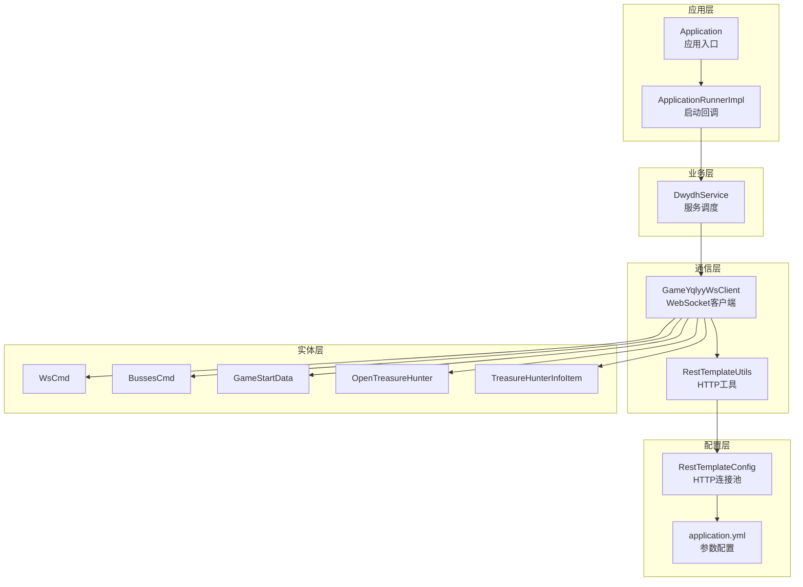
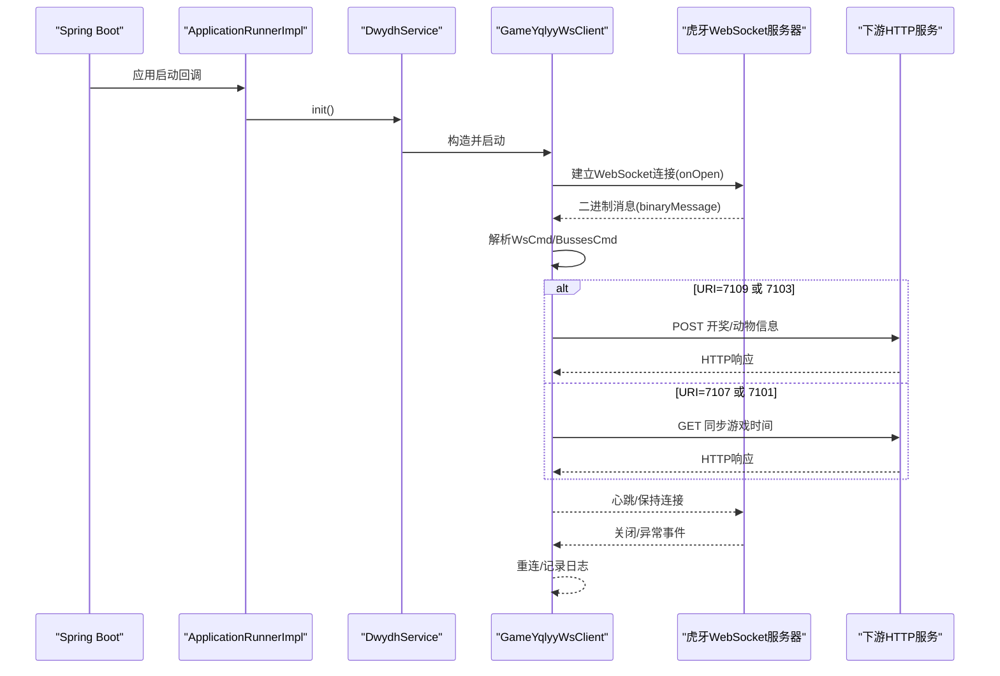
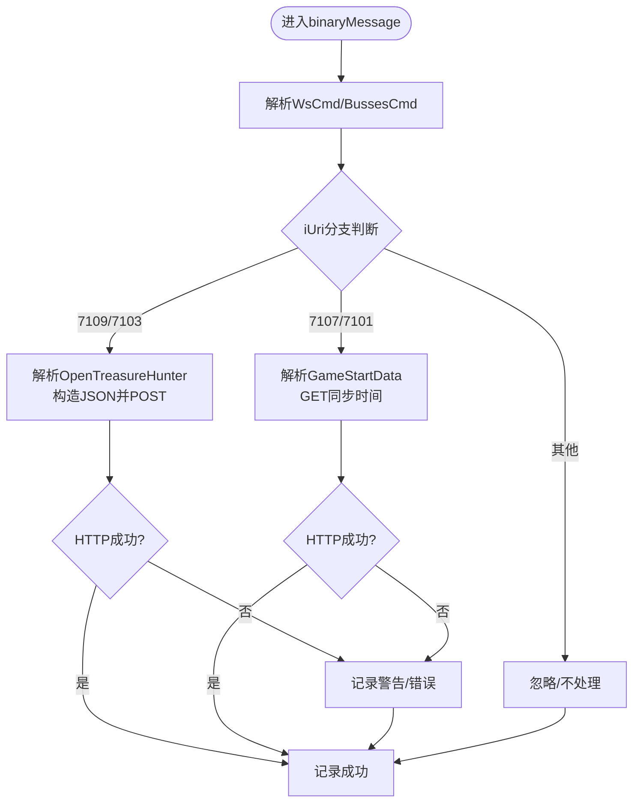
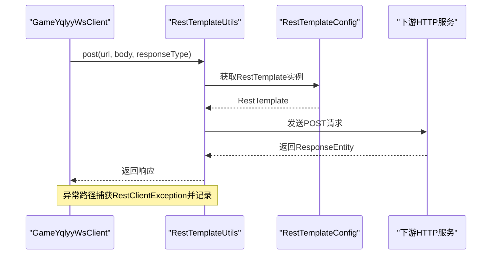
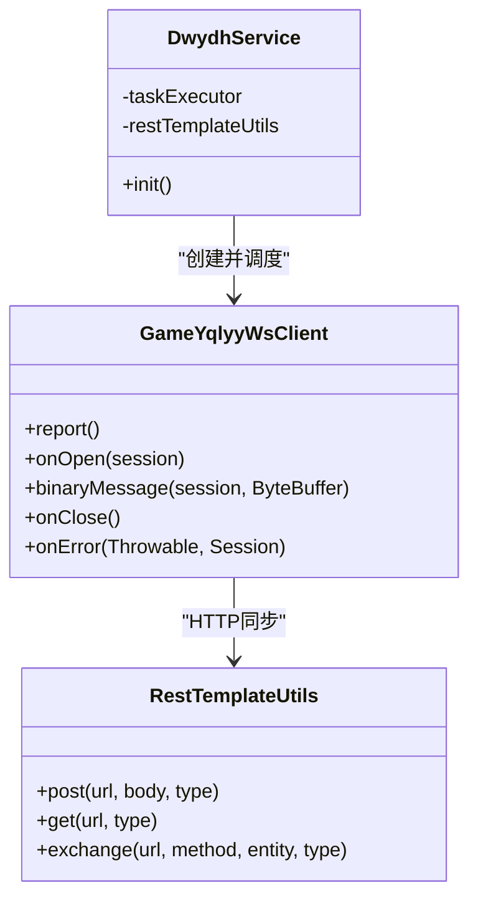
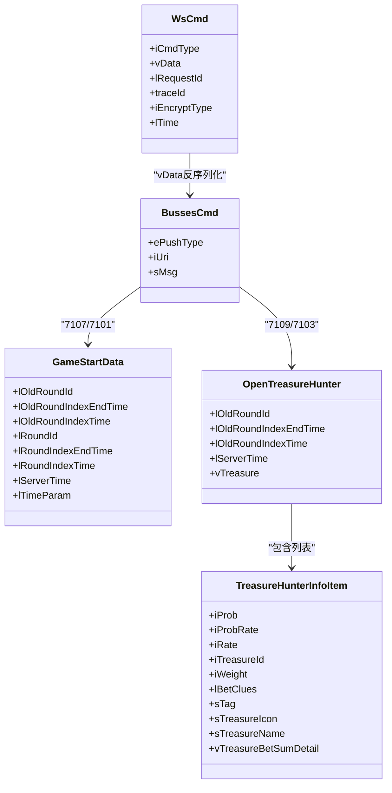
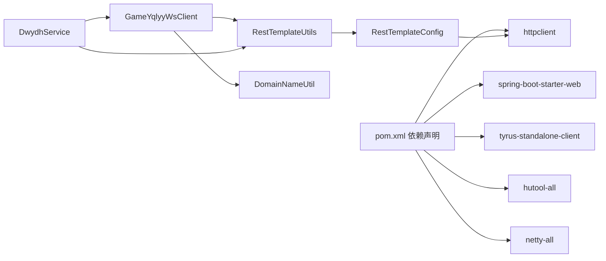

# 集成测试

<cite>
**本文引用的文件**
- [GameYqlyyWsClient.java](file://src/main/java/com/yqlyy/GameYqlyyWsClient.java)
- [DwydhService.java](file://src/main/java/com/dwydh/DwydhService.java)
- [RestTemplateUtils.java](file://src/main/java/com/commom/RestTemplateUtils.java)
- [RestTemplateConfig.java](file://src/main/java/com/commom/RestTemplateConfig.java)
- [DomainNameUtil.java](file://src/main/java/com/utils/DomainNameUtil.java)
- [ApplicationRunnerImpl.java](file://src/main/java/com/listener/ApplicationRunnerImpl.java)
- [Application.java](file://src/main/java/com/Application.java)
- [application.yml](file://src/main/resources/application.yml)
- [OpenTreasureHunter.java](file://src/main/java/com/entity/AccountedNotify/OpenTreasureHunter.java)
- [TreasureHunterInfoItem.java](file://src/main/java/com/entity/AccountedNotify/TreasureHunterInfoItem.java)
- [BussesCmd.java](file://src/main/java/com/entity/BussesCmd.java)
- [GameStartData.java](file://src/main/java/com/entity/GameStartData.java)
- [WsCmd.java](file://src/main/java/com/entity/WsCmd.java)
- [pom.xml](file://pom.xml)
</cite>

## 目录
1. [引言](#引言)
2. [项目结构](#项目结构)
3. [核心组件](#核心组件)
4. [架构总览](#架构总览)
5. [详细组件分析](#详细组件分析)
6. [依赖关系分析](#依赖关系分析)
7. [性能考量](#性能考量)
8. [故障排查指南](#故障排查指南)
9. [结论](#结论)
10. [附录](#附录)

## 引言
本文件面向集成测试场景，围绕WebSocket与HTTP通信两条主线，系统化说明如何验证以下能力：
- WebSocket连接与消息处理的集成测试（重点覆盖GameYqlyyWsClient）
- 如何模拟虎牙游戏服务器的响应以驱动客户端行为
- WebSocket连接的建立、维持与断开流程测试
- HTTP通信集成测试（RestTemplateUtils）与错误处理验证
- DwydhService服务调度功能的测试（多WebSocket客户端协调）
- 测试环境搭建与测试数据准备策略

## 项目结构
项目采用Spring Boot应用结构，核心模块如下：
- 通信层：WebSocket客户端与HTTP客户端封装
- 业务层：服务调度与任务执行
- 实体层：协议解析模型
- 配置层：HTTP连接池与RestTemplate配置
- 启动与监听：应用入口与应用启动回调

图表来源
- [Application.java](file://src/main/java/com/Application.java#L1-L14)
- [ApplicationRunnerImpl.java](file://src/main/java/com/listener/ApplicationRunnerImpl.java#L1-L34)
- [DwydhService.java](file://src/main/java/com/dwydh/DwydhService.java#L1-L39)
- [GameYqlyyWsClient.java](file://src/main/java/com/yqlyy/GameYqlyyWsClient.java#L1-L328)
- [RestTemplateUtils.java](file://src/main/java/com/commom/RestTemplateUtils.java#L1-L31)
- [RestTemplateConfig.java](file://src/main/java/com/commom/RestTemplateConfig.java#L1-L132)
- [application.yml](file://src/main/resources/application.yml#L1-L31)
- [WsCmd.java](file://src/main/java/com/entity/WsCmd.java#L1-L69)
- [BussesCmd.java](file://src/main/java/com/entity/BussesCmd.java#L1-L10)
- [GameStartData.java](file://src/main/java/com/entity/GameStartData.java#L1-L79)
- [OpenTreasureHunter.java](file://src/main/java/com/entity/AccountedNotify/OpenTreasureHunter.java#L1-L83)
- [TreasureHunterInfoItem.java](file://src/main/java/com/entity/AccountedNotify/TreasureHunterInfoItem.java#L1-L124)

章节来源
- [Application.java](file://src/main/java/com/Application.java#L1-L14)
- [application.yml](file://src/main/resources/application.yml#L1-L31)

## 核心组件
- GameYqlyyWsClient：负责WebSocket连接、心跳响应、二进制消息解析、按不同URI分发业务逻辑，并通过RestTemplateUtils向下游服务同步结果。
- DwydhService：使用线程池调度WebSocket客户端的周期性上报与连接维护。
- RestTemplateUtils：封装HTTP GET/POST/Exchange，统一对外提供REST调用能力。
- RestTemplateConfig：基于Apache HttpClient构建连接池、超时与重试策略，供RestTemplate使用。
- 实体模型：WsCmd、BussesCmd、GameStartData、OpenTreasureHunter、TreasureHunterInfoItem用于协议解析与数据承载。

章节来源
- [GameYqlyyWsClient.java](file://src/main/java/com/yqlyy/GameYqlyyWsClient.java#L1-L328)
- [DwydhService.java](file://src/main/java/com/dwydh/DwydhService.java#L1-L39)
- [RestTemplateUtils.java](file://src/main/java/com/commom/RestTemplateUtils.java#L1-L31)
- [RestTemplateConfig.java](file://src/main/java/com/commom/RestTemplateConfig.java#L1-L132)
- [WsCmd.java](file://src/main/java/com/entity/WsCmd.java#L1-L69)
- [BussesCmd.java](file://src/main/java/com/entity/BussesCmd.java#L1-L10)
- [GameStartData.java](file://src/main/java/com/entity/GameStartData.java#L1-L79)
- [OpenTreasureHunter.java](file://src/main/java/com/entity/AccountedNotify/OpenTreasureHunter.java#L1-L83)
- [TreasureHunterInfoItem.java](file://src/main/java/com/entity/AccountedNotify/TreasureHunterInfoItem.java#L1-L124)

## 架构总览
下图展示从应用启动到WebSocket消息处理与HTTP同步的整体流程：

图表来源
- [ApplicationRunnerImpl.java](file://src/main/java/com/listener/ApplicationRunnerImpl.java#L1-L34)
- [DwydhService.java](file://src/main/java/com/dwydh/DwydhService.java#L1-L39)
- [GameYqlyyWsClient.java](file://src/main/java/com/yqlyy/GameYqlyyWsClient.java#L1-L328)
- [RestTemplateUtils.java](file://src/main/java/com/commom/RestTemplateUtils.java#L1-L31)

## 详细组件分析

### WebSocket客户端集成测试策略（GameYqlyyWsClient）
- 连接建立与维护
  - onOpen：发送握手二进制帧；验证连接成功后进入心跳维持。
  - binaryMessage：解析二进制帧为WsCmd/BussesCmd，按iUri分支处理。
  - 心跳与保活：pongMessage用于接收服务器Pong；默认容器配置了最大缓冲与超时。
- 消息处理与HTTP同步
  - URI 7109/7103：解析OpenTreasureHunter，提取动物ID与名称，构造JSON并POST至下游URL（来自DomainNameUtil.urls）。
  - URI 7107/7101：解析GameStartData，读取旧轮次时间戳，GET请求同步时间至中转URL（DomainNameUtil.transitUrls）。
- 断开与异常
  - onClose/onError：记录关闭与异常；report在发送失败时触发重连逻辑。
- AES/CBC辅助方法
  - 提供aesBase64ByCBC用于加密场景（如需模拟特定请求体时可复用）。

图表来源
- [GameYqlyyWsClient.java](file://src/main/java/com/yqlyy/GameYqlyyWsClient.java#L50-L219)
- [OpenTreasureHunter.java](file://src/main/java/com/entity/AccountedNotify/OpenTreasureHunter.java#L1-L83)
- [TreasureHunterInfoItem.java](file://src/main/java/com/entity/AccountedNotify/TreasureHunterInfoItem.java#L1-L124)
- [GameStartData.java](file://src/main/java/com/entity/GameStartData.java#L1-L79)

章节来源
- [GameYqlyyWsClient.java](file://src/main/java/com/yqlyy/GameYqlyyWsClient.java#L46-L290)

### HTTP通信集成测试（RestTemplateUtils）
- 能力范围
  - 支持GET/POST/Exchange三类HTTP操作，返回ResponseEntity以便统一处理状态码与响应体。
- 错误处理
  - 统一捕获RestClientException，便于上层识别网络/超时/连接异常。
- 连接池与超时
  - 基于Apache HttpClient的连接池、超时与重试策略由RestTemplateConfig提供，确保高并发下的稳定性与可控性。

图表来源
- [RestTemplateUtils.java](file://src/main/java/com/commom/RestTemplateUtils.java#L1-L31)
- [RestTemplateConfig.java](file://src/main/java/com/commom/RestTemplateConfig.java#L1-L132)
- [GameYqlyyWsClient.java](file://src/main/java/com/yqlyy/GameYqlyyWsClient.java#L103-L114)

章节来源
- [RestTemplateUtils.java](file://src/main/java/com/commom/RestTemplateUtils.java#L1-L31)
- [RestTemplateConfig.java](file://src/main/java/com/commom/RestTemplateConfig.java#L62-L108)

### 服务调度与多客户端协调（DwydhService）
- 角色定位
  - 使用线程池执行WebSocket客户端的周期性上报与连接维护，避免阻塞主线程。
- 协作关系
  - 通过注入RestTemplateUtils与GameYqlyyWsClient协作，形成“调度-执行”的解耦结构。
- 测试要点
  - 验证init方法正确提交任务到线程池
  - 验证report循环与异常恢复（连接断开自动重连）

图表来源
- [DwydhService.java](file://src/main/java/com/dwydh/DwydhService.java#L1-L39)
- [GameYqlyyWsClient.java](file://src/main/java/com/yqlyy/GameYqlyyWsClient.java#L1-L328)
- [RestTemplateUtils.java](file://src/main/java/com/commom/RestTemplateUtils.java#L1-L31)

章节来源
- [DwydhService.java](file://src/main/java/com/dwydh/DwydhService.java#L21-L36)

### 实体模型与协议解析
- WsCmd：承载WebSocket命令头字段（命令类型、数据体、时间戳等）。
- BussesCmd：承载业务推送的URI与消息体。
- GameStartData：承载游戏开始/结束轮次的时间戳等信息。
- OpenTreasureHunter/TreasureHunterInfoItem：承载开奖动物列表及其属性，用于构造下游同步请求体。

图表来源
- [WsCmd.java](file://src/main/java/com/entity/WsCmd.java#L1-L69)
- [BussesCmd.java](file://src/main/java/com/entity/BussesCmd.java#L1-L10)
- [GameStartData.java](file://src/main/java/com/entity/GameStartData.java#L1-L79)
- [OpenTreasureHunter.java](file://src/main/java/com/entity/AccountedNotify/OpenTreasureHunter.java#L1-L83)
- [TreasureHunterInfoItem.java](file://src/main/java/com/entity/AccountedNotify/TreasureHunterInfoItem.java#L1-L124)

章节来源
- [WsCmd.java](file://src/main/java/com/entity/WsCmd.java#L1-L69)
- [BussesCmd.java](file://src/main/java/com/entity/BussesCmd.java#L1-L10)
- [GameStartData.java](file://src/main/java/com/entity/GameStartData.java#L1-L79)
- [OpenTreasureHunter.java](file://src/main/java/com/entity/AccountedNotify/OpenTreasureHunter.java#L1-L83)
- [TreasureHunterInfoItem.java](file://src/main/java/com/entity/AccountedNotify/TreasureHunterInfoItem.java#L1-L124)

## 依赖关系分析
- 外部依赖
  - Spring Boot Web、WebSocket客户端（Tyrus）、Apache HttpClient、Hutool、Netty等。
- 内部依赖
  - GameYqlyyWsClient依赖RestTemplateUtils与DomainNameUtil；DwydhService依赖GameYqlyyWsClient与RestTemplateUtils；RestTemplateConfig为RestTemplate提供连接池与超时策略。

图表来源
- [pom.xml](file://pom.xml#L26-L111)
- [GameYqlyyWsClient.java](file://src/main/java/com/yqlyy/GameYqlyyWsClient.java#L1-L328)
- [DwydhService.java](file://src/main/java/com/dwydh/DwydhService.java#L1-L39)
- [RestTemplateUtils.java](file://src/main/java/com/commom/RestTemplateUtils.java#L1-L31)
- [RestTemplateConfig.java](file://src/main/java/com/commom/RestTemplateConfig.java#L1-L132)

章节来源
- [pom.xml](file://pom.xml#L26-L111)

## 性能考量
- 连接池与超时
  - application.yml中定义了连接超时、套接字超时、连接池大小与每路由并发上限，建议在集成测试中结合压测场景调整。
- WebSocket缓冲与超时
  - 客户端默认设置了二进制消息缓冲与异步发送超时，建议在长连接稳定性测试中关注onError与onClose触发频率。
- 线程池
  - DwydhService使用线程池执行客户端任务，建议在多实例/多游戏场景下评估线程池容量与队列长度。

章节来源
- [application.yml](file://src/main/resources/application.yml#L16-L31)
- [GameYqlyyWsClient.java](file://src/main/java/com/yqlyy/GameYqlyyWsClient.java#L250-L272)
- [DwydhService.java](file://src/main/java/com/dwydh/DwydhService.java#L21-L36)

## 故障排查指南
- WebSocket连接失败
  - 检查wsUrl有效性与网络可达性；观察onOpen是否触发；确认容器默认缓冲与超时设置。
- 消息解析异常
  - 核对WsCmd/BussesCmd字段索引与TARS流解析顺序；关注URI分支是否覆盖所有场景。
- HTTP同步失败
  - 捕获RestClientException并记录具体URL与状态；检查下游服务端点与鉴权。
- 重连与断开
  - onClose/onError应有明确日志；report在发送失败时会尝试重连，需验证重连间隔与退避策略。

章节来源
- [GameYqlyyWsClient.java](file://src/main/java/com/yqlyy/GameYqlyyWsClient.java#L240-L290)
- [RestTemplateUtils.java](file://src/main/java/com/commom/RestTemplateUtils.java#L19-L29)

## 结论
本项目通过“服务调度 + WebSocket客户端 + HTTP工具”的组合实现了虎牙游戏数据的采集与同步。集成测试应围绕以下目标展开：
- WebSocket连接生命周期与消息分发的端到端验证
- 不同URI的消息解析与HTTP同步的正确性
- HTTP工具的错误处理与连接池稳定性
- 多客户端场景下的调度与资源占用控制

## 附录

### 测试环境搭建
- 启动参数
  - application.yml中定义了HTTP连接池参数与服务端口，建议在测试环境中根据并发需求调整maxTotal、defaultMaxPerRoute与socketTimeout。
- 依赖准备
  - 确保Tyurs WebSocket客户端与Apache HttpClient可用；若需模拟加密请求，可复用GameYqlyyWsClient中的AES/CBC方法。
- 下游服务
  - 准备本地或测试环境的HTTP服务端点，分别用于“开奖/动物信息”与“游戏时间同步”。

章节来源
- [application.yml](file://src/main/resources/application.yml#L16-L31)
- [pom.xml](file://pom.xml#L58-L71)

### 测试数据准备策略
- WebSocket消息
  - 使用GameYqlyyWsClient内部的握手与进入游戏二进制帧作为参考，构造符合TARS格式的二进制消息，覆盖URI=7109/7107/7103/7101等场景。
- HTTP请求体
  - 基于OpenTreasureHunter与TreasureHunterInfoItem生成JSON结构，模拟POST请求体；基于GameStartData生成GET查询参数。
- 域名与中转URL
  - 在DomainNameUtil中配置urls与transitUrls，确保HTTP同步目标可达；测试时可指向本地或Mock服务。

章节来源
- [GameYqlyyWsClient.java](file://src/main/java/com/yqlyy/GameYqlyyWsClient.java#L224-L290)
- [OpenTreasureHunter.java](file://src/main/java/com/entity/AccountedNotify/OpenTreasureHunter.java#L1-L83)
- [TreasureHunterInfoItem.java](file://src/main/java/com/entity/AccountedNotify/TreasureHunterInfoItem.java#L1-L124)
- [GameStartData.java](file://src/main/java/com/entity/GameStartData.java#L1-L79)
- [DomainNameUtil.java](file://src/main/java/com/utils/DomainNameUtil.java#L1-L16)