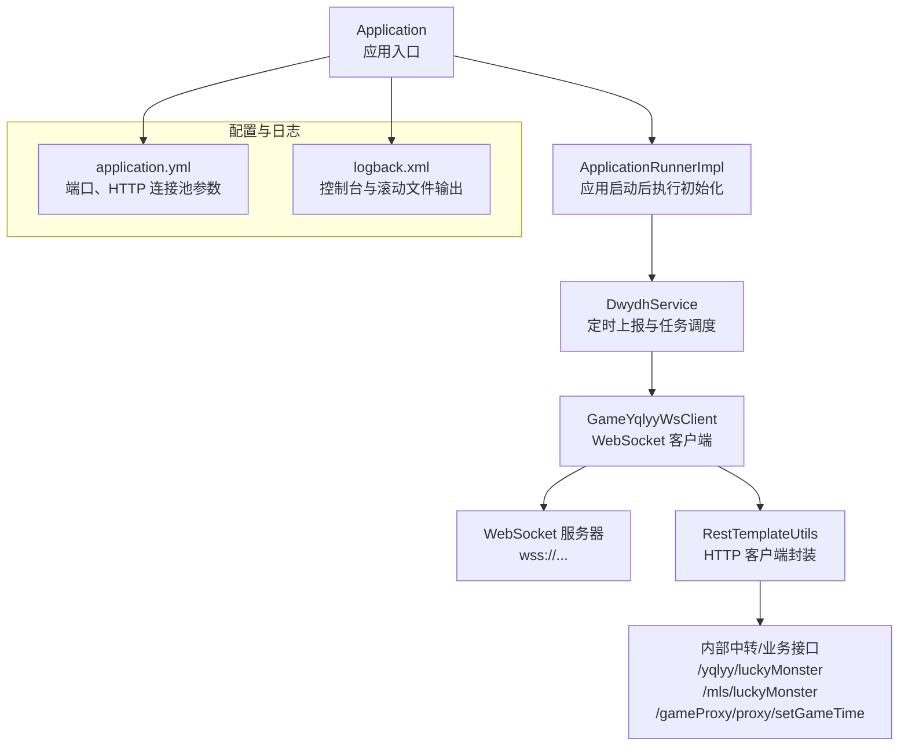
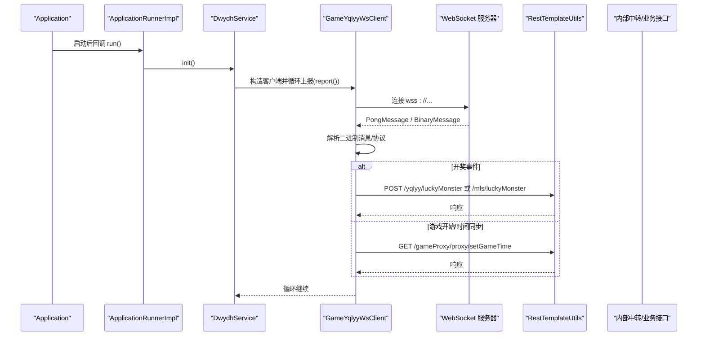
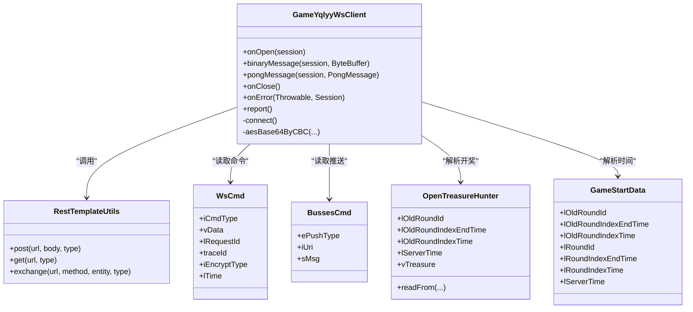
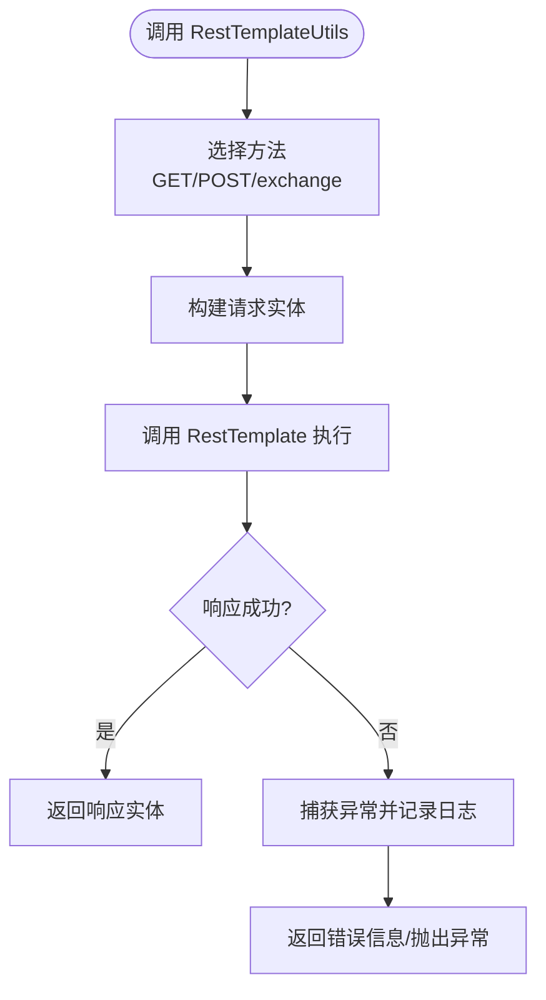
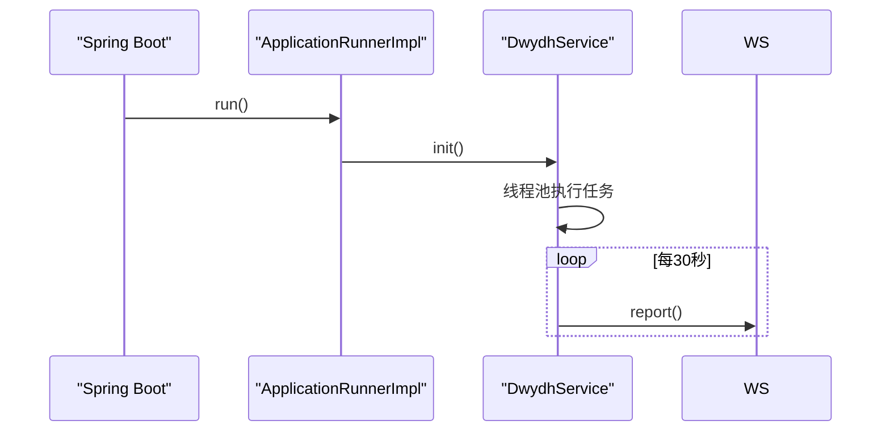
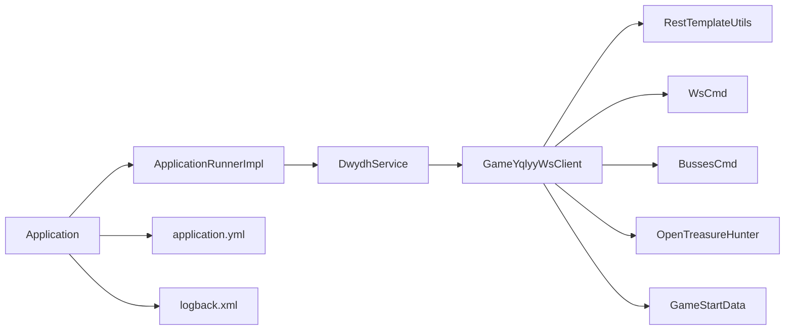

# 调试工具与技巧

<cite>
**本文引用的文件**
- [Application.java](file://src/main/java/com/Application.java)
- [ApplicationRunnerImpl.java](file://src/main/java/com/listener/ApplicationRunnerImpl.java)
- [DwydhService.java](file://src/main/java/com/dwydh/DwydhService.java)
- [GameYqlyyWsClient.java](file://src/main/java/com/yqlyy/GameYqlyyWsClient.java)
- [RestTemplateConfig.java](file://src/main/java/com/commom/RestTemplateConfig.java)
- [RestTemplateUtils.java](file://src/main/java/com/commom/RestTemplateUtils.java)
- [DomainNameUtil.java](file://src/main/java/com/utils/DomainNameUtil.java)
- [WsCmd.java](file://src/main/java/com/entity/WsCmd.java)
- [BussesCmd.java](file://src/main/java/com/entity/BussesCmd.java)
- [OpenTreasureHunter.java](file://src/main/java/com/entity/AccountedNotify/OpenTreasureHunter.java)
- [GameStartData.java](file://src/main/java/com/entity/GameStartData.java)
- [application.yml](file://src/main/resources/application.yml)
- [logback.xml](file://src/main/resources/logback.xml)
- [pom.xml](file://pom.xml)
</cite>

## 目录
1. [简介](#简介)
2. [项目结构](#项目结构)
3. [核心组件](#核心组件)
4. [架构总览](#架构总览)
5. [详细组件分析](#详细组件分析)
6. [依赖关系分析](#依赖关系分析)
7. [性能考虑](#性能考虑)
8. [故障排查指南](#故障排查指南)
9. [结论](#结论)
10. [附录](#附录)

## 简介
本指南面向开发者与运维人员，围绕该代码库的实际实现，系统讲解调试工具与技巧，包括：
- IDE 调试器的断点设置、变量监视与调用栈分析
- 日志系统（Logback）的配置与使用，含日志级别与输出格式
- 网络抓包工具在 WebSocket 通信中的应用
- 性能分析（内存与 CPU）方法与建议
- 远程调试配置与实施
- 常见问题的诊断思路与解决技巧
- 生产环境调试策略与安全注意事项

## 项目结构
该项目为基于 Spring Boot 的 Java 工程，主要职责是通过 WebSocket 接收游戏推送数据，并将关键事件（如开奖、游戏开始等）转发至内部中转服务或业务系统。

图表来源
- [Application.java](file://src/main/java/com/Application.java#L1-L14)
- [ApplicationRunnerImpl.java](file://src/main/java/com/listener/ApplicationRunnerImpl.java#L1-L34)
- [DwydhService.java](file://src/main/java/com/dwydh/DwydhService.java#L1-L39)
- [GameYqlyyWsClient.java](file://src/main/java/com/yqlyy/GameYqlyyWsClient.java#L1-L328)
- [RestTemplateUtils.java](file://src/main/java/com/commom/RestTemplateUtils.java#L1-L31)
- [application.yml](file://src/main/resources/application.yml#L1-L31)
- [logback.xml](file://src/main/resources/logback.xml#L1-L75)

章节来源
- [Application.java](file://src/main/java/com/Application.java#L1-L14)
- [application.yml](file://src/main/resources/application.yml#L1-L31)
- [logback.xml](file://src/main/resources/logback.xml#L1-L75)

## 核心组件
- 应用入口与启动流程
  - 应用入口负责启动 Spring Boot 应用上下文；启动完成后由 ApplicationRunnerImpl 执行初始化逻辑。
- WebSocket 客户端
  - GameYqlyyWsClient 负责连接 WebSocket 服务器、处理二进制消息、解析协议、触发业务事件（如开奖、游戏开始），并通过 RestTemplate 将结果上报。
- HTTP 客户端封装
  - RestTemplateUtils 对 RestTemplate 进行轻量封装，统一 GET/POST/exchange 方法，便于在业务中调用。
- 连接池与超时配置
  - RestTemplateConfig 基于 Apache HttpClient 实现连接池、超时与 Keep-Alive 策略，application.yml 中提供对应参数。
- 日志系统
  - logback.xml 配置控制台输出与按日期滚动的文件输出，分别过滤 INFO 与 ERROR 级别，根日志级别为 info。

章节来源
- [Application.java](file://src/main/java/com/Application.java#L1-L14)
- [ApplicationRunnerImpl.java](file://src/main/java/com/listener/ApplicationRunnerImpl.java#L1-L34)
- [DwydhService.java](file://src/main/java/com/dwydh/DwydhService.java#L1-L39)
- [GameYqlyyWsClient.java](file://src/main/java/com/yqlyy/GameYqlyyWsClient.java#L1-L328)
- [RestTemplateUtils.java](file://src/main/java/com/commom/RestTemplateUtils.java#L1-L31)
- [RestTemplateConfig.java](file://src/main/java/com/commom/RestTemplateConfig.java#L1-L132)
- [application.yml](file://src/main/resources/application.yml#L1-L31)
- [logback.xml](file://src/main/resources/logback.xml#L1-L75)

## 架构总览
下图展示从应用启动到 WebSocket 消息处理与 HTTP 上报的整体流程：

图表来源
- [ApplicationRunnerImpl.java](file://src/main/java/com/listener/ApplicationRunnerImpl.java#L25-L31)
- [DwydhService.java](file://src/main/java/com/dwydh/DwydhService.java#L21-L36)
- [GameYqlyyWsClient.java](file://src/main/java/com/yqlyy/GameYqlyyWsClient.java#L46-L219)
- [RestTemplateUtils.java](file://src/main/java/com/commom/RestTemplateUtils.java#L19-L29)

## 详细组件分析

### 组件一：WebSocket 客户端（GameYqlyyWsClient）
- 功能要点
  - 连接 WebSocket 服务器，发送鉴权/进入房间等二进制帧
  - 处理 PongMessage 与二进制消息，解析 TARS 协议，识别不同 iUri 的推送事件
  - 根据事件类型将开奖信息或时间信息通过 RestTemplate 上报给内部中转或业务接口
- 关键调试点
  - 断点位置建议：@OnOpen、@OnMessage（binaryMessage）、@OnClose、@OnError
  - 变量监视：ByteBuffer、TarsInputStream、WsCmd/BussesCmd、解析后的 GameStartData/OpenTreasureHunter
  - 调用栈分析：关注 binaryMessage -> TARS 解析 -> 条件分支 -> RestTemplateUtils 调用链
- 日志定位
  - INFO 级别用于常规事件（如连接、Pong、上报成功）
  - WARN/ERROR 用于异常与错误（如上报 RestClientException、异常）

图表来源
- [GameYqlyyWsClient.java](file://src/main/java/com/yqlyy/GameYqlyyWsClient.java#L29-L328)
- [RestTemplateUtils.java](file://src/main/java/com/commom/RestTemplateUtils.java#L1-L31)
- [WsCmd.java](file://src/main/java/com/entity/WsCmd.java#L1-L69)
- [BussesCmd.java](file://src/main/java/com/entity/BussesCmd.java#L1-L10)
- [OpenTreasureHunter.java](file://src/main/java/com/entity/AccountedNotify/OpenTreasureHunter.java#L1-L83)
- [GameStartData.java](file://src/main/java/com/entity/GameStartData.java#L1-L79)

章节来源
- [GameYqlyyWsClient.java](file://src/main/java/com/yqlyy/GameYqlyyWsClient.java#L1-L328)
- [WsCmd.java](file://src/main/java/com/entity/WsCmd.java#L1-L69)
- [BussesCmd.java](file://src/main/java/com/entity/BussesCmd.java#L1-L10)
- [OpenTreasureHunter.java](file://src/main/java/com/entity/AccountedNotify/OpenTreasureHunter.java#L1-L83)
- [GameStartData.java](file://src/main/java/com/entity/GameStartData.java#L1-L79)

### 组件二：HTTP 客户端封装（RestTemplateUtils）
- 功能要点
  - 统一封装 GET/POST/exchange，屏蔽 RestTemplate 细节
  - 与 RestTemplateConfig 配合，使用 Apache HttpClient 连接池与超时策略
- 调试建议
  - 在 post/get/exchange 方法处设置断点，观察 URL、请求体、响应状态码与异常
  - 结合 application.yml 中的超时参数，验证连接池配置是否生效

图表来源
- [RestTemplateUtils.java](file://src/main/java/com/commom/RestTemplateUtils.java#L19-L29)
- [RestTemplateConfig.java](file://src/main/java/com/commom/RestTemplateConfig.java#L62-L108)
- [application.yml](file://src/main/resources/application.yml#L16-L31)

章节来源
- [RestTemplateUtils.java](file://src/main/java/com/commom/RestTemplateUtils.java#L1-L31)
- [RestTemplateConfig.java](file://src/main/java/com/commom/RestTemplateConfig.java#L1-L132)
- [application.yml](file://src/main/resources/application.yml#L1-L31)

### 组件三：应用启动与任务调度（ApplicationRunnerImpl、DwydhService）
- 功能要点
  - ApplicationRunnerImpl 在应用启动后执行初始化，启动 DwydhService
  - DwydhService 使用线程池执行 WebSocket 客户端的周期性上报任务
- 调试建议
  - 在 ApplicationRunnerImpl.run 与 DwydhService.init 内设置断点，确认线程池与任务是否按时执行
  - 观察线程池大小与任务队列状态，避免阻塞或资源耗尽

图表来源
- [ApplicationRunnerImpl.java](file://src/main/java/com/listener/ApplicationRunnerImpl.java#L25-L31)
- [DwydhService.java](file://src/main/java/com/dwydh/DwydhService.java#L21-L36)

章节来源
- [ApplicationRunnerImpl.java](file://src/main/java/com/listener/ApplicationRunnerImpl.java#L1-L34)
- [DwydhService.java](file://src/main/java/com/dwydh/DwydhService.java#L1-L39)

### 组件四：日志系统（Logback）
- 配置要点
  - 控制台输出与滚动文件输出分离，INFO 与 ERROR 分别落盘
  - 根日志级别为 info，过滤器仅保留对应级别
  - 输出格式包含时间、线程、级别、Logger 名称、方法与行号、消息
- 调试建议
  - 在关键路径（如 WebSocket 事件分支、HTTP 上报）添加 INFO/WARN/ERROR 日志
  - 通过调整根日志级别或临时提升特定包级别（如 com.yqlyy）快速定位问题

章节来源
- [logback.xml](file://src/main/resources/logback.xml#L1-L75)

### 组件五：网络抓包与 WebSocket 调试
- 抓包工具建议
  - Wireshark/Fiddler/Charles：捕获 WebSocket 握手与数据帧，查看二进制负载
  - 浏览器开发者工具：若存在前端页面，可直接查看 Network 面板中的 WebSocket 通信
- 调试步骤
  - 启动应用，观察 @OnOpen 是否触发
  - 在 binaryMessage 中断点，抓取并比对二进制帧内容与解析后的字段
  - 对照 iUri 与业务分支，核对上报 URL 与请求体

章节来源
- [GameYqlyyWsClient.java](file://src/main/java/com/yqlyy/GameYqlyyWsClient.java#L46-L219)

## 依赖关系分析
- 外部依赖
  - Spring Boot Web、Apache HttpClient、Netty、TARS 协议、SLF4J/Logback
- 内部模块耦合
  - ApplicationRunnerImpl 依赖 DwydhService
  - DwydhService 依赖 GameYqlyyWsClient 与 RestTemplateUtils
  - GameYqlyyWsClient 依赖 RestTemplateUtils 与实体模型（WsCmd/BussesCmd/OpenTreasureHunter/GameStartData）

图表来源
- [Application.java](file://src/main/java/com/Application.java#L1-L14)
- [ApplicationRunnerImpl.java](file://src/main/java/com/listener/ApplicationRunnerImpl.java#L1-L34)
- [DwydhService.java](file://src/main/java/com/dwydh/DwydhService.java#L1-L39)
- [GameYqlyyWsClient.java](file://src/main/java/com/yqlyy/GameYqlyyWsClient.java#L1-L328)
- [RestTemplateUtils.java](file://src/main/java/com/commom/RestTemplateUtils.java#L1-L31)
- [WsCmd.java](file://src/main/java/com/entity/WsCmd.java#L1-L69)
- [BussesCmd.java](file://src/main/java/com/entity/BussesCmd.java#L1-L10)
- [OpenTreasureHunter.java](file://src/main/java/com/entity/AccountedNotify/OpenTreasureHunter.java#L1-L83)
- [GameStartData.java](file://src/main/java/com/entity/GameStartData.java#L1-L79)
- [application.yml](file://src/main/resources/application.yml#L1-L31)
- [logback.xml](file://src/main/resources/logback.xml#L1-L75)

章节来源
- [pom.xml](file://pom.xml#L1-L160)

## 性能考虑
- 连接池与超时
  - application.yml 提供连接池最大连接数、每路由并发、连接超时、请求超时、Socket 超时等参数
  - RestTemplateConfig 基于 Apache HttpClient 实现连接池与 Keep-Alive 策略
- WebSocket 缓冲区与超时
  - GameYqlyyWsClient 设置了默认消息缓冲区大小与会话空闲超时、异步发送超时
- 建议
  - 在高并发场景下，适当增大 maxTotal 与 defaultMaxPerRoute，并结合 JVM 堆外内存评估
  - 对二进制解析与 JSON 序列化进行性能压测，必要时引入对象池或更高效的序列化方案

章节来源
- [application.yml](file://src/main/resources/application.yml#L16-L31)
- [RestTemplateConfig.java](file://src/main/java/com/commom/RestTemplateConfig.java#L116-L129)
- [GameYqlyyWsClient.java](file://src/main/java/com/yqlyy/GameYqlyyWsClient.java#L250-L272)

## 故障排查指南
- WebSocket 连接失败
  - 检查 @OnError 与 @OnClose 回调日志，确认异常堆栈
  - 核对 wsUrl 与网络连通性，必要时启用抓包工具对比握手与帧
- 二进制消息解析异常
  - 在 binaryMessage 中断点，检查 TARS 输入流与字段索引是否与协议一致
  - 对照 iUri 分支，确认解析顺序与数据长度
- HTTP 上报失败
  - 在 RestTemplateUtils 的 GET/POST/exchange 处断点，观察 URL、请求体、响应状态与异常
  - 查看日志中的 WARN/ERROR 记录，定位 RestClientException 或其他异常
- 日志级别与输出
  - 若未看到预期日志，检查 logback.xml 的根级别与过滤器配置
  - 临时提升 com.yqlyy 或业务包级别以快速定位

章节来源
- [GameYqlyyWsClient.java](file://src/main/java/com/yqlyy/GameYqlyyWsClient.java#L240-L248)
- [RestTemplateUtils.java](file://src/main/java/com/commom/RestTemplateUtils.java#L19-L29)
- [logback.xml](file://src/main/resources/logback.xml#L60-L75)

## 结论
本指南基于实际代码实现了“从启动到 WebSocket 事件处理再到 HTTP 上报”的完整调试路径，并提供了日志、抓包、性能与远程调试的实操建议。建议在开发与预生产阶段充分运用断点与日志，在生产环境谨慎调整日志级别与抓包策略，确保安全与稳定性。

## 附录

### A. IDE 调试器使用清单
- 断点设置
  - ApplicationRunnerImpl.run、DwydhService.init、GameYqlyyWsClient.onOpen/binaryMessage/report
- 变量监视
  - WebSocket：ByteBuffer、TarsInputStream、WsCmd/BussesCmd、GameStartData/OpenTreasureHunter
  - HTTP：URL、请求体、响应状态与异常
- 调用栈分析
  - 重点跟踪 binaryMessage -> 协议解析 -> 分支处理 -> RestTemplateUtils 调用链

### B. 日志系统配置速查
- 控制台与文件输出分离，INFO/ERROR 分别落盘
- 输出格式包含时间、线程、级别、Logger 名称、方法与行号、消息
- 根日志级别为 info，可通过 logback.xml 调整

章节来源
- [logback.xml](file://src/main/resources/logback.xml#L1-L75)

### C. 远程调试配置（概念性指导）
- 启动参数
  - 添加 JVM 参数以启用远程调试（端口、IP 绑定等）
- IDE 配置
  - 新建 Remote JVM Debug 配置，连接目标主机与端口
- 注意事项
  - 仅在受控环境开启，避免暴露调试端口
  - 生产环境建议通过日志与指标系统进行观测，而非直接远程调试

### D. 生产环境调试策略与安全
- 策略
  - 优先使用日志与指标（CPU、内存、GC、网络延迟）进行观测
  - 限制日志级别，避免敏感信息泄露
  - 使用抓包工具时注意数据脱敏与合规
- 安全
  - 不在生产环境开启远程调试
  - 对外部接口调用进行白名单与限流
  - 对 WebSocket 地址与鉴权信息进行妥善管理