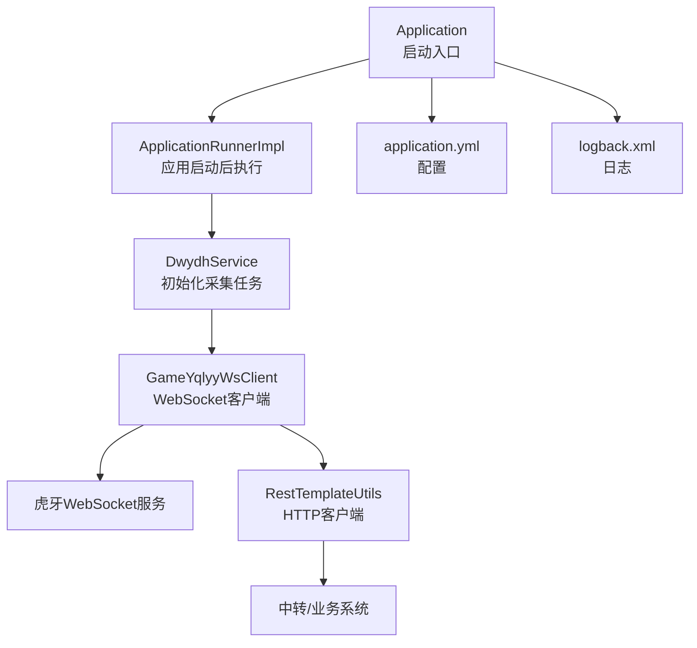
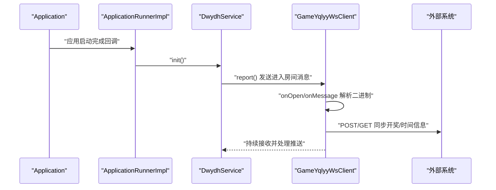
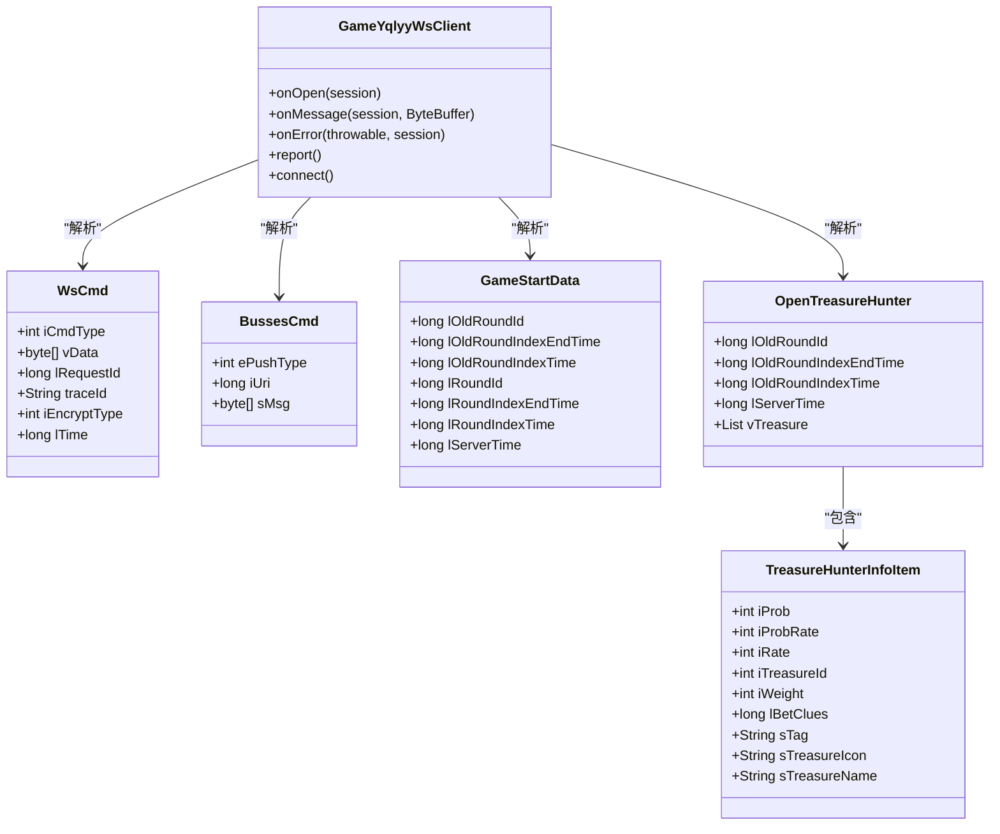
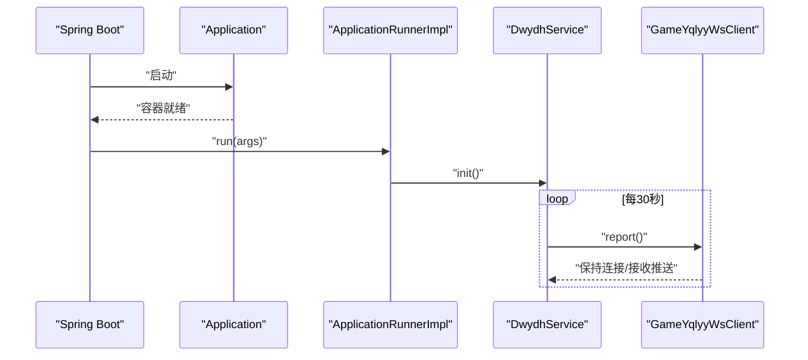
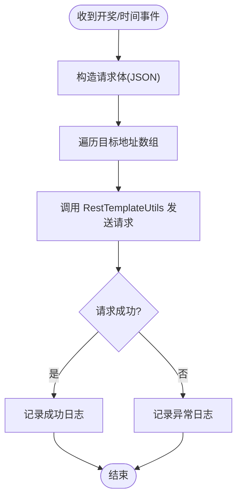
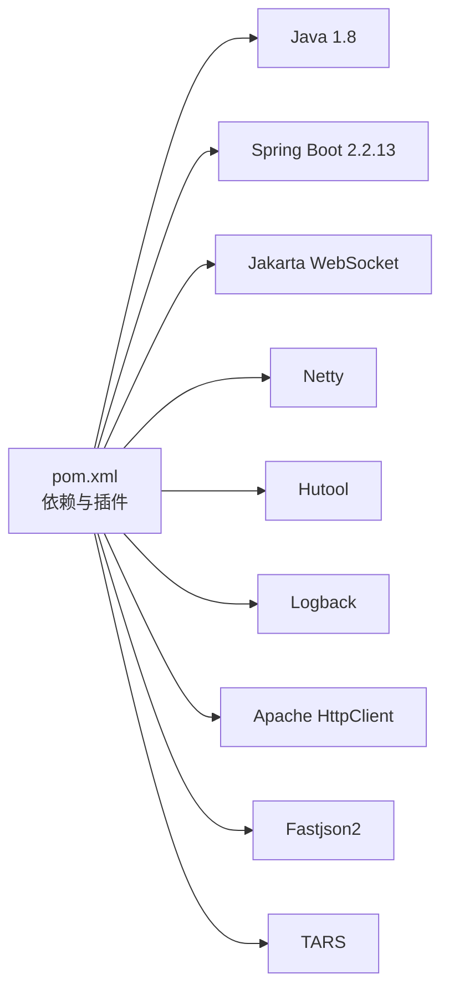

# 快速开始

<cite>
**本文引用的文件**
- [pom.xml](file://pom.xml)
- [application.yml](file://src/main/resources/application.yml)
- [logback.xml](file://src/main/resources/logback.xml)
- [Application.java](file://src/main/java/com/Application.java)
- [ApplicationRunnerImpl.java](file://src/main/java/com/listener/ApplicationRunnerImpl.java)
- [DwydhService.java](file://src/main/java/com/dwydh/DwydhService.java)
- [GameYqlyyWsClient.java](file://src/main/java/com/yqlyy/GameYqlyyWsClient.java)
- [RestTemplateUtils.java](file://src/main/java/com/commom/RestTemplateUtils.java)
- [DomainNameUtil.java](file://src/main/java/com/utils/DomainNameUtil.java)
- [BussesCmd.java](file://src/main/java/com/entity/BussesCmd.java)
- [WsCmd.java](file://src/main/java/com/entity/WsCmd.java)
- [GameStartData.java](file://src/main/java/com/entity/GameStartData.java)
- [OpenTreasureHunter.java](file://src/main/java/com/entity/AccountedNotify/OpenTreasureHunter.java)
- [TreasureHunterInfoItem.java](file://src/main/java/com/entity/AccountedNotify/TreasureHunterInfoItem.java)
</cite>

## 目录
1. [简介](#简介)
2. [项目结构](#项目结构)
3. [核心组件](#核心组件)
4. [架构总览](#架构总览)
5. [详细组件分析](#详细组件分析)
6. [依赖关系分析](#依赖关系分析)
7. [性能与并发](#性能与并发)
8. [故障排查指南](#故障排查指南)
9. [结论](#结论)
10. [附录](#附录)

## 简介
本指南面向新加入的开发者，帮助你在最短时间内完成环境准备、编译构建、应用启动与基础使用，掌握虎牙游戏数据采集系统的核心工作流程。系统通过 WebSocket 接收虎牙游戏推送的开奖与游戏时间等事件，解析后将结果同步至中转服务与业务系统。

## 项目结构
- 核心入口为 Spring Boot 启动类，负责加载配置与启动应用生命周期钩子。
- 应用启动后由 ApplicationRunnerImpl 在应用启动完成后初始化采集任务。
- DwydhService 负责调度 WebSocket 客户端，周期性上报并维持连接。
- GameYqlyyWsClient 通过 WebSocket 接收二进制消息，解析 TARS 协议，识别不同游戏事件并进行后续处理。
- RestTemplateUtils 封装 HTTP 请求，用于将采集结果同步到中转或业务系统。
- 配置文件 application.yml 定义了服务端口、HTTP 连接池参数以及 Profile 激活方式。
- 日志通过 logback.xml 输出到控制台与滚动文件。

图表来源
- [Application.java](file://src/main/java/com/Application.java#L1-L14)
- [ApplicationRunnerImpl.java](file://src/main/java/com/listener/ApplicationRunnerImpl.java#L1-L34)
- [DwydhService.java](file://src/main/java/com/dwydh/DwydhService.java#L1-L39)
- [GameYqlyyWsClient.java](file://src/main/java/com/yqlyy/GameYqlyyWsClient.java#L1-L328)
- [RestTemplateUtils.java](file://src/main/java/com/commom/RestTemplateUtils.java#L1-L31)
- [application.yml](file://src/main/resources/application.yml#L1-L31)
- [logback.xml](file://src/main/resources/logback.xml#L1-L75)

章节来源
- [Application.java](file://src/main/java/com/Application.java#L1-L14)
- [ApplicationRunnerImpl.java](file://src/main/java/com/listener/ApplicationRunnerImpl.java#L1-L34)
- [application.yml](file://src/main/resources/application.yml#L1-L31)
- [logback.xml](file://src/main/resources/logback.xml#L1-L75)

## 核心组件
- 启动入口与生命周期
  - Application：Spring Boot 启动类，调用 run 方法启动应用。
  - ApplicationRunnerImpl：实现 ApplicationRunner，在应用启动完成后执行初始化逻辑，调用 DwydhService.init()。
- 数据采集与调度
  - DwydhService：注入线程池与 RestTemplateUtils，启动一个定时任务，周期性调用 WebSocket 客户端上报并维持连接。
  - GameYqlyyWsClient：基于 Jakarta WebSocket API 的客户端，负责连接虎牙 WebSocket、发送进入房间消息、接收二进制消息并解析。
- HTTP 同步
  - RestTemplateUtils：封装 GET/POST/exchange，统一对外部系统的请求方式。
- 配置与日志
  - application.yml：定义服务端口、上下文路径、HTTP 连接池参数、Profile 激活占位符。
  - logback.xml：控制台输出与按日滚动的 info/error 文件输出，设置根日志级别与模块日志级别。

章节来源
- [Application.java](file://src/main/java/com/Application.java#L1-L14)
- [ApplicationRunnerImpl.java](file://src/main/java/com/listener/ApplicationRunnerImpl.java#L1-L34)
- [DwydhService.java](file://src/main/java/com/dwydh/DwydhService.java#L1-L39)
- [GameYqlyyWsClient.java](file://src/main/java/com/yqlyy/GameYqlyyWsClient.java#L1-L328)
- [RestTemplateUtils.java](file://src/main/java/com/commom/RestTemplateUtils.java#L1-L31)
- [application.yml](file://src/main/resources/application.yml#L1-L31)
- [logback.xml](file://src/main/resources/logback.xml#L1-L75)

## 架构总览
系统采用“启动即采集”的设计：应用启动后立即建立 WebSocket 连接，周期性上报并监听二进制推送；根据推送的 iUri 类型区分不同游戏事件，解析后将结果通过 HTTP 同步到中转或业务系统。

图表来源
- [Application.java](file://src/main/java/com/Application.java#L1-L14)
- [ApplicationRunnerImpl.java](file://src/main/java/com/listener/ApplicationRunnerImpl.java#L1-L34)
- [DwydhService.java](file://src/main/java/com/dwydh/DwydhService.java#L1-L39)
- [GameYqlyyWsClient.java](file://src/main/java/com/yqlyy/GameYqlyyWsClient.java#L1-L328)
- [RestTemplateUtils.java](file://src/main/java/com/commom/RestTemplateUtils.java#L1-L31)

## 详细组件分析

### 组件一：WebSocket 客户端与消息解析
- 功能要点
  - 连接与心跳：在 onOpen 中发送进入房间的二进制消息；收到 PongMessage 时记录日志。
  - 二进制消息解析：使用 TARS 流解析 WsCmd/BussesCmd，依据 iUri 判断不同游戏事件。
  - 事件处理：
    - iUri=7109：解析 OpenTreasureHunter，提取动物 ID 与名称，组装 JSON 并 POST 到中转/业务系统。
    - iUri=7107：解析 GameStartData，获取旧轮次时间戳，GET 同步到中转系统。
    - iUri=7103：解析宠物马拉松开局动物，POST 到对应接口。
    - iUri=7101：解析宠物马拉松时间同步请求，GET 同步到中转系统。
  - 错误处理：onError 记录异常；连接断开时自动重连。
- 关键数据模型
  - WsCmd：封装命令类型与数据体。
  - BussesCmd：封装推送 URI 与消息体。
  - GameStartData：封装轮次时间相关字段。
  - OpenTreasureHunter/TreasureHunterInfoItem：封装开奖动物列表及明细。

图表来源
- [GameYqlyyWsClient.java](file://src/main/java/com/yqlyy/GameYqlyyWsClient.java#L1-L328)
- [WsCmd.java](file://src/main/java/com/entity/WsCmd.java#L1-L69)
- [BussesCmd.java](file://src/main/java/com/entity/BussesCmd.java#L1-L10)
- [GameStartData.java](file://src/main/java/com/entity/GameStartData.java#L1-L79)
- [OpenTreasureHunter.java](file://src/main/java/com/entity/AccountedNotify/OpenTreasureHunter.java#L1-L83)
- [TreasureHunterInfoItem.java](file://src/main/java/com/entity/AccountedNotify/TreasureHunterInfoItem.java#L1-L124)

章节来源
- [GameYqlyyWsClient.java](file://src/main/java/com/yqlyy/GameYqlyyWsClient.java#L1-L328)
- [WsCmd.java](file://src/main/java/com/entity/WsCmd.java#L1-L69)
- [BussesCmd.java](file://src/main/java/com/entity/BussesCmd.java#L1-L10)
- [GameStartData.java](file://src/main/java/com/entity/GameStartData.java#L1-L79)
- [OpenTreasureHunter.java](file://src/main/java/com/entity/AccountedNotify/OpenTreasureHunter.java#L1-L83)
- [TreasureHunterInfoItem.java](file://src/main/java/com/entity/AccountedNotify/TreasureHunterInfoItem.java#L1-L124)

### 组件二：应用启动与采集调度
- Application：标准 Spring Boot 启动入口。
- ApplicationRunnerImpl：在应用启动完成后执行初始化，调用 DwydhService.init()。
- DwydhService：使用线程池执行循环任务，周期性调用 WebSocket 客户端的 report() 并维持连接。

图表来源
- [Application.java](file://src/main/java/com/Application.java#L1-L14)
- [ApplicationRunnerImpl.java](file://src/main/java/com/listener/ApplicationRunnerImpl.java#L1-L34)
- [DwydhService.java](file://src/main/java/com/dwydh/DwydhService.java#L1-L39)
- [GameYqlyyWsClient.java](file://src/main/java/com/yqlyy/GameYqlyyWsClient.java#L1-L328)

章节来源
- [Application.java](file://src/main/java/com/Application.java#L1-L14)
- [ApplicationRunnerImpl.java](file://src/main/java/com/listener/ApplicationRunnerImpl.java#L1-L34)
- [DwydhService.java](file://src/main/java/com/dwydh/DwydhService.java#L1-L39)

### 组件三：HTTP 同步与域名配置
- RestTemplateUtils：封装 GET/POST/exchange，统一外部系统交互。
- DomainNameUtil：定义目标系统地址数组与中转地址数组，WebSocket 处理逻辑会遍历这些地址进行同步。

图表来源
- [RestTemplateUtils.java](file://src/main/java/com/commom/RestTemplateUtils.java#L1-L31)
- [DomainNameUtil.java](file://src/main/java/com/utils/DomainNameUtil.java#L1-L16)
- [GameYqlyyWsClient.java](file://src/main/java/com/yqlyy/GameYqlyyWsClient.java#L1-L328)

章节来源
- [RestTemplateUtils.java](file://src/main/java/com/commom/RestTemplateUtils.java#L1-L31)
- [DomainNameUtil.java](file://src/main/java/com/utils/DomainNameUtil.java#L1-L16)
- [GameYqlyyWsClient.java](file://src/main/java/com/yqlyy/GameYqlyyWsClient.java#L1-L328)

## 依赖关系分析
- 构建与运行
  - Java 版本：1.8
  - Spring Boot 版本：2.2.13.RELEASE
  - 依赖包括 Web、WebSocket、Netty、Hutool、SLF4J、Logback、Apache HttpClient、Fastjson2、TARS 等。
- Maven 插件
  - 编译插件指定源/目标版本为 1.8，资源过滤启用，Spring Boot Maven 插件用于打包可执行 JAR。

图表来源
- [pom.xml](file://pom.xml#L1-L160)

章节来源
- [pom.xml](file://pom.xml#L1-L160)

## 性能与并发
- 线程模型
  - DwydhService 使用线程池执行 WebSocket 客户端任务，避免阻塞主线程。
  - WebSocket 客户端默认最大消息缓冲区与异步发送超时已配置，有助于提升吞吐与稳定性。
- HTTP 连接池
  - application.yml 中配置了最大连接数、每路由并发、连接超时、套接字超时等参数，建议结合实际网络环境调整。
- 日志输出
  - 控制台与滚动文件双通道输出，INFO/ERROR 分离，便于生产环境定位问题。

章节来源
- [DwydhService.java](file://src/main/java/com/dwydh/DwydhService.java#L1-L39)
- [GameYqlyyWsClient.java](file://src/main/java/com/yqlyy/GameYqlyyWsClient.java#L1-L328)
- [application.yml](file://src/main/resources/application.yml#L1-L31)
- [logback.xml](file://src/main/resources/logback.xml#L1-L75)

## 故障排查指南
- 环境与构建
  - JDK 8：确认 JAVA_HOME 与 PATH 指向 JDK 8，使用 mvn -v 验证 Maven 版本兼容。
  - Maven：确保本地仓库可用，必要时清理缓存后重试 mvn clean install。
  - 打包：使用 spring-boot-maven-plugin 生成可执行 JAR，默认名称为 game-hy。
- 启动与端口
  - 默认端口 8021，上下文路径 /tigerTeeth；如需变更，请在 application.yml 中修改 server.port 与 server.servlet.context-path。
  - 若端口被占用，修改为未占用端口后重启。
- WebSocket 连接
  - 观察日志中 OnOpen/OnMessage/OnError 记录，确认是否收到 Pong 或二进制消息。
  - 若连接频繁断开，检查网络与防火墙策略，关注客户端重连逻辑。
- HTTP 同步
  - 确认 DomainNameUtil 中 urls 与 transitUrls 已填写有效地址。
  - 查看 RestTemplateUtils 的 GET/POST 返回值与异常日志，定位外部系统不可达或返回异常的情况。
- 日志定位
  - 使用 logback.xml 的 INFO/ERROR 文件滚动输出，结合控制台输出快速定位问题。

章节来源
- [application.yml](file://src/main/resources/application.yml#L1-L31)
- [logback.xml](file://src/main/resources/logback.xml#L1-L75)
- [DomainNameUtil.java](file://src/main/java/com/utils/DomainNameUtil.java#L1-L16)
- [GameYqlyyWsClient.java](file://src/main/java/com/yqlyy/GameYqlyyWsClient.java#L1-L328)
- [RestTemplateUtils.java](file://src/main/java/com/commom/RestTemplateUtils.java#L1-L31)

## 结论
通过本指南，你可以完成环境准备、构建与启动，并理解系统如何通过 WebSocket 接收虎牙游戏事件、解析并同步到中转/业务系统。建议在生产环境中进一步完善域名配置、超时参数与日志策略，并结合监控指标持续优化性能与稳定性。

## 附录

### 快速开始清单
- 环境准备
  - 安装 JDK 8 并配置 JAVA_HOME 与 PATH。
  - 安装 Maven 并验证版本。
  - 准备 IDE（推荐 IntelliJ IDEA 或 Eclipse）。
- 克隆与构建
  - 使用 Maven 执行 clean install，生成 game-hy.jar。
- 配置与启动
  - 修改 application.yml 中的端口与上下文路径（如有需要）。
  - 在 DomainNameUtil 中填写 urls 与 transitUrls。
  - 运行 Application.main() 或使用 java -jar 启动。
- 验证
  - 查看控制台与日志文件，确认 WebSocket 连接与消息接收。
  - 检查外部系统是否收到开奖/时间同步请求。

### 常见问题与解决思路
- 构建失败
  - 清理本地仓库缓存后重试；检查网络代理与镜像配置。
- 启动失败（端口占用）
  - 修改 server.port 后重启。
- WebSocket 无法连接
  - 检查网络与代理；确认 wsUrl 正确；查看日志中的异常堆栈。
- HTTP 同步失败
  - 确认 urls/transitUrls 地址可达；查看 RestTemplate 异常日志。