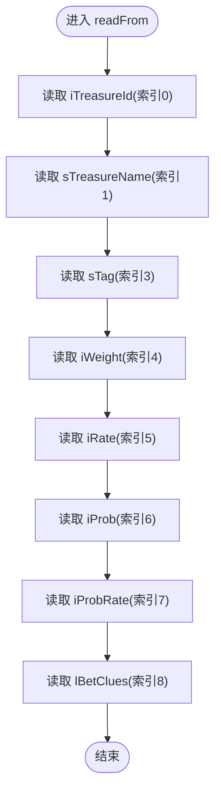

# TARS协议映射

<cite>
**本文引用的文件列表**
- [OpenTreasureHunter.java](file://src/main/java/com/entity/AccountedNotify/OpenTreasureHunter.java)
- [TreasureHunterInfo.java](file://src/main/java/com/entity/AccountedNotify/TreasureHunterInfo.java)
- [TreasureHunterInfoItem.java](file://src/main/java/com/entity/AccountedNotify/TreasureHunterInfoItem.java)
- [Proto.java](file://src/main/java/com/entity/AccountedNotify/Proto.java)
- [DirectSendTreasureBetSum.java](file://src/main/java/com/entity/AccountedNotify/DirectSendTreasureBetSum.java)
- [GameYqlyyWsClient.java](file://src/main/java/com/yqlyy/GameYqlyyWsClient.java)
- [WsCmd.java](file://src/main/java/com/entity/WsCmd.java)
- [BussesCmd.java](file://src/main/java/com/entity/BussesCmd.java)
- [GameStartData.java](file://src/main/java/com/entity/GameStartData.java)
</cite>

## 目录
1. [简介](#简介)
2. [项目结构](#项目结构)
3. [核心组件](#核心组件)
4. [架构总览](#架构总览)
5. [详细组件分析](#详细组件分析)
6. [依赖关系分析](#依赖关系分析)
7. [性能与兼容性](#性能与兼容性)
8. [调试与故障排查](#调试与故障排查)
9. [扩展与演进建议](#扩展与演进建议)
10. [结论](#结论)

## 简介
本文件聚焦于虎牙游戏数据采集系统中对TARS二进制协议的映射与应用，围绕OpenTreasureHunter类如何实现TarsStructBase接口完成二进制数据的读写、TarsInputStream与TarsOutputStream的使用方式、字段索引映射规则、协议版本兼容策略、调试技巧与常见问题，以及如何扩展协议以支持新字段与数据类型进行系统化说明。文档旨在帮助开发者快速理解并维护该协议栈。

## 项目结构
本项目采用按功能域分层的组织方式：
- 实体层（entity）：定义业务数据模型与TARS序列化实体
- 客户端层（yqlyy）：WebSocket客户端，负责接收二进制帧并解析TARS消息
- 工具与配置：REST工具、域名配置等

图表来源
- [GameYqlyyWsClient.java](file://src/main/java/com/yqlyy/GameYqlyyWsClient.java#L52-L219)
- [WsCmd.java](file://src/main/java/com/entity/WsCmd.java#L1-L68)
- [BussesCmd.java](file://src/main/java/com/entity/BussesCmd.java#L1-L10)
- [OpenTreasureHunter.java](file://src/main/java/com/entity/AccountedNotify/OpenTreasureHunter.java#L1-L82)
- [TreasureHunterInfo.java](file://src/main/java/com/entity/AccountedNotify/TreasureHunterInfo.java#L1-L44)
- [TreasureHunterInfoItem.java](file://src/main/java/com/entity/AccountedNotify/TreasureHunterInfoItem.java#L1-L124)
- [Proto.java](file://src/main/java/com/entity/AccountedNotify/Proto.java#L1-L8)
- [DirectSendTreasureBetSum.java](file://src/main/java/com/entity/AccountedNotify/DirectSendTreasureBetSum.java#L1-L8)
- [GameStartData.java](file://src/main/java/com/entity/GameStartData.java#L1-L79)

章节来源
- [GameYqlyyWsClient.java](file://src/main/java/com/yqlyy/GameYqlyyWsClient.java#L52-L219)
- [OpenTreasureHunter.java](file://src/main/java/com/entity/AccountedNotify/OpenTreasureHunter.java#L1-L82)

## 核心组件
- OpenTreasureHunter：继承TarsStructBase，实现readFrom/writeTo，用于解析“开启宝箱”通知的二进制负载，并填充vTreasure数组（包含TreasureHunterInfoItem与Proto列表）
- TreasureHunterInfoItem：继承TarsStructBase，实现readFrom/writeTo，承载单个宝物项的属性集合
- TreasureHunterInfo：继承TarsStructBase，封装proto与value列表，当前readFrom仅初始化proto并委托其readFrom
- Proto：轻量数据载体，包含若干整型字段
- DirectSendTreasureBetSum：包含Proto与数组字段，作为复杂字段占位
- GameYqlyyWsClient：WebSocket客户端，负责从二进制帧中提取TARS消息并调用对应实体的readFrom

章节来源
- [OpenTreasureHunter.java](file://src/main/java/com/entity/AccountedNotify/OpenTreasureHunter.java#L10-L82)
- [TreasureHunterInfo.java](file://src/main/java/com/entity/AccountedNotify/TreasureHunterInfo.java#L10-L43)
- [TreasureHunterInfoItem.java](file://src/main/java/com/entity/AccountedNotify/TreasureHunterInfoItem.java#L8-L123)
- [Proto.java](file://src/main/java/com/entity/AccountedNotify/Proto.java#L3-L7)
- [DirectSendTreasureBetSum.java](file://src/main/java/com/entity/AccountedNotify/DirectSendTreasureBetSum.java#L5-L7)
- [GameYqlyyWsClient.java](file://src/main/java/com/yqlyy/GameYqlyyWsClient.java#L52-L219)

## 架构总览
WebSocket二进制消息经TarsInputStream解析为多层结构：WsCmd -> BussesCmd -> 具体业务实体（如OpenTreasureHunter、GameStartData）。OpenTreasureHunter通过readFrom从二进制流中读取字段索引对应的值，并将vTreasure数组解析为对象列表。

图表来源
- [GameYqlyyWsClient.java](file://src/main/java/com/yqlyy/GameYqlyyWsClient.java#L52-L219)
- [OpenTreasureHunter.java](file://src/main/java/com/entity/AccountedNotify/OpenTreasureHunter.java#L73-L81)
- [TreasureHunterInfoItem.java](file://src/main/java/com/entity/AccountedNotify/TreasureHunterInfoItem.java#L111-L122)

## 详细组件分析

### OpenTreasureHunter 类
- 继承关系：实现TarsStructBase，具备readFrom/writeTo能力
- 字段与用途：
  - lOldRoundId：轮次ID
  - lOldRoundIndexEndTime：上一轮结束时间戳
  - lOldRoundIndexTime：上一轮开始时间戳
  - lServerTime：服务器时间
  - vTreasure：对象列表，构造时预置了TreasureHunterInfoItem与Proto列表
- readFrom流程要点：
  - 读取lOldRoundId（索引0）
  - 读取vTreasure数组（索引4），数组元素类型为Object，实际包含TreasureHunterInfoItem与Proto列表
- writeFrom：当前为空实现，预留写入路径

图表来源
- [OpenTreasureHunter.java](file://src/main/java/com/entity/AccountedNotify/OpenTreasureHunter.java#L10-L82)
- [TreasureHunterInfoItem.java](file://src/main/java/com/entity/AccountedNotify/TreasureHunterInfoItem.java#L8-L123)
- [Proto.java](file://src/main/java/com/entity/AccountedNotify/Proto.java#L3-L7)

章节来源
- [OpenTreasureHunter.java](file://src/main/java/com/entity/AccountedNotify/OpenTreasureHunter.java#L10-L82)

### TreasureHunterInfoItem 类
- 继承关系：实现TarsStructBase
- 字段与索引映射（基于readFrom调用顺序）：
  - iTreasureId（索引0）
  - sTreasureName（索引1）
  - sTag（索引3）
  - iWeight（索引4）
  - iRate（索引5）
  - iProb（索引6）
  - iProbRate（索引7）
  - lBetClues（索引8）
  - vTreasureBetSumDetail（索引9，当前未启用）
- readFrom按上述顺序依次读取，遵循TARS字段索引规则

图表来源
- [TreasureHunterInfoItem.java](file://src/main/java/com/entity/AccountedNotify/TreasureHunterInfoItem.java#L111-L122)

章节来源
- [TreasureHunterInfoItem.java](file://src/main/java/com/entity/AccountedNotify/TreasureHunterInfoItem.java#L8-L123)

### TreasureHunterInfo 类
- 继承关系：实现TarsStructBase
- 当前readFrom仅初始化proto并委托其readFrom；writeFrom为空实现
- 未来可扩展为完整列表容器或嵌套结构

章节来源
- [TreasureHunterInfo.java](file://src/main/java/com/entity/AccountedNotify/TreasureHunterInfo.java#L10-L43)

### Proto 与 DirectSendTreasureBetSum
- Proto：轻量数据载体，包含若干整型字段
- DirectSendTreasureBetSum：包含Proto与数组字段，作为复杂字段占位，当前未启用

章节来源
- [Proto.java](file://src/main/java/com/entity/AccountedNotify/Proto.java#L3-L7)
- [DirectSendTreasureBetSum.java](file://src/main/java/com/entity/AccountedNotify/DirectSendTreasureBetSum.java#L5-L7)

### 协议解析流程（WebSocket二进制帧）
- 客户端接收ByteBuffer，构造TarsInputStream
- 逐层解析：WsCmd -> BussesCmd -> 业务实体（如OpenTreasureHunter、GameStartData）
- 针对不同iUri（例如7109、7103等）选择对应解析逻辑

图表来源
- [GameYqlyyWsClient.java](file://src/main/java/com/yqlyy/GameYqlyyWsClient.java#L52-L219)
- [WsCmd.java](file://src/main/java/com/entity/WsCmd.java#L1-L68)
- [BussesCmd.java](file://src/main/java/com/entity/BussesCmd.java#L1-L10)
- [OpenTreasureHunter.java](file://src/main/java/com/entity/AccountedNotify/OpenTreasureHunter.java#L73-L81)
- [GameStartData.java](file://src/main/java/com/entity/GameStartData.java#L1-L79)

章节来源
- [GameYqlyyWsClient.java](file://src/main/java/com/yqlyy/GameYqlyyWsClient.java#L52-L219)

## 依赖关系分析
- OpenTreasureHunter依赖TreasureHunterInfoItem与Proto，用于填充vTreasure数组
- GameYqlyyWsClient依赖TarsInputStream进行二进制解析，并根据iUri路由到不同实体
- TreasureHunterInfoItem依赖DirectSendTreasureBetSum作为可选字段占位

图表来源
- [OpenTreasureHunter.java](file://src/main/java/com/entity/AccountedNotify/OpenTreasureHunter.java#L10-L82)
- [TreasureHunterInfoItem.java](file://src/main/java/com/entity/AccountedNotify/TreasureHunterInfoItem.java#L8-L123)
- [Proto.java](file://src/main/java/com/entity/AccountedNotify/Proto.java#L3-L7)
- [DirectSendTreasureBetSum.java](file://src/main/java/com/entity/AccountedNotify/DirectSendTreasureBetSum.java#L5-L7)
- [GameYqlyyWsClient.java](file://src/main/java/com/yqlyy/GameYqlyyWsClient.java#L52-L219)
- [WsCmd.java](file://src/main/java/com/entity/WsCmd.java#L1-L68)
- [BussesCmd.java](file://src/main/java/com/entity/BussesCmd.java#L1-L10)
- [GameStartData.java](file://src/main/java/com/entity/GameStartData.java#L1-L79)

章节来源
- [OpenTreasureHunter.java](file://src/main/java/com/entity/AccountedNotify/OpenTreasureHunter.java#L10-L82)
- [TreasureHunterInfoItem.java](file://src/main/java/com/entity/AccountedNotify/TreasureHunterInfoItem.java#L8-L123)
- [Proto.java](file://src/main/java/com/entity/AccountedNotify/Proto.java#L3-L7)
- [DirectSendTreasureBetSum.java](file://src/main/java/com/entity/AccountedNotify/DirectSendTreasureBetSum.java#L5-L7)
- [GameYqlyyWsClient.java](file://src/main/java/com/yqlyy/GameYqlyyWsClient.java#L52-L219)
- [WsCmd.java](file://src/main/java/com/entity/WsCmd.java#L1-L68)
- [BussesCmd.java](file://src/main/java/com/entity/BussesCmd.java#L1-L10)
- [GameStartData.java](file://src/main/java/com/entity/GameStartData.java#L1-L79)

## 性能与兼容性
- 性能特性
  - TARS二进制序列化相比JSON更紧凑，适合高频WebSocket推送场景
  - 通过索引直接读取字段，避免反射开销
- 版本与兼容性
  - 当前实现未显式声明协议版本号；若需版本控制，可在WsCmd或BussesCmd中引入版本字段，并在readFrom中按版本分支解析
  - 对于新增字段，建议：
    - 在实体类中添加新字段
    - 在readFrom中按新索引读取
    - 在writeTo中按新索引写出
    - 保持向后兼容：对缺失字段使用默认值，避免破坏旧客户端解析
- 建议
  - 引入协议版本字段与校验机制
  - 对数组/嵌套结构增加边界检查与容错处理

[本节为通用指导，不直接分析具体文件]

## 调试与故障排查
- 常见问题
  - 字段索引不匹配：确保readFrom中索引与服务端一致
  - 数组解析异常：确认vTreasure的元素类型与构造顺序
  - 时间戳解析错误：核对lOldRoundId/lOldRoundIndexTime/lOldRoundIndexEndTime的索引与类型
- 调试技巧
  - 在readFrom中打印字段值，定位解析位置
  - 使用TarsInputStream的readArray方法时，注意索引与元素类型
  - 对不同iUri分别断点验证解析路径
- 参考实现位置
  - OpenTreasureHunter.readFrom中对lOldRoundId与vTreasure的读取
  - TreasureHunterInfoItem.readFrom中对各字段的读取顺序
  - GameYqlyyWsClient中针对不同iUri的分支处理

章节来源
- [OpenTreasureHunter.java](file://src/main/java/com/entity/AccountedNotify/OpenTreasureHunter.java#L73-L81)
- [TreasureHunterInfoItem.java](file://src/main/java/com/entity/AccountedNotify/TreasureHunterInfoItem.java#L111-L122)
- [GameYqlyyWsClient.java](file://src/main/java/com/yqlyy/GameYqlyyWsClient.java#L52-L219)

## 扩展与演进建议
- 新增字段步骤
  - 在目标实体类中添加字段
  - 在readFrom中按新索引读取
  - 在writeTo中按新索引写出
  - 更新客户端解析逻辑（如GameYqlyyWsClient）以适配新字段
- 数据类型扩展
  - 支持数组/嵌套结构时，使用readArray/readFrom递归解析
  - 复杂对象（如DirectSendTreasureBetSum）可逐步启用并完善
- 版本管理
  - 引入协议版本字段，按版本分支解析
  - 对历史字段保留默认值，保证向后兼容

[本节为通用指导，不直接分析具体文件]

## 结论
本系统通过TARS二进制协议高效地解析虎牙WebSocket推送的业务数据，OpenTreasureHunter作为关键实体承担了核心解析职责。通过对字段索引的严格约定、TarsInputStream/TarsOutputStream的正确使用，以及客户端按iUri的路由解析，实现了稳定的数据采集链路。建议后续引入协议版本控制与更完善的错误处理，以进一步提升系统的健壮性与可维护性。