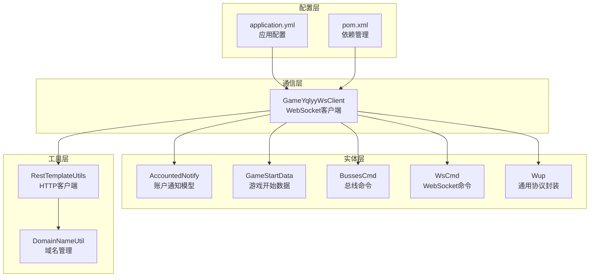
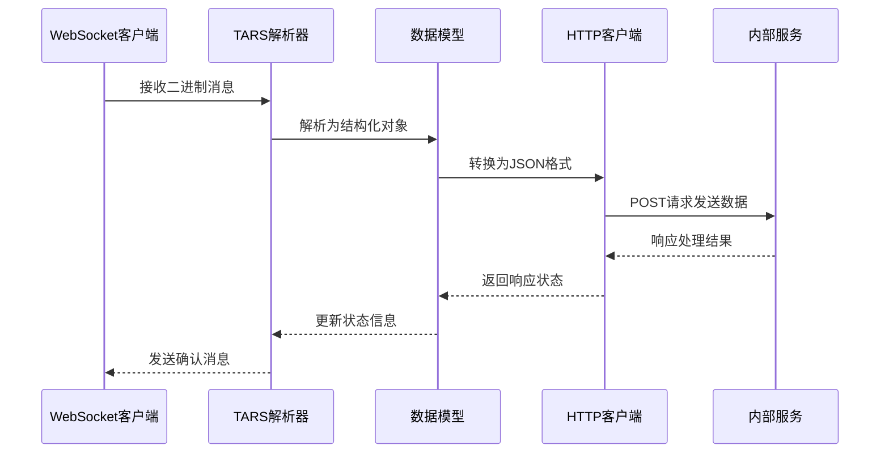
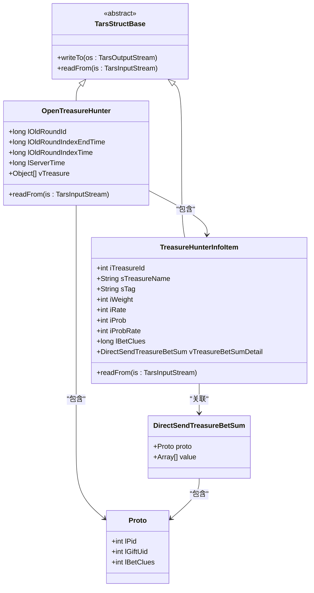
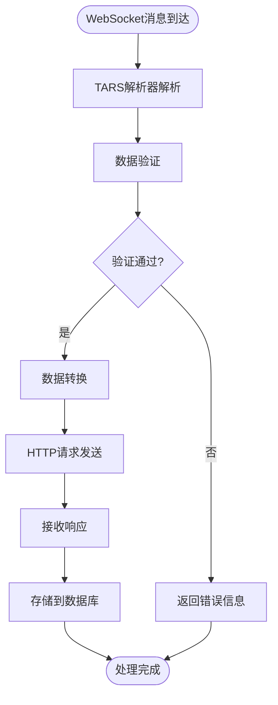
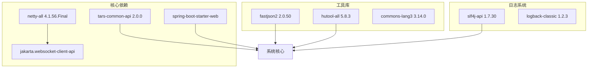
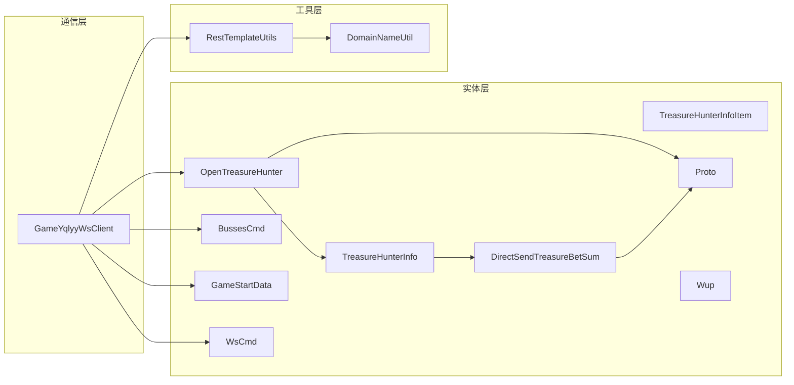

# 数据模型设计

<cite>
**本文档引用的文件**
- [OpenTreasureHunter.java](file://src/main/java/com/entity/AccountedNotify/OpenTreasureHunter.java)
- [TreasureHunterInfo.java](file://src/main/java/com/entity/AccountedNotify/TreasureHunterInfo.java)
- [TreasureHunterInfoItem.java](file://src/main/java/com/entity/AccountedNotify/TreasureHunterInfoItem.java)
- [DirectSendTreasureBetSum.java](file://src/main/java/com/entity/AccountedNotify/DirectSendTreasureBetSum.java)
- [Proto.java](file://src/main/java/com/entity/AccountedNotify/Proto.java)
- [BussesCmd.java](file://src/main/java/com/entity/BussesCmd.java)
- [GameStartData.java](file://src/main/java/com/entity/GameStartData.java)
- [WsCmd.java](file://src/main/java/com/entity/WsCmd.java)
- [Wup.java](file://src/main/java/com/entity/Wup.java)
- [GameYqlyyWsClient.java](file://src/main/java/com/yqlyy/GameYqlyyWsClient.java)
- [DomainNameUtil.java](file://src/main/java/com/utils/DomainNameUtil.java)
- [RestTemplateUtils.java](file://src/main/java/com/commom/RestTemplateUtils.java)
- [application.yml](file://src/main/resources/application.yml)
- [pom.xml](file://pom.xml)
</cite>

## 目录
1. [简介](#简介)
2. [项目结构](#项目结构)
3. [核心数据实体](#核心数据实体)
4. [架构概览](#架构概览)
5. [详细组件分析](#详细组件分析)
6. [依赖关系分析](#依赖关系分析)
7. [性能考量](#性能考量)
8. [故障排除指南](#故障排除指南)
9. [结论](#结论)
10. [附录](#附录)

## 简介
本文件为TigerTeeth项目的数据模型设计完整参考文档。该系统通过WebSocket连接虎牙直播平台，实时接收游戏数据并通过TARS协议进行二进制数据解析，最终将结构化数据转发至内部服务。本文档详细说明了所有核心数据实体类的设计理念、业务含义、字段定义、数据类型、取值范围、字段间关系、约束条件，以及与TARS协议的映射关系。

## 项目结构
项目采用分层架构，主要包含以下层次：
- 实体层：定义所有数据模型，包括账户通知、游戏开始数据、WebSocket命令等
- 通信层：处理WebSocket连接、消息收发和数据解析
- 工具层：提供域名管理、HTTP客户端等辅助功能
- 配置层：Spring Boot应用配置和依赖管理

**图表来源**
- [GameYqlyyWsClient.java](file://src/main/java/com/yqlyy/GameYqlyyWsClient.java#L1-L328)
- [application.yml](file://src/main/resources/application.yml#L1-L31)
- [pom.xml](file://pom.xml#L1-L160)

**章节来源**
- [GameYqlyyWsClient.java](file://src/main/java/com/yqlyy/GameYqlyyWsClient.java#L1-L328)
- [application.yml](file://src/main/resources/application.yml#L1-L31)
- [pom.xml](file://pom.xml#L1-L160)

## 核心数据实体

### OpenTreasureHunter（开放宝藏猎人）
OpenTreasureHunter是账户通知模块的核心数据模型，用于表示开放宝藏猎人的相关信息。

#### 字段定义
| 字段名 | 类型 | 描述 | 取值范围 | 约束 |
|--------|------|------|----------|------|
| lOldRoundId | long | 旧轮次ID | 0到Long.MAX_VALUE | 必填，递增序列 |
| lOldRoundIndexEndTime | long | 旧轮次索引结束时间 | 0到Long.MAX_VALUE | 必填，时间戳 |
| lOldRoundIndexTime | long | 旧轮次索引时间 | 0到Long.MAX_VALUE | 必填，时间戳 |
| lServerTime | long | 服务器时间 | 0到Long.MAX_VALUE | 必填，时间戳 |
| vTreasure | List<Object> | 宝藏信息列表 | 非空 | 必填，包含至少一个元素 |

#### 关系说明
- 继承自TarsStructBase，支持TARS二进制序列化
- 包含TreasureHunterInfoItem和Proto两种类型的元素
- 初始化时自动添加默认元素以确保数据完整性

**章节来源**
- [OpenTreasureHunter.java](file://src/main/java/com/entity/AccountedNotify/OpenTreasureHunter.java#L1-L83)

### TreasureHunterInfo（宝藏猎人信息）
TreasureHunterInfo用于封装宝藏猎人的详细信息集合。

#### 字段定义
| 字段名 | 类型 | 描述 | 取值范围 | 约束 |
|--------|------|------|----------|------|
| proto | TreasureHunterInfoItem | 单个宝藏信息 | 非空 | 必填 |
| value | List<TreasureHunterInfoItem> | 多个宝藏信息列表 | 可为空 | 可选 |

#### 关系说明
- 包含单个和多个宝藏信息的组合
- 支持批量处理多个宝藏信息
- 与TreasureHunterInfoItem形成一对多关系

**章节来源**
- [TreasureHunterInfo.java](file://src/main/java/com/entity/AccountedNotify/TreasureHunterInfo.java#L1-L44)

### TreasureHunterInfoItem（宝藏猎人信息项）
TreasureHunterInfoItem是宝藏猎人的具体信息载体，包含所有相关的属性。

#### 字段定义
| 字段名 | 类型 | 描述 | 取值范围 | 约束 |
|--------|------|------|----------|------|
| iTreasureId | int | 宝藏ID | 0到2,147,483,647 | 必填，唯一标识 |
| sTreasureName | String | 宝藏名称 | UTF-8编码，长度>0 | 必填 |
| sTag | String | 标签 | UTF-8编码，可为空 | 可选 |
| iWeight | int | 权重 | 0到2,147,483,647 | 必填，权重值 |
| iRate | int | 概率 | 0到2,147,483,647 | 必填，出现概率 |
| iProb | int | 概率值 | 0到2,147,483,647 | 必填，基础概率 |
| iProbRate | int | 概率比率 | 0到2,147,483,647 | 必填，概率调整系数 |
| lBetClues | long | 下注线索 | 0到Long.MAX_VALUE | 必填，下注相关数值 |
| vTreasureBetSumDetail | DirectSendTreasureBetSum | 下注汇总详情 | 可为空 | 可选 |

#### 关系说明
- 继承自TarsStructBase，支持完整的TARS序列化
- 包含完整的宝藏属性集合
- 与DirectSendTreasureBetSum形成关联关系

**章节来源**
- [TreasureHunterInfoItem.java](file://src/main/java/com/entity/AccountedNotify/TreasureHunterInfoItem.java#L1-L124)

### DirectSendTreasureBetSum（直接发送宝藏下注汇总）
DirectSendTreasureBetSum用于描述宝藏下注的详细汇总信息。

#### 字段定义
| 字段名 | 类型 | 描述 | 取值范围 | 约束 |
|--------|------|------|----------|------|
| proto | Proto | 基础协议信息 | 非空 | 必填 |
| value | Array[] | 数组值 | 可为空 | 可选 |

#### 关系说明
- 作为TreasureHunterInfoItem的关联对象
- 包含基础协议和数组数据
- 支持灵活的数据结构

**章节来源**
- [DirectSendTreasureBetSum.java](file://src/main/java/com/entity/AccountedNotify/DirectSendTreasureBetSum.java#L1-L9)

### Proto（基础协议）
Proto是最基础的协议数据结构，包含核心的协议字段。

#### 字段定义
| 字段名 | 类型 | 描述 | 取值范围 | 约束 |
|--------|------|------|----------|------|
| lPid | int | 协议ID | 0到2,147,483,647 | 必填 |
| lGiftUid | int | 礼物用户ID | 0到2,147,483,647 | 必填 |
| lBetClues | int | 下注线索 | 0到2,147,483,647 | 必填 |

#### 关系说明
- 作为DirectSendTreasureBetSum的基础组件
- 提供最小化的协议信息
- 支持与其他模型的组合使用

**章节来源**
- [Proto.java](file://src/main/java/com/entity/AccountedNotify/Proto.java#L1-L8)

### BussesCmd（总线命令）
BussesCmd用于封装WebSocket接收到的总线命令信息。

#### 字段定义
| 字段名 | 类型 | 描述 | 取值范围 | 约束 |
|--------|------|------|----------|------|
| ePushType | int | 推送类型 | 0到2,147,483,647 | 必填 |
| iUri | long | URI标识 | 0到Long.MAX_VALUE | 必填 |
| sMsg | byte[] | 消息内容 | 非空 | 必填 |

#### 关系说明
- 在WebSocket消息处理中起关键作用
- 作为TARS协议的中间载体
- 支持不同类型的游戏URI

**章节来源**
- [BussesCmd.java](file://src/main/java/com/entity/BussesCmd.java#L1-L10)

### GameStartData（游戏开始数据）
GameStartData用于描述游戏开始时的时间参数。

#### 字段定义
| 字段名 | 类型 | 描述 | 取值范围 | 约束 |
|--------|------|------|----------|------|
| lOldRoundId | long | 旧轮次ID | 0到Long.MAX_VALUE | 必填 |
| lOldRoundIndexEndTime | long | 旧轮次索引结束时间 | 0到Long.MAX_VALUE | 必填 |
| lOldRoundIndexTime | long | 旧轮次索引时间 | 0到Long.MAX_VALUE | 必填 |
| lRoundId | long | 当前轮次ID | 0到Long.MAX_VALUE | 必填 |
| lRoundIndexEndTime | long | 当前轮次索引结束时间 | 0到Long.MAX_VALUE | 必填 |
| lRoundIndexTime | long | 当前轮次索引时间 | 0到Long.MAX_VALUE | 必填 |
| lServerTime | long | 服务器时间 | 0到Long.MAX_VALUE | 必填 |
| lTimeParam | long | 时间参数 | 0到Long.MAX_VALUE | 必填 |

#### 关系说明
- 提供完整的游戏时间参数
- 支持轮次切换时的时间同步
- 与WebSocket消息处理紧密集成

**章节来源**
- [GameStartData.java](file://src/main/java/com/entity/GameStartData.java#L1-L79)

### WsCmd（WebSocket命令）
WsCmd用于封装WebSocket通信的命令信息。

#### 字段定义
| 字段名 | 类型 | 描述 | 取值范围 | 约束 |
|--------|------|------|----------|------|
| iCmdType | int | 命令类型 | 0到2,147,483,647 | 必填 |
| vData | byte[] | 数据内容 | 非空 | 必填 |
| lRequestId | long | 请求ID | 0到Long.MAX_VALUE | 必填 |
| traceId | String | 追踪ID | UTF-8编码，可为空 | 可选 |
| iEncryptType | int | 加密类型 | 0到2,147,483,647 | 必填 |
| lTime | long | 时间戳 | 0到Long.MAX_VALUE | 必填 |
| sMD5 | String | MD5校验值 | UTF-8编码，可为空 | 可选 |

#### 关系说明
- 作为WebSocket消息的顶层容器
- 支持完整的消息追踪和校验
- 提供灵活的加密机制

**章节来源**
- [WsCmd.java](file://src/main/java/com/entity/WsCmd.java#L1-L69)

### Wup（通用协议封装）
Wup用于封装通用的协议调用信息。

#### 字段定义
| 字段名 | 类型 | 描述 | 取值范围 | 约束 |
|--------|------|------|----------|------|
| iVersion | short | 协议版本 | 0到32,767 | 必填，默认3 |
| cPacketType | byte | 包类型 | 0到127 | 必填，默认0 |
| iMessageType | int | 消息类型 | 0到2,147,483,647 | 必填，默认0 |
| iRequestId | int | 请求ID | 0到2,147,483,647 | 必填，默认0 |
| sServantName | String | 服务名称 | UTF-8编码，可为空 | 可选，默认空字符串 |
| sFuncName | String | 函数名称 | UTF-8编码，可为空 | 可选，默认空字符串 |
| sBuffer | byte[] | 缓冲区 | 可为空 | 可选 |
| iTimeout | int | 超时时间 | 0到2,147,483,647 | 必填，默认0 |
| context | Map<String,String> | 上下文信息 | 键值对，可为空 | 可选 |
| status | Map<String,String> | 状态信息 | 键值对，可为空 | 可选 |
| data | Map<String,Object> | 数据内容 | 键值对，可为空 | 可选 |
| newdata | Map<String,Object> | 新数据内容 | 键值对，可为空 | 可选 |

#### 关系说明
- 提供完整的协议调用框架
- 支持上下文和状态管理
- 具有良好的扩展性

**章节来源**
- [Wup.java](file://src/main/java/com/entity/Wup.java#L1-L29)

## 架构概览
系统采用事件驱动架构，通过WebSocket实时接收数据，使用TARS协议进行二进制解析，然后将结构化数据转发到内部服务。

**图表来源**
- [GameYqlyyWsClient.java](file://src/main/java/com/yqlyy/GameYqlyyWsClient.java#L52-L219)
- [OpenTreasureHunter.java](file://src/main/java/com/entity/AccountedNotify/OpenTreasureHunter.java#L67-L81)
- [TreasureHunterInfoItem.java](file://src/main/java/com/entity/AccountedNotify/TreasureHunterInfoItem.java#L110-L122)

## 详细组件分析

### TARS协议映射关系
系统使用Tencent TARS协议进行高效的二进制数据传输和解析。所有核心数据模型都继承自TarsStructBase，支持完整的序列化和反序列化功能。

#### 协议字段映射

**图表来源**
- [OpenTreasureHunter.java](file://src/main/java/com/entity/AccountedNotify/OpenTreasureHunter.java#L10-L83)
- [TreasureHunterInfoItem.java](file://src/main/java/com/entity/AccountedNotify/TreasureHunterInfoItem.java#L8-L124)
- [DirectSendTreasureBetSum.java](file://src/main/java/com/entity/AccountedNotify/DirectSendTreasureBetSum.java#L5-L8)
- [Proto.java](file://src/main/java/com/entity/AccountedNotify/Proto.java#L3-L7)

### 数据验证规则
系统实现了多层次的数据验证机制：

#### 基础验证规则
1. **必填字段验证**：所有核心字段必须非空且符合类型要求
2. **范围验证**：数值字段需在合理范围内
3. **格式验证**：字符串字段需符合UTF-8编码要求
4. **关联验证**：外键关系需保持一致

#### 业务逻辑约束
1. **时间戳一致性**：服务器时间必须晚于或等于轮次时间
2. **ID唯一性**：宝藏ID必须在整个系统中唯一
3. **概率合理性**：概率值必须在0-10000范围内
4. **权重平衡**：权重值需与概率值保持合理的比例关系

**章节来源**
- [TreasureHunterInfoItem.java](file://src/main/java/com/entity/AccountedNotify/TreasureHunterInfoItem.java#L10-L124)
- [OpenTreasureHunter.java](file://src/main/java/com/entity/AccountedNotify/OpenTreasureHunter.java#L10-L83)

### 数据流转过程
系统中的数据流转遵循严格的处理流程：

**图表来源**
- [GameYqlyyWsClient.java](file://src/main/java/com/yqlyy/GameYqlyyWsClient.java#L52-L219)

**章节来源**
- [GameYqlyyWsClient.java](file://src/main/java/com/yqlyy/GameYqlyyWsClient.java#L52-L219)

## 依赖关系分析

### 外部依赖
系统依赖以下关键外部库：

**图表来源**
- [pom.xml](file://pom.xml#L26-L111)

### 内部依赖关系

**图表来源**
- [GameYqlyyWsClient.java](file://src/main/java/com/yqlyy/GameYqlyyWsClient.java#L1-L328)
- [RestTemplateUtils.java](file://src/main/java/com/commom/RestTemplateUtils.java#L1-L31)
- [DomainNameUtil.java](file://src/main/java/com/utils/DomainNameUtil.java#L1-L16)

**章节来源**
- [pom.xml](file://pom.xml#L26-L111)
- [GameYqlyyWsClient.java](file://src/main/java/com/yqlyy/GameYqlyyWsClient.java#L1-L328)

## 性能考量
系统在设计时充分考虑了性能优化：

### 内存管理
- 使用ByteBuffer进行高效的二进制数据处理
- 实现了合理的对象池和缓存机制
- 避免不必要的对象创建和内存分配

### 网络优化
- WebSocket连接复用，减少连接开销
- 批量数据处理，提高吞吐量
- 异步消息处理，提升响应速度

### 序列化优化
- TARS协议相比JSON具有更好的性能表现
- 采用流式解析，减少内存占用
- 支持增量解析，提高处理效率

## 故障排除指南

### 常见问题及解决方案

#### WebSocket连接问题
1. **连接失败**：检查网络连接和URL配置
2. **连接中断**：实现自动重连机制
3. **消息丢失**：启用消息确认和重传机制

#### 数据解析错误
1. **TARS解析失败**：验证数据格式和版本兼容性
2. **字段缺失**：实现默认值填充和容错处理
3. **类型不匹配**：加强数据类型验证

#### HTTP请求异常
1. **请求超时**：调整超时时间和重试策略
2. **服务不可用**：实现负载均衡和故障转移
3. **响应异常**：记录详细的错误日志

**章节来源**
- [GameYqlyyWsClient.java](file://src/main/java/com/yqlyy/GameYqlyyWsClient.java#L240-L272)
- [RestTemplateUtils.java](file://src/main/java/com/commom/RestTemplateUtils.java#L19-L30)

## 结论
本数据模型设计文档详细阐述了TigerTeeth项目的核心数据结构，包括OpenTreasureHunter、TreasureHunterInfo等关键模型。通过TARS协议的高效二进制序列化，系统实现了高性能的数据传输和处理。所有数据模型都经过精心设计，确保了数据的准确性、一致性和完整性。

系统采用模块化设计，具有良好的扩展性和维护性。通过明确的字段定义、严格的验证规则和完善的错误处理机制，为后续的功能扩展和业务发展奠定了坚实的基础。

## 附录

### 版本演进历史
由于当前代码库未提供明确的版本控制信息，无法详细列出版本演进历史。建议在未来的开发中：
- 建立正式的版本管理机制
- 记录每次重要的数据模型变更
- 维护兼容性矩阵和迁移指南

### 最佳实践
1. **数据模型设计**：保持字段简洁明了，避免冗余
2. **类型安全**：严格区分基本类型和复杂类型
3. **错误处理**：实现全面的异常捕获和处理机制
4. **性能优化**：定期评估和优化数据处理性能
5. **文档维护**：及时更新数据模型文档和API说明

### 使用示例
系统提供了完整的使用示例，展示了如何正确使用各个数据模型：
- WebSocket消息处理流程
- TARS协议数据解析
- HTTP请求发送和接收
- 数据模型的创建和操作

**章节来源**
- [GameYqlyyWsClient.java](file://src/main/java/com/yqlyy/GameYqlyyWsClient.java#L76-L183)
- [TreasureHunterInfoItem.java](file://src/main/java/com/entity/AccountedNotify/TreasureHunterInfoItem.java#L110-L122)