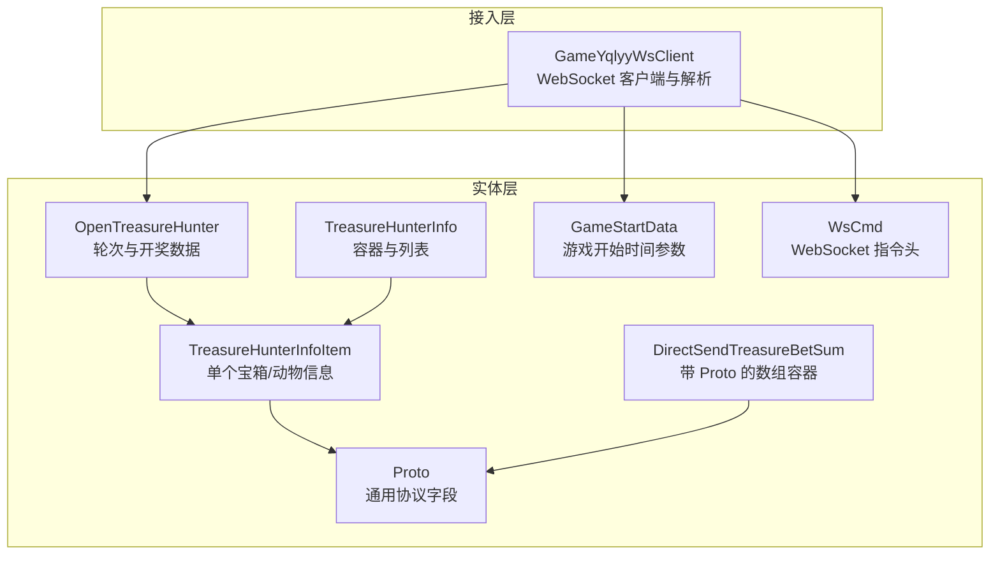
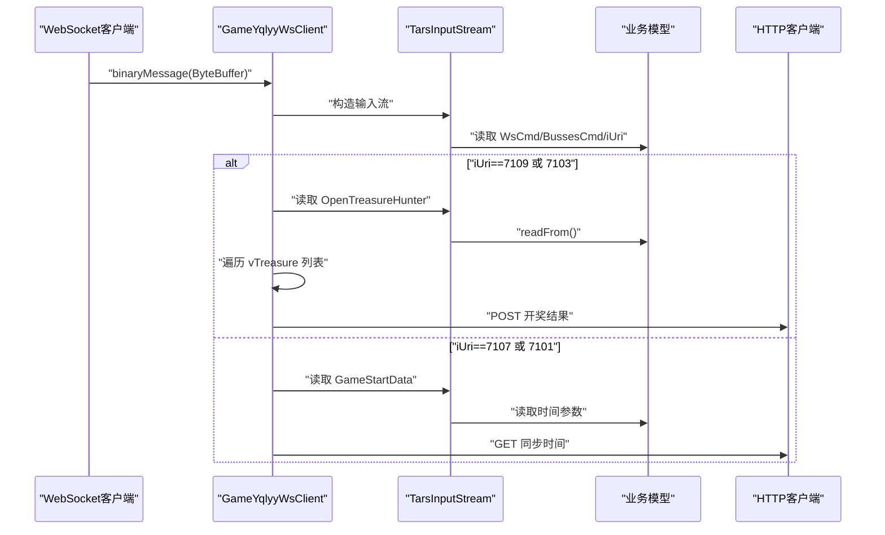
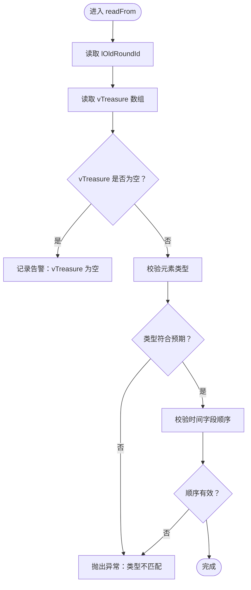
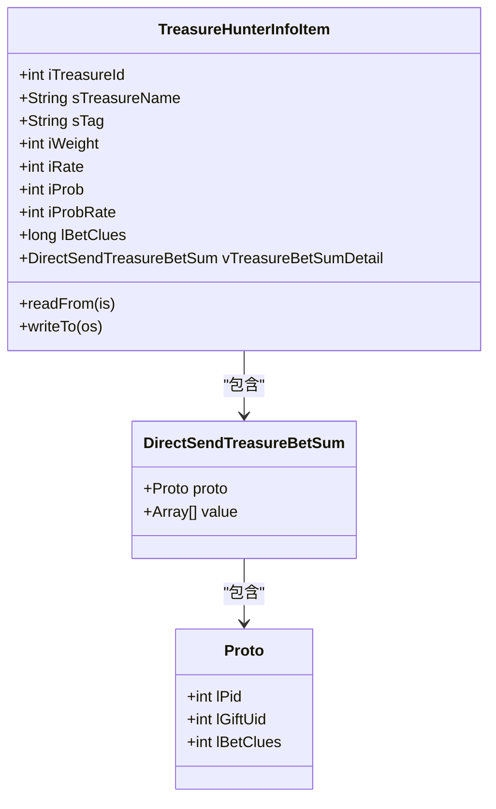
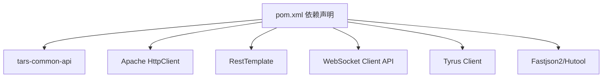

# 数据验证规则

<cite>
**本文引用的文件**
- [OpenTreasureHunter.java](file://src/main/java/com/entity/AccountedNotify/OpenTreasureHunter.java)
- [TreasureHunterInfo.java](file://src/main/java/com/entity/AccountedNotify/TreasureHunterInfo.java)
- [TreasureHunterInfoItem.java](file://src/main/java/com/entity/AccountedNotify/TreasureHunterInfoItem.java)
- [Proto.java](file://src/main/java/com/entity/AccountedNotify/Proto.java)
- [DirectSendTreasureBetSum.java](file://src/main/java/com/entity/AccountedNotify/DirectSendTreasureBetSum.java)
- [GameStartData.java](file://src/main/java/com/entity/GameStartData.java)
- [WsCmd.java](file://src/main/java/com/entity/WsCmd.java)
- [GameYqlyyWsClient.java](file://src/main/java/com/yqlyy/GameYqlyyWsClient.java)
- [application.yml](file://src/main/resources/application.yml)
- [pom.xml](file://pom.xml)
</cite>

## 目录
1. [引言](#引言)
2. [项目结构](#项目结构)
3. [核心组件](#核心组件)
4. [架构总览](#架构总览)
5. [详细组件分析](#详细组件分析)
6. [依赖关系分析](#依赖关系分析)
7. [性能考量](#性能考量)
8. [故障排查指南](#故障排查指南)
9. [结论](#结论)
10. [附录](#附录)

## 引言
本文件系统性梳理与数据验证相关的设计与实现，覆盖以下方面：
- 数据实体类中的验证逻辑与约束条件
- 时间戳字段的有效范围与格式要求（如 lServerTime、lOldRoundIndexTime 等）
- 数组字段 vTreasure 的结构验证（含 TreasureHunterInfoItem 与 Proto 对象的类型检查）
- 业务逻辑验证规则（轮次 ID 的递增验证、开奖时间的合理性检查等）
- 数据完整性检查机制与异常处理策略
- 在数据模型层面保障业务数据准确性与一致性的最佳实践

## 项目结构
本项目围绕“虎牙 WebSocket 游戏数据抓取”展开，核心数据模型位于 com.entity 包，网络接入与解析位于 com.yqlyy 包，Spring Boot 启动入口位于 com.listener 与 com.dwydh。

图表来源
- [OpenTreasureHunter.java](file://src/main/java/com/entity/AccountedNotify/OpenTreasureHunter.java#L10-L82)
- [TreasureHunterInfo.java](file://src/main/java/com/entity/AccountedNotify/TreasureHunterInfo.java#L10-L44)
- [TreasureHunterInfoItem.java](file://src/main/java/com/entity/AccountedNotify/TreasureHunterInfoItem.java#L8-L124)
- [Proto.java](file://src/main/java/com/entity/AccountedNotify/Proto.java#L3-L8)
- [DirectSendTreasureBetSum.java](file://src/main/java/com/entity/AccountedNotify/DirectSendTreasureBetSum.java#L5-L9)
- [GameStartData.java](file://src/main/java/com/entity/GameStartData.java#L3-L79)
- [WsCmd.java](file://src/main/java/com/entity/WsCmd.java#L3-L69)
- [GameYqlyyWsClient.java](file://src/main/java/com/yqlyy/GameYqlyyWsClient.java#L52-L219)

章节来源
- [OpenTreasureHunter.java](file://src/main/java/com/entity/AccountedNotify/OpenTreasureHunter.java#L10-L82)
- [TreasureHunterInfo.java](file://src/main/java/com/entity/AccountedNotify/TreasureHunterInfo.java#L10-L44)
- [TreasureHunterInfoItem.java](file://src/main/java/com/entity/AccountedNotify/TreasureHunterInfoItem.java#L8-L124)
- [Proto.java](file://src/main/java/com/entity/AccountedNotify/Proto.java#L3-L8)
- [DirectSendTreasureBetSum.java](file://src/main/java/com/entity/AccountedNotify/DirectSendTreasureBetSum.java#L5-L9)
- [GameStartData.java](file://src/main/java/com/entity/GameStartData.java#L3-L79)
- [WsCmd.java](file://src/main/java/com/entity/WsCmd.java#L3-L69)
- [GameYqlyyWsClient.java](file://src/main/java/com/yqlyy/GameYqlyyWsClient.java#L52-L219)

## 核心组件
- OpenTreasureHunter：承载轮次 ID、索引时间、服务器时间与开奖物品列表等字段，负责从 Tars 流反序列化。
- TreasureHunterInfoItem：单个宝箱/动物的属性集合，包含概率、权重、名称、图标、标签、下注线索等。
- TreasureHunterInfo：容器类，包含一个 Proto 和一个 TreasureHunterInfoItem 列表。
- Proto：通用协议字段容器，包含 lPid、lGiftUid、lBetClues。
- DirectSendTreasureBetSum：携带 Proto 的数组容器，用于存放 vTreasureBetSumDetail。
- GameStartData：游戏开始时的时间参数与轮次信息。
- WsCmd：WebSocket 消息头，包含指令类型、数据体、时间戳等。

章节来源
- [OpenTreasureHunter.java](file://src/main/java/com/entity/AccountedNotify/OpenTreasureHunter.java#L10-L82)
- [TreasureHunterInfo.java](file://src/main/java/com/entity/AccountedNotify/TreasureHunterInfo.java#L10-L44)
- [TreasureHunterInfoItem.java](file://src/main/java/com/entity/AccountedNotify/TreasureHunterInfoItem.java#L8-L124)
- [Proto.java](file://src/main/java/com/entity/AccountedNotify/Proto.java#L3-L8)
- [DirectSendTreasureBetSum.java](file://src/main/java/com/entity/AccountedNotify/DirectSendTreasureBetSum.java#L5-L9)
- [GameStartData.java](file://src/main/java/com/entity/GameStartData.java#L3-L79)
- [WsCmd.java](file://src/main/java/com/entity/WsCmd.java#L3-L69)

## 架构总览
WebSocket 接收二进制帧后，按 Tars 协议解析出 WsCmd、BussesCmd，再根据 iUri 分发到不同业务模型（如 OpenTreasureHunter、GameStartData），随后进行业务处理与外部同步。

图表来源
- [GameYqlyyWsClient.java](file://src/main/java/com/yqlyy/GameYqlyyWsClient.java#L52-L219)
- [OpenTreasureHunter.java](file://src/main/java/com/entity/AccountedNotify/OpenTreasureHunter.java#L72-L82)
- [GameStartData.java](file://src/main/java/com/entity/GameStartData.java#L120-L147)

章节来源
- [GameYqlyyWsClient.java](file://src/main/java/com/yqlyy/GameYqlyyWsClient.java#L52-L219)

## 详细组件分析

### OpenTreasureHunter 数据验证与约束
- 字段类型与含义
  - lOldRoundId：long，轮次 ID
  - lOldRoundIndexTime：long，轮次索引开始时间
  - lOldRoundIndexEndTime：long，轮次索引结束时间
  - lServerTime：long，服务器时间
  - vTreasure：List<Object>，开奖物品列表，初始化为包含 TreasureHunterInfoItem 与 List<Proto> 的混合容器
- 解析流程与约束
  - 通过 readFrom 从 Tars 输入流读取字段
  - vTreasure 通过 readArray 读取，需确保其元素类型与初始化保持一致（即列表首项为 TreasureHunterInfoItem，其余为 List<Proto>）
  - 若 vTreasure 为空或长度不符合预期，应视为数据不完整并记录告警
- 业务规则建议
  - 轮次 ID 递增校验：比较当前 lOldRoundId 与上一条记录的 lOldRoundId，若不满足严格递增则报警
  - 时间顺序校验：lOldRoundIndexTime ≤ lOldRoundIndexEndTime；lOldRoundIndexEndTime ≤ lServerTime
  - vTreasure 非空校验：至少包含一个 TreasureHunterInfoItem

图表来源
- [OpenTreasureHunter.java](file://src/main/java/com/entity/AccountedNotify/OpenTreasureHunter.java#L72-L82)

章节来源
- [OpenTreasureHunter.java](file://src/main/java/com/entity/AccountedNotify/OpenTreasureHunter.java#L10-L82)

### TreasureHunterInfoItem 数据验证与约束
- 字段类型与含义
  - iTreasureId：int，宝箱/动物 ID
  - sTreasureName：String，名称
  - sTag：String，标签
  - iWeight：int，权重
  - iRate：int，倍率
  - iProb：int，概率
  - iProbRate：int，概率分母
  - lBetClues：long，下注线索
  - vTreasureBetSumDetail：DirectSendTreasureBetSum，明细汇总
- 解析流程与约束
  - 通过 readFrom 逐字段读取，字段编号固定
  - 建议对字符串字段进行非空校验；对数值字段进行合理范围校验（如概率、权重、倍率）
  - vTreasureBetSumDetail 可能为 null，调用前需判空

图表来源
- [TreasureHunterInfoItem.java](file://src/main/java/com/entity/AccountedNotify/TreasureHunterInfoItem.java#L8-L124)
- [DirectSendTreasureBetSum.java](file://src/main/java/com/entity/AccountedNotify/DirectSendTreasureBetSum.java#L5-L9)
- [Proto.java](file://src/main/java/com/entity/AccountedNotify/Proto.java#L3-L8)

章节来源
- [TreasureHunterInfoItem.java](file://src/main/java/com/entity/AccountedNotify/TreasureHunterInfoItem.java#L8-L124)
- [DirectSendTreasureBetSum.java](file://src/main/java/com/entity/AccountedNotify/DirectSendTreasureBetSum.java#L5-L9)
- [Proto.java](file://src/main/java/com/entity/AccountedNotify/Proto.java#L3-L8)

### TreasureHunterInfo 与 vTreasure 的结构验证
- vTreasure：List<TreasureHunterInfoItem>，用于存储多个 TreasureHunterInfoItem
- proto：TreasureHunterInfoItem，作为默认模板或原型使用
- 解析注意
  - readFrom 中仅读取 proto，未重建 value 列表，存在潜在数据不一致风险
  - 建议在业务侧显式校验 vTreasure 的元素类型与数量，并与 proto 的字段结构保持一致

章节来源
- [TreasureHunterInfo.java](file://src/main/java/com/entity/AccountedNotify/TreasureHunterInfo.java#L10-L44)

### GameStartData 时间字段与业务规则
- 字段类型与含义
  - lOldRoundId、lOldRoundIndexTime、lOldRoundIndexEndTime、lRoundId、lRoundIndexTime、lRoundIndexEndTime、lServerTime、lTimeParam
- 业务规则建议
  - 轮次 ID 递增：lRoundId > 上一条记录的 lRoundId
  - 时间顺序：lRoundIndexTime ≤ lRoundIndexEndTime；lRoundIndexEndTime ≤ lServerTime
  - lTimeParam 作为时间偏移或参数，建议与 lServerTime 组合校验合理性

章节来源
- [GameStartData.java](file://src/main/java/com/entity/GameStartData.java#L3-L79)

### WsCmd 与 Tars 解析链路
- 字段类型与含义
  - iCmdType：int，指令类型
  - vData：byte[]，数据体
  - lRequestId：long，请求 ID
  - traceId：String，追踪 ID
  - iEncryptType：int，加密类型
  - lTime：long，时间戳
- 解析注意
  - iCmdType 需与期望值匹配（如 7）才继续解析
  - vData 需再次用 TarsInputStream 解析
  - lTime 与业务时间字段可做一致性比对

章节来源
- [WsCmd.java](file://src/main/java/com/entity/WsCmd.java#L3-L69)
- [GameYqlyyWsClient.java](file://src/main/java/com/yqlyy/GameYqlyyWsClient.java#L61-L75)

## 依赖关系分析
- Tars 协议依赖：com.tencent.tars:tars-common-api
- HTTP 客户端：Apache HttpClient、RestTemplate
- WebSocket 客户端：Jakarta WebSocket Client API、Tyrus Standalone Client
- JSON 工具：Fastjson2、Hutool

图表来源
- [pom.xml](file://pom.xml#L52-L83)

章节来源
- [pom.xml](file://pom.xml#L52-L83)

## 性能考量
- WebSocket 缓冲区大小：默认最大二进制消息缓冲 65536 字节，建议结合实际帧大小评估
- 心跳与保活：PongMessage 处理日志，避免频繁打印影响性能
- HTTP 请求并发：application.yml 中配置了最大连接数与超时参数，建议与业务 QPS 匹配
- Tars 解析：批量解析时尽量复用 InputStream，减少对象创建

章节来源
- [GameYqlyyWsClient.java](file://src/main/java/com/yqlyy/GameYqlyyWsClient.java#L250-L272)
- [application.yml](file://src/main/resources/application.yml#L16-L31)

## 故障排查指南
- WebSocket 连接异常
  - 观察 onOpen/onClose/onError 日志，必要时重建连接
  - 连接失败时重试并记录错误堆栈
- Tars 解析异常
  - 检查 iCmdType 与 iUri 是否匹配目标业务
  - 对 readFrom 中字段编号与类型进行核对，避免越界或类型不匹配
- vTreasure 类型不一致
  - 显式断言 vTreasure 元素类型，防止强转异常
  - 对空列表与空元素进行判空处理
- HTTP 同步失败
  - 记录 RestClientException 与通用异常，区分网络与业务错误
  - 根据 application.yml 中超时参数调整重试策略

章节来源
- [GameYqlyyWsClient.java](file://src/main/java/com/yqlyy/GameYqlyyWsClient.java#L240-L249)
- [OpenTreasureHunter.java](file://src/main/java/com/entity/AccountedNotify/OpenTreasureHunter.java#L72-L82)
- [application.yml](file://src/main/resources/application.yml#L16-L31)

## 结论
本项目通过 Tars 协议与 WebSocket 实现了对虎牙游戏数据的实时抓取与解析。数据验证应重点关注：
- 字段类型与编号的严格匹配
- 时间字段的顺序一致性与合理性
- 数组字段 vTreasure 的结构一致性与元素类型校验
- 轮次 ID 的递增与业务上下文的一致性
- 异常路径的可观测性与可恢复性

建议在业务层补充显式的校验器与断言，以在数据进入下游处理前尽早暴露问题。

## 附录

### 时间戳字段规范与建议
- 字段命名与含义
  - lServerTime：服务器时间戳（毫秒）
  - lOldRoundIndexTime：旧轮次索引开始时间
  - lOldRoundIndexEndTime：旧轮次索引结束时间
  - lRoundIndexTime：当前轮次索引开始时间
  - lRoundIndexEndTime：当前轮次索引结束时间
- 校验建议
  - 严格单调递增：lOldRoundId 与 lRoundId 递增
  - 时间顺序：起止时间与服务器时间满足逻辑顺序
  - 合理性：与系统当前时间偏差在可接受范围内

章节来源
- [OpenTreasureHunter.java](file://src/main/java/com/entity/AccountedNotify/OpenTreasureHunter.java#L11-L14)
- [GameStartData.java](file://src/main/java/com/entity/GameStartData.java#L4-L10)

### 数组字段 vTreasure 的结构验证清单
- 列表非空：至少包含一个元素
- 元素类型：首项为 TreasureHunterInfoItem，其余为 List<Proto>
- 字段完整性：每个 TreasureHunterInfoItem 的关键字段均被正确读取
- 明细字段：vTreasureBetSumDetail 可能为空，调用前判空

章节来源
- [OpenTreasureHunter.java](file://src/main/java/com/entity/AccountedNotify/OpenTreasureHunter.java#L16-L20)
- [TreasureHunterInfoItem.java](file://src/main/java/com/entity/AccountedNotify/TreasureHunterInfoItem.java#L19-L27)

### 业务逻辑验证规则清单
- 轮次 ID 递增：当前轮次 ID > 上一条记录的轮次 ID
- 开奖时间合理性：索引开始时间 ≤ 索引结束时间 ≤ 服务器时间
- 字符串字段非空：名称、标签等关键字符串字段不能为空
- 数值字段范围：概率、权重、倍率等应在合理区间内

章节来源
- [OpenTreasureHunter.java](file://src/main/java/com/entity/AccountedNotify/OpenTreasureHunter.java#L72-L82)
- [TreasureHunterInfoItem.java](file://src/main/java/com/entity/AccountedNotify/TreasureHunterInfoItem.java#L111-L122)