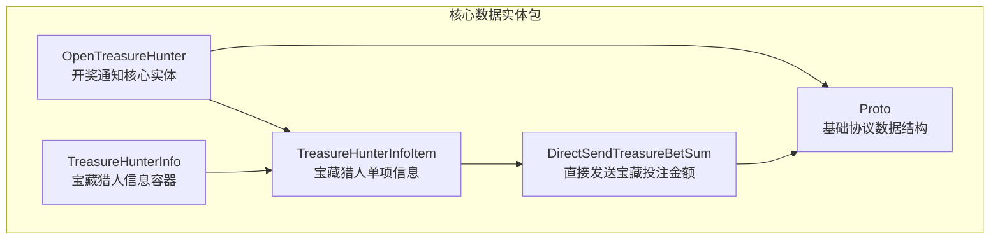
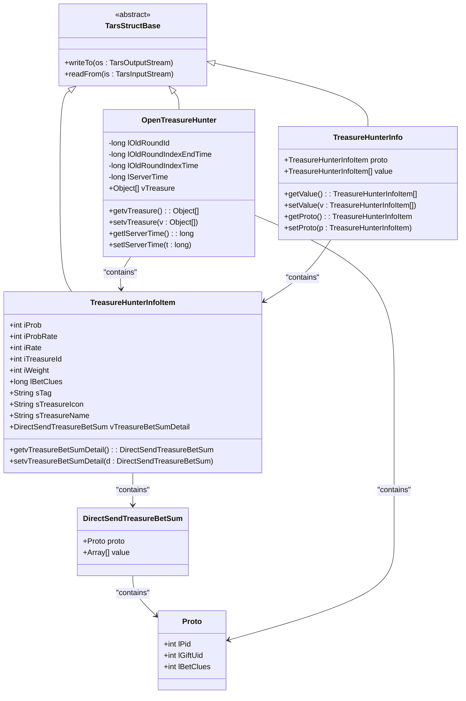
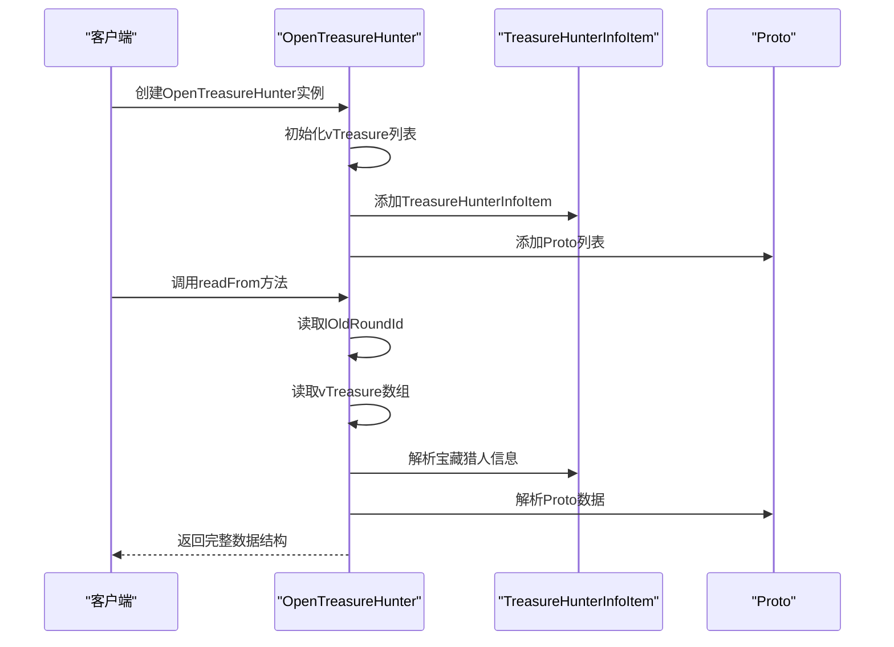
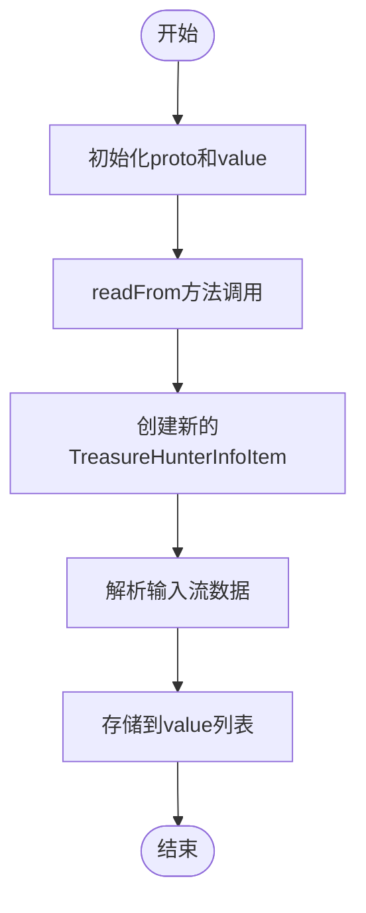
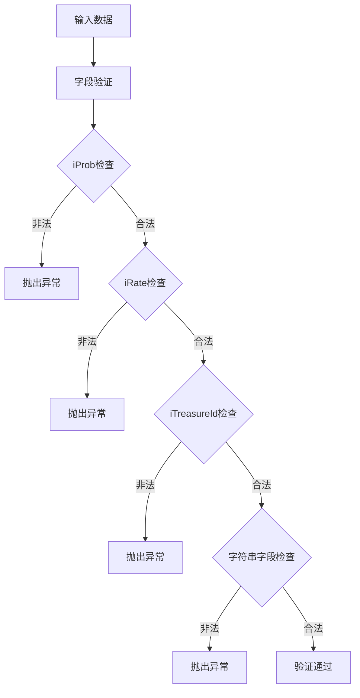
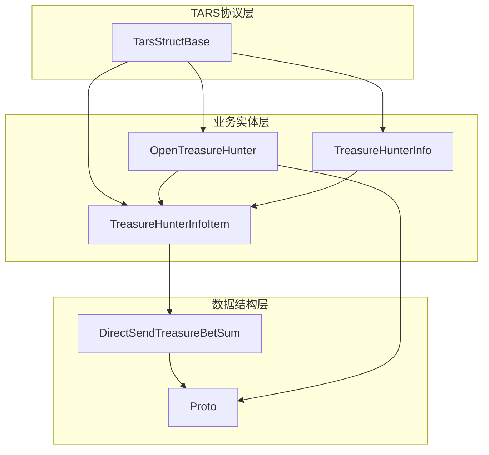

# 核心数据实体

<cite>
**本文档引用的文件**
- [OpenTreasureHunter.java](file://src/main/java/com/entity/AccountedNotify/OpenTreasureHunter.java)
- [TreasureHunterInfo.java](file://src/main/java/com/entity/AccountedNotify/TreasureHunterInfo.java)
- [TreasureHunterInfoItem.java](file://src/main/java/com/entity/AccountedNotify/TreasureHunterInfoItem.java)
- [DirectSendTreasureBetSum.java](file://src/main/java/com/entity/AccountedNotify/DirectSendTreasureBetSum.java)
- [Proto.java](file://src/main/java/com/entity/AccountedNotify/Proto.java)
</cite>

## 目录
1. [简介](#简介)
2. [项目结构](#项目结构)
3. [核心组件](#核心组件)
4. [架构概览](#架构概览)
5. [详细组件分析](#详细组件分析)
6. [依赖关系分析](#依赖关系分析)
7. [性能考虑](#性能考虑)
8. [故障排除指南](#故障排除指南)
9. [结论](#结论)

## 简介

本文档深入解析OpenTreasureHunter项目的核心数据实体，重点阐述开奖通知系统中的数据结构设计。这些实体基于TARS协议构建，用于处理宝藏猎人相关的通知和数据传输。文档将详细说明每个实体类的字段含义、数据类型、业务逻辑、序列化/反序列化过程，以及实体间的继承和组合关系。

## 项目结构

核心数据实体位于`src/main/java/com/entity/AccountedNotify/`包中，采用分层架构设计：

**图表来源**
- [OpenTreasureHunter.java](file://src/main/java/com/entity/AccountedNotify/OpenTreasureHunter.java#L1-L83)
- [TreasureHunterInfo.java](file://src/main/java/com/entity/AccountedNotify/TreasureHunterInfo.java#L1-L44)
- [TreasureHunterInfoItem.java](file://src/main/java/com/entity/AccountedNotify/TreasureHunterInfoItem.java#L1-L124)
- [DirectSendTreasureBetSum.java](file://src/main/java/com/entity/AccountedNotify/DirectSendTreasureBetSum.java#L1-L9)
- [Proto.java](file://src/main/java/com/entity/AccountedNotify/Proto.java#L1-L8)

**章节来源**
- [OpenTreasureHunter.java](file://src/main/java/com/entity/AccountedNotify/OpenTreasureHunter.java#L1-L83)
- [TreasureHunterInfo.java](file://src/main/java/com/entity/AccountedNotify/TreasureHunterInfo.java#L1-L44)
- [TreasureHunterInfoItem.java](file://src/main/java/com/entity/AccountedNotify/TreasureHunterInfoItem.java#L1-L124)
- [DirectSendTreasureBetSum.java](file://src/main/java/com/entity/AccountedNotify/DirectSendTreasureBetSum.java#L1-L9)
- [Proto.java](file://src/main/java/com/entity/AccountedNotify/Proto.java#L1-L8)

## 核心组件

本项目的核心数据实体围绕"宝藏猎人"主题构建，主要包含以下四个关键组件：

### OpenTreasureHunter - 开奖通知核心实体
- **继承关系**: 继承自`TarsStructBase`，支持TARS协议序列化
- **主要职责**: 处理开奖通知的主数据结构，管理宝藏猎人信息列表
- **关键特性**: 包含时间戳、轮次标识等核心业务字段

### TreasureHunterInfo - 宝藏猎人信息容器
- **继承关系**: 继承自`TarsStructBase`
- **主要职责**: 作为宝藏猎人信息的容器，存储单项信息和值列表
- **关键特性**: 提供proto和value两种数据访问方式

### TreasureHunterInfoItem - 宝藏猎人单项信息
- **继承关系**: 继承自`TarsStructBase`
- **主要职责**: 描述单个宝藏猎人的详细信息
- **关键特性**: 包含概率、权重、名称、图标等丰富属性

### DirectSendTreasureBetSum - 直接发送宝藏投注金额
- **主要职责**: 存储直接发送的宝藏投注金额详情
- **关键特性**: 结合Proto基础结构和数组值列表

**章节来源**
- [OpenTreasureHunter.java](file://src/main/java/com/entity/AccountedNotify/OpenTreasureHunter.java#L10-L83)
- [TreasureHunterInfo.java](file://src/main/java/com/entity/AccountedNotify/TreasureHunterInfo.java#L10-L44)
- [TreasureHunterInfoItem.java](file://src/main/java/com/entity/AccountedNotify/TreasureHunterInfoItem.java#L8-L124)
- [DirectSendTreasureBetSum.java](file://src/main/java/com/entity/AccountedNotify/DirectSendTreasureBetSum.java#L5-L9)

## 架构概览

核心实体采用分层设计模式，通过组合关系实现复杂的数据结构：

**图表来源**
- [OpenTreasureHunter.java](file://src/main/java/com/entity/AccountedNotify/OpenTreasureHunter.java#L10-L83)
- [TreasureHunterInfo.java](file://src/main/java/com/entity/AccountedNotify/TreasureHunterInfo.java#L10-L44)
- [TreasureHunterInfoItem.java](file://src/main/java/com/entity/AccountedNotify/TreasureHunterInfoItem.java#L8-L124)
- [DirectSendTreasureBetSum.java](file://src/main/java/com/entity/AccountedNotify/DirectSendTreasureBetSum.java#L5-L9)
- [Proto.java](file://src/main/java/com/entity/AccountedNotify/Proto.java#L3-L8)

## 详细组件分析

### OpenTreasureHunter 实体分析

OpenTreasureHunter是整个开奖通知系统的核心实体，负责处理主要的业务数据。

#### 字段映射关系

| 字段名 | 数据类型 | 含义 | 默认值 |
|--------|----------|------|--------|
| lOldRoundId | long | 旧轮次ID | 0 |
| lOldRoundIndexEndTime | long | 旧轮次索引结束时间 | 0 |
| lOldRoundIndexTime | long | 旧轮次索引时间 | 0 |
| lServerTime | long | 服务器时间戳 | 0 |
| vTreasure | List<Object> | 宝藏猎人信息列表 | [TreasureHunterInfoItem, ArrayList<Proto>] |

#### 业务逻辑

**图表来源**
- [OpenTreasureHunter.java](file://src/main/java/com/entity/AccountedNotify/OpenTreasureHunter.java#L17-L20)
- [OpenTreasureHunter.java](file://src/main/java/com/entity/AccountedNotify/OpenTreasureHunter.java#L73-L81)

#### 使用场景

- 开奖结果通知
- 宝藏猎人状态同步
- 游戏数据传输

**章节来源**
- [OpenTreasureHunter.java](file://src/main/java/com/entity/AccountedNotify/OpenTreasureHunter.java#L10-L83)

### TreasureHunterInfo 实体分析

TreasureHunterInfo作为信息容器，提供了灵活的数据访问方式。

#### 字段映射关系

| 字段名 | 数据类型 | 含义 | 默认值 |
|--------|----------|------|--------|
| proto | TreasureHunterInfoItem | 单项信息原型 | 新建实例 |
| value | List<TreasureHunterInfoItem> | 信息值列表 | 空列表 |

#### 业务逻辑

**图表来源**
- [TreasureHunterInfo.java](file://src/main/java/com/entity/AccountedNotify/TreasureHunterInfo.java#L38-L42)

#### 使用场景

- 批量处理多个宝藏猎人信息
- 数据聚合和统计
- 列表形式的数据传输

**章节来源**
- [TreasureHunterInfo.java](file://src/main/java/com/entity/AccountedNotify/TreasureHunterInfo.java#L10-L44)

### TreasureHunterInfoItem 实体分析

TreasureHunterInfoItem是最详细的实体，包含了丰富的宝藏猎人信息。

#### 字段映射关系

| 字段名 | 数据类型 | 含义 | 验证规则 |
|--------|----------|------|----------|
| iProb | int | 概率值 | 0-10000范围 |
| iProbRate | int | 概率比率 | 0-10000范围 |
| iRate | int | 中奖比率 | 0-10000范围 |
| iTreasureId | int | 宝藏ID | 正整数 |
| iWeight | int | 权重 | 非负整数 |
| lBetClues | long | 下注线索 | 非负长整型 |
| sTag | String | 标签 | 非空字符串 |
| sTreasureIcon | String | 宝藏图标URL | 非空字符串 |
| sTreasureName | String | 宝藏名称 | 非空字符串 |
| vTreasureBetSumDetail | DirectSendTreasureBetSum | 投注金额详情 | 可为空 |

#### 数据验证规则

**图表来源**
- [TreasureHunterInfoItem.java](file://src/main/java/com/entity/AccountedNotify/TreasureHunterInfoItem.java#L111-L122)

#### 使用场景

- 详细的游戏状态描述
- 用户界面显示数据
- 数据库持久化存储

**章节来源**
- [TreasureHunterInfoItem.java](file://src/main/java/com/entity/AccountedNotify/TreasureHunterInfoItem.java#L8-L124)

### DirectSendTreasureBetSum 实体分析

DirectSendTreasureBetSum专门处理直接发送的宝藏投注金额数据。

#### 字段映射关系

| 字段名 | 数据类型 | 含义 | 默认值 |
|--------|----------|------|--------|
| proto | Proto | 基础协议数据 | null |
| value | Array[] | 投注金额值列表 | null |

#### 业务逻辑

该实体采用简单的组合模式，通过Proto基础结构和数组值列表实现灵活的数据存储。

**章节来源**
- [DirectSendTreasureBetSum.java](file://src/main/java/com/entity/AccountedNotify/DirectSendTreasureBetSum.java#L5-L9)

### Proto 实体分析

Proto是最基础的数据结构，为其他实体提供通用的数据格式。

#### 字段映射关系

| 字段名 | 数据类型 | 含义 | 默认值 |
|--------|----------|------|--------|
| lPid | int | 平台ID | 0 |
| lGiftUid | int | 礼物用户ID | 0 |
| lBetClues | int | 下注线索 | 0 |

#### 使用场景

- 作为其他实体的基础数据结构
- 提供统一的数据格式标准
- 支持跨模块的数据交换

**章节来源**
- [Proto.java](file://src/main/java/com/entity/AccountedNotify/Proto.java#L3-L8)

## 依赖关系分析

核心实体之间的依赖关系体现了清晰的层次结构：

**图表来源**
- [OpenTreasureHunter.java](file://src/main/java/com/entity/AccountedNotify/OpenTreasureHunter.java#L3-L5)
- [TreasureHunterInfo.java](file://src/main/java/com/entity/AccountedNotify/TreasureHunterInfo.java#L3-L5)
- [TreasureHunterInfoItem.java](file://src/main/java/com/entity/AccountedNotify/TreasureHunterInfoItem.java#L3-L5)

### 继承关系

所有核心实体都继承自`TarsStructBase`抽象类，确保了统一的序列化和反序列化机制：

- **OpenTreasureHunter**: 主要业务实体，继承TarsStructBase
- **TreasureHunterInfo**: 信息容器实体，继承TarsStructBase  
- **TreasureHunterInfoItem**: 详细信息实体，继承TarsStructBase

### 组合关系

实体间通过组合关系建立复杂的嵌套结构：

- OpenTreasureHunter组合TreasureHunterInfoItem和Proto
- TreasureHunterInfo组合TreasureHunterInfoItem
- TreasureHunterInfoItem组合DirectSendTreasureBetSum
- DirectSendTreasureBetSum组合Proto

**章节来源**
- [OpenTreasureHunter.java](file://src/main/java/com/entity/AccountedNotify/OpenTreasureHunter.java#L10-L20)
- [TreasureHunterInfo.java](file://src/main/java/com/entity/AccountedNotify/TreasureHunterInfo.java#L11-L12)
- [TreasureHunterInfoItem.java](file://src/main/java/com/entity/AccountedNotify/TreasureHunterInfoItem.java#L19)

## 性能考虑

### 序列化性能优化

1. **延迟初始化**: OpenTreasureHunter在构造函数中延迟初始化vTreasure列表
2. **内存管理**: 使用ArrayList避免固定大小数组的内存浪费
3. **字段顺序**: TARS协议按字段序号进行序列化，减少网络传输开销

### 内存使用优化

1. **对象复用**: Proto和DirectSendTreasureBetSum采用简单字段设计
2. **数据类型选择**: 使用合适的数据类型平衡精度和内存占用
3. **集合优化**: ArrayList提供动态扩容能力，避免预分配过多内存

## 故障排除指南

### 常见问题及解决方案

#### TARS序列化异常
- **症状**: readFrom方法抛出异常
- **原因**: 字段序号不匹配或数据格式错误
- **解决方案**: 检查TARS协议版本兼容性和字段定义

#### 内存溢出问题
- **症状**: 大量数据处理时出现内存不足
- **原因**: vTreasure列表过大或嵌套层级过深
- **解决方案**: 实施数据分页和批量处理策略

#### 空指针异常
- **症状**: 访问vTreasureBetSumDetail时出现异常
- **原因**: DirectSendTreasureBetSum未正确初始化
- **解决方案**: 在构造函数中初始化所有必需字段

**章节来源**
- [TreasureHunterInfoItem.java](file://src/main/java/com/entity/AccountedNotify/TreasureHunterInfoItem.java#L111-L122)
- [OpenTreasureHunter.java](file://src/main/java/com/entity/AccountedNotify/OpenTreasureHunter.java#L73-L81)

## 结论

OpenTreasureHunter项目的核心数据实体设计体现了良好的软件工程实践：

1. **清晰的层次结构**: 从基础Proto到复杂OpenTreasureHunter的渐进式设计
2. **标准化的数据格式**: 基于TARS协议确保跨平台兼容性
3. **灵活的组合模式**: 通过组合关系实现复杂数据结构的构建
4. **完善的序列化机制**: 支持高效的网络传输和数据持久化

这些实体为游戏系统的开奖通知功能提供了坚实的数据基础，支持丰富的业务场景和灵活的扩展需求。通过合理的字段设计、严格的验证规则和优化的性能考虑，确保了系统的稳定性和可维护性。