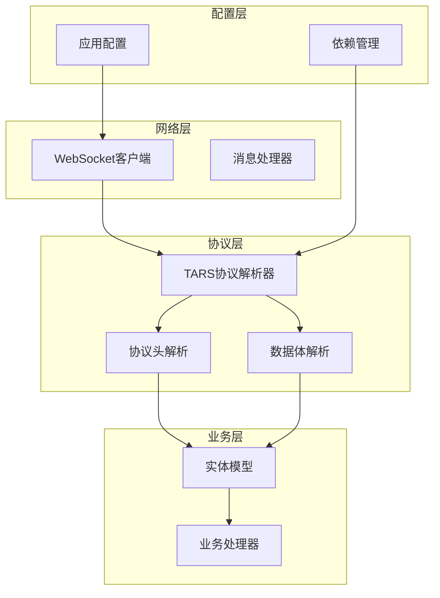
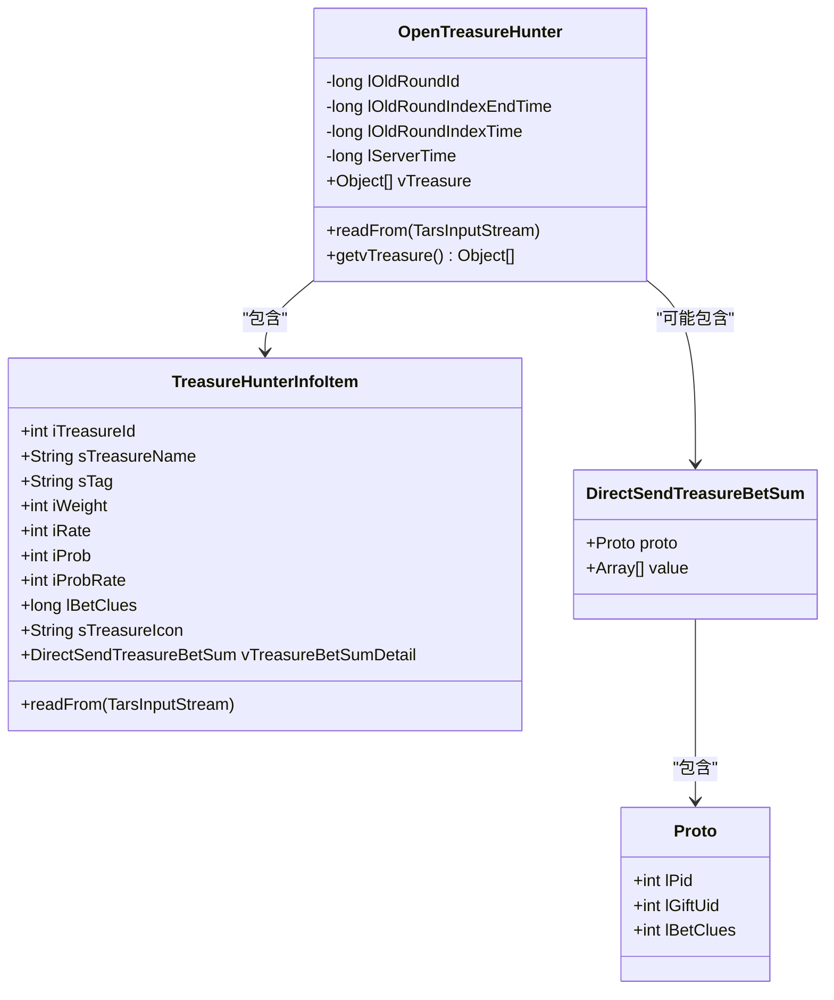
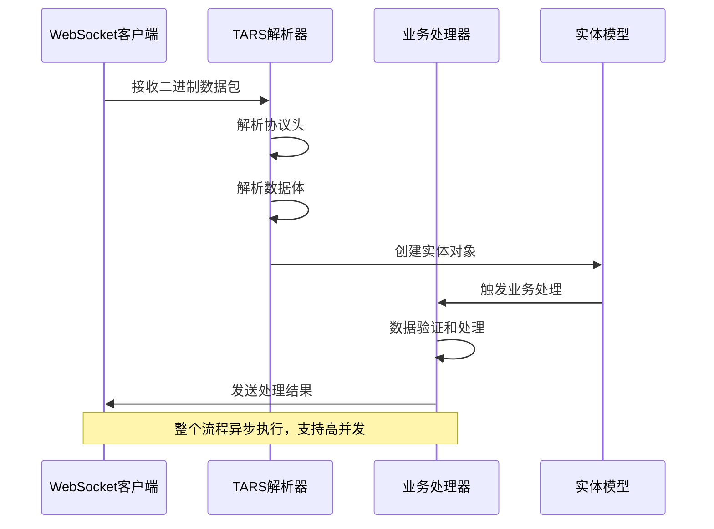
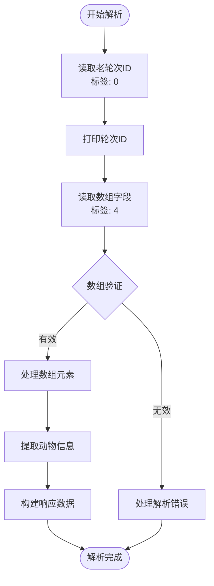
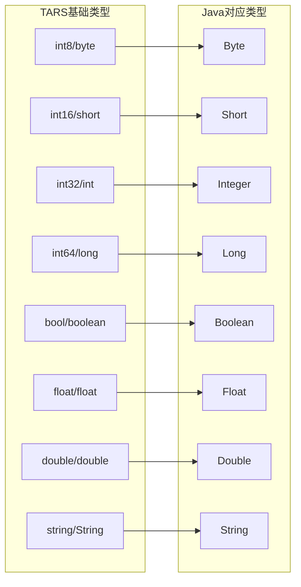
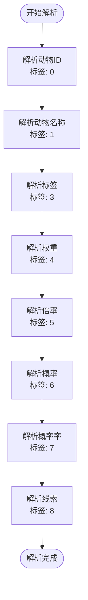
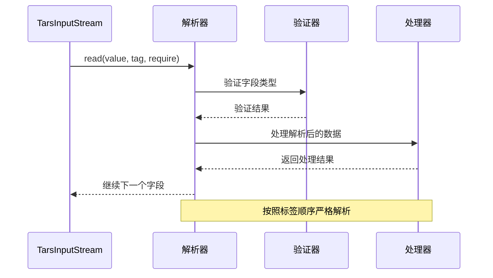
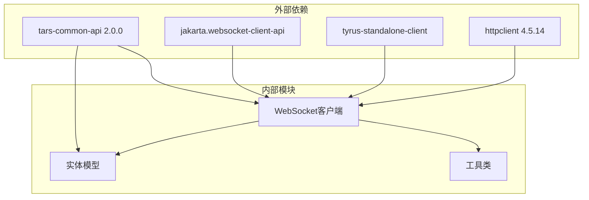

# TARS协议解析器

<cite>
**本文档引用的文件**
- [OpenTreasureHunter.java](file://src/main/java/com/entity/AccountedNotify/OpenTreasureHunter.java)
- [TreasureHunterInfo.java](file://src/main/java/com/entity/AccountedNotify/TreasureHunterInfo.java)
- [TreasureHunterInfoItem.java](file://src/main/java/com/entity/AccountedNotify/TreasureHunterInfoItem.java)
- [Proto.java](file://src/main/java/com/entity/AccountedNotify/Proto.java)
- [DirectSendTreasureBetSum.java](file://src/main/java/com/entity/AccountedNotify/DirectSendTreasureBetSum.java)
- [WsCmd.java](file://src/main/java/com/entity/WsCmd.java)
- [BussesCmd.java](file://src/main/java/com/entity/BussesCmd.java)
- [GameStartData.java](file://src/main/java/com/entity/GameStartData.java)
- [Wup.java](file://src/main/java/com/entity/Wup.java)
- [GameYqlyyWsClient.java](file://src/main/java/com/yqlyy/GameYqlyyWsClient.java)
- [application.yml](file://src/main/resources/application.yml)
- [pom.xml](file://pom.xml)
</cite>

## 目录
1. [引言](#引言)
2. [项目结构](#项目结构)
3. [核心组件](#核心组件)
4. [架构概览](#架构概览)
5. [详细组件分析](#详细组件分析)
6. [依赖关系分析](#依赖关系分析)
7. [性能考虑](#性能考虑)
8. [故障排除指南](#故障排除指南)
9. [结论](#结论)

## 引言

本项目实现了基于TARS（Tencent Remote Procedure Call）协议的二进制数据解析器，专门用于处理虎牙直播平台"一千零一夜"和"宠物马拉松"游戏的实时数据通信。该解析器通过WebSocket连接接收二进制数据包，使用TARS协议规范解析协议头和数据体，提取关键的游戏状态信息如开奖动物、游戏时间等。

TARS协议是一种高性能的二进制序列化协议，具有以下特点：
- 固定大小的基础数据类型（int8、int16、int32、int64）
- 变长编码支持（varint）
- 结构化数据的有序字段访问
- 版本兼容性支持

## 项目结构

项目采用分层架构设计，主要包含以下层次：

**图表来源**
- [GameYqlyyWsClient.java](file://src/main/java/com/yqlyy/GameYqlyyWsClient.java#L52-L219)
- [OpenTreasureHunter.java](file://src/main/java/com/entity/AccountedNotify/OpenTreasureHunter.java#L10-L82)

**章节来源**
- [GameYqlyyWsClient.java](file://src/main/java/com/yqlyy/GameYqlyyWsClient.java#L1-L328)
- [application.yml](file://src/main/resources/application.yml#L1-L31)

## 核心组件

### TARS协议解析器

TARS协议解析器是整个系统的核心，负责将二进制数据流转换为Java对象。其主要功能包括：

1. **协议头解析**：解析消息类型、数据长度等元信息
2. **字段解码**：根据字段标签按序读取数据
3. **类型转换**：将二进制数据转换为对应Java类型
4. **错误处理**：处理解析过程中的异常情况

### 实体模型体系

系统定义了完整的实体模型来表示不同类型的业务数据：

**图表来源**
- [OpenTreasureHunter.java](file://src/main/java/com/entity/AccountedNotify/OpenTreasureHunter.java#L10-L82)
- [TreasureHunterInfoItem.java](file://src/main/java/com/entity/AccountedNotify/TreasureHunterInfoItem.java#L8-L123)
- [DirectSendTreasureBetSum.java](file://src/main/java/com/entity/AccountedNotify/DirectSendTreasureBetSum.java#L5-L8)
- [Proto.java](file://src/main/java/com/entity/AccountedNotify/Proto.java#L3-L7)

**章节来源**
- [OpenTreasureHunter.java](file://src/main/java/com/entity/AccountedNotify/OpenTreasureHunter.java#L1-L83)
- [TreasureHunterInfoItem.java](file://src/main/java/com/entity/AccountedNotify/TreasureHunterInfoItem.java#L1-L124)

## 架构概览

系统采用事件驱动的架构模式，通过WebSocket接收实时数据，使用TARS协议解析器处理二进制数据，然后根据不同的业务场景调用相应的处理器。

**图表来源**
- [GameYqlyyWsClient.java](file://src/main/java/com/yqlyy/GameYqlyyWsClient.java#L52-L219)
- [OpenTreasureHunter.java](file://src/main/java/com/entity/AccountedNotify/OpenTreasureHunter.java#L73-L81)

## 详细组件分析

### OpenTreasureHunter类分析

OpenTreasureHunter类是TARS协议解析的核心组件，负责解析"开启宝箱"相关的业务数据。

#### 字段解析流程

**图表来源**
- [OpenTreasureHunter.java](file://src/main/java/com/entity/AccountedNotify/OpenTreasureHunter.java#L73-L81)

#### 字段编码规则

根据OpenTreasureHunter类的实现，字段编码遵循以下规则：

| 字段名 | 类型 | 标签 | 描述 |
|--------|------|------|------|
| lOldRoundId | long | 0 | 老轮次ID |
| vTreasure | List<Object> | 4 | 动物信息列表 |

#### 数据类型映射机制

TARS协议支持的数据类型与Java类型的映射关系：

**图表来源**
- [TreasureHunterInfoItem.java](file://src/main/java/com/entity/AccountedNotify/TreasureHunterInfoItem.java#L10-L19)

**章节来源**
- [OpenTreasureHunter.java](file://src/main/java/com/entity/AccountedNotify/OpenTreasureHunter.java#L73-L81)

### TreasureHunterInfoItem类分析

TreasureHunterInfoItem类表示单个动物的信息，包含详细的属性定义和解析逻辑。

#### 字段解析顺序

**图表来源**
- [TreasureHunterInfoItem.java](file://src/main/java/com/entity/AccountedNotify/TreasureHunterInfoItem.java#L111-L122)

#### 类型转换和验证

在解析过程中，系统执行以下验证步骤：

1. **类型匹配验证**：确保读取的数据类型与预期类型一致
2. **范围验证**：检查数值是否在合理范围内
3. **格式验证**：验证字符串格式的正确性
4. **完整性验证**：确认所有必需字段都已解析

**章节来源**
- [TreasureHunterInfoItem.java](file://src/main/java/com/entity/AccountedNotify/TreasureHunterInfoItem.java#L111-L122)

### 协议字段顺序读取机制

系统严格按照字段标签的顺序进行读取，确保与协议规范的一致性：

**图表来源**
- [GameYqlyyWsClient.java](file://src/main/java/com/yqlyy/GameYqlyyWsClient.java#L61-L74)

**章节来源**
- [GameYqlyyWsClient.java](file://src/main/java/com/yqlyy/GameYqlyyWsClient.java#L61-L74)

## 依赖关系分析

系统的主要依赖关系如下：

**图表来源**
- [pom.xml](file://pom.xml#L52-L70)

**章节来源**
- [pom.xml](file://pom.xml#L52-L83)

## 性能考虑

### 解析性能优化

1. **流式解析**：使用TarsInputStream进行流式解析，避免一次性加载整个数据包
2. **内存管理**：合理管理对象生命周期，及时释放不再使用的对象
3. **批量处理**：对多个相同类型的字段进行批量解析
4. **缓存策略**：对频繁访问的字段值进行缓存

### 并发处理

系统支持多线程并发处理，通过以下机制保证线程安全：
- 不可变对象的设计
- 原子操作的使用
- 线程本地存储的应用

## 故障排除指南

### 常见错误类型及处理

| 错误类型 | 症状 | 解决方案 |
|----------|------|----------|
| 协议版本不匹配 | 解析失败或数据异常 | 检查协议版本号，更新解析器 |
| 字段标签不匹配 | 字段值错位 | 验证字段标签定义，修正解析逻辑 |
| 数据类型错误 | 类型转换异常 | 检查数据源，确保类型一致性 |
| 内存不足 | 解析中断 | 优化内存使用，增加堆内存 |

### 调试技巧

1. **启用详细日志**：在开发环境中启用DEBUG级别日志
2. **数据截断**：对大数据包进行截断分析
3. **逐步验证**：逐个字段验证解析结果
4. **边界测试**：测试极端值和边界条件

**章节来源**
- [GameYqlyyWsClient.java](file://src/main/java/com/yqlyy/GameYqlyyWsClient.java#L245-L248)

## 结论

本TARS协议解析器成功实现了对虎牙直播平台游戏数据的实时解析和处理。通过严谨的架构设计和完善的错误处理机制，系统能够稳定地处理复杂的二进制数据流，为上层业务提供了可靠的数据支撑。

系统的主要优势包括：
- **高性能**：采用流式解析和内存优化技术
- **稳定性**：完善的错误处理和异常恢复机制
- **可扩展性**：模块化的架构设计便于功能扩展
- **可靠性**：严格的类型验证和数据完整性检查

未来可以进一步优化的方向包括：
- 增加更多的性能监控指标
- 实现更智能的错误恢复策略
- 扩展对更多游戏类型的支持
- 优化内存使用效率