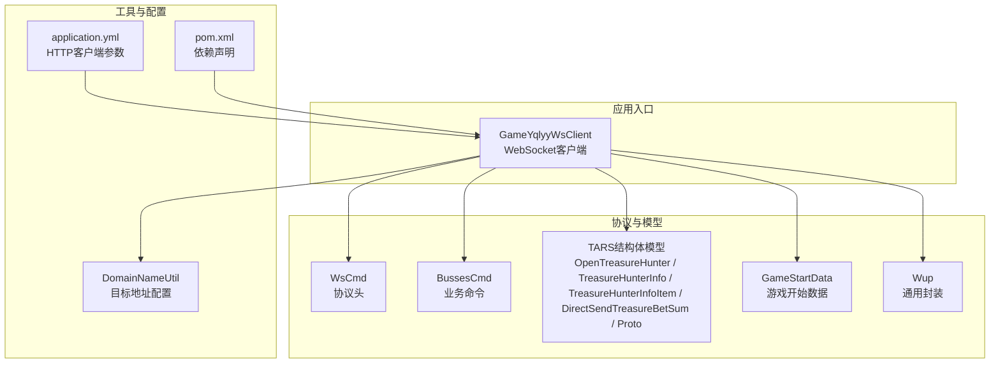
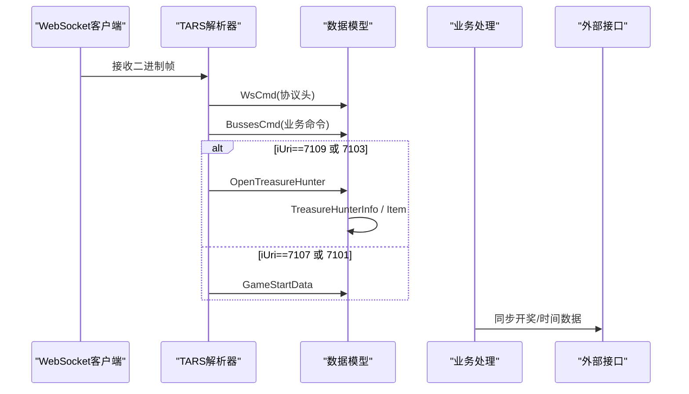
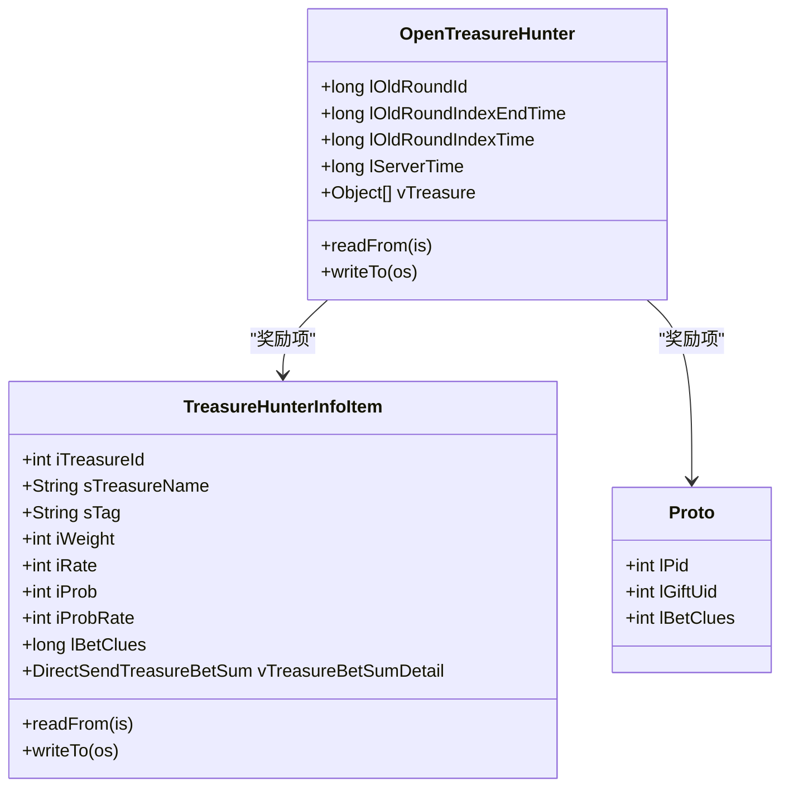
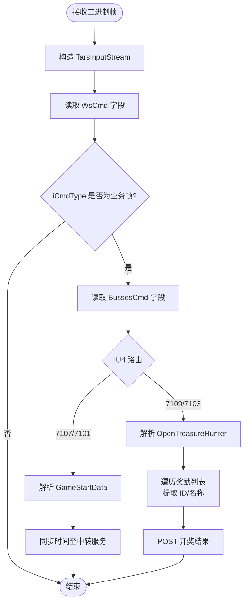
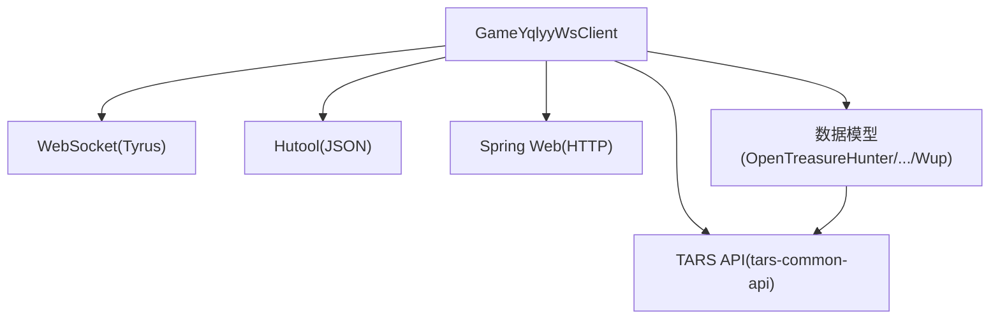

# 数据解析模块

<cite>
**本文引用的文件**
- [GameYqlyyWsClient.java](file://src/main/java/com/yqlyy/GameYqlyyWsClient.java)
- [OpenTreasureHunter.java](file://src/main/java/com/entity/AccountedNotify/OpenTreasureHunter.java)
- [TreasureHunterInfo.java](file://src/main/java/com/entity/AccountedNotify/TreasureHunterInfo.java)
- [TreasureHunterInfoItem.java](file://src/main/java/com/entity/AccountedNotify/TreasureHunterInfoItem.java)
- [DirectSendTreasureBetSum.java](file://src/main/java/com/entity/AccountedNotify/DirectSendTreasureBetSum.java)
- [Proto.java](file://src/main/java/com/entity/AccountedNotify/Proto.java)
- [GameStartData.java](file://src/main/java/com/entity/GameStartData.java)
- [WsCmd.java](file://src/main/java/com/entity/WsCmd.java)
- [BussesCmd.java](file://src/main/java/com/entity/BussesCmd.java)
- [Wup.java](file://src/main/java/com/entity/Wup.java)
- [DomainNameUtil.java](file://src/main/java/com/utils/DomainNameUtil.java)
- [pom.xml](file://pom.xml)
- [application.yml](file://src/main/resources/application.yml)
</cite>

## 目录
1. [简介](#简介)
2. [项目结构](#项目结构)
3. [核心组件](#核心组件)
4. [架构总览](#架构总览)
5. [详细组件分析](#详细组件分析)
6. [依赖关系分析](#依赖关系分析)
7. [性能与内存优化](#性能与内存优化)
8. [故障排查指南](#故障排查指南)
9. [结论](#结论)
10. [附录](#附录)

## 简介
本技术文档聚焦于“数据解析模块”，系统性阐述基于 TARS 二进制协议的解析机制与数据模型设计，涵盖协议头解析、字段解码、数据类型转换、字节序处理、数据校验与错误恢复、性能优化与内存管理、以及实际解析示例与调试技巧。重点分析的核心实体包括 OpenTreasureHunter、GameStartData、TreasureHunterInfo、TreasureHunterInfoItem、DirectSendTreasureBetSum、Proto 等，并展示从 WebSocket 接收的二进制消息到 Java 对象的完整转换流程。

## 项目结构
该项目采用按领域分层的包结构组织，数据解析主要集中在 com.entity 与 com.yqlyy 包内：
- com.entity：存放所有数据模型与协议载体（如 WsCmd、BussesCmd、Wup、GameStartData 等）
- com.entity.AccountedNotify：存放与“开宝箱/开奖结果”相关的结构化数据模型（如 OpenTreasureHunter、TreasureHunterInfo、TreasureHunterInfoItem、DirectSendTreasureBetSum、Proto）
- com.yqlyy：业务接入层，负责 WebSocket 消息接收、TARS 解析、业务路由与数据转发
- com.utils：通用工具类（如域名配置）

图表来源
- [GameYqlyyWsClient.java](file://src/main/java/com/yqlyy/GameYqlyyWsClient.java#L52-L219)
- [WsCmd.java](file://src/main/java/com/entity/WsCmd.java#L1-L69)
- [BussesCmd.java](file://src/main/java/com/entity/BussesCmd.java#L1-L10)
- [OpenTreasureHunter.java](file://src/main/java/com/entity/AccountedNotify/OpenTreasureHunter.java#L10-L83)
- [TreasureHunterInfo.java](file://src/main/java/com/entity/AccountedNotify/TreasureHunterInfo.java#L10-L44)
- [TreasureHunterInfoItem.java](file://src/main/java/com/entity/AccountedNotify/TreasureHunterInfoItem.java#L8-L124)
- [DirectSendTreasureBetSum.java](file://src/main/java/com/entity/AccountedNotify/DirectSendTreasureBetSum.java#L5-L8)
- [Proto.java](file://src/main/java/com/entity/AccountedNotify/Proto.java#L3-L7)
- [GameStartData.java](file://src/main/java/com/entity/GameStartData.java#L3-L79)
- [Wup.java](file://src/main/java/com/entity/Wup.java#L6-L28)
- [DomainNameUtil.java](file://src/main/java/com/utils/DomainNameUtil.java#L3-L15)
- [application.yml](file://src/main/resources/application.yml#L1-L31)
- [pom.xml](file://pom.xml#L26-L111)

章节来源
- [GameYqlyyWsClient.java](file://src/main/java/com/yqlyy/GameYqlyyWsClient.java#L52-L219)
- [pom.xml](file://pom.xml#L26-L111)

## 核心组件
- 协议头模型 WsCmd：承载 TARS 协议头字段（指令类型、数据体、请求ID、加密类型、时间戳、MD5 等），用于识别与分流后续二进制负载。
- 业务命令模型 BussesCmd：承载业务推送类型、URI 与消息体，作为不同业务场景的路由标识。
- TARS 结构体模型：
  - OpenTreasureHunter：继承 TarsStructBase，定义了开宝箱相关的时间戳、轮次ID与奖励列表字段，并通过 readFrom/readTo 完成二进制序列化/反序列化。
  - TreasureHunterInfo：包含单个奖励项原型与奖励列表，readFrom 将输入流解析为原型对象。
  - TreasureHunterInfoItem：具体奖励项的字段集合（ID、名称、标签、权重、概率、线索值、奖励明细等）。
  - DirectSendTreasureBetSum：奖励汇总结构，包含 Proto 原型与数组值。
  - Proto：最小奖励单元的字段（礼物ID、UID、下注线索）。
- 游戏开始数据 GameStartData：记录当前/历史轮次ID、时间戳与服务器时间等。
- 通用封装 Wup：承载 TARS 报文版本、包类型、消息类型、请求ID、服务名、函数名、缓冲区、上下文与状态等。

章节来源
- [WsCmd.java](file://src/main/java/com/entity/WsCmd.java#L3-L68)
- [BussesCmd.java](file://src/main/java/com/entity/BussesCmd.java#L3-L9)
- [OpenTreasureHunter.java](file://src/main/java/com/entity/AccountedNotify/OpenTreasureHunter.java#L10-L83)
- [TreasureHunterInfo.java](file://src/main/java/com/entity/AccountedNotify/TreasureHunterInfo.java#L10-L44)
- [TreasureHunterInfoItem.java](file://src/main/java/com/entity/AccountedNotify/TreasureHunterInfoItem.java#L8-L124)
- [DirectSendTreasureBetSum.java](file://src/main/java/com/entity/AccountedNotify/DirectSendTreasureBetSum.java#L5-L8)
- [Proto.java](file://src/main/java/com/entity/AccountedNotify/Proto.java#L3-L7)
- [GameStartData.java](file://src/main/java/com/entity/GameStartData.java#L3-L79)
- [Wup.java](file://src/main/java/com/entity/Wup.java#L6-L28)

## 架构总览
WebSocket 接收二进制帧后，由 GameYqlyyWsClient 进行协议头解析与业务路由，随后根据 iUri 选择对应的数据模型进行 TARS 字段解码与对象构建，最终完成业务数据的提取与外部同步。

图表来源
- [GameYqlyyWsClient.java](file://src/main/java/com/yqlyy/GameYqlyyWsClient.java#L52-L219)
- [WsCmd.java](file://src/main/java/com/entity/WsCmd.java#L3-L68)
- [BussesCmd.java](file://src/main/java/com/entity/BussesCmd.java#L3-L9)
- [OpenTreasureHunter.java](file://src/main/java/com/entity/AccountedNotify/OpenTreasureHunter.java#L10-L83)
- [TreasureHunterInfo.java](file://src/main/java/com/entity/AccountedNotify/TreasureHunterInfo.java#L10-L44)
- [TreasureHunterInfoItem.java](file://src/main/java/com/entity/AccountedNotify/TreasureHunterInfoItem.java#L8-L124)
- [GameStartData.java](file://src/main/java/com/entity/GameStartData.java#L3-L79)

## 详细组件分析

### TARS 协议解析与字节序处理
- TARS 输入流：使用 com.qq.tars.protocol.tars.TarsInputStream 从字节数组构造输入流，按字段编号顺序读取。
- 字段编号与类型：各模型在 readFrom 中以固定字段编号读取对应类型（整型、长整型、字符串、数组、嵌套结构体），编号即为协议定义的字段序号。
- 字节序：TARS 规范通常采用网络字节序（大端），TarsInputStream 在内部处理字节序转换，上层无需额外处理。
- 类型转换：TARS 流中的基本类型与 Java 基本类型一一映射；容器类型（如 List、数组）通过 readArray/readList 等方法解析。

章节来源
- [OpenTreasureHunter.java](file://src/main/java/com/entity/AccountedNotify/OpenTreasureHunter.java#L73-L81)
- [TreasureHunterInfoItem.java](file://src/main/java/com/entity/AccountedNotify/TreasureHunterInfoItem.java#L111-L122)
- [TreasureHunterInfo.java](file://src/main/java/com/entity/AccountedNotify/TreasureHunterInfo.java#L38-L42)

### 协议头解析（WsCmd）
- 字段含义：
  - iCmdType：协议头指令类型，用于判断是否为业务推送帧。
  - vData：业务数据体字节数组。
  - lRequestId：请求ID。
  - traceId：链路追踪ID。
  - iEncryptType：加密类型。
  - lTime：时间戳。
  - sMD5：数据摘要。
- 解析流程：从原始二进制构造 TarsInputStream，依次读取上述字段，仅当 iCmdType 为特定值时继续解析业务负载。

章节来源
- [WsCmd.java](file://src/main/java/com/entity/WsCmd.java#L3-L68)
- [GameYqlyyWsClient.java](file://src/main/java/com/yqlyy/GameYqlyyWsClient.java#L61-L68)

### 业务命令解析（BussesCmd）
- 字段含义：
  - ePushType：推送类型（未在当前解析中使用）。
  - iUri：业务URI，决定后续解析分支（7109/7103 开宝箱，7107/7101 游戏开始）。
  - sMsg：业务消息体字节数组。
- 解析流程：读取 iUri 与 sMsg，按 URI 分支进入不同模型解析。

章节来源
- [BussesCmd.java](file://src/main/java/com/entity/BussesCmd.java#L3-L9)
- [GameYqlyyWsClient.java](file://src/main/java/com/yqlyy/GameYqlyyWsClient.java#L70-L74)

### 开宝箱数据模型（OpenTreasureHunter）
- 设计意图：承载一轮开宝箱的轮次信息与奖励列表，奖励列表为混合类型容器（包含 TreasureHunterInfoItem 与 Proto 列表）。
- 关键字段：
  - lOldRoundId、lOldRoundIndexTime、lOldRoundIndexEndTime：历史轮次相关时间戳与ID。
  - lServerTime：服务器时间。
  - vTreasure：奖励集合，包含 TreasureHunterInfoItem 与 Proto 列表。
- 解码逻辑：readFrom 按字段编号读取轮次与服务器时间，再通过 readArray 读取奖励列表。

图表来源
- [OpenTreasureHunter.java](file://src/main/java/com/entity/AccountedNotify/OpenTreasureHunter.java#L10-L83)
- [TreasureHunterInfoItem.java](file://src/main/java/com/entity/AccountedNotify/TreasureHunterInfoItem.java#L8-L124)
- [Proto.java](file://src/main/java/com/entity/AccountedNotify/Proto.java#L3-L7)

章节来源
- [OpenTreasureHunter.java](file://src/main/java/com/entity/AccountedNotify/OpenTreasureHunter.java#L10-L83)
- [TreasureHunterInfoItem.java](file://src/main/java/com/entity/AccountedNotify/TreasureHunterInfoItem.java#L8-L124)
- [Proto.java](file://src/main/java/com/entity/AccountedNotify/Proto.java#L3-L7)

### 奖励明细结构（DirectSendTreasureBetSum 与 TreasureHunterInfo）
- DirectSendTreasureBetSum：包含 Proto 原型与数组值，用于描述奖励明细的结构化数据。
- TreasureHunterInfo：包含单个原型对象与列表，readFrom 将输入流解析为原型对象，便于后续统一处理。

章节来源
- [DirectSendTreasureBetSum.java](file://src/main/java/com/entity/AccountedNotify/DirectSendTreasureBetSum.java#L5-L8)
- [TreasureHunterInfo.java](file://src/main/java/com/entity/AccountedNotify/TreasureHunterInfo.java#L10-L44)

### 游戏开始数据模型（GameStartData）
- 设计意图：记录游戏轮次开始时的历史与当前时间戳、轮次ID与服务器时间等关键时间点，用于同步至中转服务。
- 关键字段：lOldRoundId、lOldRoundIndexTime、lOldRoundIndexEndTime、lRoundId、lRoundIndexTime、lRoundIndexEndTime、lServerTime、lTimeParam。
- 解码逻辑：按字段编号读取相应时间戳与ID，用于后续时间同步请求。

章节来源
- [GameStartData.java](file://src/main/java/com/entity/GameStartData.java#L3-L79)
- [GameYqlyyWsClient.java](file://src/main/java/com/yqlyy/GameYqlyyWsClient.java#L122-L133)

### 通用封装（Wup）
- 设计意图：承载 TARS 报文的通用元信息（版本、包类型、消息类型、请求ID、服务名、函数名、缓冲区、上下文与状态），便于跨服务复用。
- 关键字段：iVersion、cPacketType、iMessageType、iRequestId、sServantName、sFuncName、sBuffer、iTimeout、context、status、data、newdata。

章节来源
- [Wup.java](file://src/main/java/com/entity/Wup.java#L6-L28)

### 数据解析流程（WebSocket → Java 对象）

图表来源
- [GameYqlyyWsClient.java](file://src/main/java/com/yqlyy/GameYqlyyWsClient.java#L52-L219)
- [OpenTreasureHunter.java](file://src/main/java/com/entity/AccountedNotify/OpenTreasureHunter.java#L73-L81)
- [GameStartData.java](file://src/main/java/com/entity/GameStartData.java#L122-L133)

## 依赖关系分析
- 外部依赖：
  - tars-common-api：提供 TARS 输入/输出流与结构体基类（TarsStructBase）。
  - jakarta.websocket-client-api 与 tyrus-standalone-client：WebSocket 客户端能力。
  - hutool：JSON 工具（用于构造/解析 JSON）。
  - spring-boot-starter-web：HTTP 客户端（RestTemplateUtils）。
- 内部依赖：
  - GameYqlyyWsClient 依赖各数据模型与工具类（DomainNameUtil）。
  - 数据模型之间存在组合关系（OpenTreasureHunter 组合 TreasureHunterInfoItem/Proto；TreasureHunterInfo 组合 TreasureHunterInfoItem）。

图表来源
- [pom.xml](file://pom.xml#L52-L70)
- [GameYqlyyWsClient.java](file://src/main/java/com/yqlyy/GameYqlyyWsClient.java#L12-L13)

章节来源
- [pom.xml](file://pom.xml#L26-L111)
- [GameYqlyyWsClient.java](file://src/main/java/com/yqlyy/GameYqlyyWsClient.java#L12-L13)

## 性能与内存优化
- 二进制解析：
  - 使用 TarsInputStream 逐字段读取，避免一次性拷贝整个消息体，降低内存峰值。
  - 对数组/列表采用 readArray/readList，按需解析，减少不必要的对象创建。
- 缓冲区与连接：
  - WebSocket 客户端设置最大二进制消息缓冲区大小，防止异常消息导致内存暴涨。
  - HTTP 客户端参数在 application.yml 中集中配置，控制连接池、超时与并发。
- 对象复用：
  - 首次构造 OpenTreasureHunter 时初始化 vTreasure 的默认元素，避免频繁扩容与重复实例化。
- 日志与调试：
  - 保留必要的日志输出（如字段编号与关键值），便于定位问题；生产环境建议调低日志级别。

章节来源
- [GameYqlyyWsClient.java](file://src/main/java/com/yqlyy/GameYqlyyWsClient.java#L250-L272)
- [application.yml](file://src/main/resources/application.yml#L16-L31)
- [OpenTreasureHunter.java](file://src/main/java/com/entity/AccountedNotify/OpenTreasureHunter.java#L17-L20)

## 故障排查指南
- 协议头不匹配：
  - 现象：iCmdType 非业务帧，直接返回。
  - 排查：确认上游推送是否正确设置 iCmdType。
- 业务路由错误：
  - 现象：iUri 不在支持范围，无后续解析。
  - 排查：核对 iUri 值与分支逻辑。
- 字段编号不一致：
  - 现象：readFrom 抛出异常或字段值异常。
  - 排查：对照协议定义，确认字段编号与类型一致。
- 数组/列表解析失败：
  - 现象：readArray 返回空或长度异常。
  - 排查：检查 sMsg 是否完整，确认容器元素类型与数量。
- 时间同步失败：
  - 现象：HTTP 请求异常或超时。
  - 排查：检查 transitUrls 与网络连通性，调整 application.yml 中的超时参数。

章节来源
- [GameYqlyyWsClient.java](file://src/main/java/com/yqlyy/GameYqlyyWsClient.java#L65-L67)
- [GameYqlyyWsClient.java](file://src/main/java/com/yqlyy/GameYqlyyWsClient.java#L136-L147)
- [application.yml](file://src/main/resources/application.yml#L22-L26)

## 结论
本模块围绕 TARS 二进制协议，通过清晰的协议头与业务命令模型，结合结构化的数据模型，实现了从 WebSocket 二进制帧到 Java 对象的高效解析与业务处理。通过对字段编号、容器类型与时间同步的严格遵循，保证了解析的稳定性与一致性。建议在后续迭代中补充更完善的错误恢复与重试机制，并持续优化日志与监控覆盖。

## 附录

### 数据验证规则与约束
- 字段编号必须与协议定义一致，否则解析失败。
- 数组/列表字段需确保元素类型与数量符合预期。
- 时间戳字段应满足单调递增与业务语义（如旧轮次时间早于当前轮次）。
- URI 必须在白名单范围内，否则忽略该帧。

### 实际解析示例与调试技巧
- 示例路径：
  - 开宝箱解析：参考 [GameYqlyyWsClient.java](file://src/main/java/com/yqlyy/GameYqlyyWsClient.java#L76-L120)，[OpenTreasureHunter.java](file://src/main/java/com/entity/AccountedNotify/OpenTreasureHunter.java#L73-L81)，[TreasureHunterInfoItem.java](file://src/main/java/com/entity/AccountedNotify/TreasureHunterInfoItem.java#L111-L122)
  - 游戏开始时间同步：参考 [GameYqlyyWsClient.java](file://src/main/java/com/yqlyy/GameYqlyyWsClient.java#L121-L148)，[GameStartData.java](file://src/main/java/com/entity/GameStartData.java#L122-L133)
- 调试技巧：
  - 打印字段编号与读取值，快速定位字段错位。
  - 使用 Base64 输出原始二进制，比对协议定义。
  - 逐步缩小解析范围，先解析协议头，再解析业务命令，最后解析模型。