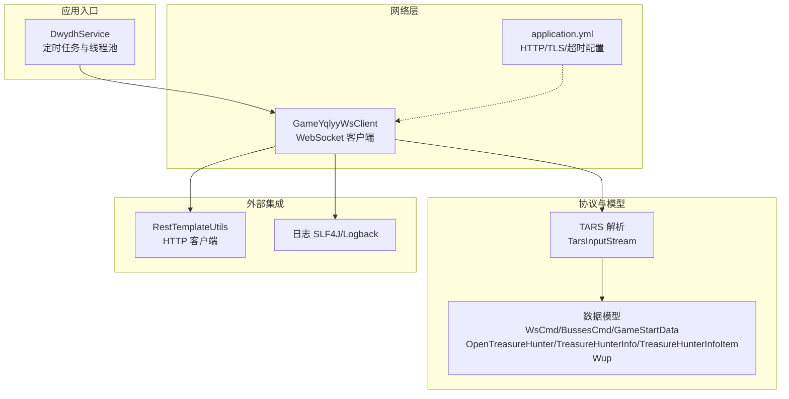
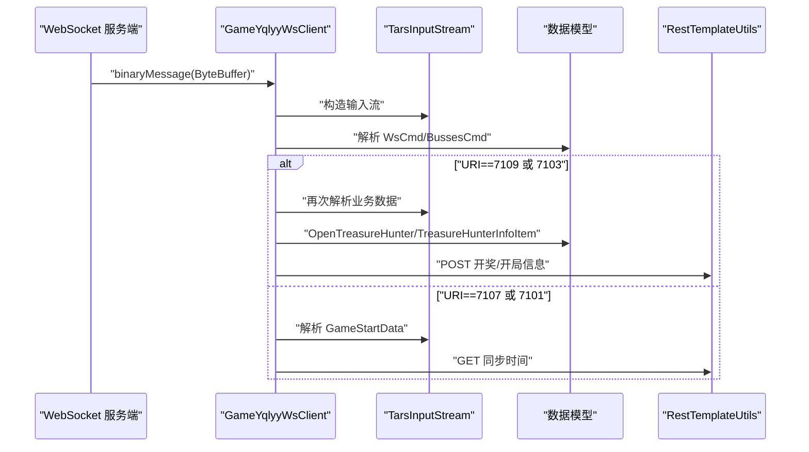
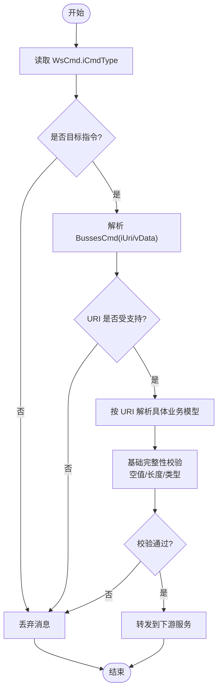
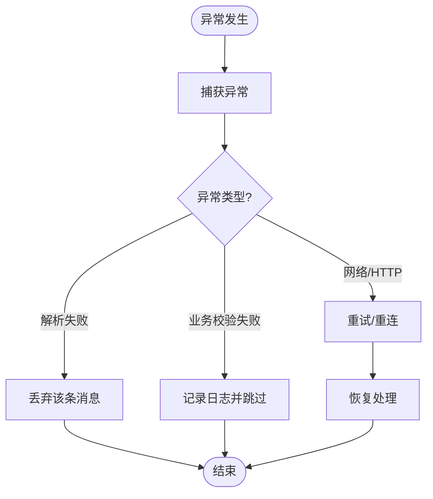
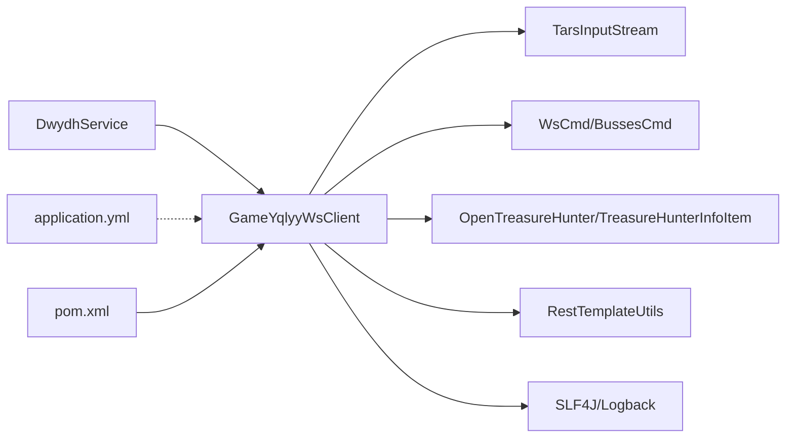

# 数据验证规则

<cite>
**本文引用的文件**
- [GameYqlyyWsClient.java](file://src/main/java/com/yqlyy/GameYqlyyWsClient.java)
- [OpenTreasureHunter.java](file://src/main/java/com/entity/AccountedNotify/OpenTreasureHunter.java)
- [TreasureHunterInfo.java](file://src/main/java/com/entity/AccountedNotify/TreasureHunterInfo.java)
- [TreasureHunterInfoItem.java](file://src/main/java/com/entity/AccountedNotify/TreasureHunterInfoItem.java)
- [DirectSendTreasureBetSum.java](file://src/main/java/com/entity/AccountedNotify/DirectSendTreasureBetSum.java)
- [Proto.java](file://src/main/java/com/entity/AccountedNotify/Proto.java)
- [WsCmd.java](file://src/main/java/com/entity/WsCmd.java)
- [BussesCmd.java](file://src/main/java/com/entity/BussesCmd.java)
- [GameStartData.java](file://src/main/java/com/entity/GameStartData.java)
- [Wup.java](file://src/main/java/com/entity/Wup.java)
- [DwydhService.java](file://src/main/java/com/dwydh/DwydhService.java)
- [application.yml](file://src/main/resources/application.yml)
- [pom.xml](file://pom.xml)
</cite>

## 目录
1. [简介](#简介)
2. [项目结构](#项目结构)
3. [核心组件](#核心组件)
4. [架构总览](#架构总览)
5. [详细组件分析](#详细组件分析)
6. [依赖关系分析](#依赖关系分析)
7. [性能考量](#性能考量)
8. [故障排查指南](#故障排查指南)
9. [结论](#结论)
10. [附录](#附录)

## 简介
本文件聚焦于数据验证规则与完整性保障，系统梳理以下方面：
- 数据模型中的字段类型检查、范围验证与格式校验
- TARS 协议解析过程中的数据完整性检查（含校验与错误数据过滤）
- 业务数据有效性验证（时间戳、数值范围、字符串格式）
- 验证失败的处理策略与错误恢复机制
- 数据质量监控与异常检测最佳实践
- 实际验证示例与调试技巧

## 项目结构
项目采用按领域分层的组织方式，WebSocket 接收与解析位于 yqlyy 包，数据模型位于 entity 包，定时任务与线程池调度在 dwydh 包，配置位于 resources。

图表来源
- [DwydhService.java](file://src/main/java/com/dwydh/DwydhService.java#L1-L39)
- [GameYqlyyWsClient.java](file://src/main/java/com/yqlyy/GameYqlyyWsClient.java#L1-L328)
- [application.yml](file://src/main/resources/application.yml#L1-L31)

章节来源
- [DwydhService.java](file://src/main/java/com/dwydh/DwydhService.java#L1-L39)
- [GameYqlyyWsClient.java](file://src/main/java/com/yqlyy/GameYqlyyWsClient.java#L1-L328)
- [application.yml](file://src/main/resources/application.yml#L1-L31)

## 核心组件
- WebSocket 客户端负责接收二进制帧，解析 TARS 协议，提取业务数据并转发到下游服务
- 数据模型承载协议字段与读写逻辑，部分模型继承 TARS 基类以支持序列化/反序列化
- 业务数据对象封装时间戳、标识符等关键字段，用于业务校验与转发

章节来源
- [GameYqlyyWsClient.java](file://src/main/java/com/yqlyy/GameYqlyyWsClient.java#L1-L328)
- [OpenTreasureHunter.java](file://src/main/java/com/entity/AccountedNotify/OpenTreasureHunter.java#L1-L83)
- [TreasureHunterInfo.java](file://src/main/java/com/entity/AccountedNotify/TreasureHunterInfo.java#L1-L44)
- [TreasureHunterInfoItem.java](file://src/main/java/com/entity/AccountedNotify/TreasureHunterInfoItem.java#L1-L124)
- [WsCmd.java](file://src/main/java/com/entity/WsCmd.java#L1-L69)
- [BussesCmd.java](file://src/main/java/com/entity/BussesCmd.java#L1-L10)
- [GameStartData.java](file://src/main/java/com/entity/GameStartData.java#L1-L79)
- [Wup.java](file://src/main/java/com/entity/Wup.java#L1-L28)

## 架构总览
WebSocket 接收二进制帧后，通过 TARS 输入流解析出命令类型与业务载荷；根据 URI 分发到不同业务处理器，完成数据提取与转发。

图表来源
- [GameYqlyyWsClient.java](file://src/main/java/com/yqlyy/GameYqlyyWsClient.java#L52-L219)
- [WsCmd.java](file://src/main/java/com/entity/WsCmd.java#L1-L69)
- [BussesCmd.java](file://src/main/java/com/entity/BussesCmd.java#L1-L10)
- [OpenTreasureHunter.java](file://src/main/java/com/entity/AccountedNotify/OpenTreasureHunter.java#L1-L83)
- [TreasureHunterInfoItem.java](file://src/main/java/com/entity/AccountedNotify/TreasureHunterInfoItem.java#L1-L124)
- [GameStartData.java](file://src/main/java/com/entity/GameStartData.java#L1-L79)

## 详细组件分析

### TARS 协议解析与数据完整性检查
- 指令类型过滤：仅处理特定命令类型（例如 iCmdType==7），非目标指令直接丢弃，避免无效数据进入后续流程
- 字段索引与类型匹配：使用 TARS 输入流按固定字段序号读取，确保字段顺序与类型一致
- 数组/列表读取：通过 readArray 读取集合，结合空值与长度检查进行基础完整性校验
- 错误数据过滤：当 URI 不匹配或解析失败时，记录日志并跳过处理，防止异常数据污染下游

图表来源
- [GameYqlyyWsClient.java](file://src/main/java/com/yqlyy/GameYqlyyWsClient.java#L61-L219)
- [WsCmd.java](file://src/main/java/com/entity/WsCmd.java#L1-L69)
- [BussesCmd.java](file://src/main/java/com/entity/BussesCmd.java#L1-L10)

章节来源
- [GameYqlyyWsClient.java](file://src/main/java/com/yqlyy/GameYqlyyWsClient.java#L61-L219)

### 数据模型与字段验证规则

#### WsCmd（WebSocket 命令）
- 字段类型：整型、字节数组、长整型、字符串、整型
- 校验要点：
  - iCmdType：作为过滤条件，应为预定义的业务指令码
  - vData：长度需大于 0，且能被后续解析器正确读取
  - lRequestId/traceId：建议进行格式校验（如 UUID/数字串）
  - lTime：建议进行时间戳有效性校验（非负、合理范围）
  - sMD5：若存在，建议进行长度与十六进制格式校验

章节来源
- [WsCmd.java](file://src/main/java/com/entity/WsCmd.java#L1-L69)

#### BussesCmd（总线命令）
- 字段类型：整型、长整型、字节数组
- 校验要点：
  - iUri：必须为受支持的业务 URI（如 7101/7103/7107/7109）
  - sMsg：长度需大于 0，且能被对应业务模型正确解析
  - iUri 与 sMsg 的一致性：URI 决定后续解析策略

章节来源
- [BussesCmd.java](file://src/main/java/com/entity/BussesCmd.java#L1-L10)

#### GameStartData（游戏开始数据）
- 字段类型：多个长整型（时间戳、轮次 ID 等）
- 校验要点：
  - 时间戳字段（如 lOldRoundIndexTime/lOldRoundIndexEndTime）应为非负数，且满足逻辑顺序（开始时间 ≤ 结束时间）
  - 轮次 ID（lOldRoundId/lRoundId）应为正整数
  - lTimeParam：建议进行范围校验（如 0~当前时间）

章节来源
- [GameStartData.java](file://src/main/java/com/entity/GameStartData.java#L1-L79)

#### OpenTreasureHunter（寻宝开启通知）
- 字段类型：长整型、列表（泛型为 Object）
- 校验要点：
  - 列表 vTreasure 非空且元素个数符合预期
  - 列表元素类型应为 TreasureHunterInfoItem 或 Proto（根据构造函数初始化）
  - 字段读取依赖 TARS 输入流，需确保字段索引与顺序一致

章节来源
- [OpenTreasureHunter.java](file://src/main/java/com/entity/AccountedNotify/OpenTreasureHunter.java#L1-L83)

#### TreasureHunterInfo/TreasureHunterInfoItem（寻宝者信息）
- 字段类型：整型（概率、权重、ID）、长整型（投注线索）、字符串（标签、图标、名称）
- 校验要点：
  - iTreasureId/iRate/iProb/iProbRate/iWeight：建议进行非负与合理范围校验
  - lBetClues：建议非负校验
  - sTreasureName/sTreasureIcon/sTag：建议长度与字符集校验（ASCII/Unicode）

章节来源
- [TreasureHunterInfo.java](file://src/main/java/com/entity/AccountedNotify/TreasureHunterInfo.java#L1-L44)
- [TreasureHunterInfoItem.java](file://src/main/java/com/entity/AccountedNotify/TreasureHunterInfoItem.java#L1-L124)

#### DirectSendTreasureBetSum/Proto（明细与礼物）
- 字段类型：整型（PID/GiftUid/BetClues）
- 校验要点：
  - 整型字段建议非负与合理范围校验
  - 若存在字符串字段，建议长度与格式校验

章节来源
- [DirectSendTreasureBetSum.java](file://src/main/java/com/entity/AccountedNotify/DirectSendTreasureBetSum.java#L1-L8)
- [Proto.java](file://src/main/java/com/entity/AccountedNotify/Proto.java#L1-L8)

#### Wup（通用上行包）
- 字段类型：短整型、字节、整型、字符串、字节数组、Map
- 校验要点：
  - iVersion/cPacketType/iMessageType：建议在允许范围内
  - sServantName/sFuncName：建议非空与格式校验
  - sBuffer：长度与内容需满足后续解析要求

章节来源
- [Wup.java](file://src/main/java/com/entity/Wup.java#L1-L28)

### 业务数据有效性验证规则

#### 时间戳验证
- 读取时间戳字段后，进行非负与范围校验（如不超过当前时间 + 容差）
- 对比开始/结束时间的逻辑顺序，确保开始时间 ≤ 结束时间

章节来源
- [GameYqlyyWsClient.java](file://src/main/java/com/yqlyy/GameYqlyyWsClient.java#L120-L148)
- [GameStartData.java](file://src/main/java/com/entity/GameStartData.java#L1-L79)

#### 数值范围检查
- 概率/权重/倍率等整型字段建议设置上下限
- 投注线索等长整型字段建议非负
- 轮次 ID/指令码等整型字段建议正数

章节来源
- [TreasureHunterInfoItem.java](file://src/main/java/com/entity/AccountedNotify/TreasureHunterInfoItem.java#L1-L124)
- [OpenTreasureHunter.java](file://src/main/java/com/entity/AccountedNotify/OpenTreasureHunter.java#L1-L83)

#### 字符串格式验证
- 名称/标签/图标等字符串字段建议长度限制与字符集校验
- traceId/lRequestId 等建议 UUID/数字串格式校验

章节来源
- [WsCmd.java](file://src/main/java/com/entity/WsCmd.java#L1-L69)
- [TreasureHunterInfoItem.java](file://src/main/java/com/entity/AccountedNotify/TreasureHunterInfoItem.java#L1-L124)

### 数据验证失败的处理策略与错误恢复机制
- 过滤与丢弃：对不匹配的指令或 URI，直接丢弃并记录日志
- 异常捕获：对 HTTP 请求异常进行捕获与告警，不影响主流程继续运行
- 自动重连：WebSocket 断开后记录错误并尝试重新连接
- 日志与追踪：使用 SLF4J 记录关键事件与异常，便于问题定位

图表来源
- [GameYqlyyWsClient.java](file://src/main/java/com/yqlyy/GameYqlyyWsClient.java#L109-L114)
- [GameYqlyyWsClient.java](file://src/main/java/com/yqlyy/GameYqlyyWsClient.java#L245-L248)
- [GameYqlyyWsClient.java](file://src/main/java/com/yqlyy/GameYqlyyWsClient.java#L270-L271)

章节来源
- [GameYqlyyWsClient.java](file://src/main/java/com/yqlyy/GameYqlyyWsClient.java#L109-L114)
- [GameYqlyyWsClient.java](file://src/main/java/com/yqlyy/GameYqlyyWsClient.java#L245-L248)
- [GameYqlyyWsClient.java](file://src/main/java/com/yqlyy/GameYqlyyWsClient.java#L270-L271)

### 数据质量监控与异常检测最佳实践
- 指标采集：统计指令类型分布、URI 成功率、解析耗时、HTTP 请求成功率
- 告警阈值：设定失败率、超时率、异常日志量阈值触发告警
- 日志分级：区分 info/warn/error，关键路径输出 traceId/RequestId 便于追踪
- 健康检查：定期探测 WebSocket 连接状态与下游服务可用性

（本节为通用指导，无需列出章节来源）

## 依赖关系分析

图表来源
- [DwydhService.java](file://src/main/java/com/dwydh/DwydhService.java#L1-L39)
- [GameYqlyyWsClient.java](file://src/main/java/com/yqlyy/GameYqlyyWsClient.java#L1-L328)
- [application.yml](file://src/main/resources/application.yml#L1-L31)
- [pom.xml](file://pom.xml#L1-L160)

章节来源
- [DwydhService.java](file://src/main/java/com/dwydh/DwydhService.java#L1-L39)
- [GameYqlyyWsClient.java](file://src/main/java/com/yqlyy/GameYqlyyWsClient.java#L1-L328)
- [application.yml](file://src/main/resources/application.yml#L1-L31)
- [pom.xml](file://pom.xml#L1-L160)

## 性能考量
- 连接与缓冲：WebSocket 容器默认缓冲区较大，有助于减少粘包/拆包影响
- 超时配置：HTTP 客户端超时参数需与业务容忍度匹配，避免阻塞线程
- 线程池：使用 Spring 线程池执行长连接与上报任务，避免主线程阻塞

章节来源
- [application.yml](file://src/main/resources/application.yml#L16-L31)
- [DwydhService.java](file://src/main/java/com/dwydh/DwydhService.java#L1-L39)

## 故障排查指南
- WebSocket 连接失败：检查 wsUrl 与网络可达性，查看 onError 日志
- 消息被丢弃：确认 iCmdType 与 iUri 是否为目标值，检查 vData 长度
- HTTP 请求异常：关注 RestClientException 与通用异常，核对下游地址与鉴权
- 解析异常：核对字段索引与类型，确保上游协议版本一致

章节来源
- [GameYqlyyWsClient.java](file://src/main/java/com/yqlyy/GameYqlyyWsClient.java#L245-L248)
- [GameYqlyyWsClient.java](file://src/main/java/com/yqlyy/GameYqlyyWsClient.java#L109-L114)
- [GameYqlyyWsClient.java](file://src/main/java/com/yqlyy/GameYqlyyWsClient.java#L270-L271)

## 结论
本项目通过严格的 TARS 协议过滤与字段级校验，结合业务层面的时间戳与数值范围验证，实现了对异常数据的有效拦截。配合完善的日志与错误恢复机制，能够在复杂网络环境下保持数据处理的稳定性与可靠性。建议在现有基础上进一步引入指标监控与告警体系，持续提升数据质量与系统可观测性。

## 附录
- 实际验证示例与调试技巧
  - 在解析前打印关键字段（如 iCmdType/iUri），便于快速定位问题
  - 对 vData 进行 Base64 编码输出，辅助对比协议一致性
  - 对异常路径补充单元测试样例，覆盖边界值与非法输入

章节来源
- [GameYqlyyWsClient.java](file://src/main/java/com/yqlyy/GameYqlyyWsClient.java#L52-L120)
- [WsCmd.java](file://src/main/java/com/entity/WsCmd.java#L1-L69)
- [BussesCmd.java](file://src/main/java/com/entity/BussesCmd.java#L1-L10)