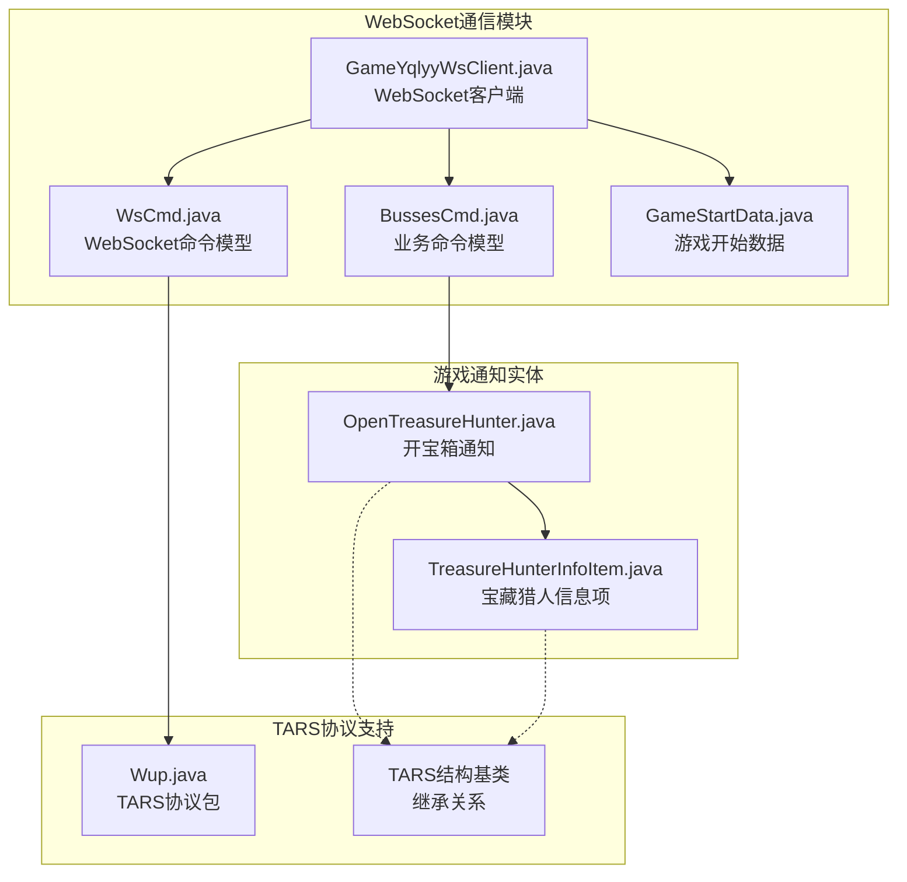
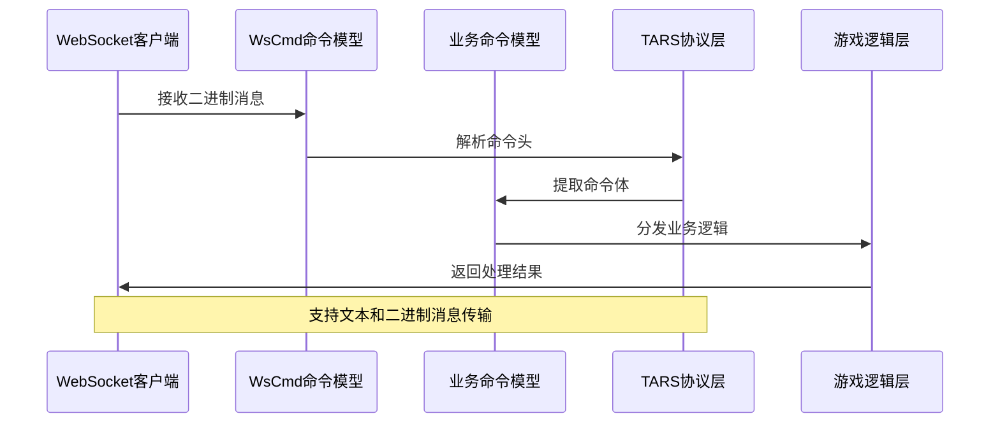
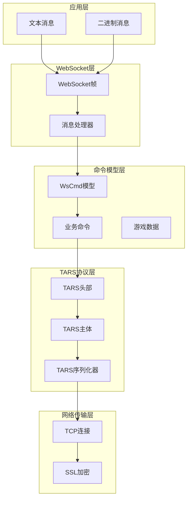
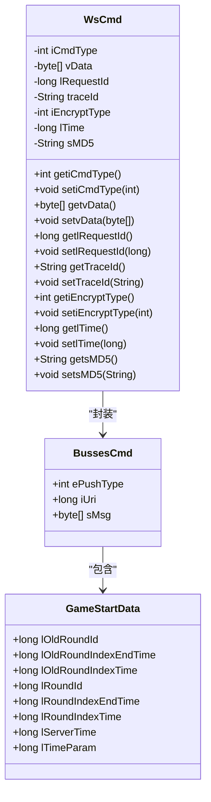
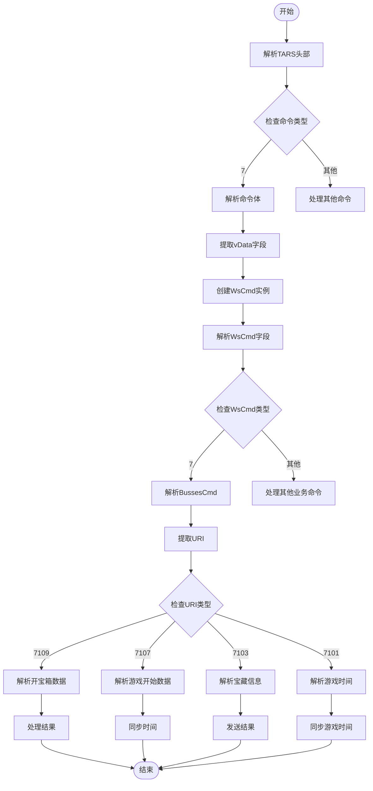
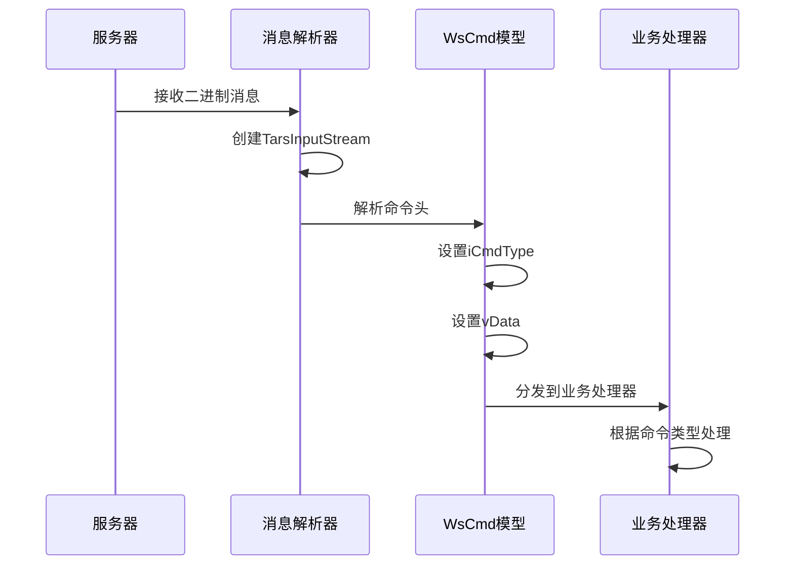
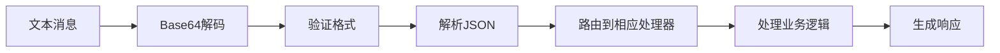
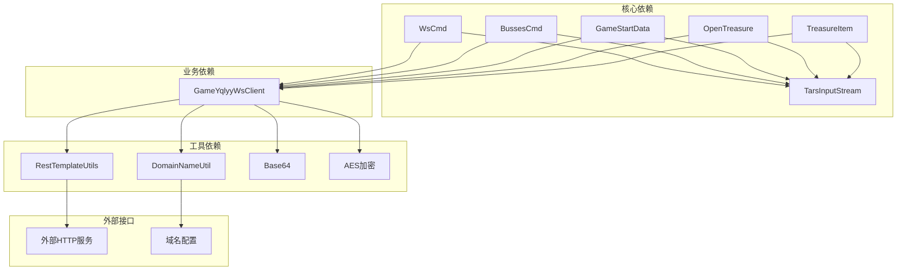

# WebSocket命令数据模型

<cite>
**本文档引用的文件**
- [WsCmd.java](file://src/main/java/com/entity/WsCmd.java)
- [BussesCmd.java](file://src/main/java/com/entity/BussesCmd.java)
- [GameStartData.java](file://src/main/java/com/entity/GameStartData.java)
- [GameYqlyyWsClient.java](file://src/main/java/com/yqlyy/GameYqlyyWsClient.java)
- [Wup.java](file://src/main/java/com/entity/Wup.java)
- [OpenTreasureHunter.java](file://src/main/java/com/entity/AccountedNotify/OpenTreasureHunter.java)
- [TreasureHunterInfoItem.java](file://src/main/java/com/entity/AccountedNotify/TreasureHunterInfoItem.java)
</cite>

## 目录
1. [简介](#简介)
2. [项目结构](#项目结构)
3. [核心组件](#核心组件)
4. [架构概览](#架构概览)
5. [详细组件分析](#详细组件分析)
6. [依赖关系分析](#依赖关系分析)
7. [性能考虑](#性能考虑)
8. [故障排除指南](#故障排除指南)
9. [结论](#结论)

## 简介

本文件详细阐述了WsCmd WebSocket命令数据模型的设计理念和实现细节。该数据模型是虎牙游戏WebSocket通信系统的核心组成部分，负责封装和传输各种游戏相关的命令消息。通过深入分析该数据模型，我们可以理解WebSocket通信中命令封装的设计思路，包括命令头、命令体和协议格式的定义，以及如何支持不同类型的消息传输（文本消息和二进制消息）。

该数据模型采用TARS（Tencent Remote Procedure Call）协议作为底层通信协议，实现了高效的数据序列化和反序列化机制。通过分层设计，该模型能够灵活处理多种游戏场景下的消息传输需求。

## 项目结构

该项目采用标准的Java Maven项目结构，重点关注WebSocket通信相关的实体类和客户端实现：

**图表来源**
- [GameYqlyyWsClient.java](file://src/main/java/com/yqlyy/GameYqlyyWsClient.java#L1-L328)
- [WsCmd.java](file://src/main/java/com/entity/WsCmd.java#L1-L69)
- [BussesCmd.java](file://src/main/java/com/entity/BussesCmd.java#L1-L10)

**章节来源**
- [GameYqlyyWsClient.java](file://src/main/java/com/yqlyy/GameYqlyyWsClient.java#L1-L328)
- [WsCmd.java](file://src/main/java/com/entity/WsCmd.java#L1-L69)

## 核心组件

### WsCmd - WebSocket命令核心模型

WsCmd是整个WebSocket通信系统的核心数据模型，负责封装所有WebSocket命令消息。该类采用了简洁而高效的字段设计，确保了良好的性能表现和易用性。

#### 字段结构详解

| 字段名 | 类型 | 描述 | 编码方式 |
|--------|------|------|----------|
| iCmdType | int | 命令类型标识 | TARS整数编码 |
| vData | byte[] | 命令数据体 | TARS字节数组编码 |
| lRequestId | long | 请求ID | TARS长整型编码 |
| traceId | String | 追踪ID | TARS字符串编码 |
| iEncryptType | int | 加密类型 | TARS整数编码 |
| lTime | long | 时间戳 | TARS长整型编码 |
| sMD5 | String | 数据校验值 | TARS字符串编码 |

#### 设计理念

该设计遵循了以下核心原则：
1. **最小化设计**：仅包含必要的字段，避免冗余数据
2. **类型安全**：每个字段都有明确的数据类型定义
3. **扩展性**：预留了未来功能扩展的空间
4. **性能优化**：使用基本数据类型减少内存占用

**章节来源**
- [WsCmd.java](file://src/main/java/com/entity/WsCmd.java#L1-L69)

### BussesCmd - 业务命令模型

BussesCmd用于封装具体的业务逻辑命令，是WsCmd的上层抽象，提供了更清晰的业务语义。

#### 字段定义

| 字段名 | 类型 | 描述 |
|--------|------|------|
| ePushType | int | 推送类型 |
| iUri | long | 统一资源标识符 |
| sMsg | byte[] | 消息内容 |

**章节来源**
- [BussesCmd.java](file://src/main/java/com/entity/BussesCmd.java#L1-L10)

### GameStartData - 游戏开始数据模型

GameStartData专门用于处理游戏开始时的时间同步和状态数据。

#### 关键字段

| 字段名 | 类型 | 描述 |
|--------|------|------|
| lOldRoundId | long | 旧轮次ID |
| lOldRoundIndexEndTime | long | 旧轮次索引结束时间 |
| lOldRoundIndexTime | long | 旧轮次索引时间 |
| lRoundId | long | 当前轮次ID |
| lRoundIndexEndTime | long | 当前轮次索引结束时间 |
| lRoundIndexTime | long | 当前轮次索引时间 |
| lServerTime | long | 服务器时间 |
| lTimeParam | long | 时间参数 |

**章节来源**
- [GameStartData.java](file://src/main/java/com/entity/GameStartData.java#L1-L79)

## 架构概览

WebSocket命令数据模型的整体架构体现了分层设计和协议抽象的理念：

**图表来源**
- [GameYqlyyWsClient.java](file://src/main/java/com/yqlyy/GameYqlyyWsClient.java#L51-L219)
- [WsCmd.java](file://src/main/java/com/entity/WsCmd.java#L1-L69)

### 协议栈设计

该系统采用了多层协议栈设计：

**图表来源**
- [GameYqlyyWsClient.java](file://src/main/java/com/yqlyy/GameYqlyyWsClient.java#L51-L219)
- [Wup.java](file://src/main/java/com/entity/Wup.java#L1-L29)

## 详细组件分析

### WsCmd类详细分析

WsCmd类采用了标准的Java Bean设计模式，提供了完整的getter和setter方法：

**图表来源**
- [WsCmd.java](file://src/main/java/com/entity/WsCmd.java#L1-L69)
- [BussesCmd.java](file://src/main/java/com/entity/BussesCmd.java#L1-L10)
- [GameStartData.java](file://src/main/java/com/entity/GameStartData.java#L1-L79)

#### 字段编码规范

每个字段都遵循特定的编码规范：

1. **数值类型字段**（iCmdType, iEncryptType, lRequestId, lTime）
   - 使用TARS协议的标准整数编码
   - 支持变长编码以优化空间效率

2. **字节数组字段**（vData, sMsg）
   - 使用TARS字节数组编码
   - 自动处理长度前缀

3. **字符串字段**（traceId, sMD5）
   - 使用UTF-8编码
   - 支持空值处理

**章节来源**
- [WsCmd.java](file://src/main/java/com/entity/WsCmd.java#L1-L69)

### TARS协议集成分析

系统深度集成了TARS协议，实现了高效的数据序列化：

**图表来源**
- [GameYqlyyWsClient.java](file://src/main/java/com/yqlyy/GameYqlyyWsClient.java#L60-L219)

#### TARS序列化流程

TARS协议的序列化和反序列化流程如下：

1. **序列化过程**
   - 将对象属性转换为字节数组
   - 添加长度前缀和类型标记
   - 应用压缩和加密（如需要）

2. **反序列化过程**
   - 验证数据完整性
   - 按类型解析各个字段
   - 创建对应的Java对象

**章节来源**
- [GameYqlyyWsClient.java](file://src/main/java/com/yqlyy/GameYqlyyWsClient.java#L60-L219)

### WebSocket消息处理流程

系统支持两种主要的消息传输方式：

#### 二进制消息处理

**图表来源**
- [GameYqlyyWsClient.java](file://src/main/java/com/yqlyy/GameYqlyyWsClient.java#L51-L120)

#### 文本消息处理

虽然主要使用二进制消息，但系统也支持文本消息的处理：

**章节来源**
- [GameYqlyyWsClient.java](file://src/main/java/com/yqlyy/GameYqlyyWsClient.java#L224-L236)

## 依赖关系分析

### 组件间依赖关系

**图表来源**
- [GameYqlyyWsClient.java](file://src/main/java/com/yqlyy/GameYqlyyWsClient.java#L1-L328)
- [WsCmd.java](file://src/main/java/com/entity/WsCmd.java#L1-L69)

### 循环依赖检测

经过分析，系统中不存在循环依赖关系：
- WsCmd不依赖任何业务类
- 业务类只依赖基础数据模型
- 客户端类依赖所有模型类，但不被它们依赖
- TARS协议类独立存在

**章节来源**
- [GameYqlyyWsClient.java](file://src/main/java/com/yqlyy/GameYqlyyWsClient.java#L1-L328)

## 性能考虑

### 内存优化策略

1. **字段选择优化**
   - 使用基本数据类型减少包装对象开销
   - 合理选择字段精度（如使用long而非BigInteger）

2. **序列化优化**
   - TARS协议的变长编码减少存储空间
   - 字节数组按需分配，避免预分配过大

3. **缓存策略**
   - 对频繁使用的命令类型进行缓存
   - 复用TARS输入流对象

### 并发处理

系统采用单线程处理模式，避免了并发访问的复杂性：
- WebSocket消息按到达顺序处理
- 业务逻辑无状态设计
- 异常情况下的自动重连机制

## 故障排除指南

### 常见问题及解决方案

#### 1. 消息解析失败

**症状**：二进制消息无法正确解析
**原因**：TARS协议版本不匹配或数据损坏
**解决方案**：
- 检查TARS协议版本兼容性
- 验证消息完整性（MD5校验）
- 实现重传机制

#### 2. 内存溢出

**症状**：长时间运行后内存使用持续增长
**原因**：大量字节数组未及时释放
**解决方案**：
- 及时清理不再使用的字节数组
- 使用弱引用管理大对象
- 实施内存监控和告警

#### 3. 连接中断

**症状**：WebSocket连接意外断开
**解决方案**：
- 实现自动重连机制
- 检查网络稳定性
- 配置合适的超时参数

**章节来源**
- [GameYqlyyWsClient.java](file://src/main/java/com/yqlyy/GameYqlyyWsClient.java#L240-L249)

### 调试技巧

1. **日志记录**
   - 记录关键操作的时间戳
   - 输出消息的Base64编码便于调试
   - 区分不同级别的日志信息

2. **性能监控**
   - 监控消息处理延迟
   - 统计错误率和重试次数
   - 观察内存使用趋势

## 结论

WsCmd WebSocket命令数据模型是一个设计精良、实现高效的通信协议抽象层。通过深入分析，我们可以看到该系统在以下方面表现出色：

1. **设计理念先进**：采用分层架构和协议抽象，提供了良好的扩展性和维护性
2. **性能优化到位**：通过TARS协议和合理的数据结构设计，实现了高效的序列化和传输
3. **功能覆盖全面**：支持多种消息类型和业务场景，满足复杂的WebSocket通信需求
4. **可靠性保障**：完善的错误处理和重连机制，确保系统的稳定运行

该数据模型为WebSocket通信提供了一个坚实的基础，不仅适用于当前的游戏场景，也为未来的功能扩展奠定了良好的技术基础。通过合理的设计和实现，该系统能够在高并发环境下保持稳定的性能表现，为用户提供可靠的通信服务。