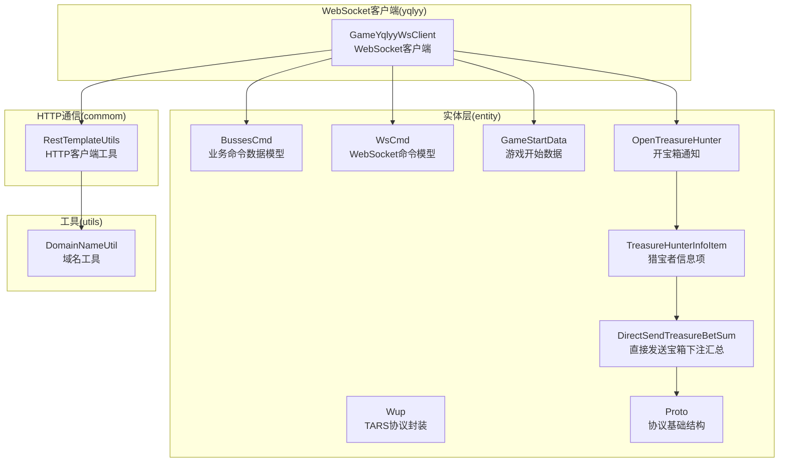
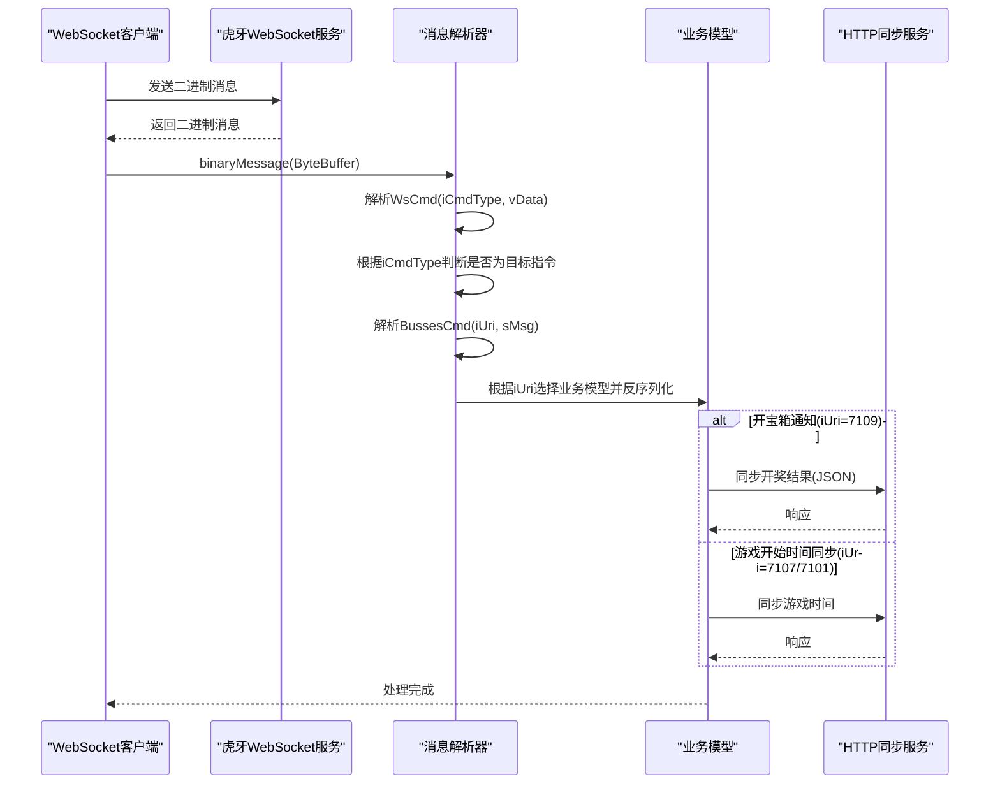
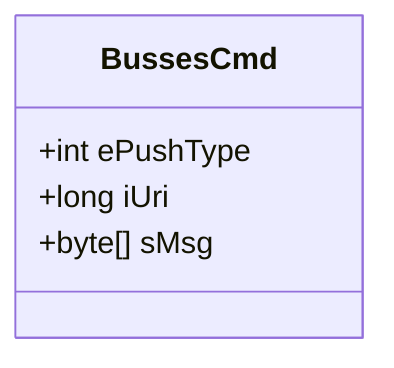
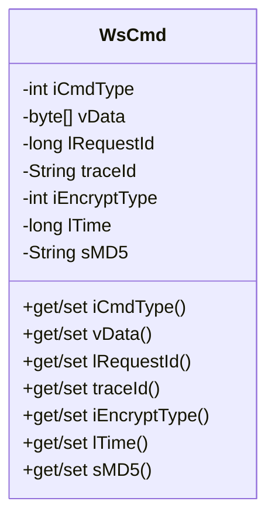
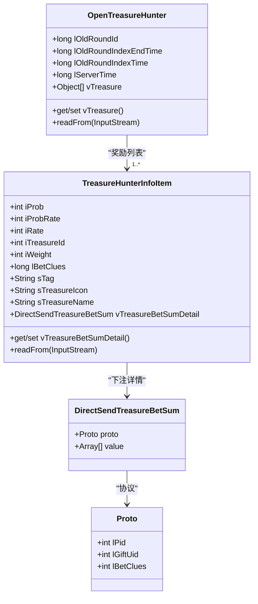
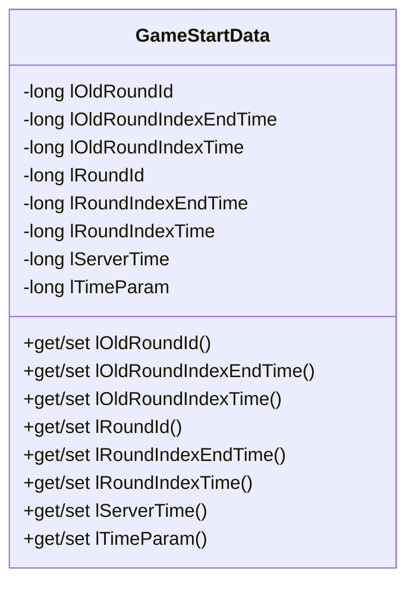
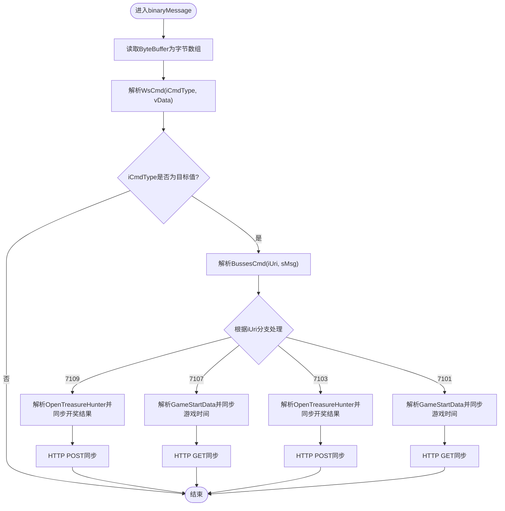
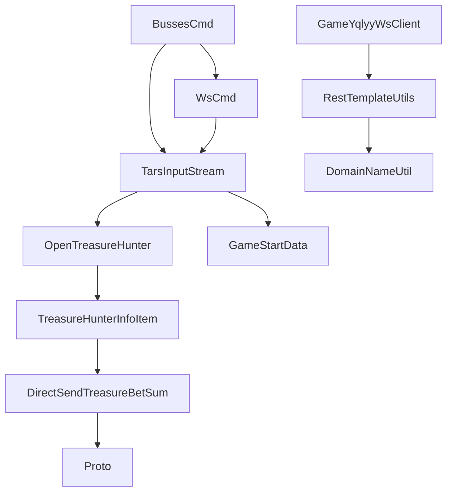

# 业务命令数据模型

<cite>
**本文档引用的文件**
- [BussesCmd.java](file://src/main/java/com/entity/BussesCmd.java)
- [WsCmd.java](file://src/main/java/com/entity/WsCmd.java)
- [Wup.java](file://src/main/java/com/entity/Wup.java)
- [GameYqlyyWsClient.java](file://src/main/java/com/yqlyy/GameYqlyyWsClient.java)
- [GameStartData.java](file://src/main/java/com/entity/GameStartData.java)
- [OpenTreasureHunter.java](file://src/main/java/com/entity/AccountedNotify/OpenTreasureHunter.java)
- [TreasureHunterInfoItem.java](file://src/main/java/com/entity/AccountedNotify/TreasureHunterInfoItem.java)
- [Proto.java](file://src/main/java/com/entity/AccountedNotify/Proto.java)
- [DirectSendTreasureBetSum.java](file://src/main/java/com/entity/AccountedNotify/DirectSendTreasureBetSum.java)
- [RestTemplateUtils.java](file://src/main/java/com/commom/RestTemplateUtils.java)
- [DomainNameUtil.java](file://src/main/java/com/utils/DomainNameUtil.java)
- [application.yml](file://src/main/resources/application.yml)
</cite>

## 目录
1. [简介](#简介)
2. [项目结构](#项目结构)
3. [核心组件](#核心组件)
4. [架构概览](#架构概览)
5. [详细组件分析](#详细组件分析)
6. [依赖关系分析](#依赖关系分析)
7. [性能考虑](#性能考虑)
8. [故障排除指南](#故障排除指南)
9. [结论](#结论)

## 简介
本文件专注于BussesCmd业务命令数据模型的综合文档。BussesCmd是WebSocket通信中用于封装各类业务操作指令的核心数据结构，承载着推送类型、业务URI标识以及消息载荷等关键信息。通过对该模型的深入分析，结合WebSocket接收端的解析逻辑与业务处理流程，本文将详细阐述其在系统交互中的作用、字段含义、数据类型、处理机制以及与其他数据模型的协作关系。

## 项目结构
该项目采用分层与按功能模块组织的结构，核心业务命令数据模型位于entity包下，WebSocket客户端位于yqlyy包下，HTTP通信工具位于commom包下，工具类位于utils包下。整体结构清晰，职责分离明确。

**图表来源**
- [BussesCmd.java](file://src/main/java/com/entity/BussesCmd.java#L1-L10)
- [WsCmd.java](file://src/main/java/com/entity/WsCmd.java#L1-L69)
- [Wup.java](file://src/main/java/com/entity/Wup.java#L1-L29)
- [GameYqlyyWsClient.java](file://src/main/java/com/yqlyy/GameYqlyyWsClient.java#L1-L328)
- [GameStartData.java](file://src/main/java/com/entity/GameStartData.java#L1-L79)
- [OpenTreasureHunter.java](file://src/main/java/com/entity/AccountedNotify/OpenTreasureHunter.java#L1-L83)
- [TreasureHunterInfoItem.java](file://src/main/java/com/entity/AccountedNotify/TreasureHunterInfoItem.java#L1-L124)
- [Proto.java](file://src/main/java/com/entity/AccountedNotify/Proto.java#L1-L8)
- [DirectSendTreasureBetSum.java](file://src/main/java/com/entity/AccountedNotify/DirectSendTreasureBetSum.java#L1-L9)
- [RestTemplateUtils.java](file://src/main/java/com/commom/RestTemplateUtils.java#L1-L31)
- [DomainNameUtil.java](file://src/main/java/com/utils/DomainNameUtil.java#L1-L16)

**章节来源**
- [application.yml](file://src/main/resources/application.yml#L1-L31)

## 核心组件
本节聚焦于BussesCmd业务命令数据模型及其在WebSocket通信中的角色，详细说明字段定义、数据类型、业务用途以及与接收端解析逻辑的对应关系。

- 字段定义与数据类型
  - ePushType: 推送类型（整型）。用于标识业务推送的类别或优先级，接收端根据该值决定后续处理分支。
  - iUri: 业务URI标识（长整型）。用于区分不同的业务场景或指令类型，例如7109、7107、7103、7101等，接收端据此执行相应的业务逻辑。
  - sMsg: 消息载荷（字节数组）。承载具体的业务数据，通常为序列化后的结构化数据，接收端需根据iUri选择合适的反序列化模型进行解析。

- 业务命令在WebSocket中的作用
  - BussesCmd作为WebSocket二进制消息的载体，由WsCmd包裹并通过TARS协议传输。接收端在binaryMessage回调中解包WsCmd，提取iUri与sMsg，再根据iUri选择对应的业务模型进行反序列化与处理。
  - 典型场景包括：开宝箱通知（iUri=7109）、游戏开始时间同步（iUri=7107/7101）等。接收端解析后，可能进一步调用HTTP接口向下游服务同步状态或结果。

- 字段在业务流程中的具体用途
  - ePushType：用于控制消息的处理策略或路由规则，确保不同类型的推送能够被正确分流。
  - iUri：作为业务指令的唯一标识，决定了后续的解析与处理逻辑，是业务流程的关键决策点。
  - sMsg：承载实际的业务数据，接收端需依据iUri与预定义的数据模型完成反序列化，从而驱动后续的业务动作。

**章节来源**
- [BussesCmd.java](file://src/main/java/com/entity/BussesCmd.java#L1-L10)
- [WsCmd.java](file://src/main/java/com/entity/WsCmd.java#L1-L69)
- [GameYqlyyWsClient.java](file://src/main/java/com/yqlyy/GameYqlyyWsClient.java#L51-L219)

## 架构概览
WebSocket通信链路中，BussesCmd作为业务命令的核心载体，与WsCmd、TARS协议、业务模型以及HTTP同步模块协同工作，形成完整的消息处理闭环。

**图表来源**
- [GameYqlyyWsClient.java](file://src/main/java/com/yqlyy/GameYqlyyWsClient.java#L51-L219)
- [WsCmd.java](file://src/main/java/com/entity/WsCmd.java#L1-L69)
- [BussesCmd.java](file://src/main/java/com/entity/BussesCmd.java#L1-L10)

## 详细组件分析

### BussesCmd数据模型
BussesCmd是业务命令的核心数据结构，负责承载推送类型、业务URI与消息载荷。其字段设计简洁明确，便于在WebSocket二进制消息中高效传输与解析。

**图表来源**
- [BussesCmd.java](file://src/main/java/com/entity/BussesCmd.java#L1-L10)

**章节来源**
- [BussesCmd.java](file://src/main/java/com/entity/BussesCmd.java#L1-L10)

### WebSocket命令模型WsCmd
WsCmd用于封装WebSocket消息的通用字段，包括命令类型、数据载荷、请求ID、追踪ID、加密类型与时间戳等。它与BussesCmd配合，构成完整的业务命令传输结构。

**图表来源**
- [WsCmd.java](file://src/main/java/com/entity/WsCmd.java#L1-L69)

**章节来源**
- [WsCmd.java](file://src/main/java/com/entity/WsCmd.java#L1-L69)

### 业务模型与数据结构
针对不同iUri，系统使用相应的业务模型进行反序列化与处理，主要包括开宝箱通知与游戏开始时间同步两类场景。

#### 开宝箱通知模型
- OpenTreasureHunter：承载开宝箱相关的轮次信息与奖励列表，内部包含TreasureHunterInfoItem列表，用于描述每个奖励的详细属性。
- TreasureHunterInfoItem：单个奖励项的详细信息，包含ID、名称、权重、概率等字段，并支持嵌套的DirectSendTreasureBetSum结构以记录下注详情。
- DirectSendTreasureBetSum：包含Proto对象与数组值，用于记录与奖励相关的协议与明细数据。
- Proto：基础协议结构，包含PID、礼物UID与下注线索等字段。

**图表来源**
- [OpenTreasureHunter.java](file://src/main/java/com/entity/AccountedNotify/OpenTreasureHunter.java#L1-L83)
- [TreasureHunterInfoItem.java](file://src/main/java/com/entity/AccountedNotify/TreasureHunterInfoItem.java#L1-L124)
- [DirectSendTreasureBetSum.java](file://src/main/java/com/entity/AccountedNotify/DirectSendTreasureBetSum.java#L1-L9)
- [Proto.java](file://src/main/java/com/entity/AccountedNotify/Proto.java#L1-L8)

**章节来源**
- [OpenTreasureHunter.java](file://src/main/java/com/entity/AccountedNotify/OpenTreasureHunter.java#L1-L83)
- [TreasureHunterInfoItem.java](file://src/main/java/com/entity/AccountedNotify/TreasureHunterInfoItem.java#L1-L124)
- [DirectSendTreasureBetSum.java](file://src/main/java/com/entity/AccountedNotify/DirectSendTreasureBetSum.java#L1-L9)
- [Proto.java](file://src/main/java/com/entity/AccountedNotify/Proto.java#L1-L8)

#### 游戏开始时间同步模型
- GameStartData：承载游戏轮次的时间信息，包括旧轮次ID、旧轮次结束时间、旧轮次开始时间、当前轮次ID、当前轮次结束时间、当前轮次开始时间与服务器时间等字段。接收端根据这些时间信息同步至下游服务。

**图表来源**
- [GameStartData.java](file://src/main/java/com/entity/GameStartData.java#L1-L79)

**章节来源**
- [GameStartData.java](file://src/main/java/com/entity/GameStartData.java#L1-L79)

### WebSocket客户端处理流程
WebSocket客户端负责接收二进制消息、解析WsCmd与BussesCmd、根据iUri选择业务模型并执行相应处理逻辑，最后通过HTTP工具向下游服务同步结果或时间信息。

**图表来源**
- [GameYqlyyWsClient.java](file://src/main/java/com/yqlyy/GameYqlyyWsClient.java#L51-L219)

**章节来源**
- [GameYqlyyWsClient.java](file://src/main/java/com/yqlyy/GameYqlyyWsClient.java#L51-L219)

## 依赖关系分析
BussesCmd在系统中的依赖关系主要体现在与WsCmd、TARS输入流、业务模型以及HTTP工具之间的协作。下图展示了关键组件间的依赖关系。

**图表来源**
- [GameYqlyyWsClient.java](file://src/main/java/com/yqlyy/GameYqlyyWsClient.java#L1-L328)
- [WsCmd.java](file://src/main/java/com/entity/WsCmd.java#L1-L69)
- [BussesCmd.java](file://src/main/java/com/entity/BussesCmd.java#L1-L10)
- [OpenTreasureHunter.java](file://src/main/java/com/entity/AccountedNotify/OpenTreasureHunter.java#L1-L83)
- [GameStartData.java](file://src/main/java/com/entity/GameStartData.java#L1-L79)
- [RestTemplateUtils.java](file://src/main/java/com/commom/RestTemplateUtils.java#L1-L31)
- [DomainNameUtil.java](file://src/main/java/com/utils/DomainNameUtil.java#L1-L16)

**章节来源**
- [GameYqlyyWsClient.java](file://src/main/java/com/yqlyy/GameYqlyyWsClient.java#L1-L328)
- [RestTemplateUtils.java](file://src/main/java/com/commom/RestTemplateUtils.java#L1-L31)

## 性能考虑
- 二进制消息处理：WebSocket二进制消息直接映射到字节数组，避免了文本编码开销，适合高频业务命令传输。
- TARS协议：使用TARS协议进行序列化/反序列化，具有紧凑的二进制格式与高效的解析性能，适合大规模业务数据的快速传输。
- HTTP同步：通过RestTemplate异步POST/GET请求同步业务结果或时间信息，建议合理设置超时与重试策略，避免阻塞WebSocket处理线程。
- 内存管理：注意ByteBuffer与字节数组的生命周期管理，及时释放临时对象，防止内存泄漏。

## 故障排除指南
- WebSocket连接异常
  - 症状：连接失败或频繁断开。
  - 排查：检查WebSocket URL配置、网络连通性与服务端地址有效性；查看日志中的异常堆栈信息。
  - 参考路径：[GameYqlyyWsClient.java](file://src/main/java/com/yqlyy/GameYqlyyWsClient.java#L250-L272)

- 消息解析错误
  - 症状：无法正确解析WsCmd或BussesCmd字段。
  - 排查：确认iCmdType与iUri的取值范围与预期一致；验证TARS输入流的读取顺序与字段索引；检查sMsg的长度与内容完整性。
  - 参考路径：[GameYqlyyWsClient.java](file://src/main/java/com/yqlyy/GameYqlyyWsClient.java#L61-L75)

- 业务模型反序列化失败
  - 症状：OpenTreasureHunter或GameStartData字段为空或不完整。
  - 排查：核对iUri对应的业务模型是否正确；检查TARS字段索引与数据类型匹配；确认业务数据结构版本一致性。
  - 参考路径：[OpenTreasureHunter.java](file://src/main/java/com/entity/AccountedNotify/OpenTreasureHunter.java#L73-L81), [GameStartData.java](file://src/main/java/com/entity/GameStartData.java#L1-L79)

- HTTP同步失败
  - 症状：开奖结果或游戏时间同步请求异常。
  - 排查：检查目标URL配置与可达性；验证请求体JSON格式；查看HTTP响应状态码与异常信息。
  - 参考路径：[RestTemplateUtils.java](file://src/main/java/com/commom/RestTemplateUtils.java#L19-L29), [DomainNameUtil.java](file://src/main/java/com/utils/DomainNameUtil.java#L1-L16)

**章节来源**
- [GameYqlyyWsClient.java](file://src/main/java/com/yqlyy/GameYqlyyWsClient.java#L250-L272)
- [GameYqlyyWsClient.java](file://src/main/java/com/yqlyy/GameYqlyyWsClient.java#L61-L75)
- [OpenTreasureHunter.java](file://src/main/java/com/entity/AccountedNotify/OpenTreasureHunter.java#L73-L81)
- [GameStartData.java](file://src/main/java/com/entity/GameStartData.java#L1-L79)
- [RestTemplateUtils.java](file://src/main/java/com/commom/RestTemplateUtils.java#L19-L29)
- [DomainNameUtil.java](file://src/main/java/com/utils/DomainNameUtil.java#L1-L16)

## 结论
BussesCmd作为业务命令数据模型，在WebSocket通信中承担着关键的承载与路由职责。通过与WsCmd、TARS协议、业务模型及HTTP同步模块的协同，实现了从消息接收、解析到业务处理与外部同步的完整闭环。理解其字段含义与处理流程，有助于优化系统性能、提升稳定性并简化故障排查。建议在实际应用中严格遵循字段命名规范与数据类型约定，确保跨模块协作的一致性与可靠性。