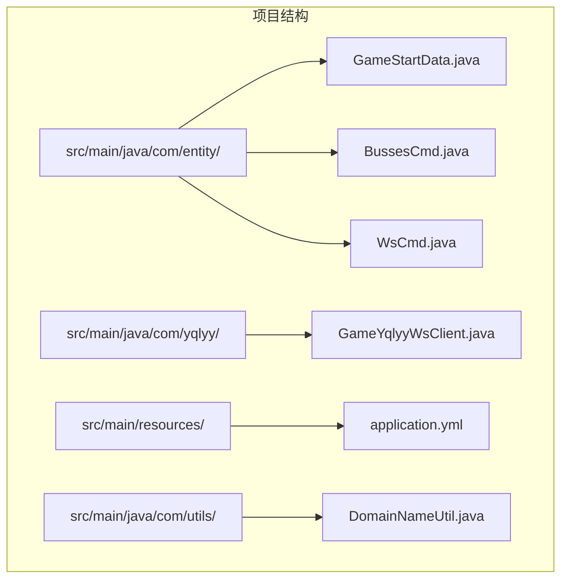
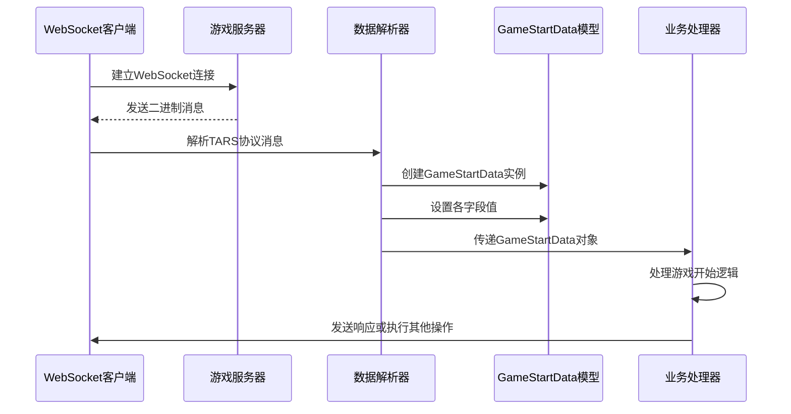
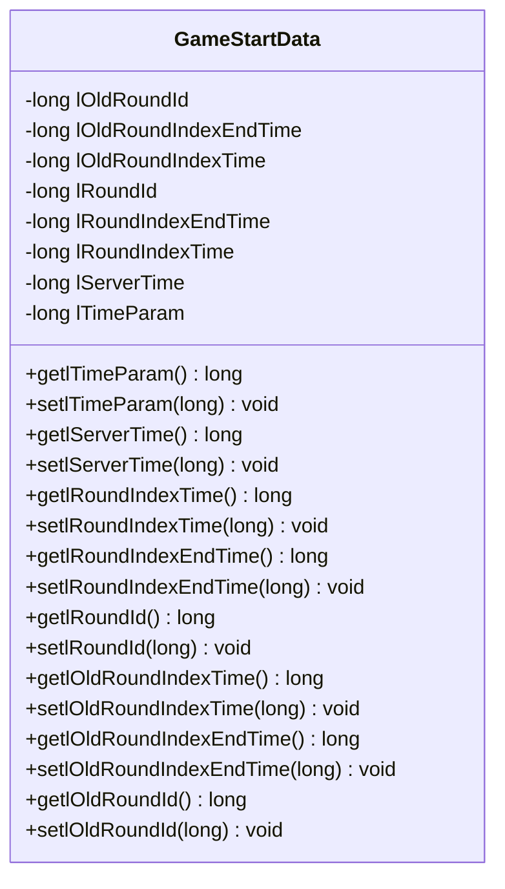
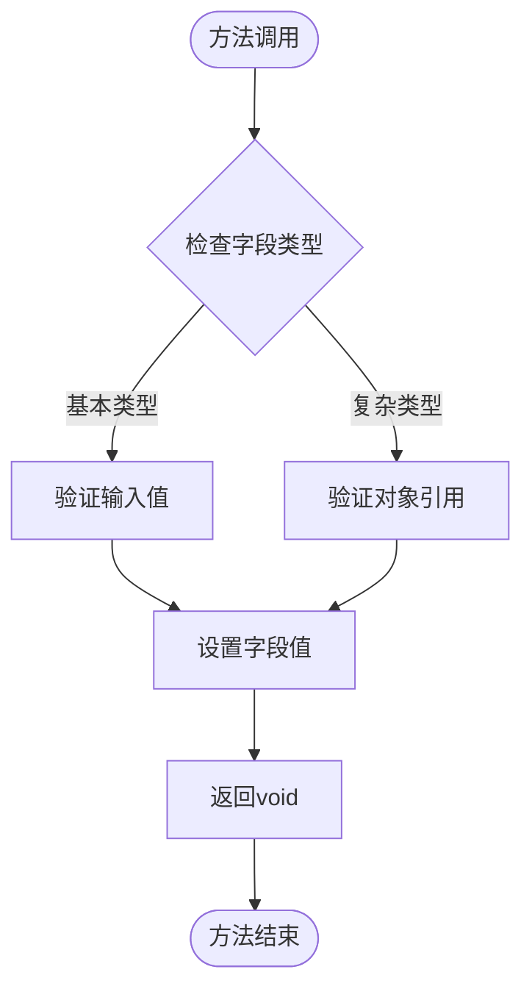
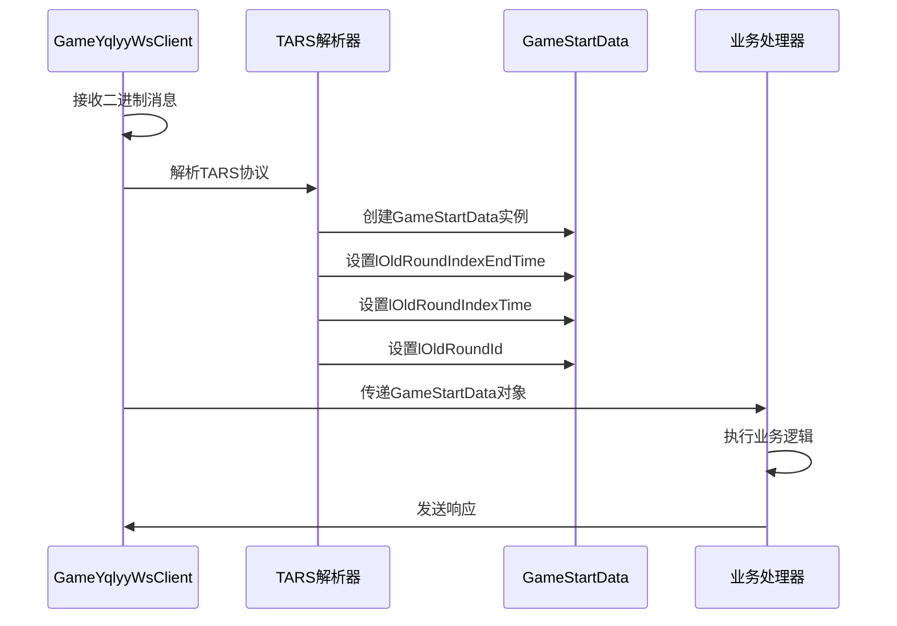
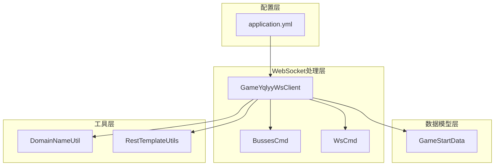

# 游戏开始数据模型

<cite>
**本文档引用的文件**
- [GameStartData.java](file://src/main/java/com/entity/GameStartData.java)
- [GameYqlyyWsClient.java](file://src/main/java/com/yqlyy/GameYqlyyWsClient.java)
- [BussesCmd.java](file://src/main/java/com/entity/BussesCmd.java)
- [WsCmd.java](file://src/main/java/com/entity/WsCmd.java)
- [application.yml](file://src/main/resources/application.yml)
- [DomainNameUtil.java](file://src/main/java/com/utils/DomainNameUtil.java)
</cite>

## 目录
1. [简介](#简介)
2. [项目结构](#项目结构)
3. [核心组件](#核心组件)
4. [架构概览](#架构概览)
5. [详细组件分析](#详细组件分析)
6. [依赖关系分析](#依赖关系分析)
7. [性能考虑](#性能考虑)
8. [故障排除指南](#故障排除指南)
9. [结论](#结论)

## 简介

GameStartData是游戏数据采集系统中的核心数据模型，专门用于封装游戏开始时的关键时间戳和轮次信息。该模型在WebSocket消息处理流程中发挥着重要作用，负责存储和传递游戏轮次状态、时间参数以及服务器时间等关键信息。

该数据模型的设计体现了以下特点：
- **封装性**：所有字段均采用私有属性设计，通过公共的getter和setter方法进行访问
- **类型安全**：所有时间戳字段均使用long类型，确保时间值的精确表示
- **业务相关性**：字段命名清晰反映了其在游戏业务场景中的具体用途
- **扩展性**：为未来可能的字段扩展预留了空间

## 项目结构

该项目采用标准的Java企业级应用结构，GameStartData位于实体层，与WebSocket客户端和其他业务组件协同工作。

**图表来源**
- [GameStartData.java](file://src/main/java/com/entity/GameStartData.java#L1-L79)
- [GameYqlyyWsClient.java](file://src/main/java/com/yqlyy/GameYqlyyWsClient.java#L1-L328)

**章节来源**
- [GameStartData.java](file://src/main/java/com/entity/GameStartData.java#L1-L79)
- [application.yml](file://src/main/resources/application.yml#L1-L31)

## 核心组件

GameStartData数据模型包含以下核心字段：

### 时间戳字段
- `lRoundId`: 当前轮次ID
- `lOldRoundId`: 上一轮次ID  
- `lRoundIndexTime`: 当前轮次开始时间戳
- `lRoundIndexEndTime`: 当前轮次结束时间戳
- `lOldRoundIndexTime`: 上一轮次开始时间戳
- `lOldRoundIndexEndTime`: 上一轮次结束时间戳
- `lServerTime`: 服务器时间戳

### 参数字段
- `lTimeParam`: 时间参数（具体计算逻辑在当前代码中未实现）

这些字段共同构成了游戏开始时的完整时间状态信息，为后续的游戏逻辑处理提供了准确的时间基准。

**章节来源**
- [GameStartData.java](file://src/main/java/com/entity/GameStartData.java#L4-L10)

## 架构概览

GameStartData在整个游戏数据采集系统中扮演着关键的数据传输角色，通过WebSocket协议与游戏服务器进行实时通信。

**图表来源**
- [GameYqlyyWsClient.java](file://src/main/java/com/yqlyy/GameYqlyyWsClient.java#L52-L219)
- [GameStartData.java](file://src/main/java/com/entity/GameStartData.java#L3-L78)

## 详细组件分析

### GameStartData类结构

**图表来源**
- [GameStartData.java](file://src/main/java/com/entity/GameStartData.java#L3-L78)

### 字段业务含义详解

#### 轮次标识字段
- **lRoundId**: 当前正在进行的游戏轮次唯一标识符，用于区分不同的游戏回合
- **lOldRoundId**: 上一次完成的游戏轮次标识符，用于对比轮次变化

#### 时间戳字段
- **lRoundIndexTime**: 当前轮次开始的精确时间戳，通常以毫秒为单位
- **lRoundIndexEndTime**: 当前轮次结束的精确时间戳
- **lOldRoundIndexTime**: 上一轮次开始的时间戳
- **lOldRoundIndexEndTime**: 上一轮次结束的时间戳

#### 服务器时间字段
- **lServerTime**: 服务器当前时间戳，用于时间同步和校准

#### 参数字段
- **lTimeParam**: 时间参数，当前实现中为私有字段但未提供具体的计算逻辑或业务用途

### Getter和Setter方法分析

每个字段都提供了标准的getter和setter方法，遵循JavaBean规范：

**图表来源**
- [GameStartData.java](file://src/main/java/com/entity/GameStartData.java#L12-L76)

**章节来源**
- [GameStartData.java](file://src/main/java/com/entity/GameStartData.java#L12-L76)

### 在WebSocket消息处理中的使用

GameStartData在WebSocket消息处理流程中的具体使用方式如下：

**图表来源**
- [GameYqlyyWsClient.java](file://src/main/java/com/yqlyy/GameYqlyyWsClient.java#L123-L147)

**章节来源**
- [GameYqlyyWsClient.java](file://src/main/java/com/yqlyy/GameYqlyyWsClient.java#L123-L147)

### 实际使用示例

虽然代码中没有直接展示完整的使用示例，但从WebSocket客户端的实现可以看出典型的使用模式：

1. **消息接收和解析**：WebSocket客户端接收到二进制消息后，使用TARS协议解析器提取GameStartData所需的数据
2. **数据封装**：将解析出的时间戳和轮次信息封装到GameStartData对象中
3. **业务处理**：根据GameStartData中的信息执行相应的业务逻辑
4. **数据同步**：将关键的时间信息同步到其他系统组件

**章节来源**
- [GameYqlyyWsClient.java](file://src/main/java/com/yqlyy/GameYqlyyWsClient.java#L123-L147)

## 依赖关系分析

GameStartData与其他组件之间的依赖关系如下：

**图表来源**
- [GameStartData.java](file://src/main/java/com/entity/GameStartData.java#L1-L79)
- [GameYqlyyWsClient.java](file://src/main/java/com/yqlyy/GameYqlyyWsClient.java#L1-L328)
- [BussesCmd.java](file://src/main/java/com/entity/BussesCmd.java#L1-L10)
- [WsCmd.java](file://src/main/java/com/entity/WsCmd.java#L1-L69)

### 关键依赖关系说明

1. **WebSocket客户端依赖**：GameYqlyyWsClient直接依赖GameStartData进行数据封装和传递
2. **协议解析依赖**：通过TARS协议解析器间接依赖GameStartData的字段结构
3. **配置依赖**：依赖application.yml中的配置信息进行网络连接和超时设置
4. **工具类依赖**：依赖DomainNameUtil中的URL配置进行数据同步

**章节来源**
- [GameYqlyyWsClient.java](file://src/main/java/com/yqlyy/GameYqlyyWsClient.java#L1-L328)
- [application.yml](file://src/main/resources/application.yml#L1-L31)

## 性能考虑

### 内存使用优化
- 所有字段均为基本数据类型（long），内存占用固定且高效
- 避免了不必要的对象创建和字符串拼接操作

### 网络传输优化
- 通过TARS协议进行二进制序列化，相比JSON具有更好的传输效率
- 字段命名简洁，减少了消息体积

### 并发安全性
- 当前实现为单线程使用场景，无需考虑并发访问的安全性
- 如需多线程使用，建议添加适当的同步机制

## 故障排除指南

### 常见问题及解决方案

1. **时间戳不一致问题**
   - 检查lServerTime与本地时间的差异
   - 确认lRoundIndexTime和lRoundIndexEndTime的逻辑关系

2. **轮次ID重复问题**
   - 验证lRoundId和lOldRoundId的递增逻辑
   - 检查网络延迟对轮次切换的影响

3. **WebSocket连接异常**
   - 检查application.yml中的网络配置
   - 验证DomainNameUtil中的URL配置

4. **数据解析错误**
   - 确认TARS协议版本兼容性
   - 验证字段索引与实际数据结构的一致性

**章节来源**
- [GameYqlyyWsClient.java](file://src/main/java/com/yqlyy/GameYqlyyWsClient.java#L250-L272)
- [application.yml](file://src/main/resources/application.yml#L16-L31)

## 结论

GameStartData作为游戏数据采集系统的核心数据模型，通过精心设计的字段结构和标准的getter/setter方法，为WebSocket消息处理提供了可靠的数据载体。其在游戏开始时的时间戳和轮次信息管理方面发挥着关键作用，确保了游戏状态的准确记录和传递。

该模型的主要优势包括：
- **清晰的业务语义**：字段命名直观反映了其在游戏业务中的具体用途
- **良好的封装性**：通过私有字段和公共方法实现了数据的访问控制
- **高效的性能表现**：基本数据类型的使用确保了内存和处理效率
- **可靠的集成能力**：与WebSocket客户端和TARS协议的良好配合

在未来的发展中，可以考虑：
- 完善lTimeParam字段的具体计算逻辑
- 添加更多的数据验证和边界检查
- 考虑支持多线程环境下的并发访问
- 增加日志记录和监控功能