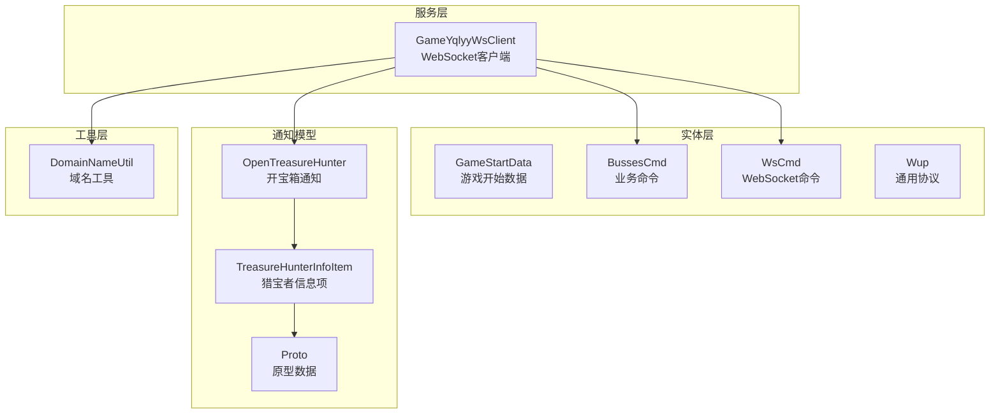
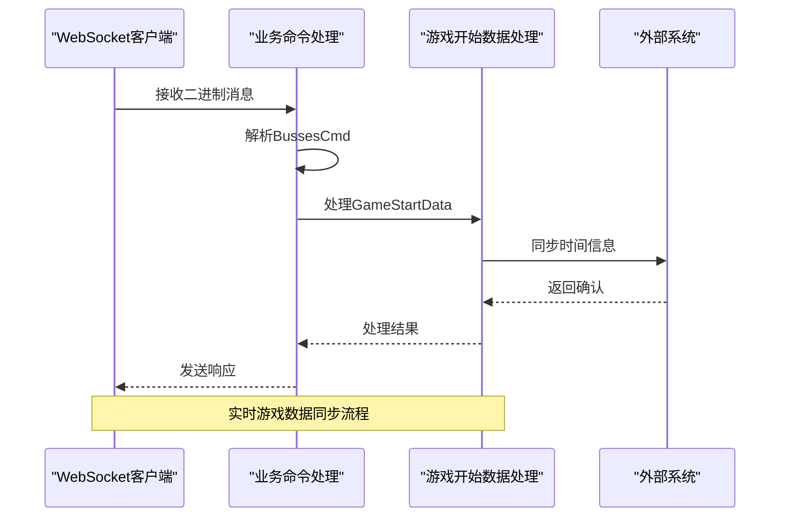
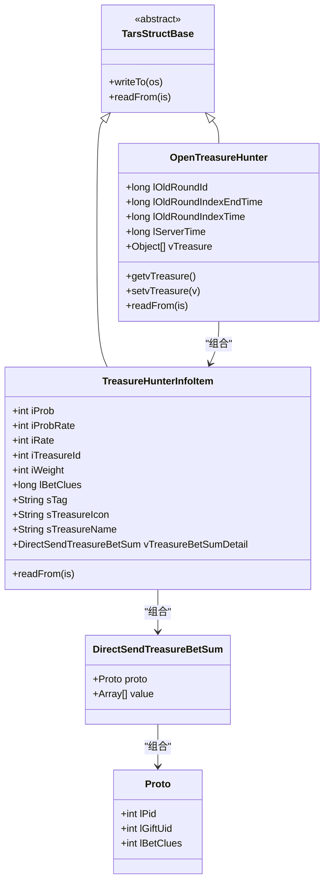
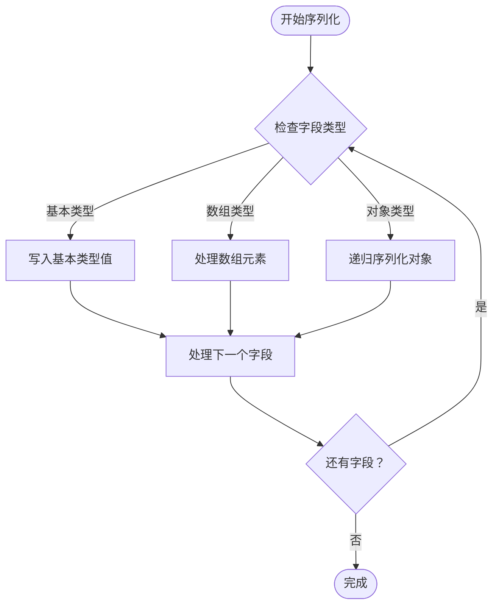
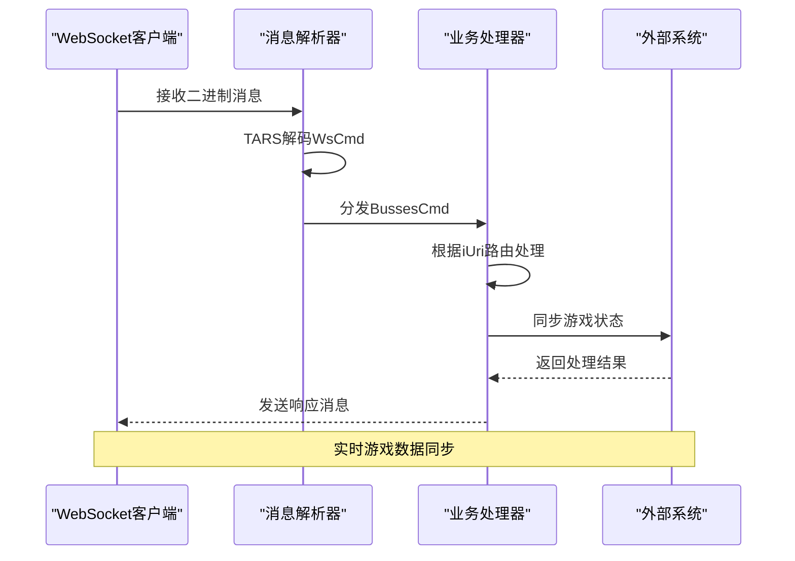
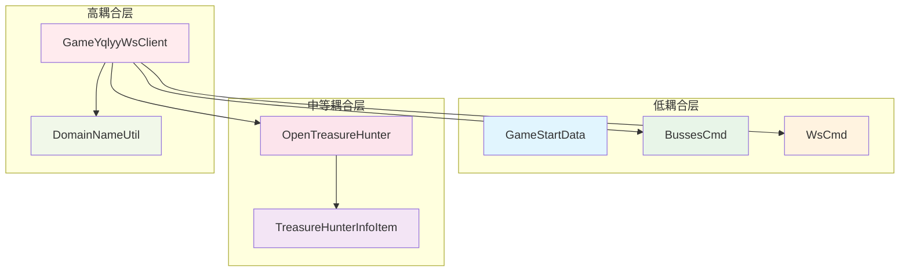

# 游戏数据模型

<cite>
**本文档引用的文件**
- [GameStartData.java](file://src/main/java/com/entity/GameStartData.java)
- [BussesCmd.java](file://src/main/java/com/entity/BussesCmd.java)
- [WsCmd.java](file://src/main/java/com/entity/WsCmd.java)
- [Wup.java](file://src/main/java/com/entity/Wup.java)
- [GameYqlyyWsClient.java](file://src/main/java/com/yqlyy/GameYqlyyWsClient.java)
- [OpenTreasureHunter.java](file://src/main/java/com/entity/AccountedNotify/OpenTreasureHunter.java)
- [TreasureHunterInfoItem.java](file://src/main/java/com/entity/AccountedNotify/TreasureHunterInfoItem.java)
- [Proto.java](file://src/main/java/com/entity/AccountedNotify/Proto.java)
- [DomainNameUtil.java](file://src/main/java/com/utils/DomainNameUtil.java)
- [application.yml](file://src/main/resources/application.yml)
</cite>

## 目录
1. [简介](#简介)
2. [项目结构](#项目结构)
3. [核心组件](#核心组件)
4. [架构概览](#架构概览)
5. [详细组件分析](#详细组件分析)
6. [依赖关系分析](#依赖关系分析)
7. [性能考虑](#性能考虑)
8. [故障排除指南](#故障排除指南)
9. [结论](#结论)
10. [附录](#附录)

## 简介
本文件系统性地分析了游戏数据模型的设计与实现，重点涵盖以下核心数据模型：
- GameStartData：游戏开始通知数据模型
- BussesCmd：业务命令封装模型  
- WsCmd：WebSocket命令封装模型
- Wup：通用协议封装模型

通过对这些模型的字段含义、业务场景、继承关系、序列化机制、验证规则以及最佳实践进行全面解析，帮助开发者深入理解游戏数据流的处理逻辑和设计原则。

## 项目结构
该项目采用按功能域划分的包结构，核心数据模型位于 `com.entity` 包下，WebSocket客户端位于 `com.yqlyy` 包下，工具类位于 `com.utils` 包下。

**图表来源**
- [GameStartData.java](file://src/main/java/com/entity/GameStartData.java#L1-L79)
- [BussesCmd.java](file://src/main/java/com/entity/BussesCmd.java#L1-L10)
- [WsCmd.java](file://src/main/java/com/entity/WsCmd.java#L1-L69)
- [Wup.java](file://src/main/java/com/entity/Wup.java#L1-L29)
- [GameYqlyyWsClient.java](file://src/main/java/com/yqlyy/GameYqlyyWsClient.java#L1-L328)

**章节来源**
- [GameStartData.java](file://src/main/java/com/entity/GameStartData.java#L1-L79)
- [BussesCmd.java](file://src/main/java/com/entity/BussesCmd.java#L1-L10)
- [WsCmd.java](file://src/main/java/com/entity/WsCmd.java#L1-L69)
- [Wup.java](file://src/main/java/com/entity/Wup.java#L1-L29)

## 核心组件
本节详细介绍三个核心数据模型的设计目的、字段含义和使用场景。

### GameStartData（游戏开始数据）
GameStartData用于封装游戏开始时的关键时间戳和轮次信息，支持不同游戏场景的时间同步需求。

**主要字段及含义：**
- `lOldRoundId`：上一轮次ID
- `lOldRoundIndexTime`：上一轮次开始时间
- `lOldRoundIndexEndTime`：上一轮次结束时间
- `lRoundId`：当前轮次ID
- `lRoundIndexTime`：当前轮次开始时间
- `lRoundIndexEndTime`：当前轮次结束时间
- `lServerTime`：服务器时间戳
- `lTimeParam`：时间参数（额外的时间控制字段）

**业务场景：**
- 游戏开始通知：接收并处理游戏开始事件
- 时间同步：与其他系统保持时间一致性
- 轮次管理：跟踪游戏轮次状态变化

**使用时机：**
- 当WebSocket接收到游戏开始相关消息时
- 需要更新本地游戏状态时
- 与外部系统进行时间对齐时

### BussesCmd（业务命令）
BussesCmd作为业务命令的载体，封装了推送类型、URI标识和消息体数据。

**主要字段及含义：**
- `ePushType`：推送类型标识
- `iUri`：业务URI标识符
- `sMsg`：业务消息字节数组

**业务场景：**
- WebSocket消息分发
- 不同业务类型的路由处理
- 消息内容的统一封装

**使用时机：**
- WebSocket二进制消息解析后
- 需要根据URI类型进行业务处理时
- 消息转发和广播场景

### WsCmd（WebSocket命令）
WsCmd是WebSocket通信的命令封装，支持完整的命令生命周期管理。

**主要字段及含义：**
- `iCmdType`：命令类型标识
- `vData`：命令数据载荷
- `lRequestId`：请求ID
- `traceId`：追踪ID
- `iEncryptType`：加密类型
- `lTime`：时间戳
- `sMD5`：数据完整性校验

**业务场景：**
- WebSocket双向通信
- 命令式消息处理
- 完整的消息生命周期管理

**使用时机：**
- WebSocket消息收发
- 需要追踪消息流向时
- 数据完整性验证场景

**章节来源**
- [GameStartData.java](file://src/main/java/com/entity/GameStartData.java#L3-L78)
- [BussesCmd.java](file://src/main/java/com/entity/BussesCmd.java#L3-L9)
- [WsCmd.java](file://src/main/java/com/entity/WsCmd.java#L3-L68)

## 架构概览
系统采用分层架构设计，通过WebSocket客户端与游戏服务进行实时通信，数据模型在各层之间传递。

**图表来源**
- [GameYqlyyWsClient.java](file://src/main/java/com/yqlyy/GameYqlyyWsClient.java#L52-L219)
- [BussesCmd.java](file://src/main/java/com/entity/BussesCmd.java#L3-L9)
- [GameStartData.java](file://src/main/java/com/entity/GameStartData.java#L3-L78)

**章节来源**
- [GameYqlyyWsClient.java](file://src/main/java/com/yqlyy/GameYqlyyWsClient.java#L1-L328)

## 详细组件分析

### 继承关系与组合模式
系统中的数据模型采用了清晰的继承关系和组合模式：

**图表来源**
- [OpenTreasureHunter.java](file://src/main/java/com/entity/AccountedNotify/OpenTreasureHunter.java#L10-L82)
- [TreasureHunterInfoItem.java](file://src/main/java/com/entity/AccountedNotify/TreasureHunterInfoItem.java#L8-L123)
- [Proto.java](file://src/main/java/com/entity/AccountedNotify/Proto.java#L3-L7)

### 数据模型序列化与反序列化机制

#### TARS协议序列化
系统采用TARS（Tencent Remote Procedure Call）协议进行高性能序列化：

**图表来源**
- [OpenTreasureHunter.java](file://src/main/java/com/entity/AccountedNotify/OpenTreasureHunter.java#L72-L81)
- [TreasureHunterInfoItem.java](file://src/main/java/com/entity/AccountedNotify/TreasureHunterInfoItem.java#L105-L122)

#### 字段映射与类型转换规则
- **基础类型映射**：Java基本类型与TARS类型的直接映射
- **数组处理**：使用TarsInputStream.readArray方法处理复杂数组结构
- **嵌套对象**：通过readFrom方法递归处理嵌套对象
- **字符串编码**：UTF-8编码确保跨平台兼容性

### WebSocket消息处理流程

**图表来源**
- [GameYqlyyWsClient.java](file://src/main/java/com/yqlyy/GameYqlyyWsClient.java#L52-L219)

**章节来源**
- [GameYqlyyWsClient.java](file://src/main/java/com/yqlyy/GameYqlyyWsClient.java#L51-L219)

## 依赖关系分析

### 组件耦合度分析
系统采用松耦合设计，各组件职责明确：

**图表来源**
- [GameYqlyyWsClient.java](file://src/main/java/com/yqlyy/GameYqlyyWsClient.java#L9-L11)
- [OpenTreasureHunter.java](file://src/main/java/com/entity/AccountedNotify/OpenTreasureHunter.java#L1-L83)

### 外部依赖关系
- **TARS协议库**：提供高性能序列化支持
- **WebSocket API**：实现实时双向通信
- **HTTP客户端**：处理与外部系统的REST调用
- **日志框架**：记录系统运行状态

**章节来源**
- [GameYqlyyWsClient.java](file://src/main/java/com/yqlyy/GameYqlyyWsClient.java#L12-L27)

## 性能考虑
基于代码分析，系统在性能方面有以下特点：

### 内存优化策略
- **字节数组复用**：WebSocket消息使用ByteBuffer避免频繁分配
- **延迟初始化**：部分字段采用延迟加载减少内存占用
- **对象池化**：建议对频繁创建的对象进行池化管理

### 网络传输优化
- **压缩传输**：建议对大数据量消息进行压缩
- **批量处理**：支持批量消息处理提升吞吐量
- **连接复用**：WebSocket连接复用减少握手开销

### 处理效率优化
- **异步处理**：WebSocket消息处理采用异步模式
- **缓存策略**：对热点数据进行缓存
- **批处理机制**：支持批量数据处理

## 故障排除指南

### 常见问题诊断
1. **WebSocket连接失败**
   - 检查网络连通性和防火墙设置
   - 验证URL格式和证书有效性
   - 查看连接超时配置

2. **消息解析错误**
   - 确认TARS协议版本兼容性
   - 检查字段顺序和类型匹配
   - 验证消息完整性

3. **数据同步异常**
   - 检查时间戳同步机制
   - 验证外部系统可达性
   - 查看重试机制配置

### 调试建议
- 启用详细的日志记录
- 使用网络抓包工具分析消息流
- 实施监控指标收集
- 建立自动化测试用例

**章节来源**
- [GameYqlyyWsClient.java](file://src/main/java/com/yqlyy/GameYqlyyWsClient.java#L240-L248)

## 结论
本游戏数据模型体系展现了良好的架构设计原则：
- **清晰的职责分离**：各组件职责明确，便于维护和扩展
- **高效的序列化机制**：采用TARS协议确保高性能数据传输
- **灵活的扩展能力**：继承关系和组合模式支持功能扩展
- **完善的错误处理**：多层次的异常处理机制保证系统稳定性

通过合理运用这些数据模型，可以构建高性能、可扩展的游戏数据处理系统。

## 附录

### 最佳实践指导

#### 数据模型使用规范
1. **字段命名约定**：遵循驼峰命名法，保持一致性
2. **类型选择原则**：根据业务需求选择合适的数据类型
3. **默认值设置**：为可选字段设置合理的默认值
4. **空值处理**：明确空值的业务含义和处理策略

#### 性能优化建议
1. **批量处理**：对大量数据采用批量处理模式
2. **缓存策略**：实施适当的缓存机制减少重复计算
3. **异步处理**：耗时操作采用异步处理避免阻塞
4. **资源管理**：及时释放不再使用的资源

#### 安全考虑
1. **输入验证**：对所有外部输入进行严格验证
2. **数据加密**：敏感数据采用加密存储和传输
3. **访问控制**：实施适当的权限控制机制
4. **审计日志**：记录关键操作便于追溯

### 配置参考
系统配置主要集中在应用配置文件中，包括：
- **服务器端口**：8021
- **HTTP连接池**：最大连接数100，超时时间30秒
- **WebSocket缓冲区**：65536字节

**章节来源**
- [application.yml](file://src/main/resources/application.yml#L1-L30)