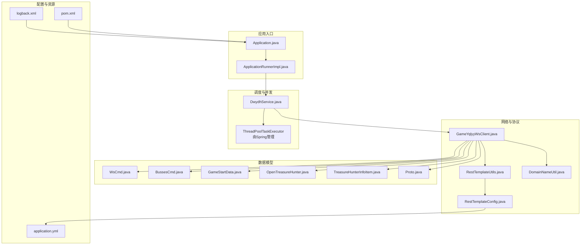
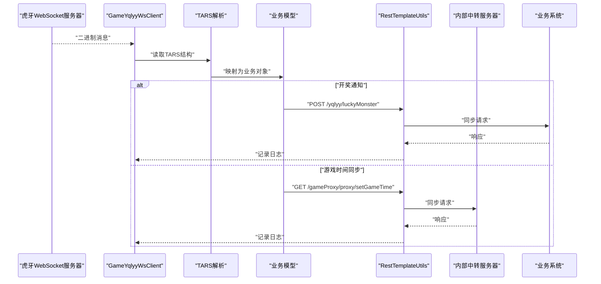
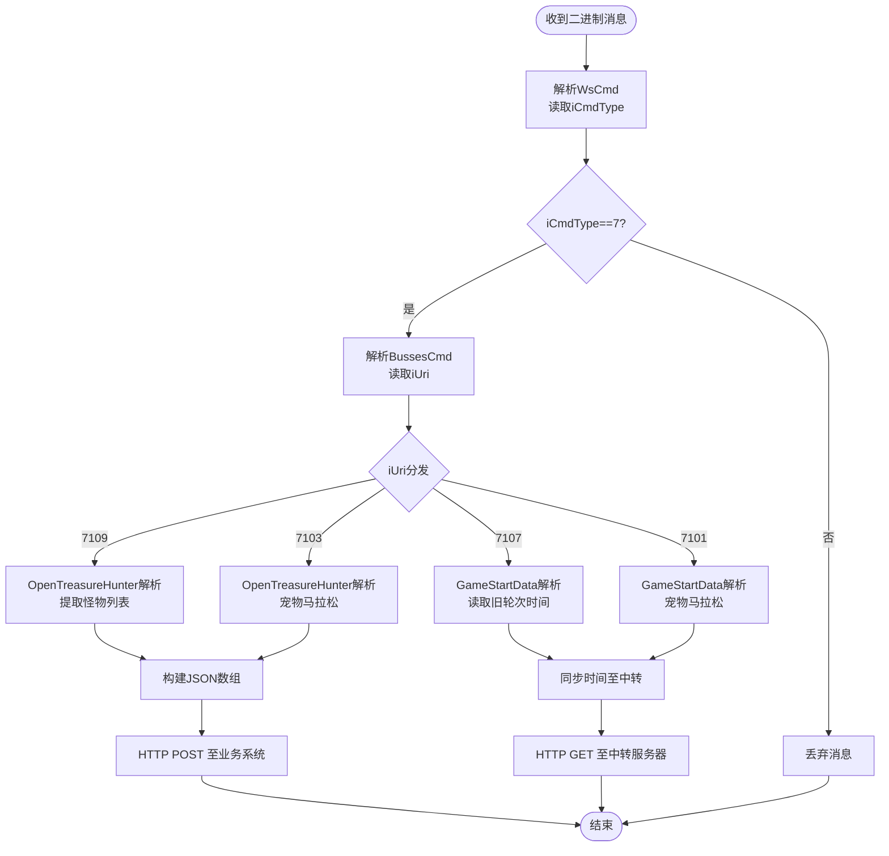
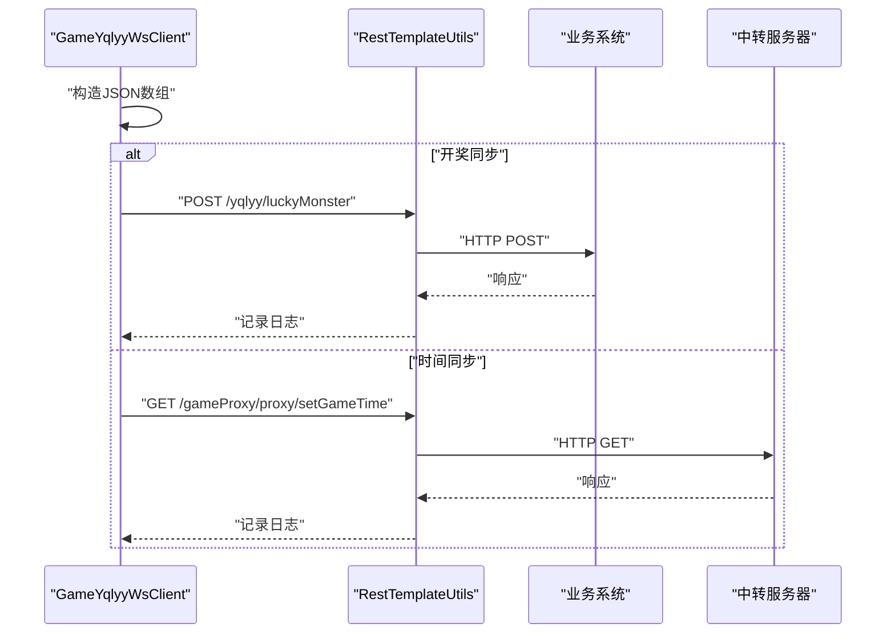
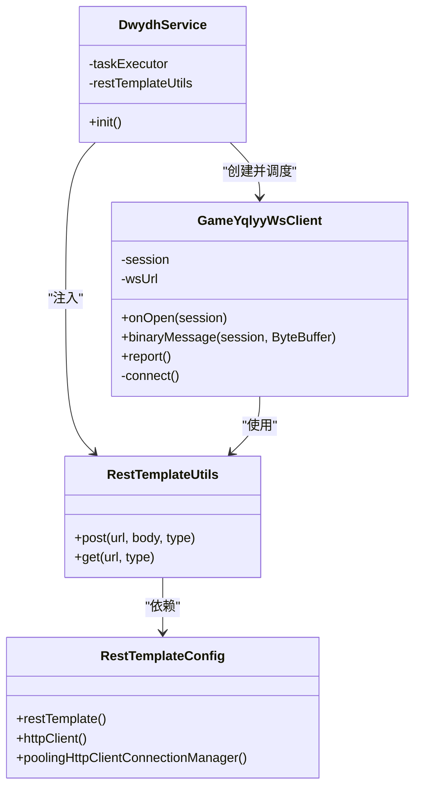
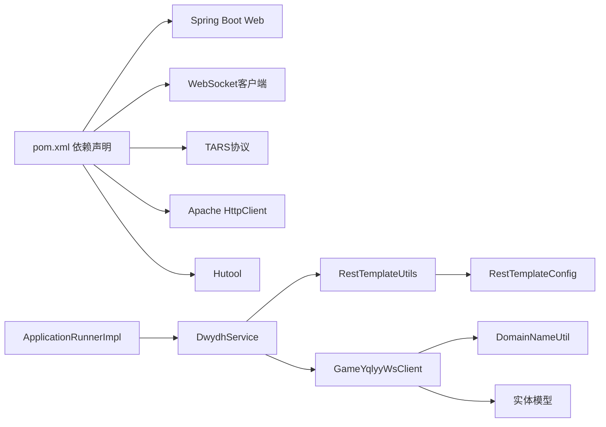

# 数据流设计

<cite>
**本文引用的文件**
- [Application.java](file://src/main/java/com/Application.java)
- [ApplicationRunnerImpl.java](file://src/main/java/com/listener/ApplicationRunnerImpl.java)
- [DwydhService.java](file://src/main/java/com/dwydh/DwydhService.java)
- [GameYqlyyWsClient.java](file://src/main/java/com/yqlyy/GameYqlyyWsClient.java)
- [RestTemplateConfig.java](file://src/main/java/com/commom/RestTemplateConfig.java)
- [RestTemplateUtils.java](file://src/main/java/com/commom/RestTemplateUtils.java)
- [DomainNameUtil.java](file://src/main/java/com/utils/DomainNameUtil.java)
- [WsCmd.java](file://src/main/java/com/entity/WsCmd.java)
- [BussesCmd.java](file://src/main/java/com/entity/BussesCmd.java)
- [GameStartData.java](file://src/main/java/com/entity/GameStartData.java)
- [OpenTreasureHunter.java](file://src/main/java/com/entity/AccountedNotify/OpenTreasureHunter.java)
- [TreasureHunterInfoItem.java](file://src/main/java/com/entity/AccountedNotify/TreasureHunterInfoItem.java)
- [Proto.java](file://src/main/java/com/entity/AccountedNotify/Proto.java)
- [application.yml](file://src/main/resources/application.yml)
- [pom.xml](file://pom.xml)
- [logback.xml](file://src/main/resources/logback.xml)
</cite>

## 目录
1. [引言](#引言)
2. [项目结构](#项目结构)
3. [核心组件](#核心组件)
4. [架构总览](#架构总览)
5. [详细组件分析](#详细组件分析)
6. [依赖关系分析](#依赖关系分析)
7. [性能考虑](#性能考虑)
8. [故障排查指南](#故障排查指南)
9. [结论](#结论)
10. [附录](#附录)

## 引言
本文件面向“虎牙游戏服务器到内部中转服务器”的系统数据流设计，围绕以下目标展开：
- 描述WebSocket消息接收、TARS协议解析、数据模型转换、HTTP同步发送的完整流程
- 解释数据在不同组件间的格式转换与传递机制
- 阐述异步处理模式与并发控制策略
- 提供数据完整性保障、错误恢复与重试机制
- 给出数据流图展示关键节点状态变化
- 讨论性能优化点与瓶颈识别方法

## 项目结构
该工程采用Spring Boot标准目录结构，按功能域划分：
- com：应用入口与通用组件
- com.dwydh：定时任务与调度服务
- com.yqlyy：WebSocket客户端与数据处理
- com.entity：数据模型与TARS结构
- com.commom：HTTP客户端配置与工具
- com.utils：域名与URL常量
- com.listener：应用启动回调
- resources：配置文件与日志配置

图表来源
- [Application.java](file://src/main/java/com/Application.java#L1-L14)
- [ApplicationRunnerImpl.java](file://src/main/java/com/listener/ApplicationRunnerImpl.java#L1-L34)
- [DwydhService.java](file://src/main/java/com/dwydh/DwydhService.java#L1-L39)
- [GameYqlyyWsClient.java](file://src/main/java/com/yqlyy/GameYqlyyWsClient.java#L1-L328)
- [RestTemplateConfig.java](file://src/main/java/com/commom/RestTemplateConfig.java#L1-L132)
- [RestTemplateUtils.java](file://src/main/java/com/commom/RestTemplateUtils.java#L1-L31)
- [DomainNameUtil.java](file://src/main/java/com/utils/DomainNameUtil.java#L1-L16)
- [WsCmd.java](file://src/main/java/com/entity/WsCmd.java#L1-L69)
- [BussesCmd.java](file://src/main/java/com/entity/BussesCmd.java#L1-L10)
- [GameStartData.java](file://src/main/java/com/entity/GameStartData.java#L1-L79)
- [OpenTreasureHunter.java](file://src/main/java/com/entity/AccountedNotify/OpenTreasureHunter.java#L1-L83)
- [TreasureHunterInfoItem.java](file://src/main/java/com/entity/AccountedNotify/TreasureHunterInfoItem.java#L1-L124)
- [Proto.java](file://src/main/java/com/entity/AccountedNotify/Proto.java#L1-L8)
- [application.yml](file://src/main/resources/application.yml#L1-L31)
- [logback.xml](file://src/main/resources/logback.xml#L1-L75)
- [pom.xml](file://pom.xml#L1-L160)

章节来源
- [Application.java](file://src/main/java/com/Application.java#L1-L14)
- [application.yml](file://src/main/resources/application.yml#L1-L31)

## 核心组件
- 应用入口与启动回调
  - Application：Spring Boot启动类
  - ApplicationRunnerImpl：应用启动后初始化调度
- 调度与并发
  - DwydhService：使用线程池定期触发WebSocket上报与监听
- WebSocket客户端
  - GameYqlyyWsClient：连接虎牙WebSocket，接收二进制消息，解析TARS，转换为业务模型，并通过HTTP同步发送至内部接口
- HTTP客户端
  - RestTemplateConfig：基于Apache HttpClient的连接池与超时配置
  - RestTemplateUtils：封装HTTP GET/POST调用
- 数据模型
  - WsCmd、BussesCmd：消息头与URI载体
  - GameStartData：游戏时间相关字段
  - OpenTreasureHunter、TreasureHunterInfoItem、Proto：开奖与宠物相关结构
- 域名与URL
  - DomainNameUtil：内部目标地址（含中转与业务接口）

章节来源
- [Application.java](file://src/main/java/com/Application.java#L1-L14)
- [ApplicationRunnerImpl.java](file://src/main/java/com/listener/ApplicationRunnerImpl.java#L1-L34)
- [DwydhService.java](file://src/main/java/com/dwydh/DwydhService.java#L1-L39)
- [GameYqlyyWsClient.java](file://src/main/java/com/yqlyy/GameYqlyyWsClient.java#L1-L328)
- [RestTemplateConfig.java](file://src/main/java/com/commom/RestTemplateConfig.java#L1-L132)
- [RestTemplateUtils.java](file://src/main/java/com/commom/RestTemplateUtils.java#L1-L31)
- [DomainNameUtil.java](file://src/main/java/com/utils/DomainNameUtil.java#L1-L16)
- [WsCmd.java](file://src/main/java/com/entity/WsCmd.java#L1-L69)
- [BussesCmd.java](file://src/main/java/com/entity/BussesCmd.java#L1-L10)
- [GameStartData.java](file://src/main/java/com/entity/GameStartData.java#L1-L79)
- [OpenTreasureHunter.java](file://src/main/java/com/entity/AccountedNotify/OpenTreasureHunter.java#L1-L83)
- [TreasureHunterInfoItem.java](file://src/main/java/com/entity/AccountedNotify/TreasureHunterInfoItem.java#L1-L124)
- [Proto.java](file://src/main/java/com/entity/AccountedNotify/Proto.java#L1-L8)

## 架构总览
系统数据流自虎牙WebSocket服务器开始，经由GameYqlyyWsClient解析TARS协议，转换为业务对象，再通过RestTemplateUtils同步发送至内部中转与业务接口。调度层DwydhService负责周期性上报与连接维护。

图表来源
- [GameYqlyyWsClient.java](file://src/main/java/com/yqlyy/GameYqlyyWsClient.java#L46-L219)
- [RestTemplateUtils.java](file://src/main/java/com/commom/RestTemplateUtils.java#L14-L31)
- [DomainNameUtil.java](file://src/main/java/com/utils/DomainNameUtil.java#L1-L16)

## 详细组件分析

### WebSocket消息接收与TARS解析
- 接收与心跳
  - onOpen：建立连接后发送鉴权/进入房间二进制帧
  - OnMessage(binaryMessage)：接收二进制消息，解析为TARS结构
  - OnMessage(pongMessage)：记录心跳
- TARS解析流程
  - 外层：WsCmd（命令类型、数据体）
  - 内层：BussesCmd（URI、消息体）
  - 按URI分发：
    - 7109：OpenTreasureHunter（开奖信息）
    - 7107：GameStartData（时间同步）
    - 7103：OpenTreasureHunter（宠物马拉松）
    - 7101：GameStartData（宠物马拉松）

图表来源
- [GameYqlyyWsClient.java](file://src/main/java/com/yqlyy/GameYqlyyWsClient.java#L51-L219)
- [WsCmd.java](file://src/main/java/com/entity/WsCmd.java#L1-L69)
- [BussesCmd.java](file://src/main/java/com/entity/BussesCmd.java#L1-L10)
- [OpenTreasureHunter.java](file://src/main/java/com/entity/AccountedNotify/OpenTreasureHunter.java#L1-L83)
- [TreasureHunterInfoItem.java](file://src/main/java/com/entity/AccountedNotify/TreasureHunterInfoItem.java#L1-L124)
- [GameStartData.java](file://src/main/java/com/entity/GameStartData.java#L1-L79)

章节来源
- [GameYqlyyWsClient.java](file://src/main/java/com/yqlyy/GameYqlyyWsClient.java#L46-L219)
- [WsCmd.java](file://src/main/java/com/entity/WsCmd.java#L1-L69)
- [BussesCmd.java](file://src/main/java/com/entity/BussesCmd.java#L1-L10)
- [OpenTreasureHunter.java](file://src/main/java/com/entity/AccountedNotify/OpenTreasureHunter.java#L1-L83)
- [TreasureHunterInfoItem.java](file://src/main/java/com/entity/AccountedNotify/TreasureHunterInfoItem.java#L1-L124)
- [GameStartData.java](file://src/main/java/com/entity/GameStartData.java#L1-L79)

### 数据模型转换与HTTP同步
- 模型转换
  - OpenTreasureHunter：读取vTreasure数组，逐项映射为怪物ID与名称
  - GameStartData：读取旧轮次起止时间等字段
- HTTP同步
  - RestTemplateUtils：封装POST/GET
  - 目标地址：
    - 业务系统：/yqlyy/luckyMonster 或 /mls/luckyMonster
    - 中转服务器：/gameProxy/proxy/setGameTime
  - 错误处理：捕获RestClientException与通用异常，记录日志

图表来源
- [GameYqlyyWsClient.java](file://src/main/java/com/yqlyy/GameYqlyyWsClient.java#L88-L117)
- [GameYqlyyWsClient.java](file://src/main/java/com/yqlyy/GameYqlyyWsClient.java#L136-L147)
- [GameYqlyyWsClient.java](file://src/main/java/com/yqlyy/GameYqlyyWsClient.java#L165-L181)
- [GameYqlyyWsClient.java](file://src/main/java/com/yqlyy/GameYqlyyWsClient.java#L202-L213)
- [RestTemplateUtils.java](file://src/main/java/com/commom/RestTemplateUtils.java#L14-L31)
- [DomainNameUtil.java](file://src/main/java/com/utils/DomainNameUtil.java#L1-L16)

章节来源
- [GameYqlyyWsClient.java](file://src/main/java/com/yqlyy/GameYqlyyWsClient.java#L88-L117)
- [GameYqlyyWsClient.java](file://src/main/java/com/yqlyy/GameYqlyyWsClient.java#L136-L147)
- [GameYqlyyWsClient.java](file://src/main/java/com/yqlyy/GameYqlyyWsClient.java#L165-L181)
- [GameYqlyyWsClient.java](file://src/main/java/com/yqlyy/GameYqlyyWsClient.java#L202-L213)
- [RestTemplateUtils.java](file://src/main/java/com/commom/RestTemplateUtils.java#L14-L31)
- [DomainNameUtil.java](file://src/main/java/com/utils/DomainNameUtil.java#L1-L16)

### 异步处理模式与并发控制
- 线程模型
  - DwydhService使用ThreadPoolTaskExecutor执行长驻任务
  - GameYqlyyWsClient内部通过WebSocket容器与连接管理实现异步事件驱动
- 并发控制
  - WebSocket连接与发送：使用容器默认缓冲与超时设置
  - HTTP请求：RestTemplateConfig基于Apache HttpClient连接池，支持最大连接数与每路由并发限制
- 生命周期
  - ApplicationRunnerImpl在应用启动后立即初始化调度
  - DwydhService循环执行report()与连接维护

图表来源
- [DwydhService.java](file://src/main/java/com/dwydh/DwydhService.java#L1-L39)
- [GameYqlyyWsClient.java](file://src/main/java/com/yqlyy/GameYqlyyWsClient.java#L1-L328)
- [RestTemplateUtils.java](file://src/main/java/com/commom/RestTemplateUtils.java#L1-L31)
- [RestTemplateConfig.java](file://src/main/java/com/commom/RestTemplateConfig.java#L1-L132)

章节来源
- [DwydhService.java](file://src/main/java/com/dwydh/DwydhService.java#L1-L39)
- [GameYqlyyWsClient.java](file://src/main/java/com/yqlyy/GameYqlyyWsClient.java#L250-L290)
- [RestTemplateConfig.java](file://src/main/java/com/commom/RestTemplateConfig.java#L74-L129)
- [application.yml](file://src/main/resources/application.yml#L16-L31)

### 数据完整性、错误恢复与重试
- 数据完整性
  - TARS字段读取严格按序号读取，避免越界
  - JSON构建仅在数组非空时发送，减少无效请求
- 错误恢复
  - WebSocket连接断开时，report()内检测并重新connect()
  - HTTP请求捕获RestClientException与通用异常，记录日志并继续后续流程
- 重试机制
  - Apache HttpClient启用默认重试处理器（配置化），提升瞬时失败的恢复概率
  - WebSocket侧通过循环与重连逻辑维持链路

章节来源
- [GameYqlyyWsClient.java](file://src/main/java/com/yqlyy/GameYqlyyWsClient.java#L274-L290)
- [RestTemplateConfig.java](file://src/main/java/com/commom/RestTemplateConfig.java#L106-L107)
- [RestTemplateUtils.java](file://src/main/java/com/commom/RestTemplateUtils.java#L14-L31)

## 依赖关系分析
- 外部依赖
  - Spring Boot Web Starter、WebSocket客户端、TARS协议库、Apache HttpClient、Hutool
- 内部依赖
  - ApplicationRunnerImpl依赖DwydhService
  - DwydhService依赖RestTemplateUtils与线程池
  - GameYqlyyWsClient依赖RestTemplateUtils、DomainNameUtil、实体模型

图表来源
- [pom.xml](file://pom.xml#L26-L111)
- [ApplicationRunnerImpl.java](file://src/main/java/com/listener/ApplicationRunnerImpl.java#L1-L34)
- [DwydhService.java](file://src/main/java/com/dwydh/DwydhService.java#L1-L39)
- [RestTemplateUtils.java](file://src/main/java/com/commom/RestTemplateUtils.java#L1-L31)
- [RestTemplateConfig.java](file://src/main/java/com/commom/RestTemplateConfig.java#L1-L132)
- [GameYqlyyWsClient.java](file://src/main/java/com/yqlyy/GameYqlyyWsClient.java#L1-L328)
- [DomainNameUtil.java](file://src/main/java/com/utils/DomainNameUtil.java#L1-L16)

章节来源
- [pom.xml](file://pom.xml#L26-L111)

## 性能考虑
- 连接池与超时
  - HTTP：最大连接数、每路由并发、连接超时、请求超时、套接字超时、空闲校验
  - WebSocket：默认二进制缓冲、会话空闲超时、异步发送超时
- 建议优化
  - 将HTTP超时参数从配置文件动态化，按环境调整
  - 对高频URI（如时间同步）引入幂等与去重策略，避免重复同步
  - 在GameYqlyyWsClient中对异常连接进行指数退避重连
  - 对HTTP批量发送场景，评估合并请求以降低RTT

章节来源
- [application.yml](file://src/main/resources/application.yml#L16-L31)
- [RestTemplateConfig.java](file://src/main/java/com/commom/RestTemplateConfig.java#L84-L129)
- [GameYqlyyWsClient.java](file://src/main/java/com/yqlyy/GameYqlyyWsClient.java#L250-L272)

## 故障排查指南
- WebSocket连接问题
  - 检查onOpen是否成功发送鉴权帧；确认wsUrl有效
  - 观察onError与onClose日志，定位异常原因
- TARS解析问题
  - 核对iCmdType与iUri分支是否覆盖所有场景
  - 校验TARS字段序号与实体属性一致
- HTTP同步问题
  - 查看RestClientException与通用异常日志
  - 确认DomainNameUtil中的urls与transitUrls已正确配置
- 日志与监控
  - 使用logback输出INFO/ERROR日志，结合控制台与滚动文件定位问题

章节来源
- [GameYqlyyWsClient.java](file://src/main/java/com/yqlyy/GameYqlyyWsClient.java#L240-L248)
- [RestTemplateUtils.java](file://src/main/java/com/commom/RestTemplateUtils.java#L14-L31)
- [DomainNameUtil.java](file://src/main/java/com/utils/DomainNameUtil.java#L1-L16)
- [logback.xml](file://src/main/resources/logback.xml#L1-L75)

## 结论
本系统以WebSocket作为数据入口，通过TARS协议解析与业务模型转换，将开奖与时间数据同步至内部中转与业务系统。整体采用事件驱动与连接池并发模型，具备基础的错误恢复与重试能力。建议进一步完善超时参数化、重连退避、幂等与批量优化，以提升稳定性与吞吐。

## 附录
- 关键配置项
  - HTTP连接池与超时：见application.yml
  - 日志级别与输出：见logback.xml
- 依赖清单
  - Spring Boot、WebSocket、TARS、Apache HttpClient、Hutool

章节来源
- [application.yml](file://src/main/resources/application.yml#L1-L31)
- [logback.xml](file://src/main/resources/logback.xml#L1-L75)
- [pom.xml](file://pom.xml#L26-L111)