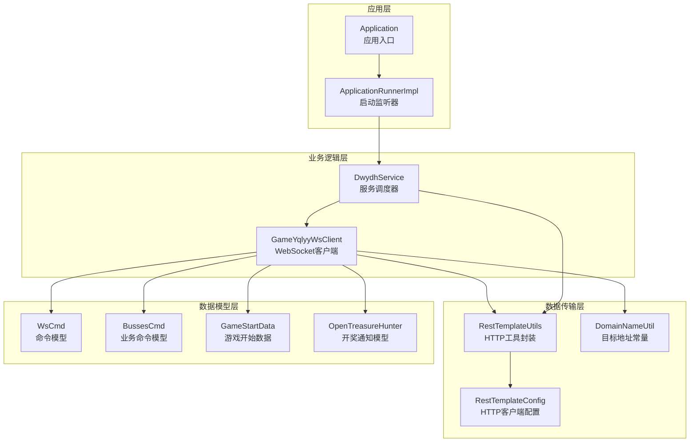
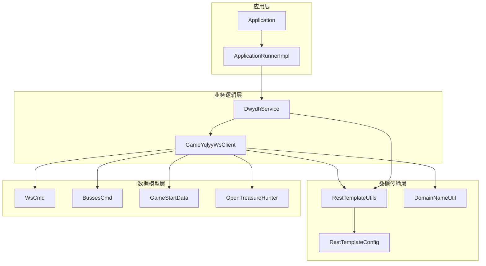
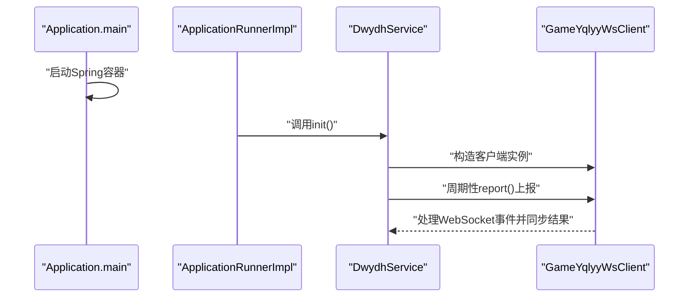
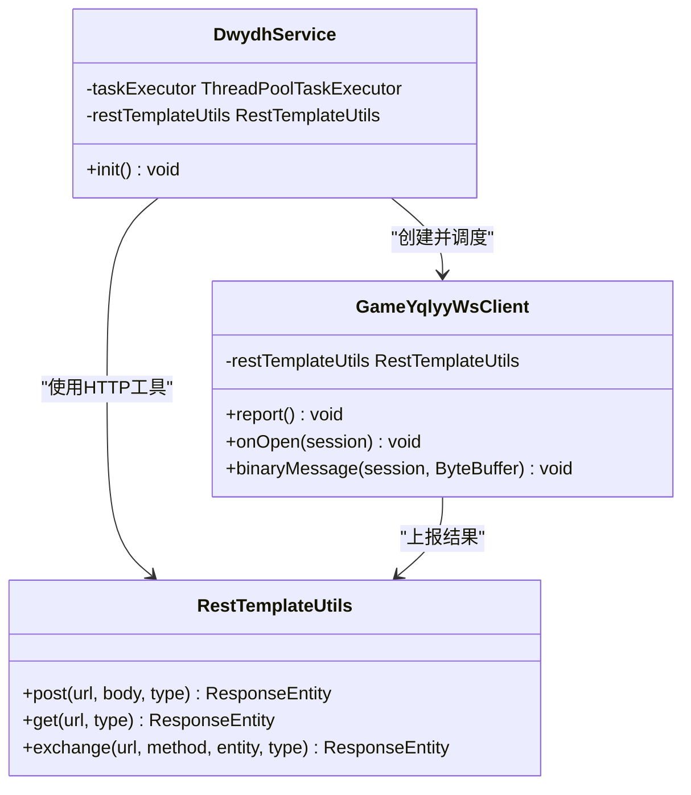
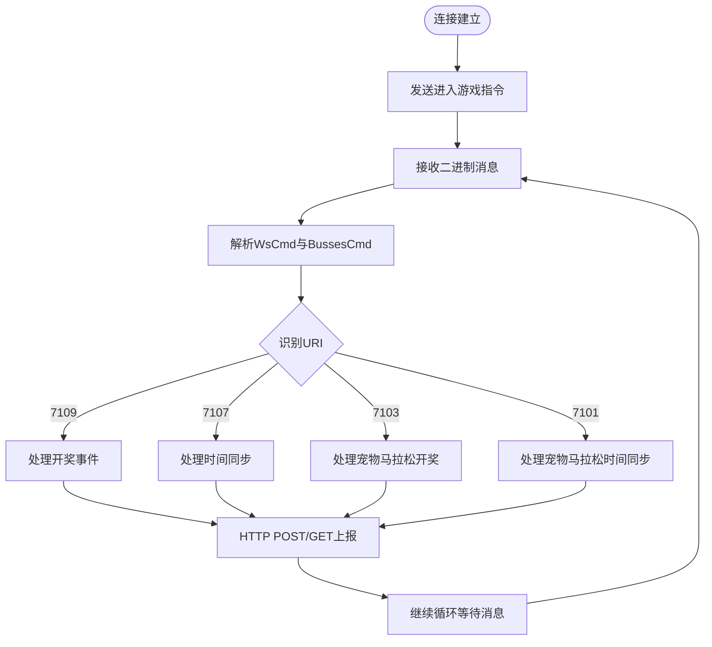
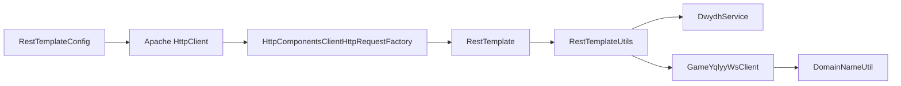
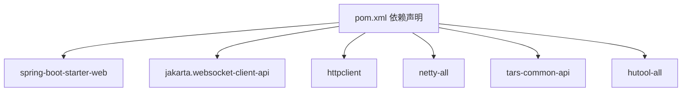

# 整体架构设计

<cite>
**本文档引用的文件**
- [Application.java](file://src/main/java/com/Application.java)
- [ApplicationRunnerImpl.java](file://src/main/java/com/listener/ApplicationRunnerImpl.java)
- [DwydhService.java](file://src/main/java/com/dwydh/DwydhService.java)
- [RestTemplateConfig.java](file://src/main/java/com/commom/RestTemplateConfig.java)
- [RestTemplateUtils.java](file://src/main/java/com/commom/RestTemplateUtils.java)
- [GameYqlyyWsClient.java](file://src/main/java/com/yqlyy/GameYqlyyWsClient.java)
- [DomainNameUtil.java](file://src/main/java/com/utils/DomainNameUtil.java)
- [OpenTreasureHunter.java](file://src/main/java/com/entity/AccountedNotify/OpenTreasureHunter.java)
- [BussesCmd.java](file://src/main/java/com/entity/BussesCmd.java)
- [GameStartData.java](file://src/main/java/com/entity/GameStartData.java)
- [WsCmd.java](file://src/main/java/com/entity/WsCmd.java)
- [application.yml](file://src/main/resources/application.yml)
- [pom.xml](file://pom.xml)
</cite>

## 目录
1. [引言](#引言)
2. [项目结构](#项目结构)
3. [核心组件](#核心组件)
4. [架构总览](#架构总览)
5. [详细组件分析](#详细组件分析)
6. [依赖关系分析](#依赖关系分析)
7. [性能考虑](#性能考虑)
8. [故障排查指南](#故障排查指南)
9. [结论](#结论)
10. [附录](#附录)

## 引言
本文件面向虎牙游戏数据采集系统，提供整体架构设计说明。系统采用Spring Boot作为应用框架，围绕WebSocket实时数据通道与HTTP上报机制构建，实现对“一千零一夜”和“宠物马拉松”等虎牙游戏事件的采集与同步。架构以分层设计为核心：应用层负责启动与生命周期管理；业务逻辑层负责调度与任务执行；数据传输层负责网络通信与协议编解码。DwydhService作为服务调度器，承担线程池调度、客户端初始化与循环上报的核心职责；ApplicationRunnerImpl在应用启动后自动触发调度器，形成完整的启动与运行闭环。

## 项目结构
项目采用按功能域分层的目录组织方式：
- com：根包，包含应用入口、监听器、服务、通用工具与业务客户端
- com.dwydh：服务调度器
- com.listener：应用启动监听器
- com.commom：通用配置与工具（HTTP客户端、HTTP工具）
- com.yqlyy：业务WebSocket客户端
- com.entity：数据模型与协议结构
- com.utils：域名与地址常量
- resources：配置文件与日志配置

图表来源
- [Application.java](file://src/main/java/com/Application.java#L1-L14)
- [ApplicationRunnerImpl.java](file://src/main/java/com/listener/ApplicationRunnerImpl.java#L1-L34)
- [DwydhService.java](file://src/main/java/com/dwydh/DwydhService.java#L1-L39)
- [GameYqlyyWsClient.java](file://src/main/java/com/yqlyy/GameYqlyyWsClient.java#L1-L328)
- [RestTemplateConfig.java](file://src/main/java/com/commom/RestTemplateConfig.java#L1-L132)
- [RestTemplateUtils.java](file://src/main/java/com/commom/RestTemplateUtils.java#L1-L31)
- [DomainNameUtil.java](file://src/main/java/com/utils/DomainNameUtil.java#L1-L16)
- [WsCmd.java](file://src/main/java/com/entity/WsCmd.java#L1-L69)
- [BussesCmd.java](file://src/main/java/com/entity/BussesCmd.java#L1-L10)
- [GameStartData.java](file://src/main/java/com/entity/GameStartData.java#L1-L79)
- [OpenTreasureHunter.java](file://src/main/java/com/entity/AccountedNotify/OpenTreasureHunter.java#L1-L83)

章节来源
- [Application.java](file://src/main/java/com/Application.java#L1-L14)
- [application.yml](file://src/main/resources/application.yml#L1-L31)

## 核心组件
- 应用入口与启动
  - Application：Spring Boot应用入口，负责启动Spring容器
  - ApplicationRunnerImpl：实现ApplicationRunner接口，在应用启动完成后自动执行init流程
- 服务调度器
  - DwydhService：通过线程池执行WebSocket客户端的周期性上报任务，并注入HTTP工具用于结果同步
- 数据传输层
  - RestTemplateConfig：基于Apache HttpClient的连接池与请求工厂配置，支持超时、重试与连接复用
  - RestTemplateUtils：对RestTemplate的轻量封装，提供GET/POST/exchange方法
- 业务客户端
  - GameYqlyyWsClient：基于Jakarta WebSocket的客户端，负责连接虎牙WebSocket、解析二进制消息、识别不同游戏事件并上报
- 数据模型
  - WsCmd、BussesCmd、GameStartData、OpenTreasureHunter等：承载协议字段与序列化结构
- 配置与常量
  - application.yml：端口、上下文路径、HTTP连接池参数等
  - DomainNameUtil：目标服务地址数组（中转与业务地址）

章节来源
- [Application.java](file://src/main/java/com/Application.java#L1-L14)
- [ApplicationRunnerImpl.java](file://src/main/java/com/listener/ApplicationRunnerImpl.java#L1-L34)
- [DwydhService.java](file://src/main/java/com/dwydh/DwydhService.java#L1-L39)
- [RestTemplateConfig.java](file://src/main/java/com/commom/RestTemplateConfig.java#L1-L132)
- [RestTemplateUtils.java](file://src/main/java/com/commom/RestTemplateUtils.java#L1-L31)
- [GameYqlyyWsClient.java](file://src/main/java/com/yqlyy/GameYqlyyWsClient.java#L1-L328)
- [DomainNameUtil.java](file://src/main/java/com/utils/DomainNameUtil.java#L1-L16)
- [application.yml](file://src/main/resources/application.yml#L1-L31)

## 架构总览
系统采用“应用层-业务逻辑层-数据传输层”的三层架构，配合线程池异步调度与WebSocket长连接，实现低耦合、高内聚的数据采集与同步能力。

图表来源
- [Application.java](file://src/main/java/com/Application.java#L1-L14)
- [ApplicationRunnerImpl.java](file://src/main/java/com/listener/ApplicationRunnerImpl.java#L1-L34)
- [DwydhService.java](file://src/main/java/com/dwydh/DwydhService.java#L1-L39)
- [GameYqlyyWsClient.java](file://src/main/java/com/yqlyy/GameYqlyyWsClient.java#L1-L328)
- [RestTemplateConfig.java](file://src/main/java/com/commom/RestTemplateConfig.java#L1-L132)
- [RestTemplateUtils.java](file://src/main/java/com/commom/RestTemplateUtils.java#L1-L31)
- [DomainNameUtil.java](file://src/main/java/com/utils/DomainNameUtil.java#L1-L16)
- [WsCmd.java](file://src/main/java/com/entity/WsCmd.java#L1-L69)
- [BussesCmd.java](file://src/main/java/com/entity/BussesCmd.java#L1-L10)
- [GameStartData.java](file://src/main/java/com/entity/GameStartData.java#L1-L79)
- [OpenTreasureHunter.java](file://src/main/java/com/entity/AccountedNotify/OpenTreasureHunter.java#L1-L83)

## 详细组件分析

### 应用启动流程
应用启动自Application入口，随后由Spring容器加载并执行ApplicationRunnerImpl的run方法，触发DwydhService的init流程，最终启动WebSocket客户端并进入循环上报。

图表来源
- [Application.java](file://src/main/java/com/Application.java#L1-L14)
- [ApplicationRunnerImpl.java](file://src/main/java/com/listener/ApplicationRunnerImpl.java#L1-L34)
- [DwydhService.java](file://src/main/java/com/dwydh/DwydhService.java#L1-L39)
- [GameYqlyyWsClient.java](file://src/main/java/com/yqlyy/GameYqlyyWsClient.java#L1-L328)

章节来源
- [Application.java](file://src/main/java/com/Application.java#L1-L14)
- [ApplicationRunnerImpl.java](file://src/main/java/com/listener/ApplicationRunnerImpl.java#L1-L34)
- [DwydhService.java](file://src/main/java/com/dwydh/DwydhService.java#L1-L39)

### DwydhService调度器
DwydhService作为核心调度器，负责：
- 注入线程池与HTTP工具
- 在独立线程中创建WebSocket客户端并循环上报
- 将业务事件转换为HTTP请求，同步至中转与业务服务

图表来源
- [DwydhService.java](file://src/main/java/com/dwydh/DwydhService.java#L1-L39)
- [GameYqlyyWsClient.java](file://src/main/java/com/yqlyy/GameYqlyyWsClient.java#L1-L328)
- [RestTemplateUtils.java](file://src/main/java/com/commom/RestTemplateUtils.java#L1-L31)

章节来源
- [DwydhService.java](file://src/main/java/com/dwydh/DwydhService.java#L1-L39)

### WebSocket客户端与协议处理
GameYqlyyWsClient负责：
- 建立WebSocket连接并发送进入游戏指令
- 解析二进制消息，识别不同URI对应的游戏事件
- 对开奖与时间同步事件进行HTTP上报

图表来源
- [GameYqlyyWsClient.java](file://src/main/java/com/yqlyy/GameYqlyyWsClient.java#L1-L328)
- [WsCmd.java](file://src/main/java/com/entity/WsCmd.java#L1-L69)
- [BussesCmd.java](file://src/main/java/com/entity/BussesCmd.java#L1-L10)
- [GameStartData.java](file://src/main/java/com/entity/GameStartData.java#L1-L79)
- [OpenTreasureHunter.java](file://src/main/java/com/entity/AccountedNotify/OpenTreasureHunter.java#L1-L83)

章节来源
- [GameYqlyyWsClient.java](file://src/main/java/com/yqlyy/GameYqlyyWsClient.java#L1-L328)

### HTTP传输与配置
- RestTemplateConfig：基于Apache HttpClient的连接池配置，统一设置超时、重试与连接复用策略
- RestTemplateUtils：对RestTemplate的薄封装，提供常用HTTP方法
- DomainNameUtil：集中维护目标服务地址，便于扩展与替换

图表来源
- [RestTemplateConfig.java](file://src/main/java/com/commom/RestTemplateConfig.java#L1-L132)
- [RestTemplateUtils.java](file://src/main/java/com/commom/RestTemplateUtils.java#L1-L31)
- [DomainNameUtil.java](file://src/main/java/com/utils/DomainNameUtil.java#L1-L16)

章节来源
- [RestTemplateConfig.java](file://src/main/java/com/commom/RestTemplateConfig.java#L1-L132)
- [RestTemplateUtils.java](file://src/main/java/com/commom/RestTemplateUtils.java#L1-L31)
- [DomainNameUtil.java](file://src/main/java/com/utils/DomainNameUtil.java#L1-L16)

## 依赖关系分析
系统依赖主要集中在以下方面：
- Spring Boot：提供应用启动、依赖注入与Web容器
- Jakarta WebSocket：提供WebSocket客户端API
- Apache HttpClient：提供高性能HTTP客户端与连接池
- Netty/Tars：用于网络与协议编解码
- Hutool：提供JSON与加密等工具能力

图表来源
- [pom.xml](file://pom.xml#L1-L160)

章节来源
- [pom.xml](file://pom.xml#L1-L160)

## 性能考虑
- 连接池与超时配置：通过application.yml与RestTemplateConfig合理设置最大连接数、并发路由限制、连接超时与Socket超时，降低网络抖动对系统的影响
- 线程池调度：DwydhService使用ThreadPoolTaskExecutor隔离WebSocket上报任务，避免阻塞主线程
- WebSocket缓冲区：GameYqlyyWsClient设置了默认二进制消息缓冲区大小，确保大数据包的稳定传输
- 重试与健壮性：HTTP客户端具备重试策略，WebSocket异常时自动重建连接

章节来源
- [application.yml](file://src/main/resources/application.yml#L1-L31)
- [RestTemplateConfig.java](file://src/main/java/com/commom/RestTemplateConfig.java#L1-L132)
- [DwydhService.java](file://src/main/java/com/dwydh/DwydhService.java#L1-L39)
- [GameYqlyyWsClient.java](file://src/main/java/com/yqlyy/GameYqlyyWsClient.java#L1-L328)

## 故障排查指南
- WebSocket连接失败
  - 检查GameYqlyyWsClient的连接URL与网络可达性
  - 关注onError回调日志，定位异常原因
- HTTP上报异常
  - 查看RestTemplateUtils的异常日志，确认目标地址与服务状态
  - 检查application.yml中的超时与连接池参数
- 业务事件未触发
  - 确认WebSocket消息解析逻辑与URI匹配分支
  - 核对DomainNameUtil中的目标地址数组是否正确配置

章节来源
- [GameYqlyyWsClient.java](file://src/main/java/com/yqlyy/GameYqlyyWsClient.java#L1-L328)
- [RestTemplateUtils.java](file://src/main/java/com/commom/RestTemplateUtils.java#L1-L31)
- [application.yml](file://src/main/resources/application.yml#L1-L31)
- [DomainNameUtil.java](file://src/main/java/com/utils/DomainNameUtil.java#L1-L16)

## 结论
该系统通过清晰的分层架构与模块化设计，实现了对虎牙游戏事件的高效采集与同步。DwydhService作为调度器，将应用启动、线程池调度与WebSocket客户端有机结合；数据传输层以Apache HttpClient为基础，提供了稳定的HTTP能力；业务层通过WebSocket解析与URI识别，精准捕获不同游戏事件并进行上报。整体架构在保证可维护性的同时，兼顾了性能与稳定性。

## 附录
- 技术栈选择理由
  - Spring Boot：简化配置与部署，快速启动应用
  - Jakarta WebSocket：标准客户端API，适配WebSocket协议
  - Apache HttpClient：成熟的HTTP客户端，支持连接池与重试
  - Netty/Tars：满足高性能网络与二进制协议需求
  - Hutool：提供便捷的JSON与加密工具
- 架构决策权衡
  - 采用线程池隔离上报任务，避免阻塞Spring容器线程
  - 使用连接池与超时配置提升网络稳定性
  - 通过URI分支处理不同游戏事件，保持业务逻辑清晰