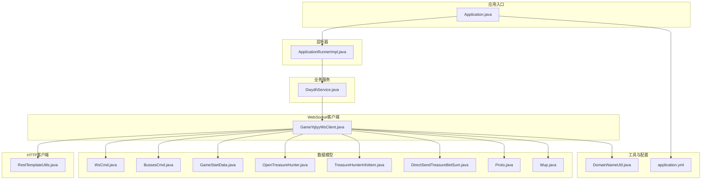
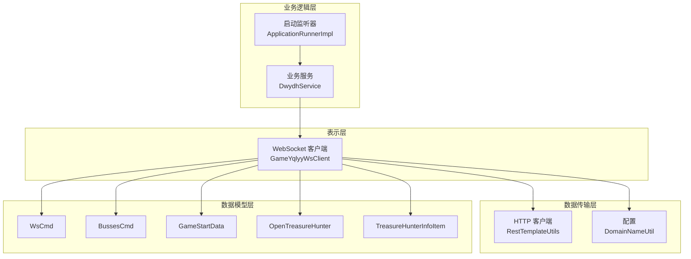
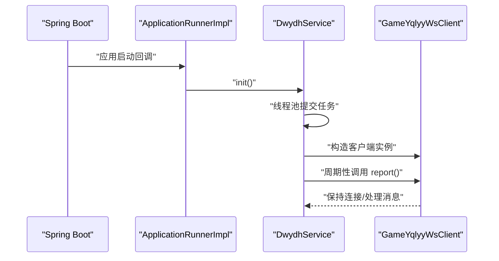
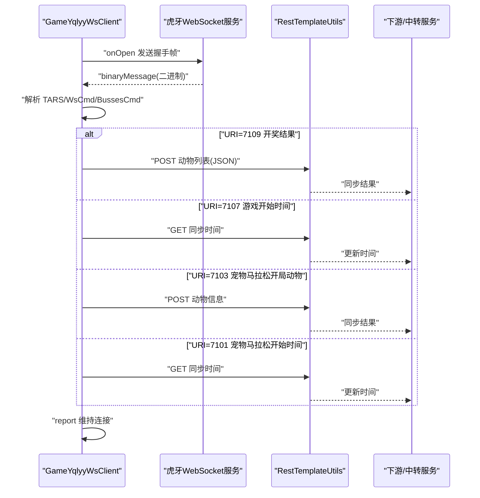
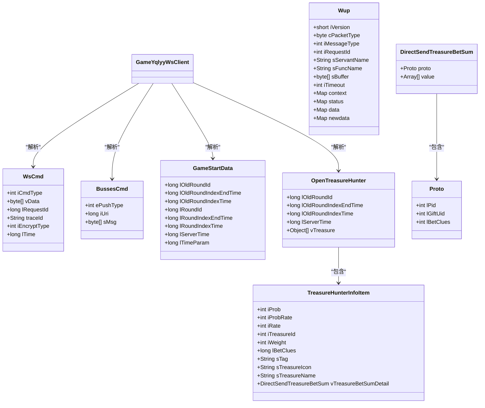
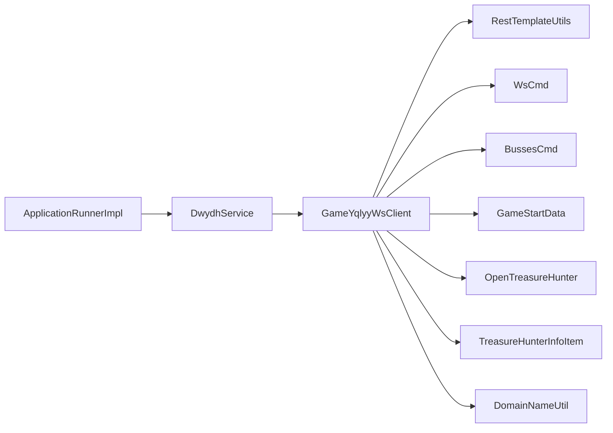
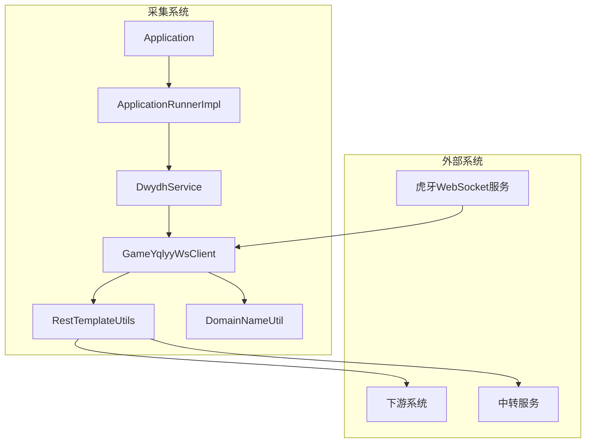

# 系统架构

<cite>
**本文引用的文件**
- [Application.java](file://src/main/java/com/Application.java)
- [application.yml](file://src/main/resources/application.yml)
- [ApplicationRunnerImpl.java](file://src/main/java/com/listener/ApplicationRunnerImpl.java)
- [DwydhService.java](file://src/main/java/com/dwydh/DwydhService.java)
- [GameYqlyyWsClient.java](file://src/main/java/com/yqlyy/GameYqlyyWsClient.java)
- [RestTemplateUtils.java](file://src/main/java/com/commom/RestTemplateUtils.java)
- [DomainNameUtil.java](file://src/main/java/com/utils/DomainNameUtil.java)
- [WsCmd.java](file://src/main/java/com/entity/WsCmd.java)
- [BussesCmd.java](file://src/main/java/com/entity/BussesCmd.java)
- [GameStartData.java](file://src/main/java/com/entity/GameStartData.java)
- [OpenTreasureHunter.java](file://src/main/java/com/entity/AccountedNotify/OpenTreasureHunter.java)
- [TreasureHunterInfoItem.java](file://src/main/java/com/entity/AccountedNotify/TreasureHunterInfoItem.java)
- [DirectSendTreasureBetSum.java](file://src/main/java/com/entity/AccountedNotify/DirectSendTreasureBetSum.java)
- [Proto.java](file://src/main/java/com/entity/AccountedNotify/Proto.java)
- [Wup.java](file://src/main/java/com/entity/Wup.java)
</cite>

## 目录
1. [引言](#引言)
2. [项目结构](#项目结构)
3. [核心组件](#核心组件)
4. [架构总览](#架构总览)
5. [详细组件分析](#详细组件分析)
6. [依赖分析](#依赖分析)
7. [性能考虑](#性能考虑)
8. [故障排查指南](#故障排查指南)
9. [结论](#结论)
10. [附录](#附录)

## 引言
本系统是虎牙游戏数据采集与同步系统，负责通过 WebSocket 接收虎牙直播平台的游戏推送数据，并将关键事件（如游戏开始、开奖结果）同步至内部中转服务与下游系统。系统采用 Spring Boot 框架，结合线程池调度、WebSocket 客户端与 HTTP 客户端工具，实现异步数据采集与可靠事件分发。

## 项目结构
项目采用按功能域分层的目录组织方式：
- com：根包，包含应用入口、监听器、服务与工具
- com.dwydh：业务服务层，封装定时任务与调度逻辑
- com.yqlyy：WebSocket 客户端实现，负责与虎牙服务建立连接并解析消息
- com.entity：数据模型与协议结构，承载消息解码所需的结构体定义
- com.utils：通用工具类，如域名配置
- com.commom：通用组件，如 HTTP 客户端封装
- resources：配置文件，包含应用端口、线程池与 HTTP 客户端参数

图表来源
- [Application.java](file://src/main/java/com/Application.java#L1-L14)
- [ApplicationRunnerImpl.java](file://src/main/java/com/listener/ApplicationRunnerImpl.java#L1-L34)
- [DwydhService.java](file://src/main/java/com/dwydh/DwydhService.java#L1-L39)
- [GameYqlyyWsClient.java](file://src/main/java/com/yqlyy/GameYqlyyWsClient.java#L1-L328)
- [RestTemplateUtils.java](file://src/main/java/com/commom/RestTemplateUtils.java#L1-L31)
- [DomainNameUtil.java](file://src/main/java/com/utils/DomainNameUtil.java#L1-L16)
- [application.yml](file://src/main/resources/application.yml#L1-L31)
- [WsCmd.java](file://src/main/java/com/entity/WsCmd.java#L1-L69)
- [BussesCmd.java](file://src/main/java/com/entity/BussesCmd.java#L1-L10)
- [GameStartData.java](file://src/main/java/com/entity/GameStartData.java#L1-L79)
- [OpenTreasureHunter.java](file://src/main/java/com/entity/AccountedNotify/OpenTreasureHunter.java#L1-L83)
- [TreasureHunterInfoItem.java](file://src/main/java/com/entity/AccountedNotify/TreasureHunterInfoItem.java#L1-L124)
- [DirectSendTreasureBetSum.java](file://src/main/java/com/entity/AccountedNotify/DirectSendTreasureBetSum.java#L1-L9)
- [Proto.java](file://src/main/java/com/entity/AccountedNotify/Proto.java#L1-L8)
- [Wup.java](file://src/main/java/com/entity/Wup.java#L1-L29)

章节来源
- [Application.java](file://src/main/java/com/Application.java#L1-L14)
- [application.yml](file://src/main/resources/application.yml#L1-L31)

## 核心组件
- 应用入口与容器
  - Application：Spring Boot 启动类，负责引导应用上下文
- 应用启动监听器
  - ApplicationRunnerImpl：在应用启动后执行初始化逻辑，触发业务服务
- 业务服务
  - DwydhService：使用线程池调度 WebSocket 客户端，周期性上报与维持连接
- WebSocket 客户端
  - GameYqlyyWsClient：基于 Java WebSocket API 的客户端，负责握手、心跳、消息解析与事件上报
- HTTP 客户端工具
  - RestTemplateUtils：对 RestTemplate 的轻量封装，提供 GET/POST/exchange 方法
- 工具与配置
  - DomainNameUtil：集中管理目标地址与中转地址
  - application.yml：应用端口、线程池与 HTTP 客户端参数配置

章节来源
- [Application.java](file://src/main/java/com/Application.java#L1-L14)
- [ApplicationRunnerImpl.java](file://src/main/java/com/listener/ApplicationRunnerImpl.java#L1-L34)
- [DwydhService.java](file://src/main/java/com/dwydh/DwydhService.java#L1-L39)
- [GameYqlyyWsClient.java](file://src/main/java/com/yqlyy/GameYqlyyWsClient.java#L1-L328)
- [RestTemplateUtils.java](file://src/main/java/com/commom/RestTemplateUtils.java#L1-L31)
- [DomainNameUtil.java](file://src/main/java/com/utils/DomainNameUtil.java#L1-L16)
- [application.yml](file://src/main/resources/application.yml#L1-L31)

## 架构总览
系统采用分层架构：
- 表示层：无传统 Web 控制器，通过 WebSocket 接收数据，通过 HTTP 将事件同步到下游
- 业务逻辑层：DwydhService 负责调度与生命周期管理；GameYqlyyWsClient 负责消息解析与事件分发
- 数据传输层：RestTemplateUtils 统一封装 HTTP 请求；DomainNameUtil 配置目标地址
- 数据模型层：实体类承载消息结构，支持二进制协议解析

图表来源
- [ApplicationRunnerImpl.java](file://src/main/java/com/listener/ApplicationRunnerImpl.java#L1-L34)
- [DwydhService.java](file://src/main/java/com/dwydh/DwydhService.java#L1-L39)
- [GameYqlyyWsClient.java](file://src/main/java/com/yqlyy/GameYqlyyWsClient.java#L1-L328)
- [RestTemplateUtils.java](file://src/main/java/com/commom/RestTemplateUtils.java#L1-L31)
- [DomainNameUtil.java](file://src/main/java/com/utils/DomainNameUtil.java#L1-L16)
- [WsCmd.java](file://src/main/java/com/entity/WsCmd.java#L1-L69)
- [BussesCmd.java](file://src/main/java/com/entity/BussesCmd.java#L1-L10)
- [GameStartData.java](file://src/main/java/com/entity/GameStartData.java#L1-L79)
- [OpenTreasureHunter.java](file://src/main/java/com/entity/AccountedNotify/OpenTreasureHunter.java#L1-L83)
- [TreasureHunterInfoItem.java](file://src/main/java/com/entity/AccountedNotify/TreasureHunterInfoItem.java#L1-L124)

## 详细组件分析

### 组件一：应用启动与调度（ApplicationRunnerImpl → DwydhService）
- 职责
  - 在应用启动完成后，调用业务服务初始化方法，开启 WebSocket 客户端的周期性任务
- 关键交互
  - 启动监听器注入业务服务，执行初始化
  - 业务服务通过线程池提交任务，创建 WebSocket 客户端并循环上报
- 设计要点
  - 使用线程池避免阻塞主线程
  - 初始化逻辑集中在业务服务，便于扩展与测试

图表来源
- [ApplicationRunnerImpl.java](file://src/main/java/com/listener/ApplicationRunnerImpl.java#L25-L31)
- [DwydhService.java](file://src/main/java/com/dwydh/DwydhService.java#L21-L36)
- [GameYqlyyWsClient.java](file://src/main/java/com/yqlyy/GameYqlyyWsClient.java#L274-L290)

章节来源
- [ApplicationRunnerImpl.java](file://src/main/java/com/listener/ApplicationRunnerImpl.java#L1-L34)
- [DwydhService.java](file://src/main/java/com/dwydh/DwydhService.java#L1-L39)

### 组件二：WebSocket 客户端（GameYqlyyWsClient）
- 职责
  - 建立与虎牙 WebSocket 服务的连接
  - 处理二进制消息，解析命令类型与业务数据
  - 根据不同 URI 分发事件：开奖结果、游戏开始时间等
  - 通过 HTTP 客户端同步事件到中转与下游系统
- 关键流程
  - onOpen：发送握手与进入游戏的二进制帧
  - binaryMessage：解析 TARS 协议，识别命令类型与 URI，提取业务数据
  - 根据 URI 分支处理：
    - 7109：开奖结果（多只动物），组装 JSON 并 POST 到多个目标地址
    - 7107：游戏开始时间（旧轮次），GET 同步到中转服务
    - 7103：宠物马拉松开局动物，POST 到下游
    - 7101：宠物马拉松开始时间，GET 同步到中转服务
  - report：维持连接，必要时重连
- 错误处理
  - OnError 记录异常
  - OnClose 记录断开
  - 连接异常时尝试重连

图表来源
- [GameYqlyyWsClient.java](file://src/main/java/com/yqlyy/GameYqlyyWsClient.java#L46-L219)
- [GameYqlyyWsClient.java](file://src/main/java/com/yqlyy/GameYqlyyWsClient.java#L221-L290)
- [RestTemplateUtils.java](file://src/main/java/com/commom/RestTemplateUtils.java#L19-L29)

章节来源
- [GameYqlyyWsClient.java](file://src/main/java/com/yqlyy/GameYqlyyWsClient.java#L1-L328)
- [RestTemplateUtils.java](file://src/main/java/com/commom/RestTemplateUtils.java#L1-L31)

### 组件三：HTTP 客户端封装（RestTemplateUtils）
- 职责
  - 对 RestTemplate 进行轻量封装，提供统一的 GET/POST/exchange 能力
- 使用场景
  - WebSocket 客户端在不同 URI 分支中调用 GET/POST 进行事件同步
- 设计要点
  - 统一异常处理由调用方捕获（如 WebSocket 客户端中的 RestClientException）

章节来源
- [RestTemplateUtils.java](file://src/main/java/com/commom/RestTemplateUtils.java#L1-L31)
- [GameYqlyyWsClient.java](file://src/main/java/com/yqlyy/GameYqlyyWsClient.java#L103-L114)
- [GameYqlyyWsClient.java](file://src/main/java/com/yqlyy/GameYqlyyWsClient.java#L136-L147)
- [GameYqlyyWsClient.java](file://src/main/java/com/yqlyy/GameYqlyyWsClient.java#L170-L181)
- [GameYqlyyWsClient.java](file://src/main/java/com/yqlyy/GameYqlyyWsClient.java#L202-L213)

### 组件四：数据模型与协议解析（实体类）
- WsCmd：WebSocket 命令头，包含命令类型与数据载荷
- BussesCmd：业务命令结构，包含 URI 与消息体
- GameStartData：游戏开始相关的时间戳字段
- OpenTreasureHunter：开奖结果聚合结构，包含动物列表
- TreasureHunterInfoItem：单个动物信息
- DirectSendTreasureBetSum / Proto：投注明细结构（简化模型）
- Wup：通用协议封装（字段示意）

图表来源
- [WsCmd.java](file://src/main/java/com/entity/WsCmd.java#L1-L69)
- [BussesCmd.java](file://src/main/java/com/entity/BussesCmd.java#L1-L10)
- [GameStartData.java](file://src/main/java/com/entity/GameStartData.java#L1-L79)
- [OpenTreasureHunter.java](file://src/main/java/com/entity/AccountedNotify/OpenTreasureHunter.java#L1-L83)
- [TreasureHunterInfoItem.java](file://src/main/java/com/entity/AccountedNotify/TreasureHunterInfoItem.java#L1-L124)
- [DirectSendTreasureBetSum.java](file://src/main/java/com/entity/AccountedNotify/DirectSendTreasureBetSum.java#L1-L9)
- [Proto.java](file://src/main/java/com/entity/AccountedNotify/Proto.java#L1-L8)
- [Wup.java](file://src/main/java/com/entity/Wup.java#L1-L29)

章节来源
- [WsCmd.java](file://src/main/java/com/entity/WsCmd.java#L1-L69)
- [BussesCmd.java](file://src/main/java/com/entity/BussesCmd.java#L1-L10)
- [GameStartData.java](file://src/main/java/com/entity/GameStartData.java#L1-L79)
- [OpenTreasureHunter.java](file://src/main/java/com/entity/AccountedNotify/OpenTreasureHunter.java#L1-L83)
- [TreasureHunterInfoItem.java](file://src/main/java/com/entity/AccountedNotify/TreasureHunterInfoItem.java#L1-L124)
- [DirectSendTreasureBetSum.java](file://src/main/java/com/entity/AccountedNotify/DirectSendTreasureBetSum.java#L1-L9)
- [Proto.java](file://src/main/java/com/entity/AccountedNotify/Proto.java#L1-L8)
- [Wup.java](file://src/main/java/com/entity/Wup.java#L1-L29)

### 组件五：配置与域名管理（DomainNameUtil、application.yml）
- DomainNameUtil
  - urls：下游目标地址数组（当前为空，预留扩展）
  - transitUrls：中转服务地址数组（当前指向本地端口）
- application.yml
  - server.port/context-path：应用端口与上下文路径
  - spring.application.name/profiles.active：应用名与环境
  - http.*：HTTP 客户端连接池与超时参数

章节来源
- [DomainNameUtil.java](file://src/main/java/com/utils/DomainNameUtil.java#L1-L16)
- [application.yml](file://src/main/resources/application.yml#L1-L31)

## 依赖分析
- 组件耦合
  - ApplicationRunnerImpl 依赖 DwydhService
  - DwydhService 依赖 GameYqlyyWsClient 与 RestTemplateUtils
  - GameYqlyyWsClient 依赖 RestTemplateUtils、DomainNameUtil 与实体模型
- 外部依赖
  - WebSocket 容器、TARS 解析库、Apache Commons Codec（AES/CBC）
- 潜在风险
  - URLs 数组为空可能导致同步失败
  - 中转地址固定在本地端口，需配合下游服务部署

图表来源
- [ApplicationRunnerImpl.java](file://src/main/java/com/listener/ApplicationRunnerImpl.java#L22-L23)
- [DwydhService.java](file://src/main/java/com/dwydh/DwydhService.java#L16-L19)
- [GameYqlyyWsClient.java](file://src/main/java/com/yqlyy/GameYqlyyWsClient.java#L32-L44)
- [RestTemplateUtils.java](file://src/main/java/com/commom/RestTemplateUtils.java#L16-L17)
- [DomainNameUtil.java](file://src/main/java/com/utils/DomainNameUtil.java#L4-L13)
- [WsCmd.java](file://src/main/java/com/entity/WsCmd.java#L1-L69)
- [BussesCmd.java](file://src/main/java/com/entity/BussesCmd.java#L1-L10)
- [GameStartData.java](file://src/main/java/com/entity/GameStartData.java#L1-L79)
- [OpenTreasureHunter.java](file://src/main/java/com/entity/AccountedNotify/OpenTreasureHunter.java#L1-L83)
- [TreasureHunterInfoItem.java](file://src/main/java/com/entity/AccountedNotify/TreasureHunterInfoItem.java#L1-L124)

章节来源
- [ApplicationRunnerImpl.java](file://src/main/java/com/listener/ApplicationRunnerImpl.java#L1-L34)
- [DwydhService.java](file://src/main/java/com/dwydh/DwydhService.java#L1-L39)
- [GameYqlyyWsClient.java](file://src/main/java/com/yqlyy/GameYqlyyWsClient.java#L1-L328)
- [RestTemplateUtils.java](file://src/main/java/com/commom/RestTemplateUtils.java#L1-L31)
- [DomainNameUtil.java](file://src/main/java/com/utils/DomainNameUtil.java#L1-L16)

## 性能考虑
- 连接与缓冲
  - WebSocket 容器默认缓冲区与超时已设置，建议根据消息大小与并发调整
- 线程池
  - 业务服务使用线程池调度，避免阻塞；建议根据上游推送频率与下游同步耗时调优线程数
- HTTP 客户端
  - application.yml 中配置了连接池大小、超时与校验策略；建议结合下游服务性能与网络状况优化
- 解析与序列化
  - TARS 解析与 JSON 组装在消息到达时执行，建议对热点字段做缓存或复用对象以降低 GC 压力

## 故障排查指南
- WebSocket 连接问题
  - 检查 onOpen 是否成功发送握手帧；确认 wsUrl 有效
  - 观察 onError/onClose 日志，定位异常原因
- 消息解析问题
  - 确认二进制帧长度与格式；检查 TARS 字段索引与类型匹配
- HTTP 同步失败
  - 检查 urls/transitUrls 是否正确配置；查看 RestClientException 与日志
- 时间同步异常
  - 确认 GameStartData 字段读取顺序与 URI 分支一致

章节来源
- [GameYqlyyWsClient.java](file://src/main/java/com/yqlyy/GameYqlyyWsClient.java#L240-L248)
- [GameYqlyyWsClient.java](file://src/main/java/com/yqlyy/GameYqlyyWsClient.java#L103-L114)
- [GameYqlyyWsClient.java](file://src/main/java/com/yqlyy/GameYqlyyWsClient.java#L136-L147)
- [GameYqlyyWsClient.java](file://src/main/java/com/yqlyy/GameYqlyyWsClient.java#L170-L181)
- [GameYqlyyWsClient.java](file://src/main/java/com/yqlyy/GameYqlyyWsClient.java#L202-L213)

## 结论
该系统通过清晰的分层与模块化设计，实现了从 WebSocket 接收、协议解析到 HTTP 同步的完整链路。业务服务与 WebSocket 客户端职责明确，数据模型支撑了关键事件的结构化处理。建议后续完善域名配置、增强错误恢复与可观测性，并根据实际流量与下游能力持续优化连接池与线程池参数。

## 附录
- 系统边界图（概念示意）
