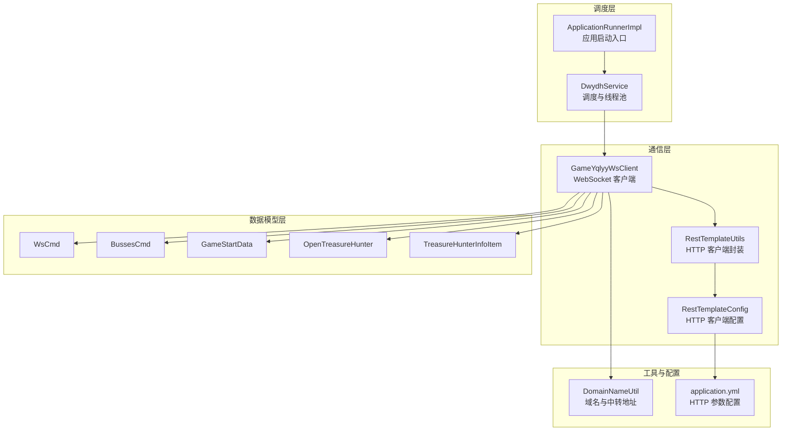
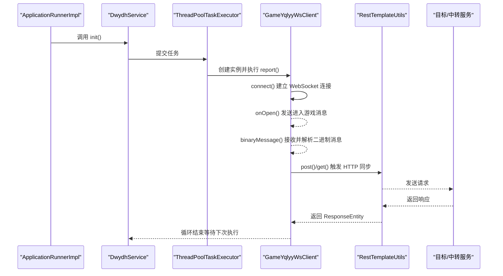
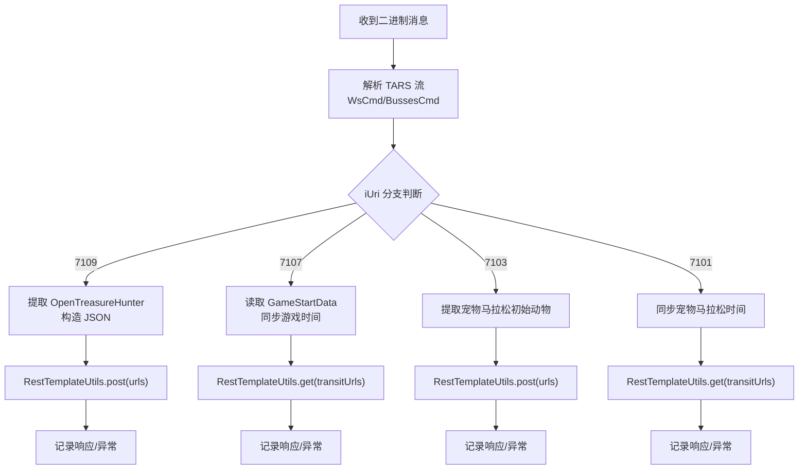
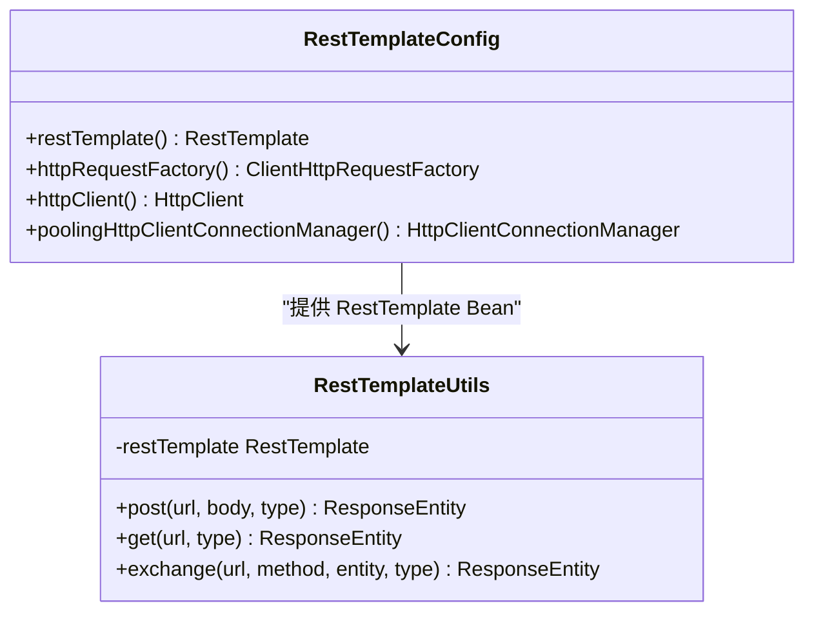
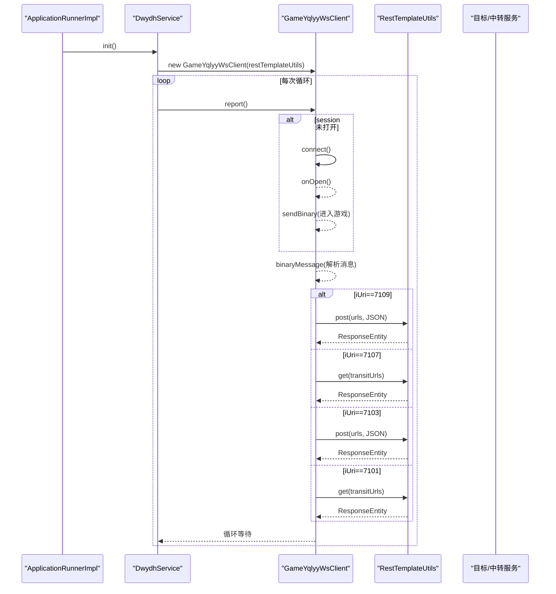
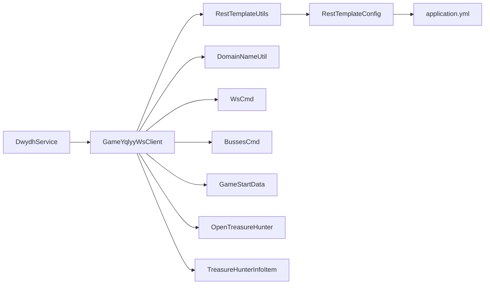

# 组件交互关系

<cite>
**本文档引用的文件**
- [DwydhService.java](file://src/main/java/com/dwydh/DwydhService.java)
- [GameYqlyyWsClient.java](file://src/main/java/com/yqlyy/GameYqlyyWsClient.java)
- [RestTemplateUtils.java](file://src/main/java/com/commom/RestTemplateUtils.java)
- [RestTemplateConfig.java](file://src/main/java/com/commom/RestTemplateConfig.java)
- [ApplicationRunnerImpl.java](file://src/main/java/com/listener/ApplicationRunnerImpl.java)
- [DomainNameUtil.java](file://src/main/java/com/utils/DomainNameUtil.java)
- [WsCmd.java](file://src/main/java/com/entity/WsCmd.java)
- [BussesCmd.java](file://src/main/java/com/entity/BussesCmd.java)
- [GameStartData.java](file://src/main/java/com/entity/GameStartData.java)
- [OpenTreasureHunter.java](file://src/main/java/com/entity/AccountedNotify/OpenTreasureHunter.java)
- [TreasureHunterInfoItem.java](file://src/main/java/com/entity/AccountedNotify/TreasureHunterInfoItem.java)
- [application.yml](file://src/main/resources/application.yml)
- [pom.xml](file://pom.xml)
</cite>

## 目录
1. [引言](#引言)
2. [项目结构](#项目结构)
3. [核心组件](#核心组件)
4. [架构总览](#架构总览)
5. [详细组件分析](#详细组件分析)
6. [依赖关系分析](#依赖关系分析)
7. [性能考虑](#性能考虑)
8. [故障排查指南](#故障排查指南)
9. [结论](#结论)

## 引言
本文件聚焦于虎牙游戏数据采集系统中各核心组件的协作模式，重点阐述 DwydhService 如何协调 WebSocket 客户端与 HTTP 客户端工作；解释 GameYqlyyWsClient 与 RestTemplateUtils 的依赖关系及数据传递机制；梳理从 WebSocket 连接建立到数据同步完成的完整链路；并给出组件生命周期管理、错误传播机制与异常处理策略，以及典型数据流的时序图与依赖关系图。

## 项目结构
系统采用分层与按功能域组织的结构：
- com.dwydh：调度与生命周期管理（DwydhService）
- com.yqlyy：WebSocket 客户端实现（GameYqlyyWsClient）
- com.commom：HTTP 客户端封装与配置（RestTemplateUtils、RestTemplateConfig）
- com.entity：协议与业务数据模型（WsCmd、BussesCmd、GameStartData、OpenTreasureHunter、TreasureHunterInfoItem）
- com.utils：域名与中转地址常量（DomainNameUtil）
- com.listener：应用启动入口（ApplicationRunnerImpl）
- resources：Spring 配置与日志配置（application.yml、logback.xml）



图表来源
- [DwydhService.java](file://src/main/java/com/dwydh/DwydhService.java#L1-L39)
- [GameYqlyyWsClient.java](file://src/main/java/com/yqlyy/GameYqlyyWsClient.java#L1-L328)
- [RestTemplateUtils.java](file://src/main/java/com/commom/RestTemplateUtils.java#L1-L31)
- [RestTemplateConfig.java](file://src/main/java/com/commom/RestTemplateConfig.java#L1-L132)
- [ApplicationRunnerImpl.java](file://src/main/java/com/listener/ApplicationRunnerImpl.java#L1-L34)
- [DomainNameUtil.java](file://src/main/java/com/utils/DomainNameUtil.java#L1-L16)
- [WsCmd.java](file://src/main/java/com/entity/WsCmd.java#L1-L69)
- [BussesCmd.java](file://src/main/java/com/entity/BussesCmd.java#L1-L10)
- [GameStartData.java](file://src/main/java/com/entity/GameStartData.java#L1-L79)
- [OpenTreasureHunter.java](file://src/main/java/com/entity/AccountedNotify/OpenTreasureHunter.java#L1-L83)
- [TreasureHunterInfoItem.java](file://src/main/java/com/entity/AccountedNotify/TreasureHunterInfoItem.java#L1-L124)
- [application.yml](file://src/main/resources/application.yml#L1-L31)

章节来源
- [pom.xml](file://pom.xml#L1-L160)

## 核心组件
- DwydhService：负责在独立线程中周期性触发 WebSocket 客户端的上报逻辑，承担组件生命周期的启动与调度职责。
- GameYqlyyWsClient：基于 Jakarta WebSocket API 的客户端，负责与虎牙 WebSocket 服务建立连接、接收二进制消息、解析协议、触发 HTTP 同步。
- RestTemplateUtils：对 RestTemplate 的轻量封装，提供 GET/POST/exchange 方法，屏蔽底层 HTTP 客户端细节。
- RestTemplateConfig：定义 HTTP 连接池、超时、重试等参数，为 RestTemplate 提供统一的 HTTP 客户端工厂。
- ApplicationRunnerImpl：应用启动后自动执行初始化逻辑，调用 DwydhService.init()。
- DomainNameUtil：集中维护目标服务域名数组与中转服务地址数组，用于 HTTP 同步。
- 实体模型：WsCmd、BussesCmd、GameStartData、OpenTreasureHunter、TreasureHunterInfoItem，承载协议字段与业务数据。

章节来源
- [DwydhService.java](file://src/main/java/com/dwydh/DwydhService.java#L1-L39)
- [GameYqlyyWsClient.java](file://src/main/java/com/yqlyy/GameYqlyyWsClient.java#L1-L328)
- [RestTemplateUtils.java](file://src/main/java/com/commom/RestTemplateUtils.java#L1-L31)
- [RestTemplateConfig.java](file://src/main/java/com/commom/RestTemplateConfig.java#L1-L132)
- [ApplicationRunnerImpl.java](file://src/main/java/com/listener/ApplicationRunnerImpl.java#L1-L34)
- [DomainNameUtil.java](file://src/main/java/com/utils/DomainNameUtil.java#L1-L16)

## 架构总览
系统采用“调度线程 + WebSocket 客户端 + HTTP 同步”的三层协作模式：
- ApplicationRunnerImpl 在应用启动时触发 DwydhService.init()。
- DwydhService 使用线程池执行循环任务，实例化 GameYqlyyWsClient 并周期性调用其 report()。
- GameYqlyyWsClient 负责 WebSocket 连接、心跳、消息解析与业务数据提取。
- 解析后的业务数据通过 RestTemplateUtils 发送到目标服务或中转服务，实现数据同步。



图表来源
- [ApplicationRunnerImpl.java](file://src/main/java/com/listener/ApplicationRunnerImpl.java#L25-L31)
- [DwydhService.java](file://src/main/java/com/dwydh/DwydhService.java#L21-L36)
- [GameYqlyyWsClient.java](file://src/main/java/com/yqlyy/GameYqlyyWsClient.java#L250-L290)
- [RestTemplateUtils.java](file://src/main/java/com/commom/RestTemplateUtils.java#L19-L29)

## 详细组件分析

### DwydhService 协调机制
- 生命周期：ApplicationRunnerImpl 在应用启动后调用 DwydhService.init()。
- 执行策略：使用线程池提交任务，内部循环执行 GameYqlyyWsClient.report()，每次间隔固定时长。
- 资源注入：持有 ThreadPoolTaskExecutor 与 RestTemplateUtils，前者用于异步调度，后者用于 HTTP 同步。

```mermaid
flowchart TD
Start(["应用启动"]) --> Runner["ApplicationRunnerImpl.run()"]
Runner --> Init["DwydhService.init()"]
Init --> Submit["线程池提交任务"]
Submit --> Loop{"循环执行"}
Loop --> |report()| WS["GameYqlyyWsClient"]
WS --> Loop
```

图表来源
- [ApplicationRunnerImpl.java](file://src/main/java/com/listener/ApplicationRunnerImpl.java#L25-L31)
- [DwydhService.java](file://src/main/java/com/dwydh/DwydhService.java#L21-L36)

章节来源
- [DwydhService.java](file://src/main/java/com/dwydh/DwydhService.java#L1-L39)
- [ApplicationRunnerImpl.java](file://src/main/java/com/listener/ApplicationRunnerImpl.java#L1-L34)

### GameYqlyyWsClient 消息处理与数据同步
- WebSocket 生命周期：
  - onOpen：发送进入游戏的二进制消息，建立会话。
  - binaryMessage：解析二进制消息，识别命令类型与业务 URI，提取开奖动物或游戏时间等数据。
  - onMessage/onError/onClose：记录日志与异常信息。
- 数据解析：
  - 使用 TARS 流解析 WsCmd/BussesCmd，根据 iUri 分支处理不同业务场景（如 7109 开奖、7107 游戏时间同步等）。
  - 对 OpenTreasureHunter 中的 TreasureHunterInfoItem 列表进行遍历，构造 JSON 数据。
- HTTP 同步：
  - 使用 RestTemplateUtils.post/get 将数据发送至 DomainNameUtil.urls 或 transitUrls 中的目标服务。
  - 对 RestClientException 与通用异常进行捕获与日志记录，保证消息处理链路不中断。



图表来源
- [GameYqlyyWsClient.java](file://src/main/java/com/yqlyy/GameYqlyyWsClient.java#L51-L218)
- [WsCmd.java](file://src/main/java/com/entity/WsCmd.java#L1-L69)
- [BussesCmd.java](file://src/main/java/com/entity/BussesCmd.java#L1-L10)
- [OpenTreasureHunter.java](file://src/main/java/com/entity/AccountedNotify/OpenTreasureHunter.java#L73-L81)
- [TreasureHunterInfoItem.java](file://src/main/java/com/entity/AccountedNotify/TreasureHunterInfoItem.java#L110-L122)
- [RestTemplateUtils.java](file://src/main/java/com/commom/RestTemplateUtils.java#L19-L29)
- [DomainNameUtil.java](file://src/main/java/com/utils/DomainNameUtil.java#L4-L13)

章节来源
- [GameYqlyyWsClient.java](file://src/main/java/com/yqlyy/GameYqlyyWsClient.java#L1-L328)
- [WsCmd.java](file://src/main/java/com/entity/WsCmd.java#L1-L69)
- [BussesCmd.java](file://src/main/java/com/entity/BussesCmd.java#L1-L10)
- [GameStartData.java](file://src/main/java/com/entity/GameStartData.java#L1-L79)
- [OpenTreasureHunter.java](file://src/main/java/com/entity/AccountedNotify/OpenTreasureHunter.java#L1-L83)
- [TreasureHunterInfoItem.java](file://src/main/java/com/entity/AccountedNotify/TreasureHunterInfoItem.java#L1-L124)

### RestTemplateUtils 与 RestTemplateConfig 的依赖关系
- RestTemplateConfig：
  - 定义 RestTemplate Bean，使用 Apache HttpClient 作为底层 HTTP 客户端。
  - 配置连接池大小、并发限制、超时时间、重试策略与 Keep-Alive 策略。
  - 通过 application.yml 注入 HTTP 参数（如连接超时、套接字超时、最大连接数等）。
- RestTemplateUtils：
  - 对 RestTemplate 的 GET/POST/exchange 进行封装，简化调用方代码。
  - GameYqlyyWsClient 通过注入的 RestTemplateUtils 执行 HTTP 请求。



图表来源
- [RestTemplateConfig.java](file://src/main/java/com/commom/RestTemplateConfig.java#L62-L129)
- [RestTemplateUtils.java](file://src/main/java/com/commom/RestTemplateUtils.java#L14-L30)

章节来源
- [RestTemplateConfig.java](file://src/main/java/com/commom/RestTemplateConfig.java#L1-L132)
- [RestTemplateUtils.java](file://src/main/java/com/commom/RestTemplateUtils.java#L1-L31)
- [application.yml](file://src/main/resources/application.yml#L16-L31)

### 组件间消息传递流程（时序图）
以下时序图展示从 WebSocket 连接建立到数据同步完成的完整链路，涵盖错误传播与异常处理。



图表来源
- [ApplicationRunnerImpl.java](file://src/main/java/com/listener/ApplicationRunnerImpl.java#L25-L31)
- [DwydhService.java](file://src/main/java/com/dwydh/DwydhService.java#L21-L36)
- [GameYqlyyWsClient.java](file://src/main/java/com/yqlyy/GameYqlyyWsClient.java#L250-L290)
- [RestTemplateUtils.java](file://src/main/java/com/commom/RestTemplateUtils.java#L19-L29)

## 依赖关系分析
- 组件耦合度：
  - GameYqlyyWsClient 与 RestTemplateUtils 存在直接依赖，便于在消息解析后快速发起 HTTP 请求。
  - DwydhService 通过线程池调度 GameYqlyyWsClient，形成弱耦合的调度关系。
- 外部依赖：
  - WebSocket 客户端依赖 Jakarta WebSocket API 与 Tyrus 客户端实现。
  - HTTP 客户端依赖 Apache HttpClient 与 Spring Web 的 RestTemplate。
- 配置依赖：
  - HTTP 超时、连接池参数由 application.yml 提供，RestTemplateConfig 读取这些值并注入到 HTTP 客户端。



图表来源
- [DwydhService.java](file://src/main/java/com/dwydh/DwydhService.java#L1-L39)
- [GameYqlyyWsClient.java](file://src/main/java/com/yqlyy/GameYqlyyWsClient.java#L1-L328)
- [RestTemplateUtils.java](file://src/main/java/com/commom/RestTemplateUtils.java#L1-L31)
- [RestTemplateConfig.java](file://src/main/java/com/commom/RestTemplateConfig.java#L1-L132)
- [application.yml](file://src/main/resources/application.yml#L16-L31)
- [DomainNameUtil.java](file://src/main/java/com/utils/DomainNameUtil.java#L1-L16)
- [WsCmd.java](file://src/main/java/com/entity/WsCmd.java#L1-L69)
- [BussesCmd.java](file://src/main/java/com/entity/BussesCmd.java#L1-L10)
- [GameStartData.java](file://src/main/java/com/entity/GameStartData.java#L1-L79)
- [OpenTreasureHunter.java](file://src/main/java/com/entity/AccountedNotify/OpenTreasureHunter.java#L1-L83)
- [TreasureHunterInfoItem.java](file://src/main/java/com/entity/AccountedNotify/TreasureHunterInfoItem.java#L1-L124)

## 性能考虑
- 连接池与超时：
  - RestTemplateConfig 使用 Apache HttpClient 连接池，合理设置最大连接数与每路由并发，避免阻塞。
  - 通过 application.yml 控制连接超时、套接字超时与连接池校验参数，提升稳定性。
- WebSocket 缓冲区：
  - GameYqlyyWsClient 设置默认二进制消息缓冲区大小与会话空闲超时，减少内存占用与连接抖动。
- 线程调度：
  - DwydhService 使用线程池执行周期性任务，避免主线程阻塞；建议根据业务量调整线程池大小与队列长度。

章节来源
- [RestTemplateConfig.java](file://src/main/java/com/commom/RestTemplateConfig.java#L84-L129)
- [application.yml](file://src/main/resources/application.yml#L16-L31)
- [GameYqlyyWsClient.java](file://src/main/java/com/yqlyy/GameYqlyyWsClient.java#L250-L272)
- [DwydhService.java](file://src/main/java/com/dwydh/DwydhService.java#L21-L36)

## 故障排查指南
- WebSocket 连接失败：
  - 检查 wsUrl 是否为空或不可达；查看 onOpen/connect 日志输出。
  - 关注 onError/onClose 回调中的异常堆栈。
- HTTP 同步异常：
  - RestClientException：检查目标服务可达性、URL 拼接与请求头；确认 DomainNameUtil.urls/transitUrls 正确。
  - 通用异常：查看日志中的错误堆栈，定位具体异常点。
- 数据解析问题：
  - 确认 iUri 分支覆盖完整；检查 TARS 字段索引与数据类型匹配。
- 超时与重试：
  - 调整 application.yml 中的超时与重试参数，观察效果。

章节来源
- [GameYqlyyWsClient.java](file://src/main/java/com/yqlyy/GameYqlyyWsClient.java#L240-L248)
- [RestTemplateUtils.java](file://src/main/java/com/commom/RestTemplateUtils.java#L19-L29)
- [application.yml](file://src/main/resources/application.yml#L16-L31)

## 结论
该系统通过 DwydhService 的线程池调度，结合 GameYqlyyWsClient 的 WebSocket 消息解析与 RestTemplateUtils 的 HTTP 同步能力，实现了从虎牙 WebSocket 数据采集到下游服务同步的完整链路。组件间通过明确的依赖关系与配置化参数实现了解耦与可扩展性。建议后续进一步完善异常监控与告警、优化线程池与连接池参数、增强协议解析的健壮性与可测试性。