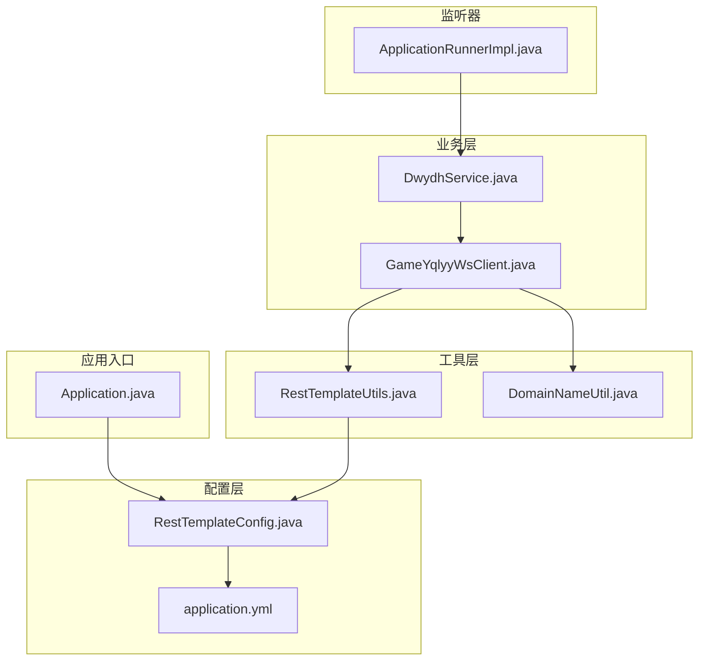
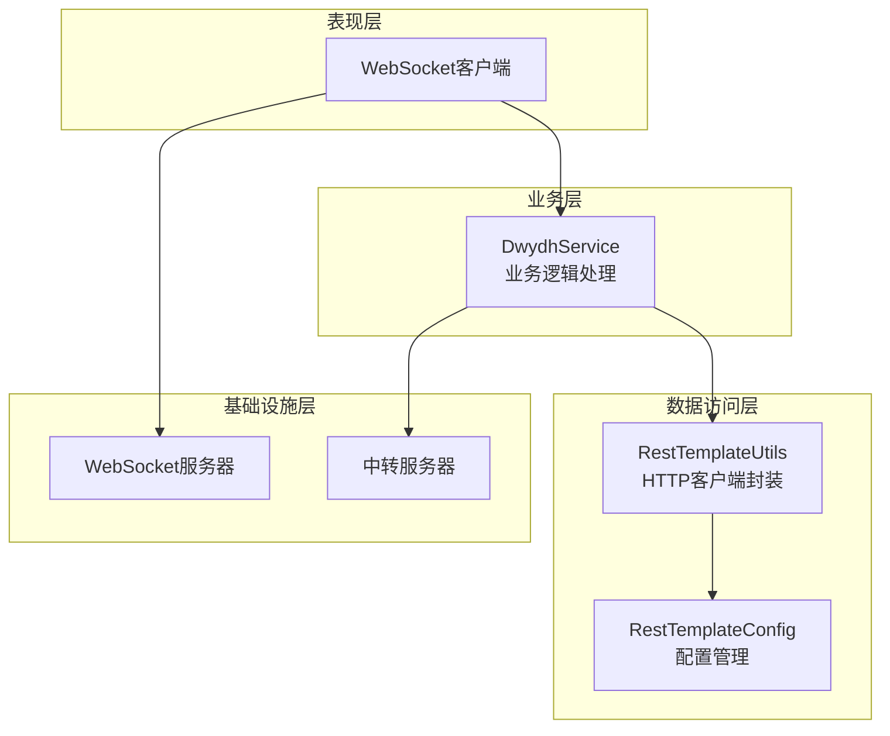
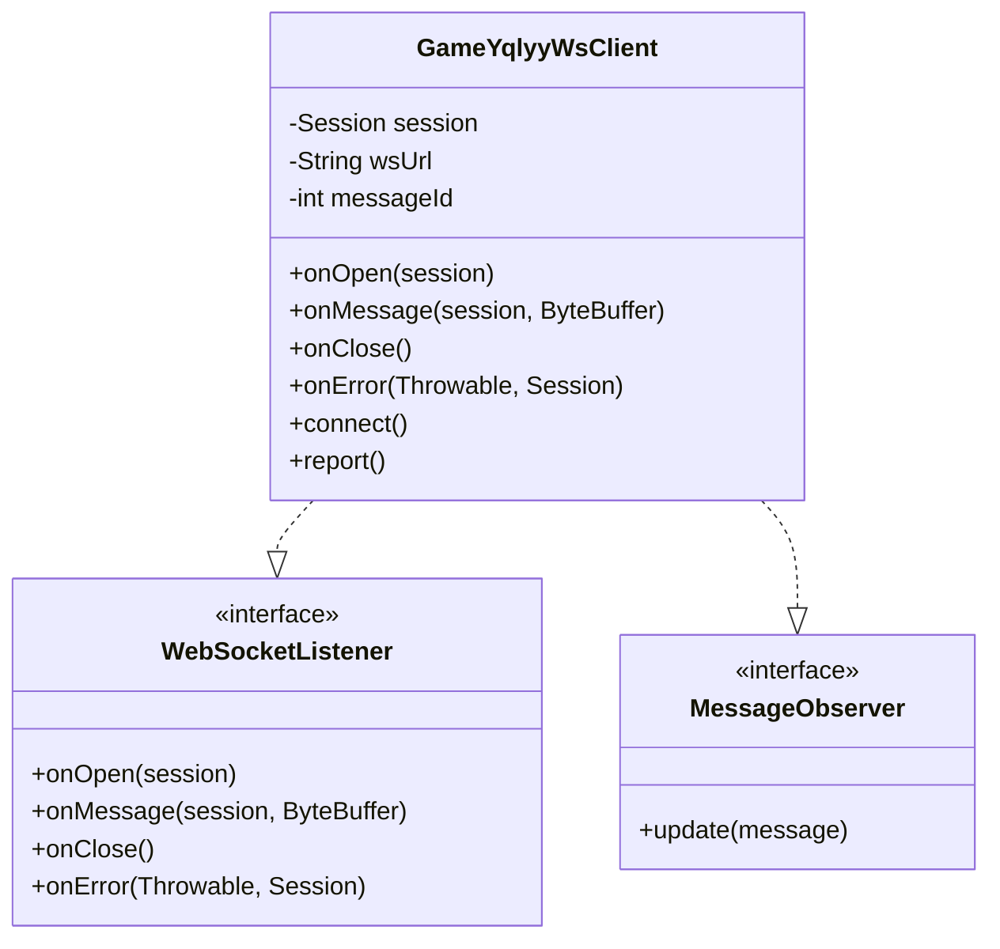
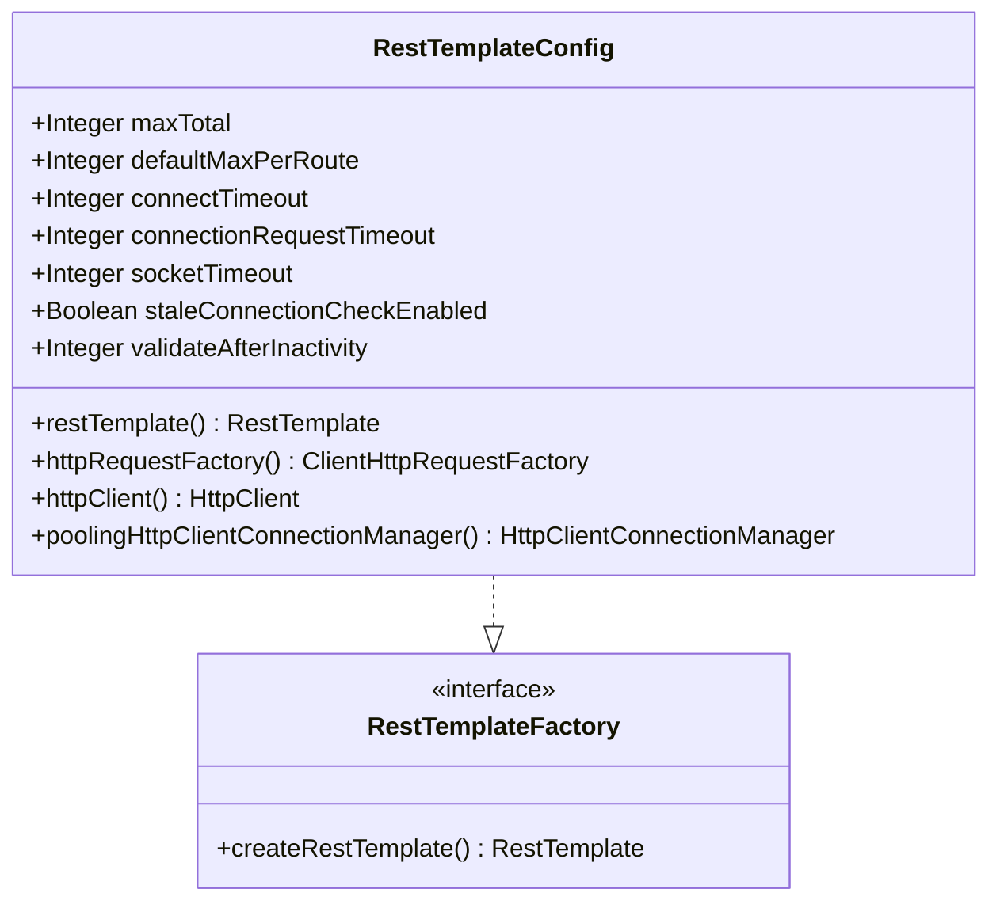
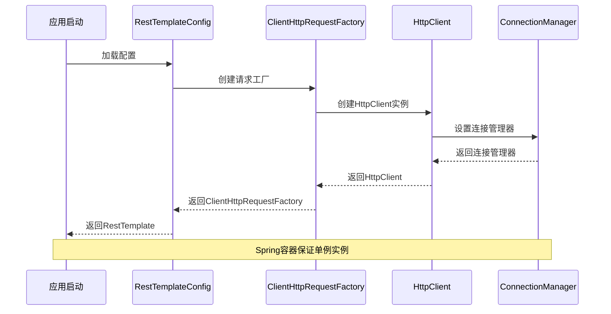
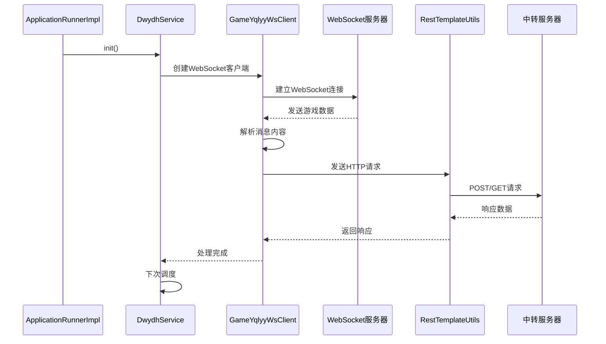
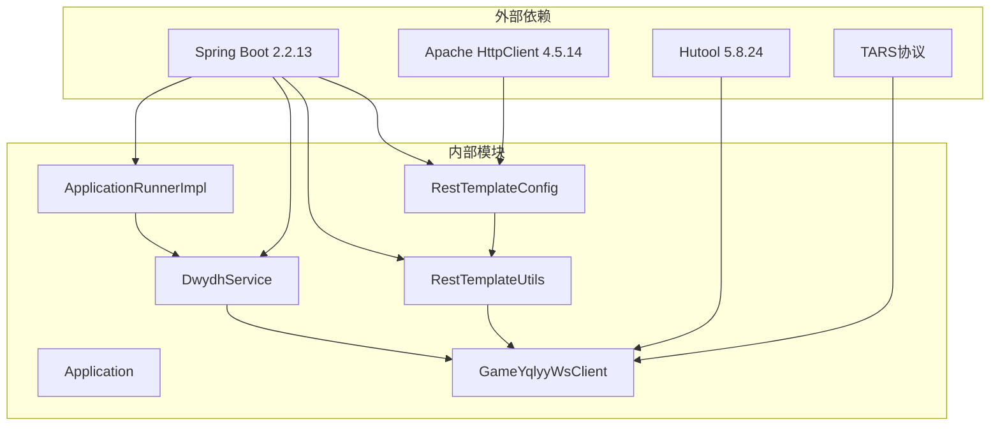

# 设计模式应用

<cite>
**本文档引用的文件**
- [Application.java](file://src/main/java/com/Application.java)
- [RestTemplateConfig.java](file://src/main/java/com/commom/RestTemplateConfig.java)
- [RestTemplateUtils.java](file://src/main/java/com/commom/RestTemplateUtils.java)
- [GameYqlyyWsClient.java](file://src/main/java/com/yqlyy/GameYqlyyWsClient.java)
- [DwydhService.java](file://src/main/java/com/dwydh/DwydhService.java)
- [ApplicationRunnerImpl.java](file://src/main/java/com/listener/ApplicationRunnerImpl.java)
- [DomainNameUtil.java](file://src/main/java/com/utils/DomainNameUtil.java)
- [application.yml](file://src/main/resources/application.yml)
- [pom.xml](file://pom.xml)
</cite>

## 目录
1. [引言](#引言)
2. [项目结构](#项目结构)
3. [核心组件](#核心组件)
4. [架构概览](#架构概览)
5. [详细组件分析](#详细组件分析)
6. [依赖关系分析](#依赖关系分析)
7. [性能考虑](#性能考虑)
8. [故障排除指南](#故障排除指南)
9. [结论](#结论)

## 引言

本文件深入分析虎牙游戏数据采集系统中采用的各种设计模式及其应用场景。该系统通过WebSocket实时接收虎牙游戏数据，解析游戏状态变化，并将相关信息同步到中转服务器。系统主要采用了以下设计模式：

- **观察者模式**：在WebSocket消息处理中的应用
- **工厂模式**：在RestTemplate配置中的使用  
- **单例模式**：在连接管理中的实现

这些设计模式有效解决了系统的可扩展性、可维护性和性能优化等关键问题。

## 项目结构

虎牙游戏数据采集系统采用标准的Spring Boot项目结构，主要分为以下几个模块：

**图表来源**
- [Application.java](file://src/main/java/com/Application.java#L1-L14)
- [RestTemplateConfig.java](file://src/main/java/com/commom/RestTemplateConfig.java#L1-L132)
- [DwydhService.java](file://src/main/java/com/dwydh/DwydhService.java#L1-L39)

**章节来源**
- [Application.java](file://src/main/java/com/Application.java#L1-L14)
- [pom.xml](file://pom.xml#L1-L160)

## 核心组件

系统的核心组件包括：

### WebSocket客户端组件
- **GameYqlyyWsClient**：负责与虎牙WebSocket服务器建立连接，处理消息接收和解析
- **DwydhService**：业务服务层，管理WebSocket客户端的生命周期和任务调度

### 配置管理组件
- **RestTemplateConfig**：Spring配置类，提供RestTemplate的工厂方法
- **RestTemplateUtils**：REST客户端工具类，封装HTTP请求操作

### 应用启动组件
- **ApplicationRunnerImpl**：应用启动监听器，在应用启动时初始化业务逻辑

**章节来源**
- [GameYqlyyWsClient.java](file://src/main/java/com/yqlyy/GameYqlyyWsClient.java#L1-L328)
- [DwydhService.java](file://src/main/java/com/dwydh/DwydhService.java#L1-L39)
- [RestTemplateConfig.java](file://src/main/java/com/commom/RestTemplateConfig.java#L1-L132)
- [RestTemplateUtils.java](file://src/main/java/com/commom/RestTemplateUtils.java#L1-L31)

## 架构概览

系统采用分层架构设计，各层职责明确：

**图表来源**
- [DwydhService.java](file://src/main/java/com/dwydh/DwydhService.java#L14-L38)
- [RestTemplateUtils.java](file://src/main/java/com/commom/RestTemplateUtils.java#L14-L31)
- [RestTemplateConfig.java](file://src/main/java/com/commom/RestTemplateConfig.java#L33-L132)

## 详细组件分析

### 观察者模式在WebSocket消息处理中的应用

#### 模式实现分析

系统通过Java WebSocket API实现了观察者模式的核心机制：

**图表来源**
- [GameYqlyyWsClient.java](file://src/main/java/com/yqlyy/GameYqlyyWsClient.java#L29-L328)

#### 具体应用场景

1. **消息接收观察**：`@OnMessage`注解方法作为观察者，自动接收WebSocket消息
2. **状态变化通知**：连接状态变化触发相应的回调处理
3. **异步事件处理**：消息到达时自动触发业务逻辑处理

#### 解决的问题和带来的好处

- **解耦合**：消息处理逻辑与WebSocket连接管理分离
- **可扩展性**：新增消息类型只需添加新的处理逻辑
- **异步处理**：支持非阻塞的消息处理模式

**章节来源**
- [GameYqlyyWsClient.java](file://src/main/java/com/yqlyy/GameYqlyyWsClient.java#L46-L219)

### 工厂模式在RestTemplate配置中的使用

#### 模式实现分析

RestTemplateConfig类实现了典型的工厂模式：

**图表来源**
- [RestTemplateConfig.java](file://src/main/java/com/commom/RestTemplateConfig.java#L33-L132)

#### 具体应用场景

1. **RestTemplate实例创建**：统一管理RestTemplate的创建过程
2. **连接池配置**：集中管理HTTP连接池参数
3. **超时配置**：统一设置网络请求超时参数

#### 解决的问题和带来的好处

- **配置集中化**：所有HTTP客户端配置集中在单一位置
- **性能优化**：通过连接池提高HTTP请求性能
- **参数一致性**：确保所有HTTP请求使用相同的配置

**章节来源**
- [RestTemplateConfig.java](file://src/main/java/com/commom/RestTemplateConfig.java#L62-L131)

### 单例模式在连接管理中的实现

#### 模式实现分析

系统通过Spring容器实现了单例模式：

**图表来源**
- [RestTemplateConfig.java](file://src/main/java/com/commom/RestTemplateConfig.java#L62-L131)

#### 具体应用场景

1. **RestTemplate单例**：在整个应用中只创建一个RestTemplate实例
2. **连接池复用**：多个HTTP请求共享同一个连接池
3. **资源优化**：避免重复创建昂贵的HTTP客户端对象

#### 解决的问题和带来的好处

- **资源节约**：减少内存占用和CPU开销
- **性能提升**：连接池复用提高请求响应速度
- **线程安全**：Spring容器保证单例的线程安全性

**章节来源**
- [RestTemplateConfig.java](file://src/main/java/com/commom/RestTemplateConfig.java#L33-L132)

### 组件交互流程

系统的主要工作流程如下：

**图表来源**
- [ApplicationRunnerImpl.java](file://src/main/java/com/listener/ApplicationRunnerImpl.java#L21-L33)
- [DwydhService.java](file://src/main/java/com/dwydh/DwydhService.java#L21-L36)
- [GameYqlyyWsClient.java](file://src/main/java/com/yqlyy/GameYqlyyWsClient.java#L250-L290)

**章节来源**
- [ApplicationRunnerImpl.java](file://src/main/java/com/listener/ApplicationRunnerImpl.java#L1-L34)
- [DwydhService.java](file://src/main/java/com/dwydh/DwydhService.java#L1-L39)

## 依赖关系分析

系统的关键依赖关系如下：

**图表来源**
- [pom.xml](file://pom.xml#L26-L111)
- [RestTemplateConfig.java](file://src/main/java/com/commom/RestTemplateConfig.java#L1-L132)

**章节来源**
- [pom.xml](file://pom.xml#L1-L160)

## 性能考虑

### 连接池优化

系统通过连接池配置实现了性能优化：

- **最大连接数**：100个并发连接
- **路由限制**：每个路由最多20个连接
- **超时配置**：连接超时10秒，读取超时30秒
- **连接复用**：启用Keep-Alive策略

### 异步处理

- **线程池管理**：使用Spring的ThreadPoolTaskExecutor
- **非阻塞IO**：WebSocket支持异步消息处理
- **批量处理**：消息解析后批量发送HTTP请求

## 故障排除指南

### 常见问题及解决方案

1. **WebSocket连接失败**
   - 检查网络连接和防火墙设置
   - 验证WebSocket URL的有效性
   - 查看连接超时配置

2. **HTTP请求异常**
   - 检查RestTemplate配置参数
   - 验证目标服务器可达性
   - 查看连接池状态

3. **消息解析错误**
   - 确认TARS协议版本兼容性
   - 检查消息格式和编码
   - 验证数据完整性

**章节来源**
- [GameYqlyyWsClient.java](file://src/main/java/com/yqlyy/GameYqlyyWsClient.java#L240-L248)
- [RestTemplateConfig.java](file://src/main/java/com/commom/RestTemplateConfig.java#L84-L108)

## 结论

虎牙游戏数据采集系统通过合理运用设计模式，成功构建了一个高性能、可扩展的数据采集平台。观察者模式确保了消息处理的灵活性，工厂模式实现了配置管理的集中化，单例模式优化了资源使用效率。

### 主要成果

1. **架构清晰**：各层职责明确，便于维护和扩展
2. **性能优异**：通过连接池和异步处理提升系统吞吐量
3. **可靠性强**：完善的异常处理和重连机制
4. **可维护性好**：设计模式的应用提高了代码质量

### 最佳实践建议

1. **配置管理**：继续使用工厂模式管理复杂的客户端配置
2. **监控告警**：添加系统性能监控和异常告警机制
3. **测试覆盖**：增加单元测试和集成测试覆盖率
4. **文档完善**：补充详细的API文档和部署指南