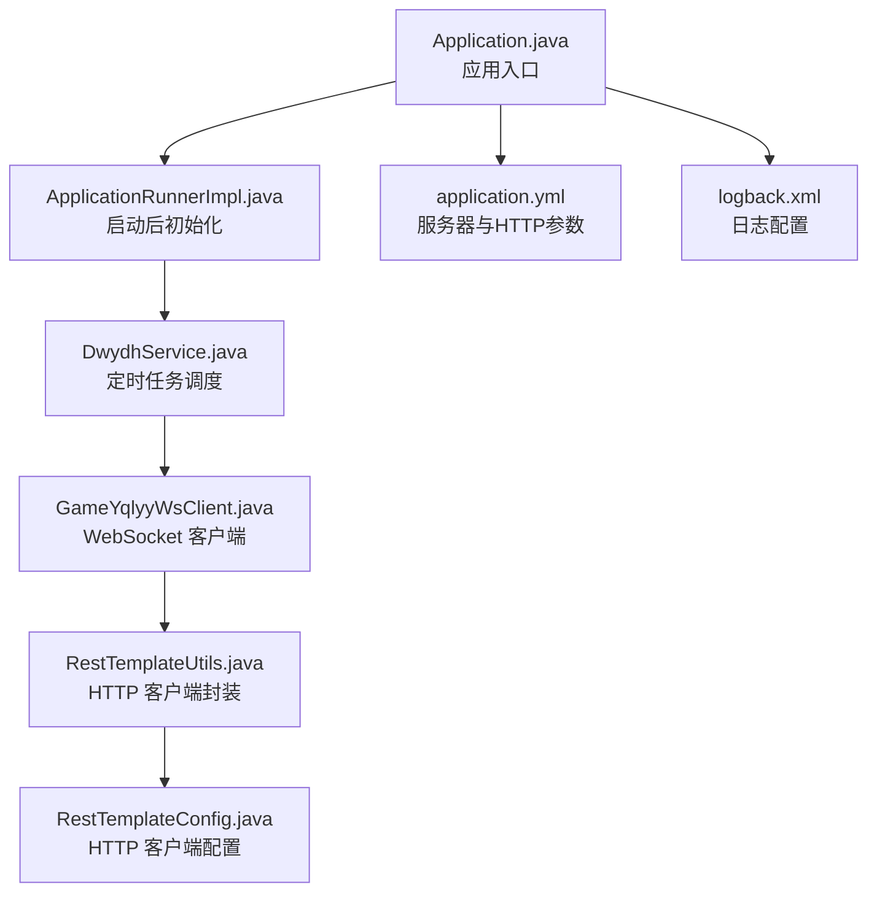
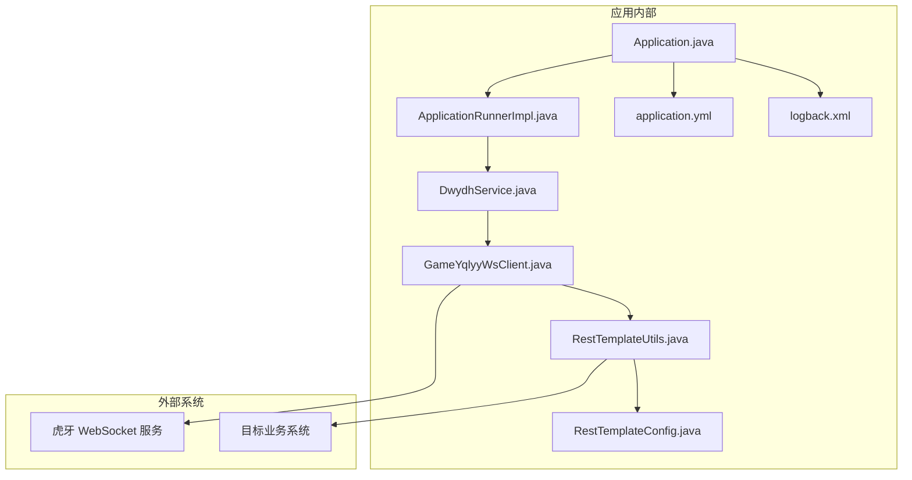
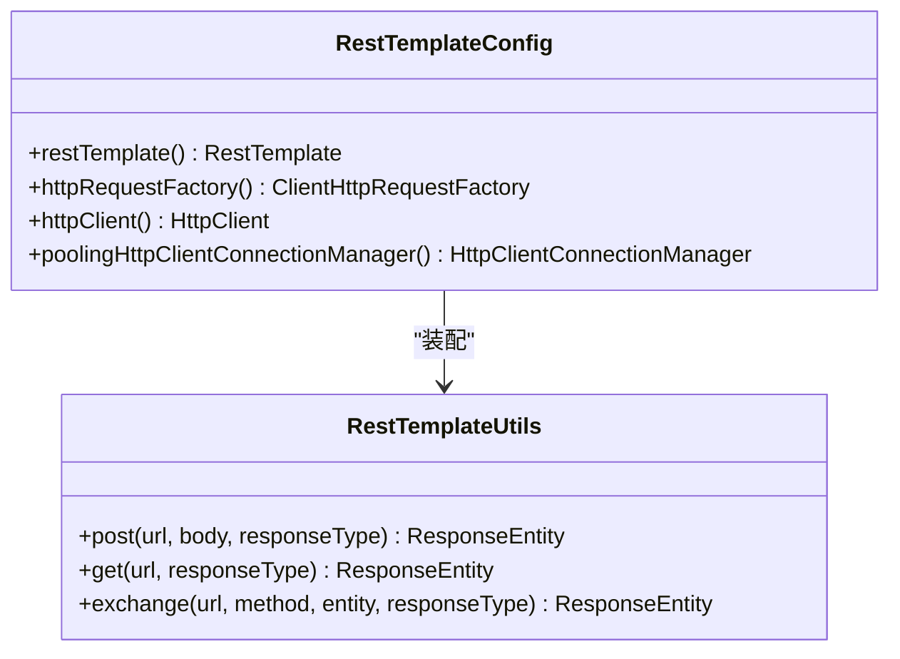
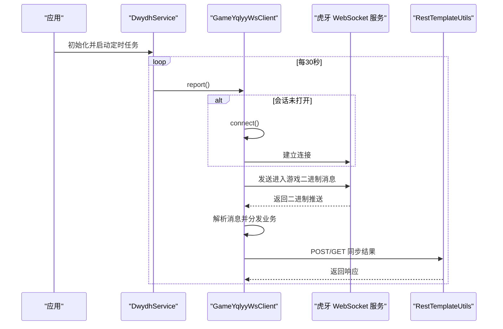
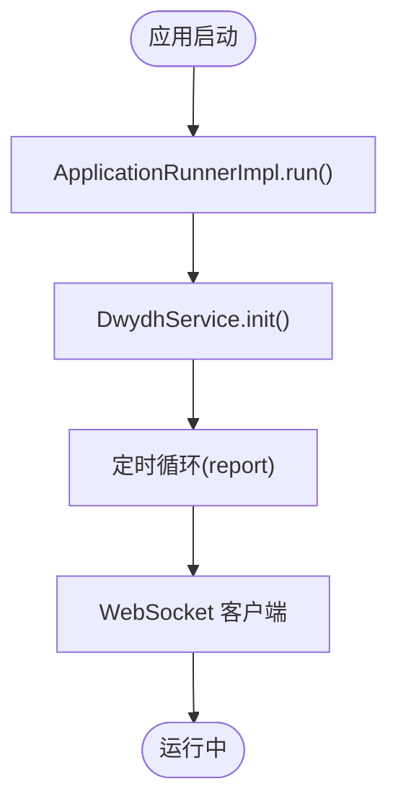
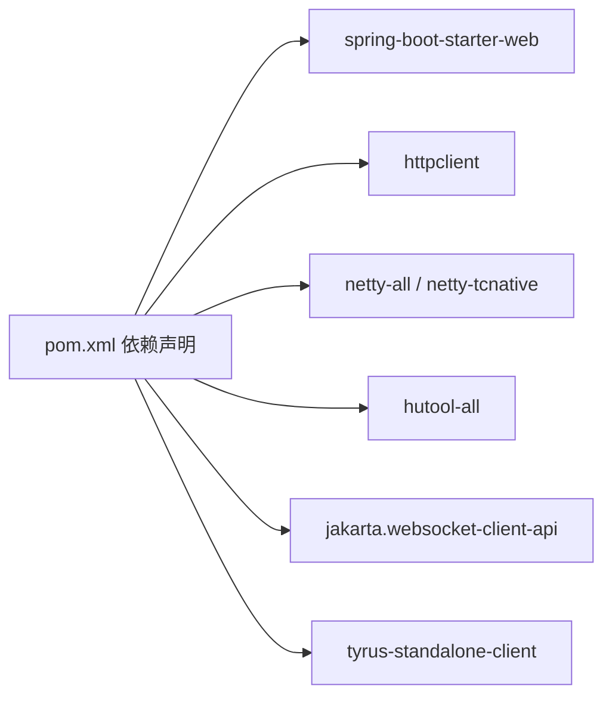

# 安全合规

<cite>
**本文引用的文件列表**
- [application.yml](file://src/main/resources/application.yml)
- [logback.xml](file://src/main/resources/logback.xml)
- [pom.xml](file://pom.xml)
- [Application.java](file://src/main/java/com/Application.java)
- [RestTemplateConfig.java](file://src/main/java/com/commom/RestTemplateConfig.java)
- [RestTemplateUtils.java](file://src/main/java/com/commom/RestTemplateUtils.java)
- [DwydhService.java](file://src/main/java/com/dwydh/DwydhService.java)
- [GameYqlyyWsClient.java](file://src/main/java/com/yqlyy/GameYqlyyWsClient.java)
- [ApplicationRunnerImpl.java](file://src/main/java/com/listener/ApplicationRunnerImpl.java)
- [DomainNameUtil.java](file://src/main/java/com/utils/DomainNameUtil.java)
- [WsCmd.java](file://src/main/java/com/entity/WsCmd.java)
- [Wup.java](file://src/main/java/com/entity/Wup.java)
</cite>

## 目录
1. [引言](#引言)
2. [项目结构](#项目结构)
3. [核心组件](#核心组件)
4. [架构总览](#架构总览)
5. [详细组件分析](#详细组件分析)
6. [依赖关系分析](#依赖关系分析)
7. [性能与安全特性](#性能与安全特性)
8. [安全加固与合规实施方案](#安全加固与合规实施方案)
9. [故障排查指南](#故障排查指南)
10. [结论](#结论)
11. [附录](#附录)

## 引言
本方案围绕当前代码库的安全加固与合规性建设，结合现有网络通信、日志记录与基础依赖，提出一套可落地的实施方案。重点覆盖：
- 网络安全配置：SSL/TLS 证书管理、网络安全策略、访问控制机制
- 应用安全加固：敏感信息加密、输入验证、SQL 注入防护
- 数据安全保护：数据传输加密、数据存储安全
- 身份认证与授权：配置建议与最佳实践
- 安全审计与日志：日志记录要求与审计策略
- 合规性标准：满足 GDPR、网络安全法等法规的要点
- 漏洞扫描与修复流程：持续改进机制
- 安全事件响应与应急预案：快速处置与恢复

## 项目结构
该项目为基于 Spring Boot 的 Java 应用，使用 WebSocket 接收外部推送数据，并通过 HTTP 客户端上报结果。核心结构如下：
- 配置层：application.yml、logback.xml
- 启动入口：Application.java
- 网络客户端：RestTemplateConfig、RestTemplateUtils
- 业务服务：DwydhService
- WebSocket 客户端：GameYqlyyWsClient
- 应用生命周期钩子：ApplicationRunnerImpl
- 工具与实体：DomainNameUtil、WsCmd、Wup 等

图表来源
- [Application.java](file://src/main/java/com/Application.java#L1-L14)
- [ApplicationRunnerImpl.java](file://src/main/java/com/listener/ApplicationRunnerImpl.java#L1-L33)
- [DwydhService.java](file://src/main/java/com/dwydh/DwydhService.java#L1-L39)
- [GameYqlyyWsClient.java](file://src/main/java/com/yqlyy/GameYqlyyWsClient.java#L1-L328)
- [RestTemplateUtils.java](file://src/main/java/com/commom/RestTemplateUtils.java#L1-L31)
- [RestTemplateConfig.java](file://src/main/java/com/commom/RestTemplateConfig.java#L1-L132)
- [application.yml](file://src/main/resources/application.yml#L1-L31)
- [logback.xml](file://src/main/resources/logback.xml#L1-L75)

章节来源
- [Application.java](file://src/main/java/com/Application.java#L1-L14)
- [application.yml](file://src/main/resources/application.yml#L1-L31)
- [logback.xml](file://src/main/resources/logback.xml#L1-L75)

## 核心组件
- 应用入口与启动：Application.java 负责启动 Spring Boot 应用；ApplicationRunnerImpl 在应用启动后执行初始化逻辑。
- HTTP 客户端：RestTemplateConfig 提供连接池、超时、重试、Keep-Alive 等配置；RestTemplateUtils 封装 GET/POST/exchange 方法。
- WebSocket 客户端：GameYqlyyWsClient 处理二进制消息解析、业务路由、错误处理与重连。
- 业务服务：DwydhService 以线程池方式周期性触发 WebSocket 客户端上报。
- 配置与日志：application.yml 提供服务器端口、上下文路径、HTTP 参数；logback.xml 提供滚动日志与级别过滤。

章节来源
- [Application.java](file://src/main/java/com/Application.java#L1-L14)
- [ApplicationRunnerImpl.java](file://src/main/java/com/listener/ApplicationRunnerImpl.java#L1-L33)
- [RestTemplateConfig.java](file://src/main/java/com/commom/RestTemplateConfig.java#L1-L132)
- [RestTemplateUtils.java](file://src/main/java/com/commom/RestTemplateUtils.java#L1-L31)
- [DwydhService.java](file://src/main/java/com/dwydh/DwydhService.java#L1-L39)
- [GameYqlyyWsClient.java](file://src/main/java/com/yqlyy/GameYqlyyWsClient.java#L1-L328)
- [application.yml](file://src/main/resources/application.yml#L1-L31)
- [logback.xml](file://src/main/resources/logback.xml#L1-L75)

## 架构总览
下图展示应用与外部系统的交互路径，以及内部组件之间的依赖关系。

图表来源
- [Application.java](file://src/main/java/com/Application.java#L1-L14)
- [ApplicationRunnerImpl.java](file://src/main/java/com/listener/ApplicationRunnerImpl.java#L1-L33)
- [DwydhService.java](file://src/main/java/com/dwydh/DwydhService.java#L1-L39)
- [GameYqlyyWsClient.java](file://src/main/java/com/yqlyy/GameYqlyyWsClient.java#L1-L328)
- [RestTemplateUtils.java](file://src/main/java/com/commom/RestTemplateUtils.java#L1-L31)
- [RestTemplateConfig.java](file://src/main/java/com/commom/RestTemplateConfig.java#L1-L132)
- [application.yml](file://src/main/resources/application.yml#L1-L31)
- [logback.xml](file://src/main/resources/logback.xml#L1-L75)

## 详细组件分析

### 组件一：HTTP 客户端与连接池配置（RestTemplateConfig/RestTemplateUtils）
- 连接池与超时：最大连接数、每路由并发、连接超时、请求超时、套接字超时、空闲校验与失效时间。
- 默认请求头：User-Agent、Accept-Encoding、Accept-Language、Connection、Content-Type。
- 重试策略：默认重试处理器开启，重试次数与幂等性策略需评估。
- Keep-Alive：默认 Keep-Alive 策略启用，有助于降低握手开销。
- HTTPS 支持：注册 https 协议工厂，支持 TLS 握手。

图表来源
- [RestTemplateConfig.java](file://src/main/java/com/commom/RestTemplateConfig.java#L1-L132)
- [RestTemplateUtils.java](file://src/main/java/com/commom/RestTemplateUtils.java#L1-L31)

章节来源
- [RestTemplateConfig.java](file://src/main/java/com/commom/RestTemplateConfig.java#L1-L132)
- [RestTemplateUtils.java](file://src/main/java/com/commom/RestTemplateUtils.java#L1-L31)

### 组件二：WebSocket 客户端（GameYqlyyWsClient）
- WebSocket 连接：支持自定义容器缓冲区大小、会话空闲超时、异步发送超时。
- 消息处理：二进制消息解析、按 iUri 分发不同业务场景（开奖、游戏开始时间同步等）。
- 加密辅助：提供 AES/CBC 加密工具方法，便于对敏感数据进行加密传输。
- 错误与重连：异常捕获、日志记录、自动重连逻辑。

图表来源
- [DwydhService.java](file://src/main/java/com/dwydh/DwydhService.java#L1-L39)
- [GameYqlyyWsClient.java](file://src/main/java/com/yqlyy/GameYqlyyWsClient.java#L1-L328)
- [RestTemplateUtils.java](file://src/main/java/com/commom/RestTemplateUtils.java#L1-L31)

章节来源
- [GameYqlyyWsClient.java](file://src/main/java/com/yqlyy/GameYqlyyWsClient.java#L1-L328)
- [DwydhService.java](file://src/main/java/com/dwydh/DwydhService.java#L1-L39)

### 组件三：应用启动与生命周期（Application/ApplicationRunnerImpl）
- Application.java：Spring Boot 启动入口。
- ApplicationRunnerImpl：应用启动后执行初始化，调用 DwydhService.init()。

图表来源
- [Application.java](file://src/main/java/com/Application.java#L1-L14)
- [ApplicationRunnerImpl.java](file://src/main/java/com/listener/ApplicationRunnerImpl.java#L1-L33)
- [DwydhService.java](file://src/main/java/com/dwydh/DwydhService.java#L1-L39)

章节来源
- [Application.java](file://src/main/java/com/Application.java#L1-L14)
- [ApplicationRunnerImpl.java](file://src/main/java/com/listener/ApplicationRunnerImpl.java#L1-L33)

### 组件四：日志与审计（logback.xml）
- 控制台输出与文件滚动：info/error 分别写入 info.log/error.log，按天滚动，保留 60 天。
- 级别过滤：仅记录指定级别日志，避免噪声。
- 建议增强：添加结构化字段（traceId、requestId）、脱敏敏感字段、统一日志格式。

章节来源
- [logback.xml](file://src/main/resources/logback.xml#L1-L75)

## 依赖关系分析
- Spring Boot Web：提供 Web MVC 与嵌入式服务器能力。
- Apache HttpClient：提供高性能 HTTP 客户端与连接池。
- Netty 与 tcnative：提升 TLS 性能与兼容性。
- Hutool：常用工具库，简化开发。
- WebSocket 客户端：Jakarta WebSocket API 与 Tyrus 客户端实现。

图表来源
- [pom.xml](file://pom.xml#L1-L160)

章节来源
- [pom.xml](file://pom.xml#L1-L160)

## 性能与安全特性
- HTTP 客户端性能：连接池、超时、Keep-Alive、重试策略，有助于提升吞吐与稳定性。
- WebSocket 性能：设置合理的缓冲区与超时，避免内存与连接泄漏。
- 日志性能：滚动与级别过滤减少 IO 压力。
- 安全现状：存在明文传输风险（HTTP URL、部分日志），需加强 TLS 与数据脱敏。

章节来源
- [RestTemplateConfig.java](file://src/main/java/com/commom/RestTemplateConfig.java#L1-L132)
- [GameYqlyyWsClient.java](file://src/main/java/com/yqlyy/GameYqlyyWsClient.java#L1-L328)
- [logback.xml](file://src/main/resources/logback.xml#L1-L75)

## 安全加固与合规实施方案

### 一、网络安全配置
- SSL/TLS 证书管理
  - 强制使用 HTTPS：将所有对外接口升级为 HTTPS，确保传输层加密。
  - 证书轮换：建立自动化证书签发、部署与轮换流程，监控到期时间。
  - 服务器配置：在 application.yml 中启用 HTTPS 端口与证书路径，禁用弱密码套件与协议版本。
- 网络安全策略
  - 端口与上下文：限制暴露端口，使用上下文路径隔离接口。
  - 防火墙与 WAF：在网络边界部署防火墙与 WAF，阻断恶意流量与攻击载荷。
  - 内外网隔离：将数据上报与业务系统置于内网，通过跳板机或代理访问。
- 访问控制机制
  - IP 白名单：仅允许特定源访问 WebSocket 与上报接口。
  - 速率限制：对上报接口实施限流，防止滥用与 DDoS。
  - 会话与令牌：引入短期令牌与签名机制，校验请求来源与完整性。

章节来源
- [application.yml](file://src/main/resources/application.yml#L1-L31)
- [GameYqlyyWsClient.java](file://src/main/java/com/yqlyy/GameYqlyyWsClient.java#L1-L328)

### 二、应用安全加固
- 敏感信息加密
  - 传输加密：WebSocket 使用 wss，HTTP 使用 https；对关键字段采用 AES/CBC 加密（参考现有工具方法）。
  - 存储加密：数据库字段加密、密钥管理（KMS）与密钥轮换。
- 输入验证与 SQL 注入防护
  - 输入校验：对所有外部输入进行白名单校验与长度限制。
  - ORM/参数化查询：使用 JPA/Hibernate 或 MyBatis 参数化查询，避免拼接 SQL。
  - 预编译语句：严格使用 PreparedStatement，禁止动态拼接 SQL。
- 依赖安全
  - 定期扫描依赖漏洞（OWASP Dependency-Check），及时升级至安全版本。
  - 供应链安全：启用依赖镜像与可信源，校验 checksum。

章节来源
- [GameYqlyyWsClient.java](file://src/main/java/com/yqlyy/GameYqlyyWsClient.java#L310-L324)
- [pom.xml](file://pom.xml#L1-L160)

### 三、数据安全保护
- 数据传输加密
  - 强制 TLS：所有跨域通信必须使用 TLS 1.2+，禁用 SSLv2/3。
  - 证书固定：在客户端启用证书固定（Pinning），降低中间人攻击风险。
- 数据存储安全
  - 加密存储：对敏感字段（如用户标识、设备指纹）进行加密存储。
  - 访问控制：最小权限原则，数据库账号仅授予必要权限。
  - 备份加密：备份数据加密与异地存储，定期验证恢复流程。

章节来源
- [application.yml](file://src/main/resources/application.yml#L1-L31)
- [GameYqlyyWsClient.java](file://src/main/java/com/yqlyy/GameYqlyyWsClient.java#L310-L324)

### 四、身份认证与授权
- 认证机制
  - OAuth2/JWT：对外部接口启用 JWT，设置短有效期与刷新令牌。
  - 双因子：对高危操作启用二次验证。
- 授权模型
  - RBAC：基于角色的权限控制，最小权限分配。
  - 资源级授权：对每个接口进行细粒度授权校验。
- 会话管理
  - 会话超时：设置合理超时时间，强制登出与令牌撤销。
  - 令牌刷新：支持无感知刷新，避免频繁登录。

章节来源
- [RestTemplateUtils.java](file://src/main/java/com/commom/RestTemplateUtils.java#L1-L31)
- [DwydhService.java](file://src/main/java/com/dwydh/DwydhService.java#L1-L39)

### 五、安全审计与日志记录
- 日志规范
  - 结构化日志：统一字段（timestamp、level、traceId、method、line、msg）。
  - 脱敏策略：对手机号、身份证、设备指纹等敏感字段脱敏。
  - 分级策略：INFO/ERROR 分离，避免敏感信息落入 INFO。
- 审计范围
  - 关键操作：登录、上报、数据变更、权限变更。
  - 审计留痕：记录操作人、时间、IP、设备、影响范围。
- 存储与保留
  - 滚动与保留：按月/年滚动，符合合规要求（如 GDPR 的数据最小化与删除权）。

章节来源
- [logback.xml](file://src/main/resources/logback.xml#L1-L75)

### 六、合规性标准满足
- GDPR
  - 数据主体权利：提供访问、更正、删除、可携带权；建立数据删除与影响评估流程。
  - 数据保护影响评估（DPIA）：对高风险处理活动进行评估与记录。
  - 数据最小化与目的限制：仅收集必要数据，明确用途并限制传播。
- 网络安全法
  - 关键信息基础设施保护：落实等级保护制度，开展安全评估与演练。
  - 数据本地化：重要数据不出境，跨境传输需满足安全评估与审批。
  - 应急预案：建立网络安全事件应急预案与处置机制。

章节来源
- [application.yml](file://src/main/resources/application.yml#L1-L31)
- [logback.xml](file://src/main/resources/logback.xml#L1-L75)

### 七、安全漏洞扫描与修复流程
- 扫描策略
  - 代码静态扫描：SonarQube/SpotBugs/Spotless 检查安全规则。
  - 依赖漏洞扫描：OWASP Dependency-Check、Snyk。
  - 渗透测试：定期邀请第三方进行渗透测试。
- 修复流程
  - 优先级划分：P0（高危）、P1（严重）、P2（中危）、P3（低危）。
  - 修复闭环：问题登记、分配、修复、验证、关闭与复盘。
  - 回归测试：修复后进行回归测试与安全回归。

章节来源
- [pom.xml](file://pom.xml#L1-L160)

### 八、安全事件响应与应急预案
- 事件分级
  - 一般事件：轻微安全问题，快速处置与记录。
  - 重大事件：大规模泄露、DDoS、凭证泄露，启动应急响应。
- 应急组织
  - 指挥小组：技术负责人、安全部门、法务与公关。
  - 人员职责：事件发现、研判、处置、恢复、复盘。
- 处置步骤
  - 识别与评估：确认事件类型、影响范围与严重程度。
  - 隔离与遏制：暂停相关服务、封禁可疑账户与IP。
  - 修复与恢复：修复漏洞、恢复数据、验证系统健康。
  - 通报与复盘：按法规要求通报监管与受影响方，总结经验。

章节来源
- [GameYqlyyWsClient.java](file://src/main/java/com/yqlyy/GameYqlyyWsClient.java#L1-L328)
- [RestTemplateConfig.java](file://src/main/java/com/commom/RestTemplateConfig.java#L1-L132)

## 故障排查指南
- WebSocket 连接失败
  - 检查 wss 地址与证书有效性；确认网络可达与代理配置。
  - 查看日志中的异常堆栈与重连尝试记录。
- HTTP 请求异常
  - 检查超时参数、连接池状态与重试策略；核对目标地址与鉴权。
- 日志缺失或过多
  - 检查 logback 配置与文件权限；确认滚动策略与保留天数。
- 性能问题
  - 观察连接池使用率、超时与重试次数；优化线程池与缓冲区大小。

章节来源
- [GameYqlyyWsClient.java](file://src/main/java/com/yqlyy/GameYqlyyWsClient.java#L250-L272)
- [RestTemplateConfig.java](file://src/main/java/com/commom/RestTemplateConfig.java#L84-L108)
- [logback.xml](file://src/main/resources/logback.xml#L1-L75)

## 结论
本方案基于现有代码结构，从网络安全、应用加固、数据保护、身份授权、审计日志、合规标准、漏洞扫描与事件响应等方面提出了系统化的安全加固与合规实施方案。建议优先落地 HTTPS 强制、TLS 证书管理、输入验证与参数化查询、日志脱敏与结构化、依赖漏洞扫描与修复流程，逐步完善身份认证与授权体系，最终达到满足 GDPR 与网络安全法的合规目标。

## 附录
- 术语表
  - TLS：传输层安全协议
  - JWT：JSON Web Token
  - DPIA：数据保护影响评估
  - RBAC：基于角色的访问控制
- 参考配置位置
  - 服务器与 HTTP 参数：[application.yml](file://src/main/resources/application.yml#L1-L31)
  - 日志配置：[logback.xml](file://src/main/resources/logback.xml#L1-L75)
  - 依赖声明：[pom.xml](file://pom.xml#L1-L160)