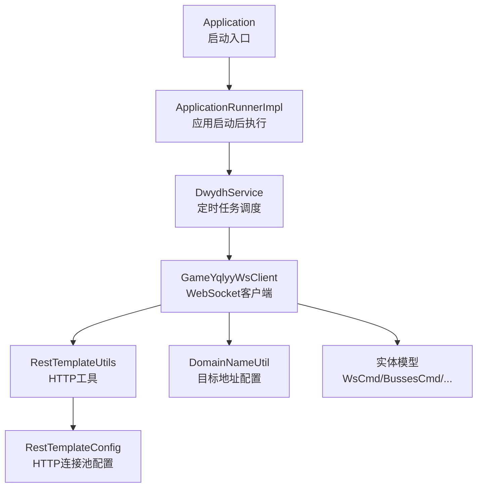
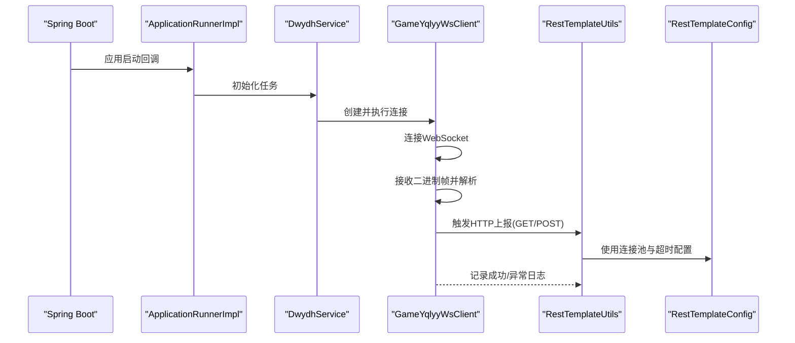
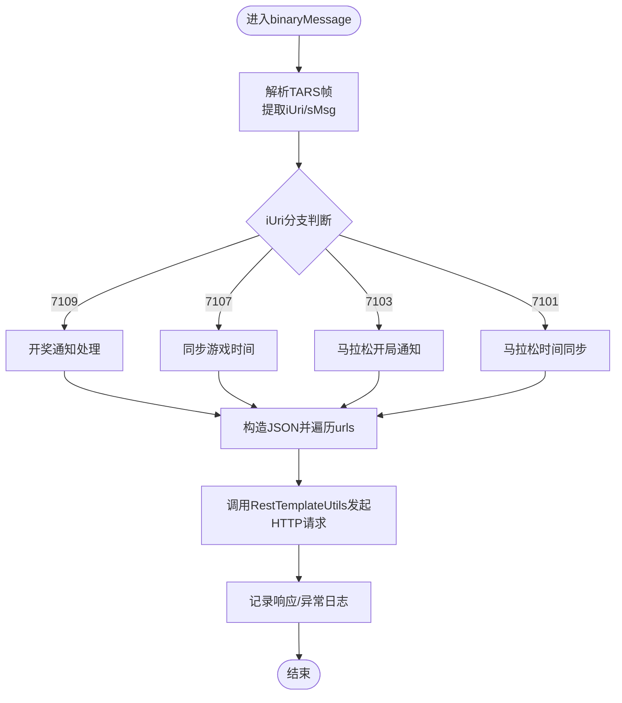
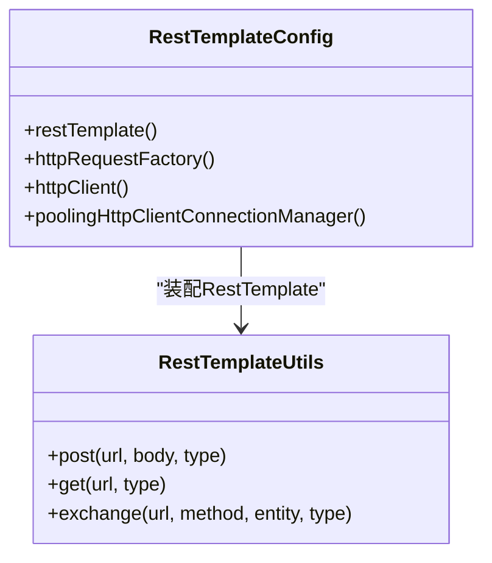
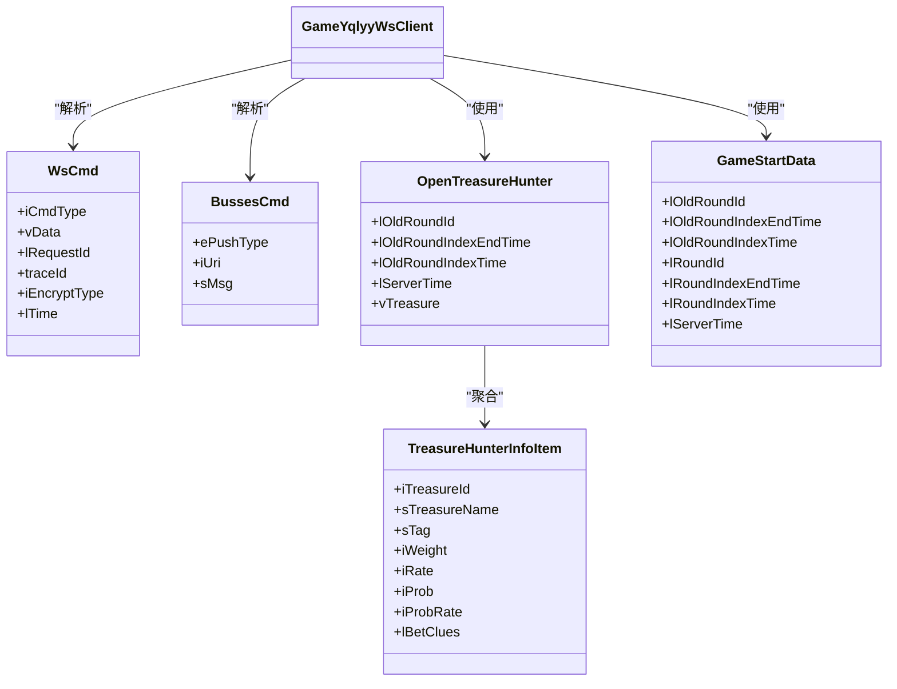
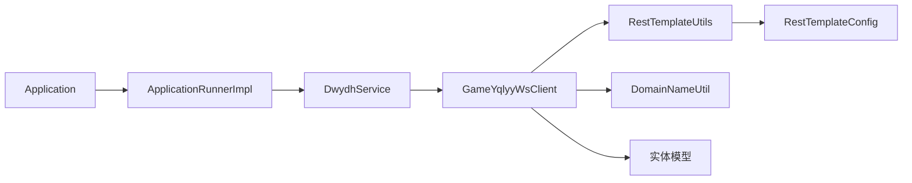

# 故障排查

<cite>
**本文引用的文件**
- [Application.java](file://src/main/java/com/Application.java)
- [ApplicationRunnerImpl.java](file://src/main/java/com/listener/ApplicationRunnerImpl.java)
- [DwydhService.java](file://src/main/java/com/dwydh/DwydhService.java)
- [GameYqlyyWsClient.java](file://src/main/java/com/yqlyy/GameYqlyyWsClient.java)
- [RestTemplateConfig.java](file://src/main/java/com/commom/RestTemplateConfig.java)
- [RestTemplateUtils.java](file://src/main/java/com/commom/RestTemplateUtils.java)
- [DomainNameUtil.java](file://src/main/java/com/utils/DomainNameUtil.java)
- [application.yml](file://src/main/resources/application.yml)
- [logback.xml](file://src/main/resources/logback.xml)
- [WsCmd.java](file://src/main/java/com/entity/WsCmd.java)
- [BussesCmd.java](file://src/main/java/com/entity/BussesCmd.java)
- [OpenTreasureHunter.java](file://src/main/java/com/entity/AccountedNotify/OpenTreasureHunter.java)
- [TreasureHunterInfoItem.java](file://src/main/java/com/entity/AccountedNotify/TreasureHunterInfoItem.java)
- [GameStartData.java](file://src/main/java/com/entity/GameStartData.java)
- [pom.xml](file://pom.xml)
</cite>

## 目录
1. [简介](#简介)
2. [项目结构](#项目结构)
3. [核心组件](#核心组件)
4. [架构总览](#架构总览)
5. [详细组件分析](#详细组件分析)
6. [依赖关系分析](#依赖关系分析)
7. [性能与资源排查](#性能与资源排查)
8. [网络与连接排查](#网络与连接排查)
9. [日志分析与排错](#日志分析与排错)
10. [数据库与配置排查](#数据库与配置排查)
11. [故障预防与最佳实践](#故障预防与最佳实践)
12. [结论](#结论)

## 简介
本指南面向系统运维与开发人员，围绕该代码库中的WebSocket爬虫与HTTP上报流程，提供系统化的故障排查方法。重点覆盖以下方面：
- WebSocket连接失败、HTTP请求异常、数据解析错误的诊断与修复
- 日志级别与错误堆栈的解读技巧
- 网络连通性排查（DNS、端口、防火墙）
- 性能问题定位（线程池、连接池、超时参数）
- 数据库与配置问题处理
- 系统资源监控与瓶颈识别
- 预防性维护与最佳实践

## 项目结构
该项目为Spring Boot应用，采用分层组织：
- 启动入口与生命周期钩子：Application、ApplicationRunnerImpl
- 业务服务：DwydhService
- WebSocket客户端：GameYqlyyWsClient
- HTTP客户端封装：RestTemplateConfig、RestTemplateUtils
- 工具与实体：DomainNameUtil；数据模型（WsCmd、BussesCmd、OpenTreasureHunter、TreasureHunterInfoItem、GameStartData）
- 配置：application.yml、logback.xml
- 构建：pom.xml

图表来源
- [Application.java](file://src/main/java/com/Application.java#L1-L14)
- [ApplicationRunnerImpl.java](file://src/main/java/com/listener/ApplicationRunnerImpl.java#L1-L34)
- [DwydhService.java](file://src/main/java/com/dwydh/DwydhService.java#L1-L39)
- [GameYqlyyWsClient.java](file://src/main/java/com/yqlyy/GameYqlyyWsClient.java#L1-L328)
- [RestTemplateConfig.java](file://src/main/java/com/commom/RestTemplateConfig.java#L1-L132)
- [RestTemplateUtils.java](file://src/main/java/com/commom/RestTemplateUtils.java#L1-L31)
- [DomainNameUtil.java](file://src/main/java/com/utils/DomainNameUtil.java#L1-L16)

章节来源
- [Application.java](file://src/main/java/com/Application.java#L1-L14)
- [ApplicationRunnerImpl.java](file://src/main/java/com/listener/ApplicationRunnerImpl.java#L1-L34)
- [DwydhService.java](file://src/main/java/com/dwydh/DwydhService.java#L1-L39)
- [GameYqlyyWsClient.java](file://src/main/java/com/yqlyy/GameYqlyyWsClient.java#L1-L328)
- [RestTemplateConfig.java](file://src/main/java/com/commom/RestTemplateConfig.java#L1-L132)
- [RestTemplateUtils.java](file://src/main/java/com/commom/RestTemplateUtils.java#L1-L31)
- [DomainNameUtil.java](file://src/main/java/com/utils/DomainNameUtil.java#L1-L16)

## 核心组件
- 启动与生命周期
  - Application：Spring Boot启动入口
  - ApplicationRunnerImpl：应用启动后执行初始化逻辑
- 业务服务
  - DwydhService：使用线程池调度GameYqlyyWsClient的周期性任务
- WebSocket客户端
  - GameYqlyyWsClient：负责连接远端WebSocket、接收二进制帧、解析TARS协议、触发HTTP上报
- HTTP客户端
  - RestTemplateConfig：基于Apache HttpClient的连接池、超时、重试策略配置
  - RestTemplateUtils：对RestTemplate的轻量封装，提供GET/POST/exchange
- 配置与日志
  - application.yml：Tomcat端口、上下文路径、HTTP连接池与超时参数
  - logback.xml：控制台与滚动文件输出、模块日志级别、根日志级别

章节来源
- [Application.java](file://src/main/java/com/Application.java#L1-L14)
- [ApplicationRunnerImpl.java](file://src/main/java/com/listener/ApplicationRunnerImpl.java#L1-L34)
- [DwydhService.java](file://src/main/java/com/dwydh/DwydhService.java#L1-L39)
- [GameYqlyyWsClient.java](file://src/main/java/com/yqlyy/GameYqlyyWsClient.java#L1-L328)
- [RestTemplateConfig.java](file://src/main/java/com/commom/RestTemplateConfig.java#L1-L132)
- [RestTemplateUtils.java](file://src/main/java/com/commom/RestTemplateUtils.java#L1-L31)
- [application.yml](file://src/main/resources/application.yml#L1-L31)
- [logback.xml](file://src/main/resources/logback.xml#L1-L75)

## 架构总览
下图展示从启动到WebSocket消息处理与HTTP上报的整体流程。

图表来源
- [ApplicationRunnerImpl.java](file://src/main/java/com/listener/ApplicationRunnerImpl.java#L25-L31)
- [DwydhService.java](file://src/main/java/com/dwydh/DwydhService.java#L21-L36)
- [GameYqlyyWsClient.java](file://src/main/java/com/yqlyy/GameYqlyyWsClient.java#L250-L290)
- [RestTemplateUtils.java](file://src/main/java/com/commom/RestTemplateUtils.java#L19-L29)
- [RestTemplateConfig.java](file://src/main/java/com/commom/RestTemplateConfig.java#L84-L108)

## 详细组件分析

### WebSocket客户端（GameYqlyyWsClient）
- 连接与心跳
  - 默认最大文本/二进制消息缓冲区、会话空闲超时、异步发送超时均在连接前设置
  - 连接失败时记录错误日志，并在报告阶段尝试重建连接
- 消息处理
  - OnOpen：发送鉴权/握手二进制帧
  - OnMessage：解析二进制帧为TARS结构，根据iUri区分不同业务场景（开奖、游戏开始等）
  - OnClose/OnError：记录关闭与异常
- 上报逻辑
  - 根据iUri选择目标URL集合（本地中转或上游），通过RestTemplateUtils发起HTTP请求
  - 对RestClientException与通用异常分别记录警告与错误日志

图表来源
- [GameYqlyyWsClient.java](file://src/main/java/com/yqlyy/GameYqlyyWsClient.java#L51-L219)
- [DomainNameUtil.java](file://src/main/java/com/utils/DomainNameUtil.java#L4-L13)
- [RestTemplateUtils.java](file://src/main/java/com/commom/RestTemplateUtils.java#L19-L29)

章节来源
- [GameYqlyyWsClient.java](file://src/main/java/com/yqlyy/GameYqlyyWsClient.java#L221-L290)
- [DomainNameUtil.java](file://src/main/java/com/utils/DomainNameUtil.java#L1-L16)
- [RestTemplateUtils.java](file://src/main/java/com/commom/RestTemplateUtils.java#L1-L31)

### HTTP客户端（RestTemplateConfig/RestTemplateUtils）
- 连接池与超时
  - 最大连接数、每路由并发、连接超时、连接池获取超时、Socket超时、过期校验、陈旧连接检查
- 头部与重试
  - 统一默认头部（Content-Type、Accept-Encoding等）
  - Keep-Alive策略与重试处理器（次数与幂等性）
- 使用方式
  - RestTemplateUtils提供简洁的GET/POST/exchange接口，便于在WebSocket处理流程中直接调用

图表来源
- [RestTemplateConfig.java](file://src/main/java/com/commom/RestTemplateConfig.java#L62-L129)
- [RestTemplateUtils.java](file://src/main/java/com/commom/RestTemplateUtils.java#L14-L30)

章节来源
- [RestTemplateConfig.java](file://src/main/java/com/commom/RestTemplateConfig.java#L1-L132)
- [RestTemplateUtils.java](file://src/main/java/com/commom/RestTemplateUtils.java#L1-L31)

### 实体与数据模型
- WsCmd：WebSocket命令头，包含指令类型、请求ID、时间戳等
- BussesCmd：业务推送命令，包含URI与消息体
- OpenTreasureHunter/TreasureHunterInfoItem：开奖/怪物信息结构，用于解析7109等场景
- GameStartData：游戏开始/轮次时间信息，用于7107/7101等场景

图表来源
- [WsCmd.java](file://src/main/java/com/entity/WsCmd.java#L1-L69)
- [BussesCmd.java](file://src/main/java/com/entity/BussesCmd.java#L1-L10)
- [OpenTreasureHunter.java](file://src/main/java/com/entity/AccountedNotify/OpenTreasureHunter.java#L1-L83)
- [TreasureHunterInfoItem.java](file://src/main/java/com/entity/AccountedNotify/TreasureHunterInfoItem.java#L1-L124)
- [GameStartData.java](file://src/main/java/com/entity/GameStartData.java#L1-L79)
- [GameYqlyyWsClient.java](file://src/main/java/com/yqlyy/GameYqlyyWsClient.java#L60-L148)

章节来源
- [WsCmd.java](file://src/main/java/com/entity/WsCmd.java#L1-L69)
- [BussesCmd.java](file://src/main/java/com/entity/BussesCmd.java#L1-L10)
- [OpenTreasureHunter.java](file://src/main/java/com/entity/AccountedNotify/OpenTreasureHunter.java#L1-L83)
- [TreasureHunterInfoItem.java](file://src/main/java/com/entity/AccountedNotify/TreasureHunterInfoItem.java#L1-L124)
- [GameStartData.java](file://src/main/java/com/entity/GameStartData.java#L1-L79)

## 依赖关系分析
- 组件耦合
  - ApplicationRunnerImpl依赖DwydhService
  - DwydhService依赖ThreadPoolTaskExecutor与RestTemplateUtils
  - GameYqlyyWsClient依赖RestTemplateUtils、DomainNameUtil与实体模型
  - RestTemplateConfig装配RestTemplate供RestTemplateUtils使用
- 外部依赖
  - Spring Web、WebSocket客户端实现、Apache HttpClient、Hutool、Netty等

图表来源
- [Application.java](file://src/main/java/com/Application.java#L1-L14)
- [ApplicationRunnerImpl.java](file://src/main/java/com/listener/ApplicationRunnerImpl.java#L21-L31)
- [DwydhService.java](file://src/main/java/com/dwydh/DwydhService.java#L14-L36)
- [GameYqlyyWsClient.java](file://src/main/java/com/yqlyy/GameYqlyyWsClient.java#L32-L44)
- [RestTemplateUtils.java](file://src/main/java/com/commom/RestTemplateUtils.java#L14-L29)
- [RestTemplateConfig.java](file://src/main/java/com/commom/RestTemplateConfig.java#L62-L108)
- [DomainNameUtil.java](file://src/main/java/com/utils/DomainNameUtil.java#L1-L16)

章节来源
- [pom.xml](file://pom.xml#L26-L111)

## 性能与资源排查
- 连接池与超时
  - 检查application.yml中的HTTP连接池参数与超时配置，确保与目标服务能力匹配
  - 若出现大量TIME_WAIT或连接耗尽，适当增大最大连接数与每路由并发，并调整空闲校验时间
- 线程池
  - DwydhService使用线程池执行WebSocket任务，若任务堆积或阻塞，需评估线程池大小与队列容量
- CPU与内存
  - 关注WebSocket消息解析与HTTP上报的热点路径，避免频繁字符串拼接与对象创建
  - 使用JVM监控工具观察GC频率与堆内存使用趋势
- 瓶颈识别
  - 通过日志采样定位慢请求（HTTP响应时间、WebSocket帧到达间隔）
  - 结合系统监控（CPU、内存、网络IO）与应用指标（线程数、连接池状态）综合判断

章节来源
- [application.yml](file://src/main/resources/application.yml#L16-L31)
- [RestTemplateConfig.java](file://src/main/java/com/commom/RestTemplateConfig.java#L116-L129)
- [DwydhService.java](file://src/main/java/com/dwydh/DwydhService.java#L16-L36)

## 网络与连接排查
- DNS解析
  - 使用nslookup/dig确认域名解析结果与TTL
  - 如使用内网域名，检查hosts或内部DNS配置
- 端口连通性
  - 使用telnet或nc验证WebSocket端口（wss）与HTTP端口可达
  - 检查目标服务端口监听状态与负载均衡健康检查
- 防火墙与代理
  - 确认出站策略允许wss与HTTP访问
  - 如经由代理，检查代理日志与转发规则
- WebSocket握手
  - 关注OnOpen是否触发、握手二进制帧是否被正确发送
  - 若握手失败，优先检查证书、域名与代理链路

章节来源
- [GameYqlyyWsClient.java](file://src/main/java/com/yqlyy/GameYqlyyWsClient.java#L221-L237)
- [application.yml](file://src/main/resources/application.yml#L1-L6)

## 日志分析与排错
- 日志级别与输出
  - 控制台输出与info/error滚动文件输出，模块日志级别按需调整
  - 根据业务场景提升模块日志级别以捕获更多细节
- 关键日志点
  - WebSocket：连接、握手、消息接收、关闭、异常
  - HTTP：请求URL、响应体、异常类型（RestClientException）
  - 解析：TARS字段读取、iUri分支、JSON构造
- 错误堆栈解读
  - RestClientException：多为网络/超时/目标不可达
  - IOException：底层网络异常或会话关闭
  - TARS解析异常：字段索引或类型不匹配
- 日志采集与留存
  - 建议开启异步日志与按天滚动，保留至少60天以便回溯

章节来源
- [logback.xml](file://src/main/resources/logback.xml#L1-L75)
- [GameYqlyyWsClient.java](file://src/main/java/com/yqlyy/GameYqlyyWsClient.java#L240-L248)
- [RestTemplateUtils.java](file://src/main/java/com/commom/RestTemplateUtils.java#L19-L29)

## 数据库与配置排查
- 当前代码未直接使用数据库，但涉及配置项较多，建议：
  - application.yml中的HTTP超时与连接池参数需与实际环境匹配
  - DomainNameUtil中的urls与transitUrls为空数组时，HTTP上报不会生效，需按部署环境填充
  - Spring Profile与环境变量需正确传递，避免加载错误配置
- 配置变更流程
  - 通过配置中心或CI/CD注入profiles.active
  - 修改后重启生效，避免热更新导致的状态不一致

章节来源
- [application.yml](file://src/main/resources/application.yml#L1-L31)
- [DomainNameUtil.java](file://src/main/java/com/utils/DomainNameUtil.java#L1-L16)

## 故障预防与最佳实践
- 连接与会话
  - 设置合理的WebSocket空闲超时与异步发送超时，避免资源泄露
  - 在OnClose/OnError中统一回收资源并记录上下文信息
- 超时与重试
  - HTTP侧启用幂等重试，避免重复上报
  - WebSocket侧在连接失败时进行指数退避与限速重连
- 监控与告警
  - 上报关键指标（连接成功率、HTTP响应时间、解析失败率）
  - 设置阈值告警与自动恢复策略
- 配置治理
  - 将敏感配置放入密钥管理，避免明文存储
  - 分环境分离配置，禁止在生产修改默认值
- 版本与依赖
  - 定期升级Spring Boot与第三方依赖，关注安全补丁
  - 对Netty、WebSocket客户端与HTTP组件保持兼容性

## 结论
本指南从架构、组件、日志、网络与性能五个维度提供了系统化的故障排查方法。针对WebSocket与HTTP两条主线，结合连接池、超时与解析逻辑，可快速定位问题根因并制定修复与预防策略。建议在生产环境中持续完善监控与告警体系，确保问题早发现、早处理、早恢复。