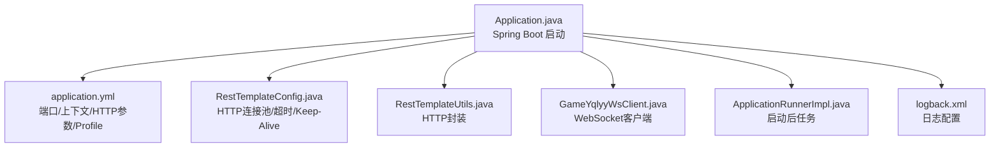
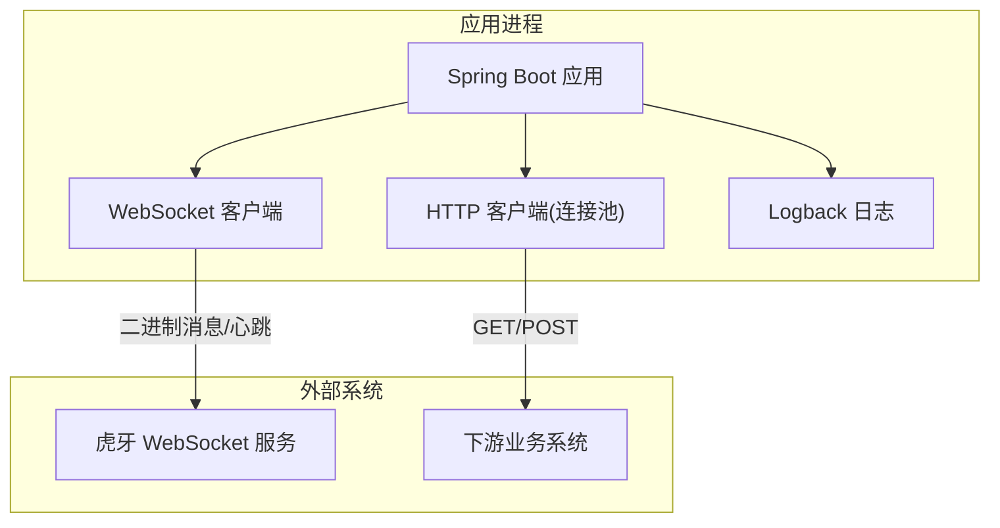
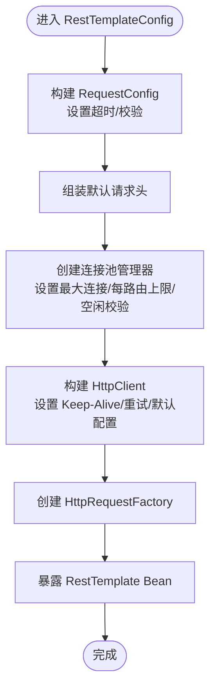
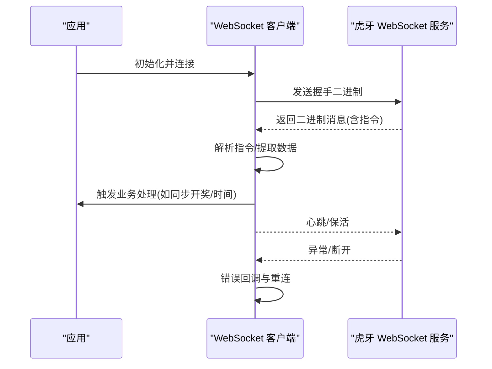
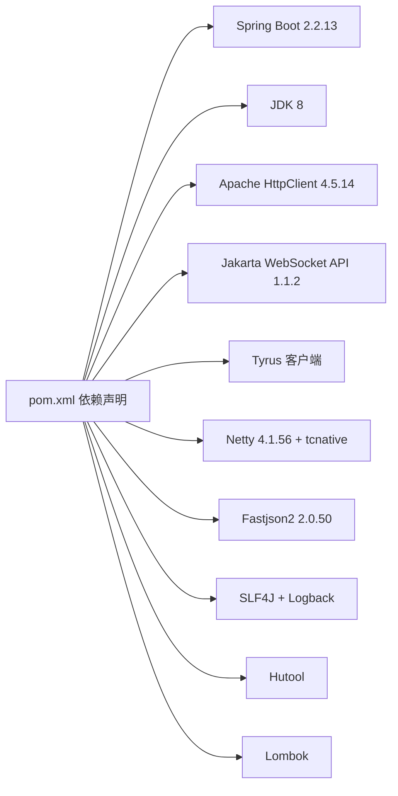

# 环境准备

<cite>
**本文引用的文件**
- [pom.xml](file://pom.xml)
- [Application.java](file://src/main/java/com/Application.java)
- [application.yml](file://src/main/resources/application.yml)
- [RestTemplateConfig.java](file://src/main/java/com/commom/RestTemplateConfig.java)
- [RestTemplateUtils.java](file://src/main/java/com/commom/RestTemplateUtils.java)
- [logback.xml](file://src/main/resources/logback.xml)
- [GameYqlyyWsClient.java](file://src/main/java/com/yqlyy/GameYqlyyWsClient.java)
- [ApplicationRunnerImpl.java](file://src/main/java/com/listener/ApplicationRunnerImpl.java)
- [DomainNameUtil.java](file://src/main/java/com/utils/DomainNameUtil.java)
</cite>

## 目录
1. [简介](#简介)
2. [项目结构](#项目结构)
3. [核心组件](#核心组件)
4. [架构总览](#架构总览)
5. [详细组件分析](#详细组件分析)
6. [依赖关系分析](#依赖关系分析)
7. [性能与资源建议](#性能与资源建议)
8. [故障排查指南](#故障排查指南)
9. [结论](#结论)
10. [附录：环境准备清单与验证](#附录环境准备清单与验证)

## 简介
本指南面向生产环境部署，围绕该 Java/Spring Boot 项目在 Linux/Windows Server 上的环境准备提供系统化说明，涵盖硬件资源、操作系统兼容性、JDK 8 运行时、网络与防火墙、代理配置、构建工具 Maven/Git、日志与网络连接池配置、以及环境验证清单与测试方法。项目使用 WebSocket 接收实时数据并通过 HTTP 同步至下游服务，同时具备日志滚动与线程池调度能力。

## 项目结构
该项目为标准 Spring Boot 应用，采用 Maven 构建，核心目录与职责如下：
- src/main/java/com：应用入口与业务组件
  - Application.java：Spring Boot 启动类
  - commom：通用配置与工具
  - yqlyy：WebSocket 客户端实现
  - listener：应用启动后执行的任务
  - utils：域名与中转地址等工具
- src/main/resources：配置与日志
  - application.yml：Tomcat 端口、上下文路径、HTTP 连接池参数、Spring Profile 激活占位符
  - logback.xml：控制台与文件滚动日志配置

图表来源
- [Application.java](file://src/main/java/com/Application.java#L1-L14)
- [application.yml](file://src/main/resources/application.yml#L1-L31)
- [RestTemplateConfig.java](file://src/main/java/com/commom/RestTemplateConfig.java#L1-L132)
- [RestTemplateUtils.java](file://src/main/java/com/commom/RestTemplateUtils.java#L1-L31)
- [GameYqlyyWsClient.java](file://src/main/java/com/yqlyy/GameYqlyyWsClient.java#L1-L328)
- [ApplicationRunnerImpl.java](file://src/main/java/com/listener/ApplicationRunnerImpl.java#L1-L34)
- [logback.xml](file://src/main/resources/logback.xml#L1-L75)

章节来源
- [Application.java](file://src/main/java/com/Application.java#L1-L14)
- [application.yml](file://src/main/resources/application.yml#L1-L31)
- [logback.xml](file://src/main/resources/logback.xml#L1-L75)

## 核心组件
- 启动类与容器
  - Application.java：Spring Boot 启动入口
- 配置与参数
  - application.yml：定义 Tomcat 端口、上下文路径、HTTP 连接池参数、Spring Profile 占位符
  - RestTemplateConfig.java：基于 Apache HttpClient 的连接池、超时策略、Keep-Alive、重试与默认请求头
  - RestTemplateUtils.java：对 RestTemplate 的 GET/POST/exchange 封装
- 日志
  - logback.xml：控制台输出与按日期滚动的 info/error 文件输出，并对特定包与框架日志级别进行过滤
- WebSocket 客户端
  - GameYqlyyWsClient.java：基于 Jakarta WebSocket API 的客户端，处理二进制消息、心跳、错误与重连；内置默认 ws 地址与上报逻辑
- 启动后任务
  - ApplicationRunnerImpl.java：应用启动后初始化业务服务

章节来源
- [Application.java](file://src/main/java/com/Application.java#L1-L14)
- [application.yml](file://src/main/resources/application.yml#L1-L31)
- [RestTemplateConfig.java](file://src/main/java/com/commom/RestTemplateConfig.java#L1-L132)
- [RestTemplateUtils.java](file://src/main/java/com/commom/RestTemplateUtils.java#L1-L31)
- [logback.xml](file://src/main/resources/logback.xml#L1-L75)
- [GameYqlyyWsClient.java](file://src/main/java/com/yqlyy/GameYqlyyWsClient.java#L1-L328)
- [ApplicationRunnerImpl.java](file://src/main/java/com/listener/ApplicationRunnerImpl.java#L1-L34)

## 架构总览
应用通过 Spring Boot 内嵌 Tomcat 提供 HTTP 服务，同时通过 WebSocket 客户端订阅远端推送事件，解析后通过 HTTP 同步至下游系统。日志采用 Logback 滚动输出，HTTP 通信由 Apache HttpClient 连接池承载。

图表来源
- [Application.java](file://src/main/java/com/Application.java#L1-L14)
- [GameYqlyyWsClient.java](file://src/main/java/com/yqlyy/GameYqlyyWsClient.java#L1-L328)
- [RestTemplateConfig.java](file://src/main/java/com/commom/RestTemplateConfig.java#L1-L132)
- [logback.xml](file://src/main/resources/logback.xml#L1-L75)

## 详细组件分析

### 组件一：HTTP 连接池与超时配置
- 关键点
  - 连接池最大连接数、每路由并发上限、连接超时、请求超时、Socket 超时、空闲校验与失效时间
  - 默认请求头包含 User-Agent、Accept-Encoding、Accept-Language、Connection、Content-Type
  - Keep-Alive 策略与重试策略
- 影响
  - 影响对外 HTTP 调用的吞吐与稳定性，需结合下游系统 QPS 与延迟目标调优

图表来源
- [RestTemplateConfig.java](file://src/main/java/com/commom/RestTemplateConfig.java#L1-L132)
- [application.yml](file://src/main/resources/application.yml#L16-L31)

章节来源
- [RestTemplateConfig.java](file://src/main/java/com/commom/RestTemplateConfig.java#L1-L132)
- [application.yml](file://src/main/resources/application.yml#L16-L31)

### 组件二：WebSocket 客户端与消息处理
- 关键点
  - 使用 Jakarta WebSocket API 注解式客户端
  - 支持二进制消息解析、心跳 Pong 处理、错误与关闭回调
  - 内置默认 ws 地址与上报逻辑，按不同 URI 分发处理
  - 连接容器默认缓冲区大小与超时配置
- 影响
  - 对外网实时性与稳定性要求较高，需确保网络可达与带宽充足

图表来源
- [GameYqlyyWsClient.java](file://src/main/java/com/yqlyy/GameYqlyyWsClient.java#L1-L328)

章节来源
- [GameYqlyyWsClient.java](file://src/main/java/com/yqlyy/GameYqlyyWsClient.java#L1-L328)

### 组件三：启动后任务与线程池
- 关键点
  - ApplicationRunnerImpl 在应用启动后执行初始化任务
  - 使用线程池 TaskExecutor 执行异步任务
- 影响
  - 启动阶段的初始化耗时与并发度需评估，避免阻塞主进程

章节来源
- [ApplicationRunnerImpl.java](file://src/main/java/com/listener/ApplicationRunnerImpl.java#L1-L34)

## 依赖关系分析
- 技术栈与版本
  - Spring Boot 2.2.13.RELEASE
  - Java 8
  - Apache HttpClient 4.5.14
  - Netty 4.1.56.Final（含 netty-tcnative）
  - Jakarta WebSocket API 1.1.2 + Tyrus 客户端
  - Fastjson2 2.0.50
  - SLF4J + Logback
  - Hutool 工具库
  - Lombok
- 依赖影响
  - Spring Boot 2.2.x 与 JDK 8 的组合较为稳定，适合生产环境
  - WebSocket 与 Netty 的引入意味着对 TLS/SSL 与高性能网络有更高要求

图表来源
- [pom.xml](file://pom.xml#L1-L160)

章节来源
- [pom.xml](file://pom.xml#L1-L160)

## 性能与资源建议
说明：以下为通用建议，具体数值应结合实际业务流量与硬件规格进行压测与调优。

- CPU
  - 建议至少 2 核，推荐 4 核以上，以应对 WebSocket 高并发与 HTTP 同步场景
- 内存
  - 初始堆建议 1–2 GB，最大堆 2–4 GB；根据 GC 行为与对象分配速率动态调整
- 存储
  - 日志目录位于 ./log，建议挂载独立磁盘并开启日志轮转，保留周期建议 60 天
- 网络
  - 出站带宽建议不低于 10 Mbps，WebSocket 与 HTTP 并发场景下建议 50 Mbps 以上
  - 需要访问虎牙 WebSocket 与下游业务系统的域名/IP，确保 DNS 解析与路由可达

[本节为通用建议，无需列出章节来源]

## 故障排查指南
- 日志定位
  - 查看 logback.xml 中 info.log 与 error.log 的滚动文件，定位异常堆栈与业务日志
- WebSocket 连接问题
  - 检查 ws 地址是否有效，确认网络可达与代理设置
  - 关注客户端 OnError/OnClose 回调日志
- HTTP 同步失败
  - 检查 application.yml 中的超时与连接池参数，确认下游系统可用性
  - 使用 RestTemplateUtils 的 GET/POST 方法返回值进行诊断
- 启动后任务未执行
  - 检查 ApplicationRunnerImpl 是否被正确注入与执行

章节来源
- [logback.xml](file://src/main/resources/logback.xml#L1-L75)
- [GameYqlyyWsClient.java](file://src/main/java/com/yqlyy/GameYqlyyWsClient.java#L1-L328)
- [RestTemplateUtils.java](file://src/main/java/com/commom/RestTemplateUtils.java#L1-L31)
- [ApplicationRunnerImpl.java](file://src/main/java/com/listener/ApplicationRunnerImpl.java#L1-L34)

## 结论
本项目以 Spring Boot 为基础，结合 WebSocket 实时订阅与 HTTP 同步，具备清晰的日志与连接池配置。生产部署建议优先满足 JDK 8、稳定的网络与充足的带宽，结合日志滚动与连接池参数进行容量规划与性能调优。

[本节为总结性内容，无需列出章节来源]

## 附录：环境准备清单与验证

- 操作系统兼容性
  - Linux：推荐主流发行版（如 CentOS/RHEL、Ubuntu LTS），内核建议较新版本以获得更好的网络栈支持
  - Windows Server：可运行，但建议在 Linux 上部署以获得更佳的性能与稳定性
- Java 运行时环境
  - 安装 JDK 8（对应 pom.xml 中的 java.version=1.8）
  - 设置 JAVA_HOME 与 PATH，确保 java -version 输出为 1.8.x
- 网络与防火墙
  - 开放端口：应用监听端口（默认 8021），确保安全组/防火墙允许出站访问虎牙 WebSocket 与下游系统域名/IP
  - 如需代理访问，配置系统级 HTTP/HTTPS 代理或在 JVM 参数中添加代理参数
- 代理配置
  - 若部署在受限网络，可在启动命令中添加 JVM 代理参数（例如 http.proxyHost/http.proxyPort/https.proxyHost/https.proxyPort）
- 构建工具
  - Maven：用于编译与打包（见 pom.xml）
  - Git：用于代码拉取与版本管理
- 数据库与中间件
  - 当前仓库未包含数据库与中间件配置，若业务需要，请在 application.yml 中新增相应配置（如 spring.datasource、redis 等）
- 环境变量与系统参数
  - 建议设置 JVM 堆参数（-Xms/-Xmx）、GC 参数与线程栈大小
  - Linux 可调整文件句柄限制（ulimit -n）与网络参数（如 net.core.somaxconn、net.ipv4.ip_local_port_range）
- 环境验证清单
  - 启动应用：确认 Spring Boot 成功启动，端口 8021 可访问
  - WebSocket：确认 WebSocket 连接成功，日志显示握手与消息接收
  - HTTP 同步：确认向下游系统同步请求成功，日志中无异常
  - 日志：确认日志滚动正常，error.log 无严重异常
  - 压测：模拟高并发 WebSocket 与 HTTP 场景，观察连接池与 GC 行为

章节来源
- [pom.xml](file://pom.xml#L11-L18)
- [application.yml](file://src/main/resources/application.yml#L1-L31)
- [logback.xml](file://src/main/resources/logback.xml#L1-L75)
- [GameYqlyyWsClient.java](file://src/main/java/com/yqlyy/GameYqlyyWsClient.java#L1-L328)
- [RestTemplateConfig.java](file://src/main/java/com/commom/RestTemplateConfig.java#L1-L132)