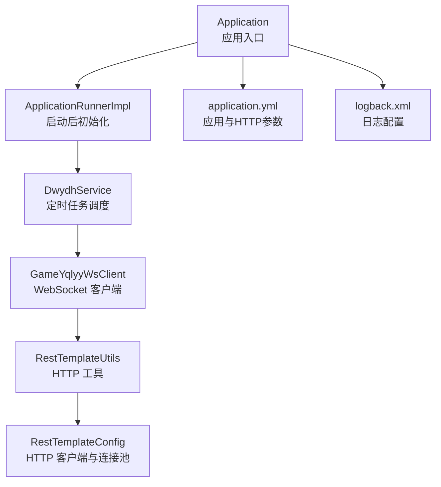
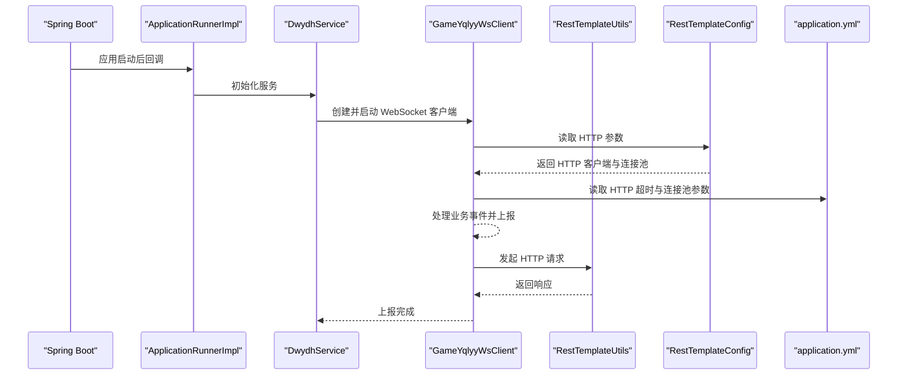
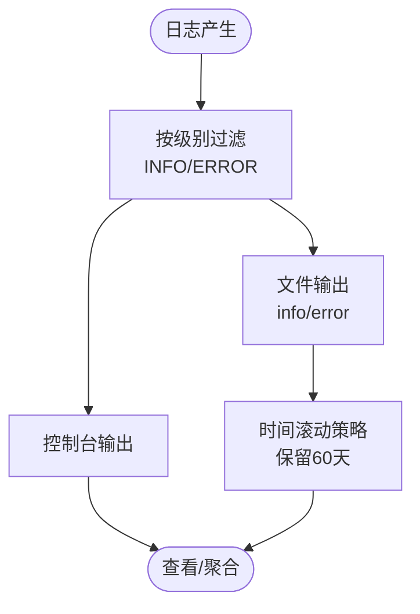
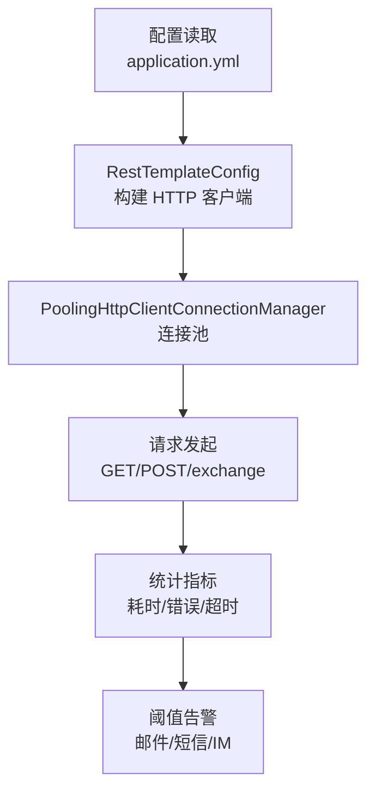
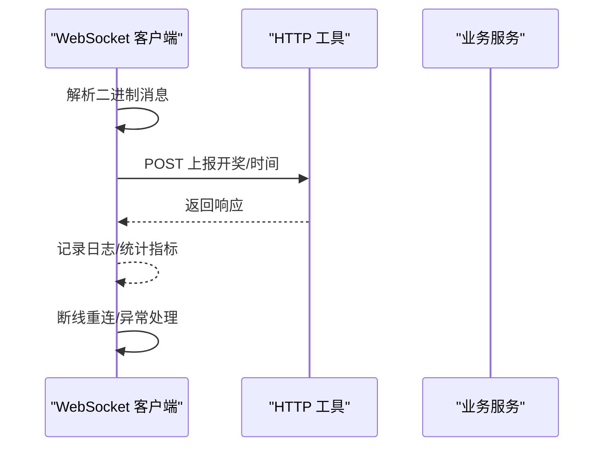
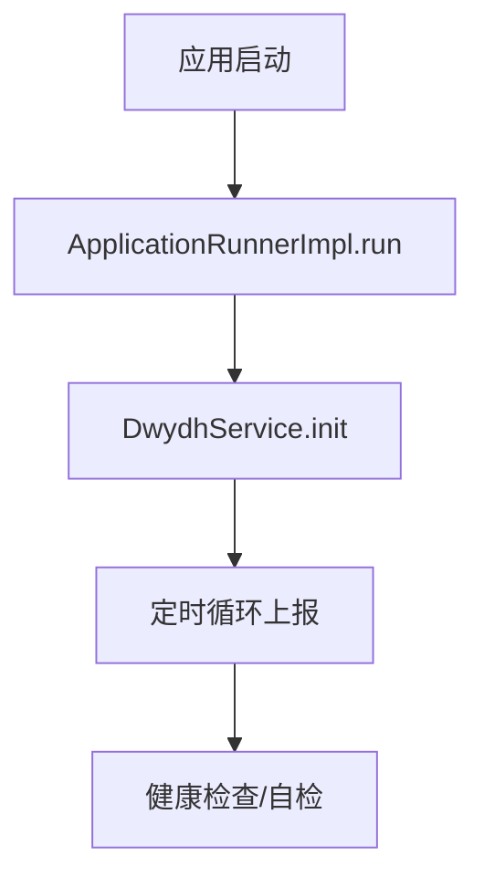
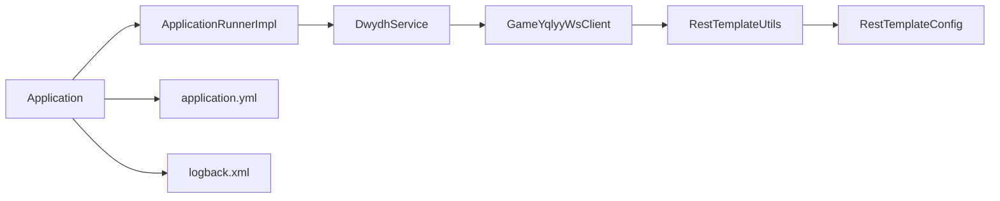

# 监控告警

<cite>
**本文引用的文件**
- [Application.java](file://src/main/java/com/Application.java)
- [application.yml](file://src/main/resources/application.yml)
- [logback.xml](file://src/main/resources/logback.xml)
- [RestTemplateConfig.java](file://src/main/java/com/commom/RestTemplateConfig.java)
- [RestTemplateUtils.java](file://src/main/java/com/commom/RestTemplateUtils.java)
- [DwydhService.java](file://src/main/java/com/dwydh/DwydhService.java)
- [GameYqlyyWsClient.java](file://src/main/java/com/yqlyy/GameYqlyyWsClient.java)
- [ApplicationRunnerImpl.java](file://src/main/java/com/listener/ApplicationRunnerImpl.java)
- [DomainNameUtil.java](file://src/main/java/com/utils/DomainNameUtil.java)
- [pom.xml](file://pom.xml)
</cite>

## 目录
1. [简介](#简介)
2. [项目结构](#项目结构)
3. [核心组件](#核心组件)
4. [架构总览](#架构总览)
5. [详细组件分析](#详细组件分析)
6. [依赖关系分析](#依赖关系分析)
7. [性能考量](#性能考量)
8. [故障排查指南](#故障排查指南)
9. [结论](#结论)
10. [附录](#附录)

## 简介
本方案围绕系统监控与告警，结合当前代码库现状，给出可落地的实施方案。内容涵盖：
- 关键监控指标定义与采集：系统资源、应用性能、业务指标
- 日志监控：级别、轮转、聚合
- 告警规则与通知：邮件、短信、IM
- 性能监控工具集成：Prometheus、Grafana
- 健康检查与自检机制
- 监控可视化与报表
- 扩展与定制化配置建议

当前仓库以日志与网络连接配置为主，未包含内置监控与告警实现。本方案在现有基础上提出“按需扩展”的实施路径。

## 项目结构
项目采用 Spring Boot 标准目录结构，核心入口为应用启动类，配置集中在 application.yml 与 logback.xml，网络客户端通过 RestTemplate 配置与工具封装。

图表来源
- [Application.java](file://src/main/java/com/Application.java#L1-L14)
- [ApplicationRunnerImpl.java](file://src/main/java/com/listener/ApplicationRunnerImpl.java#L1-L33)
- [DwydhService.java](file://src/main/java/com/dwydh/DwydhService.java#L1-L39)
- [GameYqlyyWsClient.java](file://src/main/java/com/yqlyy/GameYqlyyWsClient.java#L1-L328)
- [RestTemplateUtils.java](file://src/main/java/com/commom/RestTemplateUtils.java#L1-L31)
- [RestTemplateConfig.java](file://src/main/java/com/commom/RestTemplateConfig.java#L1-L132)
- [application.yml](file://src/main/resources/application.yml#L1-L31)
- [logback.xml](file://src/main/resources/logback.xml#L1-L75)

章节来源
- [Application.java](file://src/main/java/com/Application.java#L1-L14)
- [application.yml](file://src/main/resources/application.yml#L1-L31)
- [logback.xml](file://src/main/resources/logback.xml#L1-L75)

## 核心组件
- 应用入口与启动流程
  - 应用启动类负责引导 Spring Boot 启动
  - 启动后通过 ApplicationRunnerImpl 触发初始化逻辑
- 网络客户端与连接池
  - RestTemplateConfig 提供 HTTP 客户端与连接池配置
  - RestTemplateUtils 封装 GET/POST/exchange 操作
- 业务客户端
  - GameYqlyyWsClient 通过 WebSocket 接收业务事件，并在合适时机调用 HTTP 工具上报
- 日志系统
  - logback.xml 定义控制台与文件输出、级别过滤、滚动策略

章节来源
- [Application.java](file://src/main/java/com/Application.java#L1-L14)
- [ApplicationRunnerImpl.java](file://src/main/java/com/listener/ApplicationRunnerImpl.java#L1-L33)
- [RestTemplateConfig.java](file://src/main/java/com/commom/RestTemplateConfig.java#L1-L132)
- [RestTemplateUtils.java](file://src/main/java/com/commom/RestTemplateUtils.java#L1-L31)
- [GameYqlyyWsClient.java](file://src/main/java/com/yqlyy/GameYqlyyWsClient.java#L1-L328)
- [logback.xml](file://src/main/resources/logback.xml#L1-L75)

## 架构总览
下图展示从应用启动到业务事件处理与上报的整体流程，以及日志与网络配置对监控的影响。

图表来源
- [ApplicationRunnerImpl.java](file://src/main/java/com/listener/ApplicationRunnerImpl.java#L1-L33)
- [DwydhService.java](file://src/main/java/com/dwydh/DwydhService.java#L1-L39)
- [GameYqlyyWsClient.java](file://src/main/java/com/yqlyy/GameYqlyyWsClient.java#L1-L328)
- [RestTemplateConfig.java](file://src/main/java/com/commom/RestTemplateConfig.java#L1-L132)
- [application.yml](file://src/main/resources/application.yml#L1-L31)

## 详细组件分析

### 组件一：日志监控与分析
- 日志级别与输出
  - 控制台输出与文件输出分离，便于开发调试与生产归档
  - INFO/ERROR 分级落盘，减少 IO 压力
- 日志轮转
  - 基于时间的滚动策略，保留历史 60 天
- 日志聚合
  - 建议在生产环境接入集中式日志平台（如 ELK/EFK），统一采集、索引与检索
- 建议的监控点
  - ERROR/WARN 级别阈值报警
  - 特定业务关键词（如“异常”、“超时”、“连接失败”）的实时告警

图表来源
- [logback.xml](file://src/main/resources/logback.xml#L1-L75)

章节来源
- [logback.xml](file://src/main/resources/logback.xml#L1-L75)

### 组件二：HTTP 客户端与连接池监控
- 连接池参数
  - 最大连接数、每路由并发、超时时间、空闲校验等均来自配置文件
- 监控建议
  - 连接池利用率、活跃连接数、超时次数、重试次数
  - 通过埋点统计请求耗时分布与错误类型占比
- 告警阈值示例
  - 连接池空闲比例低于安全阈值
  - 请求超时比例超过阈值
  - 错误率持续升高

图表来源
- [application.yml](file://src/main/resources/application.yml#L16-L30)
- [RestTemplateConfig.java](file://src/main/java/com/commom/RestTemplateConfig.java#L35-L131)
- [RestTemplateUtils.java](file://src/main/java/com/commom/RestTemplateUtils.java#L1-L31)

章节来源
- [application.yml](file://src/main/resources/application.yml#L16-L30)
- [RestTemplateConfig.java](file://src/main/java/com/commom/RestTemplateConfig.java#L35-L131)
- [RestTemplateUtils.java](file://src/main/java/com/commom/RestTemplateUtils.java#L1-L31)

### 组件三：WebSocket 业务事件与上报
- 事件处理
  - 解析 WebSocket 二进制消息，识别不同业务 URI
  - 在开奖与游戏开始等节点触发 HTTP 上报
- 健壮性
  - 断线自动重连、异常捕获与日志记录
- 监控建议
  - 事件到达延迟、上报成功率、响应时间、异常次数
  - 对特定业务 URI 的处理耗时与失败率

图表来源
- [GameYqlyyWsClient.java](file://src/main/java/com/yqlyy/GameYqlyyWsClient.java#L50-L219)
- [RestTemplateUtils.java](file://src/main/java/com/commom/RestTemplateUtils.java#L1-L31)

章节来源
- [GameYqlyyWsClient.java](file://src/main/java/com/yqlyy/GameYqlyyWsClient.java#L1-L328)
- [RestTemplateUtils.java](file://src/main/java/com/commom/RestTemplateUtils.java#L1-L31)

### 组件四：启动与自检机制
- 启动流程
  - 应用启动后执行 ApplicationRunnerImpl.run，初始化 DwydhService
  - DwydhService 启动定时任务，驱动 WebSocket 客户端上报
- 健康检查建议
  - 提供健康端点，检查 WebSocket 连接状态、HTTP 客户端可用性、关键业务指标
  - 自检周期与失败重试策略

图表来源
- [ApplicationRunnerImpl.java](file://src/main/java/com/listener/ApplicationRunnerImpl.java#L1-L33)
- [DwydhService.java](file://src/main/java/com/dwydh/DwydhService.java#L1-L39)

章节来源
- [ApplicationRunnerImpl.java](file://src/main/java/com/listener/ApplicationRunnerImpl.java#L1-L33)
- [DwydhService.java](file://src/main/java/com/dwydh/DwydhService.java#L1-L39)

## 依赖关系分析
- 组件耦合
  - ApplicationRunnerImpl 依赖 DwydhService
  - DwydhService 依赖 RestTemplateUtils 与线程池
  - GameYqlyyWsClient 依赖 RestTemplateUtils 与配置参数
- 外部依赖
  - HTTP 客户端与连接池由 Apache HttpClient 提供
  - 日志框架为 Logback

图表来源
- [Application.java](file://src/main/java/com/Application.java#L1-L14)
- [ApplicationRunnerImpl.java](file://src/main/java/com/listener/ApplicationRunnerImpl.java#L1-L33)
- [DwydhService.java](file://src/main/java/com/dwydh/DwydhService.java#L1-L39)
- [GameYqlyyWsClient.java](file://src/main/java/com/yqlyy/GameYqlyyWsClient.java#L1-L328)
- [RestTemplateUtils.java](file://src/main/java/com/commom/RestTemplateUtils.java#L1-L31)
- [RestTemplateConfig.java](file://src/main/java/com/commom/RestTemplateConfig.java#L1-L132)
- [application.yml](file://src/main/resources/application.yml#L1-L31)
- [logback.xml](file://src/main/resources/logback.xml#L1-L75)

章节来源
- [pom.xml](file://pom.xml#L26-L111)

## 性能考量
- 连接池与超时
  - 合理设置最大连接数与每路由并发，避免资源争用
  - 超时参数需结合业务场景与下游服务能力调整
- 日志开销
  - 生产环境建议降低日志级别，避免高频写盘
  - 使用异步日志 Appender 或外部聚合，降低应用阻塞
- 业务上报频率
  - 当前定时上报周期为固定间隔，建议根据下游能力动态调节

章节来源
- [application.yml](file://src/main/resources/application.yml#L16-L30)
- [RestTemplateConfig.java](file://src/main/java/com/commom/RestTemplateConfig.java#L117-L129)
- [logback.xml](file://src/main/resources/logback.xml#L1-L75)

## 故障排查指南
- WebSocket 连接问题
  - 检查断线重连逻辑与异常日志
  - 校验 URL 与握手消息是否正确
- HTTP 请求异常
  - 关注超时、重试、连接池耗尽等问题
  - 对比请求耗时与错误分布，定位瓶颈
- 日志异常
  - 确认日志级别与滚动策略配置
  - 检查磁盘空间与权限

章节来源
- [GameYqlyyWsClient.java](file://src/main/java/com/yqlyy/GameYqlyyWsClient.java#L240-L290)
- [RestTemplateConfig.java](file://src/main/java/com/commom/RestTemplateConfig.java#L84-L108)
- [logback.xml](file://src/main/resources/logback.xml#L1-L75)

## 结论
当前代码库具备良好的日志与网络基础配置，但缺少内置监控与告警能力。建议按以下步骤推进：
- 引入指标埋点与导出（如 Micrometer + Prometheus）
- 部署 Grafana 展示仪表盘
- 建立基于阈值与趋势的告警规则
- 完善健康检查与自检机制
- 逐步引入集中式日志与链路追踪

## 附录

### 关键监控指标清单
- 系统资源
  - CPU 使用率、内存占用、GC 次数与耗时
- 应用性能
  - HTTP 请求耗时分布、错误率、超时率、连接池利用率
- 业务指标
  - 事件到达延迟、上报成功率、业务 URI 处理耗时与失败率

### 日志监控配置要点
- 级别：INFO/ERROR 分离输出
- 轮转：按日滚动，保留 60 天
- 聚合：生产环境接入集中式日志平台

### 告警规则与阈值建议
- 邮件：严重级别（ERROR/WARN）阈值告警
- 短信：关键业务失败率与超时率阈值
- IM：即时通道，用于高优告警与紧急通知

### 性能监控工具集成
- Prometheus：暴露指标端点，抓取应用指标
- Grafana：构建仪表盘，设置告警面板
- 可选：Micrometer、Actuator、Prometheus JMX Exporter

### 健康检查与自检
- 健康端点：检查 WebSocket 连接、HTTP 客户端、关键业务指标
- 自检周期：按业务重要性设定，失败自动重试

### 可视化与报表
- Grafana 仪表盘：CPU/内存/IO、HTTP 指标、业务指标
- 报表：按日/周/月生成运行报告与告警统计