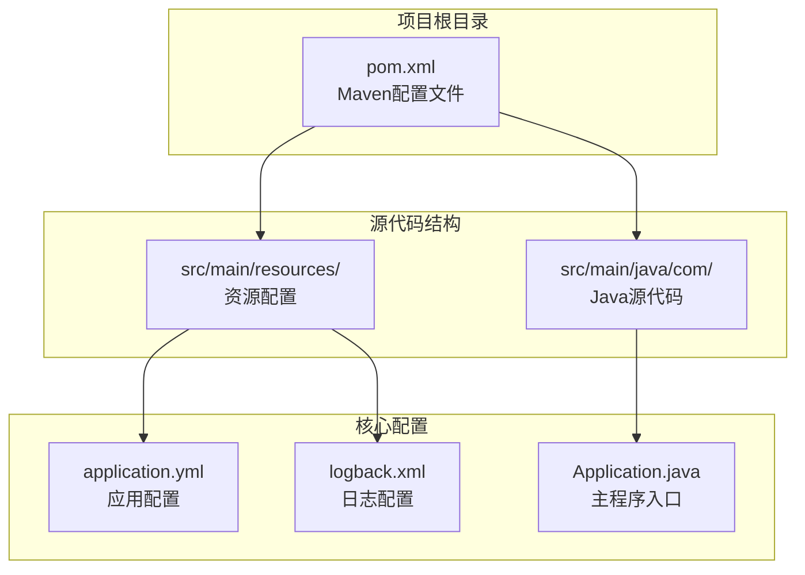
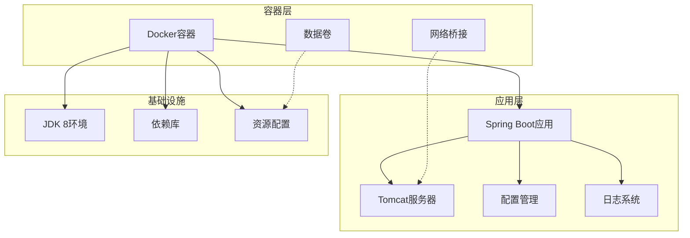
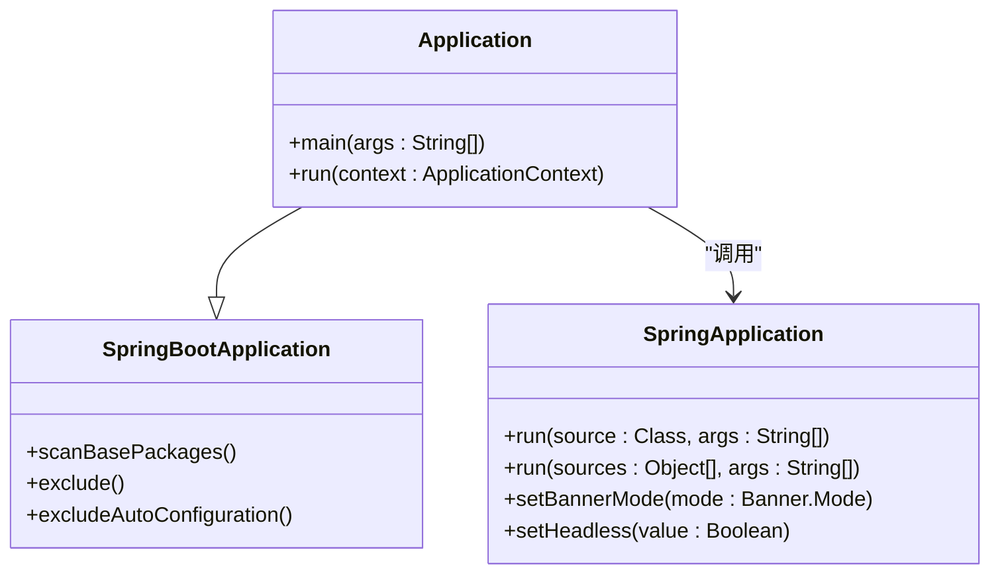
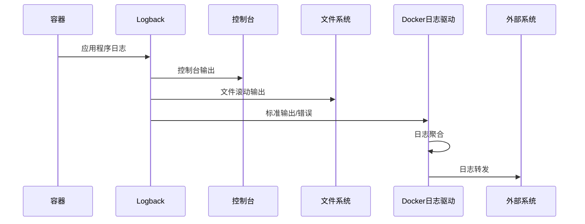
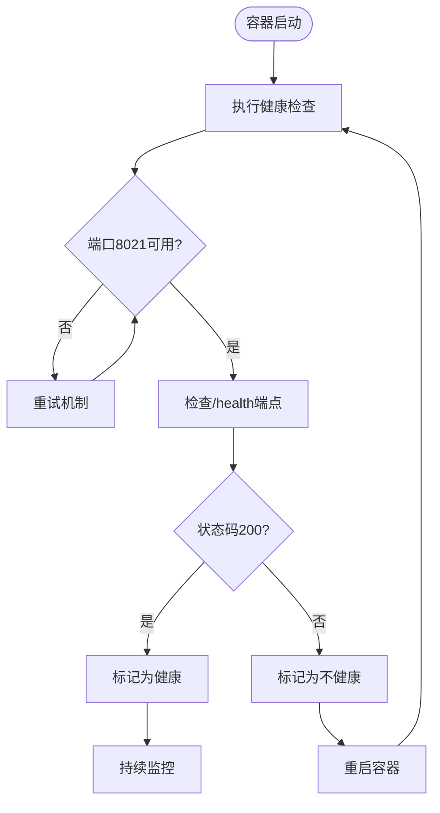

# Docker容器化部署

<cite>
**本文档引用的文件**
- [pom.xml](file://pom.xml)
- [application.yml](file://src/main/resources/application.yml)
- [logback.xml](file://src/main/resources/logback.xml)
- [Application.java](file://src/main/java/com/Application.java)
</cite>

## 目录
1. [简介](#简介)
2. [项目结构](#项目结构)
3. [核心组件](#核心组件)
4. [架构概览](#架构概览)
5. [详细组件分析](#详细组件分析)
6. [Docker容器化部署指南](#docker容器化部署指南)
7. [Docker Compose编排](#docker-compose编排)
8. [容器监控与日志](#容器监控与日志)
9. [故障排查指南](#故障排查指南)
10. [性能优化建议](#性能优化建议)
11. [安全最佳实践](#安全最佳实践)
12. [结论](#结论)

## 简介

TigerTeeth是一个基于Spring Boot开发的Java应用程序，主要用于虎牙直播相关的数据爬取和处理功能。本指南将详细介绍如何为该应用程序创建完整的Docker容器化部署方案，包括Dockerfile编写、镜像构建、容器运行、多容器编排以及运维监控等各个方面。

## 项目结构

该项目采用标准的Maven Spring Boot项目结构，主要包含以下关键组件：



**图表来源**
- [pom.xml](file://pom.xml#L1-L160)
- [application.yml](file://src/main/resources/application.yml#L1-L31)
- [logback.xml](file://src/main/resources/logback.xml#L1-L75)
- [Application.java](file://src/main/java/com/Application.java#L1-L14)

**章节来源**
- [pom.xml](file://pom.xml#L1-L160)
- [application.yml](file://src/main/resources/application.yml#L1-L31)
- [logback.xml](file://src/main/resources/logback.xml#L1-L75)
- [Application.java](file://src/main/java/com/Application.java#L1-L14)

## 核心组件

### 应用程序配置

应用程序使用Spring Boot框架，配置信息主要集中在application.yml文件中：

- **服务器配置**: 端口8021，上下文路径/tigerTeeth
- **HTTP客户端配置**: 最大连接数100，路由并发数20
- **超时配置**: 连接超时10秒，套接字超时30秒
- **环境配置**: 支持动态profile切换

### 日志系统

项目采用Logback作为日志框架，配置特点：
- 控制台输出和文件滚动输出双重配置
- 基于时间的日志轮转策略
- 60天的历史日志保留
- 模块化日志级别控制

**章节来源**
- [application.yml](file://src/main/resources/application.yml#L1-L31)
- [logback.xml](file://src/main/resources/logback.xml#L1-L75)

## 架构概览



**图表来源**
- [pom.xml](file://pom.xml#L11-L18)
- [application.yml](file://src/main/resources/application.yml#L1-L31)
- [logback.xml](file://src/main/resources/logback.xml#L1-L75)

## 详细组件分析

### 主程序入口分析

Application类作为Spring Boot应用的启动入口，具有以下特点：



**图表来源**
- [Application.java](file://src/main/java/com/Application.java#L1-L14)

### Maven构建配置分析

项目使用Maven进行构建管理，关键配置包括：

- **Java版本**: 1.8 (Spring Boot 2.2.13兼容)
- **Spring Boot版本**: 2.2.13.RELEASE
- **打包名称**: game-hy
- **插件配置**: 编译器插件、资源插件、Spring Boot Maven插件

**章节来源**
- [pom.xml](file://pom.xml#L11-L18)
- [pom.xml](file://pom.xml#L114-L156)

## Docker容器化部署指南

### Dockerfile编写

#### 基础镜像选择

基于项目特性，推荐使用以下基础镜像：

```dockerfile
# 使用官方OpenJDK 8运行时作为基础镜像
FROM openjdk:8-jre-alpine

# 设置工作目录
WORKDIR /app

# 复制JAR文件
COPY target/game-hy.jar app.jar

# 暴露端口
EXPOSE 8021

# 设置环境变量
ENV JAVA_OPTS=""
ENV SPRING_PROFILES_ACTIVE=prod

# 健康检查
HEALTHCHECK --interval=30s --timeout=3s --start-period=5s --retries=3 \
    CMD curl -f http://localhost:8021/tigerTeeth/health || exit 1

# 启动命令
ENTRYPOINT ["sh", "-c", "java $JAVA_OPTS -jar app.jar --spring.profiles.active=$SPRING_PROFILES_ACTIVE"]
```

#### 多阶段构建优化

对于生产环境，建议使用多阶段构建：

```dockerfile
# 第一阶段：构建阶段
FROM maven:3.8.4-openjdk-8 AS builder

WORKDIR /app
COPY pom.xml .
COPY src src
RUN mvn package -DskipTests

# 第二阶段：运行阶段
FROM openjdk:8-jre-alpine

# 创建非root用户
RUN addgroup -g 1001 -S appuser && \
    adduser -u 1001 -S appuser && \
    mkdir /app && \
    chown -R appuser:appuser /app

WORKDIR /app
COPY --from=builder --chown=appuser:appuser target/game-hy.jar app.jar

# 设置非root用户运行
USER appuser

EXPOSE 8021
HEALTHCHECK CMD curl -f http://localhost:8021/tigerTeeth/health || exit 1
ENTRYPOINT ["java", "-jar", "app.jar"]
```

### 镜像构建过程

#### 构建命令

```bash
# 基础构建
docker build -t tiger-teeth:latest .

# 指定构建参数
docker build --build-arg JAVA_OPTS="-Xmx512m" -t tiger-teeth:1.0 .

# 多平台构建
docker buildx build --platform linux/amd64,linux/arm64 -t tiger-teeth:multi .
```

#### 镜像标签管理

```bash
# 版本化标签
docker tag tiger-teeth:latest tiger-teeth:1.0.0
docker tag tiger-teeth:latest tiger-teeth:v1.0.0

# 环境标签
docker tag tiger-teeth:latest tiger-teeth:dev
docker tag tiger-teeth:latest tiger-teeth:staging
docker tag tiger-teeth:latest tiger-teeth:prod
```

### 容器运行详解

#### 基础运行命令

```bash
# 基础运行
docker run -d \
  --name tiger-teeth-app \
  -p 8021:8021 \
  -v /opt/tiger-teeth/logs:/app/logs \
  tiger-teeth:latest

# 带环境变量运行
docker run -d \
  --name tiger-teeth-app \
  -p 8021:8021 \
  -e SPRING_PROFILES_ACTIVE=prod \
  -e JAVA_OPTS="-Xmx1g -XX:+UseG1GC" \
  -v ./logs:/app/logs \
  -v ./config:/app/config \
  tiger-teeth:latest
```

#### 网络配置

```bash
# 自定义网络
docker network create tiger-net

docker run -d \
  --name tiger-teeth-app \
  --network tiger-net \
  --network-alias tiger-teeth \
  -p 8021:8021 \
  tiger-teeth:latest
```

#### 数据卷挂载

```bash
# 日志卷
docker volume create tiger-teeth-logs

docker run -d \
  --name tiger-teeth-app \
  -p 8021:8021 \
  -v tiger-teeth-logs:/app/logs \
  tiger-teeth:latest

# 配置卷
docker run -d \
  --name tiger-teeth-app \
  -p 8021:8021 \
  -v ./application-prod.yml:/app/config/application.yml \
  tiger-teeth:latest
```

## Docker Compose编排

### 基础Compose配置

```yaml
version: '3.8'

services:
  tiger-teeth:
    build: .
    container_name: tiger-teeth-app
    ports:
      - "8021:8021"
    volumes:
      - ./logs:/app/logs
      - ./config:/app/config
    environment:
      - SPRING_PROFILES_ACTIVE=prod
      - JAVA_OPTS=-Xmx1g -XX:+UseG1GC
    healthcheck:
      test: ["CMD", "curl", "-f", "http://localhost:8021/tigerTeeth/health"]
      interval: 30s
      timeout: 10s
      retries: 3
      start_period: 40s
    restart: unless-stopped
    networks:
      - tiger-network

  # 可选：日志收集服务
  logspout:
    image: gliderlabs/logspout:latest
    container_name: tiger-teeth-logspout
    volumes:
      - /var/run/docker.sock:/var/run/docker.sock
    networks:
      - tiger-network
    depends_on:
      - tiger-teeth

networks:
  tiger-network:
    driver: bridge

volumes:
  tiger-teeth-logs:
  tiger-teeth-config:
```

### 生产级Compose配置

```yaml
version: '3.8'

services:
  tiger-teeth:
    build:
      context: .
      dockerfile: Dockerfile
      args:
        - JAVA_OPTS=-Xmx1g -XX:+UseG1GC
    container_name: tiger-teeth-app
    ports:
      - "8021:8021"
    volumes:
      - tiger-teeth-logs:/app/logs
      - ./config:/app/config:ro
    environment:
      - SPRING_PROFILES_ACTIVE=prod
      - TZ=Asia/Shanghai
      - LANG=C.UTF-8
    healthcheck:
      test: ["CMD", "wget", "--spider", "-q", "localhost:8021/tigerTeeth/health"]
      interval: 30s
      timeout: 10s
      retries: 3
      start_period: 60s
    restart: "on-failure:5"
    deploy:
      resources:
        limits:
          cpus: '1'
          memory: 2G
        reservations:
          cpus: '0.5'
          memory: 1G
    logging:
      driver: "json-file"
      options:
        max-size: "10m"
        max-file: "3"
    networks:
      - tiger-network
      - monitoring-network

  # 监控服务
  prometheus:
    image: prom/prometheus:latest
    container_name: tiger-teeth-prometheus
    ports:
      - "9090:9090"
    volumes:
      - ./monitoring/prometheus.yml:/etc/prometheus/prometheus.yml
    networks:
      - monitoring-network
    depends_on:
      - tiger-teeth

  # 日志服务
  graylog:
    image: graylog/graylog:latest
    container_name: tiger-teeth-graylog
    ports:
      - "9000:9000"
      - "12201:12201"
      - "1514:1514"
    volumes:
      - graylog-data:/usr/share/graylog/data
    environment:
      - GRAYLOG_PASSWORD_SECRET=your-secret-key
      - GRAYLOG_ROOT_PASSWORD_SHA2=your-hash
    networks:
      - monitoring-network
    depends_on:
      - tiger-teeth

volumes:
  tiger-teeth-logs:
  graylog-data:

networks:
  tiger-network:
    driver: bridge
  monitoring-network:
    driver: bridge
```

## 容器监控与日志

### 日志配置优化



**图表来源**
- [logback.xml](file://src/main/resources/logback.xml#L8-L73)

### 监控指标收集

```yaml
# Prometheus监控配置示例
scrape_configs:
  - job_name: 'tiger-teeth'
    static_configs:
      - targets: ['tiger-teeth:8021']
    metrics_path: '/actuator/prometheus'
    scrape_interval: 15s
```

### 健康检查实现



**图表来源**
- [application.yml](file://src/main/resources/application.yml#L2-L5)

## 故障排查指南

### 常见问题诊断

#### 启动失败排查

```bash
# 查看容器状态
docker ps -a

# 查看容器日志
docker logs tiger-teeth-app
docker logs -f tiger-teeth-app

# 查看容器详细信息
docker inspect tiger-teeth-app

# 进入容器调试
docker exec -it tiger-teeth-app /bin/sh
```

#### 端口冲突解决

```bash
# 检查端口占用
netstat -tulpn | grep 8021
lsof -i :8021

# 修改端口映射
docker run -p 8081:8021 tiger-teeth:latest
```

#### 内存不足问题

```bash
# 查看容器资源使用
docker stats tiger-teeth-app

# 调整JVM内存参数
docker run -e JAVA_OPTS="-Xmx512m -XX:+UseG1GC" tiger-teeth:latest
```

### 性能监控

```bash
# 实时监控容器资源
docker stats --format "table {{.Container}}\t{{.CPUPerc}}\t{{.MemUsage}}\t{{.NetIO}}\t{{.BlockIO}}"

# 查看容器进程
docker top tiger-teeth-app

# 查看容器文件系统使用
docker system df -v
```

**章节来源**
- [logback.xml](file://src/main/resources/logback.xml#L1-L75)
- [application.yml](file://src/main/resources/application.yml#L1-L31)

## 性能优化建议

### JVM调优参数

基于应用程序特性，建议以下JVM参数配置：

- **堆内存**: `-Xmx1g` (根据服务器内存调整)
- **垃圾回收**: `-XX:+UseG1GC` (低延迟GC)
- **元空间**: `-XX:MetaspaceSize=256m`
- **线程栈**: `-Xss256k`

### Spring Boot优化

```yaml
# application.yml中的性能配置
server:
  tomcat:
    max-connections: 1000
    accept-count: 100
    threads:
      min-spare: 10
      max: 200

spring:
  http:
    client:
      pool:
        max-active: 200
        max-idle: 50
        min-idle: 10
```

### 容器资源限制

```yaml
# Docker Compose资源限制
deploy:
  resources:
    limits:
      cpus: '1.5'
      memory: 2G
    reservations:
      cpus: '0.5'
      memory: 1G
```

## 安全最佳实践

### 镜像安全

```dockerfile
# 安全的Dockerfile示例
FROM openjdk:8-jre-slim

# 使用非root用户
RUN groupadd -r appuser && useradd -r -g appuser appuser
USER appuser

# 最小化攻击面
RUN apt-get update && apt-get install -y ca-certificates && rm -rf /var/lib/apt/lists/*

# 清理缓存
RUN rm -rf /var/cache/apk/*
```

### 运行时安全

```yaml
# 安全配置示例
security_opt:
  - no-new-privileges:true

read_only: true
tmpfs: /tmp
tmpfs: /var/tmp

cap_drop:
  - ALL
cap_add:
  - NET_BIND_SERVICE

devices:
  - /dev/null:/dev/null:rw
```

### 网络安全

```yaml
# 网络隔离
networks:
  internal_network:
    internal: true

# 端口最小化暴露
ports:
  - "8021:8021"  # 仅暴露必要端口
```

### 密钥管理

```yaml
# 使用Docker secrets
secrets:
  db_password:
    file: ./db_password.txt

environment:
  DB_PASSWORD_FILE: /run/secrets/db_password
```

## 结论

通过本指南，您已经了解了如何为TigerTeeth应用程序创建完整的Docker容器化部署方案。关键要点包括：

1. **镜像构建**: 使用多阶段构建优化镜像大小，采用非root用户运行
2. **配置管理**: 通过环境变量和配置文件实现灵活的应用配置
3. **监控集成**: 集成健康检查、日志收集和性能监控
4. **安全实践**: 实施最小权限原则和网络隔离
5. **运维优化**: 配置资源限制和自动重启机制

建议在生产环境中实施以下额外措施：
- 使用CI/CD流水线自动化构建和部署
- 实施蓝绿部署或滚动更新策略
- 建立完善的监控告警体系
- 定期进行安全扫描和漏洞评估

这些实践将确保您的应用程序在容器环境中稳定、安全、高效地运行。