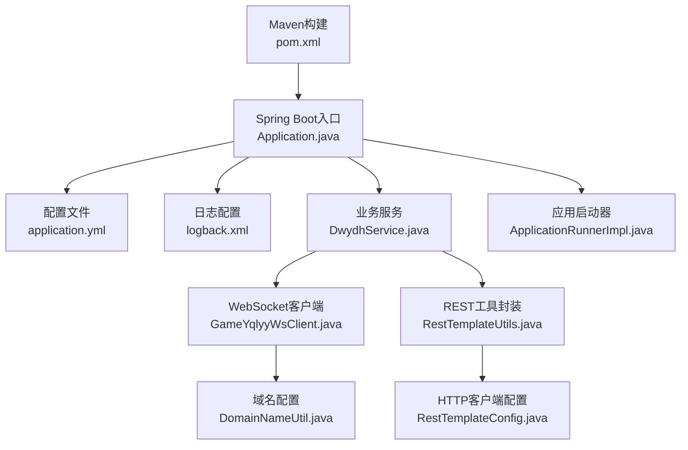
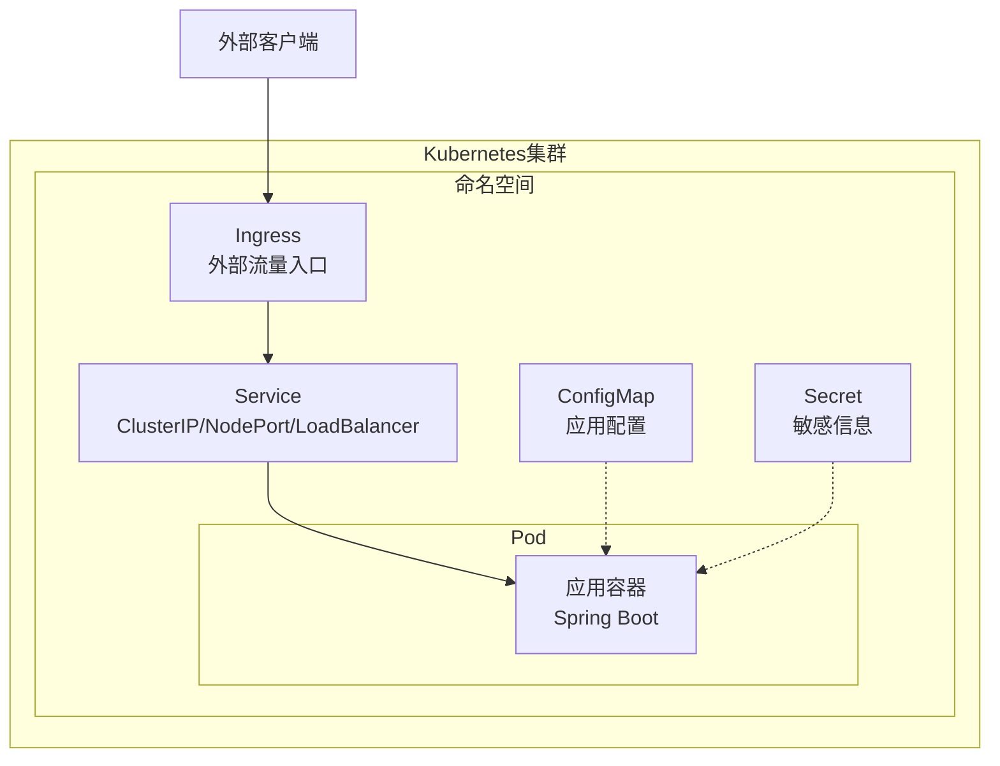
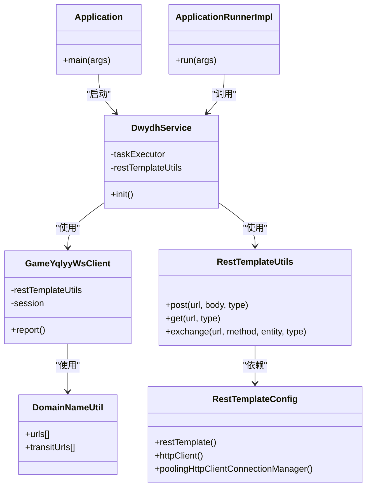

# Kubernetes集群部署

<cite>
**本文档引用的文件**
- [pom.xml](file://pom.xml)
- [application.yml](file://src/main/resources/application.yml)
- [logback.xml](file://src/main/resources/logback.xml)
- [Application.java](file://src/main/java/com/Application.java)
- [RestTemplateConfig.java](file://src/main/java/com/commom/RestTemplateConfig.java)
- [RestTemplateUtils.java](file://src/main/java/com/commom/RestTemplateUtils.java)
- [DwydhService.java](file://src/main/java/com/dwydh/DwydhService.java)
- [GameYqlyyWsClient.java](file://src/main/java/com/yqlyy/GameYqlyyWsClient.java)
- [ApplicationRunnerImpl.java](file://src/main/java/com/listener/ApplicationRunnerImpl.java)
- [DomainNameUtil.java](file://src/main/java/com/utils/DomainNameUtil.java)
</cite>

## 目录
1. [简介](#简介)
2. [项目结构](#项目结构)
3. [核心组件](#核心组件)
4. [架构总览](#架构总览)
5. [详细组件分析](#详细组件分析)
6. [依赖关系分析](#依赖关系分析)
7. [性能考虑](#性能考虑)
8. [故障排除指南](#故障排除指南)
9. [结论](#结论)
10. [附录](#附录)

## 简介
本指南面向在Kubernetes集群中部署基于Spring Boot的Java应用，涵盖Deployment、Service、ConfigMap等资源配置文件的编写要点；解释Pod的创建与管理（副本数量、资源限制、健康检查）；说明Service暴露方式（ClusterIP、NodePort、LoadBalancer）的适用场景；介绍ConfigMap与Secret的使用；提供Ingress控制器配置思路；并给出滚动更新与回滚策略、监控与日志收集（Prometheus、ELK Stack）的集成方案。为便于理解，文档结合仓库中的Spring Boot应用结构进行说明。

## 项目结构
该仓库是一个基于Spring Boot的Java应用，主要包含以下结构：
- Maven构建配置：定义了依赖、插件与打包产物名称
- Spring Boot入口类：应用启动入口
- 配置文件：HTTP客户端参数、日志配置
- 业务组件：WebSocket客户端、定时任务、REST调用封装
- 工具类：域名配置、实体模型

图表来源
- [pom.xml](file://pom.xml#L1-L160)
- [Application.java](file://src/main/java/com/Application.java#L1-L14)
- [application.yml](file://src/main/resources/application.yml#L1-L31)
- [logback.xml](file://src/main/resources/logback.xml#L1-L75)
- [DwydhService.java](file://src/main/java/com/dwydh/DwydhService.java#L1-L39)
- [GameYqlyyWsClient.java](file://src/main/java/com/yqlyy/GameYqlyyWsClient.java#L1-L328)
- [RestTemplateUtils.java](file://src/main/java/com/commom/RestTemplateUtils.java#L1-L31)
- [RestTemplateConfig.java](file://src/main/java/com/commom/RestTemplateConfig.java#L1-L132)
- [ApplicationRunnerImpl.java](file://src/main/java/com/listener/ApplicationRunnerImpl.java#L1-L34)
- [DomainNameUtil.java](file://src/main/java/com/utils/DomainNameUtil.java#L1-L16)

章节来源
- [pom.xml](file://pom.xml#L1-L160)
- [Application.java](file://src/main/java/com/Application.java#L1-L14)
- [application.yml](file://src/main/resources/application.yml#L1-L31)
- [logback.xml](file://src/main/resources/logback.xml#L1-L75)

## 核心组件
- Spring Boot应用入口：负责应用启动与上下文初始化
- 业务服务层：封装定时任务与WebSocket客户端逻辑
- HTTP客户端：通过RestTemplate配置连接池、超时与重试策略
- 日志系统：Logback配置文件，支持控制台与文件输出
- 应用启动器：在应用启动后执行初始化任务

章节来源
- [Application.java](file://src/main/java/com/Application.java#L1-L14)
- [DwydhService.java](file://src/main/java/com/dwydh/DwydhService.java#L1-L39)
- [RestTemplateConfig.java](file://src/main/java/com/commom/RestTemplateConfig.java#L1-L132)
- [RestTemplateUtils.java](file://src/main/java/com/commom/RestTemplateUtils.java#L1-L31)
- [logback.xml](file://src/main/resources/logback.xml#L1-L75)
- [ApplicationRunnerImpl.java](file://src/main/java/com/listener/ApplicationRunnerImpl.java#L1-L34)

## 架构总览
下图展示了应用在Kubernetes中的典型部署架构：容器化应用作为Pod运行，通过Service对外暴露，ConfigMap/Secret提供配置与密钥，Ingress统一接入外部流量，Prometheus与ELK分别承担监控与日志收集。

说明
- Pod：运行Spring Boot应用容器
- Service：提供稳定网络端点，支持ClusterIP、NodePort、LoadBalancer三种类型
- ConfigMap：存放非敏感配置（如日志路径、HTTP参数）
- Secret：存放敏感信息（如数据库密码、API密钥）
- Ingress：统一入口，实现域名解析与TLS终止

## 详细组件分析

### Deployment配置要点
- 副本数量：根据业务并发需求设置replicas
- 资源限制：为CPU与内存设置requests/limits，避免资源争抢
- 健康检查：配置livenessProbe/readinessProbe，确保Pod自愈
- 滚动更新：设置strategy为RollingUpdate，合理配置maxUnavailable与maxSurge
- 环境变量：通过EnvFrom引用ConfigMap/Secret

参考路径
- [pom.xml](file://pom.xml#L114-L156)（构建产物名称与插件配置）

### Service暴露方式选择
- ClusterIP：默认类型，仅集群内部访问，适用于Pod间通信
- NodePort：在所有节点开放端口，便于开发调试与简单场景
- LoadBalancer：对接云厂商负载均衡器，适合生产环境对外暴露

适用场景
- 内部微服务通信：ClusterIP
- 开发测试：NodePort
- 生产对外服务：LoadBalancer

### ConfigMap与Secret使用
- ConfigMap：存放应用配置（如日志路径、HTTP连接参数），通过envFrom挂载
- Secret：存放敏感数据（如数据库密码、第三方API密钥），通过envFrom或volume挂载

参考路径
- [application.yml](file://src/main/resources/application.yml#L1-L31)（HTTP客户端参数）
- [logback.xml](file://src/main/resources/logback.xml#L1-L75)（日志输出配置）

### Ingress控制器配置
- 规则：基于域名与路径转发到对应Service
- TLS：启用HTTPS，配置证书
- 注解：根据Ingress控制器特性添加注解（如限流、缓存）

### 滚动更新与回滚策略
- 更新策略：RollingUpdate，设置maxUnavailable与maxSurge
- 回滚：通过kubectl rollout undo恢复到上一版本
- 健康检查：确保新版本就绪后再替换旧版本

### 监控与日志收集
- Prometheus：暴露指标端点，配置ServiceMonitor/Probe
- ELK Stack：通过Filebeat/Fluent Bit采集日志，集中存储于Elasticsearch，可视化于Kibana

## 依赖关系分析
应用内部组件之间的依赖关系如下：

图表来源
- [Application.java](file://src/main/java/com/Application.java#L1-L14)
- [DwydhService.java](file://src/main/java/com/dwydh/DwydhService.java#L1-L39)
- [GameYqlyyWsClient.java](file://src/main/java/com/yqlyy/GameYqlyyWsClient.java#L1-L328)
- [RestTemplateUtils.java](file://src/main/java/com/commom/RestTemplateUtils.java#L1-L31)
- [RestTemplateConfig.java](file://src/main/java/com/commom/RestTemplateConfig.java#L1-L132)
- [ApplicationRunnerImpl.java](file://src/main/java/com/listener/ApplicationRunnerImpl.java#L1-L34)
- [DomainNameUtil.java](file://src/main/java/com/utils/DomainNameUtil.java#L1-L16)

章节来源
- [DwydhService.java](file://src/main/java/com/dwydh/DwydhService.java#L1-L39)
- [GameYqlyyWsClient.java](file://src/main/java/com/yqlyy/GameYqlyyWsClient.java#L1-L328)
- [RestTemplateConfig.java](file://src/main/java/com/commom/RestTemplateConfig.java#L1-L132)
- [RestTemplateUtils.java](file://src/main/java/com/commom/RestTemplateUtils.java#L1-L31)
- [ApplicationRunnerImpl.java](file://src/main/java/com/listener/ApplicationRunnerImpl.java#L1-L34)
- [DomainNameUtil.java](file://src/main/java/com/utils/DomainNameUtil.java#L1-L16)

## 性能考虑
- 连接池优化：通过RestTemplateConfig配置最大连接数、每路由最大连接数、超时参数，提升HTTP请求吞吐
- 日志轮转：Logback按日期滚动，避免单文件过大影响IO
- 资源限制：在Deployment中为CPU与内存设置合理的requests/limits，防止资源争抢
- 健康检查：配置探针，确保Pod快速发现并恢复异常状态

章节来源
- [RestTemplateConfig.java](file://src/main/java/com/commom/RestTemplateConfig.java#L56-L129)
- [logback.xml](file://src/main/resources/logback.xml#L16-L58)

## 故障排除指南
- WebSocket连接异常：检查URL、证书与网络连通性，查看日志中的异常堆栈
- HTTP请求失败：确认超时参数、重试策略与目标服务可达性
- 日志未输出：检查Logback配置与日志目录权限
- Pod频繁重启：检查liveness/readiness探针配置与健康检查接口

章节来源
- [GameYqlyyWsClient.java](file://src/main/java/com/yqlyy/GameYqlyyWsClient.java#L240-L290)
- [RestTemplateConfig.java](file://src/main/java/com/commom/RestTemplateConfig.java#L84-L108)
- [logback.xml](file://src/main/resources/logback.xml#L65-L75)

## 结论
通过将Spring Boot应用容器化并在Kubernetes中部署，可以实现高可用、可扩展的服务架构。结合ConfigMap/Secret管理配置与密钥、Ingress统一入口、Service灵活暴露以及Prometheus/ELK的监控与日志体系，能够有效支撑生产环境的运维与治理。

## 附录
- 部署清单示例（概念性说明，非仓库内容）
  - Deployment：定义容器镜像、副本数、资源限制、探针
  - Service：定义ClusterIP/NodePort/LoadBalancer
  - ConfigMap：定义应用配置键值对
  - Secret：定义敏感信息
  - Ingress：定义域名与路径规则
  - ServiceMonitor/Probe：定义Prometheus监控
  - Filebeat/Fluent Bit：定义日志采集