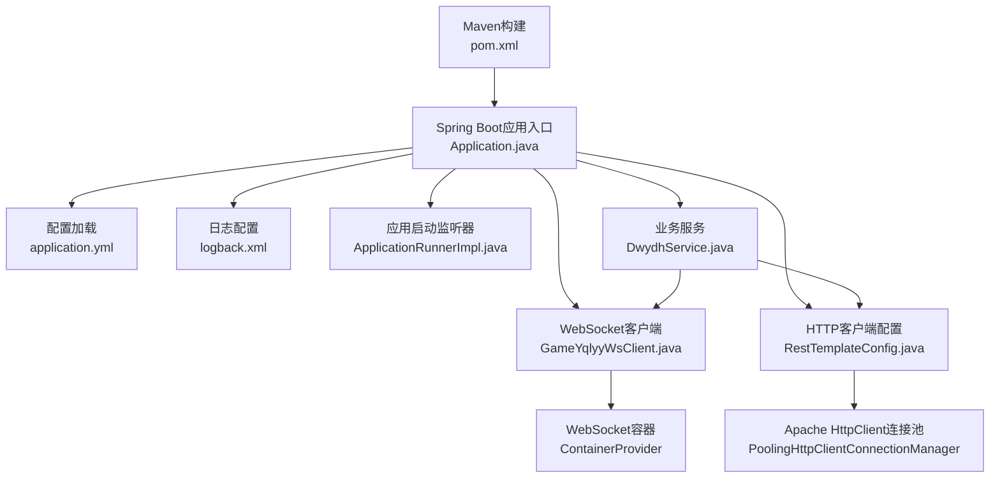
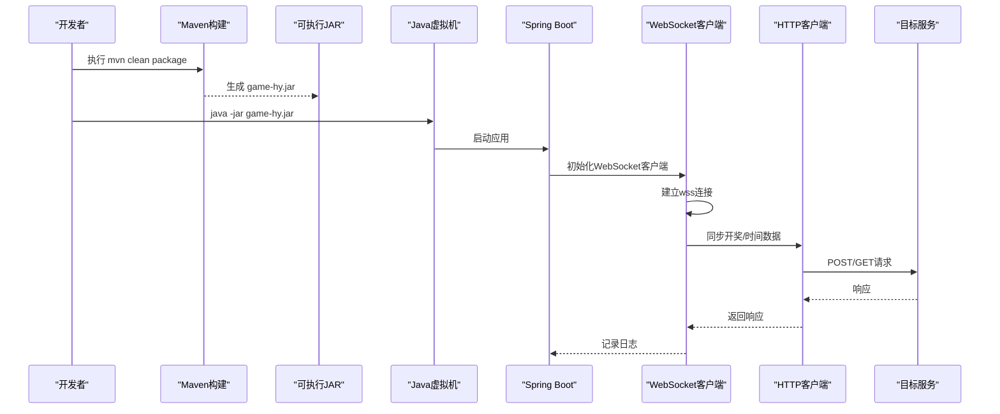
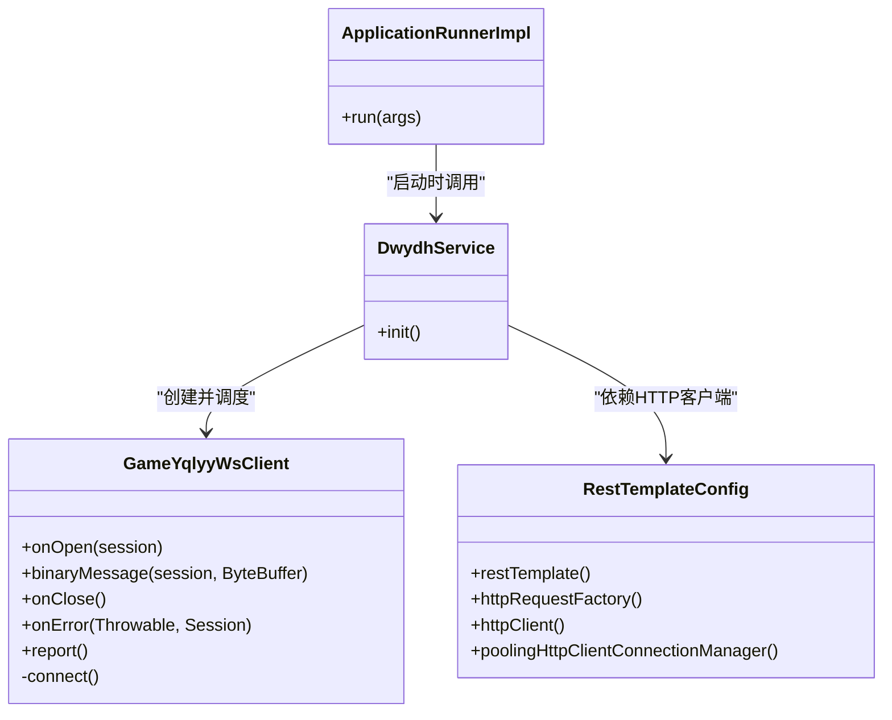
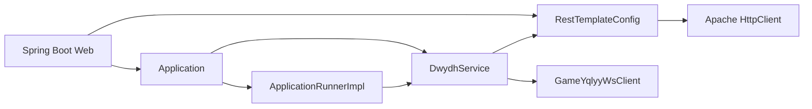

# 传统JAR包部署

<cite>
**本文档引用的文件**
- [pom.xml](file://pom.xml)
- [Application.java](file://src/main/java/com/Application.java)
- [application.yml](file://src/main/resources/application.yml)
- [logback.xml](file://src/main/resources/logback.xml)
- [RestTemplateConfig.java](file://src/main/java/com/commom/RestTemplateConfig.java)
- [GameYqlyyWsClient.java](file://src/main/java/com/yqlyy/GameYqlyyWsClient.java)
- [DwydhService.java](file://src/main/java/com/dwydh/DwydhService.java)
- [ApplicationRunnerImpl.java](file://src/main/java/com/listener/ApplicationRunnerImpl.java)
- [DomainNameUtil.java](file://src/main/java/com/utils/DomainNameUtil.java)
</cite>

## 目录
1. [简介](#简介)
2. [项目结构](#项目结构)
3. [核心组件](#核心组件)
4. [架构总览](#架构总览)
5. [详细组件分析](#详细组件分析)
6. [依赖关系分析](#依赖关系分析)
7. [性能考虑](#性能考虑)
8. [故障排查指南](#故障排查指南)
9. [结论](#结论)
10. [附录](#附录)

## 简介
本指南面向使用传统JAR包部署的运维与开发人员，围绕Maven构建、JAR包生成与启动、配置文件调整、日志查看与常见问题排查等方面提供完整操作说明。该工程基于Spring Boot 2.2.13.RELEASE，采用Maven插件打包为可执行JAR，支持WebSocket客户端与HTTP客户端集成，具备日志滚动与控制台输出能力。

## 项目结构
项目采用标准Maven多模块风格的单模块布局，主要包含：
- Java源码位于 src/main/java，按包组织业务逻辑、实体、工具与监听器
- 配置文件位于 src/main/resources，包含Spring Boot配置与日志配置
- 构建配置位于根目录的 pom.xml，定义依赖、插件与打包产物命名

图表来源
- [pom.xml](file://pom.xml#L114-L156)
- [Application.java](file://src/main/java/com/Application.java#L1-L14)
- [application.yml](file://src/main/resources/application.yml#L1-L31)
- [logback.xml](file://src/main/resources/logback.xml#L1-L75)
- [RestTemplateConfig.java](file://src/main/java/com/commom/RestTemplateConfig.java#L1-L132)
- [GameYqlyyWsClient.java](file://src/main/java/com/yqlyy/GameYqlyyWsClient.java#L1-L328)
- [DwydhService.java](file://src/main/java/com/dwydh/DwydhService.java#L1-L39)
- [ApplicationRunnerImpl.java](file://src/main/java/com/listener/ApplicationRunnerImpl.java#L1-L34)

章节来源
- [pom.xml](file://pom.xml#L1-L160)
- [Application.java](file://src/main/java/com/Application.java#L1-L14)

## 核心组件
- 应用入口与启动
  - 主类位于 com.Application，通过SpringApplication启动Spring Boot应用
- 配置体系
  - application.yml定义服务器端口、上下文路径、环境激活、HTTP客户端连接池参数等
  - logback.xml定义日志输出到控制台与滚动文件，并设置模块日志级别
- WebSocket客户端
  - GameYqlyyWsClient负责建立wss连接、处理二进制消息、上报心跳与进入游戏
- HTTP客户端
  - RestTemplateConfig基于Apache HttpClient实现连接池、超时与重试策略
- 应用启动监听
  - ApplicationRunnerImpl在应用启动后初始化业务服务DwydhService
- 业务服务
  - DwydhService通过线程池调度WebSocket客户端，持续上报与维护连接

章节来源
- [Application.java](file://src/main/java/com/Application.java#L1-L14)
- [application.yml](file://src/main/resources/application.yml#L1-L31)
- [logback.xml](file://src/main/resources/logback.xml#L1-L75)
- [RestTemplateConfig.java](file://src/main/java/com/commom/RestTemplateConfig.java#L1-L132)
- [GameYqlyyWsClient.java](file://src/main/java/com/yqlyy/GameYqlyyWsClient.java#L1-L328)
- [ApplicationRunnerImpl.java](file://src/main/java/com/listener/ApplicationRunnerImpl.java#L1-L34)
- [DwydhService.java](file://src/main/java/com/dwydh/DwydhService.java#L1-L39)

## 架构总览
下图展示从Maven构建到应用启动、WebSocket连接与HTTP同步的整体流程。

图表来源
- [pom.xml](file://pom.xml#L114-L156)
- [Application.java](file://src/main/java/com/Application.java#L1-L14)
- [GameYqlyyWsClient.java](file://src/main/java/com/yqlyy/GameYqlyyWsClient.java#L1-L328)
- [RestTemplateConfig.java](file://src/main/java/com/commom/RestTemplateConfig.java#L1-L132)

## 详细组件分析

### Maven构建与打包
- 关键点
  - 打包类型为 jar，最终产物名为 game-hy.jar
  - 使用 spring-boot-maven-plugin 插件生成可执行JAR
  - 编译插件指定Java版本为1.8，编码为UTF-8
  - 资源过滤启用，便于profile变量替换
- 命令执行步骤
  - 清理：mvn clean
  - 编译：mvn compile
  - 打包：mvn package
  - 生成位置：target/game-hy.jar

章节来源
- [pom.xml](file://pom.xml#L114-L156)

### JAR文件结构与启动
- 结构说明
  - 包含META-INF/MANIFEST.MF，声明Main-Class与Start-Class
  - 包含所有依赖的字节码与资源文件
  - resources目录包含application.yml与logback.xml
- 启动方式
  - 前台运行：java -jar game-hy.jar
  - 后台运行：nohup java -jar game-hy.jar > app.log 2>&1 &
  - 指定配置文件：java -jar game-hy.jar --spring.config.location=classpath:/,file:./conf/
  - 指定环境：java -jar game-hy.jar --spring.profiles.active=prod

章节来源
- [pom.xml](file://pom.xml#L114-L156)
- [Application.java](file://src/main/java/com/Application.java#L1-L14)

### application.yml配置详解
- 服务器配置
  - server.port：HTTP监听端口，默认8021
  - server.servlet.context-path：上下文路径，默认/tigerTeeth
- 环境与应用
  - spring.application.name：应用名称，默认game-tigerTeeth
  - spring.profiles.active：激活的profile，来源于Maven属性占位符
- HTTP客户端参数
  - http.maxTotal：最大连接数，默认100
  - http.defaultMaxPerRoute：每路由默认并发数，默认20
  - http.connectTimeout：连接超时毫秒数，默认10000
  - http.connectionRequestTimeout：从连接池获取连接超时，默认500
  - http.socketTimeout：Socket读取超时，默认30000
  - http.staleConnectionCheckEnabled：启用陈旧连接检查，默认true
  - http.validateAfterInactivity：空闲后验证间隔，默认3000000
- 修改建议
  - 如需变更端口或上下文路径，请直接修改对应字段
  - 如需切换环境，可通过命令行参数覆盖spring.profiles.active
  - 如需优化HTTP性能，可按业务场景调整连接池与超时参数

章节来源
- [application.yml](file://src/main/resources/application.yml#L1-L31)
- [RestTemplateConfig.java](file://src/main/java/com/commom/RestTemplateConfig.java#L1-L132)

### WebSocket客户端与HTTP客户端
- WebSocket客户端
  - GameYqlyyWsClient使用Jakarta WebSocket API，建立wss连接
  - 支持二进制消息解析与事件分发（如开奖、时间同步）
  - 内置心跳与重连机制，连接断开时自动重建
- HTTP客户端
  - RestTemplateConfig基于Apache HttpClient，提供连接池、超时、重试与Keep-Alive策略
  - 默认请求头包含User-Agent、Accept-Encoding、Accept-Language、Connection、Content-Type
- 业务集成
  - DwydhService通过线程池调度WebSocket客户端，定时上报与维护连接
  - ApplicationRunnerImpl在应用启动后调用DwydhService.init()

图表来源
- [RestTemplateConfig.java](file://src/main/java/com/commom/RestTemplateConfig.java#L1-L132)
- [GameYqlyyWsClient.java](file://src/main/java/com/yqlyy/GameYqlyyWsClient.java#L1-L328)
- [DwydhService.java](file://src/main/java/com/dwydh/DwydhService.java#L1-L39)
- [ApplicationRunnerImpl.java](file://src/main/java/com/listener/ApplicationRunnerImpl.java#L1-L34)

章节来源
- [GameYqlyyWsClient.java](file://src/main/java/com/yqlyy/GameYqlyyWsClient.java#L1-L328)
- [RestTemplateConfig.java](file://src/main/java/com/commom/RestTemplateConfig.java#L1-L132)
- [DwydhService.java](file://src/main/java/com/dwydh/DwydhService.java#L1-L39)
- [ApplicationRunnerImpl.java](file://src/main/java/com/listener/ApplicationRunnerImpl.java#L1-L34)

### 日志系统与查看
- 日志配置
  - logback.xml将日志输出到控制台与滚动文件
  - 日志路径为 ./log，info.log与error.log按日期滚动
  - 模块日志级别对com.gzb设为info，Spring框架日志级别设为warn
- 查看方法
  - 前台运行时可在终端实时查看日志
  - 后台运行时查看 ./log/info.log 与 ./log/error.log
  - 可通过日志中的时间戳与线程信息定位问题

章节来源
- [logback.xml](file://src/main/resources/logback.xml#L1-L75)

## 依赖关系分析
- 外部依赖
  - Spring Boot Web Starter：提供Web与嵌入式Tomcat
  - WebSocket API与客户端实现：支持wss连接
  - Apache HttpClient：提供高性能HTTP客户端与连接池
  - Netty相关：提供网络传输能力
  - Hutool：提供常用工具方法
- 内部依赖
  - DwydhService依赖GameYqlyyWsClient与RestTemplateConfig
  - ApplicationRunnerImpl依赖DwydhService
  - GameYqlyyWsClient依赖RestTemplateUtils与DomainNameUtil

图表来源
- [pom.xml](file://pom.xml#L26-L111)
- [RestTemplateConfig.java](file://src/main/java/com/commom/RestTemplateConfig.java#L1-L132)
- [DwydhService.java](file://src/main/java/com/dwydh/DwydhService.java#L1-L39)
- [GameYqlyyWsClient.java](file://src/main/java/com/yqlyy/GameYqlyyWsClient.java#L1-L328)
- [ApplicationRunnerImpl.java](file://src/main/java/com/listener/ApplicationRunnerImpl.java#L1-L34)

章节来源
- [pom.xml](file://pom.xml#L26-L111)

## 性能考虑
- 连接池参数
  - http.maxTotal与http.defaultMaxPerRoute决定并发能力与资源占用
  - http.validateAfterInactivity影响空闲连接回收效率
- 超时配置
  - http.connectTimeout、http.connectionRequestTimeout、http.socketTimeout需结合网络状况与下游服务延迟调整
- WebSocket
  - 默认消息缓冲区与会话超时可按实际消息大小与心跳频率调整
- 日志
  - info与error分离滚动，避免大量日志写入影响性能

章节来源
- [application.yml](file://src/main/resources/application.yml#L16-L31)
- [RestTemplateConfig.java](file://src/main/java/com/commom/RestTemplateConfig.java#L116-L129)
- [GameYqlyyWsClient.java](file://src/main/java/com/yqlyy/GameYqlyyWsClient.java#L250-L272)

## 故障排查指南
- 启动失败
  - 端口被占用：检查server.port是否冲突，必要时修改为未占用端口
  - 环境未生效：确认spring.profiles.active是否正确传递
  - 依赖缺失：确保JAR包完整，无缺失依赖
- WebSocket连接异常
  - wss地址不可达：检查GameYqlyyWsClient中的wsUrl是否有效
  - 心跳失败：观察日志中PongMessage与异常堆栈
  - 重连机制：确认onClose与onError日志，确认自动重连逻辑
- HTTP请求异常
  - 超时：根据业务调整connectTimeout、connectionRequestTimeout、socketTimeout
  - 连接池耗尽：适当提高maxTotal与defaultMaxPerRoute
  - 目标服务不可用：检查DomainNameUtil中transitUrls与urls配置
- 日志定位
  - 查看 ./log 下的info.log与error.log，结合时间戳与线程定位问题
  - 若日志级别过高，可临时降低模块日志级别以获取更多细节

章节来源
- [application.yml](file://src/main/resources/application.yml#L1-L31)
- [logback.xml](file://src/main/resources/logback.xml#L1-L75)
- [GameYqlyyWsClient.java](file://src/main/java/com/yqlyy/GameYqlyyWsClient.java#L240-L272)
- [RestTemplateConfig.java](file://src/main/java/com/commom/RestTemplateConfig.java#L84-L108)
- [DomainNameUtil.java](file://src/main/java/com/utils/DomainNameUtil.java#L1-L16)

## 结论
本工程通过Maven构建生成可执行JAR，结合Spring Boot的自动配置与WebSocket/HTTP客户端能力，实现了对虎牙游戏数据的采集与同步。按照本指南进行打包、配置与运维，可稳定地在生产环境中运行。遇到问题时，优先检查端口、环境、网络与日志，逐步缩小范围定位根因。

## 附录
- 常用命令
  - 清理并打包：mvn clean package
  - 前台启动：java -jar game-hy.jar
  - 后台启动：nohup java -jar game-hy.jar > app.log 2>&1 &
  - 指定环境：java -jar game-hy.jar --spring.profiles.active=prod
- 关键配置项速查
  - 服务器端口：server.port
  - 上下文路径：server.servlet.context-path
  - 连接池上限：http.maxTotal
  - 每路由并发：http.defaultMaxPerRoute
  - 连接超时：http.connectTimeout
  - 获取连接超时：http.connectionRequestTimeout
  - Socket超时：http.socketTimeout
  - 陈旧连接检查：http.staleConnectionCheckEnabled
  - 空闲验证间隔：http.validateAfterInactivity