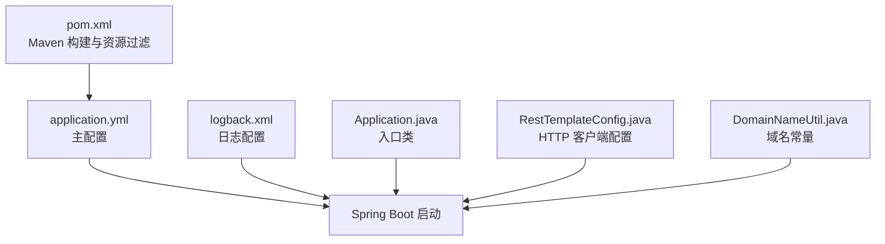
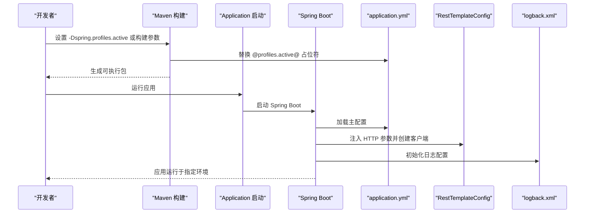
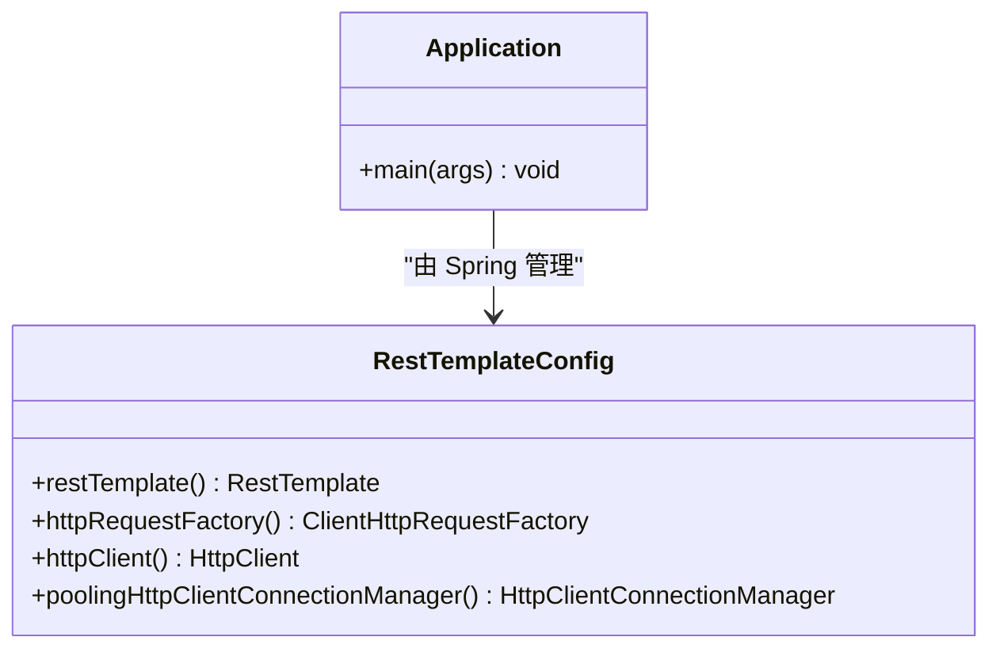
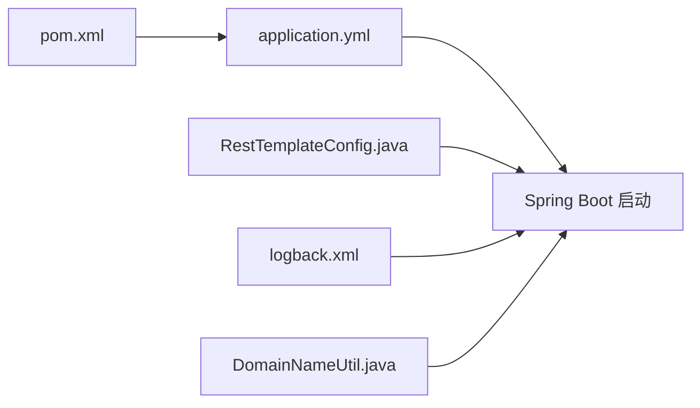

# 环境配置管理

<cite>
**本文引用的文件**
- [application.yml](file://src/main/resources/application.yml)
- [logback.xml](file://src/main/resources/logback.xml)
- [pom.xml](file://pom.xml)
- [Application.java](file://src/main/java/com/Application.java)
- [RestTemplateConfig.java](file://src/main/java/com/commom/RestTemplateConfig.java)
- [DomainNameUtil.java](file://src/main/java/com/utils/DomainNameUtil.java)
</cite>

## 目录
1. [简介](#简介)
2. [项目结构](#项目结构)
3. [核心组件](#核心组件)
4. [架构总览](#架构总览)
5. [详细组件分析](#详细组件分析)
6. [依赖关系分析](#依赖关系分析)
7. [性能考量](#性能考量)
8. [故障排查指南](#故障排查指南)
9. [结论](#结论)
10. [附录](#附录)

## 简介
本指南围绕多环境配置管理展开，结合当前仓库中的 Spring Boot 配置现状，系统阐述开发、测试与生产环境的差异化配置策略，明确配置文件优先级与覆盖机制，提供环境变量设置方法（含 JAVA_OPTS 与应用特定变量），说明域名与服务器地址的动态切换思路，并给出配置热更新与重新加载的可行方案与实用技巧。由于当前仓库未包含 application-dev.yml、application-test.yml、application-prod.yml 等环境配置文件，本文将基于现有 application.yml 与 Maven 构建特性，提供可落地的实施建议与最佳实践。

## 项目结构
项目采用标准 Spring Boot 结构，核心配置位于 resources 目录：
- application.yml：主配置文件，定义服务器端口、上下文路径、应用名称以及通过占位符激活的环境配置。
- logback.xml：日志配置，支持按级别滚动输出与控制台输出。
- pom.xml：Maven 构建配置，启用资源过滤与 Spring Boot 插件，使用占位符替换 profiles.active。

图表来源
- [application.yml](file://src/main/resources/application.yml#L1-L31)
- [logback.xml](file://src/main/resources/logback.xml#L1-L75)
- [pom.xml](file://pom.xml#L114-L159)
- [Application.java](file://src/main/java/com/Application.java#L1-L14)
- [RestTemplateConfig.java](file://src/main/java/com/commom/RestTemplateConfig.java#L1-L131)
- [DomainNameUtil.java](file://src/main/java/com/utils/DomainNameUtil.java#L1-L16)

章节来源
- [application.yml](file://src/main/resources/application.yml#L1-L31)
- [logback.xml](file://src/main/resources/logback.xml#L1-L75)
- [pom.xml](file://pom.xml#L114-L159)
- [Application.java](file://src/main/java/com/Application.java#L1-L14)

## 核心组件
- 主配置文件 application.yml
  - 定义 Tomcat 服务器端口与上下文路径。
  - 定义 Spring 应用名称与通过占位符激活的环境配置。
  - 定义 HTTP 客户端连接池相关参数，供 RestTemplateConfig 注入使用。
- 日志配置 logback.xml
  - 支持扫描与自动重载，便于在不同环境下调整日志策略。
  - 分别输出 INFO 与 ERROR 到独立文件，便于问题定位。
- Maven 构建与资源过滤
  - 启用资源过滤，使 application.yml 中的占位符可被构建阶段替换。
  - Spring Boot 插件用于打包与运行。

章节来源
- [application.yml](file://src/main/resources/application.yml#L1-L31)
- [logback.xml](file://src/main/resources/logback.xml#L1-L75)
- [pom.xml](file://pom.xml#L114-L159)

## 架构总览
下图展示配置在启动流程中的作用与交互关系，突出 application.yml 的占位符激活机制与 HTTP 客户端配置注入。

图表来源
- [application.yml](file://src/main/resources/application.yml#L12-L14)
- [pom.xml](file://pom.xml#L116-L121)
- [RestTemplateConfig.java](file://src/main/java/com/commom/RestTemplateConfig.java#L35-L54)
- [logback.xml](file://src/main/resources/logback.xml#L1-L75)

## 详细组件分析

### 主配置文件 application.yml
- 服务器配置：定义端口与上下文路径，便于在不同环境隔离部署。
- Spring 配置：应用名称与环境激活占位符，通过 Maven 资源过滤替换。
- HTTP 客户端参数：最大连接数、并发路由数、超时时间等，供 RestTemplateConfig 注入使用。

章节来源
- [application.yml](file://src/main/resources/application.yml#L1-L31)

### 日志配置 logback.xml
- 扫描与重载：开启 scan 与 scanPeriod，便于在不重启应用的情况下调整日志策略。
- 输出策略：INFO 与 ERROR 分离输出，便于问题定位与容量控制。
- 模块与框架日志：对特定包与框架设置日志级别，平衡可观测性与性能。

章节来源
- [logback.xml](file://src/main/resources/logback.xml#L1-L75)

### Maven 构建与资源过滤
- 资源过滤：启用 filtering，使 application.yml 中的占位符可被构建阶段替换。
- Spring Boot 插件：用于打包与运行，简化部署流程。
- 环境激活：通过 -Dspring.profiles.active 或构建参数传入占位符值。

章节来源
- [pom.xml](file://pom.xml#L114-L159)

### HTTP 客户端配置 RestTemplateConfig
- 参数注入：通过 @Value 注解从 application.yml 注入 HTTP 参数。
- 连接池与超时：基于 Apache HttpClient，统一配置连接池大小、超时与重试策略。
- Bean 定义：提供 RestTemplate、ClientHttpRequestFactory 与 HttpClient Bean。

图表来源
- [RestTemplateConfig.java](file://src/main/java/com/commom/RestTemplateConfig.java#L33-L131)
- [Application.java](file://src/main/java/com/Application.java#L1-L14)

章节来源
- [RestTemplateConfig.java](file://src/main/java/com/commom/RestTemplateConfig.java#L1-L131)

### 域名与服务器地址管理
- 当前实现：DomainNameUtil 中定义了域名数组与中转地址数组，但内容为空，可用于后续扩展。
- 动态切换思路：可通过环境变量或配置文件项注入域名列表，结合轮询或权重策略进行动态切换。

章节来源
- [DomainNameUtil.java](file://src/main/java/com/utils/DomainNameUtil.java#L1-L16)

## 依赖关系分析
- application.yml 与 Maven 资源过滤耦合：通过占位符激活环境，需在构建阶段正确传参。
- RestTemplateConfig 与 application.yml 强耦合：HTTP 参数直接来源于配置文件。
- logback.xml 与运行时日志策略：通过扫描与重载实现动态调整。

图表来源
- [application.yml](file://src/main/resources/application.yml#L1-L31)
- [pom.xml](file://pom.xml#L114-L159)
- [RestTemplateConfig.java](file://src/main/java/com/commom/RestTemplateConfig.java#L33-L131)
- [logback.xml](file://src/main/resources/logback.xml#L1-L75)
- [DomainNameUtil.java](file://src/main/java/com/utils/DomainNameUtil.java#L1-L16)

章节来源
- [application.yml](file://src/main/resources/application.yml#L1-L31)
- [pom.xml](file://pom.xml#L114-L159)
- [RestTemplateConfig.java](file://src/main/java/com/commom/RestTemplateConfig.java#L1-L131)
- [logback.xml](file://src/main/resources/logback.xml#L1-L75)
- [DomainNameUtil.java](file://src/main/java/com/utils/DomainNameUtil.java#L1-L16)

## 性能考量
- HTTP 客户端参数：合理设置连接池大小与超时时间，避免在高并发场景下出现连接阻塞或频繁重试。
- 日志级别：在生产环境适当提高日志级别，减少 IO 压力；同时保留必要的错误日志以便快速定位问题。
- 配置热更新：利用 logback.xml 的扫描与重载能力，减少因日志策略变更导致的应用重启。

## 故障排查指南
- 环境激活失败
  - 症状：应用未按预期加载目标环境配置。
  - 排查要点：确认 Maven 构建时是否正确传入 -Dspring.profiles.active；检查 application.yml 中占位符是否被替换。
  - 参考路径
    - [application.yml](file://src/main/resources/application.yml#L12-L14)
    - [pom.xml](file://pom.xml#L116-L121)
- HTTP 客户端异常
  - 症状：请求超时、连接池耗尽或连接复用异常。
  - 排查要点：核对 application.yml 中 HTTP 参数与 RestTemplateConfig 注入值；检查连接池大小与超时设置是否合理。
  - 参考路径
    - [application.yml](file://src/main/resources/application.yml#L16-L30)
    - [RestTemplateConfig.java](file://src/main/java/com/commom/RestTemplateConfig.java#L35-L54)
- 日志输出异常
  - 症状：日志未输出或输出路径不正确。
  - 排查要点：确认 logback.xml 的扫描与重载配置；检查日志路径与权限；核对日志级别过滤规则。
  - 参考路径
    - [logback.xml](file://src/main/resources/logback.xml#L1-L75)

## 结论
当前仓库已具备通过占位符激活环境的基础能力，并在 HTTP 客户端与日志方面提供了良好的可配置性。为完善多环境配置管理，建议补充 application-dev.yml、application-test.yml、application-prod.yml 等环境配置文件，并在 CI/CD 流程中规范地传递 -Dspring.profiles.active 与相关环境变量，确保配置优先级与覆盖机制清晰可控。同时，结合域名与服务器地址的动态切换机制，以及日志的热更新能力，可显著提升运维效率与问题定位速度。

## 附录

### 多环境配置模板建议
- application-dev.yml（开发环境）
  - 特点：开启调试日志、较低的超时阈值、本地数据库与服务地址。
  - 建议字段示例：日志级别、数据库连接、服务端点、调试开关。
- application-test.yml（测试环境）
  - 特点：模拟数据、中间件地址、适中的超时与重试策略。
  - 建议字段示例：测试数据库、第三方服务地址、限流与熔断配置。
- application-prod.yml（生产环境）
  - 特点：严格的日志级别、稳健的超时与重试、安全加固与监控集成。
  - 建议字段示例：生产数据库、外部服务地址、健康检查与指标暴露。

### 配置优先级与覆盖机制
- 命令行参数优先级最高，可覆盖所有配置源。
- 环境变量次之，如 JAVA_OPTS、SPRING_APPLICATION_JSON 等。
- 配置文件按以下顺序加载（后加载覆盖先前）：
  1) application-{profile}.yml
  2) application.yml
  3) 默认属性（如 spring.profiles.default）
- Maven 资源过滤：通过占位符替换实现环境激活，需在构建阶段正确传参。

### 环境变量设置方法
- JAVA_OPTS：用于 JVM 参数与 Spring 配置（如 -Dspring.profiles.active）。
- 应用特定变量：通过 -Dkey=value 或环境变量 KEY=VALUE 方式传入，供 application.yml 中的占位符使用。
- CI/CD 集成：在流水线中设置环境变量与构建参数，确保不同环境使用正确的配置文件与激活参数。

### 域名配置与服务器地址动态切换
- 当前实现：DomainNameUtil 中预留域名数组，便于后续扩展。
- 实施建议：将域名列表与中转地址通过配置文件或环境变量注入，结合轮询或权重策略实现动态切换。
- 注意事项：确保域名解析与网络连通性，避免因域名切换导致请求失败。

### 配置热更新与重新加载
- 日志配置热更新：logback.xml 开启扫描与重载，可在不重启应用的情况下调整日志策略。
- 配置文件热更新：Spring Cloud Config 或自定义监听器可实现配置文件变更后的刷新。
- HTTP 客户端参数：若需动态调整连接池与超时参数，建议通过外部化配置中心或管理接口进行动态刷新。

### 配置验证与错误排查实用技巧
- 启动参数验证：通过 -Dspring.profiles.active 明确指定环境，避免默认或空激活导致的配置缺失。
- 日志级别验证：在开发与测试环境使用更详细的日志级别，在生产环境使用更严格的级别。
- 连接池参数验证：结合压测与监控，验证连接池大小与超时设置是否合理。
- 环境变量验证：在 CI/CD 中增加配置校验步骤，确保占位符被正确替换且无遗漏。