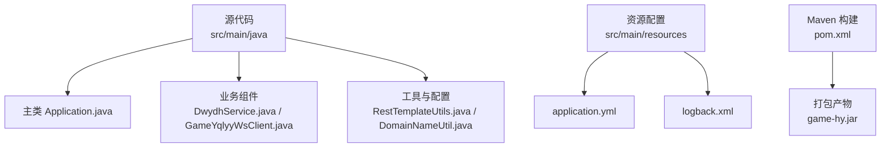
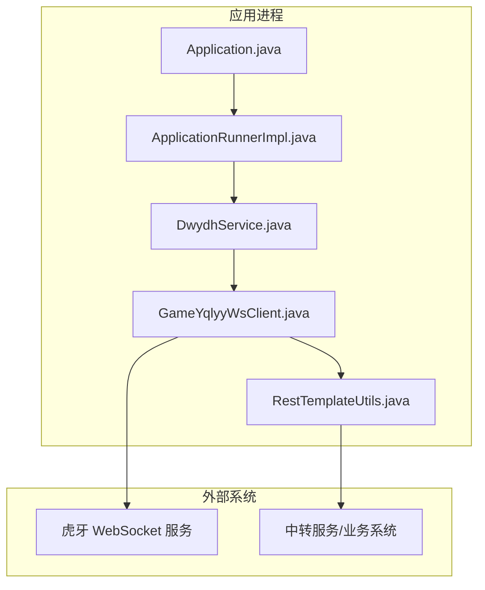
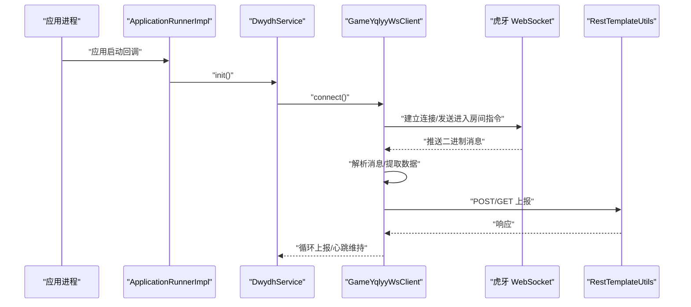
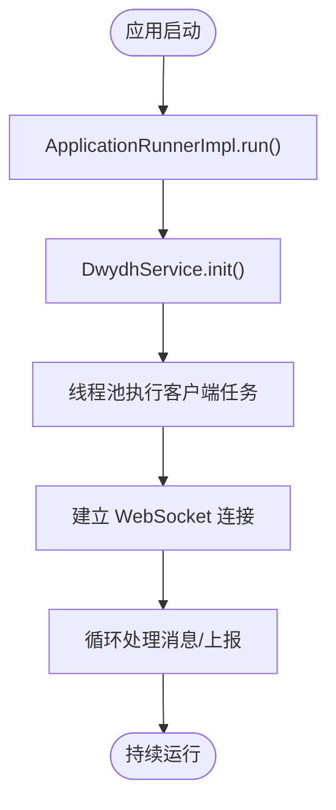
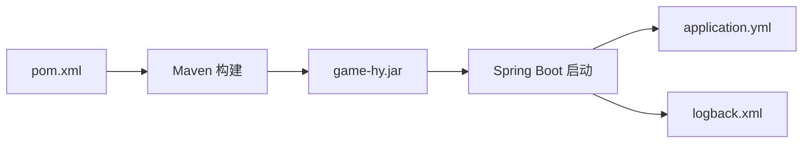

# 部署流程

<cite>
**本文引用的文件**
- [pom.xml](file://pom.xml)
- [application.yml](file://src/main/resources/application.yml)
- [logback.xml](file://src/main/resources/logback.xml)
- [Application.java](file://src/main/java/com/Application.java)
- [ApplicationRunnerImpl.java](file://src/main/java/com/listener/ApplicationRunnerImpl.java)
- [DwydhService.java](file://src/main/java/com/dwydh/DwydhService.java)
- [GameYqlyyWsClient.java](file://src/main/java/com/yqlyy/GameYqlyyWsClient.java)
- [RestTemplateUtils.java](file://src/main/java/com/commom/RestTemplateUtils.java)
- [DomainNameUtil.java](file://src/main/java/com/utils/DomainNameUtil.java)
</cite>

## 目录
1. [简介](#简介)
2. [项目结构](#项目结构)
3. [核心组件](#核心组件)
4. [架构总览](#架构总览)
5. [详细组件分析](#详细组件分析)
6. [依赖关系分析](#依赖关系分析)
7. [性能与资源规划](#性能与资源规划)
8. [部署方式与步骤](#部署方式与步骤)
9. [配置与环境变量](#配置与环境变量)
10. [启动与停止流程](#启动与停止流程)
11. [部署验证与检查清单](#部署验证与检查清单)
12. [回滚与应急恢复](#回滚与应急恢复)
13. [多环境最佳实践](#多环境最佳实践)
14. [故障排查指南](#故障排查指南)
15. [结论](#结论)

## 简介
本操作手册面向运维与开发团队，提供从源码编译到服务启动与运行维护的完整部署指南。内容覆盖 Maven 编译与打包、传统 JAR 包部署、Docker 容器化部署以及 Kubernetes 集群部署三种方式；同时给出配置文件修改、环境变量设置、启动停止流程、部署验证方法、回滚与应急恢复策略，以及多环境（开发/测试/生产）差异化配置的最佳实践。

## 项目结构
该工程为基于 Spring Boot 的 Java 应用，使用 Maven 构建，采用标准目录组织方式：
- 源代码位于 src/main/java，资源位于 src/main/resources
- 核心入口为 Application 类
- 配置文件 application.yml 控制端口、上下文路径、HTTP 客户端参数与激活的 Profile
- 日志通过 logback.xml 配置，输出至控制台与滚动文件，并按级别过滤

**图表来源**
- [Application.java](file://src/main/java/com/Application.java#L1-L14)
- [pom.xml](file://pom.xml#L114-L156)
- [application.yml](file://src/main/resources/application.yml#L1-L31)
- [logback.xml](file://src/main/resources/logback.xml#L1-L75)

**章节来源**
- [pom.xml](file://pom.xml#L1-L160)
- [application.yml](file://src/main/resources/application.yml#L1-L31)
- [logback.xml](file://src/main/resources/logback.xml#L1-L75)
- [Application.java](file://src/main/java/com/Application.java#L1-L14)

## 核心组件
- 应用入口与启动
  - 主类负责启动 Spring Boot 应用，作为所有功能的入口点
- 应用启动钩子
  - ApplicationRunnerImpl 在应用启动后初始化 DwydhService，触发 WebSocket 客户端连接与数据上报任务
- 业务服务
  - DwydhService 通过线程池调度 GameYqlyyWsClient，周期性上报与处理来自虎牙 WebSocket 的消息
- WebSocket 客户端
  - GameYqlyyWsClient 负责建立与虎牙 WebSocket 的连接、发送心跳与进入房间指令、解析二进制消息并转发给下游服务
- HTTP 工具
  - RestTemplateUtils 封装 RestTemplate，提供 GET/POST/exchange 方法，用于向中转服务或业务系统上报数据
- 域名与中转地址
  - DomainNameUtil 定义下游业务系统的地址数组与中转服务地址数组，便于集中管理

**章节来源**
- [Application.java](file://src/main/java/com/Application.java#L1-L14)
- [ApplicationRunnerImpl.java](file://src/main/java/com/listener/ApplicationRunnerImpl.java#L1-L34)
- [DwydhService.java](file://src/main/java/com/dwydh/DwydhService.java#L1-L39)
- [GameYqlyyWsClient.java](file://src/main/java/com/yqlyy/GameYqlyyWsClient.java#L1-L328)
- [RestTemplateUtils.java](file://src/main/java/com/commom/RestTemplateUtils.java#L1-L31)
- [DomainNameUtil.java](file://src/main/java/com/utils/DomainNameUtil.java#L1-L16)

## 架构总览
应用采用“Spring Boot + WebSocket 客户端 + HTTP 上报”的轻量级架构。启动阶段由 ApplicationRunnerImpl 触发业务初始化；业务层通过 WebSocket 接收实时数据，解析后通过 RestTemplateUtils 上报至中转或业务系统。

**图表来源**
- [Application.java](file://src/main/java/com/Application.java#L1-L14)
- [ApplicationRunnerImpl.java](file://src/main/java/com/listener/ApplicationRunnerImpl.java#L1-L34)
- [DwydhService.java](file://src/main/java/com/dwydh/DwydhService.java#L1-L39)
- [GameYqlyyWsClient.java](file://src/main/java/com/yqlyy/GameYqlyyWsClient.java#L1-L328)
- [RestTemplateUtils.java](file://src/main/java/com/commom/RestTemplateUtils.java#L1-L31)

## 详细组件分析

### 组件 A：WebSocket 客户端与消息处理
- 功能要点
  - 建立与虎牙 WebSocket 的连接，发送进入房间等二进制指令
  - 处理服务端推送的二进制消息，解析不同 iUri 对应的游戏事件
  - 将开奖信息与游戏时间同步请求转发至中转或业务系统
- 关键流程（序列图）

**图表来源**
- [ApplicationRunnerImpl.java](file://src/main/java/com/listener/ApplicationRunnerImpl.java#L25-L31)
- [DwydhService.java](file://src/main/java/com/dwydh/DwydhService.java#L21-L36)
- [GameYqlyyWsClient.java](file://src/main/java/com/yqlyy/GameYqlyyWsClient.java#L221-L290)
- [RestTemplateUtils.java](file://src/main/java/com/commom/RestTemplateUtils.java#L19-L29)

**章节来源**
- [GameYqlyyWsClient.java](file://src/main/java/com/yqlyy/GameYqlyyWsClient.java#L1-L328)
- [RestTemplateUtils.java](file://src/main/java/com/commom/RestTemplateUtils.java#L1-L31)

### 组件 B：启动与初始化流程（ApplicationRunner）
- 流程说明
  - 应用启动后，ApplicationRunnerImpl 执行 run 方法，调用 DwydhService.init()
  - 初始化在独立线程中启动 WebSocket 客户端，进入无限循环上报与处理逻辑
- 流程图

**图表来源**
- [ApplicationRunnerImpl.java](file://src/main/java/com/listener/ApplicationRunnerImpl.java#L25-L31)
- [DwydhService.java](file://src/main/java/com/dwydh/DwydhService.java#L21-L36)

**章节来源**
- [ApplicationRunnerImpl.java](file://src/main/java/com/listener/ApplicationRunnerImpl.java#L1-L34)
- [DwydhService.java](file://src/main/java/com/dwydh/DwydhService.java#L1-L39)

## 依赖关系分析
- 构建与打包
  - 使用 Maven 插件完成编译、资源过滤与打包，最终生成 game-hy.jar
- 运行时依赖
  - Spring Boot Web Starter、Netty、WebSocket 客户端、HTTP 客户端、日志框架等
- 运行参数
  - 通过 application.yml 设置端口、上下文路径、HTTP 客户端超时与并发参数
  - 通过 Profiles 激活不同环境配置

**图表来源**
- [pom.xml](file://pom.xml#L114-L156)
- [application.yml](file://src/main/resources/application.yml#L1-L31)
- [logback.xml](file://src/main/resources/logback.xml#L1-L75)

**章节来源**
- [pom.xml](file://pom.xml#L1-L160)
- [application.yml](file://src/main/resources/application.yml#L1-L31)
- [logback.xml](file://src/main/resources/logback.xml#L1-L75)

## 性能与资源规划
- 端口与上下文
  - 默认端口与上下文路径在 application.yml 中定义，建议在不同环境分别配置
- HTTP 客户端参数
  - 最大连接数、每路由最大并发、连接超时、请求超时、套接字超时等参数可在 application.yml 中调整
- 日志策略
  - 控制台与文件双通道输出，按级别过滤，避免生产环境日志风暴
- 线程与任务
  - WebSocket 与上报逻辑在独立线程中运行，建议结合线程池大小与队列长度评估资源占用

**章节来源**
- [application.yml](file://src/main/resources/application.yml#L16-L31)
- [logback.xml](file://src/main/resources/logback.xml#L1-L75)
- [DwydhService.java](file://src/main/java/com/dwydh/DwydhService.java#L14-L36)

## 部署方式与步骤

### 一、传统 JAR 包部署
- 步骤
  1) 源码编译与打包
     - 使用 Maven 清理并编译，执行打包插件生成 game-hy.jar
  2) 准备运行环境
     - 安装 JDK 1.8 或兼容版本
     - 准备 application.yml 与 logback.xml（可随 jar 一起放置于 resources 目录或外部配置）
  3) 启动应用
     - 使用 java -jar 启动，或配置 systemd/systemv 启动脚本
  4) 验证
     - 查看日志确认 WebSocket 连接成功与消息上报
- 注意事项
  - 确保网络可访问虎牙 WebSocket 与下游中转/业务系统
  - 如需切换环境，通过 Profiles 或环境变量激活对应配置

**章节来源**
- [pom.xml](file://pom.xml#L142-L153)
- [application.yml](file://src/main/resources/application.yml#L12-L14)
- [Application.java](file://src/main/java/com/Application.java#L8-L11)

### 二、Docker 容器化部署
- Dockerfile 示例思路（概念性说明）
  - 基础镜像：官方 JDK 运行时镜像
  - 复制 game-hy.jar 至镜像内
  - 暴露端口与上下文路径
  - 设置 JVM 参数与环境变量
  - 启动命令：java -jar /app/game-hy.jar
- 运行示例
  - docker run -d --name tiger-teeth -p 8021:8021 -v /path/to/config:/config tiger-teeth:latest
- 配置挂载
  - 将 application.yml 与 logback.xml 挂载为卷，便于热更新或环境隔离

**章节来源**
- [pom.xml](file://pom.xml#L114-L156)
- [application.yml](file://src/main/resources/application.yml#L1-L31)
- [logback.xml](file://src/main/resources/logback.xml#L1-L75)

### 三、Kubernetes 集群部署
- 建议组件
  - Deployment：管理副本与滚动升级
  - Service：暴露端口与上下文路径
  - ConfigMap：挂载 application.yml 与 logback.xml
  - Secret：敏感配置（如下游地址、密钥等）
- 部署流程
  1) 构建镜像并推送到仓库
  2) 创建 ConfigMap 与 Secret
  3) 应用 Deployment 与 Service
  4) 配置健康检查与探针
  5) 滚动更新与回滚
- 滚动更新策略
  - 设置 maxUnavailable 与 maxSurge，确保平滑升级

**章节来源**
- [pom.xml](file://pom.xml#L114-L156)
- [application.yml](file://src/main/resources/application.yml#L1-L31)
- [logback.xml](file://src/main/resources/logback.xml#L1-L75)

## 配置与环境变量
- application.yml 关键项
  - server.port：服务端口
  - server.servlet.context-path：上下文路径
  - spring.profiles.active：激活的 Profile（可通过 Maven 属性或环境变量覆盖）
  - http.*：HTTP 客户端连接池与超时参数
- 日志配置
  - log.path：日志输出目录
  - log.pattern：日志格式
  - 控制台与文件输出、级别过滤
- 环境变量与 Profile
  - 可通过 -Dspring.profiles.active 或环境变量 SPRING_PROFILES_ACTIVE 指定
  - 不同环境（dev/test/prod）建议使用不同 Profile，集中管理差异化配置

**章节来源**
- [application.yml](file://src/main/resources/application.yml#L1-L31)
- [logback.xml](file://src/main/resources/logback.xml#L1-L75)

## 启动与停止流程
- 启动流程
  1) 启动前检查
     - 确认端口未被占用、网络可达、配置文件正确
  2) 启动命令
     - java -jar game-hy.jar --spring.profiles.active=prod
  3) 观察日志
     - 确认 WebSocket 连接成功、首次上报完成
- 停止流程
  1) 平滑停止
     - 发送 SIGTERM 或使用进程管理器优雅关闭
  2) 强制停止（仅在必要时）
     - 发送 SIGKILL，但可能中断当前任务

**章节来源**
- [Application.java](file://src/main/java/com/Application.java#L8-L11)
- [ApplicationRunnerImpl.java](file://src/main/java/com/listener/ApplicationRunnerImpl.java#L25-L31)

## 部署验证与检查清单
- 基础验证
  - 端口监听：netstat/ss 检查 8021 是否监听
  - 进程状态：ps 或 systemctl 查看进程
- 功能验证
  - 日志中出现 WebSocket 连接成功与消息上报记录
  - 下游中转/业务系统收到开奖与时间同步请求
- 配置验证
  - 确认激活的 Profile 与期望一致
  - HTTP 超时与并发参数符合预期

**章节来源**
- [application.yml](file://src/main/resources/application.yml#L1-L31)
- [logback.xml](file://src/main/resources/logback.xml#L1-L75)

## 回滚与应急恢复
- 回滚策略
  - 记录每次发布版本号与构建号
  - 使用滚动更新的回滚能力（Kubernetes）
  - 若为 JAR 包部署，保留上一个版本的 game-hy.jar
- 应急恢复
  - 快速拉起新实例，恢复配置与网络连通
  - 临时禁用高风险功能（如 WebSocket），优先保证系统可用
  - 通过日志与监控定位问题根因

**章节来源**
- [pom.xml](file://pom.xml#L114-L156)

## 多环境最佳实践
- 开发环境（dev）
  - 端口与上下文路径可灵活调整
  - 日志级别设为 DEBUG，便于问题定位
- 测试环境（test）
  - 使用独立的 Profile，连接测试中转服务
  - 限制并发与超时参数，模拟真实负载
- 生产环境（prod）
  - 固定端口与上下文路径
  - 日志级别设为 INFO，开启文件滚动
  - 启用健康检查与告警，配置只读配置与最小权限

**章节来源**
- [application.yml](file://src/main/resources/application.yml#L1-L31)
- [logback.xml](file://src/main/resources/logback.xml#L1-L75)

## 故障排查指南
- WebSocket 连接失败
  - 检查网络连通性与代理设置
  - 查看日志中的异常堆栈与错误码
- 上报失败
  - 检查下游服务地址是否正确（DomainNameUtil）
  - 核对 HTTP 超时与并发参数
- 日志过多或过大
  - 调整 logback.xml 的级别与滚动策略
- 启动无响应
  - 检查端口占用与 JVM 参数
  - 查看启动日志中的异常

**章节来源**
- [GameYqlyyWsClient.java](file://src/main/java/com/yqlyy/GameYqlyyWsClient.java#L240-L272)
- [RestTemplateUtils.java](file://src/main/java/com/commom/RestTemplateUtils.java#L19-L29)
- [DomainNameUtil.java](file://src/main/java/com/utils/DomainNameUtil.java#L1-L16)
- [logback.xml](file://src/main/resources/logback.xml#L1-L75)

## 结论
本文提供了从源码到运行的全链路部署指南，涵盖传统 JAR 包、Docker 与 Kubernetes 三种部署形态，并结合配置管理、启动停止、验证检查、回滚应急与多环境最佳实践，帮助团队稳定高效地交付与运维该应用。