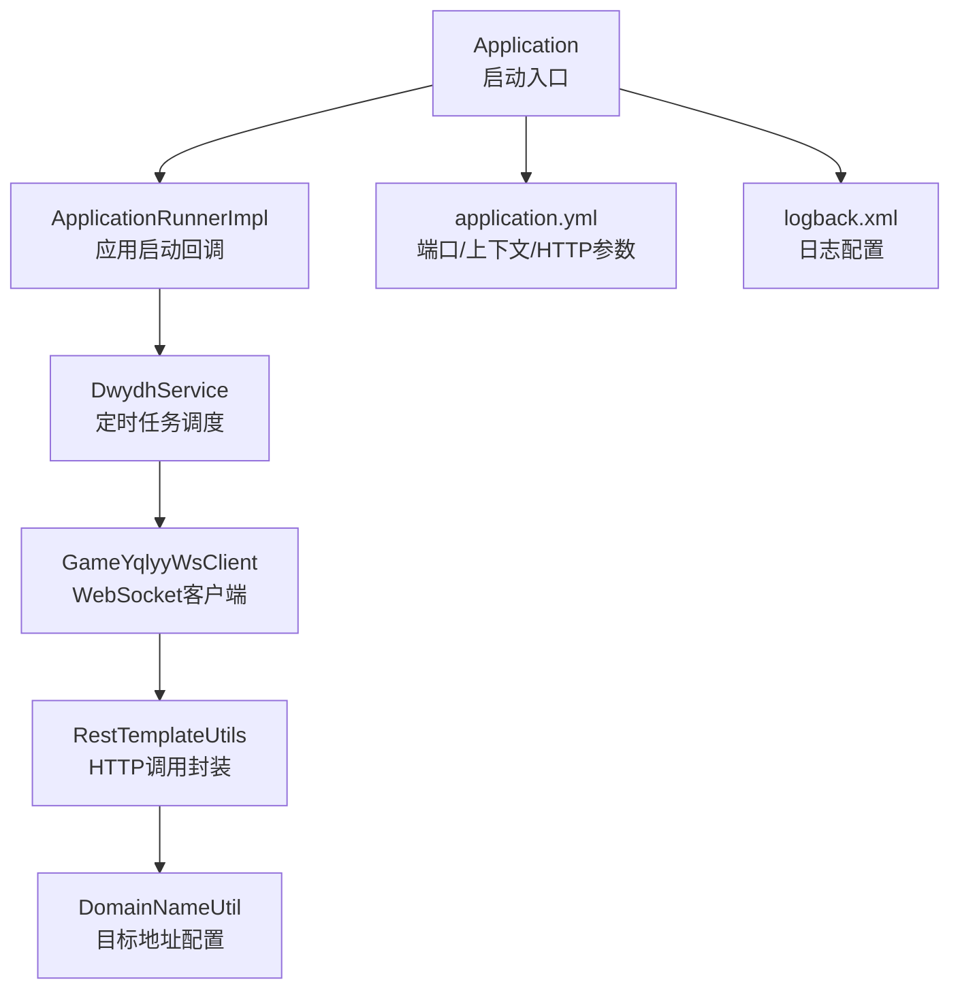
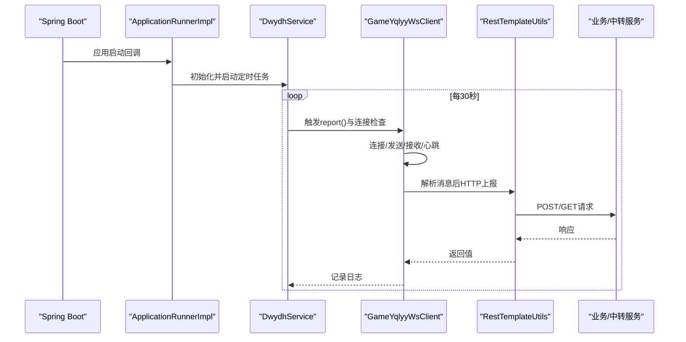
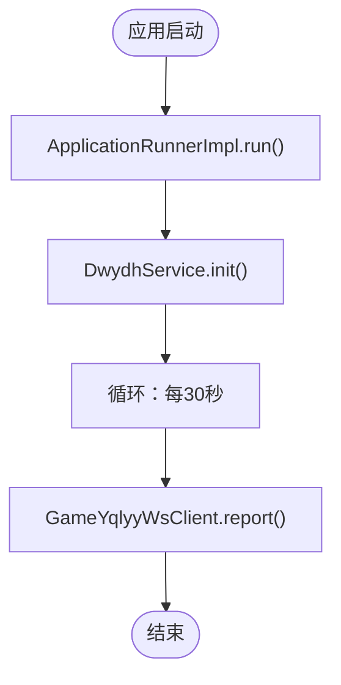
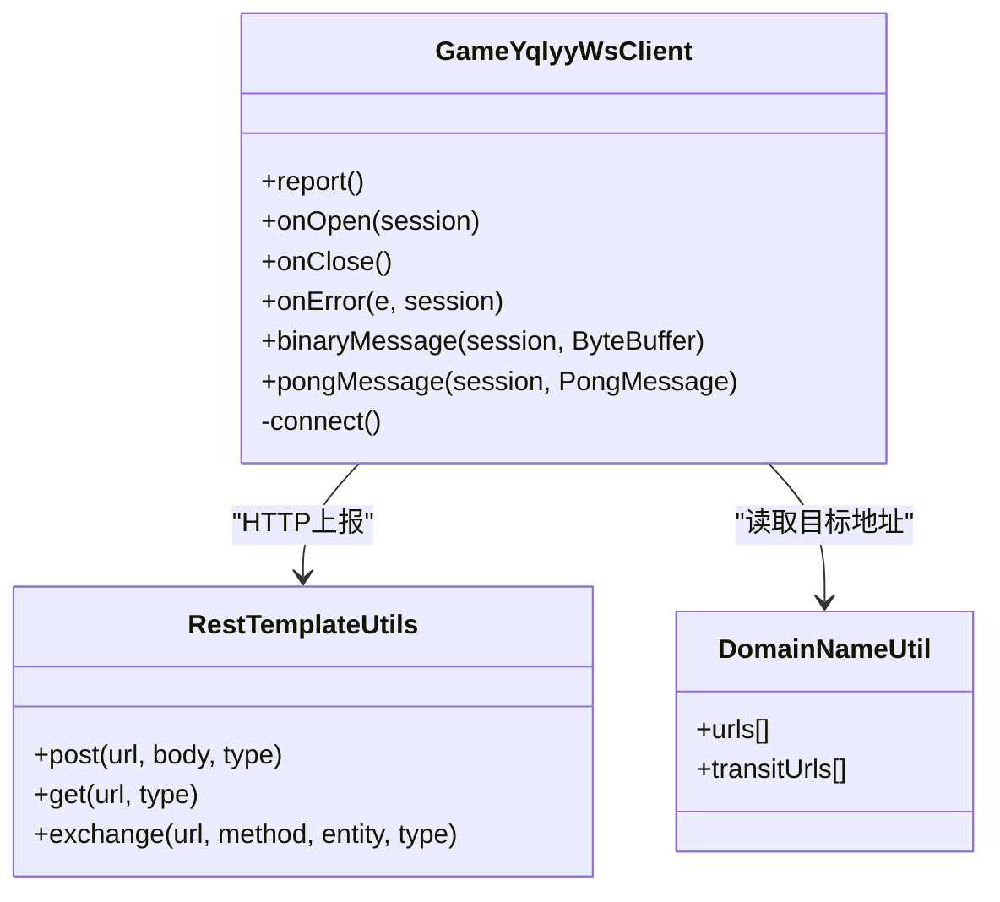
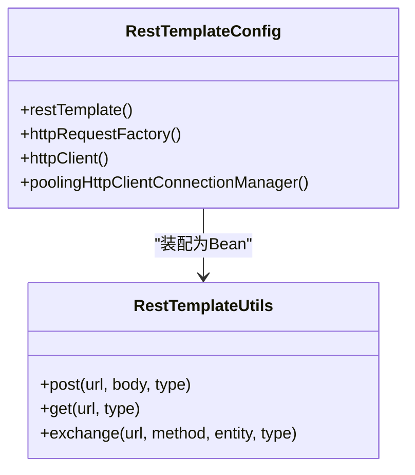
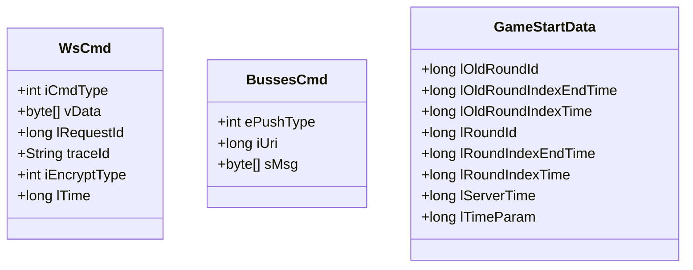
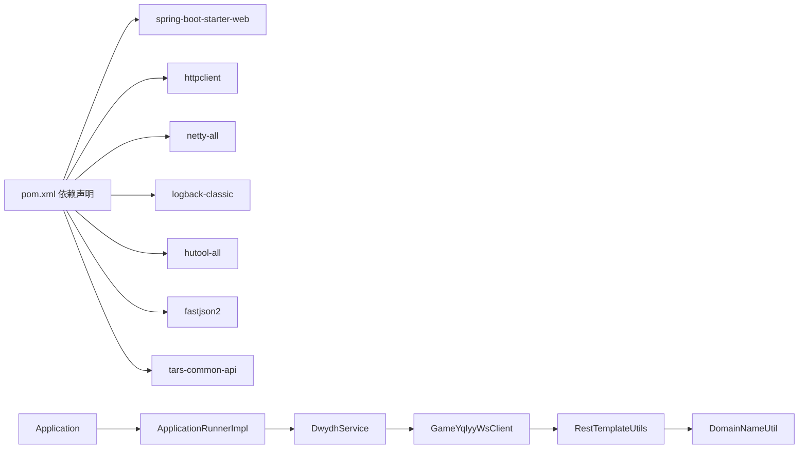

# 部署验证与监控

<cite>
**本文引用的文件**
- [Application.java](file://src/main/java/com/Application.java)
- [application.yml](file://src/main/resources/application.yml)
- [logback.xml](file://src/main/resources/logback.xml)
- [pom.xml](file://pom.xml)
- [RestTemplateConfig.java](file://src/main/java/com/commom/RestTemplateConfig.java)
- [RestTemplateUtils.java](file://src/main/java/com/commom/RestTemplateUtils.java)
- [DwydhService.java](file://src/main/java/com/dwydh/DwydhService.java)
- [GameYqlyyWsClient.java](file://src/main/java/com/yqlyy/GameYqlyyWsClient.java)
- [ApplicationRunnerImpl.java](file://src/main/java/com/listener/ApplicationRunnerImpl.java)
- [DomainNameUtil.java](file://src/main/java/com/utils/DomainNameUtil.java)
- [BussesCmd.java](file://src/main/java/com/entity/BussesCmd.java)
- [GameStartData.java](file://src/main/java/com/entity/GameStartData.java)
- [WsCmd.java](file://src/main/java/com/entity/WsCmd.java)
</cite>

## 目录
1. [简介](#简介)
2. [项目结构](#项目结构)
3. [核心组件](#核心组件)
4. [架构总览](#架构总览)
5. [详细组件分析](#详细组件分析)
6. [依赖关系分析](#依赖关系分析)
7. [性能考虑](#性能考虑)
8. [故障排查指南](#故障排查指南)
9. [结论](#结论)
10. [附录](#附录)

## 简介
本操作手册面向部署与运维人员，提供服务启动后的部署验证与监控完整方案。内容涵盖：
- 服务启动后验证步骤：端口监听检查、WebSocket连接状态确认、HTTP接口可用性测试
- 关键指标监控：CPU、内存、网络连接数、业务指标
- 日志监控与告警：日志聚合与异常告警配置建议
- 性能基准测试：压力与负载测试执行步骤
- 故障排查：常见问题诊断与解决流程
- 健康检查与自动恢复：健康检查与自愈机制配置建议

## 项目结构
该工程为基于 Spring Boot 的 Java 应用，主要模块如下：
- 启动入口：Application
- 配置：application.yml（Tomcat端口、上下文路径、HTTP连接池参数）
- 日志：logback.xml（控制台与文件滚动日志）
- 依赖：pom.xml（Spring Web、WebSocket、HTTP客户端、Netty等）
- 业务逻辑：
  - ApplicationRunnerImpl：应用启动后初始化任务
  - DwydhService：定时上报与WebSocket客户端管理
  - GameYqlyyWsClient：WebSocket客户端，处理二进制消息与业务推送
  - RestTemplateConfig/RestTemplateUtils：HTTP客户端配置与封装
  - DomainNameUtil：目标服务地址配置（业务方地址、中转地址）
  - 实体类：BussesCmd、GameStartData、WsCmd（消息解析模型）

图表来源
- [Application.java](file://src/main/java/com/Application.java#L1-L14)
- [ApplicationRunnerImpl.java](file://src/main/java/com/listener/ApplicationRunnerImpl.java#L1-L34)
- [DwydhService.java](file://src/main/java/com/dwydh/DwydhService.java#L1-L39)
- [GameYqlyyWsClient.java](file://src/main/java/com/yqlyy/GameYqlyyWsClient.java#L1-L328)
- [RestTemplateUtils.java](file://src/main/java/com/commom/RestTemplateUtils.java#L1-L31)
- [DomainNameUtil.java](file://src/main/java/com/utils/DomainNameUtil.java#L1-L16)
- [application.yml](file://src/main/resources/application.yml#L1-L31)
- [logback.xml](file://src/main/resources/logback.xml#L1-L75)

章节来源
- [Application.java](file://src/main/java/com/Application.java#L1-L14)
- [application.yml](file://src/main/resources/application.yml#L1-L31)
- [logback.xml](file://src/main/resources/logback.xml#L1-L75)
- [pom.xml](file://pom.xml#L1-L160)

## 核心组件
- 启动与初始化
  - Application：Spring Boot 启动入口
  - ApplicationRunnerImpl：应用启动后执行初始化任务，启动 DwydhService
- WebSocket 业务
  - DwydhService：通过线程池定时触发 GameYqlyyWsClient 报告与连接维护
  - GameYqlyyWsClient：WebSocket 客户端，处理二进制消息、心跳、错误与重连
- HTTP 通信
  - RestTemplateConfig：基于 Apache HttpClient 的连接池与超时配置
  - RestTemplateUtils：对 RestTemplate 的封装，提供 GET/POST/exchange
- 配置与日志
  - application.yml：Tomcat 端口、上下文路径、HTTP 连接池参数
  - logback.xml：控制台与文件滚动日志，按级别过滤

章节来源
- [Application.java](file://src/main/java/com/Application.java#L1-L14)
- [ApplicationRunnerImpl.java](file://src/main/java/com/listener/ApplicationRunnerImpl.java#L1-L34)
- [DwydhService.java](file://src/main/java/com/dwydh/DwydhService.java#L1-L39)
- [GameYqlyyWsClient.java](file://src/main/java/com/yqlyy/GameYqlyyWsClient.java#L1-L328)
- [RestTemplateConfig.java](file://src/main/java/com/commom/RestTemplateConfig.java#L1-L132)
- [RestTemplateUtils.java](file://src/main/java/com/commom/RestTemplateUtils.java#L1-L31)
- [application.yml](file://src/main/resources/application.yml#L1-L31)
- [logback.xml](file://src/main/resources/logback.xml#L1-L75)

## 架构总览
系统由 Spring Boot 应用承载，启动后通过 ApplicationRunnerImpl 初始化 WebSocket 客户端，周期性上报并接收业务推送；同时通过 HTTP 客户端向业务方或中转服务上报数据。

图表来源
- [ApplicationRunnerImpl.java](file://src/main/java/com/listener/ApplicationRunnerImpl.java#L1-L34)
- [DwydhService.java](file://src/main/java/com/dwydh/DwydhService.java#L1-L39)
- [GameYqlyyWsClient.java](file://src/main/java/com/yqlyy/GameYqlyyWsClient.java#L1-L328)
- [RestTemplateUtils.java](file://src/main/java/com/commom/RestTemplateUtils.java#L1-L31)

## 详细组件分析

### 启动与初始化
- Application：标准 Spring Boot 启动入口
- ApplicationRunnerImpl：在应用启动完成后执行初始化逻辑，启动 DwydhService
- DwydhService：使用线程池执行定时任务，周期性创建 GameYqlyyWsClient 并调用 report()

图表来源
- [ApplicationRunnerImpl.java](file://src/main/java/com/listener/ApplicationRunnerImpl.java#L1-L34)
- [DwydhService.java](file://src/main/java/com/dwydh/DwydhService.java#L1-L39)

章节来源
- [Application.java](file://src/main/java/com/Application.java#L1-L14)
- [ApplicationRunnerImpl.java](file://src/main/java/com/listener/ApplicationRunnerImpl.java#L1-L34)
- [DwydhService.java](file://src/main/java/com/dwydh/DwydhService.java#L1-L39)

### WebSocket 客户端（GameYqlyyWsClient）
- 连接与重连：默认最大文本/二进制缓冲、会话空闲超时、异步发送超时；若 session 为空或关闭则重新连接
- 消息处理：二进制消息解析，根据 iUri 分发处理不同业务（如开奖、游戏开始时间同步）
- 上报：进入游戏时发送特定二进制消息
- 错误处理：OnClose/OnError 记录日志，异常时尝试重连

图表来源
- [GameYqlyyWsClient.java](file://src/main/java/com/yqlyy/GameYqlyyWsClient.java#L1-L328)
- [RestTemplateUtils.java](file://src/main/java/com/commom/RestTemplateUtils.java#L1-L31)
- [DomainNameUtil.java](file://src/main/java/com/utils/DomainNameUtil.java#L1-L16)

章节来源
- [GameYqlyyWsClient.java](file://src/main/java/com/yqlyy/GameYqlyyWsClient.java#L1-L328)
- [DomainNameUtil.java](file://src/main/java/com/utils/DomainNameUtil.java#L1-L16)

### HTTP 客户端（RestTemplateConfig/RestTemplateUtils）
- RestTemplateConfig：基于 Apache HttpClient 的连接池配置，支持最大连接数、并发路由、超时、连接有效性校验、Keep-Alive 策略与重试
- RestTemplateUtils：封装 GET/POST/exchange，供业务侧直接使用

图表来源
- [RestTemplateConfig.java](file://src/main/java/com/commom/RestTemplateConfig.java#L1-L132)
- [RestTemplateUtils.java](file://src/main/java/com/commom/RestTemplateUtils.java#L1-L31)

章节来源
- [RestTemplateConfig.java](file://src/main/java/com/commom/RestTemplateConfig.java#L1-L132)
- [RestTemplateUtils.java](file://src/main/java/com/commom/RestTemplateUtils.java#L1-L31)

### 数据模型（实体类）
- WsCmd：WebSocket 命令头信息
- BussesCmd：业务推送命令结构
- GameStartData：游戏开始相关时间字段

图表来源
- [WsCmd.java](file://src/main/java/com/entity/WsCmd.java#L1-L69)
- [BussesCmd.java](file://src/main/java/com/entity/BussesCmd.java#L1-L10)
- [GameStartData.java](file://src/main/java/com/entity/GameStartData.java#L1-L79)

章节来源
- [WsCmd.java](file://src/main/java/com/entity/WsCmd.java#L1-L69)
- [BussesCmd.java](file://src/main/java/com/entity/BussesCmd.java#L1-L10)
- [GameStartData.java](file://src/main/java/com/entity/GameStartData.java#L1-L79)

## 依赖关系分析
- 外部依赖：Spring Web、WebSocket 客户端、Apache HttpClient、Netty、Logback、Hutool、FastJSON2、TARS 协议支持
- 内部依赖：ApplicationRunnerImpl -> DwydhService -> GameYqlyyWsClient -> RestTemplateUtils -> DomainNameUtil

图表来源
- [pom.xml](file://pom.xml#L1-L160)
- [Application.java](file://src/main/java/com/Application.java#L1-L14)
- [ApplicationRunnerImpl.java](file://src/main/java/com/listener/ApplicationRunnerImpl.java#L1-L34)
- [DwydhService.java](file://src/main/java/com/dwydh/DwydhService.java#L1-L39)
- [GameYqlyyWsClient.java](file://src/main/java/com/yqlyy/GameYqlyyWsClient.java#L1-L328)
- [RestTemplateUtils.java](file://src/main/java/com/commom/RestTemplateUtils.java#L1-L31)
- [DomainNameUtil.java](file://src/main/java/com/utils/DomainNameUtil.java#L1-L16)

章节来源
- [pom.xml](file://pom.xml#L1-L160)

## 性能考虑
- HTTP 连接池参数（来自 application.yml）：
  - 最大连接数、并发路由、连接超时、请求超时、套接字超时、连接有效性校验、空闲重用策略
- WebSocket 参数（来自 GameYqlyyWsClient）：
  - 默认缓冲区大小、会话空闲超时、异步发送超时
- 建议：
  - 根据业务流量调整连接池上限与超时阈值
  - 监控连接池耗尽与超时情况，必要时扩容
  - 对高频上报场景评估线程池大小与任务频率

章节来源
- [application.yml](file://src/main/resources/application.yml#L16-L31)
- [RestTemplateConfig.java](file://src/main/java/com/commom/RestTemplateConfig.java#L1-L132)
- [GameYqlyyWsClient.java](file://src/main/java/com/yqlyy/GameYqlyyWsClient.java#L250-L272)

## 故障排查指南

### 一、服务启动后验证步骤
- 端口监听检查
  - 检查端口与上下文路径：服务端口与上下文路径来源于 application.yml
  - 使用 netstat/ss 或系统自带工具确认端口监听状态
- WebSocket 连接状态确认
  - 观察日志中 WebSocket 的 onOpen/onClose/onError 记录
  - 若出现异常或频繁重连，检查网络连通性、代理与证书
- HTTP 接口可用性测试
  - 使用 curl 或浏览器访问上下文路径下的接口（如 /tigerTeeth/...），验证返回状态码与响应

章节来源
- [application.yml](file://src/main/resources/application.yml#L1-L31)
- [logback.xml](file://src/main/resources/logback.xml#L1-L75)
- [GameYqlyyWsClient.java](file://src/main/java/com/yqlyy/GameYqlyyWsClient.java#L221-L248)

### 二、关键指标监控
- CPU 使用率与内存占用
  - 使用系统监控工具（如 top/htop、jstat/jconsole、Prometheus+Grafana）采集进程级指标
- 网络连接数
  - 通过 ss/netstat 查看 ESTABLISHED/TIME_WAIT 状态连接数
- 业务指标
  - WebSocket 消息到达与处理次数、HTTP 请求成功率与延迟
  - 可在 GameYqlyyWsClient 中增加计数器与埋点，结合日志统计

章节来源
- [GameYqlyyWsClient.java](file://src/main/java/com/yqlyy/GameYqlyyWsClient.java#L1-L328)
- [RestTemplateUtils.java](file://src/main/java/com/commom/RestTemplateUtils.java#L1-L31)

### 三、日志监控与告警
- 日志配置
  - 控制台输出与文件滚动日志，按级别过滤（INFO/ERROR）
- 建议
  - 将日志接入集中式日志系统（如 ELK/Fluentd/Graylog）
  - 设置异常级别告警（ERROR/WARN），并配置日志轮转与保留策略

章节来源
- [logback.xml](file://src/main/resources/logback.xml#L1-L75)

### 四、性能基准测试
- 工具与方法
  - 压力测试：使用 JMeter/Locust/ab，模拟高并发 WebSocket 连接与消息上报
  - 负载测试：逐步提升并发与消息速率，观察 CPU/内存/连接池耗尽与延迟变化
- 执行步骤
  - 准备测试脚本与目标地址（注意区分业务方地址与中转地址）
  - 先进行小规模预热，再逐步放大
  - 记录吞吐量、P95/P99 延迟、错误率与资源占用

章节来源
- [RestTemplateConfig.java](file://src/main/java/com/commom/RestTemplateConfig.java#L1-L132)
- [DomainNameUtil.java](file://src/main/java/com/utils/DomainNameUtil.java#L1-L16)

### 五、健康检查与自动恢复
- 健康检查
  - 在应用内暴露健康端点（Spring Boot Actuator），检查端口、上下文、WebSocket 连接状态
- 自动恢复
  - WebSocket 断线自动重连（已在客户端实现）
  - HTTP 请求异常时重试与降级（可结合熔断器）
  - 进程级自启：通过 systemd/systemd 或容器编排实现自动拉起

章节来源
- [GameYqlyyWsClient.java](file://src/main/java/com/yqlyy/GameYqlyyWsClient.java#L250-L272)
- [RestTemplateConfig.java](file://src/main/java/com/commom/RestTemplateConfig.java#L1-L132)

## 结论
本操作手册提供了从部署验证到监控告警、性能测试与故障排查的完整流程。建议在生产环境中：
- 明确端口与上下文路径，确保防火墙放行
- 配置集中化日志与告警，覆盖 ERROR/WARN
- 基于业务流量优化连接池与超时参数
- 建立健康检查与自动恢复机制，保障服务连续性

## 附录

### A. 部署验证清单
- 端口监听：确认端口与上下文路径
- WebSocket：观察 onOpen/onClose/onError 日志
- HTTP：访问上下文路径下的接口，验证响应
- 日志：确认 INFO/ERROR 日志输出正常

章节来源
- [application.yml](file://src/main/resources/application.yml#L1-L31)
- [logback.xml](file://src/main/resources/logback.xml#L1-L75)
- [GameYqlyyWsClient.java](file://src/main/java/com/yqlyy/GameYqlyyWsClient.java#L221-L248)

### B. 监控指标建议
- 进程级：CPU、内存、GC、线程数
- 网络：连接数、带宽、丢包
- 业务：WebSocket 消息处理速率、HTTP 请求成功率与延迟

章节来源
- [GameYqlyyWsClient.java](file://src/main/java/com/yqlyy/GameYqlyyWsClient.java#L1-L328)
- [RestTemplateUtils.java](file://src/main/java/com/commom/RestTemplateUtils.java#L1-L31)

### C. 告警配置建议
- 日志级别：ERROR/WARN 告警
- 连接池：超时/耗尽告警
- WebSocket：断线/重连次数告警
- HTTP：请求失败率/延迟告警

章节来源
- [logback.xml](file://src/main/resources/logback.xml#L1-L75)
- [RestTemplateConfig.java](file://src/main/java/com/commom/RestTemplateConfig.java#L1-L132)
- [GameYqlyyWsClient.java](file://src/main/java/com/yqlyy/GameYqlyyWsClient.java#L250-L272)