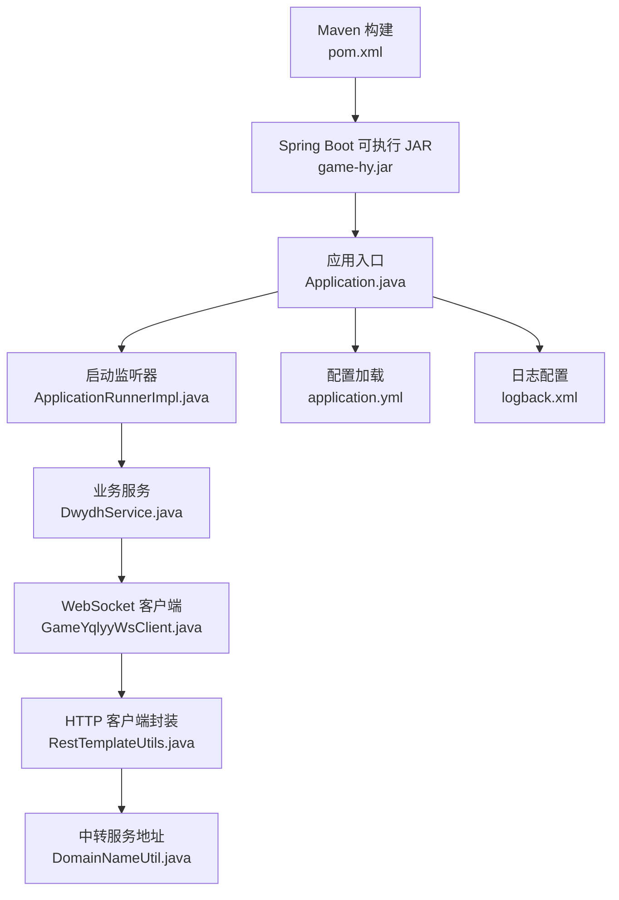
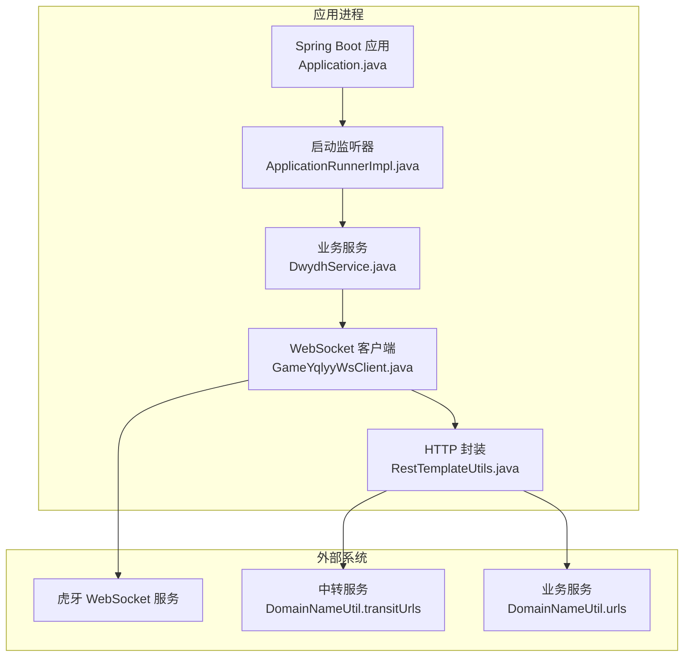
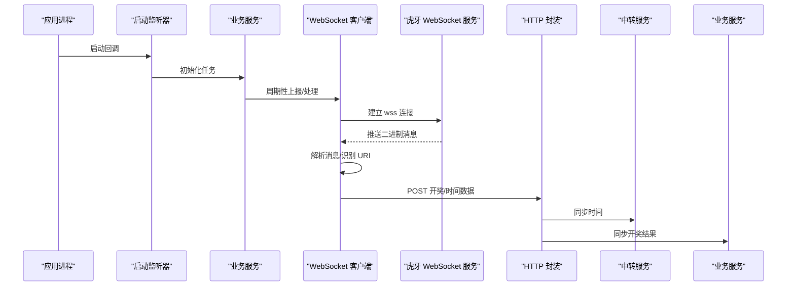
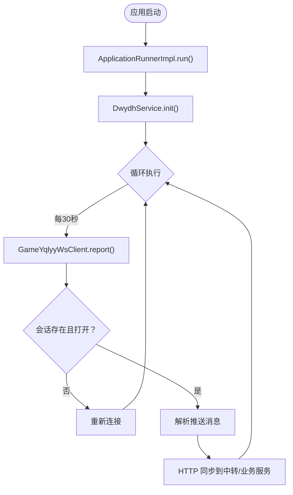
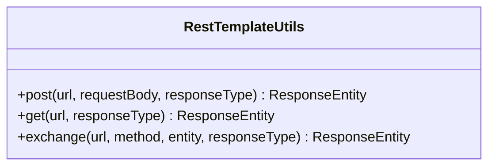
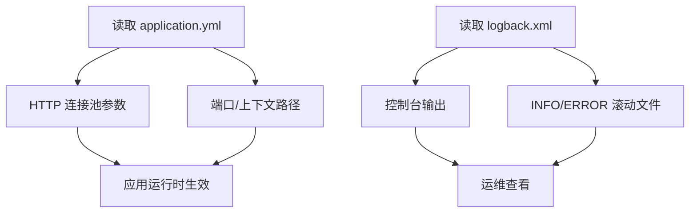
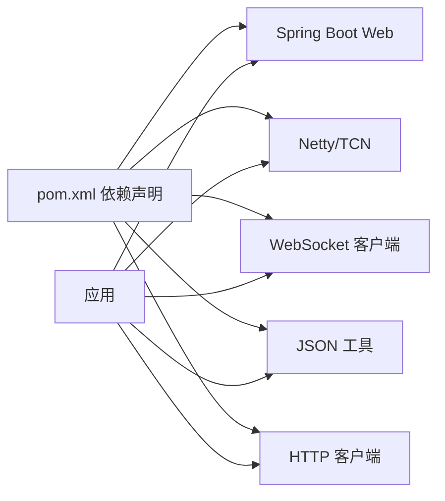

# 部署运维

<cite>
**本文引用的文件**
- [pom.xml](file://pom.xml)
- [application.yml](file://src/main/resources/application.yml)
- [logback.xml](file://src/main/resources/logback.xml)
- [Application.java](file://src/main/java/com/Application.java)
- [ApplicationRunnerImpl.java](file://src/main/java/com/listener/ApplicationRunnerImpl.java)
- [DwydhService.java](file://src/main/java/com/dwydh/DwydhService.java)
- [GameYqlyyWsClient.java](file://src/main/java/com/yqlyy/GameYqlyyWsClient.java)
- [RestTemplateUtils.java](file://src/main/java/com/commom/RestTemplateUtils.java)
- [DomainNameUtil.java](file://src/main/java/com/utils/DomainNameUtil.java)
- [OpenTreasureHunter.java](file://src/main/java/com/entity/AccountedNotify/OpenTreasureHunter.java)
</cite>

## 目录
1. [简介](#简介)
2. [项目结构](#项目结构)
3. [核心组件](#核心组件)
4. [架构总览](#架构总览)
5. [详细组件分析](#详细组件分析)
6. [依赖分析](#依赖分析)
7. [性能考虑](#性能考虑)
8. [故障排查指南](#故障排查指南)
9. [结论](#结论)
10. [附录](#附录)

## 简介
本指南面向生产环境的部署与运维，覆盖硬件与系统要求、网络配置、编译打包、服务启动、容器化与Kubernetes部署、监控与告警、故障排查、备份与灾备、版本升级与回滚、自动化脚本与工具、以及安全加固与合规建议。本项目为基于Spring Boot的Java应用，通过WebSocket订阅虎牙游戏推送，并将开奖结果与时间同步至中转服务。

## 项目结构
- 构建与打包：使用Maven，最终产物为可执行JAR（Spring Boot插件），应用名为“game-hy”。
- 运行入口：Spring Boot主类负责启动Web容器与应用上下文。
- 启动后任务：通过ApplicationRunner在应用启动后初始化WebSocket客户端并持续上报与处理消息。
- 日志：Logback配置控制台与滚动文件输出，按级别分发INFO与ERROR日志。

图表来源
- [pom.xml](file://pom.xml#L114-L156)
- [Application.java](file://src/main/java/com/Application.java#L8-L13)
- [ApplicationRunnerImpl.java](file://src/main/java/com/listener/ApplicationRunnerImpl.java#L21-L33)
- [DwydhService.java](file://src/main/java/com/dwydh/DwydhService.java#L14-L38)
- [GameYqlyyWsClient.java](file://src/main/java/com/yqlyy/GameYqlyyWsClient.java#L29-L44)
- [RestTemplateUtils.java](file://src/main/java/com/commom/RestTemplateUtils.java#L14-L30)
- [DomainNameUtil.java](file://src/main/java/com/utils/DomainNameUtil.java#L3-L15)
- [application.yml](file://src/main/resources/application.yml#L1-L31)
- [logback.xml](file://src/main/resources/logback.xml#L1-L75)

章节来源
- [pom.xml](file://pom.xml#L114-L156)
- [Application.java](file://src/main/java/com/Application.java#L8-L13)
- [application.yml](file://src/main/resources/application.yml#L1-L31)
- [logback.xml](file://src/main/resources/logback.xml#L1-L75)

## 核心组件
- 应用入口与启动
  - 主类负责启动Spring Boot应用，加载配置与注册Bean。
- 启动后任务
  - ApplicationRunnerImpl在应用启动完成后初始化DwydhService。
- 业务服务
  - DwydhService使用线程池定期驱动WebSocket客户端上报与处理消息。
- WebSocket客户端
  - GameYqlyyWsClient负责建立wss连接、发送进入房间消息、解析二进制推送并转发给中转服务。
- HTTP客户端封装
  - RestTemplateUtils封装GET/POST/exchange，统一异常处理。
- 地址配置
  - DomainNameUtil集中管理目标服务地址数组，transitUrls用于中转服务，urls用于业务服务。
- 配置与日志
  - application.yml定义端口、上下文路径、HTTP连接池参数；logback.xml定义日志滚动与级别过滤。

章节来源
- [Application.java](file://src/main/java/com/Application.java#L8-L13)
- [ApplicationRunnerImpl.java](file://src/main/java/com/listener/ApplicationRunnerImpl.java#L21-L33)
- [DwydhService.java](file://src/main/java/com/dwydh/DwydhService.java#L14-L38)
- [GameYqlyyWsClient.java](file://src/main/java/com/yqlyy/GameYqlyyWsClient.java#L29-L44)
- [RestTemplateUtils.java](file://src/main/java/com/commom/RestTemplateUtils.java#L14-L30)
- [DomainNameUtil.java](file://src/main/java/com/utils/DomainNameUtil.java#L3-L15)
- [application.yml](file://src/main/resources/application.yml#L1-L31)
- [logback.xml](file://src/main/resources/logback.xml#L1-L75)

## 架构总览
应用采用“Spring Boot + WebSocket + HTTP中转”的轻量级架构。WebSocket用于实时接收游戏推送，HTTP用于将开奖结果与时间同步至中转服务。

图表来源
- [Application.java](file://src/main/java/com/Application.java#L8-L13)
- [ApplicationRunnerImpl.java](file://src/main/java/com/listener/ApplicationRunnerImpl.java#L21-L33)
- [DwydhService.java](file://src/main/java/com/dwydh/DwydhService.java#L14-L38)
- [GameYqlyyWsClient.java](file://src/main/java/com/yqlyy/GameYqlyyWsClient.java#L29-L44)
- [RestTemplateUtils.java](file://src/main/java/com/commom/RestTemplateUtils.java#L14-L30)
- [DomainNameUtil.java](file://src/main/java/com/utils/DomainNameUtil.java#L3-L15)

## 详细组件分析

### 组件A：WebSocket客户端与消息处理
- 功能要点
  - 建立wss连接，发送进入房间消息。
  - 解析二进制推送，识别不同URI事件（如开奖结果、游戏开始时间等）。
  - 将结果通过HTTP POST转发至中转服务与业务服务。
- 关键流程

图表来源
- [ApplicationRunnerImpl.java](file://src/main/java/com/listener/ApplicationRunnerImpl.java#L25-L31)
- [DwydhService.java](file://src/main/java/com/dwydh/DwydhService.java#L21-L36)
- [GameYqlyyWsClient.java](file://src/main/java/com/yqlyy/GameYqlyyWsClient.java#L221-L290)
- [RestTemplateUtils.java](file://src/main/java/com/commom/RestTemplateUtils.java#L19-L29)
- [DomainNameUtil.java](file://src/main/java/com/utils/DomainNameUtil.java#L10-L13)

章节来源
- [GameYqlyyWsClient.java](file://src/main/java/com/yqlyy/GameYqlyyWsClient.java#L29-L44)
- [GameYqlyyWsClient.java](file://src/main/java/com/yqlyy/GameYqlyyWsClient.java#L221-L290)
- [RestTemplateUtils.java](file://src/main/java/com/commom/RestTemplateUtils.java#L14-L30)
- [DomainNameUtil.java](file://src/main/java/com/utils/DomainNameUtil.java#L3-L15)

### 组件B：启动与初始化流程
- 启动顺序
  - Spring Boot启动 → ApplicationRunnerImpl.run → DwydhService.init → 启动WebSocket客户端循环。
- 关键点
  - 线程池执行器由Spring注入，避免阻塞主线程。
  - WebSocket客户端具备自动重连逻辑（会话关闭时重建）。

图表来源
- [ApplicationRunnerImpl.java](file://src/main/java/com/listener/ApplicationRunnerImpl.java#L25-L31)
- [DwydhService.java](file://src/main/java/com/dwydh/DwydhService.java#L21-L36)
- [GameYqlyyWsClient.java](file://src/main/java/com/yqlyy/GameYqlyyWsClient.java#L274-L290)

章节来源
- [ApplicationRunnerImpl.java](file://src/main/java/com/listener/ApplicationRunnerImpl.java#L21-L33)
- [DwydhService.java](file://src/main/java/com/dwydh/DwydhService.java#L14-L38)

### 组件C：HTTP客户端封装
- 功能要点
  - 统一封装GET/POST/exchange，返回ResponseEntity。
  - 异常统一捕获，便于上层处理。
- 复杂度
  - O(1)调用开销，依赖RestTemplate线程模型。

图表来源
- [RestTemplateUtils.java](file://src/main/java/com/commom/RestTemplateUtils.java#L14-L30)

章节来源
- [RestTemplateUtils.java](file://src/main/java/com/commom/RestTemplateUtils.java#L14-L30)

### 组件D：配置与日志
- application.yml
  - 定义Tomcat端口、上下文路径、HTTP连接池参数（最大连接数、并发、超时等）。
- logback.xml
  - 控制台输出与INFO/ERROR滚动文件输出，按级别过滤，保留60天历史。

图表来源
- [application.yml](file://src/main/resources/application.yml#L1-L31)
- [logback.xml](file://src/main/resources/logback.xml#L1-L75)

章节来源
- [application.yml](file://src/main/resources/application.yml#L1-L31)
- [logback.xml](file://src/main/resources/logback.xml#L1-L75)

## 依赖分析
- 构建与运行时依赖
  - Spring Boot Web Starter、Netty、WebSocket客户端、JSON工具、HTTP客户端等。
- 运行时耦合
  - 应用通过RestTemplateUtils间接依赖HTTP客户端实现；WebSocket客户端依赖TARS协议解析与Huya推送。
- 外部集成
  - 中转服务与业务服务地址通过DomainNameUtil集中管理，便于切换与灰度。

图表来源
- [pom.xml](file://pom.xml#L26-L111)

章节来源
- [pom.xml](file://pom.xml#L26-L111)

## 性能考虑
- 线程模型
  - 使用线程池执行WebSocket任务，避免阻塞Spring主线程。
- WebSocket缓冲与超时
  - 客户端设置了默认消息缓冲大小与会话超时，有助于稳定长连接。
- HTTP连接池
  - application.yml中配置了连接池上限与超时，需结合实际QPS调整以避免排队与超时。
- 日志滚动
  - INFO/ERROR分离滚动，减少IO争用，建议生产环境开启异步日志以进一步降低延迟。

章节来源
- [DwydhService.java](file://src/main/java/com/dwydh/DwydhService.java#L17-L18)
- [GameYqlyyWsClient.java](file://src/main/java/com/yqlyy/GameYqlyyWsClient.java#L250-L272)
- [application.yml](file://src/main/resources/application.yml#L16-L31)
- [logback.xml](file://src/main/resources/logback.xml#L16-L73)

## 故障排查指南
- 启动与端口
  - 确认端口未被占用，上下文路径正确。
- WebSocket连接
  - 观察日志中“链接关闭/异常”信息，确认wss地址有效性与网络可达性。
- HTTP同步失败
  - 检查中转服务与业务服务地址是否正确配置，关注RestClientException与异常堆栈。
- 日志定位
  - 查看INFO/ERROR滚动文件，定位异常发生的时间点与调用链。
- 网络诊断
  - 使用ping/traceroute检测到Huya与中转服务的连通性；必要时抓包分析WebSocket握手与消息格式。
- 性能调优
  - 根据QPS调整HTTP连接池参数与WebSocket缓冲大小；评估线程池大小与任务队列长度。

章节来源
- [GameYqlyyWsClient.java](file://src/main/java/com/yqlyy/GameYqlyyWsClient.java#L240-L248)
- [RestTemplateUtils.java](file://src/main/java/com/commom/RestTemplateUtils.java#L19-L29)
- [logback.xml](file://src/main/resources/logback.xml#L16-L73)

## 结论
本项目以轻量方式实现了虎牙WebSocket推送的采集与转发，具备清晰的启动流程、稳定的连接管理与统一的HTTP封装。生产部署应重点关注网络连通性、HTTP连接池参数、日志滚动与异步化、以及中转服务的高可用与限流策略。

## 附录

### A. 生产环境部署要求
- 硬件资源
  - CPU：建议至少2核以上，根据并发与消息处理复杂度动态扩容。
  - 内存：建议不低于2GB，GC与线程池配置需结合实际负载调整。
  - 存储：日志目录磁盘空间建议预留至少10GB，按滚动策略保留60天。
- 操作系统
  - Linux（CentOS/RHEL/Ubuntu）内核建议启用TCP优化参数，确保epoll支持。
- 网络配置
  - 出站访问：允许访问虎牙WebSocket域名与中转/业务服务域名。
  - 端口：开放应用端口（默认8021），防火墙放行对应范围。
- Java运行时
  - JDK 8（项目属性指定），确保时区与语言环境一致。

章节来源
- [pom.xml](file://pom.xml#L11-L18)
- [application.yml](file://src/main/resources/application.yml#L1-L31)

### B. 编译与打包
- 步骤
  - 使用Maven进行编译与打包，生成可执行JAR（最终名称game-hy）。
  - 打包后将JAR与配置文件部署至目标服务器。
- 验证
  - 启动后检查控制台与日志，确认WebSocket连接成功与HTTP同步正常。

章节来源
- [pom.xml](file://pom.xml#L114-L156)
- [Application.java](file://src/main/java/com/Application.java#L8-L13)

### C. 服务启动
- 启动命令示例
  - java -jar game-hy.jar --spring.profiles.active=prod
- 关键参数
  - spring.profiles.active：选择生产配置文件（若存在）。
  - JVM参数：建议设置-Xms1g -Xmx2g -XX:+UseG1GC，结合CPU核数与内存容量调整。

章节来源
- [application.yml](file://src/main/resources/application.yml#L12-L14)

### D. 容器化与Kubernetes部署
- Docker镜像构建
  - 基础镜像：openjdk:8-jre-alpine或官方JRE镜像。
  - 复制game-hy.jar与配置目录，设置ENTRYPOINT为java -jar。
  - 暴露应用端口，挂载日志目录。
- Kubernetes部署策略
  - Deployment：副本数≥2，滚动更新策略设置合理maxUnavailable与maxSurge。
  - Service：ClusterIP或Ingress暴露端口。
  - ConfigMap：注入application.yml与日志配置。
  - Secret：敏感配置（如密钥）通过Secret注入。
  - 健康检查：使用HTTP GET /actuator/health（如启用Actuator）。
  - 资源限制：设置requests/limits，避免资源争抢。
- 最佳实践
  - 使用只读根文件系统与非root用户运行。
  - 启用PodDisruptionBudget保障可用性。
  - 使用持久化存储保存日志目录。

### E. 监控与告警
- 指标建议
  - 连接状态：WebSocket连接数、重连次数、消息接收速率。
  - HTTP同步：请求成功率、平均/95线延迟、错误码分布。
  - 应用资源：CPU、内存、GC停顿时间、线程池队列长度。
- 告警规则示例
  - WebSocket连续重连超过阈值触发告警。
  - HTTP同步失败率超过阈值触发告警。
  - 应用CPU使用率持续高于阈值触发告警。
- 工具推荐
  - Prometheus + Grafana（Prometheus Pushgateway或Exporter）。
  - ELK/EFK（日志收集与检索）。
  - APM：SkyWalking/Jaeger（链路追踪）。

### F. 备份与灾备
- 备份策略
  - 配置文件与日志目录定期备份，保留至少7-30天。
  - 数据库（如有）按业务周期备份，验证恢复流程。
- 灾难恢复
  - 多机房部署，跨可用区容灾。
  - 快速回滚机制：保留最近3个版本的JAR与配置，一键回滚。

### G. 版本升级与回滚
- 升级流程
  - 制作新版本镜像并推送至镜像仓库。
  - 在Kubernetes中更新Deployment镜像标签，执行滚动更新。
  - 观察新实例健康状态与日志，确认无异常后结束升级。
- 回滚流程
  - 将Deployment镜像标签回退至上一版本。
  - 如需快速回滚，直接恢复上一版本的JAR与配置。

### H. 运维自动化与工具
- 自动化脚本
  - Maven打包脚本：mvn clean package -DskipTests
  - Docker构建脚本：docker build -t tiger-teeth:latest .
  - Kubernetes部署脚本：kubectl apply -f deployment.yaml
- 工具推荐
  - GitOps：ArgoCD/FluxCD
  - CI/CD：Jenkins/GitLab CI/自建流水线
  - 配置管理：Helm/ConfigMap + Secret

### I. 安全加固与合规
- 安全加固
  - 仅暴露必要端口，使用防火墙与安全组限制访问。
  - 使用只读根文件系统、非root用户运行容器。
  - 启用TLS与证书校验，避免明文传输。
  - 定期更新基础镜像与依赖，修复漏洞。
- 合规要求
  - 日志留存与审计：满足监管要求的日志保留与查询能力。
  - 数据最小化：仅采集必要数据，避免敏感信息外泄。
  - 访问控制：RBAC与最小权限原则，审计所有管理员操作。