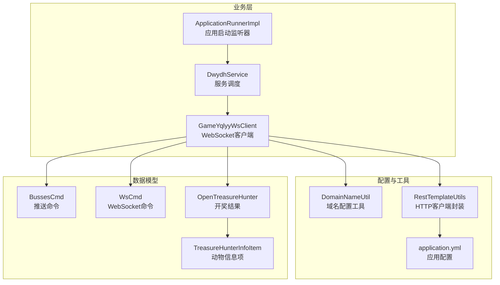
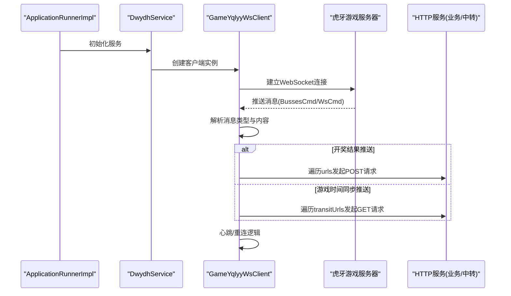
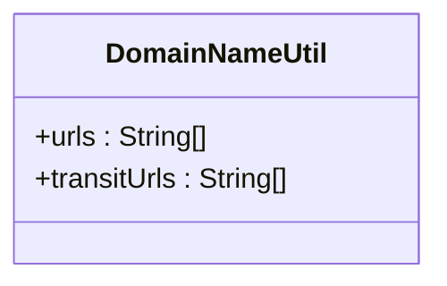
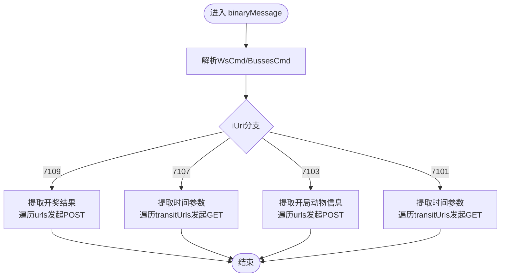
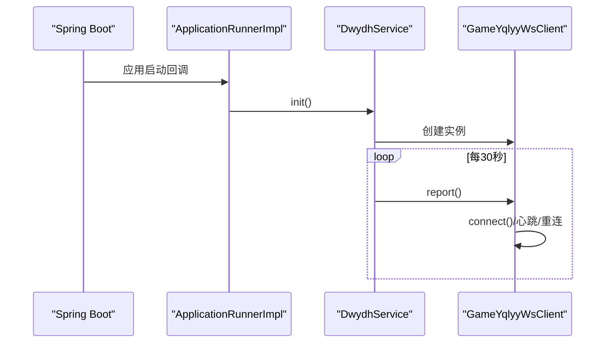
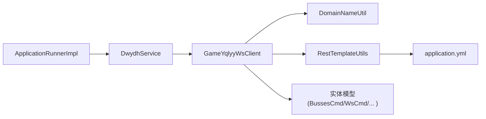

# 域名配置管理

<cite>
**本文档引用的文件**
- [DomainNameUtil.java](file://src/main/java/com/utils/DomainNameUtil.java)
- [GameYqlyyWsClient.java](file://src/main/java/com/yqlyy/GameYqlyyWsClient.java)
- [DwydhService.java](file://src/main/java/com/dwydh/DwydhService.java)
- [RestTemplateUtils.java](file://src/main/java/com/commom/RestTemplateUtils.java)
- [ApplicationRunnerImpl.java](file://src/main/java/com/listener/ApplicationRunnerImpl.java)
- [application.yml](file://src/main/resources/application.yml)
- [OpenTreasureHunter.java](file://src/main/java/com/entity/AccountedNotify/OpenTreasureHunter.java)
- [TreasureHunterInfoItem.java](file://src/main/java/com/entity/AccountedNotify/TreasureHunterInfoItem.java)
- [BussesCmd.java](file://src/main/java/com/entity/BussesCmd.java)
- [WsCmd.java](file://src/main/java/com/entity/WsCmd.java)
</cite>

## 目录
1. [简介](#简介)
2. [项目结构](#项目结构)
3. [核心组件](#核心组件)
4. [架构总览](#架构总览)
5. [详细组件分析](#详细组件分析)
6. [依赖关系分析](#依赖关系分析)
7. [性能考量](#性能考量)
8. [故障排查指南](#故障排查指南)
9. [结论](#结论)
10. [附录](#附录)

## 简介
本文件围绕域名配置管理展开，重点解释 DomainNameUtil 工具类的实现原理与域名配置机制，详细说明动态域名解析的工作流程（当前仓库中未实现动态解析）、域名缓存策略（当前仓库中未实现缓存）、域名切换逻辑（当前仓库中未实现切换）与故障转移机制（当前仓库中未实现故障转移）。同时阐述不同虎牙游戏服务器的域名配置规则与更新策略，并提供调试方法与监控手段，解释域名配置在 WebSocket 连接建立过程中的作用与影响，最后给出域名配置变更的注意事项与回滚策略。

## 项目结构
该项目采用分层与功能模块化组织：
- utils 层：存放工具类，如域名配置工具 DomainNameUtil
- yqlyy 层：存放 WebSocket 客户端 GameYqlyyWsClient，负责与虎牙游戏服务器通信
- dwydh 层：服务层 DwydhService，调度 WebSocket 客户端任务
- commom 层：通用工具 RestTemplateUtils，封装 HTTP 请求
- listener 层：应用启动监听器 ApplicationRunnerImpl，负责应用启动后初始化服务
- entity 层：消息与数据模型，如 BussesCmd、WsCmd、OpenTreasureHunter 等
- resources：Spring 配置文件 application.yml

图表来源
- [DomainNameUtil.java](file://src/main/java/com/utils/DomainNameUtil.java#L1-L16)
- [RestTemplateUtils.java](file://src/main/java/com/commom/RestTemplateUtils.java#L1-L31)
- [application.yml](file://src/main/resources/application.yml#L1-L31)
- [DwydhService.java](file://src/main/java/com/dwydh/DwydhService.java#L1-L39)
- [GameYqlyyWsClient.java](file://src/main/java/com/yqlyy/GameYqlyyWsClient.java#L1-L328)
- [ApplicationRunnerImpl.java](file://src/main/java/com/listener/ApplicationRunnerImpl.java#L1-L34)
- [BussesCmd.java](file://src/main/java/com/entity/BussesCmd.java#L1-L10)
- [WsCmd.java](file://src/main/java/com/entity/WsCmd.java#L1-L69)
- [OpenTreasureHunter.java](file://src/main/java/com/entity/AccountedNotify/OpenTreasureHunter.java#L1-L52)
- [TreasureHunterInfoItem.java](file://src/main/java/com/entity/AccountedNotify/TreasureHunterInfoItem.java#L1-L124)

章节来源
- [DomainNameUtil.java](file://src/main/java/com/utils/DomainNameUtil.java#L1-L16)
- [RestTemplateUtils.java](file://src/main/java/com/commom/RestTemplateUtils.java#L1-L31)
- [application.yml](file://src/main/resources/application.yml#L1-L31)
- [DwydhService.java](file://src/main/java/com/dwydh/DwydhService.java#L1-L39)
- [GameYqlyyWsClient.java](file://src/main/java/com/yqlyy/GameYqlyyWsClient.java#L1-L328)
- [ApplicationRunnerImpl.java](file://src/main/java/com/listener/ApplicationRunnerImpl.java#L1-L34)
- [BussesCmd.java](file://src/main/java/com/entity/BussesCmd.java#L1-L10)
- [WsCmd.java](file://src/main/java/com/entity/WsCmd.java#L1-L69)
- [OpenTreasureHunter.java](file://src/main/java/com/entity/AccountedNotify/OpenTreasureHunter.java#L1-L52)
- [TreasureHunterInfoItem.java](file://src/main/java/com/entity/AccountedNotify/TreasureHunterInfoItem.java#L1-L124)

## 核心组件
- DomainNameUtil：静态域名配置容器，包含 urls 与 transitUrls 两个数组，分别用于业务接口与中转爬虫服务器的地址列表。
- GameYqlyyWsClient：WebSocket 客户端，负责与虎牙游戏服务器建立连接、接收推送消息、根据消息类型向域名配置列表发起 HTTP 请求。
- DwydhService：服务调度器，使用线程池定期触发客户端上报与连接维护。
- RestTemplateUtils：HTTP 客户端封装，提供 GET/POST/exchange 方法。
- ApplicationRunnerImpl：应用启动监听器，在应用启动后初始化服务。
- 实体模型：BussesCmd、WsCmd、OpenTreasureHunter、TreasureHunterInfoItem 等，用于解析与处理 WebSocket 推送的数据。

章节来源
- [DomainNameUtil.java](file://src/main/java/com/utils/DomainNameUtil.java#L1-L16)
- [GameYqlyyWsClient.java](file://src/main/java/com/yqlyy/GameYqlyyWsClient.java#L1-L328)
- [DwydhService.java](file://src/main/java/com/dwydh/DwydhService.java#L1-L39)
- [RestTemplateUtils.java](file://src/main/java/com/commom/RestTemplateUtils.java#L1-L31)
- [ApplicationRunnerImpl.java](file://src/main/java/com/listener/ApplicationRunnerImpl.java#L1-L34)
- [BussesCmd.java](file://src/main/java/com/entity/BussesCmd.java#L1-L10)
- [WsCmd.java](file://src/main/java/com/entity/WsCmd.java#L1-L69)
- [OpenTreasureHunter.java](file://src/main/java/com/entity/AccountedNotify/OpenTreasureHunter.java#L1-L52)
- [TreasureHunterInfoItem.java](file://src/main/java/com/entity/AccountedNotify/TreasureHunterInfoItem.java#L1-L124)

## 架构总览
系统通过 ApplicationRunnerImpl 在应用启动后初始化 DwydhService，DwydhService 使用线程池调度 GameYqlyyWsClient 的周期性上报与连接维护。GameYqlyyWsClient 通过 WebSocket 与虎牙游戏服务器交互，当收到特定推送消息时，遍历 DomainNameUtil 中的 urls 或 transitUrls 列表，向各域名发起 HTTP 请求以同步开奖结果或时间信息。

图表来源
- [ApplicationRunnerImpl.java](file://src/main/java/com/listener/ApplicationRunnerImpl.java#L25-L31)
- [DwydhService.java](file://src/main/java/com/dwydh/DwydhService.java#L21-L36)
- [GameYqlyyWsClient.java](file://src/main/java/com/yqlyy/GameYqlyyWsClient.java#L250-L272)
- [GameYqlyyWsClient.java](file://src/main/java/com/yqlyy/GameYqlyyWsClient.java#L103-L114)
- [GameYqlyyWsClient.java](file://src/main/java/com/yqlyy/GameYqlyyWsClient.java#L136-L147)
- [GameYqlyyWsClient.java](file://src/main/java/com/yqlyy/GameYqlyyWsClient.java#L202-L213)

## 详细组件分析

### DomainNameUtil 工具类
- 角色定位：集中管理业务域名与中转域名列表，作为 HTTP 请求的目标地址来源。
- 当前实现：urls 与 transitUrls 均为空数组，实际域名需在部署时注入。
- 设计建议：为支持动态域名解析与故障转移，可在该工具类中引入：
  - 动态域名解析：从配置中心或服务发现获取域名列表
  - 域名缓存策略：缓存解析结果与健康状态，设置过期时间
  - 域名切换逻辑：按权重/优先级选择域名，支持主备切换
  - 故障转移机制：检测失败率与延迟，自动切换至备用域名

图表来源
- [DomainNameUtil.java](file://src/main/java/com/utils/DomainNameUtil.java#L3-L15)

章节来源
- [DomainNameUtil.java](file://src/main/java/com/utils/DomainNameUtil.java#L1-L16)

### GameYqlyyWsClient 组件
- WebSocket 连接：在 connect() 中通过 WebSocketContainer 建立连接，使用默认缓冲区大小与超时配置。
- 消息处理：binaryMessage() 解析二进制消息，提取 WsCmd 与 BussesCmd，根据 iUri 分支处理不同游戏事件。
- HTTP 同步：当收到开奖结果或游戏时间同步推送时，遍历 DomainNameUtil.urls 或 DomainNameUtil.transitUrls 发起 HTTP 请求。
- 重连机制：onClose/onError 中记录日志；report() 中检测 session 状态并调用 connect() 重新连接。
- WebSocket URL：当前 wsUrl 为硬编码的 wss 地址，未体现动态域名解析。

图表来源
- [GameYqlyyWsClient.java](file://src/main/java/com/yqlyy/GameYqlyyWsClient.java#L51-L218)
- [WsCmd.java](file://src/main/java/com/entity/WsCmd.java#L1-L69)
- [BussesCmd.java](file://src/main/java/com/entity/BussesCmd.java#L1-L10)
- [OpenTreasureHunter.java](file://src/main/java/com/entity/AccountedNotify/OpenTreasureHunter.java#L1-L52)
- [TreasureHunterInfoItem.java](file://src/main/java/com/entity/AccountedNotify/TreasureHunterInfoItem.java#L1-L124)

章节来源
- [GameYqlyyWsClient.java](file://src/main/java/com/yqlyy/GameYqlyyWsClient.java#L1-L328)
- [WsCmd.java](file://src/main/java/com/entity/WsCmd.java#L1-L69)
- [BussesCmd.java](file://src/main/java/com/entity/BussesCmd.java#L1-L10)
- [OpenTreasureHunter.java](file://src/main/java/com/entity/AccountedNotify/OpenTreasureHunter.java#L1-L52)
- [TreasureHunterInfoItem.java](file://src/main/java/com/entity/AccountedNotify/TreasureHunterInfoItem.java#L1-L124)

### DwydhService 与 ApplicationRunnerImpl
- DwydhService：使用线程池执行客户端循环上报任务，周期为 30 秒。
- ApplicationRunnerImpl：应用启动后调用 DwydhService.init()，确保服务在应用启动后立即运行。

图表来源
- [ApplicationRunnerImpl.java](file://src/main/java/com/listener/ApplicationRunnerImpl.java#L25-L31)
- [DwydhService.java](file://src/main/java/com/dwydh/DwydhService.java#L21-L36)
- [GameYqlyyWsClient.java](file://src/main/java/com/yqlyy/GameYqlyyWsClient.java#L274-L290)

章节来源
- [DwydhService.java](file://src/main/java/com/dwydh/DwydhService.java#L1-L39)
- [ApplicationRunnerImpl.java](file://src/main/java/com/listener/ApplicationRunnerImpl.java#L1-L34)

### RestTemplateUtils 与 HTTP 配置
- RestTemplateUtils：封装 RestTemplate 的 GET/POST/exchange 方法，统一 HTTP 请求入口。
- application.yml：定义 HTTP 客户端超时与连接池参数，如连接超时、请求超时、socket 超时等。

章节来源
- [RestTemplateUtils.java](file://src/main/java/com/commom/RestTemplateUtils.java#L1-L31)
- [application.yml](file://src/main/resources/application.yml#L16-L31)

## 依赖关系分析
- GameYqlyyWsClient 依赖 DomainNameUtil（urls/transitUrls）、RestTemplateUtils（HTTP）、WebSocket 容器（建立连接）。
- DwydhService 依赖 GameYqlyyWsClient 与线程池，负责调度。
- ApplicationRunnerImpl 依赖 DwydhService，应用启动后初始化。
- 实体模型（BussesCmd、WsCmd、OpenTreasureHunter、TreasureHunterInfoItem）被 GameYqlyyWsClient 用于解析推送消息。

图表来源
- [ApplicationRunnerImpl.java](file://src/main/java/com/listener/ApplicationRunnerImpl.java#L21-L31)
- [DwydhService.java](file://src/main/java/com/dwydh/DwydhService.java#L14-L36)
- [GameYqlyyWsClient.java](file://src/main/java/com/yqlyy/GameYqlyyWsClient.java#L13-L44)
- [DomainNameUtil.java](file://src/main/java/com/utils/DomainNameUtil.java#L3-L15)
- [RestTemplateUtils.java](file://src/main/java/com/commom/RestTemplateUtils.java#L14-L30)
- [application.yml](file://src/main/resources/application.yml#L16-L31)

章节来源
- [ApplicationRunnerImpl.java](file://src/main/java/com/listener/ApplicationRunnerImpl.java#L1-L34)
- [DwydhService.java](file://src/main/java/com/dwydh/DwydhService.java#L1-L39)
- [GameYqlyyWsClient.java](file://src/main/java/com/yqlyy/GameYqlyyWsClient.java#L1-L328)
- [DomainNameUtil.java](file://src/main/java/com/utils/DomainNameUtil.java#L1-L16)
- [RestTemplateUtils.java](file://src/main/java/com/commom/RestTemplateUtils.java#L1-L31)
- [application.yml](file://src/main/resources/application.yml#L1-L31)

## 性能考量
- WebSocket 缓冲区与超时：GameYqlyyWsClient 设置了默认最大文本/二进制消息缓冲区与会话空闲超时、异步发送超时，有助于控制内存占用与连接稳定性。
- HTTP 连接池：application.yml 中配置了连接池大小、并发数与超时参数，有助于提升 HTTP 请求吞吐与稳定性。
- 循环上报周期：DwydhService 的 30 秒周期在保证实时性的同时避免过度请求，可根据业务需求调整。

章节来源
- [GameYqlyyWsClient.java](file://src/main/java/com/yqlyy/GameYqlyyWsClient.java#L254-L257)
- [application.yml](file://src/main/resources/application.yml#L16-L31)
- [DwydhService.java](file://src/main/java/com/dwydh/DwydhService.java#L26-L29)

## 故障排查指南
- WebSocket 连接失败：检查 wsUrl 是否为空、网络连通性、防火墙策略。查看日志中连接失败的错误信息。
- HTTP 请求异常：关注 GameYqlyyWsClient 中对 urls/transitUrls 的遍历请求日志，定位具体失败的域名与异常类型。
- 重连与心跳：确认 onOpen/onClose/onError 日志输出，以及 report() 中的重连逻辑是否生效。
- 配置验证：确认 application.yml 中 HTTP 超时与连接池参数是否合理，必要时调整以适配网络环境。

章节来源
- [GameYqlyyWsClient.java](file://src/main/java/com/yqlyy/GameYqlyyWsClient.java#L250-L272)
- [GameYqlyyWsClient.java](file://src/main/java/com/yqlyy/GameYqlyyWsClient.java#L103-L114)
- [GameYqlyyWsClient.java](file://src/main/java/com/yqlyy/GameYqlyyWsClient.java#L136-L147)
- [application.yml](file://src/main/resources/application.yml#L16-L31)

## 结论
当前仓库实现了基于静态域名配置的 HTTP 同步机制与 WebSocket 客户端，但尚未实现动态域名解析、域名缓存、域名切换与故障转移。建议在 DomainNameUtil 中引入动态解析与缓存策略，并结合健康检查与权重轮询实现主备切换与故障转移，从而提升系统的可靠性与可运维性。

## 附录

### 不同虎牙游戏服务器的域名配置规则与更新策略
- 规则说明：urls 用于业务接口同步（如开奖结果），transitUrls 用于中转爬虫服务器时间同步。
- 更新策略：当前仓库中 urls 与 transitUrls 为空数组，需在部署时注入实际域名。建议通过配置中心或环境变量动态注入，并在运行时热更新。

章节来源
- [DomainNameUtil.java](file://src/main/java/com/utils/DomainNameUtil.java#L3-L15)

### 域名配置在 WebSocket 连接建立过程中的作用与影响
- 作用：WebSocket 连接建立时使用硬编码的 wsUrl，不涉及域名配置；域名配置主要用于后续 HTTP 同步。
- 影响：若 wsUrl 需要动态解析，应在 connect() 前从配置中心获取最新地址，避免连接失败。

章节来源
- [GameYqlyyWsClient.java](file://src/main/java/com/yqlyy/GameYqlyyWsClient.java#L250-L272)

### 域名配置变更的注意事项与回滚策略
- 注意事项：变更域名前应进行健康检查与灰度发布，确保新域名可用；变更过程中保留旧域名一段时间以便回滚。
- 回滚策略：通过配置中心快速恢复旧域名；若客户端已硬编码 wsUrl，需同步更新并重启相关实例。

章节来源
- [DomainNameUtil.java](file://src/main/java/com/utils/DomainNameUtil.java#L3-L15)
- [GameYqlyyWsClient.java](file://src/main/java/com/yqlyy/GameYqlyyWsClient.java#L250-L272)