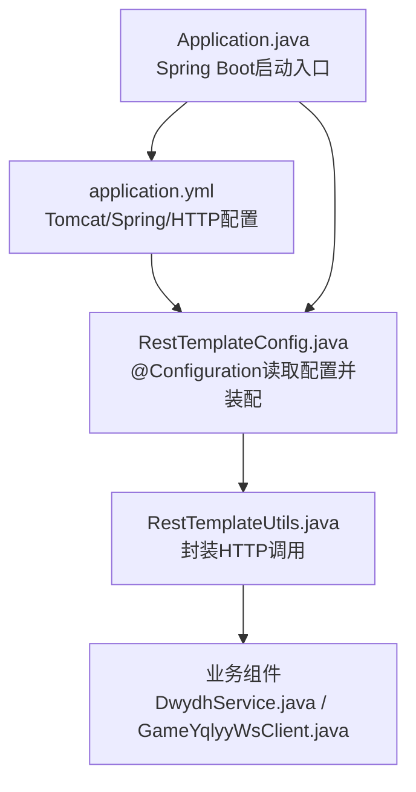
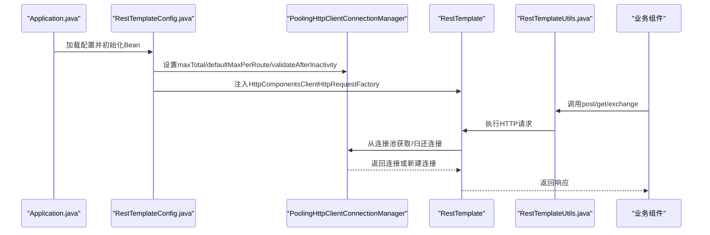
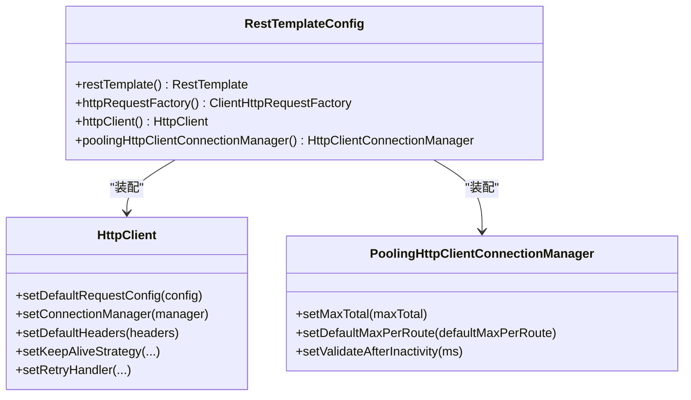
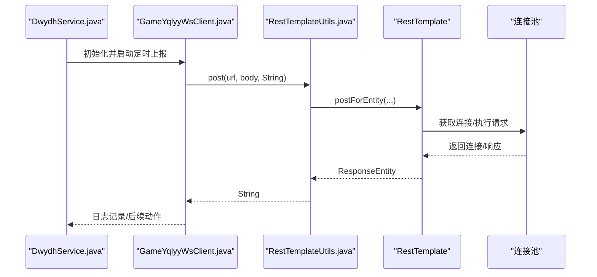
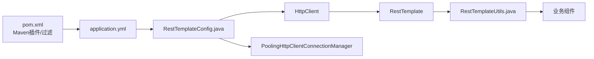

# 应用配置详解

<cite>
**本文引用的文件列表**
- [application.yml](file://src/main/resources/application.yml)
- [RestTemplateConfig.java](file://src/main/java/com/commom/RestTemplateConfig.java)
- [RestTemplateUtils.java](file://src/main/java/com/commom/RestTemplateUtils.java)
- [Application.java](file://src/main/java/com/Application.java)
- [DwydhService.java](file://src/main/java/com/dwydh/DwydhService.java)
- [GameYqlyyWsClient.java](file://src/main/java/com/yqlyy/GameYqlyyWsClient.java)
- [DomainNameUtil.java](file://src/main/java/com/utils/DomainNameUtil.java)
- [pom.xml](file://pom.xml)
</cite>

## 目录
1. [简介](#简介)
2. [项目结构与配置入口](#项目结构与配置入口)
3. [核心配置项详解](#核心配置项详解)
4. [架构总览](#架构总览)
5. [组件深度解析](#组件深度解析)
6. [依赖关系分析](#依赖关系分析)
7. [性能考量与调优建议](#性能考量与调优建议)
8. [故障排查指南](#故障排查指南)
9. [结论](#结论)
10. [附录：环境与最佳实践](#附录环境与最佳实践)

## 简介
本文件面向运维与开发人员，系统性解读应用的配置体系，重点覆盖：
- Tomcat服务器配置（端口、上下文路径）
- Spring应用配置（应用名称、环境配置）
- HTTP客户端连接池配置（最大连接数、并发数、超时时间）
- 配置项的作用机制、默认值与推荐设置
- 不同部署环境下的优化建议
- 配置参数之间的依赖关系与影响
- 配置验证方法与常见错误排查

## 项目结构与配置入口
应用基于Spring Boot，配置集中于资源目录的YAML文件，并通过Java配置类注入到运行时组件中。核心流程如下：
- application.yml定义基础配置（Tomcat、Spring、HTTP连接池）
- RestTemplateConfig.java读取YAML配置，构建Apache HttpClient连接池与RestTemplate
- RestTemplateUtils封装HTTP调用，供业务模块使用
- Application.java为启动入口，加载配置并启动Web容器

图表来源
- [application.yml](file://src/main/resources/application.yml#L1-L31)
- [RestTemplateConfig.java](file://src/main/java/com/commom/RestTemplateConfig.java#L35-L54)
- [RestTemplateUtils.java](file://src/main/java/com/commom/RestTemplateUtils.java#L14-L30)
- [Application.java](file://src/main/java/com/Application.java#L8-L12)

章节来源
- [application.yml](file://src/main/resources/application.yml#L1-L31)
- [RestTemplateConfig.java](file://src/main/java/com/commom/RestTemplateConfig.java#L35-L54)
- [RestTemplateUtils.java](file://src/main/java/com/commom/RestTemplateUtils.java#L14-L30)
- [Application.java](file://src/main/java/com/Application.java#L8-L12)

## 核心配置项详解
本节逐项解释application.yml中的关键配置及其作用机制、默认值与推荐设置。

- Tomcat服务器配置
  - server.port：监听端口
    - 作用：指定HTTP服务监听的TCP端口
    - 默认值：未在YAML中显式声明时遵循Spring Boot默认端口；当前配置为固定端口
    - 推荐：生产环境建议通过环境变量或外部化配置覆盖，避免冲突
  - server.servlet.context-path：上下文路径
    - 作用：为应用根路径添加统一前缀，便于多应用共存
    - 默认值：未设置时无上下文路径
    - 推荐：生产环境建议统一规划，配合反向代理使用

- Spring应用配置
  - spring.application.name：应用名称
    - 作用：用于日志、监控、注册中心识别
    - 默认值：未设置时为空
    - 推荐：使用稳定且语义明确的名称
  - spring.profiles.active：激活的环境配置
    - 作用：通过Maven占位符动态注入，实现不同环境的配置切换
    - 默认值：由构建阶段决定
    - 推荐：结合多profile文件或外部化配置管理

- HTTP客户端连接池配置
  - http.maxTotal：连接池最大连接数
    - 作用：全局连接池上限，控制同时打开的连接总数
    - 默认值：未在YAML中显式声明时为null，按实现默认行为
    - 推荐：根据并发请求峰值与下游服务性能设定
  - http.defaultMaxPerRoute：每路由默认最大并发
    - 作用：限制同一目标主机的最大并发连接数
    - 默认值：未显式声明时按实现默认行为
    - 推荐：与maxTotal协同配置，避免热点主机成为瓶颈
  - http.connectTimeout：连接超时时间
    - 作用：建立TCP连接的超时阈值
    - 默认值：未显式声明时按实现默认行为
    - 推荐：结合网络质量与下游服务延迟调整
  - http.connectionRequestTimeout：从连接池获取连接的等待超时
    - 作用：当连接池耗尽时，等待可用连接的最长等待时间
    - 默认值：未显式声明时按实现默认行为
    - 推荐：与maxTotal、defaultMaxPerRoute共同调优
  - http.socketTimeout：套接字读写超时
    - 作用：数据传输过程中的超时控制
    - 默认值：未显式声明时按实现默认行为
    - 推荐：对长耗时接口适当放宽，短请求保持严格
  - http.staleConnectionCheckEnabled：启用陈旧连接检测
    - 作用：提交请求前检测连接有效性
    - 默认值：未显式声明时按实现默认行为
    - 推荐：开启以提升稳定性，但会增加少量开销
  - http.validateAfterInactivity：空闲连接再利用前校验间隔
    - 作用：空闲连接在复用前的校验时间阈值
    - 默认值：未显式声明时按实现默认行为
    - 推荐：结合staleConnectionCheckEnabled使用，平衡安全与性能

章节来源
- [application.yml](file://src/main/resources/application.yml#L2-L30)
- [RestTemplateConfig.java](file://src/main/java/com/commom/RestTemplateConfig.java#L35-L54)
- [RestTemplateConfig.java](file://src/main/java/com/commom/RestTemplateConfig.java#L117-L129)
- [RestTemplateConfig.java](file://src/main/java/com/commom/RestTemplateConfig.java#L86-L91)

## 架构总览
下图展示配置如何驱动运行时组件，以及业务模块如何使用HTTP客户端。

图表来源
- [Application.java](file://src/main/java/com/Application.java#L8-L12)
- [RestTemplateConfig.java](file://src/main/java/com/commom/RestTemplateConfig.java#L85-L108)
- [RestTemplateConfig.java](file://src/main/java/com/commom/RestTemplateConfig.java#L117-L129)
- [RestTemplateUtils.java](file://src/main/java/com/commom/RestTemplateUtils.java#L19-L29)

## 组件深度解析

### HTTP客户端连接池与超时配置
- 连接池管理
  - 通过PoolingHttpClientConnectionManager统一管理HTTP/HTTPS连接
  - 支持全局maxTotal与按路由defaultMaxPerRoute的双重限制
  - validateAfterInactivity用于空闲连接再利用前的校验
- 超时策略
  - connectTimeout：建立连接的超时
  - connectionRequestTimeout：从池中获取连接的等待超时
  - socketTimeout：读写超时
  - staleConnectionCheckEnabled：请求前检测连接有效性
- 默认请求头
  - 包含User-Agent、Accept-Encoding、Accept-Language、Connection、Content-Type等
- 重试与保活
  - 默认重试处理器与Keep-Alive策略提升稳定性与连接复用率

图表来源
- [RestTemplateConfig.java](file://src/main/java/com/commom/RestTemplateConfig.java#L85-L108)
- [RestTemplateConfig.java](file://src/main/java/com/commom/RestTemplateConfig.java#L117-L129)

章节来源
- [RestTemplateConfig.java](file://src/main/java/com/commom/RestTemplateConfig.java#L85-L108)
- [RestTemplateConfig.java](file://src/main/java/com/commom/RestTemplateConfig.java#L117-L129)

### 业务组件中的HTTP调用
- DwydhService与GameYqlyyWsClient通过RestTemplateUtils发起HTTP请求
- 业务侧关注点在于URL拼装、请求体构造与异常处理
- 配置层面通过连接池与超时参数保障稳定性与性能

图表来源
- [DwydhService.java](file://src/main/java/com/dwydh/DwydhService.java#L21-L36)
- [GameYqlyyWsClient.java](file://src/main/java/com/yqlyy/GameYqlyyWsClient.java#L103-L116)
- [RestTemplateUtils.java](file://src/main/java/com/commom/RestTemplateUtils.java#L19-L21)

章节来源
- [DwydhService.java](file://src/main/java/com/dwydh/DwydhService.java#L21-L36)
- [GameYqlyyWsClient.java](file://src/main/java/com/yqlyy/GameYqlyyWsClient.java#L103-L116)
- [RestTemplateUtils.java](file://src/main/java/com/commom/RestTemplateUtils.java#L19-L21)

## 依赖关系分析
- 配置依赖
  - application.yml中的http.*键值被RestTemplateConfig.java通过@Value注入
  - 连接池参数直接影响HttpClient的生命周期与性能
- 运行时依赖
  - RestTemplateConfig装配HttpClient与连接池
  - RestTemplateUtils依赖RestTemplate对外提供HTTP能力
  - 业务组件通过RestTemplateUtils间接使用连接池与超时策略
- 环境依赖
  - spring.profiles.active由Maven占位符注入，支持不同环境差异化配置

图表来源
- [application.yml](file://src/main/resources/application.yml#L16-L30)
- [RestTemplateConfig.java](file://src/main/java/com/commom/RestTemplateConfig.java#L35-L54)
- [RestTemplateConfig.java](file://src/main/java/com/commom/RestTemplateConfig.java#L85-L108)
- [RestTemplateConfig.java](file://src/main/java/com/commom/RestTemplateConfig.java#L117-L129)
- [RestTemplateUtils.java](file://src/main/java/com/commom/RestTemplateUtils.java#L16-L17)
- [pom.xml](file://pom.xml#L116-L121)

章节来源
- [application.yml](file://src/main/resources/application.yml#L16-L30)
- [RestTemplateConfig.java](file://src/main/java/com/commom/RestTemplateConfig.java#L35-L54)
- [RestTemplateConfig.java](file://src/main/java/com/commom/RestTemplateConfig.java#L85-L108)
- [RestTemplateConfig.java](file://src/main/java/com/commom/RestTemplateConfig.java#L117-L129)
- [RestTemplateUtils.java](file://src/main/java/com/commom/RestTemplateUtils.java#L16-L17)
- [pom.xml](file://pom.xml#L116-L121)

## 性能考量与调优建议
- 连接池规模
  - maxTotal应与业务并发峰值匹配，避免频繁阻塞或资源耗尽
  - defaultMaxPerRoute针对热点域名进行限流，防止单点过载
- 超时参数
  - connectTimeout与socketTimeout需结合网络与下游服务SLA权衡
  - connectionRequestTimeout过小会导致高并发场景下大量排队失败
- 空闲连接与校验
  - validateAfterInactivity与staleConnectionCheckEnabled可降低陈旧连接带来的失败率
- 业务侧建议
  - 对长耗时接口适当提高socketTimeout
  - 对高并发短请求场景，合理设置maxTotal与defaultMaxPerRoute，避免连接池争用
  - 结合监控指标（连接池活跃数、等待队列长度、超时次数）持续优化

[本节为通用性能指导，不直接分析具体文件]

## 故障排查指南
- 配置未生效
  - 检查Maven资源过滤与占位符替换是否正确
  - 确认spring.profiles.active是否被正确注入
- 连接池耗尽
  - 观察connectionRequestTimeout是否过短导致排队失败
  - 检查maxTotal与defaultMaxPerRoute是否过低
- 超时异常
  - connectTimeout过短导致握手失败
  - socketTimeout过短导致读写超时
- 连接复用问题
  - validateAfterInactivity过短导致频繁重建连接
  - staleConnectionCheckEnabled开启后可减少陈旧连接
- 业务调用异常
  - 关注RestClientException与日志输出，定位上游服务状态码与响应内容
  - 在业务组件中区分RestClientException与其他异常类型，进行针对性处理

章节来源
- [pom.xml](file://pom.xml#L116-L121)
- [application.yml](file://src/main/resources/application.yml#L16-L30)
- [RestTemplateConfig.java](file://src/main/java/com/commom/RestTemplateConfig.java#L86-L91)
- [RestTemplateConfig.java](file://src/main/java/com/commom/RestTemplateConfig.java#L123-L126)
- [GameYqlyyWsClient.java](file://src/main/java/com/yqlyy/GameYqlyyWsClient.java#L109-L113)

## 结论
本配置体系通过YAML集中管理Tomcat、Spring与HTTP客户端的关键参数，并由Java配置类统一装配到运行时组件。通过合理的连接池规模与超时策略，可在保证稳定性的同时兼顾性能。建议结合监控指标与业务特征，在不同环境下迭代优化配置参数。

[本节为总结性内容，不直接分析具体文件]

## 附录：环境与最佳实践
- 开发环境
  - 端口与上下文路径可灵活设置，便于本地联调
  - 连接池规模适中，超时参数可略宽松，提升调试效率
- 测试环境
  - 与生产环境尽量一致的连接池与超时参数，确保行为一致性
  - 启用staleConnectionCheckEnabled与合理的validateAfterInactivity
- 生产环境
  - 通过环境变量或外部化配置覆盖spring.profiles.active
  - 基于压测与监控数据确定maxTotal、defaultMaxPerRoute与各类超时
  - 结合负载均衡与反向代理，统一上下文路径与端口策略

[本节为通用实践建议，不直接分析具体文件]