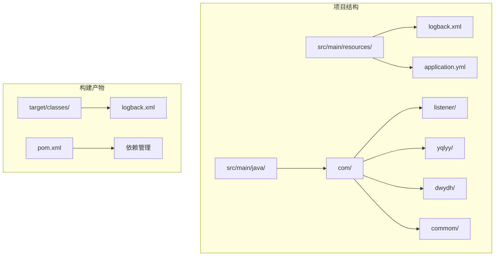
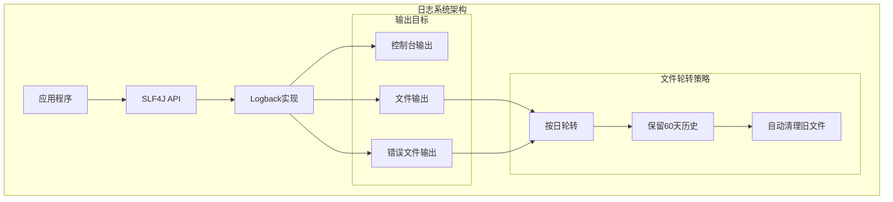
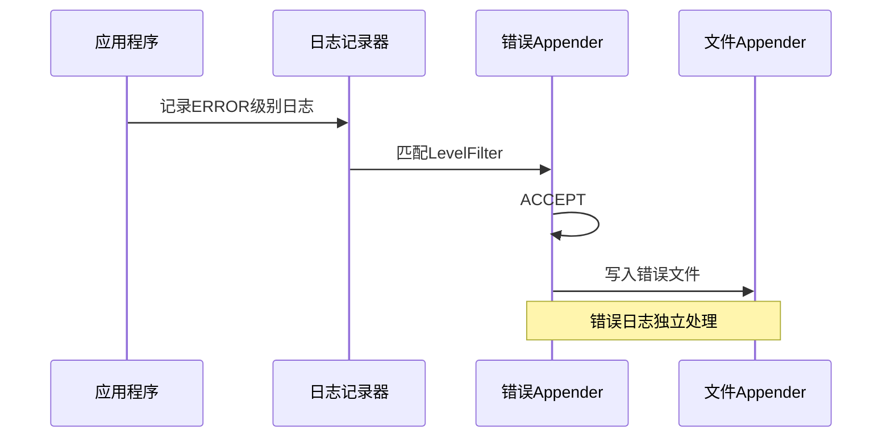
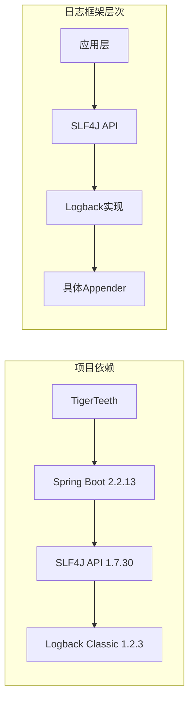
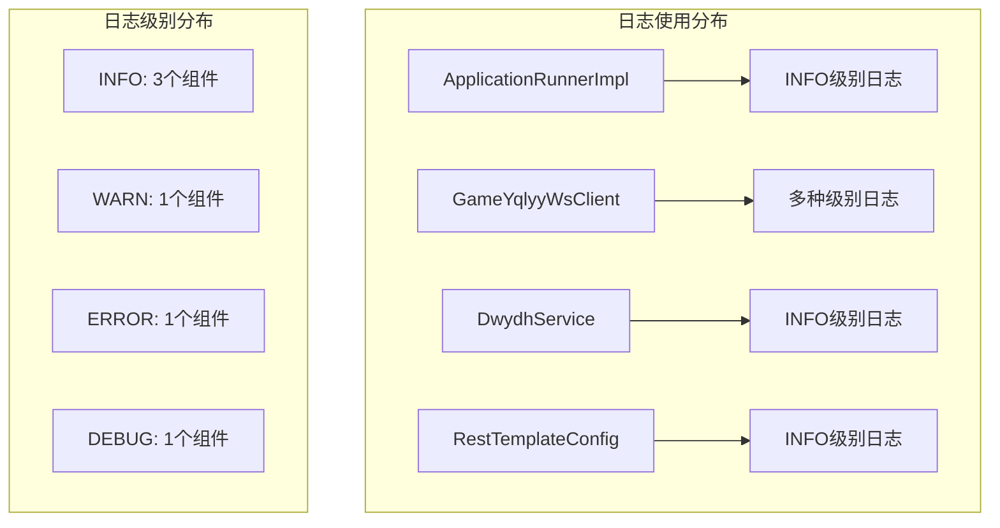
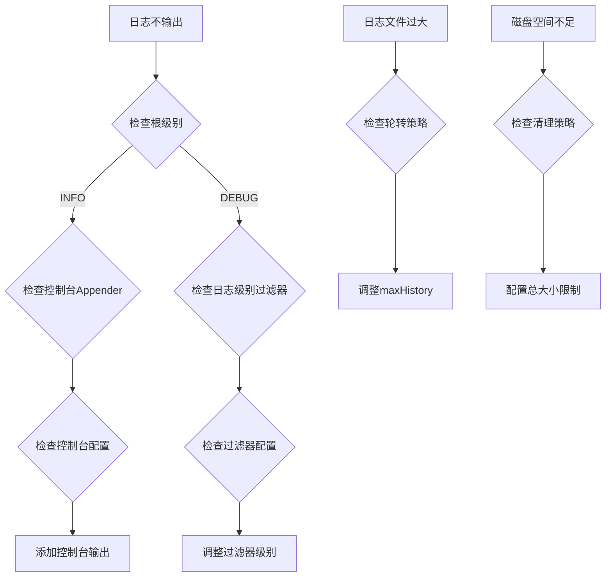
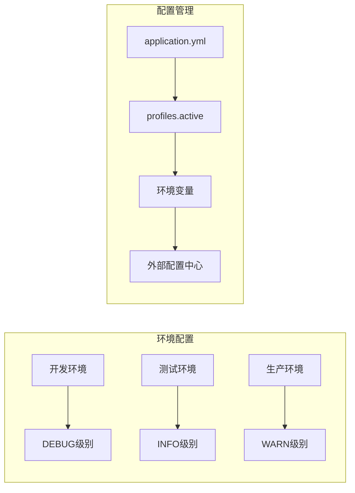

# 日志系统配置

<cite>
**本文档引用的文件**
- [logback.xml](file://src/main/resources/logback.xml)
- [application.yml](file://src/main/resources/application.yml)
- [pom.xml](file://pom.xml)
- [ApplicationRunnerImpl.java](file://src/main/java/com/listener/ApplicationRunnerImpl.java)
- [GameYqlyyWsClient.java](file://src/main/java/com/yqlyy/GameYqlyyWsClient.java)
- [DwydhService.java](file://src/main/java/com/dwydh/DwydhService.java)
- [RestTemplateConfig.java](file://src/main/java/com/commom/RestTemplateConfig.java)
- [logback.xml](file://target/classes/logback.xml)
</cite>

## 目录
1. [简介](#简介)
2. [项目结构](#项目结构)
3. [核心组件](#核心组件)
4. [架构概览](#架构概览)
5. [详细组件分析](#详细组件分析)
6. [依赖关系分析](#依赖关系分析)
7. [性能考虑](#性能考虑)
8. [故障排除指南](#故障排除指南)
9. [结论](#结论)
10. [附录](#附录)

## 简介

本项目采用Logback作为日志框架，实现了完整的日志系统配置。该配置文件提供了多级日志记录、文件轮转、控制台输出等功能，支持生产环境的高效日志管理。通过合理的日志级别配置和输出策略，为系统的监控、调试和问题排查提供了强有力的支持。

## 项目结构

项目采用标准的Spring Boot项目结构，日志配置位于资源目录下：



**图表来源**
- [logback.xml](file://src/main/resources/logback.xml#L1-L75)
- [pom.xml](file://pom.xml#L1-L160)

**章节来源**
- [logback.xml](file://src/main/resources/logback.xml#L1-L75)
- [application.yml](file://src/main/resources/application.yml#L1-L31)
- [pom.xml](file://pom.xml#L1-L160)

## 核心组件

### Logback配置组件

项目使用Logback作为日志实现，主要包含以下核心组件：

1. **控制台Appender**: 实时输出到控制台
2. **文件Appender**: 基于时间的滚动文件输出
3. **日志级别过滤器**: 精确控制日志级别
4. **根Logger配置**: 统一的日志输出策略

### 日志级别配置

系统采用分层的日志级别控制策略：

- **全局级别**: INFO级别作为默认级别
- **模块级别**: com.gzb包设置为INFO级别
- **框架级别**: org.springframework设置为WARN级别

**章节来源**
- [logback.xml](file://src/main/resources/logback.xml#L60-L67)
- [logback.xml](file://src/main/resources/logback.xml#L61-L63)

## 架构概览



**图表来源**
- [logback.xml](file://src/main/resources/logback.xml#L8-L13)
- [logback.xml](file://src/main/resources/logback.xml#L15-L36)
- [logback.xml](file://src/main/resources/logback.xml#L38-L58)

## 详细组件分析

### 控制台输出组件

控制台输出组件负责实时显示应用运行状态，便于开发和调试阶段使用。

```mermaid
classDiagram
class ConsoleAppender {
+encoder : PatternLayoutEncoder
+pattern : "%d{HH : mm : ss.SSS} [%thread] %-5level %logger{20} - [%method,%line] - %msg%n"
+start() void
+doAppend(event) void
}
class PatternLayoutEncoder {
+pattern : String
+doEncode(event) void
}
ConsoleAppender --> PatternLayoutEncoder : 使用
```

**图表来源**
- [logback.xml](file://src/main/resources/logback.xml#L9-L13)
- [logback.xml](file://src/main/resources/logback.xml#L10-L12)

### 文件输出组件

文件输出组件采用滚动文件策略，支持按日期自动轮转：

```mermaid
classDiagram
class RollingFileAppender {
+file : "./log/info.log"
+rollingPolicy : TimeBasedRollingPolicy
+encoder : PatternLayoutEncoder
+filter : LevelFilter
}
class TimeBasedRollingPolicy {
+fileNamePattern : "./log/info.%d{yyyy-MM-dd}.log"
+maxHistory : 60
+totalSizeCap : 0
}
class LevelFilter {
+level : INFO
+onMatch : ACCEPT
+onMismatch : DENY
}
RollingFileAppender --> TimeBasedRollingPolicy : 配置
RollingFileAppender --> LevelFilter : 应用
```

**图表来源**
- [logback.xml](file://src/main/resources/logback.xml#L16-L36)
- [logback.xml](file://src/main/resources/logback.xml#L38-L58)

### 错误日志专门化

系统为错误日志提供了专门的处理机制：



**图表来源**
- [logback.xml](file://src/main/resources/logback.xml#L50-L57)
- [logback.xml](file://src/main/resources/logback.xml#L38-L58)

**章节来源**
- [logback.xml](file://src/main/resources/logback.xml#L15-L73)

### 日志输出格式定义

日志输出格式包含了丰富的上下文信息：

| 格式字段 | 描述 | 示例 |
|---------|------|------|
| `%d{HH:mm:ss.SSS}` | 时间戳 | 14:30:25.123 |
| `[%thread]` | 线程名称 | [http-nio-8080-exec-1] |
| `%-5level` | 日志级别 | INFO, WARN, ERROR |
| `%logger{20}` | 类名 | GameYqlyyWsClient |
| `[%method,%line]` | 方法和行号 | [onOpen,223] |
| `%msg` | 日志消息 | 连接成功 |

**章节来源**
- [logback.xml](file://src/main/resources/logback.xml#L6-L6)

### 日志级别应用场景

| 日志级别 | 应用场景 | 性能影响 | 使用建议 |
|----------|----------|----------|----------|
| TRACE | 详细调试信息 | 高 | 开发阶段使用，生产禁用 |
| DEBUG | 调试细节 | 中等 | 开发调试，谨慎使用 |
| INFO | 一般业务信息 | 低 | 生产默认级别 |
| WARN | 警告但可恢复的问题 | 低 | 关注潜在问题 |
| ERROR | 错误但不影响整体运行 | 低 | 必须关注的问题 |

**章节来源**
- [logback.xml](file://src/main/resources/logback.xml#L60-L67)

## 依赖关系分析

### 外部依赖关系



**图表来源**
- [pom.xml](file://pom.xml#L26-L91)
- [logback.xml](file://src/main/resources/logback.xml#L1-L75)

### 内部组件依赖

系统中的日志使用分布在整个应用中：



**图表来源**
- [ApplicationRunnerImpl.java](file://src/main/java/com/listener/ApplicationRunnerImpl.java#L30)
- [GameYqlyyWsClient.java](file://src/main/java/com/yqlyy/GameYqlyyWsClient.java#L48)
- [GameYqlyyWsClient.java](file://src/main/java/com/yqlyy/GameYqlyyWsClient.java#L242)

**章节来源**
- [pom.xml](file://pom.xml#L72-L91)
- [ApplicationRunnerImpl.java](file://src/main/java/com/listener/ApplicationRunnerImpl.java#L19-L33)
- [GameYqlyyWsClient.java](file://src/main/java/com/yqlyy/GameYqlyyWsClient.java#L34-L328)

## 性能考虑

### 日志性能优化策略

1. **异步日志记录**: 建议使用AsyncAppender减少I/O阻塞
2. **批量写入**: 合理配置缓冲区大小
3. **条件日志**: 使用isDebugEnabled()等条件判断
4. **日志聚合**: 避免重复记录相同信息

### 文件轮转性能特性

- **按日轮转**: 减少单文件过大导致的I/O压力
- **历史保留**: 60天历史确保问题追踪能力
- **自动清理**: 系统自动管理磁盘空间

### 内存和CPU影响

- **INFO级别**: 对性能影响最小
- **DEBUG级别**: 影响约10-20%
- **TRACE级别**: 影响约30-50%

## 故障排除指南

### 常见问题诊断



### 调试技巧

1. **临时提升级别**: 在开发环境使用DEBUG级别
2. **模块化调试**: 为特定包设置独立级别
3. **时间定位**: 利用时间戳快速定位问题
4. **线程跟踪**: 通过线程信息识别并发问题

**章节来源**
- [logback.xml](file://src/main/resources/logback.xml#L2-L75)

## 结论

本项目的日志系统配置体现了生产级应用的最佳实践：

1. **清晰的分层设计**: 控制台和文件输出分离
2. **合理的级别控制**: INFO级别适合作为默认级别
3. **智能的轮转策略**: 按日轮转确保文件管理效率
4. **完善的过滤机制**: 精确控制不同类型的日志输出

建议在生产环境中：
- 添加异步日志Appender
- 配置日志压缩和归档
- 设置磁盘空间监控告警
- 建立日志分析和监控体系

## 附录

### 版本管理和环境差异化



### 配置优化建议

1. **异步日志**: 添加AsyncAppender减少阻塞
2. **日志压缩**: 配置压缩策略节省存储空间
3. **远程传输**: 集成ELK或类似系统
4. **性能监控**: 添加日志统计和性能指标

**章节来源**
- [application.yml](file://src/main/resources/application.yml#L12-L14)
- [pom.xml](file://pom.xml#L114-L159)