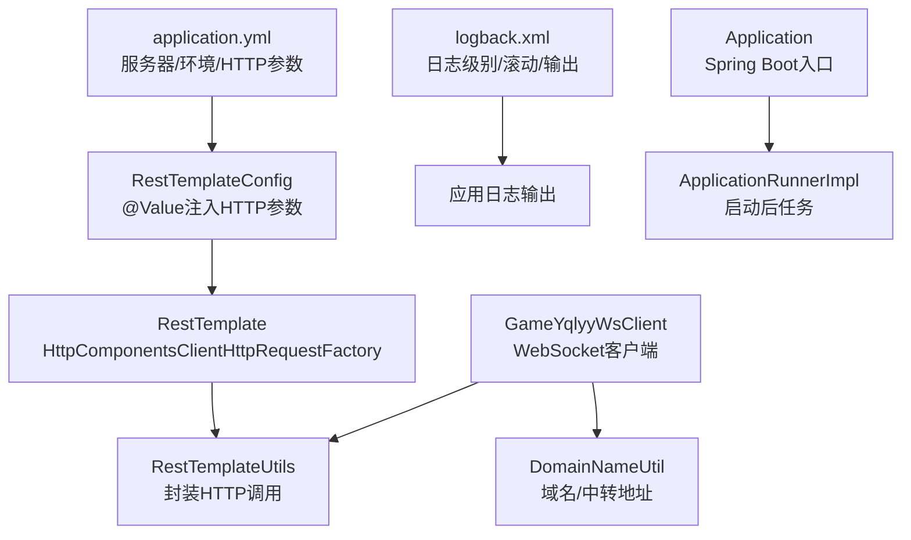
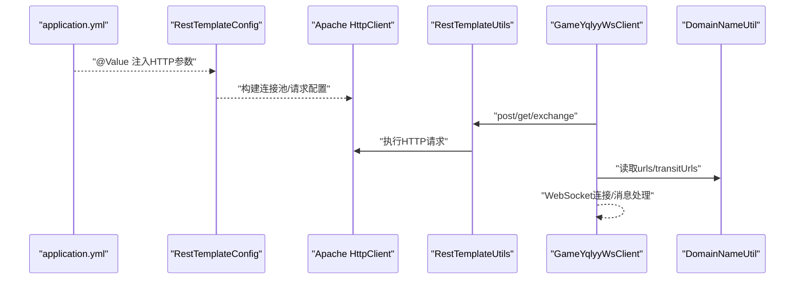
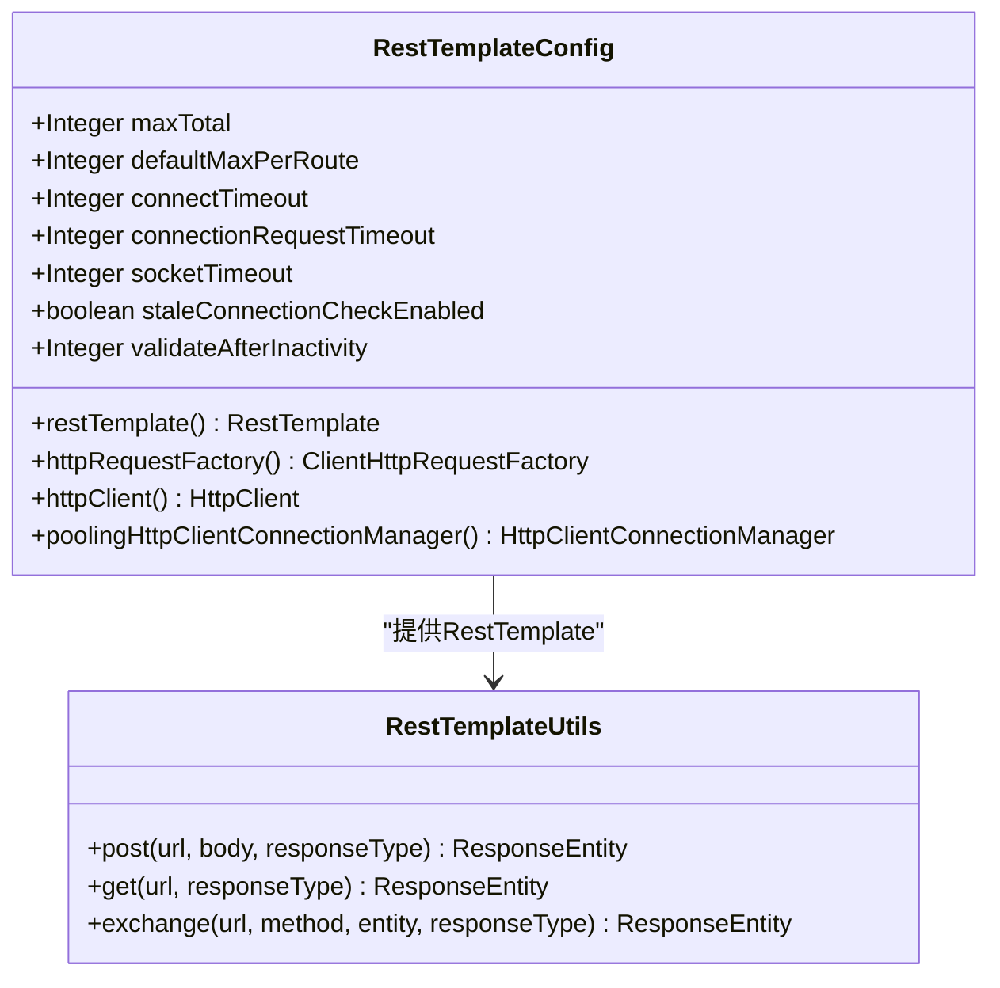
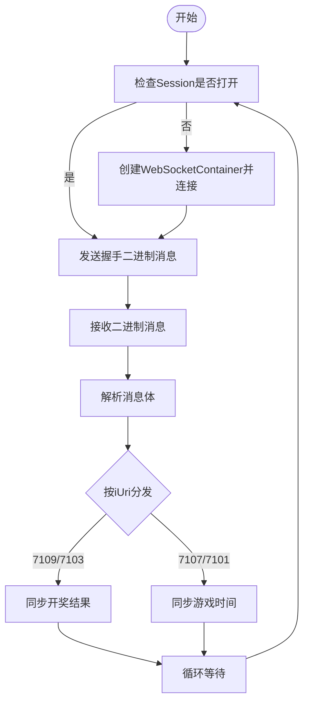
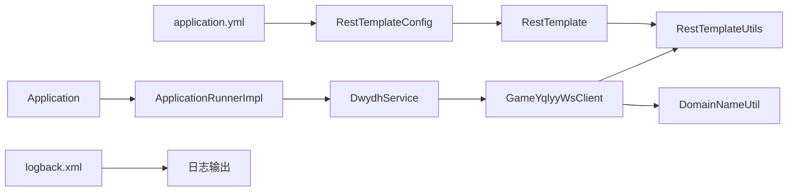

# 配置管理

<cite>
**本文引用的文件列表**
- [application.yml](file://src/main/resources/application.yml)
- [logback.xml](file://src/main/resources/logback.xml)
- [RestTemplateConfig.java](file://src/main/java/com/commom/RestTemplateConfig.java)
- [RestTemplateUtils.java](file://src/main/java/com/commom/RestTemplateUtils.java)
- [GameYqlyyWsClient.java](file://src/main/java/com/yqlyy/GameYqlyyWsClient.java)
- [DomainNameUtil.java](file://src/main/java/com/utils/DomainNameUtil.java)
- [Application.java](file://src/main/java/com/Application.java)
- [ApplicationRunnerImpl.java](file://src/main/java/com/listener/ApplicationRunnerImpl.java)
- [pom.xml](file://pom.xml)
</cite>

## 目录
1. [简介](#简介)
2. [项目结构与配置文件分布](#项目结构与配置文件分布)
3. [核心配置项解析](#核心配置项解析)
4. [架构总览](#架构总览)
5. [组件详解](#组件详解)
6. [依赖关系分析](#依赖关系分析)
7. [性能与调优建议](#性能与调优建议)
8. [故障排查指南](#故障排查指南)
9. [结论](#结论)
10. [附录](#附录)

## 简介
本指南围绕本项目的配置管理展开，重点覆盖以下方面：
- application.yml 的各项参数说明与作用机制
- WebSocket 连接参数与客户端行为
- HTTP 客户端（Apache HttpClient）配置与调优
- 日志系统配置（级别、格式、滚动策略）
- 环境差异化与版本管理策略
- 配置变更影响评估与回滚策略
- 配置验证与测试方法
- 配置热更新与重启策略

## 项目结构与配置文件分布
- 配置文件位于 resources 目录：
  - application.yml：应用基础配置（服务器端口、上下文路径、环境激活、HTTP 连接池参数）
  - logback.xml：日志系统配置（控制台输出、文件滚动、级别过滤）
- Java 配置与使用：
  - RestTemplateConfig：基于 application.yml 注入 HTTP 参数，构建 Apache HttpClient 连接池
  - RestTemplateUtils：封装 RestTemplate 的常用方法
  - GameYqlyyWsClient：WebSocket 客户端，包含默认 ws 地址、消息处理、连接与重连逻辑
  - DomainNameUtil：域名与中转地址常量（当前为空数组，用于后续动态注入）
  - Application/ApplicationRunnerImpl：应用入口与启动后任务调度

图表来源
- [application.yml](file://src/main/resources/application.yml#L1-L31)
- [RestTemplateConfig.java](file://src/main/java/com/commom/RestTemplateConfig.java#L35-L54)
- [RestTemplateUtils.java](file://src/main/java/com/commom/RestTemplateUtils.java#L14-L30)
- [logback.xml](file://src/main/resources/logback.xml#L1-L75)
- [GameYqlyyWsClient.java](file://src/main/java/com/yqlyy/GameYqlyyWsClient.java#L35-L36)
- [DomainNameUtil.java](file://src/main/java/com/utils/DomainNameUtil.java#L4-L13)
- [Application.java](file://src/main/java/com/Application.java#L8-L11)
- [ApplicationRunnerImpl.java](file://src/main/java/com/listener/ApplicationRunnerImpl.java#L21-L31)

章节来源
- [application.yml](file://src/main/resources/application.yml#L1-L31)
- [logback.xml](file://src/main/resources/logback.xml#L1-L75)
- [RestTemplateConfig.java](file://src/main/java/com/commom/RestTemplateConfig.java#L35-L54)
- [RestTemplateUtils.java](file://src/main/java/com/commom/RestTemplateUtils.java#L14-L30)
- [GameYqlyyWsClient.java](file://src/main/java/com/yqlyy/GameYqlyyWsClient.java#L35-L36)
- [DomainNameUtil.java](file://src/main/java/com/utils/DomainNameUtil.java#L4-L13)
- [Application.java](file://src/main/java/com/Application.java#L8-L11)
- [ApplicationRunnerImpl.java](file://src/main/java/com/listener/ApplicationRunnerImpl.java#L21-L31)

## 核心配置项解析
- 服务器与上下文
  - server.port：应用监听端口
  - server.servlet.context-path：应用上下文路径
- Spring 应用与环境
  - spring.application.name：应用名称
  - spring.profiles.active：激活的环境配置（Maven 过滤变量）
- HTTP 客户端连接池参数
  - http.maxTotal：最大连接数
  - http.defaultMaxPerRoute：每路由最大并发
  - http.connectTimeout：连接超时
  - http.connectionRequestTimeout：从连接池获取连接超时
  - http.socketTimeout：套接字读写超时
  - http.staleConnectionCheckEnabled：提交请求前检测连接可用性
  - http.validateAfterInactivity：空闲多久后校验连接（重用前检查）

章节来源
- [application.yml](file://src/main/resources/application.yml#L2-L31)
- [RestTemplateConfig.java](file://src/main/java/com/commom/RestTemplateConfig.java#L35-L54)

## 架构总览
下图展示配置在系统中的流转与使用路径：application.yml 中的参数通过 @Value 注入到 RestTemplateConfig，进而构建 Apache HttpClient；GameYqlyyWsClient 在运行时根据配置与常量进行 HTTP 调用与 WebSocket 连接。

图表来源
- [application.yml](file://src/main/resources/application.yml#L16-L31)
- [RestTemplateConfig.java](file://src/main/java/com/commom/RestTemplateConfig.java#L35-L54)
- [RestTemplateUtils.java](file://src/main/java/com/commom/RestTemplateUtils.java#L14-L30)
- [GameYqlyyWsClient.java](file://src/main/java/com/yqlyy/GameYqlyyWsClient.java#L103-L114)
- [DomainNameUtil.java](file://src/main/java/com/utils/DomainNameUtil.java#L4-L13)

## 组件详解

### HTTP 客户端配置与调优
- 参数映射与注入
  - @Value 注入 application.yml 中的 http.* 参数，分别对应连接池容量、超时与连接校验策略
- 连接池与请求配置
  - 连接池：设置最大连接数与每路由并发，并在空闲一段时间后校验连接
  - 请求配置：设置 socket、connect、connectionRequest 超时，启用连接可用性检查
  - 默认请求头：User-Agent、Accept-Encoding、Accept-Language、Connection、Content-Type
  - 重试策略：默认重试处理器开启，重试次数为 2 次
- 使用方式
  - RestTemplateConfig 暴露 RestTemplate Bean，RestTemplateUtils 封装常用 GET/POST/EXCHANGE 方法

图表来源
- [RestTemplateConfig.java](file://src/main/java/com/commom/RestTemplateConfig.java#L35-L54)
- [RestTemplateConfig.java](file://src/main/java/com/commom/RestTemplateConfig.java#L62-L129)
- [RestTemplateUtils.java](file://src/main/java/com/commom/RestTemplateUtils.java#L14-L30)

章节来源
- [application.yml](file://src/main/resources/application.yml#L16-L31)
- [RestTemplateConfig.java](file://src/main/java/com/commom/RestTemplateConfig.java#L35-L54)
- [RestTemplateConfig.java](file://src/main/java/com/commom/RestTemplateConfig.java#L62-L129)
- [RestTemplateUtils.java](file://src/main/java/com/commom/RestTemplateUtils.java#L14-L30)

### WebSocket 客户端配置与行为
- 默认连接地址
  - 内置默认 wss 地址，用于初始化连接
- 连接与消息处理
  - onOpen：发送二进制握手消息
  - onMessage：解析二进制消息，按 iUri 分发处理（开奖/时间同步等）
  - onClose/onError：记录关闭与异常
- 连接参数
  - 设置文本/二进制消息缓冲大小、会话空闲超时、异步发送超时
- 重连机制
  - 若会话未打开则重新连接

图表来源
- [GameYqlyyWsClient.java](file://src/main/java/com/yqlyy/GameYqlyyWsClient.java#L250-L272)
- [GameYqlyyWsClient.java](file://src/main/java/com/yqlyy/GameYqlyyWsClient.java#L221-L237)
- [GameYqlyyWsClient.java](file://src/main/java/com/yqlyy/GameYqlyyWsClient.java#L46-L219)

章节来源
- [GameYqlyyWsClient.java](file://src/main/java/com/yqlyy/GameYqlyyWsClient.java#L35-L36)
- [GameYqlyyWsClient.java](file://src/main/java/com/yqlyy/GameYqlyyWsClient.java#L250-L272)
- [GameYqlyyWsClient.java](file://src/main/java/com/yqlyy/GameYqlyyWsClient.java#L221-L237)
- [GameYqlyyWsClient.java](file://src/main/java/com/yqlyy/GameYqlyyWsClient.java#L46-L219)

### 日志系统配置
- 输出目标
  - 控制台：输出到 ConsoleAppender
  - 文件：info.log/error.log，基于时间滚动，保留 60 天
- 级别与过滤
  - info.log：仅记录 INFO 级别
  - error.log：仅记录 ERROR 级别
  - 根日志级别：info，同时输出到控制台与文件
- 扫描与自动刷新
  - logback.xml 启用扫描与周期刷新，便于配置变更生效

章节来源
- [logback.xml](file://src/main/resources/logback.xml#L1-L75)

### 域名配置管理与动态更新
- 当前实现
  - DomainNameUtil 中定义了 urls 与 transitUrls 常量数组，当前为空数组
- 动态更新机制
  - 代码中直接使用常量数组，未见动态拉取或热更新逻辑
- 建议
  - 引入外部配置源（如配置中心、环境变量、数据库），在运行时刷新数组
  - 或通过 Spring 的 @RefreshScope 实现动态刷新（需引入 Spring Cloud Config 或 Actuator）

章节来源
- [DomainNameUtil.java](file://src/main/java/com/utils/DomainNameUtil.java#L4-L13)
- [GameYqlyyWsClient.java](file://src/main/java/com/yqlyy/GameYqlyyWsClient.java#L103-L114)
- [GameYqlyyWsClient.java](file://src/main/java/com/yqlyy/GameYqlyyWsClient.java#L136-L147)
- [GameYqlyyWsClient.java](file://src/main/java/com/yqlyy/GameYqlyyWsClient.java#L170-L181)
- [GameYqlyyWsClient.java](file://src/main/java/com/yqlyy/GameYqlyyWsClient.java#L202-L213)

### 环境配置与版本管理
- 环境激活
  - spring.profiles.active 由 Maven 过滤变量 @profiles.active@ 注入，支持 dev/test/prod 等多环境
- 版本管理
  - pom.xml 中声明 Spring Boot 版本与资源过滤，resources 节点启用 filtering，便于替换占位符
- 建议
  - 使用 Spring Profiles 与外部化配置（如配置中心）实现环境隔离
  - 对 application.yml 做最小化基线配置，敏感信息放入密钥管理

章节来源
- [application.yml](file://src/main/resources/application.yml#L12-L14)
- [pom.xml](file://pom.xml#L114-L121)
- [pom.xml](file://pom.xml#L142-L153)

## 依赖关系分析
- 配置依赖
  - application.yml -> RestTemplateConfig(@Value) -> RestTemplate -> RestTemplateUtils
  - application.yml -> GameYqlyyWsClient(连接参数)
  - logback.xml -> 应用日志输出
- 运行时依赖
  - Application -> ApplicationRunnerImpl -> DwydhService -> GameYqlyyWsClient
  - GameYqlyyWsClient -> RestTemplateUtils -> RestTemplate -> Apache HttpClient

图表来源
- [application.yml](file://src/main/resources/application.yml#L1-L31)
- [RestTemplateConfig.java](file://src/main/java/com/commom/RestTemplateConfig.java#L35-L54)
- [RestTemplateUtils.java](file://src/main/java/com/commom/RestTemplateUtils.java#L14-L30)
- [GameYqlyyWsClient.java](file://src/main/java/com/yqlyy/GameYqlyyWsClient.java#L35-L36)
- [DomainNameUtil.java](file://src/main/java/com/utils/DomainNameUtil.java#L4-L13)
- [Application.java](file://src/main/java/com/Application.java#L8-L11)
- [ApplicationRunnerImpl.java](file://src/main/java/com/listener/ApplicationRunnerImpl.java#L21-L31)
- [logback.xml](file://src/main/resources/logback.xml#L1-L75)

## 性能与调优建议
- HTTP 连接池
  - maxTotal 与 defaultMaxPerRoute：根据并发与下游服务承载能力调整，避免连接不足或过度占用
  - validateAfterInactivity：在高并发场景下适当降低以减少无效校验开销
  - staleConnectionCheckEnabled：开启可提升稳定性，但会增加少量 CPU 开销
- 超时参数
  - connectTimeout：网络较差时适度增大
  - connectionRequestTimeout：避免阻塞等待
  - socketTimeout：根据下游响应时间调整，避免过长导致线程占用
- WebSocket
  - 缓冲区与超时：根据消息大小与网络状况调整，默认值已适中
  - 重连策略：当前为自动重连，建议结合指数退避与最大重试次数
- 日志
  - info.log/error.log 分离，减少 IO 压力
  - 生产环境建议降低根日志级别，避免过多 DEBUG/INFO

章节来源
- [application.yml](file://src/main/resources/application.yml#L16-L31)
- [RestTemplateConfig.java](file://src/main/java/com/commom/RestTemplateConfig.java#L117-L129)
- [GameYqlyyWsClient.java](file://src/main/java/com/yqlyy/GameYqlyyWsClient.java#L250-L258)

## 故障排查指南
- HTTP 请求失败
  - 检查超时参数与连接池容量是否合理
  - 关注连接可用性检查与重试策略
- WebSocket 连接异常
  - 查看 onOpen/onError 回调日志
  - 核对默认 ws 地址与网络可达性
- 日志问题
  - 确认 logback.xml 扫描与输出路径
  - 检查 info.log/error.log 是否生成与滚动策略
- 域名/中转地址
  - 当前数组为空，确认是否通过外部化配置注入

章节来源
- [RestTemplateConfig.java](file://src/main/java/com/commom/RestTemplateConfig.java#L84-L108)
- [GameYqlyyWsClient.java](file://src/main/java/com/yqlyy/GameYqlyyWsClient.java#L240-L248)
- [logback.xml](file://src/main/resources/logback.xml#L1-L75)
- [DomainNameUtil.java](file://src/main/java/com/utils/DomainNameUtil.java#L4-L13)

## 结论
本项目通过 application.yml 与 logback.xml 提供了清晰的基础配置，RestTemplateConfig 将配置参数转化为 HTTP 客户端能力，GameYqlyyWsClient 则在运行时完成 WebSocket 连接与消息处理。建议在生产环境中完善环境隔离、配置动态更新与日志分级策略，并对 HTTP 与 WebSocket 的超时与重连参数进行针对性调优。

## 附录

### 配置验证与测试方法
- 单元测试
  - 对 RestTemplateConfig 进行构造与 Bean 初始化验证
  - 对 RestTemplateUtils 的 GET/POST 方法进行断言
- 集成测试
  - 启动 Application，观察 ApplicationRunnerImpl 是否正常执行
  - 观察日志输出是否符合 logback.xml 配置
- 环境验证
  - 通过修改 spring.profiles.active 验证不同环境配置加载

章节来源
- [RestTemplateConfig.java](file://src/main/java/com/commom/RestTemplateConfig.java#L62-L65)
- [RestTemplateUtils.java](file://src/main/java/com/commom/RestTemplateUtils.java#L19-L29)
- [Application.java](file://src/main/java/com/Application.java#L8-L11)
- [ApplicationRunnerImpl.java](file://src/main/java/com/listener/ApplicationRunnerImpl.java#L21-L31)
- [logback.xml](file://src/main/resources/logback.xml#L65-L73)

### 配置热更新与重启策略
- 现状
  - application.yml 与 logback.xml 支持资源过滤与日志扫描
  - 域名配置为静态常量，无内置热更新
- 建议
  - HTTP 参数：通过 @RefreshScope 与配置中心实现动态刷新
  - 日志：保持 logback.xml 的扫描与周期刷新
  - 域名：引入配置中心或环境变量，配合 @RefreshScope 实现热更新
  - WebSocket：在配置变更后触发重建连接流程

章节来源
- [application.yml](file://src/main/resources/application.yml#L12-L14)
- [logback.xml](file://src/main/resources/logback.xml#L2-L2)
- [DomainNameUtil.java](file://src/main/java/com/utils/DomainNameUtil.java#L4-L13)
- [pom.xml](file://pom.xml#L114-L121)