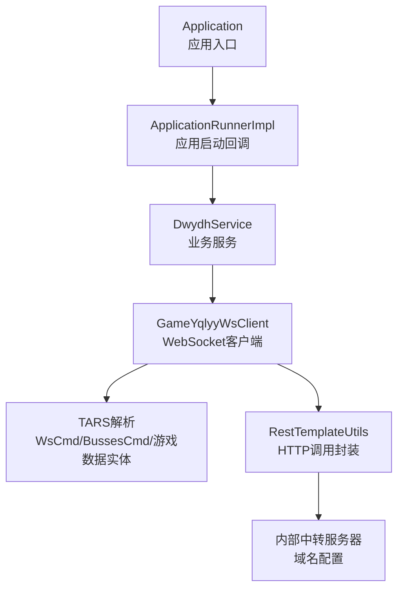
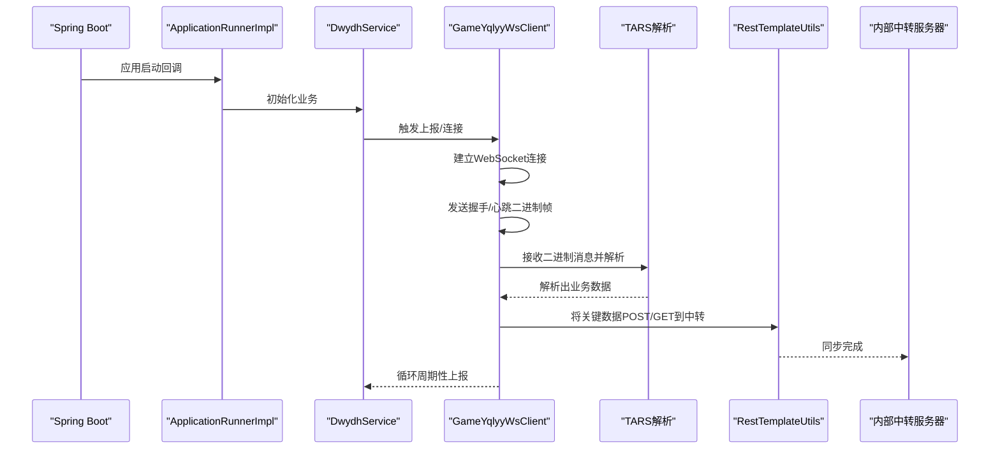
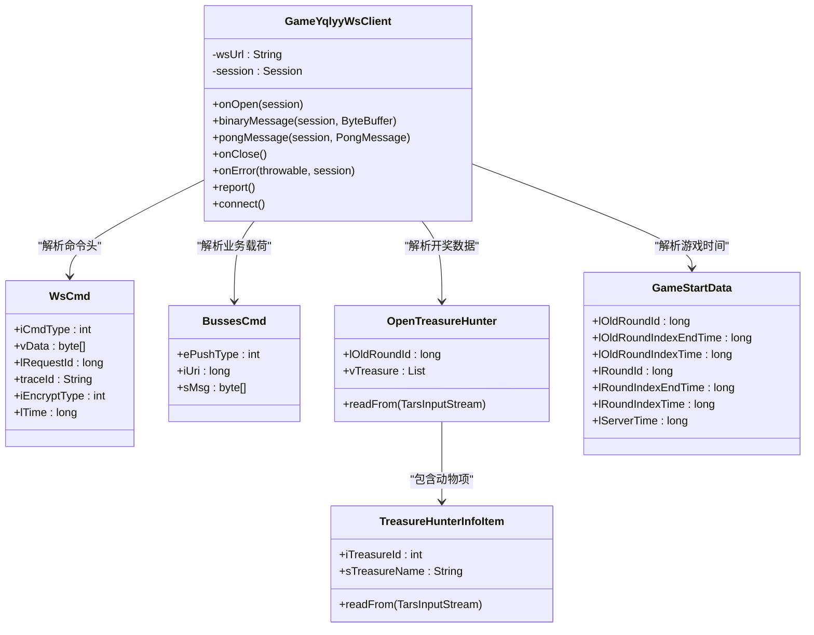
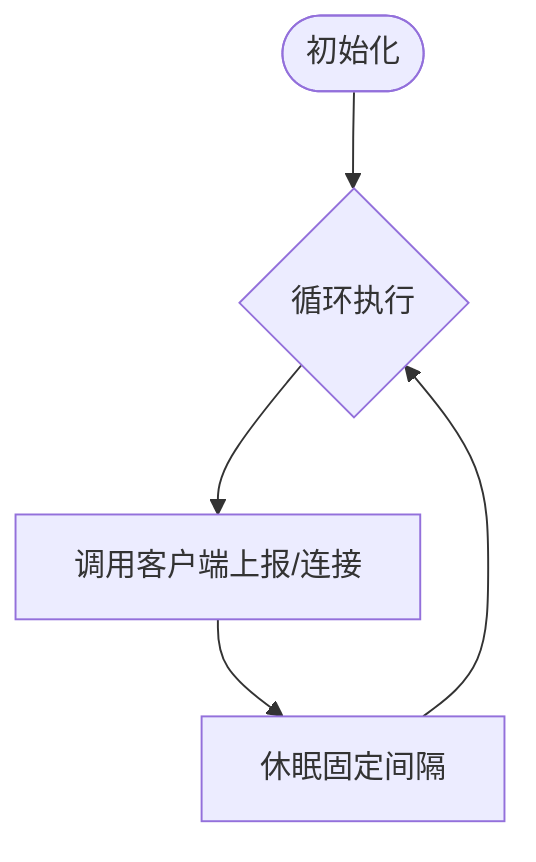
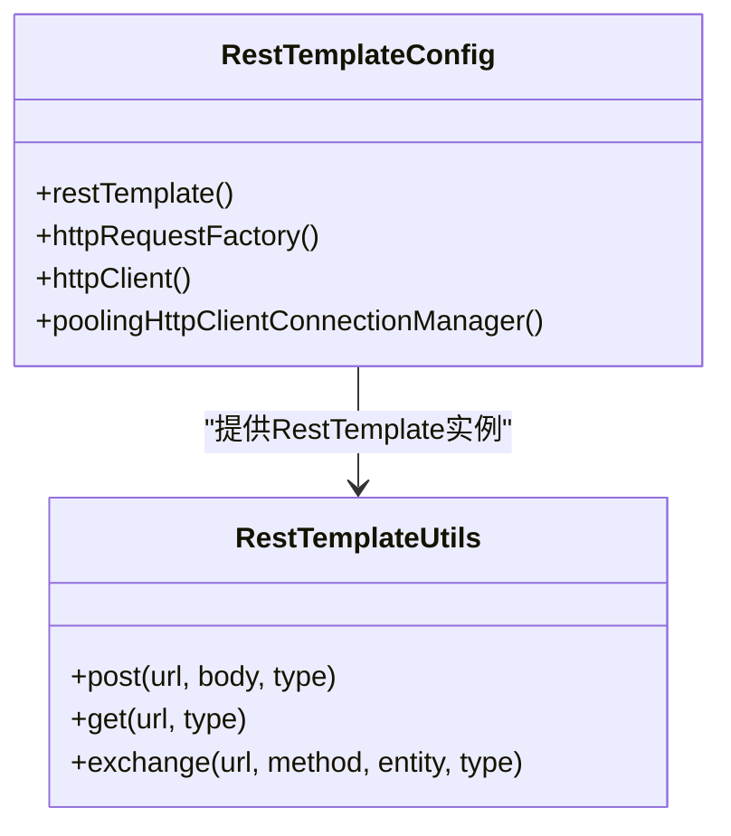
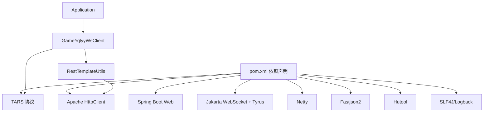
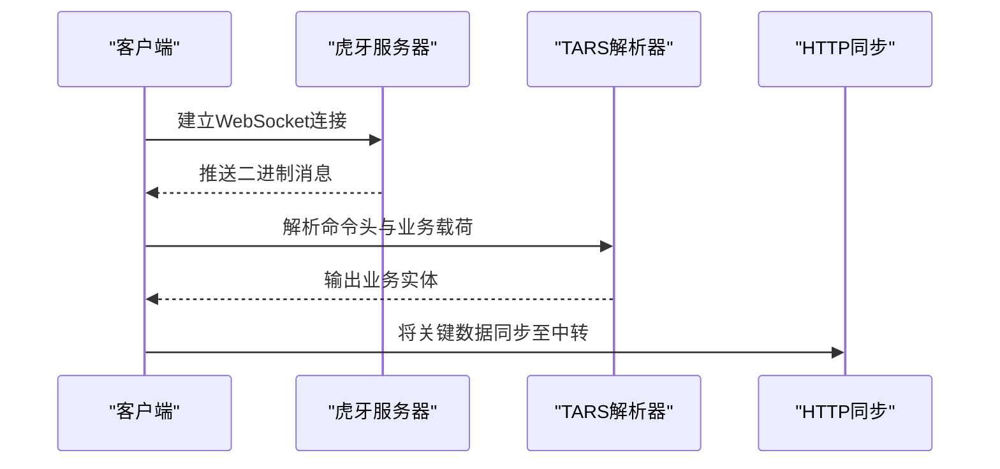

# 项目概述

<cite>
**本文引用的文件**   
- [Application.java](file://src/main/java/com/Application.java)
- [GameYqlyyWsClient.java](file://src/main/java/com/yqlyy/GameYqlyyWsClient.java)
- [DwydhService.java](file://src/main/java/com/dwydh/DwydhService.java)
- [ApplicationRunnerImpl.java](file://src/main/java/com/listener/ApplicationRunnerImpl.java)
- [RestTemplateUtils.java](file://src/main/java/com/commom/RestTemplateUtils.java)
- [RestTemplateConfig.java](file://src/main/java/com/commom/RestTemplateConfig.java)
- [DomainNameUtil.java](file://src/main/java/com/utils/DomainNameUtil.java)
- [WsCmd.java](file://src/main/java/com/entity/WsCmd.java)
- [BussesCmd.java](file://src/main/java/com/entity/BussesCmd.java)
- [GameStartData.java](file://src/main/java/com/entity/GameStartData.java)
- [Wup.java](file://src/main/java/com/entity/Wup.java)
- [OpenTreasureHunter.java](file://src/main/java/com/entity/AccountedNotify/OpenTreasureHunter.java)
- [TreasureHunterInfoItem.java](file://src/main/java/com/entity/AccountedNotify/TreasureHunterInfoItem.java)
- [application.yml](file://src/main/resources/application.yml)
- [pom.xml](file://pom.xml)
</cite>

## 目录
1. [引言](#引言)
2. [项目结构](#项目结构)
3. [核心组件](#核心组件)
4. [架构总览](#架构总览)
5. [详细组件分析](#详细组件分析)
6. [依赖分析](#依赖分析)
7. [性能考虑](#性能考虑)
8. [故障排查指南](#故障排查指南)
9. [结论](#结论)
10. [附录](#附录)

## 引言
本项目是针对虎牙游戏（如“一千零一夜”“宠物马拉松”）的数据采集系统，旨在通过WebSocket与虎牙游戏服务器建立实时连接，解析其推送的游戏状态与开奖数据，并将关键信息同步至内部中转服务器，以支撑上层业务系统进行统计与风控。系统采用Spring Boot作为应用框架，结合WebSocket客户端与TARS二进制协议解析能力，实现低延迟、高可靠的数据采集与转发。

业务价值与场景：
- 实时监控：在游戏关键节点（如开奖、新轮次开始）及时获取数据，保障业务决策时效性。
- 数据中转：统一将数据同步至内部中转服务器，便于后续存储、分析与展示。
- 可扩展性：模块化设计支持接入更多虎牙游戏类型，通过不同URI分支处理对应业务数据。

## 项目结构
项目采用基于功能域的分层组织方式，核心模块如下：
- 应用入口与启动：Spring Boot引导类负责应用初始化与生命周期管理。
- WebSocket客户端：封装与虎牙服务器的WebSocket连接、消息收发与协议解析。
- 业务服务：调度WebSocket客户端并驱动数据采集流程。
- 配置与工具：HTTP客户端连接池、REST调用封装、域名与中转地址配置。
- 实体模型：用于承载TARS协议解析后的数据结构，以及业务字段定义。

图表来源
- [Application.java](file://src/main/java/com/Application.java#L1-L14)
- [ApplicationRunnerImpl.java](file://src/main/java/com/listener/ApplicationRunnerImpl.java#L1-L34)
- [DwydhService.java](file://src/main/java/com/dwydh/DwydhService.java#L1-L39)
- [GameYqlyyWsClient.java](file://src/main/java/com/yqlyy/GameYqlyyWsClient.java#L1-L328)
- [RestTemplateUtils.java](file://src/main/java/com/commom/RestTemplateUtils.java#L1-L31)
- [DomainNameUtil.java](file://src/main/java/com/utils/DomainNameUtil.java#L1-L16)

章节来源
- [Application.java](file://src/main/java/com/Application.java#L1-L14)
- [application.yml](file://src/main/resources/application.yml#L1-L31)
- [pom.xml](file://pom.xml#L1-L160)

## 核心组件
- 应用入口与配置
  - Application：Spring Boot启动类，负责加载上下文。
  - application.yml：端口、上下文路径、HTTP连接池参数等基础配置。
- WebSocket客户端
  - GameYqlyyWsClient：封装WebSocket连接、心跳处理、二进制消息解析、TARS协议解码、业务数据提取与HTTP同步。
- 业务服务
  - DwydhService：在独立线程中周期性触发上报动作，维持客户端连接与数据采集。
- 启动回调
  - ApplicationRunnerImpl：应用启动后自动执行业务初始化逻辑。
- HTTP与工具
  - RestTemplateConfig：基于Apache HttpClient的连接池与超时策略配置。
  - RestTemplateUtils：对RestTemplate的轻量封装，提供GET/POST等常用方法。
  - DomainNameUtil：内部中转服务器地址与业务目标地址的集中配置。
- 实体与协议
  - WsCmd、BussesCmd：WebSocket命令与业务消息载体。
  - GameStartData：游戏时间与轮次相关数据。
  - Wup：TARS协议头结构。
  - OpenTreasureHunter、TreasureHunterInfoItem：开奖与动物信息结构，配合TARS流解析。

章节来源
- [GameYqlyyWsClient.java](file://src/main/java/com/yqlyy/GameYqlyyWsClient.java#L1-L328)
- [DwydhService.java](file://src/main/java/com/dwydh/DwydhService.java#L1-L39)
- [ApplicationRunnerImpl.java](file://src/main/java/com/listener/ApplicationRunnerImpl.java#L1-L34)
- [RestTemplateConfig.java](file://src/main/java/com/commom/RestTemplateConfig.java#L1-L132)
- [RestTemplateUtils.java](file://src/main/java/com/commom/RestTemplateUtils.java#L1-L31)
- [DomainNameUtil.java](file://src/main/java/com/utils/DomainNameUtil.java#L1-L16)
- [WsCmd.java](file://src/main/java/com/entity/WsCmd.java#L1-L69)
- [BussesCmd.java](file://src/main/java/com/entity/BussesCmd.java#L1-L10)
- [GameStartData.java](file://src/main/java/com/entity/GameStartData.java#L1-L79)
- [Wup.java](file://src/main/java/com/entity/Wup.java#L1-L29)
- [OpenTreasureHunter.java](file://src/main/java/com/entity/AccountedNotify/OpenTreasureHunter.java#L1-L83)
- [TreasureHunterInfoItem.java](file://src/main/java/com/entity/AccountedNotify/TreasureHunterInfoItem.java#L1-L124)

## 架构总览
系统整体由“启动回调 → 业务服务 → WebSocket客户端 → 协议解析 → HTTP同步”构成的链路，如下所示：

图表来源
- [ApplicationRunnerImpl.java](file://src/main/java/com/listener/ApplicationRunnerImpl.java#L1-L34)
- [DwydhService.java](file://src/main/java/com/dwydh/DwydhService.java#L1-L39)
- [GameYqlyyWsClient.java](file://src/main/java/com/yqlyy/GameYqlyyWsClient.java#L1-L328)
- [RestTemplateUtils.java](file://src/main/java/com/commom/RestTemplateUtils.java#L1-L31)

## 详细组件分析

### WebSocket客户端（GameYqlyyWsClient）
职责与流程：
- 连接管理：在启动后按需建立WebSocket连接，设置消息缓冲与超时策略。
- 消息处理：接收二进制帧，使用TARS输入流解析命令头与业务载荷。
- 业务分支：根据不同的URI（如开奖、游戏开始）解析对应数据结构。
- 数据同步：将开奖动物列表、游戏时间等关键信息通过HTTP同步至内部中转服务器。

关键点：
- 握手与心跳：发送预置的二进制握手包，维持长连稳定。
- TARS解析：通过TARS输入流逐字段读取，映射到业务实体（如OpenTreasureHunter、GameStartData）。
- 多游戏适配：通过不同URI区分“一千零一夜”“宠物马拉松”等游戏，分别处理其数据与同步路径。

图表来源
- [GameYqlyyWsClient.java](file://src/main/java/com/yqlyy/GameYqlyyWsClient.java#L1-L328)
- [WsCmd.java](file://src/main/java/com/entity/WsCmd.java#L1-L69)
- [BussesCmd.java](file://src/main/java/com/entity/BussesCmd.java#L1-L10)
- [OpenTreasureHunter.java](file://src/main/java/com/entity/AccountedNotify/OpenTreasureHunter.java#L1-L83)
- [TreasureHunterInfoItem.java](file://src/main/java/com/entity/AccountedNotify/TreasureHunterInfoItem.java#L1-L124)
- [GameStartData.java](file://src/main/java/com/entity/GameStartData.java#L1-L79)

章节来源
- [GameYqlyyWsClient.java](file://src/main/java/com/yqlyy/GameYqlyyWsClient.java#L1-L328)

### 业务服务（DwydhService）
职责与流程：
- 在独立线程中循环调用WebSocket客户端的上报方法，维持长连与数据采集。
- 通过线程池执行器隔离业务逻辑，避免阻塞主线程。

图表来源
- [DwydhService.java](file://src/main/java/com/dwydh/DwydhService.java#L1-L39)

章节来源
- [DwydhService.java](file://src/main/java/com/dwydh/DwydhService.java#L1-L39)

### 启动回调（ApplicationRunnerImpl）
职责与流程：
- 应用启动完成后，自动触发业务初始化，确保WebSocket客户端在应用启动后即刻投入工作。

章节来源
- [ApplicationRunnerImpl.java](file://src/main/java/com/listener/ApplicationRunnerImpl.java#L1-L34)

### HTTP客户端与工具（RestTemplateConfig/RestTemplateUtils）
职责与流程：
- RestTemplateConfig：基于Apache HttpClient构建连接池，配置超时、Keep-Alive、重试策略与默认请求头。
- RestTemplateUtils：对RestTemplate进行薄封装，提供GET/POST等常用方法，简化业务侧调用。

图表来源
- [RestTemplateConfig.java](file://src/main/java/com/commom/RestTemplateConfig.java#L1-L132)
- [RestTemplateUtils.java](file://src/main/java/com/commom/RestTemplateUtils.java#L1-L31)

章节来源
- [RestTemplateConfig.java](file://src/main/java/com/commom/RestTemplateConfig.java#L1-L132)
- [RestTemplateUtils.java](file://src/main/java/com/commom/RestTemplateUtils.java#L1-L31)

### 域名与中转配置（DomainNameUtil）
职责与流程：
- 统一维护内部中转服务器地址与业务目标地址数组，供WebSocket客户端在解析到关键事件时进行HTTP同步。

章节来源
- [DomainNameUtil.java](file://src/main/java/com/utils/DomainNameUtil.java#L1-L16)

### 实体与协议模型
- WsCmd：WebSocket命令头，包含命令类型、请求ID、时间戳等。
- BussesCmd：业务消息头，包含推送类型、URI与消息体。
- GameStartData：游戏时间与轮次相关字段，用于同步当前轮次时间。
- Wup：TARS协议头，包含版本、包类型、函数名、缓冲区等。
- OpenTreasureHunter/TreasureHunterInfoItem：开奖数据结构，包含动物ID与名称等。

章节来源
- [WsCmd.java](file://src/main/java/com/entity/WsCmd.java#L1-L69)
- [BussesCmd.java](file://src/main/java/com/entity/BussesCmd.java#L1-L10)
- [GameStartData.java](file://src/main/java/com/entity/GameStartData.java#L1-L79)
- [Wup.java](file://src/main/java/com/entity/Wup.java#L1-L29)
- [OpenTreasureHunter.java](file://src/main/java/com/entity/AccountedNotify/OpenTreasureHunter.java#L1-L83)
- [TreasureHunterInfoItem.java](file://src/main/java/com/entity/AccountedNotify/TreasureHunterInfoItem.java#L1-L124)

## 依赖分析
技术栈与选择理由：
- Spring Boot：提供开箱即用的Web与配置能力，简化应用启动与依赖管理。
- WebSocket（Jakarta WebSocket + Tyrus）：实现与虎牙服务器的双向实时通信，满足低延迟数据采集需求。
- TARS协议（com.tencent.tars）：虎牙服务器使用的二进制序列化协议，具备高效、紧凑的特点，适合高频数据传输。
- Apache HttpClient：高性能HTTP客户端，支持连接池、超时控制与重试策略，保证与内部中转服务器通信的稳定性。
- Netty（netty-all/netty-tcnative）：底层网络通信增强，提升WebSocket与HTTP的吞吐与稳定性。
- Fastjson2/Hutool/SLF4J/Logback：JSON处理、通用工具、日志体系，提升开发效率与可观测性。

图表来源
- [pom.xml](file://pom.xml#L1-L160)
- [Application.java](file://src/main/java/com/Application.java#L1-L14)
- [GameYqlyyWsClient.java](file://src/main/java/com/yqlyy/GameYqlyyWsClient.java#L1-L328)
- [RestTemplateUtils.java](file://src/main/java/com/commom/RestTemplateUtils.java#L1-L31)

章节来源
- [pom.xml](file://pom.xml#L1-L160)

## 性能考虑
- 连接池与超时：通过RestTemplateConfig配置连接池大小、并发限制与超时参数，降低HTTP调用延迟与资源占用。
- WebSocket缓冲：设置二进制消息缓冲上限与会话空闲超时，平衡内存与稳定性。
- 线程隔离：业务服务在独立线程中运行，避免阻塞Spring主线程，提高系统并发能力。
- 协议解析：TARS流式解析减少对象创建与拷贝，提升解析效率。
- 日志与监控：统一日志输出，便于定位性能瓶颈与异常。

## 故障排查指南
常见问题与建议：
- WebSocket连接失败
  - 检查wsUrl是否有效，确认网络可达性与证书配置。
  - 查看连接容器的缓冲与超时设置，适当增大缓冲与延长超时。
- TARS解析异常
  - 核对URI与字段索引是否匹配，确保协议版本一致。
  - 打印原始二进制数据，辅助定位协议差异。
- HTTP同步失败
  - 检查内部中转服务器地址是否正确，确认端口与路由。
  - 关注超时与重试策略，必要时调整连接池参数。
- 线程阻塞或CPU占用高
  - 检查业务线程是否被阻塞，优化解析与HTTP调用逻辑。
  - 关注日志中的异常堆栈，定位具体环节。

章节来源
- [GameYqlyyWsClient.java](file://src/main/java/com/yqlyy/GameYqlyyWsClient.java#L1-L328)
- [RestTemplateConfig.java](file://src/main/java/com/commom/RestTemplateConfig.java#L1-L132)
- [RestTemplateUtils.java](file://src/main/java/com/commom/RestTemplateUtils.java#L1-L31)

## 结论
本项目通过Spring Boot与WebSocket构建了面向虎牙游戏的实时数据采集通道，结合TARS协议解析与HTTP同步机制，实现了从游戏服务器到内部中转的高效数据流转。系统在架构上清晰、模块化程度高，具备良好的可扩展性与可维护性，能够快速适配更多虎牙游戏类型，并为后续的统计分析与风控系统提供稳定的数据基础。

## 附录

### WebSocket与TARS协议简介（面向初学者）
- WebSocket协议
  - 是一种在单个TCP连接上进行全双工通信的协议，常用于实时数据推送与交互。
  - 本项目使用客户端API建立与虎牙服务器的长连接，接收二进制帧并进行解析。
- TARS二进制协议
  - 是腾讯开源的高性能二进制序列化协议，具有体积小、解析快的特点。
  - 本项目通过TARS输入流逐字段读取，映射到Java实体，从而获取游戏状态与开奖数据。

### 关键流程时序（概念示意）
